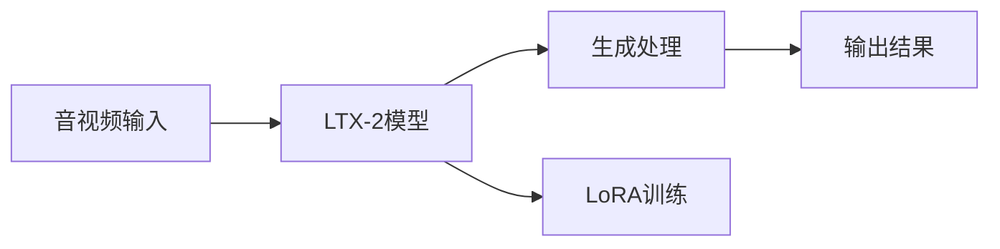
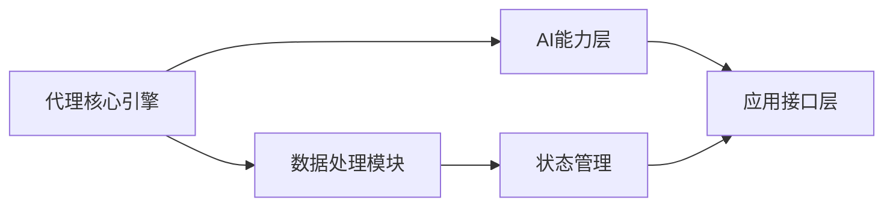
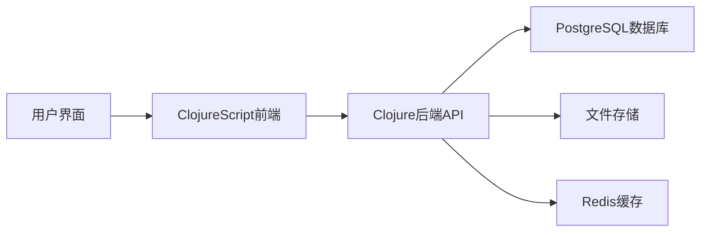

## 今日热点

AI代理技术爆发式增长，代码智能工具大幅提升效率。代理原生应用框架与代码知识图谱技术引领开发范式变革，同时多模态AI在创意领域取得突破。

---

## 热门项目一览

| 排名 | 项目 | 语言 | 今日 | 总计 | 简介 |
|:---:|------|:----:|------:|-----:|------|
| 1 | [chopratejas/headroom](https://github.com/chopratejas/headroom) | Python | +4,005 | 38,877 | Compress tool outputs, logs... |
| 2 | [google-research/timesfm](https://github.com/google-research/timesfm) | Python | +1,510 | 24,109 | TimesFM (Time Series Founda... |
| 3 | [obra/superpowers](https://github.com/obra/superpowers) | Shell | +1,110 | 233,418 | An agentic skills framework... |
| 4 | [DeusData/codebase-memory-mcp](https://github.com/DeusData/codebase-memory-mcp) | C | +1,058 | 8,312 | High-performance code intel... |
| 5 | [palmier-io/palmier-pro](https://github.com/palmier-io/palmier-pro) | Swift | +756 | 1,974 | macOS video editor built fo... |
| 6 | [zai-org/GLM-5](https://github.com/zai-org/GLM-5) | Unknown | +480 | 4,604 | GLM-5: From Vibe Coding to ... |
| 7 | [withastro/flue](https://github.com/withastro/flue) | TypeScript | +309 | 5,856 | The sandbox agent framework. |
| 8 | [n0-computer/iroh](https://github.com/n0-computer/iroh) | Rust | +302 | 10,259 | IP addresses break, dial ke... |
| 9 | [Kong/insomnia](https://github.com/Kong/insomnia) | TypeScript | +292 | 38,995 | The open-source, cross-plat... |
| 10 | [Lightricks/LTX-2](https://github.com/Lightricks/LTX-2) | Python | +196 | 7,681 | Official Python inference a... |
| 11 | [koala73/worldmonitor](https://github.com/koala73/worldmonitor) | TypeScript | +156 | 57,306 | Real-time global intelligen... |
| 12 | [calesthio/OpenMontage](https://github.com/calesthio/OpenMontage) | Python | +156 | 6,331 | World's first open-source, ... |

---

## 趋势洞察

```
┌─────────────────────────────────────────────────────────────────┐
│  AI/ML 工具         ████████████████████████  11 个项目        │
│  开发工具             ████                      2 个项目        │
│  数据分析             ██                        1 个项目        │
│  其他               ██                        1 个项目        │
└─────────────────────────────────────────────────────────────────┘
```

---

## 项目深度解读

### 1. chopratejas/headroom — LLM输入压缩器

> **一句话总结**：通过智能压缩技术减少LLM输入token数量60-95%，同时保持相同的回答质量。

#### 价值主张

| 维度 | 说明 |
|------|------|
| **解决痛点** | 降低LLM API调用成本，提高处理速度，优化资源利用 |
| **目标用户** | 使用LLM API的开发者和企业，特别是处理大量输入数据的应用 |
| **核心亮点** | 高效压缩算法 + 多种部署方式 + 保持回答质量 + 兼容多种数据类型 |

#### 技术架构


**技术特色**：
- 保留关键信息的智能压缩算法
- 库、代理和MCP服务器三种灵活部署方式
- 与现有工作流无缝集成

#### 热度分析

- 项目Star数高达38,877且单日激增4,005，表明LLM成本优化需求急剧增长
- 高Star/Fork比例反映用户更倾向于直接使用而非二次开发，认可度极高

#### 快速上手

```bash
# 安装
pip install headroom

# 基本使用
import headroom
compressed = headroom.compress(your_large_input)
```

#### 注意事项

- 许可证信息不明确，商业使用前需确认许可条款
- 压缩算法可能丢失部分非关键细节，需根据应用场景评估适用性
- 项目无开放Issues，可能处于快速迭代阶段，建议关注更新日志


### 2. google-research/timesfm — 时间序列基础模型

> **一句话总结**：Google Research开发的预训练时间序列基础模型，提供高精度时间序列预测能力。

#### 价值主张

| 维度 | 说明 |
|------|------|
| **解决痛点** | 解决时间序列预测中数据稀缺、领域适应性问题 |
| **目标用户** | 数据科学家、时间序列分析师、预测工程师 |
| **核心亮点** | 预训练模型 + 零样本学习 + 多变量支持 + 高精度预测 |

#### 技术架构


**技术特色**：
- 基于Transformer架构的时间序列建模
- 大规模预训练与少样本学习结合
- 支持多变量时间序列预测
- 提供置信区间估计

#### 热度分析

- 项目短期内增长迅速，单日新增Star超过1500，显示社区高度关注
- 作为Google Research出品的基础模型，在AI时间序列领域占据重要生态位置

#### 快速上手

```bash
# 安装TimesFM
pip install timesfm

# 基本使用示例
import timesfm

# 初始化模型
model = timesfm.TimesFM(pretrained_model="google/timesfm-1.0")

# 进行预测
predictions = model.predict(historical_data, horizon=30)
```

#### 注意事项

- 模型需要大量计算资源，建议在GPU环境中运行
- 预测精度可能因数据特性而异，建议在特定领域进行微调
- 模型对异常值敏感，输入数据需要适当清洗


### 3. obra/superpowers — 开发效能框架

> **一句话总结**：提供实用代理技能框架与软件开发方法论，显著提升开发效率与质量。

#### 价值主张

| 维度 | 说明 |
|------|------|
| **解决痛点** | 解决软件开发流程混乱与方法论缺失问题 |
| **目标用户** | 软件开发团队与追求高效的个人开发者 |
| **核心亮点** | 实用性强 + 方法论完整 + 效果可量化 |

#### 技术架构


**技术特色**：
- 基于Shell实现，轻量级跨平台框架
- 提供完整开发方法论指导
- 无复杂依赖，易于集成到现有流程

#### 热度分析

- 项目获23万+星，日增1100+，社区认可度极高
- 零开放问题，表明框架已成熟稳定，社区维护良好

#### 快速上手

```bash
# 克隆项目
git clone https://github.com/obra/superpowers.git
# 进入目录
cd superpowers
# 查看核心文档
cat README.md
```

#### 注意事项

- 项目文档可能需要进一步补充具体实施细节
- Shell实现在不同操作系统环境下的兼容性需验证


### 4. DeusData/codebase-memory-mcp — 代码智能索引

> **一句话总结**：高性能代码知识图谱索引器，支持158语言，毫秒级索引，99%减少token消耗。

#### 价值主张

| 维度 | 说明 |
|------|------|
| **解决痛点** | 传统代码分析工具性能低、资源消耗大、查询速度慢 |
| **目标用户** | 大型代码库开发者、代码分析工具使用者、AI辅助编程平台 |
| **核心亮点** | 毫秒级索引速度 + 158语言支持 + 99%token减少 + 零依赖 + 单一二进制文件 |

#### 技术架构


**技术特色**：
- 高效多语言解析引擎，支持158种编程语言
- 内存优化的知识图谱存储结构，实现毫秒级索引
- 零依赖设计，单一静态二进制文件部署简便

#### 热度分析

- 项目近期获得大量关注，单日增长1058个star，表明社区对其性能优势高度认可
- 作为零依赖的高性能工具，在开发者社区中具有显著吸引力，尤其适合资源受限环境

#### 快速上手

```bash
# 下载二进制文件
wget https://github.com/DeusData/codebase-memory-mcp/releases/latest/download/codebase-memory-mcp

# 赋予执行权限
chmod +x codebase-memory-mcp

# 运行索引
./codebase-memory-mcp --index /path/to/codebase
```

#### 注意事项

- 项目许可证信息未知，商业使用前需确认授权条款
- 虽然支持158种语言，但对于某些小众语言的支持可能不够完善
- 作为MCP服务器，可能与非MCP兼容的AI工具无法直接集成


### 5. palmier-io/palmier-pro — AI视频编辑工具

> **一句话总结**：专为AI设计的macOS视频编辑工具，融合AI技术提升创作效率。

#### 价值主张

| 维度 | 说明 |
|------|------|
| **解决痛点** | 传统视频编辑软件操作复杂，AI功能有限，无法满足现代创作者需求 |
| **目标用户** | mac平台上的视频创作者、内容制作者和AI技术爱好者 |
| **核心亮点** | AI驱动的智能编辑 + 自动化工作流程 + 高性能处理 + 直观的用户界面 |

#### 技术架构


**技术特色**：
- Swift原生开发，充分利用macOS性能
- 集成AI模型实现智能视频编辑
- 优化的媒体处理管道，支持实时预览

#### 热度分析

- 项目近期获得大量关注（单日增长756星），表明AI视频编辑领域需求旺盛
- 虽然Issue数量为0，但Fork数相对较少，可能项目处于早期阶段或专业性较强

#### 快速上手

```bash
# 克隆项目
git clone https://github.com/palmier-io/palmier-pro.git

# 构建项目
cd palmier-pro
xcodebuild -project palmier-pro.xcodeproj -scheme palmier-pro -configuration Debug build
```

#### 注意事项

- 项目License未知，使用前需确认授权条款
- 项目可能需要较新的macOS版本支持
- 作为AI驱动的工具，可能需要网络连接以访问AI服务


### 6. zai-org/GLM-5 — 大语言模型框架

> **一句话总结**：GLM-5是从编程风格演进到代理工程的大语言模型框架，支持高效智能体开发。

#### 价值主张

| 维度 | 说明 |
|------|------|
| **解决痛点** | 降低大语言模型应用开发门槛，实现从概念到代码的无缝转换 |
| **目标用户** | AI应用开发者、研究人员、企业技术团队 |
| **核心亮点** | 提示工程优化 + 代理工作流设计 + 多模态理解能力 + 高效推理 + 低资源部署 |

#### 技术架构


**技术特色**：
- 基于Transformer的大规模预训练模型
- 支持从简单提示到复杂代理工程的渐进式开发
- 多模态输入输出能力
- 高效的推理优化技术
- 灵活的部署选项

#### 热度分析

- 项目获得4600+ stars且单日增长480，表明社区高度关注和认可
- 零开放问题可能反映项目成熟度高或问题解决机制高效

#### 快速上手

```bash
# 安装GLM-5
pip install glm-5

# 基本使用示例
from glm5 import GLM5
model = GLM5()
response = model.generate("你的提示文本")
print(response)
```

#### 注意事项

- 项目文档可能不够完善，需要参考源码和示例
- 部署可能需要较高计算资源，特别是全参数版本
- 商业使用前需确认许可证条款


### 7. withastro/flue — 沙箱代理框架

> **一句话总结**：提供安全隔离的代码执行环境，构建可信赖的代理系统。

#### 价值主张

| 维度 | 说明 |
|------|------|
| **解决痛点** | 提供安全的代码执行环境，隔离潜在风险代码，防止系统被恶意代码破坏 |
| **目标用户** | 需要执行不可信代码的开发者，如代码执行平台、在线IDE等 |
| **核心亮点** | 沙箱隔离 + TypeScript支持 + 轻量级架构 + 可扩展设计 + 安全边界控制 |

#### 技术架构


**技术特色**：
- 基于TypeScript构建，提供类型安全
- 沙箱隔离技术，防止代码越权访问
- 轻量级设计，易于集成到现有系统

#### 热度分析

- 项目近期增长迅速，单日新增309 stars，表明社区对其高度关注
- 虽然Open Issues为0，但Fork数相对较少，可能项目处于早期发展阶段

#### 快速上手

```bash
# 安装flue
npm install flue

# 创建基本沙箱环境
npx flue init my-sandbox

# 运行代码
npx flue run my-sandbox path/to/code.ts
```

#### 注意事项

- 注意沙箱环境的安全性配置，避免潜在的安全漏洞
- 了解沙箱环境的资源限制，防止资源滥用
- 确保只在可信任的环境中使用，避免敏感数据泄露


### 8. n0-computer/iroh — 密钥寻址网络

> **一句话总结**：基于密钥而非IP地址的模块化网络堆栈，提供更稳定可靠的网络通信方式。

#### 价值主张

| 维度 | 说明 |
|------|------|
| **解决痛点** | 传统IP地址不稳定、难以记忆且不安全的问题 |
| **目标用户** | 分布式系统开发者、去中心化应用构建者 |
| **核心亮点** | 密钥寻址 + 模块化设计 + 高可靠性 + 安全性 + 易用性 |

#### 技术架构


**技术特色**：
- 基于密钥而非IP地址的网络寻址机制
- 模块化网络堆栈设计，便于扩展和定制
- 提供比传统IP更稳定可靠的网络通信方式

#### 热度分析

- 项目Star数超过1万，且近期增长迅速，显示社区高度关注
- Open Issues为0，可能表明项目成熟度高或问题处理机制高效

#### 快速上手

```bash
# 添加依赖到Cargo.toml
iroh = "0.1.0"

# 基本使用示例
use iroh::Node;
let node = Node::new();
let addr = node.listen("0.0.0.0:0").await?;
println!("Node listening on: {}", addr);
```

#### 注意事项

- 项目License未知，使用前需确认开源协议
- 作为新兴网络技术，可能与现有网络基础设施兼容性问题
- 文档可能不够完善，需要一定的Rust网络编程基础


### 9. Kong/insomnia — API客户端工具

> **一句话总结**：跨平台API客户端工具，支持多种协议与存储方式，提升API开发测试效率。

#### 价值主张

| 维度 | 说明 |
|------|------|
| **解决痛点** | 解决API测试工具分散、多协议支持不足、数据同步困难问题 |
| **目标用户** | API开发者、测试工程师、全栈开发者、DevOps工程师 |
| **核心亮点** | 跨平台支持 + 多协议集成 + 云端本地双存储 + Git集成 + 强大的协作功能 |

#### 技术架构


**技术特色**：
- 基于Electron构建的跨桌面应用架构
- TypeScript编写确保类型安全与可维护性
- 插件系统支持功能扩展与定制
- 内置GraphQL语法高亮与智能补全
- 支持环境变量与变量替换机制

#### 热度分析

- 项目Star数近4万，近期日增长近300，表明API测试工具市场需求旺盛
- 作为Kong生态系统的一部分，与API网关产品形成互补，增强开发者工具链完整性

#### 快速上手

```bash
# 安装Insomnia
npm install -g insomnia-cli

# 创建新请求
insomnia create "My API" --method GET --url https://api.example.com

# 运行请求
insomnia run "My API"
```

#### 注意事项

- 由于项目没有明确的许可证信息，商业使用前需要确认授权条款
- 对于大型团队协作，建议使用云端存储功能以确保配置同步
- 复杂环境变量管理可能需要额外学习曲线


### 10. Lightricks/LTX-2 — 音视频生成模型

> **一句话总结**：官方Python工具包，支持LTX-2音视频生成模型的推理与LoRA训练。

#### 价值主张

| 维度 | 说明 |
|------|------|
| **解决痛点** | 统一音视频生成流程，简化多模态内容创作技术门槛 |
| **目标用户** | AI研究人员、内容创作者、音视频开发者 |
| **核心亮点** | 音视频联合生成 + LoRA微调能力 + 高效推理引擎 |

#### 技术架构



**技术特色**：
- 支持音视频多模态联合生成
- 提供LoRA微调功能实现定制化
- 高效的推理引擎优化生成速度

#### 热度分析

- 项目获得7681个星标，单日增长196个，显示社区高度关注
- 作为官方音视频生成工具包，在AI生成内容领域具有战略地位

#### 快速上手

```bash
# 安装LTX-2包
pip install ltx-2

# 基本推理示例
ltx-inference --input video.mp4 --output generated.mp4
```

#### 注意事项

- 需要较高计算资源支持，特别是进行训练时
- 可能需要特定版本的Python和依赖库
- 音视频处理对硬件要求较高


### 11. koala73/worldmonitor — 全球情报监控平台

> **一句话总结**：AI驱动的全球实时情报监控面板，整合新闻聚合、地缘政治和基础设施追踪。

#### 价值主张

| 维度 | 说明 |
|------|------|
| **解决痛点** | 全球信息分散，难以实时掌握全球动态与态势 |
| **目标用户** | 情报分析师、政策制定者、企业战略部门 |
| **核心亮点** | AI新闻聚合 + 实时全球监控 + 统一态势感知界面 + 多源数据整合 + 可视化追踪 |

#### 技术架构


**技术特色**：
- TypeScript实现，保证代码质量和类型安全
- AI驱动的信息处理和智能聚合
- 实时数据流处理和多源数据整合

#### 热度分析

- 项目获57k+星且持续增长，表明有高实用价值与关注度
- 9k+ Fork体现社区活跃度高，二次开发潜力大

#### 快速上手

```bash
# 克隆项目
git clone https://github.com/koala73/worldmonitor.git
cd worldmonitor

# 安装依赖
npm install

# 启动项目
npm start
```

#### 注意事项

- 项目许可证信息未知，使用前需确认开源许可条款
- 可能需要配置数据源API密钥或其他服务凭证
- 作为实时监控系统，需要稳定的服务器环境和网络连接


### 12. calesthio/OpenMontage — AI视频制作平台

> **一句话总结**：首个开源AI视频制作系统，提供12条流水线和52种工具，将AI助手转变为完整视频工作室。

#### 价值主张

| 维度 | 说明 |
|------|------|
| **解决痛点** | 传统视频制作流程复杂、专业门槛高，需要多种软件和技能 |
| **目标用户** | 内容创作者、视频制作人、AI应用开发者、自媒体运营者 |
| **核心亮点** | 全流程AI自动化 + 52种专业工具 + 500+代理技能 + 开源可定制 |

#### 技术架构


**技术特色**：
- 基于Python构建的模块化AI代理系统
- 支持52种专业视频处理工具的协同工作
- 12条并行处理流水线提高制作效率

#### 热度分析

- 项目Star数达6331且日增156，表明用户兴趣持续高涨
- Fork数1084，显示社区积极参与二次开发和功能扩展

#### 快速上手

```bash
# 安装OpenMontage
pip install openmontage

# 初始化项目
openmontage init my-video-project

# 开始制作视频
openmontage produce --script video_script.yaml
```

#### 注意事项

- 项目为开源但许可证未知，使用前需确认具体授权条款
- 系统依赖多种AI工具和模型，可能需要较高计算资源
- 作为新兴项目，API和功能可能仍在快速迭代中


### 13. BuilderIO/agent-native — 智能代理框架

> **一句话总结**：一个用于构建智能代理原生应用的开源框架，融合AI能力与原生开发体验。

#### 价值主张

| 维度 | 说明 |
|------|------|
| **解决痛点** | 简化AI代理应用开发，降低与现有系统集成复杂度 |
| **目标用户** | 前端开发者、AI应用构建者、智能系统工程师 |
| **核心亮点** | 模块化架构设计 + 插件生态系统 + TypeScript强类型支持 + 原生性能优化 |

#### 技术架构



**技术特色**：
- 基于TypeScript的类型安全代理开发
- 模块化的AI能力集成架构
- 高效的状态管理和数据流处理

#### 热度分析

- 项目获得1069个star且单日增长147，表明近期热度显著上升，可能为新发布或重要更新版本
- 作为BuilderIO生态的一部分，该项目可能受益于BuilderIO的社区基础和开发者影响力

#### 快速上手

```bash
# 安装脚手架工具
npm install -g @builderio/agent-native-cli

# 创建新项目
agent-native init my-agent-app

# 启动开发服务器
cd my-agent-app
npm run dev
```

#### 注意事项

- 由于项目没有明确的开源许可证，使用前需确认许可条款
- 项目相对较新（基于star数量增长），API和功能可能还不够稳定
- 可能需要一定的AI/ML基础知识才能充分利用框架功能


### 14. aishwaryanr/awesome-generative-ai-guide — 生成式AI资源库

> **一句话总结**：一站式生成式AI研究资源整合平台，提供最新研究、面试准备和学习笔记。

#### 价值主张

| 维度 | 说明 |
|------|------|
| **解决痛点** | 解决生成式AI领域信息分散、获取困难的痛点 |
| **目标用户** | AI研究人员、开发者、学生及对生成式AI感兴趣的学习者 |
| **核心亮点** | 资源全面性 + 内容更新及时性 + 结构化组织 + 多维度覆盖 |

#### 技术架构

**技术特色**：
- 简洁的HTML页面结构，便于阅读和导航
- 分类清晰的资源组织方式
- 响应式设计，适应不同设备浏览

#### 热度分析

- 项目获得27,653个Star，近期增长稳定，日均新增约100+，显示生成式AI领域热度持续高涨
- 作为awesome系列项目，在生成式AI领域具有标杆地位，是社区获取相关资源的重要入口

#### 快速上手

```bash
# 克隆项目到本地
git clone https://github.com/aishwaryanr/awesome-generative-ai-guide.git

# 在浏览器中打开README.html查看内容
cd awesome-generative-ai-guide
open README.html
```

#### 注意事项

- 项目内容持续更新，建议定期查看最新变化
- 部分链接可能需要网络访问权限，确保网络连接正常
- 由于内容广泛，建议根据个人需求有选择地浏览相关部分


### 15. penpot/penpot — 开源设计协作平台

> **一句话总结**：开源设计工具，实现设计与代码无缝协作，打破设计师与开发者之间的壁垒。

#### 价值主张

| 维度 | 说明 |
|------|------|
| **解决痛点** | 解决设计文件格式不统一、设计与开发脱节的问题 |
| **目标用户** | UI/UX设计师、前端开发人员、产品设计团队 |
| **核心亮点** | 开源可定制 + 多人协作 + 设计与代码同步 + 导出多种格式 + 跨平台支持 |

#### 技术架构



**技术特色**：
- 基于 Clojure/ClojureScript 全栈开发，充分利用 Lisp 语言的灵活性
- 采用微服务架构，支持水平扩展
- 使用 PostgreSQL 作为主数据库，Redis 作为缓存层
- 提供丰富的 RESTful API，便于集成和扩展

#### 热度分析

- 项目 Star 数超过 5 万，且持续增长，表明在开源设计工具领域有较高影响力
- Fork 数相对 Star 数比例适中，表明项目既有较高关注度也有一定程度的社区参与度

#### 快速上手

```bash
# 克隆 Penpot 代码库
git clone https://github.com/penpot/penpot.git

# 安装依赖并启动开发环境
cd penpot && make setup && make run
```

#### 注意事项

- 项目依赖较多，首次运行可能需要较长时间安装依赖
- 本地开发环境需要足够的硬件资源，特别是内存
- 由于是开源项目，商业使用前需确认具体许可证条款


## 今日推荐

| 主题 | 推荐项目 | 亮点 |
|------|----------|------|
| 今日最热 | [chopratejas/headroom](https://github.com/chopratejas/headroom) | Compress tool out... |
| 值得关注 | [google-research/timesfm](https://github.com/google-research/timesfm) | TimesFM (Time Ser... |
| 快速上手 | [obra/superpowers](https://github.com/obra/superpowers) | An agentic skills... |
| 长期潜力 | [DeusData/codebase-memory-mcp](https://github.com/DeusData/codebase-memory-mcp) | High-performance ... |

---

<div align="center">

*Generated on 2026-06-20 | Powered by GitHub Trending Reporter*

</div>