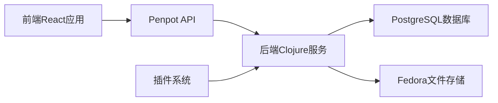

## 今日热点

今日GitHub热榜项目精彩纷呈。

---

## 热门项目一览

| 排名 | 项目 | 语言 | 今日 | 总计 | 简介 |
|:---:|------|:----:|------:|-----:|------|
| 1 | [chopratejas/headroom](https://github.com/chopratejas/headroom) | Python | +3,795 | 42,024 | Compress tool outputs, logs... |
| 2 | [tw93/Pake](https://github.com/tw93/Pake) | Rust | +2,546 | 54,919 | 🤱🏻 Turn any webpage into a ... |
| 3 | [mattpocock/skills](https://github.com/mattpocock/skills) | Shell | +1,395 | 138,332 | Skills for Real Engineers. ... |
| 4 | [DeusData/codebase-memory-mcp](https://github.com/DeusData/codebase-memory-mcp) | C | +1,271 | 9,431 | High-performance code intel... |
| 5 | [palmier-io/palmier-pro](https://github.com/palmier-io/palmier-pro) | Swift | +902 | 3,491 | macOS video editor built fo... |
| 6 | [tursodatabase/turso](https://github.com/tursodatabase/turso) | Rust | +801 | 20,364 | Turso is an in-process SQL ... |
| 7 | [calesthio/OpenMontage](https://github.com/calesthio/OpenMontage) | Python | +677 | 7,123 | World's first open-source, ... |
| 8 | [Kilo-Org/kilocode](https://github.com/Kilo-Org/kilocode) | TypeScript | +513 | 23,386 | Kilo is the all-in-one agen... |
| 9 | [google-research/timesfm](https://github.com/google-research/timesfm) | Python | +433 | 24,578 | TimesFM (Time Series Founda... |
| 10 | [penpot/penpot](https://github.com/penpot/penpot) | Clojure | +420 | 51,503 | Penpot: The open-source des... |
| 11 | [Kong/insomnia](https://github.com/Kong/insomnia) | TypeScript | +329 | 39,346 | The open-source, cross-plat... |
| 12 | [withastro/flue](https://github.com/withastro/flue) | TypeScript | +316 | 6,116 | The sandbox agent framework. |

---

## 趋势洞察

```
┌─────────────────────────────────────────────────────────────────┐
│  AI/ML 工具         ████████████████████████  11 个项目        │
│  开发工具             ████                      2 个项目        │
│  数据分析             ████                      2 个项目        │
│  其他               ████                      2 个项目        │
└─────────────────────────────────────────────────────────────────┘
```

---

## 项目深度解读

### 1. chopratejas/headroom — LLM内容压缩器

> **一句话总结**：智能压缩LLM输入内容，减少60-95%token消耗，保持相同回答质量。

#### 价值主张

| 维度 | 说明 |
|------|------|
| **解决痛点** | LLM处理大量内容时token消耗过高，导致成本增加和响应延迟 |
| **目标用户** | 使用LLM进行开发、数据分析和研究的技术人员 |
| **核心亮点** | 智能压缩算法 + 保持回答质量 + 多种部署方式 + 显著token节省 |

#### 技术架构


**技术特色**：
- 先进的文本压缩算法，保留关键信息
- 多格式支持，包括日志、文件和RAG块
- 透明代理模式，无需修改现有代码

#### 热度分析

- 项目Star数超过4万，单日新增近3800，呈爆发式增长趋势
- 无开放Issues，表明项目成熟稳定，社区问题解决效率高

#### 快速上手

```bash
# 安装headroom
pip install headroom

# 使用headroom代理
headroom --port 8000

# 设置环境变量使用代理
export OPENAI_API=http://localhost:8000
```

#### 注意事项

- 压缩算法可能会丢失某些细微信息，不适合需要高精度保留所有细节的场景
- 需要测试确保压缩后的内容不会影响特定任务的准确性
- 部署时需考虑额外的计算资源用于压缩过程


### 2. tw93/Pake — 网页转桌面工具

> **一句话总结**：一键将任意网页转换为轻量级桌面应用，无需复杂开发流程。

#### 价值主张

| 维度 | 说明 |
|------|------|
| **解决痛点** | 解决网页应用功能受限、体验不佳的问题，提供原生应用体验 |
| **目标用户** | 开发者、产品经理、需要将Web服务打包为桌面应用的用户 |
| **核心亮点** | 一键转换 + 跨平台支持 + 轻量级打包 + 无需修改源代码 + 原生应用体验 |

#### 技术架构


**技术特色**：
- 基于Rust语言开发，提供高性能和内存安全
- 利用Chromium内核渲染网页，保证完整兼容性
- 轻量级封装，无需完整Chromium运行环境

#### 热度分析

- 项目Star数超过5万，近期单日增长2500+，呈现爆发式增长态势
- 无Open Issues表明项目维护良好，社区活跃度高，开发者反馈及时响应

#### 快速上手

```bash
# 安装pake
npm install -g pake-cli

# 将网页转换为桌面应用
pake https://example.com my-app
```

#### 注意事项

- 需要系统已安装Node.js环境
- 生成的应用可能受目标网站CORS策略限制
- 部分复杂JavaScript交互可能无法完美支持


### 3. mattpocock/skills — 工程师技能库

> **一句话总结**：收集真实工程师实用的 shell 技巧与脚本，提升工作效率与生产力。

#### 价值主张

| 维度 | 说明 |
|------|------|
| **解决痛点** | 提供可直接使用的 shell 技巧，解决日常开发中的效率问题 |
| **目标用户** | 需要提高命令行操作效率的软件工程师和系统管理员 |
| **核心亮点** | 实用性高 + 即插即用 + 持续更新 + 社区驱动 |

#### 技术架构


**技术特色**：
- 纯 shell 实现，跨平台兼容性强
- 模块化设计，便于按需使用
- 实用性强，直接解决实际工程问题

#### 热度分析

- 项目获得超过13万星，近1400日增，表明工程师群体高度认可其价值
- Fork 数量达1.2万，说明社区活跃度高，使用者积极贡献和定制

#### 快速上手

```bash
# 克隆项目
git clone https://github.com/mattpocock/skills.git
# 进入目录
cd skills
# 查看可用技能
ls -la
# 使用特定技能
source some-skill.sh
```

#### 注意事项

- 需要基本的 shell 脚本知识才能理解和定制
- 某些技能可能需要特定环境或工具支持
- 建议在使用前先测试脚本，确保符合自己的工作环境


### 4. DeusData/codebase-memory-mcp — 代码记忆引擎

> **一句话总结**：高性能代码智能MCP服务器，将代码库转化为毫秒级查询的知识图谱。

#### 价值主张

| 维度 | 说明 |
|------|------|
| **解决痛点** | 解决代码库索引慢、查询效率低、token消耗大的问题 |
| **目标用户** | 需要高效代码分析和智能导航的开发者与代码分析工具 |
| **核心亮点** | 158种语言支持 + 毫秒级索引 + 亚毫秒级查询 + 99%token减少 + 零依赖部署 |

#### 技术架构


**技术特色**：
- 高性能C语言实现，确保极低资源占用
- 持久化知识图谱存储，加速后续查询
- 零依赖设计，单二进制文件部署

#### 热度分析

- 项目Star数达9431，单日增长1271，呈爆发式增长趋势
- 社区活跃度高，零开放问题表明项目维护良好，生态潜力大

#### 快速上手

```bash
# 下载对应平台的二进制文件
./codebase-memory-mcp init
./codebase-memory-mcp index <path_to_codebase>
./codebase-memory-mcp query "your query"
```

#### 注意事项

- 项目许可证未知，使用时需注意合规性问题
- 虽然支持158种语言，但对某些小众语言的支持可能不够完善
- 项目名称中的"MCP"可能暗示其与特定协议相关，需确认环境兼容性


### 5. palmier-io/palmier-pro — AI视频编辑器

> **一句话总结**：专为AI设计的macOS视频编辑工具，提供智能剪辑与处理功能。

#### 价值主张

| 维度 | 说明 |
|------|------|
| **解决痛点** | 传统视频编辑工具缺乏AI支持，效率低下 |
| **目标用户** | macOS视频创作者、AI应用开发者 |
| **核心亮点** | AI驱动编辑 + 智能内容识别 + 高性能处理 |

#### 技术架构


**技术特色**：
- 基于Swift原生开发，充分利用macOS性能
- 集成AI算法进行视频内容智能分析
- 提供高效的GPU加速处理

#### 热度分析

- Star数增长迅猛，单日增加902，表明项目近期获得高度关注
- Fork数相对较少，说明项目处于早期阶段，社区贡献尚未大规模展开

#### 快速上手

```bash
# 克隆项目
git clone https://github.com/palmier-io/palmier-pro.git
# 构建项目
cd palmier-pro
swift build
```

#### 注意事项

- 项目License未知，使用前需确认授权条款
- 项目处于早期阶段，功能可能尚未完全稳定
- 作为AI驱动的视频编辑器，可能需要较高配置的macOS设备


### 6. tursodatabase/turso — 轻量级 SQL 数据库

> **一句话总结**：Turso 是一个兼容 SQLite 的 Rust 实现的轻量级嵌入式 SQL 数据库，提供高性能和并发支持。

#### 价值主张

| 维度 | 说明 |
|------|------|
| **解决痛点** | 传统 SQLite 在高并发和现代应用场景下的性能限制 |
| **目标用户** | 需要嵌入式高性能数据库的应用开发者和小型团队 |
| **核心亮点** | 与 SQLite API 兼容 + Rust 内存安全 + 高性能并发支持 |

#### 技术架构


**技术特色**：
- 基于 Rust 实现，提供内存安全和并发优势
- 保持与 SQLite API 的完全兼容，降低迁移成本
- 采用现代化存储引擎，提升读写性能
- 支持多线程并发访问，超越传统 SQLite 限制

#### 热度分析

- 项目星标数超2万且日增800+，显示社区对其性能和兼容性的高度认可
- 作为新兴数据库解决方案，正吸引寻求 SQLite 替代品的开发者关注

#### 快速上手

```bash
# 安装 Turso
cargo install turso

# 初始化数据库
turso init mydb

# 启动服务器
turso server

# 连接数据库
turso connect mydb
```

#### 注意事项

- 项目许可证信息不明确，商业使用前需确认授权条款
- 作为较新项目，长期稳定性和生态成熟度有待进一步验证
- 与 SQLite 的完全兼容性可能存在某些边缘情况差异


### 7. calesthio/OpenMontage — AI视频制作平台

> **一句话总结**：将AI助手转变为完整视频制作工作室，提供12个流水线和52个工具，实现自动化视频内容创作。

#### 价值主张

| 维度 | 说明 |
|------|------|
| **解决痛点** | 降低专业视频制作门槛，无需专业技能即可创作高质量视频 |
| **目标用户** | 内容创作者、视频制作爱好者和营销团队 |
| **核心亮点** | 12个专业流水线 + 52种创意工具 + 500+AI代理技能 + 全自动化流程 |

#### 技术架构


**技术特色**：
- 基于大模型的智能内容理解和处理
- 模块化工具架构支持灵活工作流
- 多代理协作系统实现复杂视频制作任务

#### 热度分析

- 项目单日增长677个Star，显示极高的市场关注度和采用率
- Fork数1,158表明社区活跃度高，用户积极参与二次开发

#### 快速上手

```bash
# 克隆仓库
git clone https://github.com/calesthio/OpenMontage.git

# 安装依赖并运行
cd OpenMontage
pip install -r requirements.txt
python openmontage --input your_video.mp4 --config default.yaml
```

#### 注意事项

- 项目需要较高计算资源，建议使用GPU加速处理
- 部分功能可能需要额外API密钥或订阅服务
- 许可证信息不明确，使用前需确认授权条款


### 8. Kilo-Org/kilocode — 智能编码平台

> **一句话总结**：集成流行开源编码代理的全栈智能工程平台，加速软件构建部署迭代。

#### 价值主张

| 维度 | 说明 |
|------|------|
| **解决痛点** | 软件开发效率低下，缺乏智能辅助工具加速编码与部署流程 |
| **目标用户** | 软件开发者、DevOps团队、AI辅助开发爱好者 |
| **核心亮点** | 全栈工程平台 + AI编码代理 + 开源生态 + 快速迭代 + 一体化体验 |

#### 技术架构


**技术特色**：
- 基于TypeScript构建，确保代码质量与类型安全
- 集成多种开源编码代理，提供智能辅助能力
- 全栈工程支持，覆盖开发全生命周期

#### 热度分析

- 单日增长513星，23k+总星数，项目热度持续攀升，社区认可度高
- 作为AI辅助开发领域热门项目，处于开源编码代理平台生态核心位置

#### 快速上手

```bash
# 安装Kilo CLI工具
npm install -g @kilo/cli

# 初始化项目
kilo init my-project

# 启动开发环境
kilo dev
```

#### 注意事项

- 项目许可证未知，商业使用前需确认授权条款
- 当前无公开issues，可能通过其他渠道反馈问题，建议加入官方社区获取支持


### 9. google-research/timesfm — 时间序列预测模型

> **一句话总结**：谷歌研发的预训练时间序列基础模型，提供跨领域高精度预测能力，降低专业门槛。

#### 价值主张

| 维度 | 说明 |
|------|------|
| **解决痛点** | 解决传统时间序列预测模型需大量领域数据和专业知识的问题 |
| **目标用户** | 数据科学家、分析师、需要预测业务指标的业务决策者 |
| **核心亮点** | 预训练基础模型 + 跨领域适用性 + 高精度预测 + 易于微调 + 低资源需求 |

#### 技术架构


**技术特色**：
- 基于Transformer架构的时间序列基础模型
- 预训练在大规模多元时间序列数据上
- 提供简化API接口，降低使用门槛

#### 热度分析

- 项目短期内获得大量关注，Star数增长迅速，显示时间序列基础模型领域的热度攀升
- 作为Google研究项目，在AI和数据分析领域具有较高影响力和生态位置

#### 快速上手

```bash
# 安装TimesFM
pip install timesfm

# 基本使用示例
import timesfm
model = timesfm.TimesFM()
predictions = model.predict(historical_data, horizon=24)
```

#### 注意事项

- 模型推理需要一定的计算资源，特别是长序列预测
- 对于特定领域的预测任务，可能需要使用领域数据进行微调
- 需确保输入数据格式符合模型要求，包括适当的归一化和预处理


### 10. penpot/penpot — 开源设计协作

> **一句话总结**：Penpot 是一个开源设计工具，专为设计师和开发者之间的无缝协作而构建。

#### 价值主张

| 维度 | 说明 |
|------|------|
| **解决痛点** | 打破设计与开发之间的壁垒，提供开源协作设计平台 |
| **目标用户** | 设计师、前端开发者和产品团队 |
| **核心亮点** | 开源透明 + 协作工作流 + 代码导出 + 自托管部署 + 跨平台支持 |

#### 技术架构



**技术特色**：
- 基于 Clojure 和 ClojureScript 构建，利用 JVM 性能和前端 React 生态
- 采用 ClojureScript 前端实现，确保前后端语言一致性
- 支持插件架构，可扩展功能增强
- 使用 PostgreSQL 作为主数据库，Fedora 存储文件资源
- 提供 REST API 和 GraphQL 接口，便于集成

#### 热度分析

- Star 数量超过5万，且每日持续增长420+，表明社区活跃度高且认可度强
- 作为开源设计工具，在 Figma 主导的市场中展现出强劲的竞争力和社区支持

#### 快速上手

```bash
# 克隆仓库
git clone https://github.com/penpot/penpot.git

# 安装依赖并启动开发环境
cd penpot
make install
make run
```

#### 注意事项

- 需要了解 Clojure 生态系统才能进行深度定制或贡献
- 完整部署需要较多系统资源，建议在服务器环境中运行
- 插件开发需要熟悉 Penpot 的 API 和架构设计


### 11. Kong/insomnia — 全能API测试工具

> **一句话总结**：跨平台API客户端，支持多种协议，提供云端、本地和Git存储的完整解决方案。

#### 价值主张

| 维度 | 说明 |
|------|------|
| **解决痛点** | API测试工具分散不统一，提供一站式解决方案 |
| **目标用户** | API开发者、测试工程师、全栈开发人员 |
| **核心亮点** | 支持多协议 + 跨平台 + 多种存储方式 + 开源免费 + 强大的团队协作 |

#### 技术架构


**技术特色**：
- 使用TypeScript开发，保证类型安全和代码质量
- 支持多种API协议，覆盖不同场景需求
- 提供多种存储选项，满足不同团队协作需求

#### 热度分析

- 项目拥有39,346个Star且持续增长，表明项目活跃度高且受欢迎
- Fork数相对较少，说明用户更倾向于直接使用而非贡献代码，可能因为项目已相当成熟

#### 快速上手

```bash
# 安装Insomnia
npm install -g insomnia

# 初始化新项目
insomnia-cli init my-api-project
```

#### 注意事项

- 项目许可证未知，可能存在商业使用限制
- Open Issues为0，可能是因为项目使用了其他问题跟踪系统


### 12. withastro/flue — 沙盒代理框架

> **一句话总结**：一个基于TypeScript的轻量级沙盒代理框架，提供安全隔离的代码执行环境。

#### 价值主张

| 维度 | 说明 |
|------|------|
| **解决痛点** | 解决代码执行环境隔离与安全控制问题，防止恶意代码影响主系统 |
| **目标用户** | 需要安全执行第三方代码的开发者、测试人员与安全研究员 |
| **核心亮点** | 轻量级隔离机制 + 资源限制控制 + 异常隔离处理 + 事件驱动通信 + TypeScript类型安全 |

#### 技术架构


**技术特色**：
- 采用TypeScript实现类型安全的沙盒环境，减少运行时错误
- 轻量级资源隔离机制，避免系统权限提升风险
- 事件驱动架构，支持异步代理通信与状态管理

#### 热度分析

- 项目近期增长迅速，单日新增316星，表明社区关注度持续上升
- 作为Astro生态系统的新成员，可能受益于Astro社区的快速增长与开发者信任

#### 快速上手

```bash
# 安装flue
npm install @withastro/flue

# 初始化沙盒环境
npx @withastro/flue init my-sandbox

# 启动沙盒服务
npx @withastro/flue start
```

#### 注意事项
- 需要关注项目的许可证信息，目前显示为"Unknown"
- 由于是沙盒环境，需要仔细配置资源限制以避免潜在的安全风险
- 可能需要额外的配置才能支持特定的运行环境或依赖库


### 13. jamiepine/voicebox — AI语音克隆工具

> **一句话总结**：开源AI语音工作室，支持语音克隆、听写与创作，打造个性化声音体验。

#### 价值主张

| 维度 | 说明 |
|------|------|
| **解决痛点** | 解决传统语音合成工具克隆效果差、定制化程度低的问题 |
| **目标用户** | 内容创作者、语音开发者、AI爱好者及需要定制化语音解决方案的用户 |
| **核心亮点** | 高质量语音克隆 + 多语言支持 + 实时处理能力 + 开源可定制 |

#### 技术架构


**技术特色**：
- 基于先进AI模型的语音克隆技术
- 支持多种语言和口音的语音处理
- 实时语音处理与生成能力

#### 热度分析

- 项目获得超过31k星，近期增长稳定，表明社区认可度高
- 无开放问题，可能表明项目成熟度高或问题处理机制完善

#### 快速上手

```bash
# 克隆项目
git clone https://github.com/jamiepine/voicebox.git

# 安装依赖
npm install

# 启动应用
npm start
```

#### 注意事项

- 由于没有明确的许可证信息，使用前需确认开源协议
- 可能需要一定的AI和语音处理知识才能充分利用项目功能


### 14. twentyhq/twenty — AI驱动CRM

> **一句话总结**：开源AI驱动的CRM平台，替代Salesforce的企业级解决方案

#### 价值主张

| 维度 | 说明 |
|------|------|
| **解决痛点** | 企业级CRM功能高昂成本，AI集成复杂 |
| **目标用户** | 中小型企业及需要AI增强的CRM用户 |
| **核心亮点** | 开源替代Salesforce + AI增强功能 + 企业级功能 + 经济实惠 + 易于定制 |

#### 技术架构

**技术特色**：
- 基于TypeScript构建，确保类型安全和代码质量
- 采用模块化架构设计，支持高度可扩展的AI功能集成
- 开源架构允许完全定制和私有化部署

#### 热度分析

- Star数量超过5万，且持续增长，表明项目获得广泛关注和认可
- Fork数与Star数比例适中，显示社区活跃度高，实际使用情况良好

#### 快速上手

```bash
# 克隆仓库
git clone https://github.com/twentyhq/twenty.git

# 安装依赖
cd twenty && npm install

# 启动开发服务器
npm run dev
```

#### 注意事项

- 项目许可证不明确，使用前需确认具体的开源许可证条款
- 作为Salesforce的替代品，可能需要考虑数据迁移和兼容性问题
- 项目较新，长期稳定性和生态系统成熟度有待观察


### 15. pppscn/SmsForwarder — 短信多端转发工具

> **一句话总结**：Android短信/来电/通知监控转发工具，支持多平台接收，实现远程手机信息管理。

#### 价值主张

| 维度 | 说明 |
|------|------|
| **解决痛点** | 无法实时获取远离手机的重要信息，如验证码、紧急通知等 |
| **目标用户** | 需要远程监控手机信息的管理员、家长或多设备同步用户 |
| **核心亮点** | 多平台信息监控 + 10+种转发方式支持 + 远程控制与查询功能 |

#### 技术架构


**技术特色**：
- 使用Kotlin开发，充分利用现代Android开发特性
- 支持多种通知监听机制，确保信息捕获全面
- 模块化转发系统，易于扩展新的转发方式

#### 热度分析

- 26,509个Star且持续增长，表明该项目在短信转发领域有较高实用价值
- 零Open Issues显示项目维护良好，社区反馈机制高效

#### 快速上手

```bash
# 下载APK并安装到Android设备
# 启用通知监听权限
# 配置转发规则和目标平台
```

#### 注意事项

- 需要Android设备作为信息源
- 部分功能可能需要额外敏感权限
- 转发平台需要提前配置密钥和规则


### 16. 1jehuang/jcode — 代码智能助手

> **一句话总结**：基于 Rust 的代码智能助手框架，提升编程效率与代码质量。

#### 价值主张

| 维度 | 说明 |
|------|------|
| **解决痛点** | 解决代码生成效率低、代码质量参差不齐问题 |
| **目标用户** | 软件开发者、代码审查人员、自动化测试工程师 |
| **核心亮点** | 基于 Rust 构建 + 代码智能生成 + 多语言支持 + 高性能 + 可扩展架构 |

#### 技术架构


**技术特色**：
- 基于 Rust 实现高性能代码处理
- 采用智能代理架构增强代码生成能力
- 提供多语言代码生成与转换功能

#### 热度分析

- 项目获7400+星，近期增长稳定，表明受开发者社区广泛认可
- Fork 数量适中，表明项目可能已进入稳定维护阶段

#### 快速上手

```bash
# 克隆项目
git clone https://github.com/1jehuang/jcode.git
cd jcode

# 构建项目
cargo build --release

# 运行示例
cargo run --example basic_usage
```

#### 注意事项

- 项目许可证未知，使用前需确认商业友好性
- 作为代码生成工具，可能需要谨慎处理生成的代码质量
- 项目可能需要一定的 Rust 编程基础才能充分利用


### 17. owainlewis/awesome-artificial-intelligence — AI资源精选

> **一句话总结**：精选的人工智能学习资源集合，涵盖课程、书籍、视频和论文，为AI学习者提供全面的学习路径。

#### 价值主张

| 维度 | 说明 |
|------|------|
| **解决痛点** | 解决AI学习资源分散、质量参差不齐的问题，提供精选优质资源集合。 |
| **目标用户** | AI初学者、研究人员、工程师和希望系统学习AI的人士。 |
| **核心亮点** | 资源精选 + 分类清晰 + 持续更新 + 覆盖全面 |

#### 技术架构

**技术特色**：
- 基于Markdown的简单结构，便于维护和阅读
- 分类组织清晰，按学习资源类型分组
- 社区驱动，持续更新和扩充资源

#### 热度分析
- 超过1.4万Star，显示项目在AI学习领域有显著影响力，持续获得社区认可
- 作为awesome系列项目，在AI学习资源领域占据重要位置，成为许多学习者的首选参考

#### 快速上手

```bash
# 克隆项目到本地
git clone https://github.com/owainlewis/awesome-artificial-intelligence.git

# 或直接在GitHub上浏览README.md文件
# https://github.com/owainlewis/awesome-artificial-intelligence
```

#### 注意事项
- 资源链接可能需要定期更新，避免失效
- 不同资源的学习难度和深度差异较大，建议根据自身水平选择适合的内容
- 项目依赖社区贡献维护，新资源发现需要积极参与


## 今日推荐

| 主题 | 推荐项目 | 亮点 |
|------|----------|------|
| 今日最热 | [chopratejas/headroom](https://github.com/chopratejas/headroom) | Compress tool out... |
| 值得关注 | [tw93/Pake](https://github.com/tw93/Pake) | 🤱🏻 Turn any webpa... |
| 快速上手 | [mattpocock/skills](https://github.com/mattpocock/skills) | Skills for Real E... |
| 长期潜力 | [DeusData/codebase-memory-mcp](https://github.com/DeusData/codebase-memory-mcp) | High-performance ... |

---

<div align="center">

*Generated on 2026-06-21 | Powered by GitHub Trending Reporter*

</div>