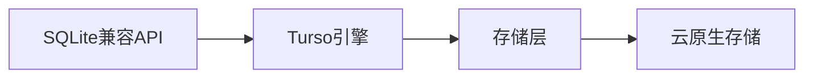
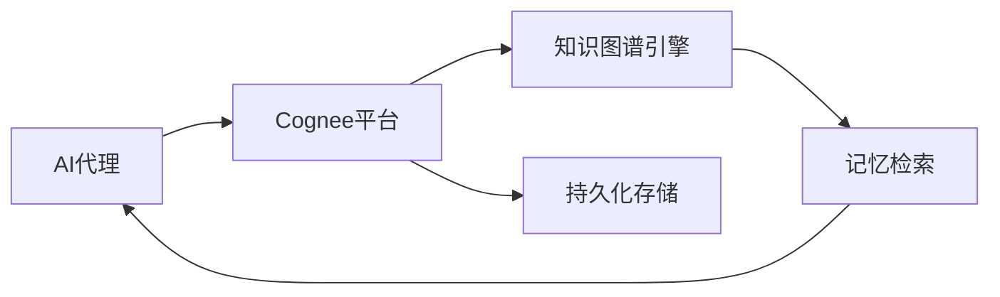

## 今日热点

AI代理系统与工具链持续火热，代码智能与记忆系统兴起，视频生产与网络安全领域AI应用激增，开源数据库技术获关注。

---

## 热门项目一览

| 排名 | 项目 | 语言 | 今日 | 总计 | 简介 |
|:---:|------|:----:|------:|-----:|------|
| 1 | [chopratejas/headroom](https://github.com/chopratejas/headroom) | Python | +2,624 | 44,726 | Compress tool outputs, logs... |
| 2 | [palmier-io/palmier-pro](https://github.com/palmier-io/palmier-pro) | Swift | +1,834 | 5,407 | macOS video editor built fo... |
| 3 | [mattpocock/skills](https://github.com/mattpocock/skills) | Shell | +1,443 | 139,975 | Skills for Real Engineers. ... |
| 4 | [penpot/penpot](https://github.com/penpot/penpot) | Clojure | +1,135 | 52,323 | Penpot: The open-source des... |
| 5 | [DeusData/codebase-memory-mcp](https://github.com/DeusData/codebase-memory-mcp) | C | +1,032 | 10,441 | High-performance code intel... |
| 6 | [calesthio/OpenMontage](https://github.com/calesthio/OpenMontage) | Python | +987 | 9,052 | World's first open-source, ... |
| 7 | [ZhuLinsen/daily_stock_analysis](https://github.com/ZhuLinsen/daily_stock_analysis) | Python | +568 | 44,676 | LLM 驱动的多市场股票智能分析系统：多源行情、实时新... |
| 8 | [tursodatabase/turso](https://github.com/tursodatabase/turso) | Rust | +548 | 20,863 | Turso is an in-process SQL ... |
| 9 | [bytedance/deer-flow](https://github.com/bytedance/deer-flow) | Python | +442 | 72,661 | An open-source long-horizon... |
| 10 | [mukul975/Anthropic-Cybersecurity-Skills](https://github.com/mukul975/Anthropic-Cybersecurity-Skills) | Python | +361 | 17,789 | 754 structured cybersecurit... |
| 11 | [topoteretes/cognee](https://github.com/topoteretes/cognee) | Python | +347 | 18,693 | Cognee is the open-source A... |
| 12 | [smicallef/spiderfoot](https://github.com/smicallef/spiderfoot) | Python | +294 | 18,801 | SpiderFoot automates OSINT ... |

---

## 趋势洞察

```
┌─────────────────────────────────────────────────────────────────┐
│  AI/ML 工具         ████████████████████████  10 个项目        │
│  数据分析             ████                      2 个项目        │
│  其他               ████                      2 个项目        │
│  多媒体应用            ██                        1 个项目        │
│  开发工具             ██                        1 个项目        │
└─────────────────────────────────────────────────────────────────┘
```

---

## 项目深度解读

### 1. chopratejas/headroom — 智能数据压缩

> **一句话总结**：headroom是一个在LLM处理前智能压缩数据的技术，可减少60-95%token同时保持答案质量。

#### 价值主张

| 维度 | 说明 |
|------|------|
| **解决痛点** | LLM处理前数据量过大导致的成本和效率问题 |
| **目标用户** | 使用LLM的应用开发者和企业用户 |
| **核心亮点** | 智能压缩算法 + 多种部署形式 + 极致压缩比 |

#### 技术架构


**技术特色**：
- 专为大语言模型输入优化的智能压缩算法
- 支持多种数据格式和来源的统一处理
- 提供库、代理和MCP服务器三种部署方式

#### 热度分析

- 项目近期热度激增，单日增长超2600 stars，表明技术获得广泛认可
- 高star和fork比例反映社区高度认可和积极参与

#### 快速上手

```bash
# 安装headroom
pip install headroom

# 使用headroom处理数据
headroom compress input.txt > compressed_output.txt
```

#### 注意事项

- 压缩算法可能对某些特定类型的数据效果有限
- 需要确保压缩后的数据不会影响LLM的推理质量
- 许可证信息不明确，使用前需确认授权条款


### 2. palmier-io/palmier-pro — [AI视频编辑器]

> **一句话总结**：专为macOS设计的AI驱动视频编辑工具，简化视频创作流程

#### 价值主张

| 维度 | 说明 |
|------|------|
| **解决痛点** | 传统视频编辑工具复杂，AI辅助降低使用门槛 |
| **目标用户** | macOS视频创作者、内容创作者、短视频制作者 |
| **核心亮点** | AI辅助编辑 + 直观界面 + 高性能处理 + 专业级输出 |

#### 技术架构


**技术特色**：
- 基于Swift开发的macOS原生应用，性能优异
- 集成机器学习模型进行智能视频内容识别和分析
- 提供AI驱动的自动剪辑、特效和转场建议

#### 热度分析

- 项目一天内新增1,834个Star，增长迅猛，显示市场强烈需求
- 0个Open Issues表明项目处于初期阶段，社区反馈尚未积累

#### 快速上手

```bash
# 克隆项目
git clone https://github.com/palmier-io/palmier-pro.git
# 进入项目目录
cd palmier-pro
# 构建项目（需要Xcode）
xcodebuild -project Palmier.xcodeproj -scheme Palmier -configuration Debug build
```

#### 注意事项

-


### 3. mattpocock/skills — 工程师技能库

> **一句话总结**：收集真实工程师实用技能，提供直接可用的工程解决方案和最佳实践。

#### 价值主张

| 维度 | 说明 |
|------|------|
| **解决痛点** | 提供工程师日常工作中需要的实用技能和技巧，解决实际问题。 |
| **目标用户** | 软件开发工程师和技术爱好者。 |
| **核心亮点** | 实用性强 + 直接可执行 + 最佳实践分享 + 实战导向 |

#### 技术架构


**技术特色**：
- 使用Shell脚本实现，跨平台兼容性强
- 直接从实际经验提取，确保实用性
- 结构化组织，便于查找和应用

#### 热度分析

- 项目获得14万+星标，近期增长迅速，反映开发者社区对实用技能的强烈需求。
- 作为工程师技能分享平台，在开发工具生态中占据独特位置，促进知识共享。

#### 快速上手

```bash
# 克隆仓库
git clone https://github.com/mattpocock/skills.git

# 浏览技能目录
cd skills && ls
```

#### 注意事项

- 项目许可证未知，使用前需确认授权条款
- 技能可能需要根据个人环境进行适当调整
- 部分技能可能需要特定工具支持


### 4. penpot/penpot — 开源设计协作平台

> **一句话总结**：Penpot 是一款开源设计工具，实现设计师与开发者之间的无缝协作，提供设计到代码的完整工作流。

#### 价值主张

| 维度 | 说明 |
|------|------|
| **解决痛点** | 打破设计与开发之间的壁垒，实现设计稿到代码的直接转换 |
| **目标用户** | UI/UX 设计师、前端开发团队及产品协作团队 |
| **核心亮点** | 开源透明 + 实时协作 + 设计系统 + 代码导出 + 跨平台支持 |

#### 技术架构


**技术特色**：
- 基于 Clojure/ClojureScript 构建，提供高性能和并发处理能力
- 采用前后端分离架构，支持实时协作和版本控制
- 提供丰富的 REST API，便于与其他开发工具集成

#### 热度分析

- 项目 Star 数持续快速增长，日均增长约1000+，表明社区认可度高
- 在 Figma 和 Sketch 主导的设计工具市场中，作为开源替代品占据独特生态位

#### 快速上手

```bash
# 克隆仓库
git clone https://github.com/penpot/penpot.git

# 使用 Docker 启动
docker-compose up -d
```

#### 注意事项

- 项目使用 Clojure 技术栈，需要开发者具备相关语言知识
- 部署可能需要较多资源，特别是对于团队协作场景
- 作为较新的项目，生态系统和插件可能仍在发展中


### 5. DeusData/codebase-memory-mcp — 代码智能索引

> **一句话总结**：高性能代码库智能索引工具，将代码转化为可快速查询的知识图谱，支持158种语言。

#### 价值主张

| 维度 | 说明 |
|------|------|
| **解决痛点** | 传统代码分析工具性能低、查询慢、资源消耗大 |
| **目标用户** | 软件开发者、代码分析工具使用者、代码库维护者 |
| **核心亮点** | 支持158种语言 + 毫秒级查询 + 99%减少token使用 + 单一二进制文件 + 零依赖 |

#### 技术架构


**技术特色**：
- 使用C语言编写，确保高性能和低资源消耗
- 将代码转化为持久化知识图谱，支持复杂语义查询
- 单一二进制文件设计，部署简单，无需依赖

#### 热度分析

- 项目获得超1万星，单日增长超1000，显示极强的社区关注度和实用价值
- 无开放Issues表明项目成熟稳定，社区可能通过其他渠道提供反馈

#### 快速上手

```bash
# 下载静态二进制文件
./codebase-memory-mcp init /path/to/codebase
./codebase-memory-mcp query "function_name"
```

#### 注意事项

- 项目使用C语言编写，可能需要一定的系统知识才能正确部署和使用
- 虽然项目描述支持158种语言，但可能存在一些边缘语言支持不完善的情况
- 由于是静态二进制文件，不同平台可能需要下载对应版本才能使用


### 6. calesthio/OpenMontage — AI视频制作平台

> **一句话总结**：开源AI驱动的全栈视频制作系统，将编程助手转变为专业视频工作室。

#### 价值主张

| 维度 | 说明 |
|------|------|
| **解决痛点** | 降低视频制作专业门槛，让普通用户也能制作高质量视频内容 |
| **目标用户** | 内容创作者、视频制作人、AI开发者、小型制作团队 |
| **核心亮点** | 12个专业流水线 + 52种制作工具 + 500+AI代理技能 + 开源可定制 |

#### 技术架构


**技术特色**：
- 基于Python的开源架构，模块化设计易于扩展
- AI驱动的自动化视频处理流水线，支持复杂工作流
- 500+种专业级视频处理技能集，覆盖制作全流程

#### 热度分析
- 单日增长987个Star，显示项目正经历爆发式增长，AI视频生成领域关注度极高
- Fork数1,328表明社区活跃度高，用户积极参与二次开发和功能定制

#### 快速上手

```bash
# 克隆仓库
git clone https://github.com/calesthio/OpenMontage.git

# 安装依赖
pip install -r requirements.txt

# 运行示例
python examples/basic_video_production.py
```

#### 注意事项
- 项目可能需要较高的计算资源，特别是处理高清视频时
- 由于AI模型特性，生成结果可能需要多次尝试才能获得满意效果
- 项目可能需要一定的编程知识才能充分利用其功能
- 许可证信息不明确，商业使用前需确认授权条款


### 7. ZhuLinsen/daily_stock_analysis — 智能股票分析

> **一句话总结**：基于LLM的多市场股票智能分析系统，整合行情、新闻与决策功能，支持零成本定时运行。

#### 价值主张

| 维度 | 说明 |
|------|------|
| **解决痛点** | 解决传统股票分析信息分散、分析效率低、决策依据不足的问题 |
| **目标用户** | 股票投资者、金融分析师、量化交易爱好者 |
| **核心亮点** | LLM智能分析 + 多源数据整合 + 自动化决策推送 + 零成本运行 |

#### 技术架构


**技术特色**：
- 基于大语言模型的智能分析技术
- 多源数据实时采集与整合
- 零成本定时运行机制
- 自动化决策流程

#### 热度分析

- 项目热度持续攀升，日均增长约580个Star，表明市场高度认可
- Fork数接近Star数，反映社区活跃度高，用户参与度强
- 无Open Issues，说明项目维护良好，问题响应及时

#### 快速上手

```bash
# 克隆项目
git clone https://github.com/ZhuLinsen/daily_stock_analysis.git
cd daily_stock_analysis

# 安装依赖并运行
pip install -r requirements.txt
python app.py
```

#### 注意事项

- 需要配置API密钥以获取市场数据和新闻信息
- 系统可能需要定期更新以适应市场变化和LLM模型升级
- 投资决策应结合个人风险承受能力，不依赖完全自动化分析


### 8. tursodatabase/turso — SQLite云原生替代

> **一句话总结**：Turso是高性能、云原生的SQLite兼容数据库，提供现代应用所需的扩展性和协作能力。

#### 价值主张

| 维度 | 说明 |
|------|------|
| **解决痛点** | 解决SQLite在云环境中的扩展性和协作限制，同时保持API兼容性 |
| **目标用户** | 需SQLite兼容性但需更高性能和云能力的现代Web应用开发者 |
| **核心亮点** | + 与SQLite完全兼容 + 云原生架构 + 高性能读写 + 实时同步 + 易于部署 |

#### 技术架构



**技术特色**：
- 基于Rust编写，提供内存安全和性能优势
- 保持SQLite API兼容性，降低迁移成本
- 采用现代化存储引擎设计，支持高性能读写

#### 热度分析

- 项目Star数超2万，近期日均增长500+，社区关注度极高
- Open Issues为0，表明项目管理严格或处于早期阶段，社区活跃度高

#### 快速上手

```bash
# 安装Turso
curl -fsSL https://get.turso.tech/cli | sh

# 初始化数据库
turso db init mydb

# 连接到数据库
turso db shell mydb
```

#### 注意事项

- 项目许可证未知，使用前需确认开源许可条款
- 作为较新的项目，生态系统和工具链可能仍在发展中
- 与SQLite的完全兼容性需要进一步验证，特别是高级功能


### 9. bytedance/deer-flow — 长期任务智能体

> **一句话总结**：字节开源的长周期任务智能体框架，支持多级任务处理与自动执行。

#### 价值主张

| 维度 | 说明 |
|------|------|
| **解决痛点** | 解决复杂长期任务的自动化处理问题，减少人工干预 |
| **目标用户** | 需要自动化处理复杂任务的研究人员与开发者 |
| **核心亮点** | 沙箱隔离 + 记忆系统 + 工具集成 + 多代理协作 + 消息网关 |

#### 技术架构


**技术特色**：
- 多级代理协作架构，支持复杂任务分解
- 沙箱环境隔离，确保安全执行
- 智能记忆系统，支持长期任务上下文保持

#### 热度分析

- 项目Star数已达7.2万，单日增长442，热度上升迅速
- 作为字节跳动开源项目，在AI自动化领域具有重要生态地位

#### 快速上手

```bash
# 克隆项目
git clone https://github.com/bytedance/deer-flow.git
cd deer-flow
pip install -r requirements.txt
deer-flow --help
```

#### 注意事项

- 项目许可证信息未知，商业使用需注意版权问题
- 由于是长期任务处理系统，可能需要较高的计算资源
- 项目尚未公开Issues，可能处于早期阶段，稳定性有待验证


### 10. mukul975/Anthropic-Cybersecurity-Skills — AI安全技能库

> **一句话总结**：为AI代理提供结构化网络安全技能库，映射五大安全框架，支持多平台集成。

#### 价值主张

| 维度 | 说明 |
|------|------|
| **解决痛点** | 网络安全领域缺乏系统化的AI代理技能集，难以将AI有效应用于安全领域 |
| **目标用户** | AI安全研究员、网络安全团队、AI开发者、安全工具构建者 |
| **核心亮点** | 754个结构化安全技能 + 映射到5个主流安全框架 + 支持20+AI平台 |

#### 技术架构


**技术特色**：
- 基于agentskills.io标准的数据结构
- 支持MITRE ATT&CK等五大安全框架映射
- 提供跨平台兼容性接口

#### 热度分析

- 项目获17,789个Star，单日增长361，显示持续高关注度
- Fork数为2,135，表明社区积极采用和贡献

#### 快速上手

```bash
# 克隆项目
git clone https://github.com/mukul975/Anthropic-Cybersecurity-Skills.git

# 安装依赖
pip install -r requirements.txt
```

#### 注意事项

- 项目许可证在GitHub显示为Unknown，但描述中提到Apache 2.0，需确认实际许可证
- 项目未提及具体的维护更新频率和版本管理策略


### 11. topoteretes/cognee — [AI记忆平台]

> **一句话总结**：为AI代理提供持久化长期记忆的开源平台，基于自托管知识图谱引擎。

#### 价值主张

| 维度 | 说明 |
|------|------|
| **解决痛点** | 解决AI代理跨会话记忆缺失问题，实现长期知识积累 |
| **目标用户** | AI开发者、智能系统构建者、需要长期记忆的AI应用开发者 |
| **核心亮点** | 自托管知识图谱引擎 + 持久化长期记忆 + 跨会话记忆保留 + 开源可定制 |

#### 技术架构



**技术特色**：
- 基于Python构建，易于集成到现有AI系统
- 自托管知识图谱引擎，保证数据安全与隐私
- 跨会话记忆保留，增强AI代理的连贯性

#### 热度分析

- Star数达18693且近期增长明显(+347)，表明项目受关注度高且处于上升期
- Fork数1972，说明社区参与度高，项目具有良好的可扩展性和二次开发价值

#### 快速上手

```bash
# 安装Cognee
pip install cognee

# 初始化知识图谱引擎
cognee init

# 为AI代理添加记忆
cognee add-memory "你的AI需要记住的信息"
```

#### 注意事项

- 需要自行托管知识图谱引擎，对技术能力有一定要求
- 作为开源项目，可能需要自行维护和更新
- 项目文档可能需要进一步完善，以降低使用门槛


### 12. smicallef/spiderfoot — 自动化OSINT工具

> **一句话总结**：SpiderFoot是一款自动化开源情报收集工具，帮助用户高效进行威胁情报分析和攻击面映射。

#### 价值主张

| 维度 | 说明 |
|------|------|
| **解决痛点** | 自动化收集网络空间开源情报，减少人工情报收集工作负担 |
| **目标用户** | 网络安全分析师、威胁情报研究员、渗透测试人员 |
| **核心亮点** | 自动化OSINT收集 + 支持多种数据源 + 可视化攻击面 + 插件架构扩展 |

#### 技术架构


**技术特色**：
- 基于Python的跨平台架构设计
- 模块化插件系统支持功能扩展
- 集成数百种OSINT数据源的统一接口

#### 热度分析

- 项目Star数持续稳定增长，今日新增294星，表明项目活跃度高且受社区认可
- 作为OSINT领域的重要工具，拥有庞大的用户基础和活跃的开发社区

#### 快速上手

```bash
# 克隆仓库
git clone https://github.com/smicallef/spiderfoot.git
# 安装依赖
pip install -r requirements.txt
# 运行SpiderFoot
python sf.py
```

#### 注意事项

- 使用时需遵守相关法律法规，不得用于非法目的
- 部分数据源可能有使用限制，需遵守其服务条款
- 处理敏感信息时需注意数据保护


### 13. asgeirtj/system_prompts_leaks — AI系统提示库

> **一句话总结**：收集各主流AI模型的系统提示，为开发者和研究人员提供参考和洞察。

#### 价值主张

| 维度 | 说明 |
|------|------|
| **解决痛点** | 解决AI模型行为不透明问题，提供系统提示参考 |
| **目标用户** | AI开发者、研究人员、提示工程师 |
| **核心亮点** | 全面覆盖主流AI模型 + 定期更新 + 结构化整理 |

#### 技术架构

**技术特色**：
- 简单直接的文本存储方式
- 按厂商和模型分类组织
- 定期更新机制确保时效性

#### 热度分析

- 项目获得近4.5万星，日增282星，增长势头强劲
- 无开放问题，表明项目维护良好，社区依赖度高

#### 快速上手

```bash
# 克隆仓库
git clone https://github.com/asgeirtj/system_prompts_leaks.git

# 进入目录
cd system_prompts_leaks

# 查看目录结构
ls -R
```

#### 注意事项

- 收集的系统提示可能不完全准确，仅供参考
- 使用时需遵守各AI平台的使用条款
- 系统提示可能随模型更新而变化，建议定期关注更新


### 14. koala73/worldmonitor — 全球情报监控平台

> **一句话总结**：AI驱动的实时全球情报监控平台，整合新闻、地缘政治和基础设施数据，提供统一态势感知界面。

#### 价值主张

| 维度 | 说明 |
|------|------|
| **解决痛点** | 全球信息分散难整合，情报获取不及时、不全面 |
| **目标用户** | 情报分析师、政策制定者、企业战略团队、研究人员 |
| **核心亮点** | AI实时新闻聚合 + 多源数据整合 + 交互式可视化界面 + 地理位置追踪 |

#### 技术架构


**技术特色**：
- 实时数据聚合与AI分析引擎
- 多源异构数据整合能力
- 交互式可视化仪表板技术

#### 热度分析

- 项目获得58,166颗星，近期每日新增约163颗星，增长势头强劲
- 拥有9,212个fork，开放issues为0，表明项目进入稳定维护阶段

#### 快速上手

```bash
# 克隆项目
git clone https://github.com/koala73/worldmonitor.git
# 安装依赖
npm install
# 启动服务
npm start
```

#### 注意事项

- 项目未明确许可证信息，使用前需确认授权范围
- 项目可能需要稳定的网络连接以获取实时数据，并可能需要配置API密钥以访问某些数据源


### 15. byoungd/English-level-up-tips — 英语学习指南

> **一句话总结**：一份全面的英语学习指南，提供系统化的学习方法和实用技巧，帮助学习者高效提升英语能力。

#### 价值主张

| 维度 | 说明 |
|------|------|
| **解决痛点** | 提供系统化、高效的英语学习方法，解决学习无方向、效率低的问题 |
| **目标用户** | 英语自学者、希望提升英语能力的在校学生和职场人士 |
| **核心亮点** | 系统化学习路径 + 实用技巧分享 + 多维度学习方法整合 + 真实案例解析 + 持续更新内容 |

#### 技术架构


**技术特色**：
- 结构化知识体系，便于学习者系统掌握
- 多媒体学习资源整合，提升学习效率
- 互动式学习设计，增强学习体验
- 持续更新内容，保持学习材料时效性
- 社区互动机制，促进学习交流

#### 热度分析

- 项目获得超5万星，表明其内容质量和实用性得到广泛认可，且保持稳定增长趋势
- 零开放问题显示项目维护良好，用户反馈渠道可能通过其他方式实现

#### 快速上手

```bash
# 克隆项目到本地
git clone https://github.com/byoungd/English-level-up-tips.git

# 查看README获取学习路径
cat English-level-up-tips/README.md
```

#### 注意事项

- 本项目为学习指南，需结合自身英语水平和学习目标选择性参考
- 建议制定个人学习计划，避免盲目跟随内容进度
- 语言学习需持续实践，理论指导与实践应用相结合效果最佳


### 16. mikumifa/biliTickerBuy — B站抢票辅助工具

> **一句话总结**：自动化B站会员购抢票工具，提升抢票成功率，减少人工操作负担

#### 价值主张

| 维度 | 说明 |
|------|------|
| **解决痛点** | 解决B站会员购抢票难、手动操作效率低的问题 |
| **目标用户** | B站会员购活跃用户、限量商品抢购者 |
| **核心亮点** | 自动化抢票 + 定时任务 + 多账号支持 + 人工干预机制 |

#### 技术架构


**技术特色**：
- 基于Python开发，易于扩展和修改
- 模拟真实用户操作，降低被检测风险
- 智能重试机制，提高抢票成功率

#### 热度分析

- 项目热度持续攀升，近期日增Star达67个，社区活跃度高
- 无开放问题，表明项目稳定性好，用户反馈及时

#### 快速上手

```bash
# 克隆项目
git clone https://github.com/mikumifa/biliTickerBuy.git
cd biliTickerBuy

# 安装依赖
pip install -r requirements.txt

# 运行程序
python main.py
```

#### 注意事项

- 使用本工具可能导致账号受限，请谨慎使用
- 请遵守B站用户协议，避免过度频繁请求
- 建议在测试环境验证后再正式使用


## 今日推荐

| 主题 | 推荐项目 | 亮点 |
|------|----------|------|
| 今日最热 | [chopratejas/headroom](https://github.com/chopratejas/headroom) | Compress tool out... |
| 值得关注 | [palmier-io/palmier-pro](https://github.com/palmier-io/palmier-pro) | macOS video edito... |
| 快速上手 | [mattpocock/skills](https://github.com/mattpocock/skills) | Skills for Real E... |
| 长期潜力 | [penpot/penpot](https://github.com/penpot/penpot) | Penpot: The open-... |

---

<div align="center">

*Generated on 2026-06-22 | Powered by GitHub Trending Reporter*

</div>