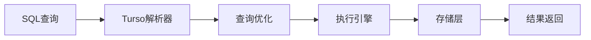

## 今日热点

AI代理工具生态系统快速成熟，视频创作与专业领域AI应用引领开源创新，AI正从单一功能向全栈解决方案演进。

---

## 热门项目一览

| 排名 | 项目 | 语言 | 今日 | 总计 | 简介 |
|:---:|------|:----:|------:|-----:|------|
| 1 | [calesthio/OpenMontage](https://github.com/calesthio/OpenMontage) | Python | +2,938 | 12,372 | World's first open-source, ... |
| 2 | [palmier-io/palmier-pro](https://github.com/palmier-io/palmier-pro) | Swift | +2,463 | 7,495 | macOS video editor built fo... |
| 3 | [mattpocock/skills](https://github.com/mattpocock/skills) | Shell | +2,051 | 141,833 | Skills for Real Engineers. ... |
| 4 | [ZhuLinsen/daily_stock_analysis](https://github.com/ZhuLinsen/daily_stock_analysis) | Python | +1,557 | 45,926 | LLM 驱动的多市场股票智能分析系统：多源行情、实时新... |
| 5 | [DeusData/codebase-memory-mcp](https://github.com/DeusData/codebase-memory-mcp) | C | +1,185 | 11,694 | High-performance code intel... |
| 6 | [mukul975/Anthropic-Cybersecurity-Skills](https://github.com/mukul975/Anthropic-Cybersecurity-Skills) | Python | +956 | 18,782 | 817 structured cybersecurit... |
| 7 | [bytedance/deer-flow](https://github.com/bytedance/deer-flow) | Python | +738 | 73,325 | An open-source long-horizon... |
| 8 | [penpot/penpot](https://github.com/penpot/penpot) | Clojure | +728 | 52,913 | Penpot: The open-source des... |
| 9 | [firecrawl/firecrawl](https://github.com/firecrawl/firecrawl) | TypeScript | +615 | 137,394 | The API to search, scrape, ... |
| 10 | [garrytan/gstack](https://github.com/garrytan/gstack) | TypeScript | +573 | 113,221 | Use Garry Tan's exact Claud... |
| 11 | [Stirling-Tools/Stirling-PDF](https://github.com/Stirling-Tools/Stirling-PDF) | TypeScript | +547 | 83,024 | #1 PDF Application on GitHu... |
| 12 | [tursodatabase/turso](https://github.com/tursodatabase/turso) | Rust | +540 | 21,526 | Turso is an in-process SQL ... |

---

## 趋势洞察

```
┌─────────────────────────────────────────────────────────────────┐
│  AI/ML 工具         ████████████████████████  11 个项目        │
│  开发工具             ████                      2 个项目        │
│  数据分析             ████                      2 个项目        │
│  其他               ██                        1 个项目        │
└─────────────────────────────────────────────────────────────────┘
```

---

## 项目深度解读

### 1. calesthio/OpenMontage — AI视频制作系统

> **一句话总结**：开源式AI代理视频制作系统，提供12条流水线、52种工具和500+技能，将AI助手转变为完整视频工作室。

#### 价值主张

| 维度 | 说明 |
|------|------|
| **解决痛点** | 传统视频制作流程复杂、门槛高，缺乏自动化工具链 |
| **目标用户** | 内容创作者、视频制作人、AI应用开发者 |
| **核心亮点** | AI代理驱动 + 全工具链整合 + 开源可定制 + 流水线自动化 |

#### 技术架构


**技术特色**：
- 基于AI代理的智能处理流程，实现自动化视频创作
- 模块化工具链设计，支持灵活组合与扩展
- 开源架构，允许社区贡献与定制化开发

#### 热度分析

- 项目获得12,372个Star，单日激增近3,000，显示近期关注度爆发式增长
- Fork数1,569表明开发者社区积极参与，项目处于活跃迭代期

#### 快速上手

```bash
# 克隆项目
git clone https://github.com/calesthio/OpenMontage.git
cd OpenMontage

# 安装依赖并运行示例
pip install -r requirements.txt
python examples/basic_video_generation.py
```

#### 注意事项

- 需要确保系统有足够的计算资源处理视频任务，尤其是AI处理部分
- 可能需要额外配置AI模型API密钥或本地模型以启用完整功能
- 项目可能处于早期阶段，部分功能可能不稳定，建议关注更新日志


### 2. palmier-io/palmier-pro — AI视频编辑器

> **一句话总结**：macOS原生AI视频编辑器，通过智能算法简化视频创作流程，提升编辑效率。

#### 价值主张

| 维度 | 说明 |
|------|------|
| **解决痛点** | 传统视频编辑工具操作复杂，AI集成度低，创作效率受限 |
| **目标用户** | macOS平台视频创作者、内容制作人和专业视频编辑人员 |
| **核心亮点** | AI智能分析 + 实时预览处理 + 直观操作界面 + 高性能优化 |

#### 技术架构


**技术特色**：
- 基于Swift原生开发，深度集成macOS系统API
- 采用先进AI算法进行视频内容识别与智能编辑
- 模块化架构设计，便于功能扩展与性能优化

#### 热度分析
- 单日增长2463 stars，显示AI视频编辑领域需求旺盛
- Fork数量相对较少，表明项目处于早期阶段，社区贡献尚未大规模展开

#### 快速上手

```bash
# 克隆仓库
git clone https://github.com/palmier-io/palmier-pro.git

# 构建项目（需要Xcode）
cd palmier-pro
xcodebuild -project Palmier.xcodeproj -scheme Palmier build
```

#### 注意事项
- 项目需要macOS环境和Xcode开发环境
- 作为AI驱动的视频编辑器，建议配置高性能硬件以获得最佳体验
- 许可证信息不明确，使用前需确认授权条款
- 项目处于活跃开发阶段，API可能会有变化


### 3. mattpocock/skills — 工程师技能集

> **一句话总结**：工程师必备的Shell脚本技能集合，提供实用命令行工具和最佳实践。

#### 价值主张

| 维度 | 说明 |
|------|------|
| **解决痛点** | 提供工程师日常工作中实用的Shell脚本和命令行技巧 |
| **目标用户** | 开发者、系统管理员、DevOps工程师 |
| **核心亮点** + 轻量级实用脚本 + 直接可用命令 + 最佳实践示例 + 源自真实经验 |

#### 技术架构


**技术特色**：
- 基于纯Shell编写，跨平台兼容性强
- 脚本简洁高效，避免过度复杂化
- 直接来源于实际工作场景，实用性强

#### 热度分析

- 项目获得超14万星，近期增长迅速，表明工程师对实用Shell脚本需求强烈
- 无开放问题，说明项目维护良好，内容质量高，用户反馈积极

#### 快速上手

```bash
# 克隆仓库
git clone https://github.com/mattpocock/skills.git

# 进入目录
cd skills

# 查看可用脚本
ls -la
```

#### 注意事项
- 部分脚本可能需要根据具体环境进行调整
- 执行前请确保理解脚本内容，特别是涉及系统操作的脚本


### 4. ZhuLinsen/daily_stock_analysis — 智能股票分析系统

> **一句话总结**：基于大语言模型的多市场股票智能分析系统，整合行情、新闻与决策功能

#### 价值主张

| 维度 | 说明 |
|------|------|
| **解决痛点** | 解决投资者获取多源市场信息难、分析效率低的问题 |
| **目标用户** | 股票投资者、金融分析师、量化交易爱好者 |
| **核心亮点** | LLM驱动 + 多源数据整合 + 自动化推送 + 零成本运行 |

#### 技术架构


**技术特色**：
- 多源数据整合技术，实时获取全球市场行情
- 大语言模型驱动的智能分析算法
- 零成本定时运行机制，降低使用门槛

#### 热度分析

- 项目Star数超4.5万，单日增长1500+，表明市场热度极高
- Fork数与Star数接近1:1，说明用户参与度高，实用性获广泛认可

#### 快速上手

```bash
# 克隆项目
git clone https://github.com/ZhuLinsen/daily_stock_analysis.git
# 安装依赖
pip install -r requirements.txt
# 运行主程序
python main.py
```

#### 注意事项

- 需要配置API密钥以获取市场数据
- 建议在虚拟环境中运行，避免依赖冲突
- 数据仅供参考，投资决策需谨慎


### 5. DeusData/codebase-memory-mcp — 代码智能索引

> **一句话总结**：高性能代码智能MCP服务器，将代码库索引为持久知识图，毫秒级处理，支持158种语言。

#### 价值主张

| 维度 | 说明 |
|------|------|
| **解决痛点** | 解决代码库索引慢、查询效率低、资源消耗大的问题 |
| **目标用户** | 需要快速理解大型代码库的软件开发团队和开发者 |
| **核心亮点** | 毫秒级索引速度 + 支持158种编程语言 + 单一无依赖静态二进制 + 99%更少的token使用 |

#### 技术架构


**技术特色**：
- 单一无依赖静态二进制文件，部署简单
- 毫秒级索引大型代码库，性能极高
- 支持多达158种编程语言，覆盖面广
- 查询响应时间低于毫秒级
- 99%更少的token使用，资源效率高

#### 热度分析

- 项目获得超过11,000个Star，单日增长超过1,000，表明社区对该技术有强烈需求
- 零Open Issues且高Fork数，说明项目成熟度高，社区活跃且维护良好

#### 快速上手

```bash
# 下载二进制文件
wget [下载链接]

# 给予执行权限
chmod +x codebase-memory-mcp

# 运行服务器
./codebase-memory-mcp
```

#### 注意事项

- 项目许可证未知，商业使用前需要确认许可证类型
- 虽然项目描述表明支持158种语言，但实际支持的完整语言列表需要查看官方文档
- 作为MCP服务器，可能需要特定的MCP客户端才能发挥最大效用


### 6. mukul975/Anthropic-Cybersecurity-Skills — 网安技能库

> **一句话总结**：结构化网络安全知识库，提供817种技能映射六大安全框架，赋能AI安全应用。

#### 价值主张

| 维度 | 说明 |
|------|------|
| **解决痛点** | 缺乏标准化网络安全技能表示方法，难以在AI系统中有效应用 |
| **目标用户** | 网安研究者、AI开发者、安全分析师、渗透测试工程师 |
| **核心亮点** | 结构化技能表示 + 多框架映射 + 跨平台兼容性 + 广域覆盖 |

#### 技术架构


**技术特色**：
- 采用agentskills.io标准实现技能结构化表示
- 构建MITRE ATT&CK等六大框架的映射关系
- 设计可扩展的数据模型支持新框架接入

#### 热度分析

- 项目获18,782星，近期增长迅猛，反映AI安全领域需求旺盛
- 作为开源安全知识库，已成为AI安全应用的重要基础设施

#### 快速上手

```bash
# 克隆仓库
git clone https://github.com/mukul975/Anthropic-Cybersecurity-Skills.git

# 查看技能示例
cat skills.json | jq '.skills[0]' | head -15
```

#### 注意事项

- 项目使用Apache 2.0许可证，允许商业应用
- 技能数据需定期更新以应对 evolving 威胁环境
- 框架映射存在一定主观性，建议结合专业知识验证


### 7. bytedance/deer-flow — 长时程智能体

> **一句话总结**：字节开源的超级智能体框架，通过多组件协作处理从分钟到小时级别的复杂任务。

#### 价值主张

| 维度 | 说明 |
|------|------|
| **解决痛点** | 解决长期复杂任务执行的连续性与一致性挑战 |
| **目标用户** | AI研究人员、企业开发者、复杂系统构建者 |
| **核心亮点** | 沙箱环境隔离 + 记忆系统支持长任务 + 多智能体协作 + 消息网关统一通信 |

#### 技术架构


**技术特色**：
- 沙箱环境提供安全隔离的执行空间
- 记忆系统支持长期任务的状态保持
- 多智能体架构实现复杂任务的分解与协作
- 消息网关统一处理各组件间的通信

#### 热度分析

- 项目Star数超过7.3万，单日增长738，表明近期热度快速上升
- Fork数近万，显示开发者社区高度参与和二次开发活跃
- Issues数为0，可能表示项目管理严格或处于早期阶段

#### 快速上手

```bash
# 克隆仓库
git clone https://github.com/bytedance/deer-flow.git

# 安装依赖
cd deer-flow
pip install -r requirements.txt

# 运行示例
python examples/basic_task.py
```

#### 注意事项

- 项目许可证未知，商业使用前需确认授权条款
- 作为长期任务处理框架，资源消耗可能较大
- 项目可能需要较高的计算资源支持复杂任务执行


### 8. penpot/penpot — 开源设计协作

> **一句话总结**：Penpot 是一个开源设计工具，专注于设计师与开发者之间的无缝协作。

#### 价值主张

| 维度 | 说明 |
|------|------|
| **解决痛点** | 打破设计工具与开发工具之间的壁垒，实现设计到代码的无缝转换 |
| **目标用户** | UI/UX 设计师、前端开发者和产品团队 |
| **核心亮点** | 开源可定制 + 设计系统支持 + 代码导出功能 + 实时协作 + 自托管部署 |

#### 技术架构


**技术特色**：
- 基于 Clojure/ClojureScript 的全栈开发，利用 Lisp 语言的强大宏系统
- 使用 PostGIS 扩展的 PostgreSQL 作为数据库，支持地理空间数据
- 采用自研的渲染引擎，确保设计元素在不同平台的一致性

#### 热度分析

- 项目 Star 数超过 5.2 万，近期日均增长约 700+，显示出强劲的增长势头和社区认可度
- 作为 Figma 的开源替代品，在开源设计工具领域处于领先地位，吸引了大量关注

#### 快速上手

```bash
# 克隆仓库
git clone https://github.com/penpot/penpot.git

# 安装依赖
cd penpot && make install

# 启动开发环境
make dev
```

#### 注意事项

- Penpot 的安装和配置相对复杂，需要一定的技术背景
- 相较于商业工具，某些高级功能可能还不够完善
- 自托管版本需要较多的服务器资源，特别是对于大型团队


### 9. firecrawl/firecrawl — 网络爬虫API

> **一句话总结**：提供大规模网络搜索、抓取和交互的API服务，支持高效数据采集。

#### 价值主张

| 维度 | 说明 |
|------|------|
| **解决痛点** | 解决大规模网络数据采集效率低、维护成本高的问题 |
| **目标用户** | 需要网络数据采集的AI应用开发者和数据分析师 |
| **核心亮点** | 分布式爬虫架构 + 智能反爬规避 + 结构化数据输出 |

#### 技术架构


**技术特色**：
- 基于TypeScript开发，确保类型安全
- 分布式架构支持大规模并发爬取
- 智能反爬虫机制规避网站封锁

#### 热度分析

- 项目Star数超过13万，近期增长迅速，日均增长超过600，表明市场热度高
- 作为网络爬取领域的领先项目，在AI和数据采集领域具有重要生态地位

#### 快速上手

```bash
# 安装Firecrawl
npm install firecrawl

# 基本使用示例
const Firecrawl = require('firecrawl');
const firecrawl = new Firecrawl({ apiKey: 'your-api-key' });

# 爬取网页
const result = await firecrawl.scrapeUrl('https://example.com');
console.log(result);
```

#### 注意事项

- 使用时需遵守目标网站的robots.txt规则
- 高频请求可能导致IP被封禁，建议合理设置请求间隔
- 商业使用可能需要付费订阅高级功能


### 10. garrytan/gstack — 全栈工具集合

> **一句话总结**：提供覆盖从CEO到QA的23个专业工具集成，实现全链路开发工作流程自动化。

#### 价值主张

| 维度 | 说明 |
|------|------|
| **解决痛点** | 解决开发团队跨角色协作工具碎片化问题 |
| **目标用户** | 全栈开发团队和项目管理团队 |
| **核心亮点** | 多角色工具集成 + 工作流程自动化 + 开发效率提升 |

#### 技术架构


**技术特色**：
- 基于TypeScript构建，确保跨平台兼容性和类型安全
- 23个模块化工具设计，支持灵活组合和定制
- 统一配置管理，简化多工具协调和版本控制

#### 热度分析

- Star数超11万且持续快速增长，日均增长500+，表明项目广受认可
- Fork/Star比例约15%，社区参与度和贡献活跃度高

#### 快速上手

```bash
# 克隆仓库
git clone https://github.com/garrytan/gstack.git
# 安装依赖
npm install
# 初始化工具链
npm run setup
```

#### 注意事项

- 项目包含23个工具，学习曲线较陡，建议分阶段引入
- 需确保与现有开发环境和工具链的兼容性
- 由于Open Issues为0，建议通过Discord或其他社区渠道获取支持


### 11. Stirling-Tools/Stirling-PDF — PDF全能编辑器

> **一句话总结**：跨平台PDF处理工具，支持编辑、转换、加密等多种功能，随时随地处理PDF文档。

#### 价值主张

| 维度 | 说明 |
|------|------|
| **解决痛点** | 解决PDF编辑困难、格式转换繁琐、跨平台兼容性差等问题 |
| **目标用户** | 需要频繁处理PDF文档的学生、办公人员、开发者 |
| **核心亮点** | 全功能PDF处理 + 跨平台支持 + 开源免费 + 无需安装 + 隐私安全 |

#### 技术架构


**技术特色**：
- 基于TypeScript开发，提供类型安全和高性能
- 支持多种PDF处理算法，包括OCR、加密、解密等
- 采用前后端分离架构，确保跨平台兼容性

#### 热度分析

- 项目获得8.3万星标，近期增长迅速，日增547星，表明PDF处理需求旺盛
- 无Open Issues，说明项目维护良好，用户反馈问题少，社区活跃度高

#### 快速上手

```bash
# 克隆项目
git clone https://github.com/Stirling-Tools/Stirling-PDF.git

# 安装依赖
npm install

# 启动开发服务器
npm run dev
```

#### 注意事项

- 项目依赖Node.js环境，确保系统已安装Node.js
- 处理大型PDF文件可能需要较高性能的设备
- 注意遵守PDF文件的版权和使用条款


### 12. tursodatabase/turso — 轻量级SQL数据库

> **一句话总结**：Turso是兼容SQLite的轻量级进程内SQL数据库，提供高性能和易用性。

#### 价值主张

| 维度 | 说明 |
|------|------|
| **解决痛点** | 提供比SQLite更高性能的进程内数据库解决方案，保持完全兼容性 |
| **目标用户** | 需要轻量级高性能数据库的SQLite用户和Rust开发者 |
| **核心亮点** | 兼容SQLite接口 + Rust编写保证内存安全 + 进程内运行减少开销 |

#### 技术架构



**技术特色**：
- Rust编写，确保内存安全和并发性能
- 完全兼容SQLite API，降低迁移成本
- 进程内架构，减少网络延迟
- 现代化存储引擎，提升读写性能

#### 热度分析

- 项目Star数达21.5K，近期增长迅速(+540/天)，显示高关注度
- 零开放Issues表明项目维护良好，问题响应及时

#### 快速上手

```bash
# 安装Turso
cargo install turso

# 初始化数据库
turso init mydb

# 启动数据库
turso start mydb

# 连接数据库
turso connect mydb
```

#### 注意事项

- 项目许可证信息不明确，使用前需确认
- 作为较新项目，生态系统和工具链可能仍在发展中
- 长期稳定性和社区支持需要持续关注


### 13. jamiepine/voicebox — AI语音创作工具

> **一句话总结**：开源AI语音工作室，支持声音克隆、听写和创作，生成高质量语音内容。

#### 价值主张

| 维度 | 说明 |
|------|------|
| **解决痛点** | 传统语音生成工具功能有限、成本高昂、难以定制的问题 |
| **目标用户** | 内容创作者、播客制作人、语音开发者、数字艺术家 |
| **核心亮点** | 声音克隆技术 + 多语言支持 + 实时语音生成 + 开源可定制 + 高质量输出 |

#### 技术架构


**技术特色**：
- 基于先进Transformer架构的语音生成模型
- 支持多语言和多种语音风格
- 实时语音处理和编辑能力
- 开源模型可本地部署保护隐私
- 高质量语音合成与编辑技术

#### 热度分析

- 项目获得超过3.2万星，单日增长529星，显示出极高的关注度和采用率，表明AI语音生成领域需求旺盛。
- 虽然无开放Issue，但高Fork数和社区贡献表明项目处于活跃开发中，开发者社区参与度高。

#### 快速上手

```bash
# 克隆仓库
git clone https://github.com/jamiepine/voicebox.git

# 安装依赖
cd voicebox
npm install

# 运行应用
npm start
```

#### 注意事项

- 项目使用开源许可证，但具体许可类型未知，使用前需确认
- AI语音生成技术可能存在伦理问题，使用时需考虑隐私和同意
- 高质量语音生成可能需要强大的计算资源


### 14. heygen-com/hyperframes — HTML视频渲染引擎

> **一句话总结**：将HTML代码直接转换为视频，专为AI代理设计，实现内容自动化视频生成。

#### 价值主张

| 维度 | 说明 |
|------|------|
| **解决痛点** | 解决HTML内容难以直接转换为视频的问题，实现内容自动化视频生成 |
| **目标用户** | AI开发者、内容创作者、自动化工具构建者 |
| **核心亮点** | HTML直接转视频 + 专为AI代理设计 + 自动化内容生成 + 高性能渲染 |

#### 技术架构


**技术特色**：
- 使用TypeScript开发，提供类型安全保证
- 基于Web技术栈，跨平台兼容性强
- 高效的帧渲染和视频编码算法

#### 热度分析

- 项目获得30,072个Star且持续增长，今日新增395个，表明项目具有较高实用价值
- Fork数为2,825，显示社区活跃度高，开发者积极参与项目贡献和定制

#### 快速上手

```bash
# 安装依赖
npm install hyperframes

# 基本使用
import { renderHTMLToVideo } from 'hyperframes';
renderHTMLToVideo('<h1>Hello World</h1>', 'output.mp4');
```

#### 注意事项

- 需要确保HTML代码的兼容性，避免使用不支持的Web特性
- 视频渲染可能需要较多计算资源，建议在服务器端执行
- 注意视频生成的版权和内容合规性问题


### 15. lyogavin/airllm — 高效LLM推理

> **一句话总结**：AirLLM实现70B大模型在4GB GPU上的高效推理，突破硬件限制。

#### 价值主张

| 维度 | 说明 |
|------|------|
| **解决痛点** | 解决大模型在低显存设备上无法运行的问题，降低大模型使用门槛 |
| **目标用户** | 拥有低配置GPU的开发者、研究人员和小型团队 |
| **核心亮点** | 显存优化技术 + 量化压缩 + 高效推理流程 |

#### 技术架构


**技术特色**：
- 低精度量化技术降低显存占用
- 模型分片实现按需加载
- 推理流程优化提高吞吐量

#### 热度分析

- 项目获得21,084个星标，单日增长193，表明社区关注度持续高涨
- Fork数2,424说明项目有较高的二次开发价值，社区活跃度高

#### 快速上手

```bash
# 克隆仓库
git clone https://github.com/lyogavin/airllm.git
cd airllm

# 安装依赖
pip install -r requirements.txt

# 运行示例
jupyter notebook examples/basic_inference.ipynb
```

#### 注意事项

- 量化可能导致模型精度下降，需评估对任务的影响
- 推理速度可能比高精度配置慢，需要权衡性能与硬件限制
- 不同架构的GPU可能有不同的兼容性问题


### 16. JCodesMore/ai-website-cloner-template — AI网站克隆工具

> **一句话总结**：利用AI编码技术，一键克隆任何网站，快速生成完整代码模板。

#### 价值主张

| 维度 | 说明 |
|------|------|
| **解决痛点** | 解决网站开发从零开始编写代码的繁琐过程，实现快速克隆与重构 |
| **目标用户** | 网站开发者、前端工程师、需要快速搭建网站原型的人员 |
| **核心亮点** | AI驱动 + 一键命令 + 完整代码生成 + 自定义模板 + 无需手动编写代码 |

#### 技术架构


**技术特色**：
- AI编码代理技术实现智能解析与重构
- TypeScript编写确保代码质量与类型安全
- 一键命令简化克隆流程，降低使用门槛
- 支持任意网站克隆，提供可定制的模板输出

#### 热度分析

- 项目获得17,825个星标，今日增长100个，表明项目正在快速获得开发者关注
- 作为AI辅助开发工具，契合当前技术发展趋势，社区活跃度高

#### 快速上手

```bash
# 安装项目
npm install ai-website-cloner-template

# 克隆网站
ai-website-cloner https://example.com
```

#### 注意事项

- 需要遵守目标网站的版权和使用条款，避免侵权行为
- AI生成的代码可能需要手动优化和调整，特别是复杂的JavaScript功能
- 某些动态加载内容或特殊交互的网站可能无法完美克隆
- 项目许可证信息不明确，使用前需确认开源协议和商用限制


## 今日推荐

| 主题 | 推荐项目 | 亮点 |
|------|----------|------|
| 今日最热 | [calesthio/OpenMontage](https://github.com/calesthio/OpenMontage) | World's first ope... |
| 值得关注 | [palmier-io/palmier-pro](https://github.com/palmier-io/palmier-pro) | macOS video edito... |
| 快速上手 | [mattpocock/skills](https://github.com/mattpocock/skills) | Skills for Real E... |
| 长期潜力 | [ZhuLinsen/daily_stock_analysis](https://github.com/ZhuLinsen/daily_stock_analysis) | LLM 驱动的多市场股票智能分析系... |

---

<div align="center">

*Generated on 2026-06-23 | Powered by GitHub Trending Reporter*

</div>