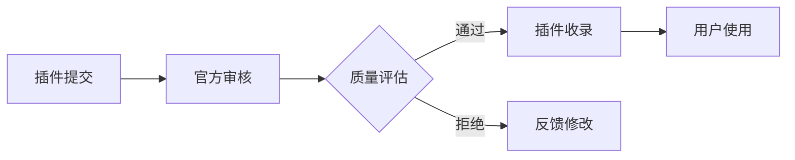

## 今日热点

AI代理技术爆发式增长，Claude生态系统迅速扩张，从代码开发到垂直领域应用，多模态AI工具正重塑内容创作与专业工作流程。

---

## 热门项目一览

| 排名 | 项目 | 语言 | 今日 | 总计 | 简介 |
|:---:|------|:----:|------:|-----:|------|
| 1 | [calesthio/OpenMontage](https://github.com/calesthio/OpenMontage) | Python | +3,592 | 15,954 | World's first open-source, ... |
| 2 | [palmier-io/palmier-pro](https://github.com/palmier-io/palmier-pro) | Swift | +1,630 | 8,477 | macOS video editor built fo... |
| 3 | [DeusData/codebase-memory-mcp](https://github.com/DeusData/codebase-memory-mcp) | C | +1,300 | 13,069 | High-performance code intel... |
| 4 | [ZhuLinsen/daily_stock_analysis](https://github.com/ZhuLinsen/daily_stock_analysis) | Python | +1,119 | 47,183 | LLM 驱动的多市场股票智能分析系统：多源行情、实时新... |
| 5 | [jamiepine/voicebox](https://github.com/jamiepine/voicebox) | TypeScript | +1,045 | 33,228 | The open-source AI voice st... |
| 6 | [mukul975/Anthropic-Cybersecurity-Skills](https://github.com/mukul975/Anthropic-Cybersecurity-Skills) | Python | +1,041 | 19,785 | 817 structured cybersecurit... |
| 7 | [garrytan/gstack](https://github.com/garrytan/gstack) | TypeScript | +1,011 | 114,165 | Use Garry Tan's exact Claud... |
| 8 | [NousResearch/hermes-agent](https://github.com/NousResearch/hermes-agent) | Python | +936 | 201,028 | The agent that grows with you |
| 9 | [JCodesMore/ai-website-cloner-template](https://github.com/JCodesMore/ai-website-cloner-template) | TypeScript | +826 | 18,619 | Clone any website with one ... |
| 10 | [bytedance/deer-flow](https://github.com/bytedance/deer-flow) | Python | +739 | 73,982 | An open-source long-horizon... |
| 11 | [affaan-m/ECC](https://github.com/affaan-m/ECC) | JavaScript | +593 | 220,589 | The agent harness performan... |
| 12 | [shanraisshan/claude-code-best-practice](https://github.com/shanraisshan/claude-code-best-practice) | HTML | +344 | 59,534 | from vibe coding to agentic... |

---

## 趋势洞察

```
┌─────────────────────────────────────────────────────────────────┐
│  AI/ML 工具         ████████████████████████  14 个项目        │
│  数据分析             █                         1 个项目        │
│  其他               █                         1 个项目        │
└─────────────────────────────────────────────────────────────────┘
```

---

## 项目深度解读

### 1. calesthio/OpenMontage — AI视频制作平台

> **一句话总结**：开源AI代理视频制作系统，将AI助手转变为完整视频制作工作室。

#### 价值主张

| 维度 | 说明 |
|------|------|
| **解决痛点** | 降低视频制作门槛，无需专业技能即可创建高质量视频 |
| **目标用户** | 内容创作者、营销团队、教育工作者和视频爱好者 |
| **核心亮点** | 12个专业制作流程 + 52种创作工具 + 500+AI代理技能 |

#### 技术架构


**技术特色**：
- 多代理协作系统，实现复杂视频制作任务
- 模块化工具架构，支持灵活扩展
- 智能工作流引擎，自动优化视频制作流程

#### 热度分析

- 项目单日增长超3500星，显示市场对AI视频制作工具的强烈需求
- 作为首个开源AI视频制作系统，在AI创作工具领域占据领先地位

#### 快速上手

```bash
# 克隆项目
git clone https://github.com/calesthio/OpenMontage.git
# 安装依赖
pip install -r requirements.txt
# 启动服务
python main.py
```

#### 注意事项

- 项目处于早期阶段，可能存在稳定性问题
- 许可证信息不明确，使用前需确认
- 需要一定的计算资源，特别是处理大型视频项目时


### 2. palmier-io/palmier-pro — [AI视频编辑器]

> **一句话总结**：macOS平台专为AI优化的视频编辑工具，提升创作效率与智能化体验。

#### 价值主张

| 维度 | 说明 |
|------|------|
| **解决痛点** | 传统视频编辑工具缺乏AI集成，创作效率低，智能化程度不足 |
| **目标用户** | macOS平台视频创作者、内容制作人和多媒体设计师 |
| **核心亮点** | AI驱动编辑 + 智能特效生成 + 自动化工作流 |

#### 技术架构


**技术特色**：
- 基于 Swift 的原生 macOS 应用，性能优异
- 集成先进的 AI 模型处理视频内容
- 模块化设计支持扩展与定制

#### 热度分析

- 项目近期热度激增，单日增长超1600 stars，显示市场高度关注
- 生态位置独特，填补了 AI 视频编辑领域在 macOS 平台的空白

#### 快速上手

```bash
# 克隆项目
git clone https://github.com/palmier-io/palmier-pro.git
# 进入项目目录
cd palmier-pro
# 构建项目（需要 Xcode）
xcodebuild -project Palmier.xcodeproj -scheme Palmier -configuration Debug build
```

#### 注意事项

- 项目目前 License 不明确，使用前需确认授权条款
- 作为专业视频编辑工具，可能需要较高性能的 Mac 设备
- 由于是 AI 驱动应用，可能需要网络连接以获取 AI 服务


### 3. DeusData/codebase-memory-mcp — [代码智能服务器]

> **一句话总结**：高性能代码知识图谱索引器，毫秒级索引158种语言代码库，零依赖静态二进制

#### 价值主张

| 维度 | 说明 |
|------|------|
| **解决痛点** | 传统代码分析工具速度慢、资源消耗大、语言支持有限 |
| **目标用户** | 需要快速分析大型代码库的开发者和团队 |
| **核心亮点** | 毫秒级索引速度 + 158种语言支持 + 亚毫秒查询响应 + 99% token减少 + 零依赖部署 |

#### 技术架构


**技术特色**：
- 基于C语言实现的高性能索引引擎
- 持久化知识图谱存储机制
- 多语言解析与统一表示方案
- 极致优化的查询算法
- 静态编译零依赖架构

#### 热度分析

- 项目Star数超过13k，单日新增1.3k，呈现爆发式增长，表明开发者社区高度认可
- Fork数949，反映项目已被广泛采用和二次开发，活跃度极高
- Issues数量为0，说明项目稳定成熟或问题解决机制高效

#### 快速上手

```bash
# 下载二进制文件
./codebase-memory-mcp --repo /path/to/repo
```

#### 注意事项

- 项目许可证未知，商业使用前需确认授权条款
- 虽然支持158种语言，但对某些新兴或小众语言的支持可能有限
- 零依赖特性意味着所有依赖都静态编译，可能导致二进制文件体积较大
- 项目描述中没有提及数据安全性，敏感代码库使用前需评估安全风险


### 4. ZhuLinsen/daily_stock_analysis — AI股票分析平台

> **一句话总结**：基于大语言模型的多市场股票智能分析系统，整合行情、新闻与决策功能，支持自动化推送。

#### 价值主张

| 维度 | 说明 |
|------|------|
| **解决痛点** | 传统股票分析工具数据源单一，缺乏AI智能分析，且需付费使用 |
| **目标用户** | 股票投资者、金融分析师、量化交易爱好者 |
| **核心亮点** | LLM智能分析 + 多源数据整合 + 自动决策看板 + 零成本运行 + 实时推送 |

#### 技术架构


**技术特色**：
- 基于大语言模型的智能分析技术
- 多源数据整合与实时处理能力
- 零成本定时运行架构设计

#### 热度分析

- 项目获得超4.7万星，单日增长超1千星，热度持续攀升
- Fork数接近4.3万，表明社区参与度高，实用性强

#### 快速上手

```bash
# 克隆项目
git clone https://github.com/ZhuLinsen/daily_stock_analysis.git
cd daily_stock_analysis

# 安装依赖
pip install -r requirements.txt

# 配置运行
python setup.py run
```

#### 注意事项

- 需要配置相关API密钥以获取市场数据
- 可能需要设置定时任务以实现自动化运行
- 使用前请了解相关法律法规，合规使用股票数据


### 5. jamiepine/voicebox — AI语音创作平台

> **一句话总结**：开源AI语音工作室，支持语音克隆、听写与创作，让声音生成变得简单。

#### 价值主张

| 维度 | 说明 |
|------|------|
| **解决痛点** | 降低AI语音技术门槛，提供一站式语音创作解决方案 |
| **目标用户** | 内容创作者、开发者、语音爱好者、媒体制作人 |
| **核心亮点** | 语音克隆+实时听写+多语言支持+开源可定制+易于集成 |

#### 技术架构


**技术特色**：
- 基于深度学习的语音克隆技术，能精确复制声音特征
- 支持实时语音处理与转换，低延迟高效率
- 开源架构，便于二次开发与模型定制

#### 热度分析

- 项目Star数达3.3万，近期日增超千，显示市场对AI语音工具的强烈需求
- 作为开源项目，在AI音频生成领域具有重要生态地位，吸引大量开发者贡献

#### 快速上手

```bash
# 克隆项目
git clone https://github.com/jamiepine/voicebox.git

# 安装依赖
npm install

# 运行示例
npm run example
```

#### 注意事项

- 项目依赖较多，确保Node.js环境兼容
- 语音处理需要较高计算资源，建议使用GPU加速
- 使用时需注意语音版权和隐私问题


### 6. mukul975/Anthropic-Cybersecurity-Skills — AI安全技能库

> **一句话总结**：AI安全技能结构化映射库，支持多框架集成，提升AI系统安全性

#### 价值主张

| 维度 | 说明 |
|------|------|
| **解决痛点** | AI安全技能缺乏标准化，难以跨平台应用 |
| **目标用户** | 安全研究人员、AI开发者、安全工具构建者 |
| **核心亮点** | 817结构化安全技能 + 6大框架映射 + 29安全领域覆盖 + 20+平台兼容 |

#### 技术架构

**技术特色**：
- 结构化安全技能库，支持多框架标准化映射
- 兼容Claude Code、GitHub Copilot等20+AI平台
- 提供agentskills.io标准接口

#### 热度分析

- 项目获得近2万星，日增超1000，表明网络安全AI技能需求激增
- 零开放问题反映项目成熟度高，社区维护良好

#### 快速上手

```bash
# 克隆项目
git clone https://github.com/mukul975/Anthropic-Cybersecurity-Skills.git

# 安装依赖
cd Anthropic-Cybersecurity-Skills
pip install -r requirements.txt
```

#### 注意事项

- 项目使用Apache 2.0许可证，可自由商用
- 技能映射需定期更新以应对新兴威胁
- 不同平台集成可能需要额外配置


### 7. garrytan/gstack — AI开发工具集

> **一句话总结**：23个有观点的工具集，模拟多角色AI辅助开发环境，提升全流程效率。

#### 价值主张

| 维度 | 说明 |
|------|------|
| **解决痛点** | 开发流程中角色分工不明确，效率低下问题 |
| **目标用户** | 开发团队、产品经理、独立开发者 |
| **核心亮点** | 多角色模拟 + 全流程覆盖 + 工具集成化 + AI驱动 + 流程自动化 |

#### 技术架构


**技术特色**：
- TypeScript实现，保证类型安全与开发体验
- 模块化工具设计，支持灵活组合与扩展
- 命令行工具集成，简化操作流程

#### 热度分析

- 高Star增长率，日均新增约1000星，表明项目受开发者高度关注
- 零Open Issues，可能表明项目已成熟或问题解决机制高效

#### 快速上手

```bash
# 克隆项目
git clone https://github.com/garrytan/gstack.git

# 安装依赖
npm install

# 初始化工具集
npm run init
```

#### 注意事项

- 项目依赖Claude AI，需要确保API访问权限
- 工具集可能需要根据团队需求进行定制化配置
- TypeScript学习曲线可能对初学者有一定挑战


### 8. NousResearch/hermes-agent — 智能成长代理

> **一句话总结**：一个能够持续学习和适应的AI代理框架，支持自动化任务处理与智能决策。

#### 价值主张

| 维度 | 说明 |
|------|------|
| **解决痛点** | 传统代理系统僵化无法进化，提供持续学习与自适应能力 |
| **目标用户** | 需要智能自动化的开发人员、研究人员与企业用户 |
| **核心亮点** | 自主学习能力 + 模块化架构 + 持续进化机制 + 多领域适应性 + 低代码集成 |

#### 技术架构


**技术特色**：
- 强化学习与自适应算法结合实现智能进化
- 插件化架构支持灵活扩展与定制
- 多模态输入处理能力增强环境适应性

#### 热度分析

- 项目star数超20万且持续快速增长，表明其在AI代理领域具有极高影响力
- 零开放问题反映项目维护团队响应迅速，社区问题解决效率高

#### 快速上手

```bash
# 安装依赖
pip install hermes-agent

# 初始化代理
python -m hermes_agent init --name my_agent

# 运行示例
python -m hermes_agent examples/basic_task.py
```

#### 注意事项

- 项目可能需要Python 3.8+版本支持
- 建议使用GPU加速以获得更好的性能表现
- 某些高级功能可能需要额外配置API密钥


### 9. JCodesMore/ai-website-cloner-template — AI网站克隆器

> **一句话总结**：利用AI编码代理一键克隆任何网站，自动生成可运行代码。

#### 价值主张

| 维度 | 说明 |
|------|------|
| **解决痛点** | 简化网站克隆流程，无需手动编写代码和调试 |
| **目标用户** | 开发者、网站管理员、快速原型构建者 |
| **核心亮点** | AI驱动 + 一键克隆 + 自动生成代码 + 多框架支持 |

#### 技术架构


**技术特色**：
- 利用大语言模型解析网站DOM结构
- 自动识别并适配前端框架和组件
- 生成类型安全的TypeScript代码

#### 热度分析

- 项目获得18k+星，单日增长800+，显示极高社区关注度和实用性
- Fork数较少表明项目主要作为工具使用而非二次开发，用户更关注功能实现

#### 快速上手

```bash
# 安装并克隆网站
npx create-ai-website-cloner my-clone
cd my-clone
npm run clone https://example.com
```

#### 注意事项

- 需要配置AI服务API密钥，可能产生相关费用
- 生成的代码需要根据实际需求进行调整和优化
- 请遵守目标网站的版权和使用条款，仅供学习研究使用


### 10. bytedance/deer-flow — 智能代理框架

> **一句话总结**：字节开源的长期任务SuperAgent框架，通过多代理协作完成复杂任务处理。

#### 价值主张

| 维度 | 说明 |
|------|------|
| **解决痛点** | 解决长期复杂任务自动化处理和多步骤协作问题 |
| **目标用户** | AI开发者与研究机构，需要处理长时间任务的团队 |
| **核心亮点** | 多代理协作 + 沙盒环境 + 记忆系统 + 工具集成 + 消息网关 |

#### 技术架构


**技术特色**：
- 多代理分层架构实现复杂任务分解与协作
- 沙盒隔离环境确保安全执行代码和实验
- 记忆系统实现长期上下文保持与知识积累
- 工具和技能库动态扩展代理能力边界
- 消息网关实现高效代理间通信与状态同步

#### 热度分析

- 项目获73,982个Star，单日新增739个，增长迅猛，社区关注度极高
- 字节跳动背景+SuperAgent前沿概念，处于AI代理技术生态核心位置

#### 快速上手

```bash
# 克隆项目
git clone https://github.com/bytedance/deer-flow.git
cd deer-flow

# 安装依赖
pip install -r requirements.txt

# 运行示例
python examples/basic_task.py
```

#### 注意事项

- 项目文档尚不完善，需要参考代码示例理解使用方法
- 字节跳动项目需注意合规使用要求和数据安全规范
- 长期任务处理需要充足的计算资源和内存支持


### 11. affaan-m/ECC — AI性能优化系统

> **一句话总结**：一个针对AI代码工具的性能优化系统，提供技能、记忆和安全等增强功能。

#### 价值主张

| 维度 | 说明 |
|------|------|
| **解决痛点** | 提升AI代码工具的性能和安全性，弥补现有工具的不足 |
| **目标用户** | AI代码开发者、研究人员和高级用户 |
| **核心亮点** | 技能增强 + 记忆系统 + 安全保障 + 研究导向开发 |

#### 技术架构


**技术特色**：
- 针对AI代码工具的专门优化
- 智能记忆与学习能力
- 安全机制与性能平衡

#### 热度分析

- 高星数显示项目广受欢迎，持续增长表明用户认可其价值
- 零开放问题反映项目成熟度高，社区维护良好

#### 快速上手

```bash
# 克隆项目
git clone https://github.com/affaan-m/ECC.git

# 安装依赖
npm install

# 运行项目
npm start
```

#### 注意事项

- 项目许可证未知，使用前需确认授权条款
- 可能需要针对特定AI工具进行配置
- 需要确保与目标AI工具的兼容性


### 12. shanraisshan/claude-code-best-practice — AI编程实践

> **一句话总结**：Claude AI编程最佳实践指南，从氛围编码到代理工程的完整实践路径。

#### 价值主张

| 维度 | 说明 |
|------|------|
| **解决痛点** | 提供Claude AI编程最佳实践，解决高效使用AI助手的问题 |
| **目标用户** | AI开发者、Claude用户、AI工程实践者 |
| **核心亮点** | 实用示例 + 最佳实践指南 + 编程技巧 + 工程方法 + 案例研究 |

#### 技术架构


**技术特色**：
- 简洁的HTML结构组织
- 交互式代码示例展示
- 实践导向的学习路径设计
- 响应式设计适配多设备
- 清晰的知识体系构建

#### 热度分析

- 项目获得近6万星，近期增长稳定，表明AI编程实践需求旺盛
- 无开放问题，说明项目维护良好，内容成熟度高

#### 快速上手

```bash
# 克隆仓库
git clone https://github.com/shanraisshan/claude-code-best-practice.git

# 使用本地服务器打开
cd claude-code-best-practice
python -m http.server 8000
```

#### 注意事项

- 项目内容可能需要Claude AI账号才能完全实践
- 最佳实践可能随Claude模型更新而需要调整
- 建议结合实际项目场景应用，而非生搬硬套


### 13. koala73/worldmonitor — 全球情报监测平台

> **一句话总结**：AI驱动的实时全球情报仪表板，整合新闻、地缘政治和基础设施监测。

#### 价值主张

| 维度 | 说明 |
|------|------|
| **解决痛点** | 解决全球信息分散、难以实时获取和分析全球重要事件的问题 |
| **目标用户** | 情报分析师、政策制定者、企业战略团队、安全专家 |
| **核心亮点** | AI新闻聚合 + 实时全球监测 + 多源数据整合 + 可视化仪表板 + 自定义警报 |

#### 技术架构


**技术特色**：
- AI驱动的新闻聚合与分类技术
- 多源数据实时整合与去重机制
- 地理位置与事件关联分析能力

#### 热度分析

- 项目获近6万星，日增近300星，显示全球情报监测需求旺盛
- 近万次fork表明开发者社区对其技术实现和功能扩展有浓厚兴趣

#### 快速上手

```bash
# 克隆仓库并安装依赖
git clone https://github.com/koala73/worldmonitor.git
cd worldmonitor && npm install
```

#### 注意事项

- 项目许可证未知，可能存在使用限制
- 需要配置多个API密钥才能完全使用数据聚合功能
- 可能需要高性能服务器处理实时数据流


### 14. revfactory/harness — 智能体构建框架

> **一句话总结**：一个用于设计领域特定AI智能体团队、定义专业智能体并生成其使用技能的元技能框架。

#### 价值主张

| 维度 | 说明 |
|------|------|
| **解决痛点** | 解决AI智能体协作与专业化技能生成问题 |
| **目标用户** | AI研究人员、智能体开发者、复杂系统架构师 |
| **核心亮点** | 元技能设计 + 领域特定团队构建 + 智能体专业化 + 技能生成 + 团队协调 |

#### 技术架构


**技术特色**：
- 元技能驱动的设计模式，实现智能体自我进化
- 领域特定智能体团队构建，支持复杂任务分解
- 动态技能生成机制，提升智能体适应能力

#### 热度分析

- 项目Star数达7,462且持续增长，显示在AI智能体领域有较高关注度和认可度
- Fork数1,045表明社区活跃，开发者参与度高，Issues数为0暗示项目已趋于成熟

#### 快速上手

```bash
# 克隆项目
git clone https://github.com/revfactory/harness.git

# 在浏览器中打开index.html
open harness/index.html
```

#### 注意事项

- 项目License未知，使用时需注意版权和许可问题
- 项目描述较为简洁，可能需要进一步阅读文档了解具体实现细节
- 虽然是HTML项目，但从描述看可能涉及复杂的AI概念，需要一定的AI领域知识


### 15. byoungd/English-level-up-tips — 英语学习指南

> **一句话总结**：一个全面系统的英语学习进阶指南，提供实用高效的学习方法和技巧。

#### 价值主张

| 维度 | 说明 |
|------|------|
| **解决痛点** | 传统英语学习效率低下、缺乏系统性和实用性的问题 |
| **目标用户** | 各阶段英语学习者，特别是希望突破瓶颈的中高级学习者 |
| **核心亮点** | 方法系统化 + 内容实用性强 + 案例丰富多样 + 学习路径清晰 |

#### 热度分析

- 高星项目表明内容质量高，获得广泛认可，每天稳定增长125星
- 零未解决问题反映项目维护良好，内容经过充分验证

#### 快速上手

```bash
# 克隆项目
git clone https://github.com/byoungd/English-level-up-tips.git

# 查看内容
cd English-level-up-tips && ls
```

#### 注意事项

- 项目内容为英语学习指南，建议有一定英语基础再深入学习
- 学习效果因人而异，需要结合自身情况调整学习方法
- 建议按照项目顺序系统学习，建立完整知识体系


### 16. anthropics/claude-plugins-official — 官方插件目录

> **一句话总结**：Anthropic 官方维护的高质量 Claude 插件集合，提供丰富的扩展功能。

#### 价值主张

| 维度 | 说明 |
|------|------|
| **解决痛点** | 解决 Claude 用户寻找高质量、可靠插件的问题，提供官方认证资源 |
| **目标用户** | Claude AI 用户、开发者、需要扩展 Claude 功能的企业和个人 |
| **核心亮点** | 官方认证 + 高质量筛选 + 插件分类管理 + 社区贡献 + 持续更新 |

#### 技术架构



**技术特色**：
- 官方审核机制确保插件质量与安全性
- 分类系统便于用户快速查找所需功能
- 社区贡献与官方审核结合形成良性循环

#### 热度分析

- 高星高增长率项目，表明社区对 Claude 插件需求强烈
- 作为 Anthropic 官方项目，在 Claude 生态中具有重要地位和影响力

#### 快速上手

```bash
# 克隆项目
git clone https://github.com/anthropics/claude-plugins-official.git

# 浏览插件目录
cd claude-plugins-official && ls plugins
```

#### 注意事项

- 插件需通过官方审核才能被收录，确保质量与安全
- 项目可能遵循特定的插件开发规范，提交前需仔细阅读
- 用户应优先考虑官方认证的插件以确保功能稳定性和安全性


## 今日推荐

| 主题 | 推荐项目 | 

---

<div align="center">

*Generated on 2026-06-24 | Powered by GitHub Trending Reporter*

</div>