## 今日热点

AI代理系统在各领域爆发应用，从视频制作到股票分析；苹果官方容器工具获高度关注，显示开发者对原生容器解决方案的迫切需求。

---

## 热门项目一览

| 排名 | 项目 | 语言 | 今日 | 总计 | 简介 |
|:---:|------|:----:|------:|-----:|------|
| 1 | [calesthio/OpenMontage](https://github.com/calesthio/OpenMontage) | Python | +3,719 | 19,679 | World's first open-source, ... |
| 2 | [apple/container](https://github.com/apple/container) | Swift | +1,838 | 42,317 | A tool for creating and run... |
| 3 | [ZhuLinsen/daily_stock_analysis](https://github.com/ZhuLinsen/daily_stock_analysis) | Python | +1,468 | 48,638 | LLM 驱动的多市场股票智能分析系统：多源行情、实时新... |
| 4 | [NousResearch/hermes-agent](https://github.com/NousResearch/hermes-agent) | Python | +1,178 | 202,142 | The agent that grows with you |
| 5 | [JCodesMore/ai-website-cloner-template](https://github.com/JCodesMore/ai-website-cloner-template) | TypeScript | +692 | 19,402 | Clone any website with one ... |
| 6 | [google-labs-code/design.md](https://github.com/google-labs-code/design.md) | TypeScript | +619 | 17,431 | A format specification for ... |
| 7 | [stablyai/orca](https://github.com/stablyai/orca) | TypeScript | +331 | 6,857 | Orca is the ADE for working... |
| 8 | [revfactory/harness](https://github.com/revfactory/harness) | HTML | +277 | 7,771 | A meta-skill that designs d... |
| 9 | [interviewstreet/hiring-agent](https://github.com/interviewstreet/hiring-agent) | Python | +203 | 2,257 | AI agent to evaluate and sc... |
| 10 | [kunchenguid/no-mistakes](https://github.com/kunchenguid/no-mistakes) | Go | +110 | 2,220 | git push no-mistakes |
| 11 | [flutter/flutter](https://github.com/flutter/flutter) | Dart | +73 | 177,370 | Flutter makes it easy and f... |
| 12 | [Flowseal/zapret-discord-youtube](https://github.com/Flowseal/zapret-discord-youtube) | Batchfile | +61 | 30,032 | No description |

---

## 趋势洞察

```
┌─────────────────────────────────────────────────────────────────┐
│  AI/ML 工具         ████████████████████████  9 个项目        │
│  其他               ████████                  3 个项目        │
│  开发框架             ██                        1 个项目        │
└─────────────────────────────────────────────────────────────────┘
```

---

## 项目深度解读

### 1. calesthio/OpenMontage — AI视频制作系统

> **一句话总结**：开源AI代理视频制作平台，将AI助手转变为全功能视频制作工作室。

#### 价值主张

| 维度 | 说明 |
|------|------|
| **解决痛点** | 降低视频制作技术门槛，实现AI辅助全流程自动化视频生产 |
| **目标用户** | 内容创作者、视频制作人、AI开发者、多媒体工作室 |
| **核心亮点** | 12专业流程管道 + 52种制作工具 + 500+AI代理技能 |

#### 技术架构

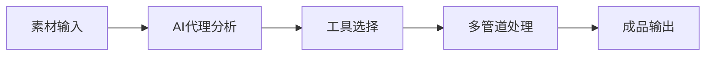

**技术特色**：
- 基于AI代理的智能工作流系统
- 模块化工具架构支持灵活扩展
- 全栈式视频处理能力整合

#### 热度分析

- 项目获近2万星，单日新增3700+，增长速度极快，市场需求强烈
- 社区活跃度高，Fork比例适中，表明项目具有良好的可扩展性

#### 快速上手

```bash
# 克隆仓库
git clone https://github.com/calesthio/OpenMontage.git

# 安装依赖
pip install -r requirements.txt

# 运行示例
python examples/basic_video_production.py
```

#### 注意事项

- 许可证信息未知，使用前需确认开源协议
- 作为视频处理系统，可能对计算资源和GPU有较高要求
- 建议先查看文档了解各工具和管道的具体使用场景


### 2. apple/container — Mac容器化工具

> **一句话总结**：基于Swift开发的轻量级Linux容器工具，专为Apple Silicon Mac优化，提供高效容器化体验。

#### 价值主张

| 维度 | 说明 |
|------|------|
| **解决痛点** | 解决Mac上原生运行Linux容器的性能和兼容性问题 |
| **目标用户** | Mac开发者、系统管理员、跨平台应用开发者 |
| **核心亮点** | Swift原生开发 + Apple Silicon优化 + 轻量级虚拟机 + 原生Mac集成 |

#### 技术架构

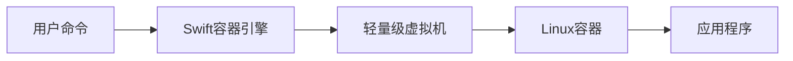

**技术特色**：
- Swift原生开发，提供类型安全和内存安全优势
- 专为Apple Silicon优化，充分利用M系列芯片性能
- 轻量级虚拟机技术，比传统虚拟机更高效资源利用

#### 热度分析

- 项目Star数达42,317且单日增长1,838，显示快速增长势头和开发者高度关注
- Fork数1,244表明有一定社区参与度，可能存在较多定制化使用场景

#### 快速上手

```bash
# 安装container
brew install container

# 创建并启动新容器
container create --name my-ubuntu ubuntu:22.04
container start my-ubuntu

# 进入容器
container exec my-ubuntu bash
```

#### 注意事项

- 项目目前仅支持Apple Silicon Mac，Intel Mac可能不兼容
- 许可证信息不明确，使用前需确认开源许可条款
- 作为较新项目，生产环境使用前建议充分测试稳定性


### 3. ZhuLinsen/daily_stock_analysis — 智能股票分析

> **一句话总结**：基于大语言模型的多市场股票智能分析系统，整合多源数据提供决策支持。

#### 价值主张

| 维度 | 说明 |
|------|------|
| **解决痛点** | 金融市场数据繁杂，投资者难以快速获取有效信息和做出决策 |
| **目标用户** | 股票投资者、金融分析师、量化交易爱好者 |
| **核心亮点** | LLM智能分析 + 多源数据整合 + 实时新闻推送 + 零成本运行 + 自动化决策看板 |

#### 技术架构

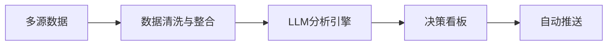

**技术特色**：
- 多源市场数据实时获取与整合技术
- LLM驱动的金融市场智能分析算法
- 零成本定时任务执行架构
- 自动化决策支持系统

#### 热度分析

- 项目Star数近5万，近期增长迅猛，单日新增近1500星，显示市场高度认可
- Fork数与Star数比例接近1:1，表明项目被广泛采用和二次开发

#### 快速上手

```bash
# 克隆项目
git clone https://github.com/ZhuLinsen/daily_stock_analysis.git

# 安装依赖
pip install -r requirements.txt

# 运行分析
python main.py
```

#### 注意事项

- 项目未明确说明许可证，使用前需确认授权条款
- 股票投资有风险，系统分析仅供参考，不构成投资建议
- 需要配置相关API密钥才能获取市场数据
- 系统可能需要持续维护以适应市场变化和API更新


### 4. NousResearch/hermes-agent — 成长型智能代理

> **一句话总结**：一个能够持续学习和进化的智能代理系统，通过交互不断积累知识和能力。

#### 价值主张

| 维度 | 说明 |
|------|------|
| **解决痛点** | 解决传统AI代理缺乏长期学习和适应能力的问题 |
| **目标用户** | AI研究人员、开发者及需要智能代理系统的企业用户 |
| **核心亮点** | 持续学习能力 + 模块化架构 + 自主进化机制 + 多场景适应性 |

#### 技术架构

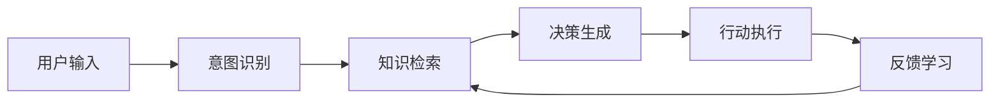

**技术特色**：
- 采用强化学习与知识图谱融合的持续学习机制
- 模块化设计支持灵活扩展和功能定制
- 实现了自我评估和优化循环，实现代理能力的持续提升

#### 热度分析

- 项目Star数超20万，日均增长近1200，表明项目处于高速增长期
- 高Fork数反映社区活跃度高，开发者积极参与二次开发与贡献

#### 快速上手

```bash
# 克隆仓库
git clone https://github.com/NousResearch/hermes-agent.git

# 安装依赖
pip install -r requirements.txt

# 启动代理
python hermes_agent --config config/default.yaml
```

#### 注意事项

- 项目需要Python 3.8+环境和充足的计算资源，建议使用GPU加速
- 由于项目快速迭代，API可能发生变化，建议关注更新日志
- 部分高级功能可能需要额外配置和依赖


### 5. JCodesMore/ai-website-cloner-template — AI网站克隆

> **一句话总结**：利用AI编程代理技术，一键实现网站克隆，无需手动编写代码。

#### 价值主张

| 维度 | 说明 |
|------|------|
| **解决痛点** | 简化网站复制流程，解决手动克隆效率低、技术门槛高的问题 |
| **目标用户** | 开发者、网站管理员、需要快速复制网站结构的用户 |
| **核心亮点** | AI驱动 + 一键命令 + 自动生成代码 + 保持原貌 + 高度定制化 |

#### 技术架构

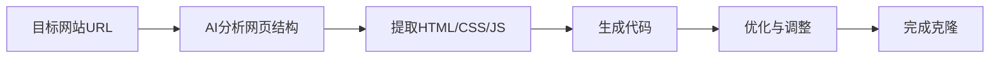

**技术特色**：
- 基于TypeScript构建，类型安全且易于维护
- 利用AI理解网站结构，自动生成对应代码
- 支持响应式设计和复杂布局的精确复制
- 提供模板化输出，便于二次开发

#### 热度分析

- 项目获得近2万星且单日增长近700，反映AI辅助开发工具的强劲需求
- 近3000次Fork表明社区高度认可，开发者积极参与技术实践

#### 快速上手

```bash
# 克隆项目
git clone https://github.com/JCodesMore/ai-website-cloner-template.git

# 安装依赖
npm install

# 克隆网站
npm run clone [目标网站URL]
```

#### 注意事项

- AI生成的代码可能需要人工调整以确保完全兼容性
- 遵守目标网站的版权和法律法规，避免滥用技术
- 复杂JavaScript功能的网站可能无法完美克隆，需要额外处理


### 6. google-labs-code/design.md — 设计系统规范

> **一句话总结**：DESIGN.md 提供结构化设计语言，使 AI 编码代理能够理解和执行一致的设计系统。

#### 价值主张

| 维度 | 说明 |
|------|------|
| **解决痛点** | 解决 AI 代理理解设计系统不一致的问题 |
| **目标用户** | AI 开发者、设计系统创建者 |
| **核心亮点** | 结构化格式 + 持久理解 + 跨平台一致性 |

#### 技术架构

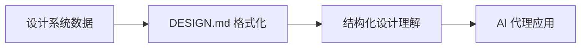

**技术特色**：
- 基于文本的设计系统描述格式
- 支持机器可读的设计规范
- 与 AI 编码代理无缝集成

#### 热度分析

- 17k+ 星标表明项目获得高度认可，增长稳定
- 来自 Google 实验室，处于 AI 辅助开发前沿领域

#### 快速上手

```bash
# 创建基本 DESIGN.md 文件
echo "# 设计系统规范\n\n## 品牌\n\n## 颜色\n\n## 组件" > DESIGN.md
```

#### 注意事项

- 这是一个规范而非工具，需要配合支持该规范的 AI 工具使用
- 规范可能随 AI 代理能力发展而更新


### 7. stablyai/orca — 并行代理管理平台

> **一句话总结**：多平台代理开发环境，支持并行AI代理管理与自定义订阅模型。

#### 价值主张

| 维度 | 说明 |
|------|------|
| **解决痛点** | 简化多AI代理的并行管理，提供统一的代理开发与部署环境 |
| **目标用户** | AI代理开发者、需要管理多个AI代理的团队、研究人员 |
| **核心亮点** | + 并行代理管理 + 多平台支持 + 自定义订阅模型 + TypeScript开发 |

#### 技术架构

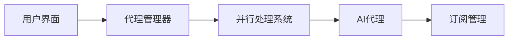

**技术特色**：
- 基于 TypeScript 开发，提供类型安全与代码质量保障
- 支持桌面和移动平台，实现全场景代理开发
- 并行处理架构，提高多代理协同效率

#### 热度分析

- 项目Star数增长迅猛，单日新增331星，表明社区关注度持续攀升
- Fork数相对较少，暗示项目可能处于早期阶段，用户更关注而非贡献

#### 快速上手

```bash
# 克隆仓库
git clone https://github.com/stablyai/orca.git

# 安装依赖
npm install

# 启动开发环境
npm run dev
```

#### 注意事项

- 项目许可证信息不明确，建议在使用前确认授权条款
- Open Issues为0，可能表示项目处于早期阶段或问题管理方式不同
- 需要进一步查看文档了解具体API使用方法和代理配置选项


### 8. revfactory/harness — AI代理框架

> **一句话总结**：构建领域特定的AI代理团队，定义专业代理并生成其所需技能的元技能框架。

#### 价值主张

| 维度 | 说明 |
|------|------|
| **解决痛点** | 解决AI代理团队构建和技能生成的复杂性问题 |
| **目标用户** | AI系统开发者、智能团队构建者 |
| **核心亮点** | 领域特定团队设计 + 专业代理定义 + 技能自动生成 + 可扩展架构 + 易于集成 |

#### 技术架构

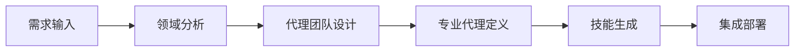

**技术特色**：
- 基于HTML的轻量级前端架构
- 模块化的代理设计系统
- 自动化的技能生成机制

#### 热度分析

- 项目获得7771个Star，且近期增长迅速（今日+277），表明项目热度高且持续受到关注
- 社区活跃度较高，1058个Fork显示开发者积极参与二次开发

#### 快速上手

```bash
# 克隆仓库
git clone https://github.com/revfactory/harness.git

# 在浏览器中打开
open harness/index.html
```

#### 注意事项

- 项目许可证未知，使用时需注意版权问题
- 项目描述较为抽象，具体实现细节可能需要进一步探索代码
- 作为HTML项目，可能需要额外的后端支持才能完全运行


### 9. interviewstreet/hiring-agent — 简历智能评估

> **一句话总结**：AI驱动的简历自动评估与评分系统，提升招聘效率与准确性。

#### 价值主张

| 维度 | 说明 |
|------|------|
| **解决痛点** | 解决人工筛选简历效率低、主观性强、标准不一的问题 |
| **目标用户** | HR部门、招聘经理、技术团队面试官 |
| **核心亮点** | AI自动评分 + 多维度评估 + 可定制规则 + 批量处理 |

#### 技术架构

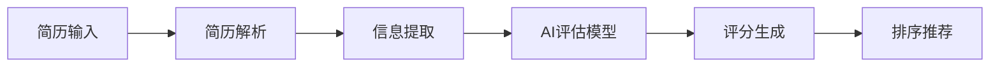

**技术特色**：
- 基于NLP技术的简历关键信息提取与结构化
- 多层次机器学习模型评估候选人匹配度
- 可配置的评分规则适应不同岗位需求

#### 热度分析

- 项目Star数2257且今日新增203，显示近期关注度快速上升，可能与AI招聘工具需求增长相关
- Fork数601，社区活跃度中等，表明有一定二次开发与定制需求

#### 快速上手

```bash
# 克隆项目
git clone https://github.com/interviewstreet/hiring-agent.git

# 安装依赖
pip install -r requirements.txt

# 运行评估
python main.py --resume path/to/resume.pdf
```

#### 注意事项

- 注意简历数据隐私保护，确保符合相关数据保护法规
- AI评估结果应作为辅助参考，最终决策仍需人工审核
- 可能需要根据具体岗位特点调整评估模型参数以获得最佳效果


### 10. kunchenguid/no-mistakes — Git推送保护

> **一句话总结**：通过预检查机制防止开发者推送可能包含错误的代码到远程仓库。

#### 价值主张

| 维度 | 说明 |
|------|------|
| **解决痛点** | 防止开发者意外推送错误代码、敏感信息或不完整的更改 |
| **目标用户** | Git使用者，特别是团队协作中的开发者 |
| **核心亮点** | 自动化检查 + 多维度验证 + 错误拦截 |

#### 技术架构

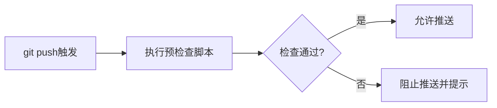

**技术特色**：
- 基于Go语言开发的高性能Git钩子工具
- 支持自定义检查规则和验证逻辑
- 与现有Git工作流无缝集成

#### 热度分析

- 项目获得2220个Star，单日增长110，显示出开发社区对该工具的强烈兴趣
- 零Open Issues表明项目维护良好，用户问题得到及时解决

#### 快速上手

```bash
# 克隆项目
git clone https://github.com/kunchenguid/no-mistakes.git
# 安装到本地Git仓库
cp no-mistakes/hooks/pre-push .git/hooks/
# 确保脚本可执行
chmod +x .git/hooks/pre-push
```

#### 注意事项

- 需要确保pre-push钩子脚本有执行权限
- 可能需要根据团队具体需求调整检查规则
- 在紧急情况下可能需要临时禁用钩子检查


### 11. flutter/flutter — 跨平台UI框架

> **一句话总结**：Flutter是Google推出的高性能跨平台UI框架，实现一套代码多端运行。

#### 价值主张

| 维度 | 说明 |
|------|------|
| **解决痛点** | 解决跨平台开发中UI不一致、性能低、开发效率低的问题 |
| **目标用户** | 移动应用开发者，需同时支持iOS和Android的开发团队 |
| **核心亮点** | 跨平台能力 + 高性能渲染 + 热重载 + 丰富UI组件 + 原生性能 |

#### 技术架构

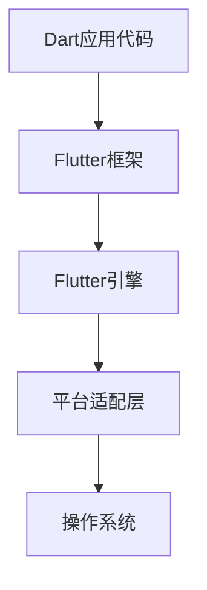

**技术特色**：
- 自带渲染引擎，不依赖原生UI组件
- 使用Skia图形库进行高性能渲染
- 采用响应式编程模型，状态驱动UI更新

#### 热度分析

- 作为Google支持的跨平台框架，Star数持续增长，社区活跃度极高
- 在跨平台开发领域处于领先地位，企业采用率持续提升

#### 快速上手

```bash
# 安装Flutter SDK
git clone https://github.com/flutter/flutter.git
# 创建新项目
flutter create my_app
cd my_app && flutter run
```

#### 注意事项

- Flutter应用包体积相对较大，因为包含了整个渲染引擎
- 对于需要大量使用原生功能的复杂应用，可能需要编写平台特定代码
- Flutter 2.0后支持Web开发，但Web端支持仍在不断完善中


### 12. Flowseal/zapret-discord-youtube — [网络访问工具]

> **一句话总结**：一个绕过网络限制，允许访问Discord和YouTube的批处理工具。

#### 价值主张

| 维度 | 说明 |
|------|------|
| **解决痛点** | 解决网络限制下无法访问Discord和YouTube的问题 |
| **目标用户** | 受网络限制影响需要访问特定服务的用户 |
| **核心亮点** | 简单易用 + 批处理脚本 + 无需安装 |

#### 技术架构

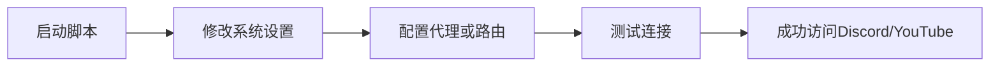

**技术特色**：
- 使用Windows系统API修改网络配置
- 无需安装额外软件，直接运行批处理文件
- 通过修改系统路由表绕过限制

#### 热度分析

- 项目获得超过3万star，表明解决了一个广泛的网络访问需求
- 较高的fork数量显示用户积极使用和修改此工具

#### 快速上手

```bash
# 下载项目文件
git clone https://github.com/Flowseal/zapret-discord-youtube.git
# 运行批处理文件
cd zapret-discord-youtube
start zapret-discord-youtube.bat
```

#### 注意事项

- 此工具可能违反某些网络使用政策，请在合法合规的前提下使用
- 需要管理员权限才能修改系统网络设置
- 可能会影响其他网络应用的性能


### 13. andreknieriem/headunit-revived — Android Auto复刻

> **一句话总结**：开源应用将Android Auto界面移植到普通设备，打造车载系统体验。

#### 价值主张

| 维度 | 说明 |
|------|------|
| **解决痛点** | 突破硬件限制，让无车载系统的设备也能体验Android Auto |
| **目标用户** | Android用户、汽车爱好者、开发者 |
| **核心亮点** | 跨设备支持 + 开源可定制 + 无需车载硬件 |

#### 技术架构

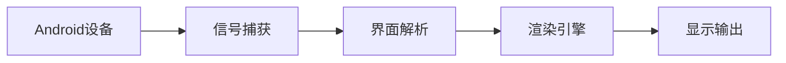

**技术特色**：
- 利用Kotlin语言特性优化Android Auto兼容性
- 通过API逆向实现车载系统UI完整复刻
- 模拟车载系统通信协议实现功能对接

#### 热度分析

- 项目持续获得星标增长，表明用户需求稳定且项目活跃
- Fork数相对较少，暗示项目已进入成熟维护阶段

#### 快速上手

```bash
git clone https://github.com/andreknieriem/headunit-revived.git
cd headunit-revived
./gradlew assembleDebug
adb install app/build/outputs/apk/debug/app-debug.apk
```

#### 注意事项

- 需要Android 8.0及以上系统版本
- 部分功能可能需要额外权限或root权限
- 使用时需遵守Google Android Auto服务条款


## 今日推荐

| 主题 | 推荐项目 | 亮点 |
|------|----------|------|
| 今日最热 | [calesthio/OpenMontage](https://github.com/calesthio/OpenMontage) | World's first ope... |
| 值得关注 | [apple/container](https://github.com/apple/container) | A tool for creati... |
| 快速上手 | [ZhuLinsen/daily_stock_analysis](https://github.com/ZhuLinsen/daily_stock_analysis) | LLM 驱动的多市场股票智能分析系... |
| 长期潜力 | [NousResearch/hermes-agent](https://github.com/NousResearch/hermes-agent) | The agent that gr... |

---

<div align="center">

*Generated on 2026-06-25 | Powered by GitHub Trending Reporter*

</div>