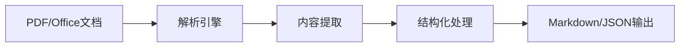
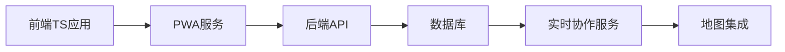
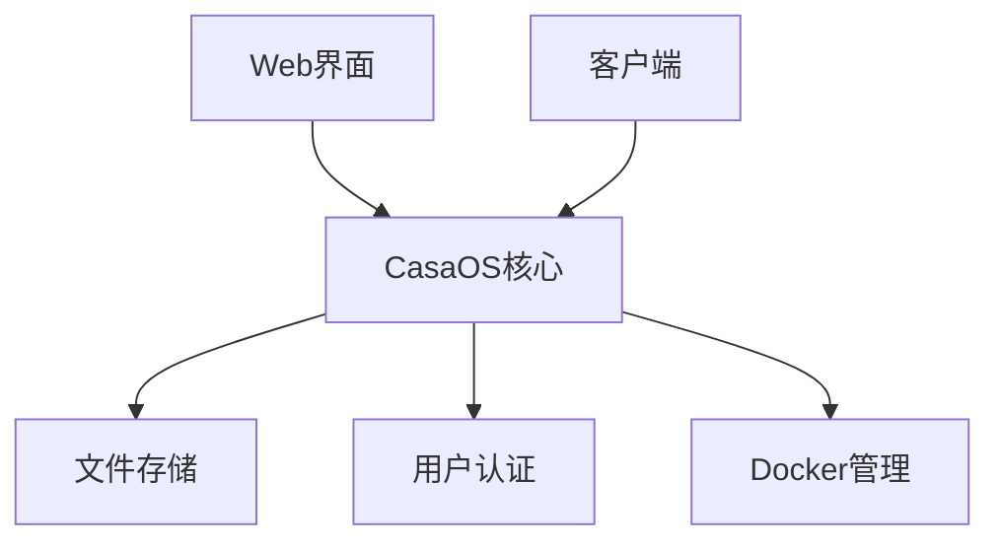
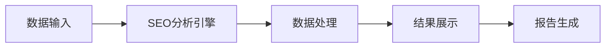
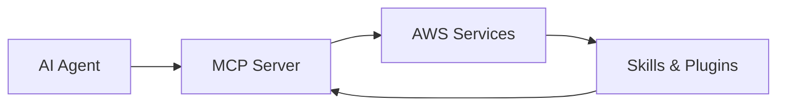

## 今日热点

AI代理技术持续火爆，各领域专业AI工具井喷式增长，同时文档处理与转换工具需求旺盛，显示AI应用正加速落地各垂直领域。

---

## 热门项目一览

| 排名 | 项目 | 语言 | 今日 | 总计 | 简介 |
|:---:|------|:----:|------:|-----:|------|
| 1 | [calesthio/OpenMontage](https://github.com/calesthio/OpenMontage) | Python | +3,434 | 22,237 | World's first open-source, ... |
| 2 | [google-labs-code/design.md](https://github.com/google-labs-code/design.md) | TypeScript | +1,475 | 19,434 | A format specification for ... |
| 3 | [apple/container](https://github.com/apple/container) | Swift | +1,351 | 43,256 | A tool for creating and run... |
| 4 | [JCodesMore/ai-website-cloner-template](https://github.com/JCodesMore/ai-website-cloner-template) | TypeScript | +1,024 | 20,535 | Clone any website with one ... |
| 5 | [garrytan/gstack](https://github.com/garrytan/gstack) | TypeScript | +767 | 115,876 | Use Garry Tan's exact Claud... |
| 6 | [opendatalab/MinerU](https://github.com/opendatalab/MinerU) | Python | +644 | 69,650 | Transforms complex document... |
| 7 | [mukul975/Anthropic-Cybersecurity-Skills](https://github.com/mukul975/Anthropic-Cybersecurity-Skills) | Python | +571 | 21,295 | 817 structured cybersecurit... |
| 8 | [NanmiCoder/MediaCrawler](https://github.com/NanmiCoder/MediaCrawler) | Python | +398 | 52,836 | 小红书笔记 | 评论爬虫、抖音视频 | 评论爬虫、快手... |
| 9 | [xbtlin/ai-berkshire](https://github.com/xbtlin/ai-berkshire) | Python | +309 | 2,060 | AI 时代的伯克希尔：基于 Claude Code 的... |
| 10 | [shanraisshan/claude-code-best-practice](https://github.com/shanraisshan/claude-code-best-practice) | HTML | +287 | 60,655 | from vibe coding to agentic... |
| 11 | [mauriceboe/TREK](https://github.com/mauriceboe/TREK) | TypeScript | +241 | 6,767 | A self-hosted travel/trip p... |
| 12 | [IceWhaleTech/CasaOS](https://github.com/IceWhaleTech/CasaOS) | Go | +223 | 34,870 | CasaOS - A simple, easy-to-... |

---

## 趋势洞察

```
┌─────────────────────────────────────────────────────────────────┐
│  AI/ML 工具         ████████████████████████  11 个项目        │
│  其他               ██████                    3 个项目        │
│  多媒体应用            ██                        1 个项目        │
│  媒体资源             ██                        1 个项目        │
└─────────────────────────────────────────────────────────────────┘
```

---

## 项目深度解读

### 1. calesthio/OpenMontage — AI视频制作系统

> **一句话总结**：世界首个开源代理式视频制作系统，将AI助手转变为完整视频工作室。

#### 价值主张

| 维度 | 说明 |
|------|------|
| **解决痛点** | 降低视频制作门槛，实现自动化、智能化内容创作 |
| **目标用户** | 内容创作者、视频制作人、AI开发者、创意工作者 |
| **核心亮点** | 12个专业视频处理管道 + 52种制作工具 + 500+代理技能 |

#### 技术架构


**技术特色**：
- 模块化代理架构，支持复杂视频处理流程
- 多工具集成与协同工作机制
- 大规模AI技能库与智能决策系统

#### 热度分析

- 近期Star激增(+3,434)，显示项目正处于快速成长期，热度极高
- 零Open Issues表明项目维护良好，用户反馈渠道可能转向其他方式

#### 快速上手

```bash
# 克隆项目
git clone https://github.com/calesthio/OpenMontage.git

# 安装依赖
cd OpenMontage
pip install -r requirements.txt
```

#### 注意事项

- 许可证信息不明确，使用前需确认开源协议
- 项目功能强大但可能需要较高配置的硬件环境
- 500+代理技能的学习曲线可能较陡峭


### 2. google-labs-code/design.md — [设计系统规范]

> **一句话总结**：DESIGN.md为AI编程代理提供结构化设计系统描述，实现一致的设计实现。

#### 价值主张

| 维度 | 说明 |
|------|------|
| **解决痛点** | 解决AI代理无法理解设计系统，导致实现不一致的问题 |
| **目标用户** | 设计系统开发者、UI/UX设计师、AI工具开发者 |
| **核心亮点** | 结构化设计描述 + 持久性理解 + AI代理兼容性 + 设计一致性保证 + 跨工具兼容性 |

#### 技术架构


**技术特色**：
- 基于TypeScript的类型安全规范定义
- 结构化描述设计系统的组件和原则
- 为AI代理提供可解析的设计语言

#### 热度分析

- 项目在短时间内获得大量关注，单日增长1475个star，表明开发者社区对AI辅助设计工具有强烈需求
- 虽然无开放问题，但高fork数显示社区积极参与和扩展该规范

#### 快速上手

```bash
# 克隆项目
git clone https://github.com/google-labs-code/design.md.git

# 查看规范文档
cat DESIGN.md.md
```

#### 注意事项

- 项目处于早期阶段，规范可能仍在迭代中
- 需要配合支持DESIGN.md的AI工具才能发挥最大效用
- 需要一定的TypeScript知识来理解规范定义


### 3. apple/container — 苹果容器化工具

> **一句话总结**：Swift编写的Mac专用Linux容器工具，针对Apple芯片优化，提供轻量级虚拟机支持。

#### 价值主张

| 维度 | 说明 |
|------|------|
| **解决痛点** | 解决Mac环境下运行Linux容器性能问题，提供原生Apple芯片优化 |
| **目标用户** | Mac开发者、Apple Silicon用户、需要Linux环境的苹果电脑用户 |
| **核心亮点** | Swift原生实现 + Apple芯片优化 + 轻量级虚拟机 + Linux容器支持 |

#### 技术架构


**技术特色**：
- Swift原生实现，充分利用Apple生态系统优势
- 针对Apple Silicon芯片优化，提供接近原生的性能
- 轻量级虚拟机技术，减少资源开销
- 无需完整Linux系统，容器启动快速
- 与macOS深度集成，提供无缝体验

#### 热度分析

- 项目获得超过4.3万星，近期单日增长超1300，显示开发者高度关注
- 零开放问题表明项目成熟度高，维护状态良好
- 作为Apple生态容器解决方案，填补了macOS下Linux容器化工具的空白

#### 快速上手

```bash
# 安装container
brew install apple/container

# 创建容器
container create my-container --image=ubuntu:latest

# 运行容器
container run my-container
```

#### 注意事项

- 仅支持Apple Silicon Mac，Intel Mac可能不兼容
- 需要macOS最新版本以获得最佳兼容性
- 容器生态系统相比Docker可能不够成熟
- 需要一定Swift和Linux容器基础知识


### 4. JCodesMore/ai-website-cloner-template — AI网站克隆器

> **一句话总结**：利用AI编码代理一键克隆任何网站，实现自动化网站复制与重建

#### 价值主张

| 维度 | 说明 |
|------|------|
| **解决痛点** | 简化网站克隆流程，无需手动编写复杂代码即可快速复制网站 |
| **目标用户** | 开发者、网站管理员、需要快速复制网站内容的专业人士 |
| **核心亮点** | AI驱动自动化克隆 + 一键命令执行 + 保持网站结构与功能完整性 |

#### 技术架构


**技术特色**：
- 利用AI技术自动解析和重建网站结构
- 支持一键命令执行，简化克隆流程
- 保持原网站的布局、样式和功能完整性

#### 热度分析

- 项目Star数超过2万，近期单日增长超过1000，显示极高的社区关注度
- Fork数与Star数比例合理，表明项目具有高实用性和二次开发价值

#### 快速上手

```bash
# 安装项目依赖
npm install

# 克隆指定网站
npm run clone https://example.com

# 启动克隆后的网站
npm run serve
```

#### 注意事项

- 克隆网站时需遵守相关法律法规和版权规定
- AI生成的代码可能需要进一步优化和调整
- 复杂JavaScript功能的网站可能无法完美克隆


### 5. garrytan/gstack — AI开发工具集

> **一句话总结**：23个精心挑选的工具集合，模拟多角色专业工作流提升AI辅助开发效率

#### 价值主张

| 维度 | 说明 |
|------|------|
| **解决痛点** | 解决AI辅助开发工具分散、难以形成有效工作流程的问题 |
| **目标用户** | 软件开发者、产品经理、技术团队负责人 |
| **核心亮点** | 23个精选工具 + 多角色模拟 + 全栈开发支持 |

#### 技术架构


**技术特色**：
- 基于TypeScript构建，保证类型安全
- 工具模块化设计，易于扩展
- 集成多种AI模型和API

#### 热度分析

- 单日增长767星，显示极高关注度和活跃采用率
- Fork数量达1.7万+，表明社区积极参与项目改进和定制

#### 快速上手

```bash
# 克隆仓库
git clone https://github.com/garrytan/gstack.git
cd gstack
# 安装依赖
npm install
```

#### 注意事项

- 项目依赖多种AI服务，需要准备相应的API密钥
- 工具配置可能需要根据个人开发环境进行调整
- 部分工具可能需要特定的系统权限或环境配置


### 6. opendatalab/MinerU — 文档转换引擎

> **一句话总结**：将复杂文档转换为LLM友好格式，赋能AI工作流程的文档处理工具。

#### 价值主张

| 维度 | 说明 |
|------|------|
| **解决痛点** | 解决LLM难以直接处理复杂文档格式的问题 |
| **目标用户** | AI研究人员、数据科学家、自动化工作流开发者 |
| **核心亮点** | 多格式支持 + 高质量转换 + 保留元数据 + 结构化输出 |

#### 技术架构



**技术特色**：
- 多格式文档解析引擎，支持PDF、Word等主流格式
- 智能内容提取，保留文档结构和语义信息
- LLM优化输出，确保转换结果适合AI模型处理

#### 热度分析

- Star数近7万，近期增长迅速，显示文档处理AI工具需求旺盛
- Fork数近6千，社区活跃度高，表明开发者参与度良好

#### 快速上手

```bash
# 安装MinerU
pip install mineru

# 基本使用
mineru input.pdf --output output.md
```

#### 注意事项

- 处理大型文档可能需要较高计算资源
- 输出质量可能受原始文档格式复杂度影响
- 需要确保文档内容符合使用许可，避免版权问题


### 7. mukul975/Anthropic-Cybersecurity-Skills — AI安全技能库

> **一句话总结**：为AI agent提供结构化网络安全技能，映射至6大主流安全框架。

#### 价值主张

| 维度 | 说明 |
|------|------|
| **解决痛点** | 缺乏标准化、结构化的网络安全技能体系，AI安全能力建设无据可依 |
| **目标用户** | AI安全开发者、网络安全团队、AI系统构建者 |
| **核心亮点** | 817结构化技能 + 6大框架映射 + 20+平台兼容 + 29安全领域覆盖 |

#### 技术架构


**技术特色**：
- 采用标准化技能描述语言，确保技能表达的一致性
- 实现多框架映射算法，解决不同安全标准间的转换问题
- 提供轻量级API，支持20+开发平台的无缝集成

#### 热度分析

- 项目Star数超过21,000，近期增长迅速(+571 today)，表明网络安全AI领域需求旺盛
- 作为安全技能标准化项目，在AI安全生态中处于基础支撑地位，具有广泛的应用前景

#### 快速上手

```bash
# 克隆项目
git clone https://github.com/mukul975/Anthropic-Cybersecurity-Skills.git

# 查看技能数据
cat Anthropic-Cybersecurity-Skills/data/skills.json | jq '.[0]'
```

#### 注意事项

- 项目依赖JSON格式的技能数据，使用前需验证数据完整性
- 不同平台集成可能需要额外的配置和适配工作
- 技能库需要定期更新以应对新的安全威胁和框架变化


### 8. NanmiCoder/MediaCrawler — 全平台媒体爬虫

> **一句话总结**：一站式多平台社交媒体数据采集工具，支持小红书、抖音、快手等七大平台内容爬取。

#### 价值主张

| 维度 | 说明 |
|------|------|
| **解决痛点** | 统一解决多平台数据采集难题，避免重复开发和维护多套爬虫系统 |
| **目标用户** | 数据分析师、研究人员、市场营销人员、内容创作者 |
| **核心亮点** | 多平台支持 + 模块化设计 + 智能反爬 + 配置简单 + 定时任务 |

#### 技术架构


**技术特色**：
- 分布式爬虫架构，提高数据采集效率
- 智能反爬策略，降低被封禁风险
- 模块化设计，便于扩展和维护

#### 热度分析

- 项目Star数超5万，日增近400，表明项目热度持续上升，受到广泛认可
- Fork数超1万，说明社区活跃度高，二次开发价值显著

#### 快速上手

```bash
# 安装依赖
pip install -r requirements.txt

# 运行爬虫
python run.py 小红书
```

#### 注意事项

- 使用前请确保遵守各平台的使用条款和法律法规
- 建议控制爬取频率，避免对平台服务器造成过大压力
- 定期更新代码以应对平台反爬策略的变化


### 9. xbtlin/ai-berkshire — AI投资框架

> **一句话总结**：结合四大投资大师方法论与多Agent并行分析的价值投资AI研究框架

#### 价值主张

| 维度 | 说明 |
|------|------|
| **解决痛点** | 传统价值投资分析效率低、主观性强，AI辅助提升决策质量 |
| **目标用户** | 价值投资者、金融分析师、量化研究人员 |
| **核心亮点** | 多大师方法论整合 + 多Agent并行分析 + AI驱动决策 |

#### 技术架构


**技术特色**：
- 融合巴菲特、芒格、段永平、李录四位大师投资理念
- 多Agent并行处理提升分析效率
- 基于Claude Code实现高质量投资研究

#### 热度分析

- 项目近期增长迅猛，单日新增Star数达309，显示市场高度关注
- 社区活跃度较高，Fork数达314，表明有一定二次开发基础

#### 快速上手

```bash
# 克隆项目
git clone https://github.com/xbtlin/ai-berkshire.git

# 安装依赖
pip install -r requirements.txt
```

#### 注意事项

- 项目许可证未知，使用前需确认授权条款
- 依赖Claude API，可能产生额外费用
- 作为投资工具，AI分析结果仅供参考，需结合专业判断


### 10. shanraisshan/claude-code-best-practice — AI编程指南

> **一句话总结**：提供Claude AI编程助手的系统化实践指南，提升开发者与AI协作效率

#### 价值主张

| 维度 | 说明 |
|------|------|
| **解决痛点** | 解决AI编程助手使用不系统、提示不精准、效果不稳定问题 |
| **目标用户** | 开发者、AI工具使用者、希望提高编程效率的技术人员 |
| **核心亮点** | 实用技巧 + 实际案例 + 进阶方法 + 提示模板 + 工程化应用 |

#### 技术架构


**技术特色**：
- 结构化学习路径，从基础到高级循序渐进
- 实际案例驱动的教学方法，提供可直接复用的模板
- 工程化的AI助手应用方法，提升团队协作效率

#### 热度分析

- 项目获得6万+星，近期持续增长，表明AI编程助手实践需求旺盛
- 无开放问题，文档质量高，用户反馈良好，社区维护完善

#### 快速上手

```bash
# 克隆项目
git clone https://github.com/shanraisshan/claude-code-best-practice.git

# 浏览内容
cd claude-code-best-practice && open index.html
```

#### 注意事项

- 项目基于HTML构建，部分功能可能需要本地服务器才能正确显示
- 内容针对Claude AI优化，其他AI助手可能需要调整提示方法
- 实践过程中需注意AI生成代码的安全性和质量检查


### 11. mauriceboe/TREK — 团队旅行规划

> **一句话总结**：功能完善的自托管旅行规划平台，支持实时协作与互动地图，提供一站式行程管理体验。

#### 价值主张

| 维度 | 说明 |
|------|------|
| **解决痛点** | 解决传统旅行工具协作不便、功能分散问题，提供统一行程管理方案 |
| **目标用户** | 需要团队协作规划行程的旅行者、家庭出游组织者 |
| **核心亮点** | 实时协作 + 互动地图 + PWA支持 + 单点登录 + 预算管理 |

#### 技术架构



**技术特色**：
- 采用TypeScript全栈开发，保证代码质量与类型安全
- 支持PWA特性，提供离线访问与类原生应用体验
- 实现实时协作功能，允许多人同时编辑行程

#### 热度分析

- 项目星标近7000且持续增长，表明功能完善且受用户欢迎
- 0个开放问题反映项目维护良好，问题解决效率高

#### 快速上手

```bash
# 克隆项目
git clone https://github.com/mauriceboe/TREK.git

# 安装依赖并启动
npm install && npm run dev
```

#### 注意事项

- 需要自行托管服务器，不提供云服务
- 许可证信息不明确，使用前需确认授权条款
- 可能需要一定的技术背景进行部署和维护


### 12. IceWhaleTech/CasaOS — 个人私有云

> **一句话总结**：简单易用的开源个人云系统，让用户轻松搭建私有云环境。

#### 价值主张

| 维度 | 说明 |
|------|------|
| **解决痛点** | 个人用户缺乏简单易用的私有云解决方案，难以集中管理数据 |
| **目标用户** | 普通家庭用户、小型团队、个人开发者 |
| **核心亮点** | 一键安装 + 直观Web界面 + Docker应用集成 |

#### 技术架构



**技术特色**：
- 基于 Go 语言开发，性能优异
- 轻量级设计，资源占用少
- 采用现代化前端界面，用户体验佳

#### 热度分析

- 项目 Star 数超过 3.4 万，持续稳定增长，社区活跃度高
- 作为开源个人云系统，在家庭和小型企业私有云领域具有较强竞争力

#### 快速上手

```bash
curl -fsSL https://get.casaos.io | bash
```

#### 注意事项

- 需要一定的技术基础才能进行高级配置和故障排查
- 数据安全依赖于用户自身的安全措施，需要定期备份
- 可能需要一定的硬件资源，特别是存储空间


### 13. alibaba/page-agent — 网页智能控制

> **一句话总结**：通过自然语言控制网页界面，实现智能化交互体验，降低网页操作门槛。

#### 价值主张

| 维度 | 说明 |
|------|------|
| **解决痛点** | 复杂网页操作门槛高，自动化交互流程繁琐，缺乏直观的界面控制方式 |
| **目标用户** | 前端开发者、测试工程师、网页自动化需求用户 |
| **核心亮点** | 自然语言交互 + 网页元素智能识别 + 动态界面控制 + 跨浏览器兼容 |

#### 技术架构


**技术特色**：
- 基于大语言模型的语义理解技术
- 精准的DOM元素定位与操作机制
- 跨浏览器兼容的事件模拟系统

#### 热度分析

- 项目获得近2万星，日增长稳定，表明在网页自动化领域有较高关注度
- 作为阿里巴巴开源项目，在企业级应用场景中具有较强影响力

#### 快速上手

```bash
# 安装
npm install page-agent

# 基本使用
const agent = require('page-agent');
agent.start().then(() => {
  agent.control('点击登录按钮');
});
```

#### 注意事项

- 需要确保目标网页支持JavaScript执行
- 复杂网页可能需要额外的元素定位配置
- 自然语言指令应尽量明确具体，避免歧义


### 14. Free-TV/IPTV — 免费电视源

> **一句话总结**：提供全球免费电视频道的M3U播放列表，无需订阅即可观看。

#### 价值主张

| 维度 | 说明 |
|------|------|
| **解决痛点** | 提供免费合法的电视频道资源，避免付费订阅 |
| **目标用户** | 寻求免费电视内容观看体验的用户 |
| **核心亮点** | 全球频道覆盖 + 实时更新 + 多设备兼容 + 开源免费 |

#### 技术架构


**技术特色**：
- 基于Python实现，便于跨平台部署
- M3U格式标准化，兼容多种播放器
- 定期更新播放列表，确保频道可用性

#### 热度分析

- 项目获得18k+星标，近期增长稳定，表明用户需求持续存在
- 社区活跃度高，但无公开Issues，可能通过其他渠道讨论问题

#### 快速上手

```bash
# 克隆项目
git clone https://github.com/Free-TV/IPTV.git

# 使用播放列表
# 将生成的m3u文件导入支持的播放器
```

#### 注意事项

- 使用前请确认频道来源的合法性
- 部分频道可能存在地区访问限制
- 播放列表更新频率可能影响可用性


### 15. every-app/open-seo — 开源SEO工具

> **一句话总结**：开源替代Semrush和Ahrefs的SEO分析工具，提供网站性能和关键词分析功能。

#### 价值主张

| 维度 | 说明 |
|------|------|
| **解决痛点** | 提供免费开源的SEO分析工具，替代商业软件的高昂成本 |
| **目标用户** | SEO从业者、网站管理员、数字营销人员 |
| **核心亮点** | 开源免费 + 功能全面 + 数据可视化 + API支持 + 隐私保护 |

#### 技术架构



**技术特色**：
- 基于TypeScript开发，提供类型安全和良好的开发体验
- 支持多种SEO数据源的采集和分析
- 提供RESTful API便于集成和扩展

#### 热度分析

- 项目Star数持续增长，日增57，表明社区认可度高且发展迅速
- Fork数相对Star数比例适中，说明项目既有稳定用户也有活跃贡献者

#### 快速上手

```bash
# 克隆项目
git clone https://github.com/every-app/open-seo.git
# 安装依赖
npm install
# 启动服务
npm run dev
```

#### 注意事项

- 项目License未知，商业使用前需确认授权方式
- 作为SEO工具，可能需要API密钥访问第三方数据源
- 功能可能不如成熟的商业工具全面，但胜在开源和可定制


### 16. aws/agent-toolkit-for-aws — AI代理AWS工具包

> **一句话总结**：AWS官方提供的AI代理工具包，帮助开发者轻松构建基于AWS的智能应用。

#### 价值主张

| 维度 | 说明 |
|------|------|
| **解决痛点** | 解决AI代理与AWS服务集成的复杂性，缺乏标准化工具链问题 |
| **目标用户** | AWS开发者、AI应用开发者及构建AI代理的工程师 |
| **核心亮点** | 官方AWS支持 + MCP服务器 + 可扩展技能库 + 丰富插件集 |

#### 技术架构



**技术特色**：
- 基于Python构建，易于扩展和定制
- 官方AWS支持，确保与AWS服务深度集成
- 提供标准化的MCP协议接口，简化AI代理开发

#### 热度分析

- 项目获得1152个star，近期增长迅速（+47 today），表明社区对该项目高度关注
- 作为AWS官方支持的项目，在AI与云服务集成领域占据重要生态位置，社区参与度高但issues较少，说明项目成熟度较高

#### 快速上手

```bash
# 安装工具包
pip install aws-agent-toolkit

# 配置AWS凭证
aws configure

# 初始化项目
aws-agent init my-ai-project
```

#### 注意事项

- 项目许可证未知，在使用前需确认许可条款
- 作为AWS官方项目，可能需要AWS账户和相关权限
- 项目依赖AWS服务，需确保网络环境可访问AWS资源


## 今日推荐

| 主题 | 推荐项目 | 亮点 |
|------|----------|------|
| 今日最热 | [calesthio/OpenMontage](https://github.com/calesthio/OpenMontage) | World's first ope... |
| 值得关注 | [google-labs-code/design.md](https://github.com/google-labs-code/design.md) | A format specific... |
| 快速上手 | [apple/container](https://github.com/apple/container) | A tool for creati... |
| 长期潜力 | [JCodesMore/ai-website-cloner-template](https://github.com/JCodesMore/ai-website-cloner-template) | Clone any website... |

---

<div align="center">

*Generated on 2026-06-26 | Powered by GitHub Trending Reporter*

</div>