## 今日热点

今日GitHub热榜项目精彩纷呈。

---

## 热门项目一览

| 排名 | 项目 | 语言 | 今日 | 总计 | 简介 |
|:---:|------|:----:|------:|-----:|------|
| 1 | [google-labs-code/design.md](https://github.com/google-labs-code/design.md) | TypeScript | +2,407 | 21,337 | A format specification for ... |
| 2 | [calesthio/OpenMontage](https://github.com/calesthio/OpenMontage) | Python | +1,754 | 23,706 | World's first open-source, ... |
| 3 | [xbtlin/ai-berkshire](https://github.com/xbtlin/ai-berkshire) | Python | +1,274 | 3,167 | AI 时代的伯克希尔：基于 Claude Code 的... |
| 4 | [Panniantong/Agent-Reach](https://github.com/Panniantong/Agent-Reach) | Python | +1,194 | 42,414 | Give your AI agent eyes to ... |
| 5 | [JCodesMore/ai-website-cloner-template](https://github.com/JCodesMore/ai-website-cloner-template) | TypeScript | +1,088 | 21,402 | Clone any website with one ... |
| 6 | [mauriceboe/TREK](https://github.com/mauriceboe/TREK) | TypeScript | +1,060 | 7,695 | A self-hosted travel/trip p... |
| 7 | [opendatalab/MinerU](https://github.com/opendatalab/MinerU) | Python | +960 | 70,466 | Transforms complex document... |
| 8 | [garrytan/gstack](https://github.com/garrytan/gstack) | TypeScript | +950 | 116,665 | Use Garry Tan's exact Claud... |
| 9 | [NanmiCoder/MediaCrawler](https://github.com/NanmiCoder/MediaCrawler) | Python | +673 | 53,387 | 小红书笔记 | 评论爬虫、抖音视频 | 评论爬虫、快手... |
| 10 | [IceWhaleTech/CasaOS](https://github.com/IceWhaleTech/CasaOS) | Go | +619 | 35,410 | CasaOS - A simple, easy-to-... |
| 11 | [simplex-chat/simplex-chat](https://github.com/simplex-chat/simplex-chat) | Haskell | +432 | 12,658 | SimpleX - the first messagi... |
| 12 | [kunchenguid/no-mistakes](https://github.com/kunchenguid/no-mistakes) | Go | +398 | 3,462 | git push no-mistakes |

---

## 趋势洞察

```
┌─────────────────────────────────────────────────────────────────┐
│  AI/ML 工具         ████████████████████████  10 个项目        │
│  其他               ████████████              5 个项目        │
│  多媒体应用            ██                        1 个项目        │
│  数据分析             ██                        1 个项目        │
└─────────────────────────────────────────────────────────────────┘
```

---

## 项目深度解读

### 1. google-labs-code/design.md — [设计系统规范]

> **一句话总结**：为AI编码代理提供结构化设计系统理解的标准化格式规范。

#### 价值主张

| 维度 | 说明 |
|------|------|
| **解决痛点** | 解决AI代理缺乏对设计系统结构化理解的问题，确保设计一致性 |
| **目标用户** | 前端开发者、UI设计师、AI系统开发团队 |
| **核心亮点** | 标准化设计描述格式 + AI友好的结构化表达 + 持久化设计理解 |

#### 技术架构

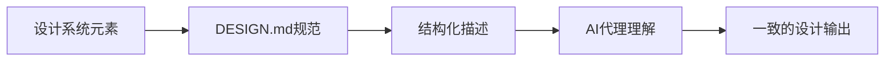

**技术特色**：
- 结构化设计语言规范，提升机器可读性
- 与AI系统无缝集成，实现自动化设计遵循
- 轻量级文档格式，易于维护和版本控制

#### 热度分析
- 项目获得21k+星，单日增长2400+，显示开发者社区对设计系统AI化高度关注
- 零开放问题表明项目成熟度高，社区需求明确且已满足

#### 快速上手

```bash
# 创建DESIGN.md模板文件
echo "# DESIGN.md\n\n## Color Palette\n\n## Typography\n\n## Components\n\n## Spacing\n" > DESIGN.md
```

#### 注意事项
- 这是一个规范文档而非实现库，需要团队自行遵循和实施
- 规范可能随着AI技术的发展而更新，需关注版本变化
- 团队共识是有效实施的关键，需建立统一的设计理解标准


### 2. calesthio/OpenMontage — [智能视频工坊]

> **一句话总结**：开源AI视频制作系统，将编程助手转变为全功能视频制作工作室，实现12条专业流水线自动化。

#### 价值主张

| 维度 | 说明 |
|------|------|
| **解决痛点** | 视频制作流程繁琐、工具分散、技术门槛高，缺乏一站式解决方案 |
| **目标用户** | 内容创作者、视频制作团队、AI开发者、自媒体运营者 |
| **核心亮点** | 12条专业流水线 + 52种制作工具 + 500+AI技能集成 + 开源可定制 + 全流程自动化 |

#### 技术架构


**技术特色**：
- 模块化工具链设计，支持视频制作全流程自动化
- 多智能体协作系统，实现复杂任务的智能分配与执行
- 开源架构，支持自定义工具和技能扩展，满足个性化需求

#### 热度分析

- 项目短时间内获得2.3万stars，单日增长超1.7k，显示视频AI领域高度关注
- 作为首个开源视频制作系统，填补市场空白，吸引大量开发者和内容创作者参与

#### 快速上手

```bash
# 克隆项目
git clone https://github.com/calesthio/OpenMontage.git
cd OpenMontage

# 安装依赖
pip install -r requirements.txt

# 启动系统
python main.py --help
```

#### 注意事项

- 项目可能需要较高的计算资源，特别是处理大型视频文件时
- 需要了解AI工具和视频制作基础知识才能充分利用系统功能
- 作为开源项目，可能需要社区贡献来完善特定功能


### 3. xbtlin/ai-berkshire — AI价值投资框架

> **一句话总结**：融合四位投资大师方法论与AI技术，构建多Agent并行价值投资研究框架。

#### 价值主张

| 维度 | 说明 |
|------|------|
| **解决痛点** | 传统价值投资研究效率低下，AI辅助提升研究深度与广度 |
| **目标用户** | 价值投资者、金融分析师、量化研究人员 |
| **核心亮点** | 四大师方法论集成 + 多Agent并行研究 + Claude Code智能分析 + 自动化研究流程 |

#### 技术架构

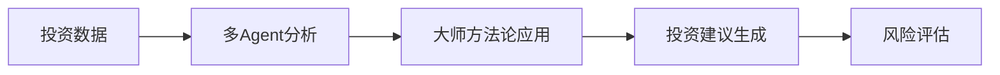

**技术特色**：
- 基于Claude Code的大语言模型深度集成
- 多智能体并行研究架构设计
- 四大师投资思想数字化实现

#### 热度分析

- 项目近期Star激增1,274，显示市场对AI投资工具高度关注
- 处于AI与价值投资交叉前沿，具有独特技术生态位

#### 快速上手

```bash
# 克隆项目
git clone https://github.com/xbtlin/ai-berkshire.git

# 安装依赖
pip install -r requirements.txt

# 运行研究框架
python ai_berkshire.py --stock STOCK_CODE
```

#### 注意事项

- 项目许可证未知，商业使用前需确认授权
- 依赖Claude Code API，需要相应访问权限
- 投资决策仍需人工判断，AI仅为辅助工具


### 4. Panniantong/Agent-Reach — AI互联网接入工具

> **一句话总结**：通过单一CLI接口，让AI代理免费访问多个社交媒体平台内容，无需API费用。

#### 价值主张

| 维度 | 说明 |
|------|------|
| **解决痛点** | AI代理无法直接获取互联网实时多平台内容，且传统API访问成本高 |
| **目标用户** | AI开发者、研究人员、数据分析师、内容创作者 |
| **核心亮点** | 多平台支持 + 零API费用 + 单一CLI接口 + 免费使用 + 简单部署 |

#### 技术架构

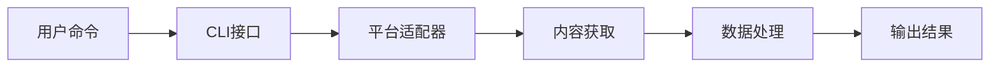

**技术特色**：
- 模拟浏览器行为绕过平台限制
- 多平台统一接口设计
- 高效数据提取与处理
- 零API依赖架构
- 简洁的命令行界面

#### 热度分析

- 项目获得4万多星，且近期增长迅速，表明市场需求强烈且功能实用
- Fork数相对适中，表明项目处于早期采用阶段，社区参与度正在提升

#### 快速上手

```bash
# 克隆项目
git clone https://github.com/Panniantong/Agent-Reach.git

# 安装依赖
pip install -r requirements.txt

# 运行示例
python agent-reach --platform twitter --query "AI"
```

#### 注意事项

- 项目可能涉及数据获取的合法性问题，使用时需遵守各平台服务条款
- 免费使用可能面临平台反爬措施升级的风险
- 项目许可证未知，商业使用前需确认授权情况
- 随着平台更新，可能需要定期维护适配器


### 5. JCodesMore/ai-website-cloner-template — AI网站克隆

> **一句话总结**：通过AI编码代理实现一键克隆任意网站，大幅简化网站复制流程。

#### 价值主张

| 维度 | 说明 |
|------|------|
| **解决痛点** | 传统网站克隆需要手动编写代码，过程繁琐且耗时 |
| **目标用户** | 开发者、网站管理员、内容创作者、测试人员 |
| **核心亮点** | AI驱动自动化 + 一键命令执行 + 高度还原网站结构 |

#### 技术架构


**技术特色**：
- 利用AI编码代理自动解析并重建网站代码
- TypeScript提供类型安全性和开发效率
- 支持响应式设计和复杂交互功能的克隆

#### 热度分析

- 项目获得21,402个Star且近期激增，显示AI辅助开发工具市场需求旺盛
- 3,102个Fork表明开发者社区积极参与定制和功能扩展

#### 快速上手

```bash
# 克隆项目
git clone https://github.com/JCodesMore/ai-website-cloner-template.git

# 安装依赖
npm install

# 使用AI克隆网站
npm run clone <网站URL>
```

#### 注意事项

- 克隆网站时需遵守目标网站的版权和使用条款
- AI生成的代码可能需要手动调整以完全符合预期
- 对于复杂网站或单页应用(SPA)，克隆效果可能有限
- 项目依赖AI服务，可能需要配置API密钥


### 6. mauriceboe/TREK — 旅行规划神器

> **一句话总结**：全功能自托管旅行规划平台，支持实时协作与多设备同步，一站式管理行程与预算。

#### 价值主张

| 维度 | 说明 |
|------|------|
| **解决痛点** | 解决旅行规划碎片化、协作不便、预算失控等问题 |
| **目标用户** | 喜欢精细规划行程的旅行者、团队旅行组织者 |
| **核心亮点** | 实时协作 + 交互式地图 + PWA支持 + 预算管理 + 打包清单 |

#### 技术架构

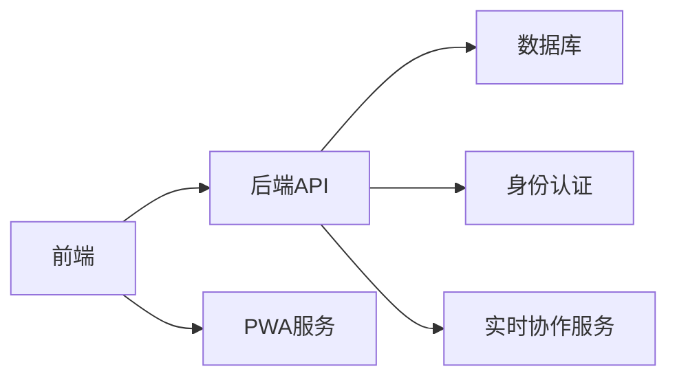

**技术特色**：
- 基于TypeScript的全栈开发确保代码质量
- 支持PWA实现跨设备无缝旅行规划体验
- 实时协作功能保障团队规划同步高效

#### 热度分析

- 项目近期激增超过1000星，显示旅行规划工具需求旺盛
- 相对较低的Fork比例表明项目更多作为直接使用而非二次开发

#### 快速上手

```bash
# 克隆项目
git clone https://github.com/mauriceboe/TREK.git
# 安装依赖
npm install
# 启动开发服务器
npm run dev
```

#### 注意事项

- 需要自托管部署，有一定技术门槛
- 许可证信息不明确，使用前需确认授权条款


### 7. opendatalab/MinerU — [文档智能转换]

> **一句话总结**：将复杂文档转换为LLM友好的结构化数据，赋能大语言模型代理工作流。

#### 价值主张

| 维度 | 说明 |
|------|------|
| **解决痛点** | 复杂文档格式难以直接用于LLM处理，需结构化转换 |
| **目标用户** | AI研究人员、大语言模型应用开发者、数据科学家 |
| **核心亮点** | 多格式支持 + 高质量转换 + 保留原始结构 + LLM就绪输出 |

#### 技术架构

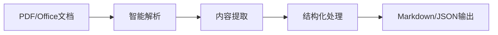

**技术特色**：
- 多格式文档解析引擎，支持PDF、Word、Excel等
- 智能内容提取与保留原始文档结构
- 优化输出格式适配大语言模型输入需求

#### 热度分析

- 项目获得7万+星，近期日增近千星，增长迅速，表明社区高度认可
- 零开放问题，显示项目维护良好，问题解决效率高

#### 快速上手

```bash
# 安装MinerU
pip install mineru

# 基本使用
mineru -i input.pdf -o output.md

# 转换为JSON格式
mineru -i input.docx -o output.json --format json
```

#### 注意事项

- 需要确保文档没有加密或密码保护，否则可能无法正确处理
- 对于非常大的文档，可能需要增加系统内存或使用分块处理
- 输出质量可能受原始文档格式复杂度影响，建议对关键文档进行人工审核


### 8. garrytan/gstack — 全栈工具集

> **一句话总结**：23种专业化工具覆盖CEO到QA全角色，提供一站式开发解决方案

#### 价值主张

| 维度 | 说明 |
|------|------|
| **解决痛点** | 解决开发团队角色分散、工具不统一的问题 |
| **目标用户** | 软件开发团队、产品经理、全栈开发者 |
| **核心亮点** | + 23种专业化工具覆盖开发全流程 + 基于Claude Code的成熟实践 + 模拟多种团队角色 |

#### 技术架构

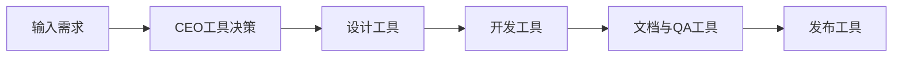

**技术特色**：
- TypeScript编写确保类型安全和跨平台兼容性
- 模块化设计支持灵活组合使用
- 工具链集成度高，减少切换成本

#### 热度分析

- 项目获得超11万星且持续增长(+950/天)，表明在开发者社区中高度认可
- 高star数与零issues对比，显示项目稳定且用户满意度高

#### 快速上手

```bash
# 克隆项目
git clone https://github.com/garrytan/gstack.git

# 安装依赖
npm install

# 初始化配置
npm run init
```

#### 注意事项

- 项目依赖Claude Code环境，确保兼容性
- 工具链包含23种工具，学习曲线较陡
- 需适应项目的特定工作流程和理念


### 9. NanmiCoder/MediaCrawler — 全平台爬虫工具

> **一句话总结**：一个支持小红书、抖音等多平台数据爬取的工具，满足社交媒体数据采集需求。

#### 价值主张

| 维度 | 说明 |
|------|------|
| **解决痛点** | 统一解决多平台数据采集难题，无需为每个平台单独开发爬虫 |
| **目标用户** | 数据分析师、研究人员、内容营销人员、AI训练数据收集者 |
| **核心亮点** | 多平台支持 + 模块化设计 + 易于扩展 + 反爬机制处理 |

#### 技术架构

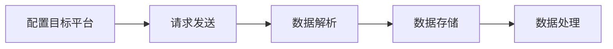

**技术特色**：
- 分布式爬取架构，支持大规模数据采集
- 智能反爬虫机制，应对平台更新
- 模块化设计，易于扩展新平台支持

#### 热度分析

- 项目Star数超过5万，近期增长迅速，日均增长约600+，表明市场需求旺盛
- 社区活跃度高，Fork数量超过1万，表明有大量用户基于此项目进行二次开发

#### 快速上手

```bash
# 克隆项目
git clone https://github.com/NanmiCoder/MediaCrawler.git

# 安装依赖
pip install -r requirements.txt
```

#### 注意事项

- 注意遵守各平台的使用条款和robots.txt协议
- 避免过于频繁的请求，防止触发平台的反爬机制
- 定期更新代码以应对平台API变化


### 10. IceWhaleTech/CasaOS — 个人云系统

> **一句话总结**：简洁优雅的开源个人云系统，实现本地文件存储与便捷共享。

#### 价值主张

| 维度 | 说明 |
|------|------|
| **解决痛点** | 解决个人数据分散存储、跨设备访问困难、隐私安全问题 |
| **目标用户** | 需要本地文件存储与共享的个人用户和小型团队 |
| **核心亮点** | 简洁界面 + 本地部署 + 多设备访问 + 数据安全 + 开源免费 |

#### 技术架构

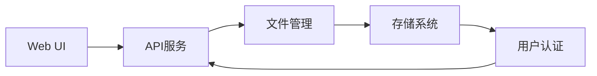

**技术特色**：
- 基于Go语言开发，高性能并发处理，资源占用低
- 模块化设计，各组件解耦，易于扩展和维护
- 支持多种存储后端，适应不同硬件环境

#### 热度分析

- 项目Star数超3.5万，日增600+，社区热度持续攀升，增长势头强劲
- Fork/Star比约为1:17.5，表明项目参与度高，用户贡献意愿强

#### 快速上手

```bash
# 使用Docker一键部署
docker run -d --name casaos -p 80:80 -p 443:443 -v /var/lib/casaos:/DATA icewhale/casaos

# 访问Web界面
http://localhost:80
```

#### 注意事项

- 项目许可证信息未知，商业使用前需确认许可条款
- 数据安全依赖于本地部署环境，需做好安全防护措施
- 长期使用需关注数据备份策略，避免单点故障风险


### 11. simplex-chat/simplex-chat — 无ID聊天应用

> **一句话总结**：首个无用户标识符的100%隐私设计通讯网络，支持多平台。

#### 价值主张

| 维度 | 说明 |
|------|------|
| **解决痛点** | 消除传统通讯中的用户标识，实现真正的隐私保护 |
| **目标用户** | 高度重视隐私安全、不希望被追踪的用户群体 |
| **核心亮点** | 无用户标识 + 100%隐私设计 + 跨平台支持 + 去中心化架构 |

#### 技术架构

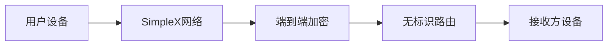

**技术特色**：
- 基于Haskell函数式编程实现的高安全性
- 无用户标识符的去中心化网络架构
- 端到端加密确保通信内容隐私

#### 热度分析

- 项目获得12,658个Star且近期增长迅速(+432 today)，表明隐私通讯需求旺盛
- Fork数相对较低(715)，说明项目技术门槛较高或社区贡献模式不同

#### 快速上手

```bash
# 克隆仓库
git clone https://github.com/simplex-chat/simplex-chat.git
# 构建项目
cd simplex-chat && stack build
```

#### 注意事项

- 项目使用Haskell开发，需要Haskell环境(stack)
- 项目强调隐私保护，可能需要用户适应无用户标识的通讯方式
- 项目目前没有公开的issue，可能通过其他渠道(如论坛)提供支持


### 12. kunchenguid/no-mistakes — Git防错助手

> **一句话总结**：防止Git推送错误的Go工具，保护分支和提交安全。

#### 价值主张

| 维度 | 说明 |
|------|------|
| **解决痛点** | 防止错误地推送敏感分支或提交到远程仓库 |
| **目标用户** | 需要频繁使用Git进行版本控制开发的团队和个人 |
| **核心亮点** | 预防推送错误 + 自动拦截 + 保护分支 + 可配置规则 |

#### 技术架构

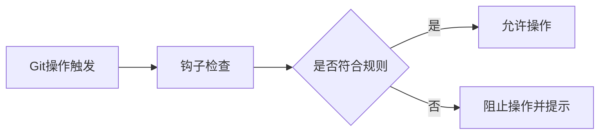

**技术特色**：
- 基于Git钩子实现的拦截机制
- Go语言编写，轻量级且高效
- 支持自定义规则配置

#### 热度分析

- 项目Star数增长迅速，近期一天新增近400星，显示社区高度认可
- 相对较低的Fork数表明项目可能处于早期阶段，或用户倾向于直接使用而非二次开发

#### 快速上手

```bash
# 克隆项目
git clone https://github.com/kunchenguid/no-mistakes.git
# 安装到本地
cd no-mistakes && go install
# 配置Git钩子
no-mistakes install
```

#### 注意事项

- 需要确保Go环境已正确安装
- 可能需要根据团队具体需求调整规则配置
- 仅支持Git仓库，不适用于其他版本控制系统


### 13. aws/agent-toolkit-for-aws — AWS AI代理工具包

> **一句话总结**：AWS官方支持的AI代理工具包，提供MCP服务器、技能和插件，简化AI在AWS云服务上的构建与集成。

#### 价值主张

| 维度 | 说明 |
|------|------|
| **解决痛点** | 解决AI代理与AWS服务集成的复杂性，简化开发流程 |
| **目标用户** | AWS平台上的AI应用开发者、AI代理构建者 |
| **核心亮点** | AWS官方支持 + MCP协议实现 + 可扩展技能库 + 插件系统 |

#### 技术架构

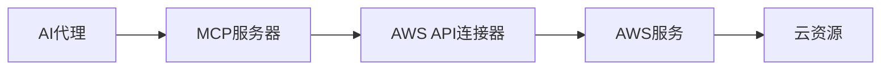

**技术特色**：
- 基于MCP(Model Context Protocol)标准化接口
- 提供统一的AWS服务访问层
- 支持技能库的动态扩展机制

#### 热度分析

- 项目单日增长243星，显示开发者对该领域的强烈关注
- 作为AWS官方项目，在AI与云融合领域具有生态先发优势

#### 快速上手

```bash
# 安装工具包
pip install aws-agent-toolkit

# 初始化配置
aws-agent-toolkit init

# 启动MCP服务器
aws-agent-toolkit server start
```

#### 注意事项

- 需要有效的AWS账户和适当IAM权限
- 确保正确配置AWS凭证(可通过AWS CLI或环境变量)
- 项目文档可能需要进一步完善，目前Issue数为0表明项目处于早期阶段


### 14. alchaincyf/zhangxuefeng-skill — 教育决策框架

> **一句话总结**：张雪峰教育认知系统，提供高考志愿、考研及职业规划的实战思维框架。

#### 价值主张

| 维度 | 说明 |
|------|------|
| **解决痛点** | 教育决策缺乏系统指导，学生面临专业与职业选择困境 |
| **目标用户** | 高中生、大学生及面临职业转换的年轻人 |
| **核心亮点** | 实战思维框架 + 张雪峰教育理念 + 结构化决策方法 |

#### 技术架构

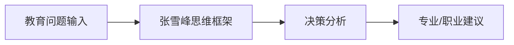

**技术特色**：
- 基于张雪峰教育理念的结构化思维方法
- 将复杂教育决策问题简化为可操作步骤
- 整合多维度因素的综合评估系统

#### 热度分析

- 项目获得高关注度，近期增长迅速，表明教育决策指导需求强烈
- 在教育决策领域具有独特价值，形成了一定社区影响力

#### 快速上手

```bash
# 克隆项目到本地
git clone https://github.com/alchaincyf/zhangxuefeng-skill.git

# 查看项目内容
cd zhangxuefeng-skill && ls
```

#### 注意事项

- 项目内容可能需要结合张雪峰的其他教育理论一起理解
- 建议将框架作为参考，结合个人实际情况灵活应用
- 教育决策是多因素综合考量过程，框架仅提供思维工具


### 15. ripienaar/free-for-dev — 免费开发资源库

> **一句话总结**：一个精心整理的DevOps和基础设施相关免费服务清单，帮助开发者节省成本并选择合适的工具。

#### 价值主张

| 维度 | 说明 |
|------|------|
| **解决痛点** | 开发者难以发现和评估适合的免费开发服务资源 |
| **目标用户** | DevOps工程师、系统管理员、软件开发人员 |
| **核心亮点** | 分类清晰 + 内容更新及时 + 覆盖面广 + 筛选标准明确 |

#### 技术架构

**技术特色**：
- 纯静态内容，无需服务器
- 结构化的Markdown组织方式
- 便于社区贡献和维护的简单格式

#### 热度分析

- 项目拥有超过12万星，增长稳定，表明其在开发者社区中具有重要地位
- 作为资源类项目，通过持续更新和社区维护保持高活跃度

#### 快速上手

```bash
# 克隆仓库查看内容
git clone https://github.com/ripienaar/free-for-dev.git

# 浏览文档或提交修改建议
cd free-for-dev
```

#### 注意事项

- 项目内容主要基于社区贡献，建议在使用前验证服务的免费条款是否有所变化
- 不同服务的免费层可能有使用限制，实际应用前应仔细阅读官方条款
- 项目以DevOps和基础设施相关服务为主，其他领域的免费资源可能不在范围内


### 16. commaai/openpilot — 自动驾驶系统

> **一句话总结**：开源机器人操作系统，为300+车型提供高级驾驶辅助功能，让普通汽车具备自动驾驶能力。

#### 价值主张

| 维度 | 说明 |
|------|------|
| **解决痛点** | 提供低成本、开源的自动驾驶解决方案，打破技术壁垒 |
| **目标用户** | 汽车技术爱好者、自动驾驶研究者、DIY改装者 |
| **核心亮点** | 开源透明 + 多车型支持 + 实时感知 + 低成本改造 |

#### 技术架构

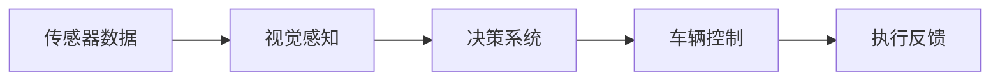

**技术特色**：
- 基于深度学习的视觉感知模型
- 实时车辆动力学建模
- 开源硬件支持与社区驱动
- 分布式训练框架

#### 热度分析

- 项目Star数超6万，日增80，表明项目持续受到关注
- Fork数过万，社区活跃度高，开发者参与度强

#### 快速上手

```bash
# 克隆仓库
git clone https://github.com/commaai/openpilot.git
# 安装依赖
pip install -r requirements.txt
# 运行测试
python selfdrive/test/test_longitudinal.py
```

#### 注意事项

- 仅支持特定车型和硬件配置，使用前需确认兼容性
- 自动驾驶技术存在安全风险，不建议在公共道路上完全依赖系统
- 需要一定的技术基础才能正确配置和使用系统
- 项目持续更新，建议关注最新版本和文档更新


### 17. grafana/grafana — 可视化监控平台

> **一句话总结**：开源可观测性与数据可视化平台，统一展示多种数据源的监控指标、日志和追踪。

#### 价值主张

| 维度 | 说明 |
|------|------|
| **解决痛点** | 统一可视化多种数据源的监控数据，解决监控碎片化问题 |
| **目标用户** | DevOps工程师、SRE团队、数据分析师和系统管理员 |
| **核心亮点** | 强大的可视化能力 + 丰富的数据源支持 + 灵活的仪表板 + 开放的插件生态 |

#### 技术架构

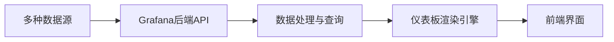

**技术特色**：
- 基于React和TypeScript的现代化前端架构
- 支持超过100种数据源的可扩展插件系统
- 高性能的时间序列数据处理能力

#### 热度分析

- Grafana拥有74,927个Star和14,127个Fork，每日增长约32个Star，显示出其在可观测性领域的领导地位。
- 作为可观测性领域的核心工具，Grafana已成为DevOps和SRE实践的标配，社区活跃度高，插件生态丰富。

#### 快速上手

```bash
# 使用Docker快速启动Grafana
docker run -d -p 3000:3000 grafana/grafana

# 访问 http://localhost:3000，默认用户admin密码admin
```

#### 注意事项

- 默认配置下Grafana使用SQLite存储，生产环境建议使用PostgreSQL或MySQL以获得更好的性能和可靠性
- 配置数据源和仪表板时需注意数据查询性能，避免大数据量导致的响应延迟
- 定期更新Grafana版本以获取安全修复和新功能
- 生产环境应配置适当的认证和授权机制，默认凭据应及时修改


## 今日推荐

| 主题 | 推荐项目 | 亮点 |
|------|----------|------|
| 隐私通信 | [simplex-chat](https://github.com/simplex-chat/simplex-chat) | 100%隐私设计 |
| 数据监控 | [grafana](https://github.com/grafana/graf

---

<div align="center">

*Generated on 2026-06-27 | Powered by GitHub Trending Reporter*

</div>