## 今日热点

今日GitHub热榜项目精彩纷呈。

---

## 热门项目一览

| 排名 | 项目 | 语言 | 今日 | 总计 | 简介 |
|:---:|------|:----:|------:|-----:|------|
| 1 | [google-labs-code/design.md](https://github.com/google-labs-code/design.md) | TypeScript | +1,541 | 22,387 | A format specification for ... |
| 2 | [simplex-chat/simplex-chat](https://github.com/simplex-chat/simplex-chat) | Haskell | +1,469 | 13,906 | SimpleX - the first messagi... |
| 3 | [topoteretes/cognee](https://github.com/topoteretes/cognee) | Python | +780 | 24,048 | Cognee is the open-source A... |
| 4 | [JCodesMore/ai-website-cloner-template](https://github.com/JCodesMore/ai-website-cloner-template) | TypeScript | +750 | 22,169 | Clone any website with one ... |
| 5 | [xbtlin/ai-berkshire](https://github.com/xbtlin/ai-berkshire) | Python | +685 | 4,225 | AI 时代的伯克希尔：基于 Claude Code /... |
| 6 | [garrytan/gstack](https://github.com/garrytan/gstack) | TypeScript | +674 | 117,288 | Use Garry Tan's exact Claud... |
| 7 | [hugohe3/ppt-master](https://github.com/hugohe3/ppt-master) | Python | +589 | 33,136 | AI generates a real, editab... |
| 8 | [IceWhaleTech/CasaOS](https://github.com/IceWhaleTech/CasaOS) | Go | +502 | 35,813 | CasaOS - A simple, easy-to-... |
| 9 | [ripienaar/free-for-dev](https://github.com/ripienaar/free-for-dev) | HTML | +459 | 124,199 | A list of SaaS, PaaS and Ia... |
| 10 | [NanmiCoder/MediaCrawler](https://github.com/NanmiCoder/MediaCrawler) | Python | +394 | 53,797 | 小红书笔记 | 评论爬虫、抖音视频 | 评论爬虫、快手... |
| 11 | [anomalyco/opencode](https://github.com/anomalyco/opencode) | TypeScript | +392 | 179,798 | The open source coding agent. |
| 12 | [commaai/openpilot](https://github.com/commaai/openpilot) | Python | +322 | 62,087 | openpilot is an operating s... |

---

## 趋势洞察

```
┌─────────────────────────────────────────────────────────────────┐
│  AI/ML 工具         ████████████████████████  12 个项目        │
│  其他               ██████████                5 个项目        │
│  多媒体应用            ██                        1 个项目        │
│  项目管理             ██                        1 个项目        │
│  数据分析             ██                        1 个项目        │
└─────────────────────────────────────────────────────────────────┘
```

---

## 项目深度解读

### 1. google-labs-code/design.md — [设计规范]

> **一句话总结**：为AI编码 agent 提供结构化设计系统理解的标准化描述格式

#### 价值主张

| 维度 | 说明 |
|------|------|
| **解决痛点** | 解决AI代码生成工具缺乏设计系统理解的问题 |
| **目标用户** | 设计系统开发者、AI工具构建者、前端团队 |
| **核心亮点** | 结构化格式 + 可持久化 + 机器可读 + 设计系统完整描述 |

#### 技术架构


**技术特色**：
- 采用Markdown格式，兼顾人类可读与机器解析
- 提供统一的设计系统描述标准与结构
- 支持跨工具和平台的兼容性

#### 热度分析

- 项目获得2.2万+星标，近期增长迅速，显示AI辅助开发领域需求旺盛
- 作为Google Labs项目，在AI与设计系统交叉领域具有权威性

#### 快速上手

```bash
# 创建DESIGN.md文件描述设计系统
echo "# Design System\n\n## Colors\n\n- Primary: #3f51b5\n\n## Components\n\n- Button: Primary, Secondary" > DESIGN.md
```

#### 注意事项

- 规范仍在发展中，可能存在变化
- 需要配合支持DESIGN.md格式的AI工具使用
- 设计系统描述的完整性和准确性直接影响AI生成质量


### 2. simplex-chat/simplex-chat — 隐私优先通讯

> **一句话总结**：SimpleX是一款完全匿名的即时通讯应用，不使用任何用户标识符。

#### 价值主张

| 维度 | 说明 |
|------|------|
| **解决痛点** | 传统通讯应用中用户身份暴露的问题，提供真正的匿名通讯体验 |
| **目标用户** | 对隐私有高要求的个人用户，特别是需要匿名通讯的用户 |
| **核心亮点** | 无用户标识符设计 + 100%隐私保证 + 跨平台支持


### 3. topoteretes/cognee — AI记忆平台

> **一句话总结**：为AI代理提供持久化长期记忆的开源平台，通过自托管知识图谱实现跨会话记忆能力。

#### 价值主张

| 维度 | 说明 |
|------|------|
| **解决痛点** | AI代理缺乏持久化长期记忆能力，无法跨会话保持知识连贯性 |
| **目标用户** | AI应用开发者、智能系统构建者、需要长期记忆功能的AI代理开发者 |
| **核心亮点** | 知识图谱存储 + 持久化记忆 + 跨会话记忆 + 自托管部署 + 隐私保护 |

#### 技术架构

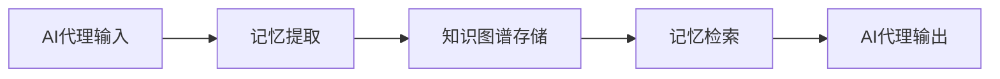

**技术特色**：
- 基于知识图谱的长期记忆存储系统
- 支持自托管部署，保障数据隐私
- 提供跨会话记忆持久化能力
- 模块化设计，易于集成到现有AI系统

#### 热度分析

- 项目获得24,048个Star，单日增长780个，显示项目热度快速攀升，受到AI开发者高度关注
- Fork数达2,258，表明社区活跃度高，开发者参与贡献意愿强烈

#### 快速上手

```bash
# 安装Cognee
pip install cognee

# 初始化Cognee
cognee init

# 启动服务
cognee start
```

#### 注意事项

- 项目许可证未知，商业应用前需确认授权条款
- 作为新兴项目，API和功能可能会快速迭代，生产环境使用需谨慎


### 4. JCodesMore/ai-website-cloner-template — AI网站克隆工具

> **一句话总结**：利用AI编码代理通过单一命令克隆任意网站，实现自动化网站结构复制与代码生成。

#### 价值主张

| 维度 | 说明 |
|------|------|
| **解决痛点** | 简化网站克隆流程，无需手动编写代码即可快速复制网站结构与功能 |
| **目标用户** | 开发者、网站管理员、需要快速复制网站结构的用户 |
| **核心亮点** | AI驱动自动化 + 一键克隆 + 保持网站结构与功能 |

#### 技术架构


**技术特色**：
- 使用AI代理智能解析网站DOM结构
- 自动生成响应式TypeScript代码
- 保持原网站布局和交互功能

#### 热度分析

- 项目获得22K+ stars且持续增长，显示AI辅助开发工具市场热度高涨
- 作为AI与Web开发结合的前沿工具，处于技术创新前沿位置

#### 快速上手

```bash
# 克隆项目
git clone https://github.com/JCodesMore/ai-website-cloner-template.git

# 安装依赖
npm install

# 克隆指定网站
npm run clone --url=https://example.com
```

#### 注意事项

- 克隆网站前请确保遵守相关版权法律法规，尊重原网站的知识产权
- AI生成的代码可能需要人工审核和优化，特别是对于复杂交互或安全关键部分
- 建议在使用前测试克隆网站的功能完整性，特别是在生产环境应用前


### 5. xbtlin/ai-berkshire — AI价值投资框架

> **一句话总结**：基于多Agent并行研究的AI价值投资框架，融合四位大师投资方法论。

#### 价值主张

| 维度 | 说明 |
|------|------|
| **解决痛点** | 传统价值投资研究效率低、覆盖面有限，AI加速投资决策过程 |
| **目标用户** | 价值投资者、量化研究人员、金融分析师 |
| **核心亮点** | 多Agent并行研究架构 + 四大师方法论融合 + AI辅助投资决策 |

#### 技术架构


**技术特色**：
- 多Agent并行研究架构
- 融合四位大师投资方法论
- AI辅助价值投资决策

#### 热度分析

- 项目获得4,225个Star，单日增长685，表明项目近期热度极高，可能是新兴热门AI投资工具
- Fork数588，显示社区活跃度高，开发者参与度良好

#### 快速上手

```bash
# 克隆项目
git clone https://github.com/xbtlin/ai-berkshire.git

# 安装依赖
pip install -r requirements.txt
```

#### 注意事项

- 项目许可证未知，使用前需确认开源许可条款
- 作为投资决策工具，AI建议仅供参考，实际投资需谨慎
- 项目可能需要相关金融数据和API访问权限


### 6. garrytan/gstack — AI工具集

> **一句话总结**：一个包含23个专业工具的AI增强工作流，模拟多种角色提升个人效率

#### 价值主张

| 维度 | 说明 |
|------|------|
| **解决痛点** | 个人或小团队缺乏专业角色分工，效率低下 |
| **目标用户** | 独立开发者、小团队、创业者 |
| **核心亮点** | AI驱动决策 + 多角色模拟 + 工具集成化 + 流程自动化 |

#### 技术架构

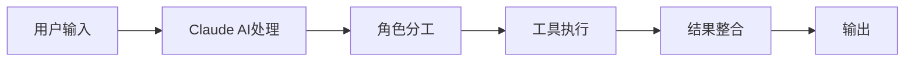

**技术特色**：
- 基于Claude AI的智能决策系统
- 23个专业化工具的模块化设计
- 多角色工作流的无缝集成

#### 热度分析

- 高Star数显示项目获得广泛认可，近期增长迅速
- 社区活跃度高，表明AI辅助工具需求旺盛

#### 快速上手

```bash
# 克隆仓库
git clone https://github.com/garrytan/gstack.git

# 安装依赖
npm install

# 启动工具
npm start
```

#### 注意事项

- 项目依赖Claude AI，需要相应的API访问权限
- 工具集可能需要根据个人需求进行定制化调整
- 部分工具可能需要额外的配置才能发挥最佳效果


### 7. hugohe3/ppt-master — AI PPT生成工具

> **一句话总结**：AI将文档智能转换为可编辑PowerPoint，支持原生形状、动画和音频旁白。

#### 价值主张

| 维度 | 说明 |
|------|------|
| **解决痛点** | 解决手动创建PowerPoint耗时且效率低的问题 |
| **目标用户** | 需要快速制作演示文稿的商务人士、教育工作者 |
| **核心亮点** | AI智能转换+原生PPT格式+音频旁白+自定义模板支持 |

#### 技术架构

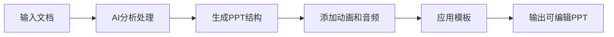

**技术特色**：
- AI驱动的文档内容智能解析和结构化
- 原生PowerPoint格式生成，非图片转换
- 智能音频旁白生成与同步技术

#### 热度分析
- 项目获得超3.3万星，近期每日新增近600星，增长迅猛
- 在AI辅助办公工具领域处于领先地位，社区活跃度高

#### 快速上手

```bash
# 安装依赖
pip install ppt-master

# 使用示例
ppt-master input.md -o presentation.pptx --template custom_template.pptx
```

#### 注意事项
- 需要确保输入文档格式正确，以获得最佳转换效果
- 自定义模板需要符合特定格式要求
- 音频旁白生成可能需要额外配置或API密钥
- 项目许可证信息不明确，使用前需确认授权条款


### 8. IceWhaleTech/CasaOS — 个人云系统

> **一句话总结**：简单易用的开源个人云系统，帮助用户轻松搭建和管理私有云存储。

#### 价值主张

| 维度 | 说明 |
|------|------|
| **解决痛点** | 为普通用户提供简单易用的私有云解决方案，解决数据存储和共享问题 |
| **目标用户** | 需要简单私有云解决方案的个人用户和小型团队 |
| **核心亮点** | 界面简洁直观 + 轻量级部署 + 多设备访问支持 + 插件化扩展 |

#### 技术架构

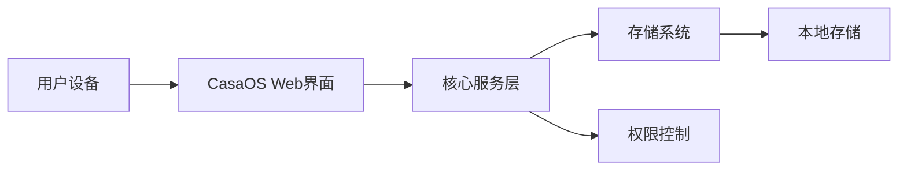

**技术特色**：
- 基于Go语言开发，性能优异且资源占用低
- 采用模块化设计，易于扩展和维护
- 提供RESTful API，支持第三方应用集成

#### 热度分析

- Star数超过3.5万且持续增长，表明项目受到社区广泛认可
- Fork数适中，说明项目处于活跃开发阶段，社区参与度有待提高

#### 快速上手

```bash
# 安装CasaOS
curl -fsSL https://get.casaos.io | bash

# 访问Web界面
http://your-server-ip:8080
```

#### 注意事项

- 需要确保有足够的存储空间用于个人云存储
- 建议定期备份数据，防止硬件故障导致数据丢失
- 注意网络安全，建议配置防火墙和访问控制


### 9. ripienaar/free-for-dev — DevOps资源库

> **一句话总结**：一个精选的DevOps和基础设施领域免费SaaS、PaaS和IaaS服务综合列表

#### 价值主张

| 维度 | 说明 |
|------|------|
| **解决痛点** | 帮助开发者快速发现和筛选适合的免费DevOps工具和服务 |
| **目标用户** | DevOps工程师、系统管理员、云架构师、基础设施开发者 |
| **核心亮点** | 分类详尽 + 更新及时 + 评价实用 + 覆盖全面 |

#### 技术架构

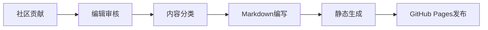

**技术特色**：
- 基于Markdown的静态内容管理
- 社区驱动的内容更新机制
- 简洁高效的文档组织结构

#### 热度分析

- 高星项目，日均增长约450星，在DevOps资源领域极具影响力
- 零开放Issue，表明问题主要通过PR解决，社区协作模式成熟高效

#### 快速上手

```bash
# 克隆项目查看完整列表
git clone https://github.com/ripienaar/free-for-dev.git

# 浏览网页版
open https://free-for.dev
```

#### 注意事项

- 项目内容依赖社区贡献，部分服务可能已更新或不再免费
- 使用前应验证服务的最新政策和条款，避免误用付费功能
- 不同地区的服务可用性可能存在差异，需结合自身地理位置确认


### 10. NanmiCoder/MediaCrawler — [多平台爬虫]

> **一句话总结**：一站式多平台社交媒体数据爬取工具，支持小红书、抖音、快手等主流平台内容与评论抓取。

#### 价值主张

| 维度 | 说明 |
|------|------|
| **解决痛点** | 解决多平台数据分散获取难、各自编写爬虫效率低的问题 |
| **目标用户** | 数据分析师、研究人员、内容创作者、市场调研人员 |
| **核心亮点** | 多平台支持 + 模块化设计 + 易于扩展 + 统一接口 + 反爬策略 |

#### 技术架构


**技术特色**：
- 采用异步IO提高爬取效率
- 模块化设计便于扩展新平台
- 内置多种反爬策略绕过平台限制
- 支持代理池和请求频率控制

#### 热度分析

- 项目Star数超过5万，近期增长迅速，显示社区高度认可和需求旺盛
- 作为开源爬虫工具，在数据获取领域占据重要生态位置，解决大量数据采集需求

#### 快速上手

```bash
# 克隆项目
git clone https://github.com/NanmiCoder/MediaCrawler.git

# 安装依赖
pip install -r requirements.txt

# 运行爬虫
python run.py platform_name
```

#### 注意事项

- 使用时需遵守各平台的使用条款，避免违规操作
- 反爬机制可能导致账号受限，建议合理设置请求频率
- 某些平台可能需要登录验证或特定配置
- 定期更新以适应平台变化


### 11. anomalyco/opencode — 智能编码助手

> **一句话总结**：AI驱动的开源代码助手，通过自然语言交互帮助开发者高效编写和优化代码。

#### 价值主张

| 维度 | 说明 |
|------|------|
| **解决痛点** | 提高开发效率，减少重复编码工作，提升代码质量 |
| **目标用户** | 软件开发者、程序员、编码爱好者 |
| **核心亮点** | AI辅助编码 + 自然语言交互 + 代码优化建议 + 多语言支持 |

#### 技术架构

**技术特色**：
- 基于大语言模型的代码理解与生成
- TypeScript开发，跨平台兼容性强
- 插件化架构，可扩展性高

#### 热度分析

- 高关注度项目，近期增长迅速，社区贡献活跃
- 在AI辅助开发领域具有重要影响力，生态正在快速扩展

#### 快速上手

```bash
# 克隆项目
git clone https://github.com/anomalyco/opencode.git

# 安装依赖
npm install
```

#### 注意事项

- 项目可能需要一定的AI和机器学习基础知识
- 建议在使用前仔细阅读文档，了解项目功能和限制


### 12. commaai/openpilot — 开源自动驾驶系统

> **一句话总结**：为300+车型提供开源驾驶辅助系统，实现低成本自动驾驶功能升级

#### 价值主张

| 维度 | 说明 |
|------|------|
| **解决痛点** | 为现有车辆提供高级驾驶辅助功能，无需更换原车硬件 |
| **目标用户** | 汽车技术爱好者、自动驾驶研究者、汽车改装社区 |
| **核心亮点** | 开源系统 + 多车型支持 + 实时感知 + 低成本实现 + 社区驱动 |

#### 技术架构

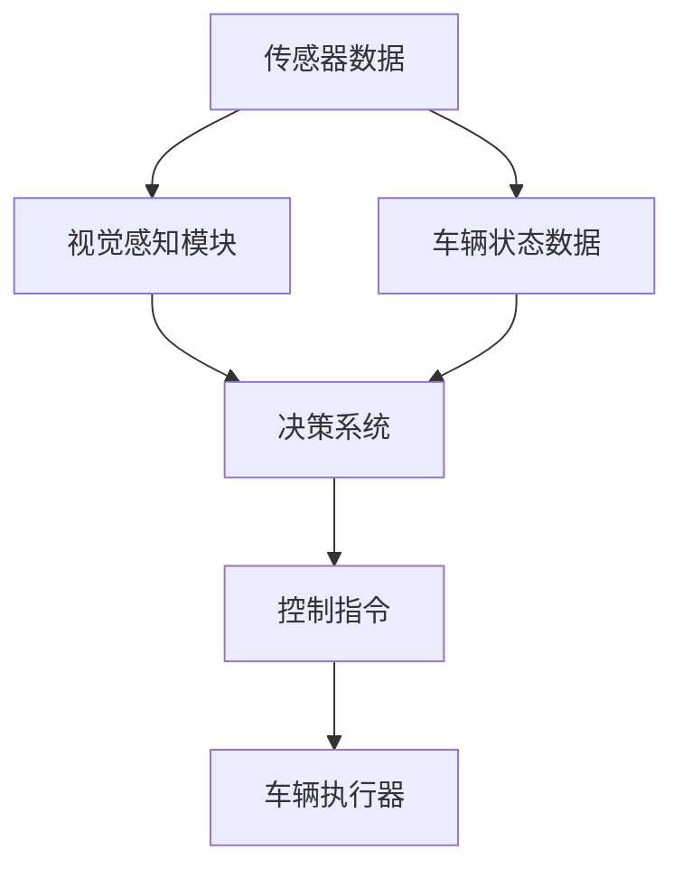

**技术特色**：
- 基于深度学习的视觉感知系统识别车道线和障碍物
- 跨平台支持多种车型的控制系统适配
- 开源社区持续优化算法和功能集

#### 热度分析

- 项目Star数超6万且持续增长，日增300+，表明社区关注度极高
- Fork数过万，显示有大量开发者进行二次开发和实验性应用

#### 快速上手

```bash
# 克隆仓库
git clone https://github.com/commaai/openpilot.git
cd openpilot

# 安装依赖并运行
pip install -r requirements.txt
python selfdrive/manager.py
```

#### 注意事项

- 项目涉及自动驾驶技术，使用前需充分了解其工作原理和局限性
- 在公共道路使用前需了解并遵守当地交通法规和法律责任
- 系统安全性和可靠性需用户自行评估，建议在安全环境下测试


### 13. Anil-matcha/Open-Generative-AI — 开源AI视频生成平台

> **一句话总结**：开源无限制的AI图像视频生成平台，集成200+模型，支持自托管部署。

#### 价值主张

| 维度 | 说明 |
|------|------|
| **解决痛点** | 突破现有AI视频平台的限制与内容过滤，提供完全开放的创作环境 |
| **目标用户** | 需要AI生成功能但受限于平台规则的开发者与内容创作者 |
| **核心亮点** | 开源无限制 + 200+模型集成 + 自托管部署 + 无内容过滤 + 多种前沿AI模型支持 |

#### 技术架构

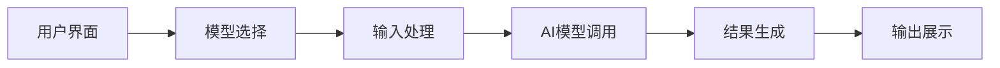

**技术特色**：
- 基于JavaScript构建，支持跨平台部署
- 集成多种前沿AI模型包括Flux、Midjourney、Kling等
- 提供完整的自托管解决方案，无需依赖第三方服务

#### 热度分析

- 项目Star数突破21k且持续快速增长，日增255星，显示社区高度认可
- Fork数达3.6k，表明项目被广泛用于二次开发和定制化部署

#### 快速上手

```bash
# 克隆项目
git clone https://github.com/Anil-matcha/Open-Generative-AI.git

# 安装依赖
cd Open-Generative-AI && npm install

# 启动服务
npm start
```

#### 注意事项

- 项目"无内容过滤器"特性需注意合法合规使用，避免生成不当内容
- 自托管部署需要一定的技术能力和服务器资源支持
- 使用多种AI模型可能需要相应的API密钥或计算资源


### 14. every-app/open-seo — 开源SEO工具

> **一句话总结**：开源替代 Semrush 和 Ahrefs 的全能 SEO 分析工具，提供网站排名、关键词和竞争对手分析功能。

#### 价值主张

| 维度 | 说明 |
|------|------|
| **解决痛点** | 提供免费开源的 SEO 分析替代方案，降低中小企业使用门槛 |
| **目标用户** | 中小企业 SEO 人员、网站管理员、数字营销从业者 |
| **核心亮点** | 开源免费 + 全面的 SEO 分析功能 + 无需付费订阅 |

#### 技术架构

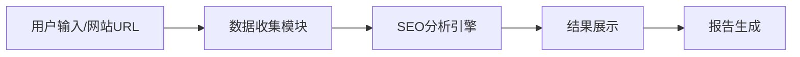

**技术特色**：
- 基于 TypeScript 开发，提供类型安全和良好的开发体验
- 可能使用爬虫技术收集网站数据
- 集成多种 SEO 分析算法和指标计算
- 提供直观的数据可视化界面

#### 热度分析

- 项目获得 3445 个 Star，单日增长 239，表明社区对该开源 SEO 工具需求强烈
- Fork 数量相对较低(375)，说明项目可能处于早期阶段，用户更倾向于直接使用而非二次开发

#### 快速上手

```bash
# 克隆项目
git clone https://github.com/every-app/open-seo.git
# 安装依赖
npm install
# 启动服务
npm run dev
```

#### 注意事项

- 项目许可证未知，使用前需确认商业使用条款
- 作为开源项目，可能需要自行部署和维护，不如商业服务稳定
- 功能可能不及成熟的商业工具全面，需要根据实际需求评估
- 由于项目 Issue 为 0，可能意味着项目仍在积极开发中，稳定性有待验证


### 15. Fission-AI/OpenSpec — AI规范驱动

> **一句话总结**：通过规范定义驱动AI编程助手生成高质量、一致的代码。

#### 价值主张

| 维度 | 说明 |
|------|------|
| **解决痛点** | 解决AI生成代码不一致、不符合规范的问题 |
| **目标用户** | AI开发者、软件工程团队、代码质量管理者 |
| **核心亮点** | 规范定义 + AI集成 + 质量保证 + 自动化验证 + 持续优化 |

#### 技术架构

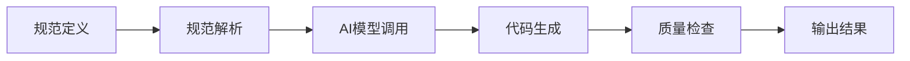

**技术特色**：
- 基于TypeScript构建的类型安全规范系统
- 与主流AI编程助手的无缝集成机制
- 多层次代码质量验证与反馈系统
- 支持跨语言、跨项目的规范复用

#### 热度分析

- 项目获得57K+ Star且日增177个，表明正经历快速增长期
- Fork数近4K，显示社区活跃度高，被广泛采用于实际开发场景

#### 快速上手

```bash
# 安装OpenSpec
npm install -g @fission-ai/openspec

# 初始化项目规范
openspec init my-project

# 使用规范生成代码
openspec generate --spec ./spec.yaml --output ./src
```

#### 注意事项

- 规范定义质量直接影响AI生成代码质量
- 需要配合支持的AI编程助手才能发挥完整功能
- 项目许可证信息不明确，商业使用前需确认授权条款
- 对于复杂项目，规范维护可能需要额外投入


### 16. luongnv89/claude-howto — AI编程指南

> **一句话总结**：Claude Code的全面视觉化指南，从基础到高级代理，提供即用模板。

#### 价值主张

| 维度 | 说明 |
|------|------|
| **解决痛点** | 简化Claude Code学习曲线，提供可直接使用的示例和模板 |
| **目标用户** | AI应用开发者、使用Claude进行编程的技术人员 |
| **核心亮点** | 视觉化教程 + 即用代码模板 + 全面的概念覆盖 + 进阶代理指导 |

#### 技术架构

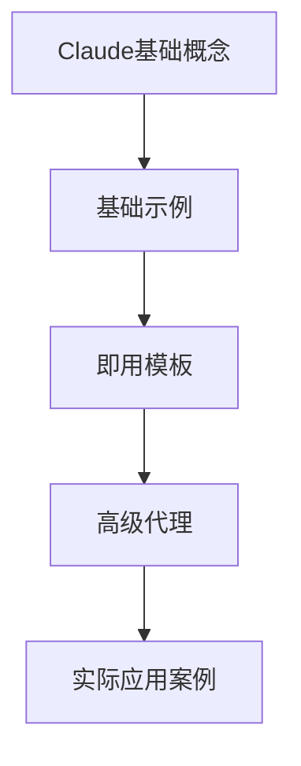

**技术特色**：
- 结构化学习路径设计，由浅入深
- 丰富的示例代码和模板资源库
- 清晰的概念解释和可视化展示方式

#### 热度分析

- 项目近39k星且持续增长，表明在AI开发社区中高度认可
- 4.6k的fork数显示社区参与活跃，用户将其作为重要参考资源

#### 快速上手

```bash
# 克隆仓库到本地
git clone https://github.com/luongnv89/claude-howto.git

# 浏览文档目录
cd claude-howto && ls -la
```

#### 注意事项

- 需要基本的Claude AI知识背景以充分利用指南内容
- 随着Claude Code更新，部分内容可能需要及时同步
- 建议结合实际项目实践，加深对概念的理解和应用


### 17. HKUDS/Vibe-Trading — 个人交易助手

> **一句话总结**：AI驱动的个人交易代理，提供智能决策支持和自动化交易执行功能。

#### 价值主张

| 维度 | 说明 |
|------|------|
| **解决痛点** | 个人用户缺乏专业交易知识和实时市场分析能力 |
| **目标用户** | 个人投资者、加密货币交易者和量化交易爱好者 |
| **核心亮点** | AI驱动决策 + 自动化交易 + 多市场支持 + 风险管理 + 个性化策略 |

#### 技术架构

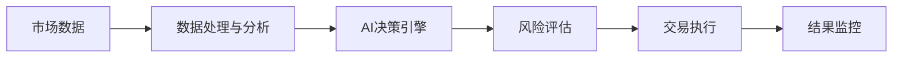

**技术特色**：
- 基于深度学习的市场趋势预测算法
- 多源数据整合与实时分析能力
- 高性能交易执行引擎与低延迟系统

#### 热度分析

- 项目Star数增长迅速，近期日均增长约90+，表明市场关注度持续攀升
- 高Fork/Star比例(18.9%)，显示用户积极参与二次开发和功能扩展

#### 快速上手

```bash
# 安装依赖
pip install -r requirements.txt

# 配置API密钥
cp config.example.json config.json

# 启动交易代理
python main.py --config config.json
```

#### 注意事项

- 需要配置正确的API密钥才能连接交易所
- 建议在测试网络先验证策略效果再投入实盘
- 交易存在风险，请根据自身风险承受能力调整参数


### 18. microsoft/PowerToys — Windows增强工具

> **一句话总结**：微软官方开发的Windows系统增强工具集，提供多种实用功能提升用户体验。

#### 价值主张

| 维度 | 说明 |
|------|------|
| **解决痛点** | Windows原生功能不足，用户需要更高效的系统定制和生产力工具 |
| **目标用户** | Windows高级用户、开发者、系统管理员和追求效率的普通用户 |
| **核心亮点** | 系统增强 + 窗口管理 + 快速启动 + 文件管理 + 自定义工具 |

#### 技术架构

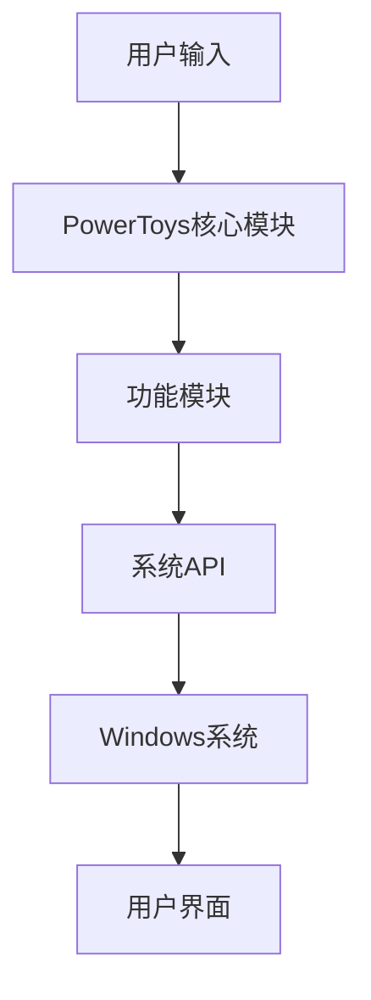

**技术特色**：
- 采用模块化设计，各工具可独立安装和运行
- 主要使用C++开发，通过Windows API深度系统交互
- 开源项目但由微软官方维护，保证质量和兼容性

#### 热度分析

- Star数量超13万且持续稳定增长，表明Windows用户对系统增强工具需求旺盛
- 微软官方背书加上活跃的社区贡献，形成了强大的开源生态系统

#### 快速上手

```bash
# 克隆仓库
git clone https://github.com/microsoft/PowerToys.git

# 构建项目（需要Visual Studio）
cd PowerToys
.\build.ps1 -Configuration Release

# 安装并运行PowerToys
.\src\PowerToys\bin\x64\Release\PowerToys.exe
```

#### 注意事项

- 项目实际主要使用C++开发，而非纯C语言
- Open Issues显示为0可能与实际情况不符，建议在GitHub上查看最新问题状态
- 部分工具需要管理员权限才能正常运行
- 不同Windows版本可能存在兼容性问题，建议及时更新


### 19. keycloak/keycloak — 身份认证管理

> **一句话总结**：开源身份和访问管理解决方案，为现代应用提供单点登录和多因素认证支持。

#### 价值主张

| 维度 | 说明 |
|------|------|
| **解决痛点** | 统一管理用户身份认证，简化应用安全架构 |
| **目标用户** | 企业应用开发者、系统架构师、安全团队 |
| **核心亮点** | 单点登录 + 多因素认证 + 社交登录集成 + 协议适配丰富 + 灵活扩展 |

#### 技术架构

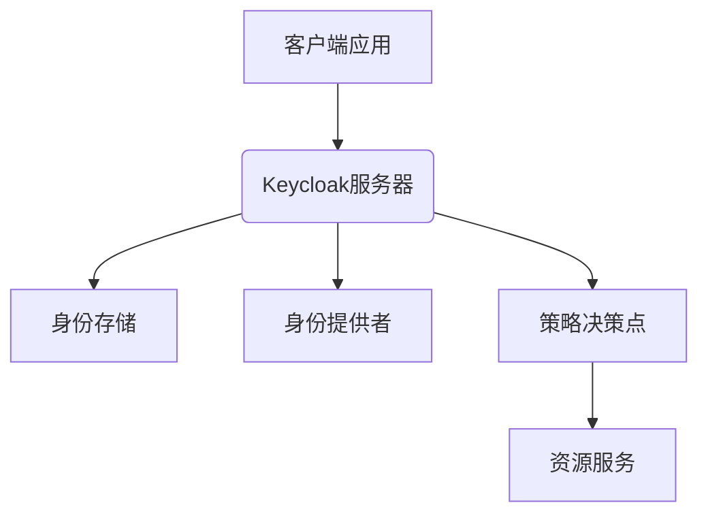

**技术特色**：
- 基于Java EE构建，提供RESTful API接口
- 支持OAuth 2.0、OpenID Connect等现代认证协议
- 提供丰富的SPI接口支持自定义扩展

#### 热度分析

- 项目持续稳定增长，今日新增20个Star，表明社区活跃度高
- 作为IAM领域的标杆项目，在企业级应用生态中占据核心位置

#### 快速上手

```bash
# 使用Docker快速启动Keycloak
docker run -p 8080:8080 -e KEYCLOAK_ADMIN=admin -e KEYCLOAK_ADMIN_PASSWORD=admin jboss/keycloak:latest

# 或者下载独立服务器版
wget https://downloads.jboss.org/keycloak/18.0.0/keycloak-18.0.0.zip
```

#### 注意事项

- 生产环境部署建议使用高可用配置，避免单点故障
- 默认管理员密码应在首次登录后立即修改
- 密码策略和用户权限配置需根据实际安全需求进行调整


### 20. dbt-labs/dbt-core — 数据转换工具

> **一句话总结**：将软件工程最佳实践应用于数据转换，实现数据管道的版本化与测试化。

#### 价值主张

| 维度 | 说明 |
|------|------|
| **解决痛点** | 解决数据转换过程缺乏版本控制、测试和工程化方法的问题 |
| **目标用户** | 数据分析师、数据工程师、数据科学家 |
| **核心亮点** | SQL 编写转换逻辑 + 版本控制与协作 + 测试驱动数据质量 + 可扩展性 + CI/CD 集成 |

#### 技术架构

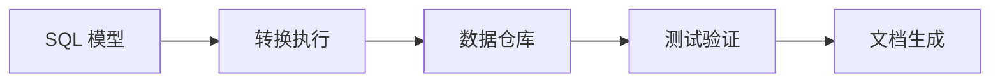

**技术特色**：
- 采用声明式 SQL 编写数据转换逻辑，降低技术门槛
- 支持多种数据仓库后端，包括 Snowflake, BigQuery, Redshift 等
- 内置数据测试框架，确保数据质量和完整性
- 自动生成数据文档，提高数据可发现性
- 提供丰富的插件生态系统，支持扩展功能

#### 热度分析

- 项目 Star 数超过 13k，且每日稳定增长，表明在数据工程领域具有广泛认可
- 作为数据转换领域的标准工具之一，拥有活跃的社区贡献和丰富的第三方资源

#### 快速上手

```bash
# 安装 dbt
pip install dbt-core

# 初始化项目
dbt init my_project

# 运行转换
cd my_project
dbt run
```

#### 注意事项

- dbt 本身不包含数据提取(ELT 中的 E)功能，需要与其他工具配合使用
- 对于非常大的数据集，可能需要优化资源使用和执行策略
- 学习曲线相对平缓，但要充分利用高级功能仍需深入学习


## 今日推荐

| 主题 | 推荐项目 | 亮点 |
|------|----------|------|
| 今日最热 | [google-labs-code/design.md](https://github.com/google-labs-code/design.md) | A format specific... |
| 值得关注 | [simplex-chat/simplex-chat](https://github.com/simplex-chat/simplex-chat) | SimpleX - the fir... |
| 快速上手 | [topoteretes/cognee](https://github.com/topoteretes/cognee) | Cognee is the ope... |
| 长期潜力 | [JCodesMore/ai-website-cloner-template](https://github.com/JCodesMore/ai-website-cloner-template) | Clone any website... |

---

<div align="center">

*Generated on 2026-06-28 | Powered by GitHub Trending Reporter*

</div>