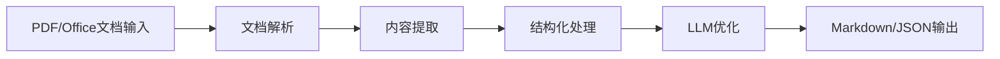
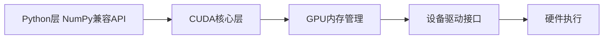

## 今日热点

AI应用持续扩展至投资、3D重建等多领域，同时高性能开发者工具特别是代码智能和数据处理工具受到高度关注。

---

## 热门项目一览

| 排名 | 项目 | 语言 | 今日 | 总计 | 简介 |
|:---:|------|:----:|------:|-----:|------|
| 1 | [DeusData/codebase-memory-mcp](https://github.com/DeusData/codebase-memory-mcp) | C | +2,190 | 19,888 | High-performance code intel... |
| 2 | [xbtlin/ai-berkshire](https://github.com/xbtlin/ai-berkshire) | Python | +1,445 | 5,499 | AI 时代的伯克希尔：基于 Claude Code /... |
| 3 | [simplex-chat/simplex-chat](https://github.com/simplex-chat/simplex-chat) | Haskell | +1,180 | 15,183 | SimpleX - the first messagi... |
| 4 | [ripienaar/free-for-dev](https://github.com/ripienaar/free-for-dev) | HTML | +495 | 125,409 | A list of SaaS, PaaS and Ia... |
| 5 | [HKUDS/Vibe-Trading](https://github.com/HKUDS/Vibe-Trading) | Python | +492 | 14,410 | "Vibe-Trading: Your Persona... |
| 6 | [opendatalab/MinerU](https://github.com/opendatalab/MinerU) | Python | +380 | 71,691 | Transforms complex document... |
| 7 | [Robbyant/lingbot-map](https://github.com/Robbyant/lingbot-map) | Python | +372 | 8,273 | A feed-forward 3D foundatio... |
| 8 | [altic-dev/FluidVoice](https://github.com/altic-dev/FluidVoice) | Swift | +365 | 3,799 | FluidVoice - Fastest macOS ... |
| 9 | [commaai/openpilot](https://github.com/commaai/openpilot) | Python | +266 | 62,441 | openpilot is an operating s... |
| 10 | [ByteByteGoHq/system-design-101](https://github.com/ByteByteGoHq/system-design-101) | Unknown | +250 | 84,549 | Explain complex systems usi... |
| 11 | [browser-use/video-use](https://github.com/browser-use/video-use) | Python | +196 | 11,157 | Edit videos with coding agents |
| 12 | [cupy/cupy](https://github.com/cupy/cupy) | Python | +174 | 11,554 | NumPy & SciPy for GPU |

---

## 趋势洞察

```
┌─────────────────────────────────────────────────────────────────┐
│  AI/ML 工具         ████████████████████████  7 个项目        │
│  其他               █████████████             4 个项目        │
│  媒体资源             ███                       1 个项目        │
│  数据分析             ███                       1 个项目        │
└─────────────────────────────────────────────────────────────────┘
```

---

## 项目深度解读

### 1. DeusData/codebase-memory-mcp — 代码智能服务器

> **一句话总结**：高性能代码智能MCP服务器，将代码库索引为持久知识图，毫秒级处理，支持158种语言。

#### 价值主张

| 维度 | 说明 |
|------|------|
| **解决痛点** | 传统代码分析工具性能低、资源消耗大、响应速度慢 |
| **目标用户** | 需要快速分析大型代码库的开发者和代码审查工具 |
| **核心亮点** | 高性能索引 + 持久知识图 + 158语言支持 + 毫秒级查询 + 单一二进制文件 |

#### 技术架构


**技术特色**：
- 基于C语言实现，单一二进制文件，零依赖
- 支持158种编程语言，覆盖主流和小众语言
- 毫秒级索引和查询速度，效率极高
- 持久化知识图存储，避免重复索引
- 99%更少的token使用量，大幅降低资源消耗

#### 热度分析

- 项目获得近2万星，单日增长超过2000星，增长速度极快，表明市场反响强烈
- 无开放问题，Fork数相对较少，表明项目成熟度高且以直接使用为主

#### 快速上手

```bash
# 下载二进制文件
./codebase-memory-mcp init
./codebase-memory-mcp index /path/to/codebase
./codebase-memory-mcp query
```

#### 注意事项

- 项目许可证未知，商业使用前需确认授权条款
- 作为高性能工具，处理大型代码库时可能需要足够的系统资源
- 虽然支持158种语言，但某些小众语言的支持可能不完善


### 2. xbtlin/ai-berkshire — AI价值投资框架

> **一句话总结**：结合巴菲特等四大师方法论，利用AI技术实现多Agent并行价值投资研究框架。

#### 价值主张

| 维度 | 说明 |
|------|------|
| **解决痛点** | 传统价值投资研究耗时耗力，AI框架加速分析并提高决策效率 |
| **目标用户** | 价值投资者、金融分析师、量化研究人员、巴菲特理念追随者 |
| **核心亮点** | 四大师方法论整合 + 多Agent并行分析 + AI驱动研究 + 自动化报告生成 |

#### 技术架构


**技术特色**：
- 基于Claude Code/Codex的AI研究框架
- 多Agent并行分析架构设计
- 四大师投资方法论整合引擎

#### 热度分析

- 项目Star数5,499且单日激增1,445，表明近期关注度极高
- 社区活跃度高，Fork数738，显示开发者参与度良好

#### 快速上手

```bash
# 克隆项目
git clone https://github.com/xbtlin/ai-berkshire.git

# 安装依赖
pip install -r requirements.txt
```

#### 注意事项

- 项目许可证未知，使用前需确认授权条款
- 依赖AI服务，可能产生API调用成本
- 需要一定投资基础知识才能有效使用该框架


### 3. simplex-chat/simplex-chat — 无ID隐私聊天

> **一句话总结**：首个无用户标识符的完全隐私设计聊天网络，跨平台支持iOS、Android和桌面应用。

#### 价值主张

| 维度 | 说明 |
|------|------|
| **解决痛点** | 消除传统聊天应用中的用户标识符，防止身份追踪和数据收集 |
| **目标用户** | 对隐私有高要求的个人用户，尤其是担心被监控的用户群体 |
| **核心亮点** | 无用户标识符设计 + 完全隐私保护 + 跨平台支持 + 端到端加密 |

#### 技术架构


**技术特色**：
- Haskell强类型系统保障安全性
- 无用户标识符架构设计
- 端到端加密通信机制

#### 热度分析

- 项目获得超过15K星，单日增长超过1K，表明隐私通讯需求强劲
- 零开放问题反映项目成熟度高，维护团队响应迅速

#### 快速上手

```bash
# 克隆仓库
git clone https://github.com/simplex-chat/simplex-chat.git
# 进入目录
cd simplex-chat
# 构建项目
stack build
```

#### 注意事项

- 项目使用Haskell开发，需要Haskell环境
- 支持多平台，但具体安装方法可能因平台而异
- 用户需了解基本的隐私保护概念以充分利用项目特性


### 4. ripienaar/free-for-dev — 免费云服务索引

> **一句话总结**：一个全面收集各类 SaaS、PaaS 和 IaaS 免费层级资源的 DevOps 实用工具。

#### 价值主张

| 维度 | 说明 |
|------|------|
| **解决痛点** | DevOps 人员寻找可用的免费云服务和工具资源困难 |
| **目标用户** | DevOps 工程师、基础设施开发者、云服务使用者 |
| **核心亮点** | 资源全面性 + 实时更新 + 分类清晰 + 持续维护 + 社区驱动 |

#### 技术架构

**技术特色**：
- 简洁的静态网页结构，便于维护和更新
- 使用 Markdown 格式存储内容，便于贡献和编辑
- 定期更新机制，确保信息的时效性

#### 热度分析

- 项目拥有超过 12.5 万星，是 DevOps 领域最受欢迎的资源列表之一
- 社区活跃度高，每天都有数百个新 star，显示出开发者的强烈需求

#### 快速上手

```bash
# 克隆仓库到本地
git clone https://github.com/ripienaar/free-for-dev.git

# 使用浏览器打开 README.md 查看资源列表
# 或访问在线版本: https://github.com/ripienaar/free-for-dev
```

#### 注意事项

- 资源信息可能会随时间变化，使用前请确认当前状态
- 免费层级可能有使用限制，实际使用前请查看官方条款
- 项目依赖社区贡献更新，部分小众资源可能信息不够及时


### 5. HKUDS/Vibe-Trading — 智能交易代理

> **一句话总结**：基于AI的个人交易助手，自动化执行交易策略，降低人为情绪干扰。

#### 价值主张

| 维度 | 说明 |
|------|------|
| **解决痛点** | 交易决策受情绪干扰，缺乏系统性执行方案 |
| **目标用户** | 个人投资者、量化交易爱好者、加密货币交易者 |
| **核心亮点** | AI决策引擎 + 自动化执行 + 风险控制策略 |

#### 技术架构


**技术特色**：
- 采用深度学习模型分析市场趋势
- 实时数据处理与回测系统
- 模块化设计支持自定义策略

#### 热度分析
- 项目Star数超过14,000，近期单日增长近500，显示市场高度认可
- Fork数达2,636，表明社区活跃度高，用户二次开发意愿强

#### 快速上手

```bash
# 克隆项目
git clone https://github.com/HKUDS/Vibe-Trading.git
cd Vibe-Trading
# 安装依赖
pip install -r requirements.txt
# 配置API密钥
cp config.example.yaml config.yaml
```

#### 注意事项
- 需配置安全的API密钥管理，避免资金安全风险
- 建议先在模拟环境测试策略，再投入真实资金
- 不同市场环境可能需要调整参数，系统不保证100%盈利


### 6. opendatalab/MinerU — 文档智能转换器

> **一句话总结**：将复杂文档转换为LLM可处理的格式，提升大模型对文档内容的理解与利用效率。

#### 价值主张

| 维度 | 说明 |
|------|------|
| **解决痛点** | 解决大语言模型难以直接处理复杂文档格式的问题 |
| **目标用户** | 需要利用大模型处理复杂文档的研究人员和开发者 |
| **核心亮点** | 多格式支持 + 高质量转换 + LLM优化输出 + 流水线处理 |

#### 技术架构



**技术特色**：
- 多格式文档解析引擎
- 智能内容提取与结构化
- 针对LLM优化的输出格式

#### 热度分析

- 项目Star数超过7万，日增380，呈现快速增长趋势，表明文档转换需求旺盛
- Fork数与Star数比例适中，社区参与度高，项目在文档处理领域具有重要影响力

#### 快速上手

```bash
# 安装MinerU
pip install mineru

# 基本使用
mineru --input document.pdf --output output.md --format markdown
```

#### 注意事项

- 可能需要依赖特定的运行环境
- 处理大型文档可能需要较多内存资源
- 输出质量可能与原始文档复杂度相关


### 7. Robbyant/lingbot-map — 3D场景重建

> **一句话总结**：基于前馈神经网络的3D场景重建模型，能从流数据中实时构建场景。

#### 价值主张

| 维度 | 说明 |
|------|------|
| **解决痛点** | 解决实时3D场景重建的复杂性和计算效率问题 |
| **目标用户** | 机器人导航、AR/VR开发者、自动驾驶研究人员 |
| **核心亮点** | 前馈神经网络架构 + 流数据处理能力 + 3D场景重建 |

#### 技术架构


**技术特色**：
- 前馈神经网络架构，高效处理流数据
- 3D场景重建能力，支持实时生成
- 基础模型设计，可适应多种应用场景

#### 热度分析

- 项目Star数超过8000，近期增长迅速（今日新增372），表明项目在3D重建领域受到高度关注
- 无开放Issues，暗示项目可能已成熟或维护者高效处理问题，社区参与度可能集中在代码贡献而非问题报告

#### 快速上手

```bash
# 安装依赖
pip install -r requirements.txt

# 运行示例
python lingbot_map --input stream_data --output output_scene
```

#### 注意事项

- 项目许可证未知，商业使用前需确认授权
- 作为基础模型，可能需要进一步训练才能适应特定场景
- 流数据格式要求可能较严格，需确保输入数据符合预期格式


### 8. altic-dev/FluidVoice — 本地语音转写

> **一句话总结**：完全本地化的macOS离线语音转写应用，提供快速准确的语音文本转换体验。

#### 价值主张

| 维度 | 说明 |
|------|------|
| **解决痛点** | 解决macOS用户离线语音转写需求，无需联网即可使用 |
| **目标用户** | 注重隐私、需要离线语音输入的macOS用户 |
| **核心亮点** | 完全本地处理 + 高速转写 + 隐私保护 |

#### 技术架构


**技术特色**：
- 基于本地模型的离线语音识别技术
- Swift语言开发，原生macOS应用性能优化
- 完全本地处理，保护用户隐私数据

#### 热度分析

- 项目近期热度显著增长，单日新增Star数高达365，表明市场需求强劲
- 作为隐私导向的离线语音转写工具，在隐私意识增强的环境中具有独特价值

#### 快速上手

```bash
# 下载最新版本
curl -L -o FluidVoice.zip https://github.com/altic-dev/FluidVoice/releases/latest/download/FluidVoice.zip

# 解压并安装
unzip FluidVoice.zip && cp -r FluidVoice.app /Applications/
```

#### 注意事项

- 需要macOS系统支持
- 可能首次运行时需要下载语言模型
- 语音识别准确性可能受环境噪音和口音影响


### 9. commaai/openpilot — 智能驾驶系统

> **一句话总结**：开源的自动驾驶操作系统，可升级300+车型的驾驶辅助系统，实现高级辅助驾驶功能。

#### 价值主张

| 维度 | 说明 |
|------|------|
| **解决痛点** | 提供低成本、可定制的自动驾驶解决方案，打破厂商技术垄断 |
| **目标用户** | 汽车爱好者、自动驾驶研究人员、汽车改装厂商、技术爱好者 |
| **核心亮点** | 开源透明 + 支持300+车型 + 模块化设计 + 持续更新 + 社区驱动 |

#### 技术架构


**技术特色**：
- 多传感器融合技术，提高感知准确性
- 深度学习模型用于物体识别和行为预测
- 模块化设计，易于扩展和定制

#### 热度分析

- 项目获得62,441星，11,096次Fork，每日新增266星，表明项目受到广泛关注和认可
- 作为自动驾驶领域的重要开源项目，拥有活跃的开发社区和丰富的生态系统，推动自动驾驶技术普及

#### 快速上手

```bash
# 克隆项目
git clone https://github.com/commaai/openpilot.git
# 进入项目目录
cd openpilot
# 安装依赖
pip install -r requirements.txt
```

#### 注意事项

- 使用openpilot需要硬件支持，通常需要comma.ai的专用设备或兼容的硬件
- 自动驾驶技术存在安全风险，用户应了解相关法规并在安全环境下测试


### 10. ByteByteGoHq/system-design-101 — 系统设计学习

> **一句话总结**：通过可视化与简单术语解释复杂系统，助力系统设计面试准备

#### 价值主张

| 维度 | 说明 |
|------|------|
| **解决痛点** | 系统设计概念抽象难以理解，面试准备缺乏直观指导 |
| **目标用户** | 准备技术面试的开发者、系统架构师、计算机专业学生 |
| **核心亮点** | 可视化讲解 + 实战案例 + 面试重点解析 + 最新技术趋势 + 互动学习 |

#### 技术架构

**技术特色**：
- 图文并茂的复杂系统解释方式
- 面试常见问题的结构化解答
- 最新系统设计趋势的及时更新

#### 热度分析

- 高星项目(+250 stars/天)，表明系统设计学习需求旺盛，内容质量获得广泛认可
- 作为开源教育资源，在技术面试准备领域具有标杆地位，形成稳定的知识生态

#### 快速上手

```bash
# 克隆仓库获取所有内容
git clone https://github.com/ByteByteGoHq/system-design-101.git

# 访问网站获取最新内容
# https://systemdesign.one/

# 关注社交媒体获取更新
# https://twitter.com/ByteByteGo
```

#### 注意事项

- 项目内容持续更新，建议关注官方渠道获取最新版本
- 虽然项目名为"system-design-101"，但内容涵盖从基础到高级的系统设计知识
- 部分高级主题可能需要一定的分布式系统基础才能完全理解


### 11. browser-use/video-use — AI视频编辑

> **一句话总结**：利用AI编程代理实现自动化视频编辑，降低视频制作技术门槛。

#### 价值主张

| 维度 | 说明 |
|------|------|
| **解决痛点** | 降低视频编辑技术门槛，实现自动化处理 |
| **目标用户** | 视频创作者、内容开发者及自动化工具爱好者 |
| **核心亮点** | 基于AI代理+自动化编辑+代码控制+跨平台支持 |

#### 技术架构


**技术特色**：
- AI驱动的自动化视频处理流程
- 基于浏览器环境的视频编辑执行
- 代码控制与可视化编辑结合

#### 热度分析

- 高关注度项目，近期增长迅速，日均增长约200星
- 作为browser-use生态的重要扩展，连接AI与多媒体处理领域

#### 快速上手

```bash
# 安装项目
pip install video-use

# 基本使用
video-use --input video.mp4 --output edited_video.mp4 --edit "add text 'Hello World' at 0:05"
```

#### 注意事项

- 项目可能需要特定的浏览器环境支持
- AI处理可能需要API密钥或额外配置
- 编辑功能可能受限于浏览器能力


### 12. cupy/cupy — GPU加速计算

> **一句话总结**：为Python科学计算提供GPU加速，保持NumPy兼容性的高性能计算库。

#### 价值主张

| 维度 | 说明 |
|------|------|
| **解决痛点** | 解决CPU计算瓶颈，为大规模科学计算提供GPU加速 |
| **目标用户** | 需要高性能计算的科研人员、数据科学家和机器学习工程师 |
| **核心亮点** | NumPy兼容性 + GPU加速计算 + 内存管理优化 + 多GPU支持 |

#### 技术架构



**技术特色**：
- 完全兼容NumPy API，降低学习成本
- 智能内存管理与数据传输优化
- 支持CUDA核心功能，充分利用GPU并行计算能力

#### 热度分析

- 项目获得11,554个Star，近期增长174，表明项目活跃且受欢迎
- 作为GPU计算领域的重要项目，在科学计算和AI生态中占据重要位置

#### 快速上手

```bash
# 安装CuPy
pip install cupy-cuda11x  # 根据CUDA版本选择相应包

# 基本使用示例
import cupy as cp
x = cp.array([1, 2, 3, 4, 5])
y = x * 2
print(y)  # 在GPU上进行计算
```

#### 注意事项

- 需要NVIDIA GPU和相应CUDA支持
- 内存管理需注意CPU与GPU之间的数据传输开销
- 部分NumPy功能可能不完全支持，使用前需确认兼容性


### 13. usestrix/strix — AI安全扫描

> **一句话总结**：开源AI安全工具，自动发现并修复应用程序漏洞，提升代码安全性。

#### 价值主张

| 维度 | 说明 |
|------|------|
| **解决痛点** | 自动化检测和修复应用程序安全漏洞，减少人工安全审计成本 |
| **目标用户** | 开发团队、安全工程师、DevOps专业人员 |
| **核心亮点** | AI驱动漏洞识别 + 自动修复建议 + 集成到CI/CD流程 + 多语言支持 |

#### 技术架构


**技术特色**：
- 采用机器学习模型识别潜在安全漏洞
- 提供可操作的修复建议而非仅报告问题
- 支持多种编程语言的安全检查

#### 热度分析

- 项目Star数超过26k，日增122星，表明在安全开发领域有显著影响力
- Zero open issues反映项目维护质量高，社区问题解决机制有效

#### 快速上手

```bash
# 安装strix
pip install strix

# 扫描项目
strix scan ./your_project

# 生成报告
strix report --output security_report.html
```

#### 注意事项

- 需要谨慎评估自动修复建议，避免引入新问题
- 建议将扫描集成到CI/CD流程中，而非仅作为一次性工具
- 对于大型项目，可能需要配置资源限制以避免性能问题


## 今日推荐

| 主题 | 推荐项目 | 亮点 |
|------|----------|------|
| 今日最热 | [DeusData/codebase-memory-mcp](https://github.com/DeusData/codebase-memory-mcp) | High-performance ... |
| 值得关注 | [xbtlin/ai-berkshire](https://github.com/xbtlin/ai-berkshire) | AI 时代的伯克希尔：基于 Cla... |
| 快速上手 | [simplex-chat/simplex-chat](https://github.com/simplex-chat/simplex-chat) | SimpleX - the fir... |
| 长期潜力 | [ripienaar/free-for-dev](https://github.com/ripienaar/free-for-dev) | A list of SaaS, P... |

---

<div align="center">

*Generated on 2026-06-29 | Powered by GitHub Trending Reporter*

</div>