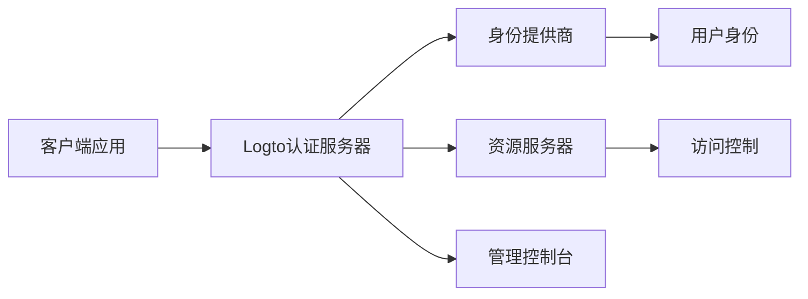

## 今日热点

今日GitHub热榜显示AI代理技术爆发式增长，从投资到安全领域均有应用，同时隐私保护和实用工具也受到广泛关注。

---

## 热门项目一览

| 排名 | 项目 | 语言 | 今日 | 总计 | 简介 |
|:---:|------|:----:|------:|-----:|------|
| 1 | [ripienaar/free-for-dev](https://github.com/ripienaar/free-for-dev) | HTML | +1,935 | 126,781 | A list of SaaS, PaaS and Ia... |
| 2 | [simplex-chat/simplex-chat](https://github.com/simplex-chat/simplex-chat) | Haskell | +1,607 | 16,685 | SimpleX - the first messagi... |
| 3 | [msitarzewski/agency-agents](https://github.com/msitarzewski/agency-agents) | Shell | +1,425 | 119,043 | A complete AI agency at you... |
| 4 | [xbtlin/ai-berkshire](https://github.com/xbtlin/ai-berkshire) | Python | +1,386 | 6,728 | AI 时代的伯克希尔：基于 Claude Code /... |
| 5 | [browser-use/video-use](https://github.com/browser-use/video-use) | Python | +967 | 11,991 | Edit videos with coding agents |
| 6 | [HKUDS/Vibe-Trading](https://github.com/HKUDS/Vibe-Trading) | Python | +839 | 15,149 | "Vibe-Trading: Your Persona... |
| 7 | [altic-dev/FluidVoice](https://github.com/altic-dev/FluidVoice) | Swift | +830 | 4,432 | FluidVoice - Fastest macOS ... |
| 8 | [commaai/openpilot](https://github.com/commaai/openpilot) | Python | +458 | 62,790 | openpilot is an operating s... |
| 9 | [cupy/cupy](https://github.com/cupy/cupy) | Python | +352 | 11,857 | NumPy & SciPy for GPU |
| 10 | [0xNyk/council-of-high-intelligence](https://github.com/0xNyk/council-of-high-intelligence) | Shell | +331 | 1,952 | 18 AI personas deliberate y... |
| 11 | [refactoringhq/tolaria](https://github.com/refactoringhq/tolaria) | TypeScript | +280 | 17,554 | Desktop app to manage markd... |
| 12 | [soxoj/maigret](https://github.com/soxoj/maigret) | Python | +224 | 34,428 | 🕵️‍♂️ Collect a dossier on ... |

---

## 趋势洞察

```
┌─────────────────────────────────────────────────────────────────┐
│  AI/ML 工具         ████████████████████████  9 个项目        │
│  其他               █████████████             5 个项目        │
│  安全工具             ██                        1 个项目        │
└─────────────────────────────────────────────────────────────────┘
```

---

## 项目深度解读

### 1. ripienaar/free-for-dev — DevOps资源库

> **一句话总结**：为DevOps和基础设施开发者整理的各类免费云服务和工具清单，助力高效低成本开发。

#### 价值主张

| 维度 | 说明 |
|------|------|
| **解决痛点** | 开发者难以快速发现和筛选适合的免费云服务和工具 |
| **目标用户** | DevOps工程师、系统管理员、基础设施开发者 |
| **核心亮点** | 分类清晰 + 持续更新 + 实用性强 + 社区驱动 |

#### 技术架构


**技术特色**：
- 纯静态实现，无需后端服务器
- 通过GitHub协作模式持续更新内容
- 使用Markdown格式便于维护和贡献
- 响应式设计适配各种设备

#### 热度分析

- 项目获得超12万星，月均增长约2000星，在DevOps工具类项目中热度领先
- 作为行业参考资料被广泛引用，形成开发者社区中的"标准"资源库

#### 快速上手

```bash
# 克隆项目到本地
git clone https://github.com/ripienaar/free-for-dev.git

# 本地预览（如需要）
cd free-for-dev
python -m http.server 8000
```

#### 注意事项

- 项目内容依赖于社区贡献，需自行验证服务的可用性和限制
- 免费服务条款可能随时变更，建议在使用前查看官方最新政策
- 项目未明确许可证，使用或贡献前需确认版权条款


### 2. simplex-chat/simplex-chat — 隐私优先聊天网络

> **一句话总结**：SimpleX是一款无用户标识符的端到端加密聊天网络，以100%隐私为设计核心。

#### 价值主张

| 维度 | 说明 |
|------|------|
| **解决痛点** | 消除用户身份追踪，实现完全匿名通信 |
| **目标用户** | 对隐私有极高要求的个人和组织 |
| **核心亮点** | 无用户标识符设计 + 100%隐私保证 + 端到端加密 + 多平台支持 + 去中心化架构 |

#### 技术架构


**技术特色**：
- Haskell函数式编程确保系统可靠性
- 自定义协议实现真正的匿名通信
- 无中心化架构避免单点故障

#### 热度分析

- 项目近期获得大量关注，一日新增星标超过1600，显示隐私通信领域需求旺盛
- 作为隐私通信领域的创新项目，SimpleX填补了传统聊天工具的隐私空白

#### 快速上手

```bash
# 构建桌面客户端
git clone https://github.com/simplex-chat/simplex-chat.git
cd simplex-chat && stack build
```

#### 注意事项

- 项目许可证未知，使用前需确认许可条款
- 作为新兴项目，生态系统和第三方集成可能尚不完善


### 3. msitarzewski/agency-agents — AI代理集合

> **一句话总结**：提供多种专业化AI代理的Shell脚本集合，覆盖从开发到社区管理的全方位智能服务。

#### 价值主张

| 维度 | 说明 |
|------|------|
| **解决痛点** | 提供一站式AI工具链，简化复杂AI任务操作流程 |
| **目标用户** | 开发者、内容创作者、社区运营人员 |
| **核心亮点** | 模块化设计 + 专业化代理 + 命令行交互 + 即用即走 |

#### 技术架构


**技术特色**：
- 基于Shell脚本实现，跨平台兼容性强
- 采用模块化设计，各代理独立运行
- 简洁的命令行界面，易于集成到工作流

#### 热度分析

- 项目获得超11万Star，日增上千，表明AI代理工具需求旺盛
- Fork数接近2万，显示社区积极参与和二次开发热情高

#### 快速上手

```bash
# 克隆项目
git clone https://github.com/msitarzewski/agency-agents.git
# 进入目录
cd agency-agents
# 运行特定代理
./run-agent.sh frontend-wizard
```

#### 注意事项

- 项目使用Shell脚本，确保系统已安装必要的依赖
- 部分代理可能需要API密钥或配置文件
- 建议查看项目README了解各代理的具体使用方法


### 4. xbtlin/ai-berkshire — AI价值投资

> **一句话总结**：融合巴菲特等大师方法论的多Agent并行研究框架，重塑AI时代的价值投资。

#### 价值主张

| 维度 | 说明 |
|------|------|
| **解决痛点** | 传统价值投资研究效率低，AI赋能提升决策准确性和研究广度 |
| **目标用户** | 价值投资者、量化研究员、AI金融应用开发者 |
| **核心亮点** | 大师方法论集成 + 多Agent并行研究 + AI辅助决策 + 对比分析框架 |

#### 技术架构


**技术特色**：
- 基于Claude Code/Codex的大语言模型集成
- 多Agent并行处理提升研究效率
- 融合四大投资大师方法论的分析框架
- 对比分析机制减少投资偏见

#### 热度分析

- 项目Star数6,728且单日新增1,386，显示市场对AI+价值投资的高度关注
- 开源社区活跃，Fork数873表明开发者积极参与改进和二次开发

#### 快速上手

```bash
# 克隆项目
git clone https://github.com/xbtlin/ai-berkshire.git

# 安装依赖
pip install -r requirements.txt

# 运行示例研究
python run_research.py --target_stock AAPL
```

#### 注意事项

- 项目依赖AI模型API，需确保有相应的访问权限
- AI辅助决策不应完全替代人工判断，需结合专业投资知识
- 项目持续更新中，建议关注最新版本变化


### 5. browser-use/video-use — AI视频编辑

> **一句话总结**：通过代码代理实现自动化视频编辑，降低视频创作技术门槛

#### 价值主张

| 维度 | 说明 |
|------|------|
| **解决痛点** | 将复杂的视频编辑任务转化为代码操作，无需专业视频编辑技能 |
| **目标用户** | 开发者、内容创作者、自动化流程需求者 |
| **核心亮点** | + 编程方式控制视频编辑 + 自动化批量处理 + 跨平台兼容性 + 版本控制集成 + 可扩展性 |

#### 技术架构


**技术特色**：
- 基于浏览器环境的视频处理，无需专业视频编辑软件
- 利用Python编程控制视频编辑流程，实现自动化
- 通过API或脚本方式实现复杂视频编辑任务的批处理

#### 热度分析

- 项目在短时间内获得大量关注，今日新增近千星，显示视频编辑自动化领域需求旺盛
- 零开放问题表明项目维护良好，社区可能通过其他渠道进行交流

#### 快速上手

```bash
# 安装项目
pip install video-use

# 基本使用示例
python -m video-use --input input.mp4 --output output.mp4 --script edit_script.py
```

#### 注意事项

- 项目可能需要依赖浏览器环境，确保系统兼容性
- 视频处理可能需要较多计算资源，建议在性能较好的机器上运行
- 由于项目描述较为简短，具体功能和使用方法可能需要参考项目文档或示例


### 6. HKUDS/Vibe-Trading — 智能交易助手

> **一句话总结**：基于AI的个人交易代理，提供自动化交易策略和决策支持。

#### 价值主张

| 维度 | 说明 |
|------|------|
| **解决痛点** | 简化交易决策流程，提供自动化策略支持 |
| **目标用户** | 交易新手和寻求自动化策略的专业交易者 |
| **核心亮点** | AI驱动决策 + 自动化执行 + 策略定制 + 风险管理 |

#### 技术架构


**技术特色**：
- 基于机器学习的市场预测模型
- 实时数据处理和分析能力
- 多维度风险评估系统

#### 热度分析

- 项目Star数超过15K，近期增长迅速，日均增长约800+，显示市场高度认可
- Fork数相对Star比例合理，表明项目处于积极开发阶段，社区参与度高

#### 快速上手

```bash
# 克隆项目
git clone https://github.com/HKUDS/Vibe-Trading.git
cd Vibe-Trading

# 安装依赖
pip install -r requirements.txt

# 运行交易代理
python main.py --mode backtest --config config/default.yaml
```

#### 注意事项

- 交易存在风险，使用任何自动化交易系统前应充分了解风险
- 建议在实盘交易前进行充分的回测和模拟交易
- 需要关注市场变化和模型性能，定期调整策略参数


### 7. altic-dev/FluidVoice — 离线语音识别

> **一句话总结**：完全本地化的macOS语音转文字应用，无需联网即可实现高效语音输入。

#### 价值主张

| 维度 | 说明 |
|------|------|
| **解决痛点** | 解决在线语音识别隐私问题和网络依赖，实现完全本地化的语音转文字 |
| **目标用户** | 注重隐私保护、需要离线使用场景的macOS用户 |
| **核心亮点** | 完全本地处理 + 高速识别 + 隐私保护 + 离线可用 |

#### 技术架构


**技术特色**：
- 基于Apple语音识别框架的本地化实现
- 高效的音频处理算法
- 优化的模型加载和推理流程

#### 热度分析

- 项目短期内增长迅速，单日增加830个Star，表明用户对离线语音识别需求强烈
- 在macOS语音识别工具领域具有明显优势，但开源社区相对较小，Fork数较少

#### 快速上手

```bash
# 克隆项目
git clone https://github.com/altic-dev/FluidVoice.git

# 使用Xcode打开并编译
cd FluidVoice
open FluidVoice.xcodeproj
```

#### 注意事项

- 需要在macOS系统上运行，不支持其他操作系统
- 可能需要较新的macOS版本才能支持
- 需要麦克风权限才能正常使用语音识别功能


### 8. commaai/openpilot — [智能驾驶系统]

> **一句话总结**：开源高级驾驶辅助系统，为300+车型提供可定制的自动驾驶能力。

#### 价值主张

| 维度 | 说明 |
|------|------|
| **解决痛点** | 提供低成本、可定制的高级驾驶辅助方案，弥补原厂系统不足 |
| **目标用户** | 汽车技术爱好者、自动驾驶研究者、希望升级车辆功能的普通车主 |
| **核心亮点** | 开源可定制 + 支持300+车型 + 低成本实现 + 社区驱动持续优化 |

#### 技术架构


**技术特色**：
- 基于深度学习的视觉感知系统
- 开源硬件兼容性设计
- 实时车辆控制反馈系统

#### 热度分析

- 项目获得62K+星标，单日增长458星，显示持续的高关注度与增长趋势
- Fork数超11K，表明开发者社区积极参与和二次开发，形成活跃生态

#### 快速上手

```bash
# 克隆项目
git clone https://github.com/commaai/openpilot.git
# 安装依赖
cd openpilot && pip install -r requirements.txt
# 运行安装脚本
python setup.py install
```

#### 注意事项

- openpilot是复杂系统，需要一定的技术背景才能正确安装和使用
- 项目涉及车辆控制系统，使用时需注意安全，建议在封闭场地测试
- 可能需要特定硬件支持，如comma.ai设备或兼容硬件
- 使用时需遵守当地自动驾驶相关法律法规


### 9. cupy/cupy — GPU计算加速

> **一句话总结**：将NumPy和SciPy功能移植到GPU，实现高性能科学计算加速。

#### 价值主张

| 维度 | 说明 |
|------|------|
| **解决痛点** | CPU计算性能瓶颈，大规模科学计算效率低下 |
| **目标用户** | 需要高性能计算的数据科学家、研究人员和工程师 |
| **核心亮点** | NumPy兼容接口 + GPU加速计算 + 无需修改现有代码 + 支持多种GPU架构 |

#### 技术架构


**技术特色**：
- 提供与NumPy兼容的API，降低学习成本
- 支持多种GPU架构，包括NVIDIA、AMD等
- 自动内存管理和优化，减少手动干预

#### 热度分析

- 项目Star数持续增长，近期日增352个Star，关注度快速提升
- 作为GPU计算领域的重要项目，在AI和科学计算社区占据核心位置

#### 快速上手

```bash
# 安装CuPy
pip install cupy-cuda11x  # 根据CUDA版本选择合适版本

# 基本使用示例
import cupy as cp
x = cp.array([1, 2, 3])
y = x * 2
print(y)  # 输出: [2 4 6]
```

#### 注意事项

- 需要NVIDIA GPU支持，且安装对应版本的CUDA
- 对于大规模数据，需要注意GPU内存限制
- 某些NumPy函数在CuPy中可能不完全支持，需查阅兼容性文档


### 10. 0xNyk/council-of-high-intelligence — AI决策委员会

> **一句话总结**：通过18个不同AI人格的多轮结构化讨论，整合多种LLM智慧，为复杂决策提供多元视角。

#### 价值主张

| 维度 | 说明 |
|------|------|
| **解决痛点** | 面对复杂决策时单一AI模型视角有限，缺乏深度多元思考 |
| **目标用户** | 需要深度分析复杂问题的专业人士、研究人员、决策者 |
| **核心亮点** | 多AI人格模拟 + 结构化多轮讨论 + 跨LLM模型多样性 + 历史名人思维模拟 + 一键启动 |

#### 技术架构


**技术特色**：
- 多LLM提供商集成，确保思维多样性和避免单一模型偏见
- 结构化多轮讨论机制，模拟真实委员会决策流程
- 历史名人AI人格模拟，提供专业领域深度视角

#### 热度分析

- 项目近期热度快速上升，今日新增331个star，表明其创新性和实用性获得广泛认可
- 作为AI应用领域的创新项目，在AI辅助决策细分领域具有独特生态位和先发优势

#### 快速上手

```bash
/council "需要决策的问题"
```

#### 注意事项

- 项目未明确许可证，使用时需要注意版权和合规问题
- 依赖多个LLM提供商，可能产生较高API调用费用
- AI人格模拟的历史人物思维可能与实际有差异，需理性参考结论


### 11. refactoringhq/tolaria — 知识库管理工具

> **一句话总结**：一款优雅的桌面应用，帮助用户高效管理Markdown知识库，提升知识组织与检索效率。

#### 价值主张

| 维度 | 说明 |
|------|------|
| **解决痛点** | 解决Markdown知识库分散、难以检索和组织的问题 |
| **目标用户** | 开发者、研究人员、知识工作者 |
| **核心亮点** | Markdown原生支持 + 强大全文检索 + 可视化知识图谱 + 跨平台桌面应用 |

#### 技术架构


**技术特色**：
- 基于TypeScript开发，保证代码质量与类型安全
- 使用Electron框架实现跨平台桌面应用体验
- 高效的全文检索算法实现知识快速定位

#### 热度分析

- 项目获17k+星且持续增长，表明知识管理工具需求旺盛
- 零开放问题，可能表示项目维护良好或社区通过其他渠道交流

#### 快速上手

```bash
# 克隆仓库
git clone https://github.com/refactoringhq/tolaria.git
# 安装依赖
npm install
# 构建并运行
npm run build && npm start
```

#### 注意事项

- 项目许可证未知，商业使用前需确认授权
- 作为桌面应用，可能需要较高的系统资源


### 12. soxoj/maigret — 用户名侦察工具

> **一句话总结**：跨平台用户名信息收集工具，可在3000+网站追踪个人数字足迹。

#### 价值主张

| 维度 | 说明 |
|------|------|
| **解决痛点** | 跨平台用户名信息分散，难以系统收集个人数字足迹 |
| **目标用户** | 安全研究人员、数字取证专家、隐私保护人士 |
| **核心亮点** | 支持3000+网站 + 多种查询模式 + 结构化报告生成 |

#### 技术架构


**技术特色**：
- 基于Python异步IO实现高效多站点查询
- 模块化设计支持自定义网站适配器
- 支持多种查询模式（精确匹配、模糊匹配等）

#### 热度分析

- 项目Star数超过3万且持续增长，显示其在安全领域的广泛认可
- Fork数较少表明项目维护良好，社区更倾向于直接使用而非分叉

#### 快速上手

```bash
# 安装
pip install maigret

# 基本使用
maigret username

# 生成详细报告
maigret username -r detailed_report.html
```

#### 注意事项

- 使用时需遵守相关法律法规，避免侵犯他人隐私
- 部分网站可能有反爬虫机制，建议合理使用API限制
- 结果准确性取决于各网站的用户名政策和数据完整性


### 13. veracrypt/VeraCrypt — 安全磁盘加密

> **一句话总结**：基于TrueCrypt开发的强安全磁盘加密工具，提供多层次加密保护用户数据隐私。

#### 价值主张

| 维度 | 说明 |
|------|------|
| **解决痛点** | 提供比TrueCrypt更安全的全磁盘/分区加密方案，抵御已知漏洞 |
| **目标用户** | 注重数据安全的高级用户、企业、政府机构和研究人员 |
| **核心亮点** | 多算法加密支持 + 自定义加密方案 + 分区加密 + 系统加密 + 跨平台兼容 |

#### 技术架构


**技术特色**：
- 支持AES、Twofish、Serpent等多种加密算法
- 实现了隐藏卷和隐藏操作系统功能
- 采用PBKDF2密钥派生函数增强密码安全性
- 加密过程完全在内存中进行，减少数据泄露风险

#### 热度分析

- Star数稳定增长，显示项目持续受到安全领域关注，社区活跃度高。
- 作为TrueCrypt的继承者，已成为开源磁盘加密领域的标杆项目，拥有完善的文档和社区支持。

#### 快速上手

```bash
# 安装VeraCrypt (Linux示例)
sudo apt-get install veracrypt

# 创建加密容器
veracrypt -c /path/to/containerfile

# 挂载加密容器
veracrypt /path/to/containerfile /mnt/point
```

#### 注意事项

- VeraCrypt 是 TrueCrypt 的一个分支，TrueCrypt 在2014年停止开发后，VeraCrypt 成为主要的继承者
- 加密容器和系统加密需要正确设置，否则可能导致数据丢失
- 在忘记密码的情况下，数据几乎不可能恢复，密码管理至关重要
- 定期更新到最新版本以获得安全修复和改进


### 14. logto-io/logto — 身份认证基础设施

> **一句话总结**：基于OIDC和OAuth 2.1构建的SaaS和AI应用认证授权解决方案，支持多租户、SSO和RBAC。

#### 价值主张

| 维度 | 说明 |
|------|------|
| **解决痛点** | 为SaaS和AI应用提供统一、安全的身份认证和授权基础设施，简化身份管理复杂性 |
| **目标用户** | SaaS应用开发者、AI应用构建者、需要身份认证服务的企业 |
| **核心亮点** | 基于开放标准(OIDC/OAuth 2.1) + 多租户支持 + 单点登录(SSO) + RBAC权限控制 |

#### 技术架构



**技术特色**：
- 基于开放标准的现代认证协议实现
- 多租户架构设计，支持隔离和扩展
- 灵活的RBAC权限管理系统

#### 热度分析

- 项目Star数超过12k，近期增长稳定，表明项目处于活跃发展期，社区认可度高
- Fork数871，表明项目有较高的二次开发价值和社区贡献意愿

#### 快速上手

```bash
# 克隆项目
git clone https://github.com/logto-io/logto.git
# 安装依赖
npm install
# 启动开发服务器
npm run dev
```

#### 注意事项

- 项目许可证信息不明确，使用前需确认开源协议
- 作为认证基础设施，安全性至关重要，需关注项目的安全更新和最佳实践
- 集成时需考虑与现有系统的兼容性


### 15. Unclecheng-li/VulnClaw — AI驱动渗透测试

> **一句话总结**：基于AI Agent和工具链的自动化渗透测试平台，实现从漏洞发现到报告生成的全流程自动化。

#### 价值主张

| 维度 | 说明 |
|------|------|
| **解决痛点** | 解决渗透测试专业知识要求高、手动操作繁琐、效率低下的问题 |
| **目标用户** | 安全研究员、渗透测试工程师、红队成员、安全运维人员 |
| **核心亮点** | AI Agent自动化 + 大语言模型协作 + 渗透技能编排 + 全流程自动化 + 自然语言输入 |

#### 技术架构


**技术特色**：
- 基于大语言模型的理解能力实现自然语言交互
- 结合MCP工具链扩展渗透测试能力
- 通过技能编排实现渗透测试流程自动化
- AI Agent自主决策和执行渗透测试任务
- 自动化生成专业漏洞报告

#### 热度分析

- 项目获得1190个Star和177个Fork，近期增长129个Star，表明项目受到广泛关注
- 作为安全与AI融合的前沿项目，处于技术创新热点领域，吸引安全研究社区关注

#### 快速上手

```bash
# 安装依赖
pip install -r requirements.txt

# 配置AI模型和工具链
python setup.py

# 运行渗透测试
python vulnclaw.py "target网站漏洞扫描"
```

#### 注意事项

- 使用时需遵守法律法规和道德准则，仅限授权测试
- AI生成的渗透测试结果可能存在误报，需要人工验证
- 项目依赖大语言模型API，可能产生额外费用
- 使用前需要确保目标系统的测试权限


## 今日推荐

| 主题 | 推荐项目 | 亮点 |
|------|----------|------|
| 今日最热 | [ripienaar/free-for-dev](https://github.com/ripienaar/free-for-dev) | A list of SaaS, P... |
| 值得关注 | [simplex-chat/simplex-chat](https://github.com/simplex-chat/simplex-chat) | SimpleX - the fir... |
| 快速上手 | [msitarzewski/agency-agents](https://github.com/msitarzewski/agency-agents) | A complete AI age... |
| 长期潜力 | [xbtlin/ai-berkshire](https://github.com/xbtlin/ai-berkshire) | AI 时代的伯克希尔：基于 Cla... |

---

<div align="center">

*Generated on 2026-06-30 | Powered by GitHub Trending Reporter*

</div>