## 今日热点

今日GitHub热榜显示AI代理技术全面爆发，从渗透测试到视频编辑，本地AI应用崛起，开发者工具加速AI化，AI正在重塑各领域工作流程。

---

## 热门项目一览

| 排名 | 项目 | 语言 | 今日 | 总计 | 简介 |
|:---:|------|:----:|------:|-----:|------|
| 1 | [msitarzewski/agency-agents](https://github.com/msitarzewski/agency-agents) | Shell | +1,791 | 121,067 | A complete AI agency at you... |
| 2 | [hasaneyldrm/exercises-dataset](https://github.com/hasaneyldrm/exercises-dataset) | HTML | +1,343 | 6,859 | A comprehensive dataset of ... |
| 3 | [simplex-chat/simplex-chat](https://github.com/simplex-chat/simplex-chat) | Haskell | +1,235 | 17,364 | SimpleX - the first messagi... |
| 4 | [xbtlin/ai-berkshire](https://github.com/xbtlin/ai-berkshire) | Python | +969 | 7,575 | AI 时代的伯克希尔：基于 Claude Code /... |
| 5 | [obra/superpowers](https://github.com/obra/superpowers) | Shell | +890 | 242,607 | An agentic skills framework... |
| 6 | [ripienaar/free-for-dev](https://github.com/ripienaar/free-for-dev) | HTML | +742 | 127,356 | A list of SaaS, PaaS and Ia... |
| 7 | [browser-use/video-use](https://github.com/browser-use/video-use) | Python | +721 | 12,658 | Edit videos with coding agents |
| 8 | [HKUDS/Vibe-Trading](https://github.com/HKUDS/Vibe-Trading) | Python | +721 | 15,841 | "Vibe-Trading: Your Persona... |
| 9 | [altic-dev/FluidVoice](https://github.com/altic-dev/FluidVoice) | Swift | +588 | 4,957 | Fastest and only macOS Dict... |
| 10 | [usestrix/strix](https://github.com/usestrix/strix) | Python | +515 | 28,204 | Open-source AI penetration ... |
| 11 | [ogulcancelik/herdr](https://github.com/ogulcancelik/herdr) | Rust | +486 | 9,057 | agent multiplexer that live... |
| 12 | [google/agents-cli](https://github.com/google/agents-cli) | Python | +445 | 4,245 | The CLI and skills that tur... |

---

## 趋势洞察

```
┌─────────────────────────────────────────────────────────────────┐
│  AI/ML 工具         ████████████████████████  13 个项目        │
│  其他               ███████                   4 个项目        │
│  媒体资源             █                         1 个项目        │
│  开发工具             █                         1 个项目        │
└─────────────────────────────────────────────────────────────────┘
```

---

## 项目深度解读

### 1. msitarzewski/agency-agents — AI代理集合

> **一句话总结**：提供多种专业化、有性格的AI代理，覆盖从开发到社区管理的各类任务。

#### 价值主张

| 维度 | 说明 |
|------|------|
| **解决痛点** | 无需配置多个专业AI工具，一键获取完整AI代理团队 |
| **目标用户** | 开发者、内容创作者、社区运营者及多领域专业人士 |
| **核心亮点** | 多种专业化AI代理 + 独特个性设定 + 即开即用工作流 |

#### 技术架构

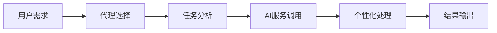

**技术特色**：
- 轻量级Shell脚本实现，跨平台兼容性强
- 模块化代理设计，易于扩展新角色
- 可能集成多种AI API服务，提供多样化能力

#### 热度分析

- 项目获星超12万，近期单日增长近1800，热度持续攀升
- 高Fork数显示社区活跃，用户积极参与定制与二次开发

#### 快速上手

```bash
git clone https://github.com/msitarzewski/agency-agents.git
cd agency-agents
chmod +x *.sh
./start-agent [agent-type]
```

#### 注意事项

- 需配置相应AI服务的API密钥才能正常使用
- Shell脚本在Windows系统上可能需要额外配置WSL或其他兼容环境
- 项目License信息不明确，使用前建议确认授权条款


### 2. hasaneyldrm/exercises-dataset — 健身运动数据集

> **一句话总结**：提供433种健身运动的全面数据集，包含详细信息和多媒体资源，助力健身应用开发。

#### 价值主张

| 维度 | 说明 |
|------|------|
| **解决痛点** | 健身应用开发者缺乏标准化、结构化的运动数据资源库 |
| **目标用户** | 健身应用开发者、健身网站创建者、健身教练 |
| **核心亮点** | + 433种全面覆盖的健身运动 + 结构化元数据组织 + 多媒体资源支持 |

#### 技术架构

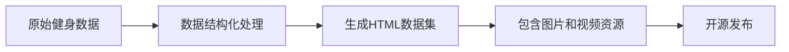

**技术特色**：
- 采用HTML格式提供标准化数据结构，便于解析和集成
- 每个运动条目包含完整元数据，提高数据可用性
- 提供缩略图和动画视频资源，增强用户体验

#### 热度分析

- 项目获得近7000星，单日增长超1300，显示健身数据需求旺盛
- 0个开放问题表明项目维护良好，社区依赖度高

#### 快速上手

```bash
# 克隆项目到本地
git clone https://github.com/hasaneyldrm/exercises-dataset.git

# 访问HTML数据集
cd exercises-dataset
# 浏览 exercises.html 查看完整数据集
```

#### 注意事项

- 项目许可证未知，商业使用前需确认授权方式
- 数据集可能需要定期更新以保持时效性
- 图片和视频资源可能需要额外存储空间


### 3. simplex-chat/simplex-chat — 无标识隐私通讯

> **一句话总结**：首个无需用户标识的隐私优先通讯网络，彻底消除身份追踪风险。

#### 价值主张

| 维度 | 说明 |
|------|------|
| **解决痛点** | 消除传统通讯中的用户身份标识，防止身份追踪和数据泄露 |
| **目标用户** | 隐私敏感型用户、加密通信爱好者、反监控活动人士 |
| **核心亮点** | 无用户标识设计 + 端到端加密 + 跨平台支持 + 去中心化架构 |

#### 技术架构

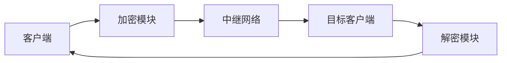

**技术特色**：
- 基于 Haskell 的强类型系统保证安全性
- 自研的去中心化中继网络架构
- 零知识证明技术保护用户身份
- 端到端加密确保通信内容安全
- 无需注册或用户ID的设计简化隐私保护

#### 热度分析

- 项目获得超过17k星，单日增长超过1.2k，表明隐私通讯需求旺盛且项目备受关注
- 零开放问题反映项目成熟度高，社区可能通过其他渠道（如论坛、Discord）进行问题讨论

#### 快速上手

```bash
# macOS
brew install --cask simplex-chat

# Linux (deb)
wget https://github.com/simplex-chat/simplex-chat/releases/download/v4.4.1/simplex-desktop.deb
sudo apt install ./simplex-desktop.deb

# Android
# 从 GitHub Releases 下载 APK 或通过 F-Droid 安装
```

#### 注意事项

- 项目依赖 Haskell 生态，可能需要一定的技术背景
- 由于无用户标识设计，初始联系人添加可能需要其他验证方式
- 项目仍在积极开发中，API 和功能可能会有变化


### 4. xbtlin/ai-berkshire — AI投资框架

> **一句话总结**：融合四位大师方法论的多Agent价值投资研究框架，结合AI技术提升投资决策质量。

#### 价值主张

| 维度 | 说明 |
|------|------|
| **解决痛点** | 传统价值研究效率低、覆盖面有限、主观性强 |
| **目标用户** | 价值投资者、金融分析师、量化研究员 |
| **核心亮点** | 四大师方法论融合 + 多Agent并行研究 + AI辅助决策 + 价值投资框架 + 可扩展架构 |

#### 技术架构

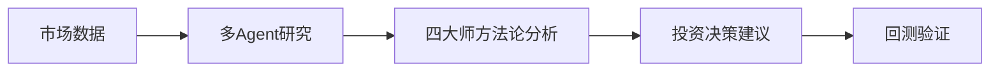

**技术特色**：
- 基于Claude Code/Codex的大语言模型应用
- 多Agent并行研究架构设计
- 四大师价值投资方法论数字化实现
- 价值投资研究的AI辅助框架

#### 热度分析

- 项目Star数达7575，单日新增969，表明项目热度快速上升，投资AI领域关注度高涨
- Fork数963，说明项目有较高的二次开发价值，社区活跃度良好

#### 快速上手

```bash
# 克隆项目
git clone https://github.com/xbtlin/ai-berkshire.git

# 安装依赖
pip install -r requirements.txt
```

#### 注意事项

- 项目License未知，商业使用需谨慎
- 作为投资研究工具，AI建议仅供参考，不能完全替代人类判断
- 项目可能需要一定的金融知识和编程基础才能充分利用


### 5. obra/superpowers — 效能开发框架

> **一句话总结**：一个实用的代理技能框架与软件开发方法论，显著提升开发者效能。

#### 价值主张

| 维度 | 说明 |
|------|------|
| **解决痛点** | 解决开发者效率低下与技能提升缺乏系统方法的问题 |
| **目标用户** | 追求高效能的个人开发者和软件开发团队 |
| **核心亮点** | 实用性 + 系统性 + 可操作性 + 持续改进 |

#### 技术架构

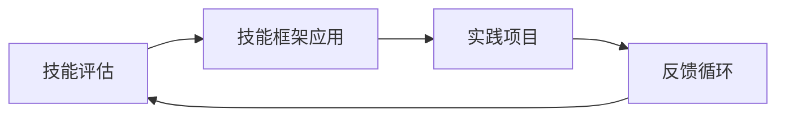

**技术特色**：
- 基于 Shell 脚本，跨平台兼容性强
- 模块化设计，易于扩展和定制
- 实践导向，强调通过项目应用技能

#### 热度分析

- 项目获得超过24万星，每日新增近900星，表明其方法论受到广泛认可
- Fork 数量相对较少(2.1万)，说明项目可能更偏向于个人使用而非团队协作

#### 快速上手

```bash
git clone https://github.com/obra/superpowers.git
cd superpowers && ./setup.sh
```

#### 注意事项

- 项目未明确许可证，使用前需确认开源协议
- 可能需要一定的 Shell 脚本基础知识才能充分利用
- 作为方法论框架，需要用户主动实践才能获得最佳效果


### 6. ripienaar/free-for-dev — 免费服务指南

> **一句话总结**：为DevOps和基础设施开发者整理的免费SaaS、PaaS和IaaS服务精选清单。

#### 价值主张

| 维度 | 说明 |
|------|------|
| **解决痛点** | 帮助开发者快速发现可用的免费云服务，降低基础设施成本 |
| **目标用户** | DevOps工程师、基础设施开发者、初创团队和个人开发者 |
| **核心亮点** + 分类清晰 + 持续更新 + 覆盖面广 + 实用性强 + 社区驱动 |

#### 技术架构

**技术特色**：
- 纯静态HTML实现，部署简单
- 使用Markdown格式便于维护和贡献
- 清晰的分类和标签系统便于查找
- 响应式设计适配不同设备

#### 热度分析

- 项目拥有超过12.7万星标，日增长742星，表明开发者社区对其高度认可
- 作为开发者社区的重要资源，已成为寻找免费云服务的首选参考指南

#### 快速上手

```bash
# 克隆项目到本地
git clone https://github.com/ripienaar/free-for-dev.git

# 使用浏览器打开README.html查看完整列表
open free-for-dev/README.html
```

#### 注意事项

- 项目内容依赖社区贡献，某些服务信息可能存在滞后性
- 免费服务条款可能随时变更，使用前需确认最新政策
- 部分服务可能有使用限制或隐藏成本，使用时需仔细评估


### 7. browser-use/video-use — 视频智能编辑

> **一句话总结**：通过编程代理实现视频编辑，将代码能力转化为自动化视频处理工具。

#### 价值主张

| 维度 | 说明 |
|------|------|
| **解决痛点** | 将复杂的视频编辑任务转化为代码操作，降低专业编辑门槛 |
| **目标用户** | 开发者、视频创作者、自动化需求用户 |
| **核心亮点** + 编程控制视频编辑 + 自动化处理流程 + 可复用编辑脚本 + 无需专业视频编辑软件 |

#### 技术架构

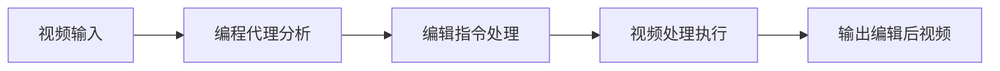

**技术特色**：
- 基于大语言模型的视频理解与分析能力
- 将自然语言指令转化为视频编辑操作
- 提供可编程的视频处理流水线
- 支持批量自动化视频编辑任务

#### 热度分析

- 项目近期增长迅猛，单日新增Star数超700，表明社区关注度极高
- 作为browser-use生态的重要扩展，填补了自动化视频编辑领域的空白

#### 快速上手

```bash
# 安装依赖
pip install video-use

# 基本使用示例
video-use --input video.mp4 --edit "trim 0:30 1:30" --output edited_video.mp4
```

#### 注意事项

- 项目可能需要一定的编程基础，非技术人员使用可能有门槛
- 视频处理可能消耗大量计算资源，建议在性能较好的环境中运行
- 由于许可证信息未知，商业使用前需确认授权条款


### 8. HKUDS/Vibe-Trading — AI交易助手

> **一句话总结**：基于AI的个人交易代理系统，提供自动化交易决策和实时市场分析。

#### 价值主张

| 维度 | 说明 |
|------|------|
| **解决痛点** | 简化交易决策流程，减少情绪化交易，提高交易执行效率 |
| **目标用户**| 个体投资者、量化交易爱好者、寻求自动化交易解决方案的交易者 |
| **核心亮点** | AI驱动的市场预测 + 多平台交易集成 + 策略自定义 + 实时风险控制 |

#### 技术架构


**技术特色**：
- 采用Python生态，集成机器学习算法进行市场趋势预测
- 支持多交易平台API统一接入，实现跨平台交易管理
- 模块化设计，允许用户自定义交易策略和风险参数

#### 热度分析

- 项目Star数持续快速增长，日均增长700+，表明社区认可度高
- 在量化交易领域具有一定影响力，但尚未进入顶级项目行列

#### 快速上手

```bash
# 克隆仓库
git clone https://github.com/HKUDS/Vibe-Trading.git

# 安装依赖
pip install -r requirements.txt

# 启动交易代理
python vibe_trading.py
```

#### 注意事项

- 使用前需配置交易API密钥，确保账户和资金安全
- 交易存在风险，建议先在模拟环境测试策略效果
- 项目未明确开源许可协议，使用时需注意合规性


### 9. altic-dev/FluidVoice — AI听写应用

> **一句话总结**：本地运行的 macOS 听写应用，具有设备端语音识别和 AI 增强功能，是 Wispr Flow 的轻量替代品。

#### 价值主张

| 维度 | 说明 |
|------|------|
| **解决痛点** | 提供本地运行的听写工具，避免云端隐私风险 |
| **目标用户** | 注重隐私的 macOS 用户，需要高效听写功能的专业人士 |
| **核心亮点** | 本地STT处理 + AI增强模型 + 跨平台支持计划 + 无需网络连接 |

#### 技术架构


**技术特色**：
- 使用设备端语音转文本技术，保护用户隐私
- 自定义训练的AI增强模型提升识别准确率
- 纯Swift开发，充分利用macOS系统优化

#### 热度分析

- 项目获得近5k星，单日增长588星，显示强烈社区兴趣和需求
- 零开放问题表明项目维护者积极响应反馈，用户满意度高

#### 快速上手

```bash
# 克隆仓库
git clone https://github.com/altic-dev/FluidVoice.git

# 构建项目
cd FluidVoice
xcodebuild -project FluidVoice.xcodeproj -scheme FluidVoice -configuration Release build

# 安装应用
open FluidVoice.app
```

#### 注意事项

- 项目许可证未知，商业使用前需确认授权条款
- 目前仅支持macOS平台，其他平台版本尚未发布
- 自定义AI增强模型可能需要额外训练数据或配置


### 10. usestrix/strix — AI安全测试工具

> **一句话总结**：AI驱动的自动化渗透测试工具，帮助开发者提前发现并修复应用安全漏洞。

#### 价值主张

| 维度 | 说明 |
|------|------|
| **解决痛点** | 传统渗透测试耗时耗力，AI技术实现自动化安全漏洞检测 |
| **目标用户** | 开发者、安全工程师、DevOps团队、需要定期安全测试的组织 |
| **核心亮点** | AI驱动漏洞检测 + 多种漏洞类型识别 + 自动修复建议 + CI/CD集成 + 详细报告生成 |

#### 技术架构

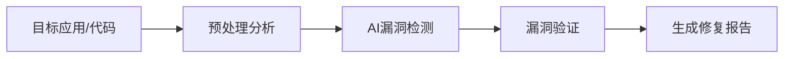

**技术特色**：
- 基于大语言模型的智能漏洞识别技术
- 多种渗透测试算法与规则库集成
- 自动化修复建议与代码优化方案生成

#### 热度分析

- 项目获得28,204个Star且持续增长(+515 today)，表明其在安全测试领域具有重要影响力
- 0个Open Issues反映项目维护良好，社区问题处理高效

#### 快速上手

```bash
# 克隆项目
git clone https://github.com/usestrix/strix.git
cd strix

# 安装依赖并运行
pip install -r requirements.txt
python strix.py --target <应用URL>
```

#### 注意事项

- 确保在合法授权范围内使用此工具进行渗透测试
- AI检测可能存在误报，建议人工验证关键漏洞
- 定期更新工具以获取最新的漏洞检测能力


### 11. ogulcancelik/herdr — 终端代理管理工具

> **一句话总结**：一个在终端中运行的代理多路复用器，可同时管理多个代理连接。

#### 价值主张

| 维度 | 说明 |
|------|------|
| **解决痛点** | 终端中代理切换不便，无法同时管理多个代理连接 |
| **目标用户** | 开发者、网络安全研究人员、需要频繁切换网络环境的用户 |
| **核心亮点** | 多代理并行管理 + 终端友好界面 + 高性能Rust实现 + 轻量级部署 |

#### 技术架构

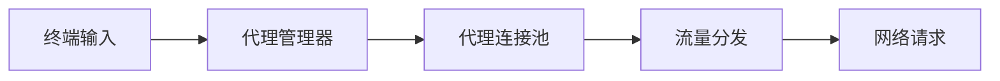

**技术特色**：
- 基于Rust异步运行时，实现高并发代理连接管理
- 终端原生交互，无需额外图形界面
- 支持多种代理协议的统一管理接口

#### 热度分析

- 项目Star数突破9,000，单日增长近500，表明开发者社区高度认可
- 0个Open Issues反映项目维护状态良好，问题响应高效

#### 快速上手

```bash
# 安装
cargo install herdr

# 配置并启动
herdr --config ~/.herdr/config.toml
```

#### 注意事项

- 项目许可证信息不明确，商业使用前需确认授权条款
- 需要Rust环境才能编译安装，建议使用预编译版本以简化流程
- 首次使用可能需要根据实际网络环境调整代理配置


### 12. google/agents-cli — AI代理部署工具

> **一句话总结**：Google Cloud上的AI代理创建、评估和部署一站式CLI工具，简化AI应用落地流程。

#### 价值主张

| 维度 | 说明 |
|------|------|
| **解决痛点** | 简化AI代理在Google Cloud上的创建、评估和部署流程，降低技术门槛 |
| **目标用户** | AI开发者、数据科学家、Google Cloud用户 |
| **核心亮点** | 一键部署+多云支持+评估框架+技能扩展+Google Cloud集成 |

#### 技术架构

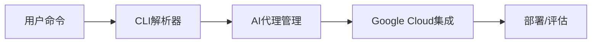

**技术特色**：
- 基于Python的轻量级CLI架构，易于扩展
- 与Google Cloud深度集成，支持多种AI服务
- 提供完整的AI代理生命周期管理

#### 热度分析

- 项目近期热度显著增长，单日新增445星，显示社区高度关注
- 作为Google官方工具，在AI代理部署领域具有独特生态位，填补市场空白

#### 快速上手

```bash
# 安装
pip install agents-cli

# 初始化项目
agents-cli init my-agent

# 部署到Google Cloud
agents-cli deploy --project my-gcp-project
```

#### 注意事项

- 需要Google Cloud账号和相应权限
- 可能需要配置API密钥和服务账号
- 项目仍在积极开发中，API可能会有变化


### 13. diegosouzapw/OmniRoute — 多模型AI网关

> **一句话总结**：统一接入231+AI提供商的免费网关，支持多种AI工具并大幅降低token消耗。

#### 价值主张

| 维度 | 说明 |
|------|------|
| **解决痛点** | 解决AI服务分散、成本高昂和兼容性问题 |
| **目标用户** | 开发者、AI工具用户和企业AI应用 |
| **核心亮点** | 统一网关 + 多提供商支持 + 智能压缩 + 自动回退 |

#### 技术架构

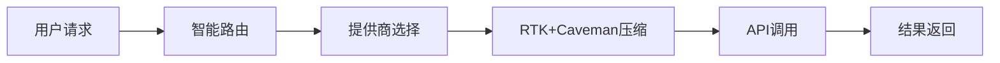

**技术特色**：
- RTK+Caveman堆叠压缩技术，节省15-95% tokens
- 智能自动回退机制，确保服务稳定性
- 统一API网关，支持231+ AI提供商

#### 热度分析

- 项目获得8,620 stars，单日增长387，增长势头强劲
- Fork数1,398表明开发者社区积极参与和二次开发

#### 快速上手

```bash
# 克隆项目
git clone https://github.com/diegosouzapw/OmniRoute.git

# 安装依赖
npm install

# 启动服务
npm start
```

#### 注意事项

- 项目许可证未知，使用前需确认授权条款
- 需要配置多个AI提供商的API密钥才能完全使用功能
- 免费提供商可能有使用限制或速率限制


### 14. facebook/astryx — 智能设计系统

> **一句话总结**：一个高度可定制的开源设计系统，具备AI代理集成能力，助力构建现代化UI界面。

#### 价值主张

| 维度 | 说明 |
|------|------|
| **解决痛点** | 解决设计系统缺乏灵活性与AI集成能力的问题 |
| **目标用户** | 前端开发团队、UI设计师、产品经理 |
| **核心亮点** | 高度可定制 + AI代理就绪 + 组件丰富 + 类型安全 + 易于集成 |

#### 技术架构

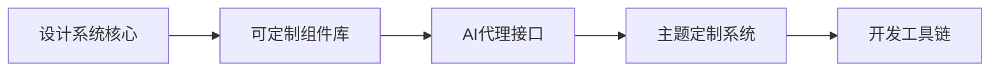

**技术特色**：
- 基于TypeScript构建，提供类型安全开发体验
- 组件化架构支持高度自定义与扩展
- 集成AI代理能力，支持智能化设计流程

#### 热度分析

- 项目Star数快速增长（单日增加364），表明社区对其高度关注
- Fork数相对较少，可能表明用户更倾向于直接使用而非二次开发

#### 快速上手

```bash
# 安装项目依赖
npm install @facebook/astryx

# 导入组件并使用
import { Button, Card } from '@facebook/astryx';
```

#### 注意事项

- 项目许可证信息不明确，使用前需确认具体授权条款
- "agent ready"特性具体实现细节尚不清晰，可能需要进一步调研
- 项目为Facebook出品，可能存在与Facebook生态系统的强耦合


### 15. CoreBunch/Instatic — 极速可视化CMS

> **一句话总结**：一款可在1分钟内启动的现代化自托管可视化内容管理系统。

#### 价值主张

| 维度 | 说明 |
|------|------|
| **解决痛点** | 解决传统CMS部署复杂、可视化编辑体验差的痛点 |
| **目标用户** | 需要快速搭建内容网站的开发者和内容创作者 |
| **核心亮点** | 一分钟部署 + 可视化编辑 + 自托管 + 现代化界面 |

#### 技术架构


**技术特色**：
- 基于TypeScript开发，提供类型安全
- 自托管架构，无需外部依赖
- 可视化编辑界面，所见即所得
- 快速部署能力，1分钟内启动

#### 热度分析

- 项目近期增长迅猛，单日增加351个Star，表明市场反响热烈
- Fork数量相对较少，说明项目可能处于早期阶段，社区贡献尚未大规模展开

#### 快速上手

```bash
# 克隆仓库
git clone https://github.com/CoreBunch/Instatic.git

# 安装依赖并启动
cd Instatic && npm install && npm start
```

#### 注意事项

- 项目许可证未知，使用前需确认商业使用条款
- 作为较新项目，生态系统和文档可能还不够完善
- 自托管模式需要用户具备基本的运维能力


### 16. roboflow/supervision — 计算机视觉工具集

> **一句话总结**：提供可重用的计算机视觉工具集，简化视觉开发流程与模型部署。

#### 价值主张

| 维度 | 说明 |
|------|------|
| **解决痛点** | 降低计算机视觉开发门槛，提供可复用工具组件 |
| **目标用户** | 计算机视觉开发者、数据科学家、AI工程师 |
| **核心亮点** | 模块化设计 + 丰富功能集成 + 简化视觉开发流程 |

#### 技术架构


**技术特色**：
- 提供统一的视觉API接口，简化开发流程
- 集成多种主流计算机视觉算法
- 支持多种数据格式和模型框架

#### 热度分析

- 项目Star数增长迅猛，45K+星标且单日增长300+，表明社区认可度高
- 作为Roboflow生态系统核心组件，在计算机视觉工具领域占据重要位置

#### 快速上手

```bash
pip install supervision
import supervision as sv

# 示例：目标检测可视化
detections = sv.Detections(...)
annotated_image = sv.BoxAnnotator().annotate(scene=image, detections=detections)
```

#### 注意事项

- 项目依赖较多计算机视觉库，需注意环境兼容性问题
- 部分高级功能可能需要额外配置或商业许可


### 17. microsoft/AI-For-Beginners — [AI学习入门]

> **一句话总结**：微软官方推出的12周AI入门课程，通过24个实践课程让AI知识触手可及。

#### 价值主张

| 维度 | 说明 |
|------|------|
| **解决痛点** | 降低AI学习门槛，提供系统化、结构化的入门路径 |
| **目标用户** | AI初学者、学生、希望转行AI领域的开发者 |
| **核心亮点** | 微软官方出品 + 结构化课程设计 + 实践导向 + 多语言支持 + 社区活跃 |

#### 技术架构

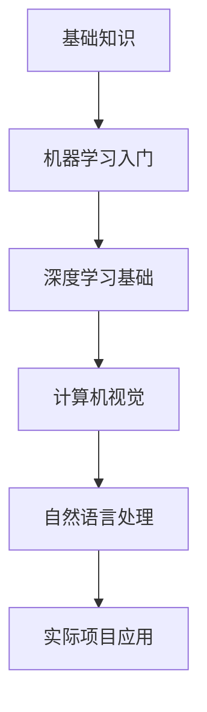

**技术特色**：
- 基于Jupyter Notebook的交互式学习体验
- 涵盖AI核心领域，知识体系完整
- 提供多种语言版本，降低语言障碍

#### 热度分析

- 项目获得近5万星，每周新增250+星，增长势头强劲
- 作为微软官方教育项目，在AI学习领域具有权威性和影响力

#### 快速上手

```bash
# 克隆项目仓库
git clone https://github.com/microsoft/AI-For-Beginners.git

# 使用Jupyter Notebook打开课程
cd AI-For-Beginners
jupyter notebook
```

#### 注意事项

- 课程内容可能需要一定的数学和编程基础
- 建议按照课程顺序学习，以确保知识的连贯性
- 项目使用Jupyter Notebook，需确保本地安装了相应环境


### 18. Robbyant/lingbot-map — 3D场景重建

> **一句话总结**：基于流数据的前馈3D基础模型，实现高效实时场景重建

#### 价值主张

| 维度 | 说明 |
|------|------|
| **解决痛点** | 流数据实时3D场景重建效率低下 |
| **目标用户** | 计算机视觉研究者和3D重建应用开发者 |
| **核心亮点** | 前馈架构 + 流数据处理 + 高效场景重建 |

#### 技术架构

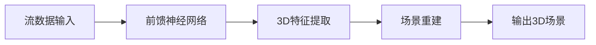

**技术特色**：
- 前馈神经网络架构，处理效率高
- 流数据实时处理能力
- 3D场景重建算法优化

#### 热度分析

- 项目获得8894颗星且持续增长(+189 today)，表明其在3D重建领域有较高关注度
- Fork数861，说明社区参与度较高，有较多二次开发尝试

#### 快速上手

```bash
# 克隆项目
git clone https://github.com/Robbyant/lingbot-map.git

# 安装依赖
cd lingbot-map
pip install -r requirements.txt
```

#### 注意事项

- 项目许可证未知，使用前需确认授权条款
- 缺少详细文档，可能需要参考代码和示例来理解使用方法


### 19. Mebus/cupp — 密码分析工具

> **一句话总结**：交互式密码分析工具，基于社会工程学原理生成常见用户密码字典

#### 价值主张

| 维度 | 说明 |
|------|------|
| **解决痛点** | 安全专业人员需要高效生成和分析常见用户密码模式，提升密码破解效率 |
| **目标用户** | 安全研究员、渗透测试人员、网络安全分析师 |
| **核心亮点** | 交互式密码生成 + 社会工程学支持 + 多种密码模式 + 可定制字典 + 跨平台 |

#### 技术架构

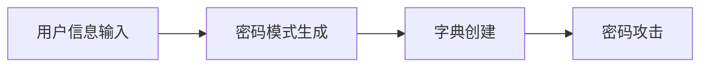

**技术特色**：
- 基于Python实现，跨平台兼容性好
- 支持交互式和批量两种操作模式
- 字典生成算法灵活可扩展
- 集成常见密码模式生成规则
- 轻量级设计，无需复杂依赖

#### 热度分析

- 项目获得6,115个星标且持续增长，表明在安全领域有稳定需求和认可
- 较高的Fork比例(约33%)反映用户积极参与项目定制和二次开发

#### 快速上手

```bash
# 克隆并运行CUPP
git clone https://github.com/Mebus/cupp.git
cd cupp
python cupp.py -i  # 交互式模式
```

#### 注意事项

- 仅用于授权的安全测试和密码学研究
- 使用时需遵守相关法律法规和道德准则
- 密码破解行为可能涉及隐私问题，确保获得合法授权


## 今日推荐

| 主题 | 推荐项目 | 亮点 |
|------|----------|------|
| 今日最热 | [msitarzewski/agency-agents](https://github.com/msitarzewski/agency-agents) | A complete AI age... |
| 值得关注 | [hasaneyldrm/exercises-dataset](https://github.com/hasaneyldrm/exercises-dataset) | A comprehensive d... |
| 快速上手 | [simplex-chat/simplex-chat](https://github.com/simplex-chat/simplex-chat) | SimpleX - the fir... |
| 长期潜力 | [xbtlin/ai-berkshire](https://github.com/xbtlin/ai-berkshire) | AI 时代的伯克希尔：基于 Cla... |

---

<div align="center">

*Generated on 2026-07-01 | Powered by GitHub Trending Reporter*

</div>