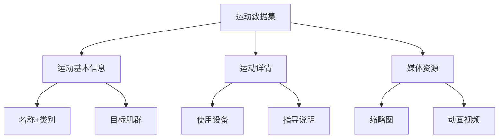
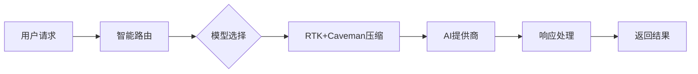
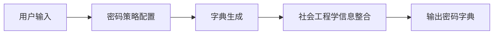
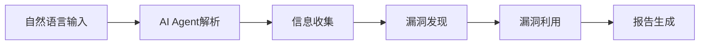
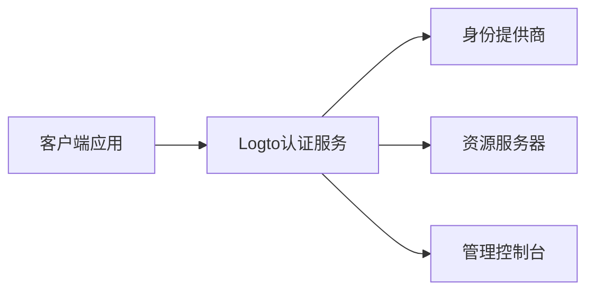
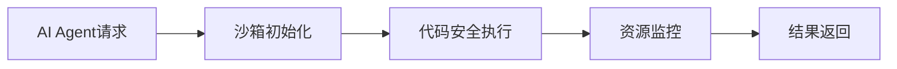

## 今日热点

今日GitHub热榜显示AI代理技术爆发式增长，安全工具与多模型集成成为焦点，AI应用正在向各领域深度渗透。

---

## 热门项目一览

| 排名 | 项目 | 语言 | 今日 | 总计 | 简介 |
|:---:|------|:----:|------:|-----:|------|
| 1 | [hasaneyldrm/exercises-dataset](https://github.com/hasaneyldrm/exercises-dataset) | HTML | +2,470 | 8,482 | A comprehensive dataset of ... |
| 2 | [msitarzewski/agency-agents](https://github.com/msitarzewski/agency-agents) | Shell | +2,114 | 123,629 | A complete AI agency at you... |
| 3 | [usestrix/strix](https://github.com/usestrix/strix) | Python | +1,211 | 29,840 | Open-source AI penetration ... |
| 4 | [microsoft/AI-For-Beginners](https://github.com/microsoft/AI-For-Beginners) | Jupyter Notebook | +1,096 | 50,524 | 12 Weeks, 24 Lessons, AI fo... |
| 5 | [diegosouzapw/OmniRoute](https://github.com/diegosouzapw/OmniRoute) | TypeScript | +1,010 | 9,598 | Never stop coding. Free AI ... |
| 6 | [facebook/astryx](https://github.com/facebook/astryx) | TypeScript | +708 | 2,718 | An open source design syste... |
| 7 | [HKUDS/Vibe-Trading](https://github.com/HKUDS/Vibe-Trading) | Python | +694 | 16,614 | "Vibe-Trading: Your Persona... |
| 8 | [browser-use/video-use](https://github.com/browser-use/video-use) | Python | +693 | 13,258 | Edit videos with coding agents |
| 9 | [ogulcancelik/herdr](https://github.com/ogulcancelik/herdr) | Rust | +609 | 9,648 | agent multiplexer that live... |
| 10 | [altic-dev/FluidVoice](https://github.com/altic-dev/FluidVoice) | Swift | +572 | 5,530 | Fastest and only macOS Dict... |
| 11 | [CoreBunch/Instatic](https://github.com/CoreBunch/Instatic) | TypeScript | +508 | 2,032 | Instatic is a modern self-h... |
| 12 | [allenai/olmocr](https://github.com/allenai/olmocr) | Python | +334 | 18,309 | Toolkit for linearizing PDF... |

---

## 趋势洞察

```
┌─────────────────────────────────────────────────────────────────┐
│  AI/ML 工具         ████████████████████████  17 个项目        │
│  其他               ████                      3 个项目        │
└─────────────────────────────────────────────────────────────────┘
```

---

## 项目深度解读

### 1. hasaneyldrm/exercises-dataset — 健身运动数据库

> **一句话总结**：全面的健身运动数据集，包含433种运动的详细信息，助力健身应用开发。

#### 价值主张

| 维度 | 说明 |
|------|------|
| **解决痛点** | 健身应用开发缺乏标准化、全面的运动数据资源 |
| **目标用户** | 健身应用开发者、健身教练、健康科技团队 |
| **核心亮点** | 433种完整运动数据 + 多维度信息分类 + 多媒体资源支持 |

#### 技术架构



**技术特色**：
- 结构化的HTML数据格式，便于解析和应用
- 多维度运动信息分类，满足不同场景需求
- 丰富的多媒体资源支持，提升用户体验

#### 热度分析

- 项目近期热度飙升，单日增长近2500星，表明健身科技领域需求旺盛
- 高fork率表明项目被广泛采用，已成为健身应用开发的重要参考资源

#### 快速上手

```bash
# 克隆项目
git clone https://github.com/hasaneyldrm/exercises-dataset.git

# 浏览数据目录
cd exercises-dataset
ls
```

#### 注意事项

- 数据格式需要根据应用需求进行适当解析和转换
- 注意检查许可证信息，确保符合商业使用要求
- 媒体资源可能需要额外处理或优化以适应不同平台


### 2. msitarzewski/agency-agents — AI智能体套件

> **一句话总结**：一站式提供多领域专业AI代理，每个代理具备独特个性和工作流程。

#### 价值主张

| 维度 | 说明 |
|------|------|
| **解决痛点** | 整合多领域AI专家，解决用户需要多种专业AI协助的切换成本问题 |
| **目标用户** | 开发者、内容创作者、营销人员及需要多领域AI支持的专业人士 |
| **核心亮点** | + 多专业领域AI代理集成 + 每个代理有独特个性与流程 + Shell脚本轻量实现 |

#### 技术架构


**技术特色**：
- 基于Shell脚本实现，轻量级且跨平台兼容
- 每个AI代理都有独特的工作流程和个性特征
- 通过命令行界面提供直观的交互体验

#### 热度分析

- 项目Star数超12万，单日增长超2000，显示极高的用户关注度和增长速度
- 作为AI工具领域的热门项目，填补了多专业AI代理集成的市场空白

#### 快速上手

```bash
# 克隆项目
git clone https://github.com/msitarzewski/agency-agents.git

# 进入目录并运行
cd agency-agents
./run.sh [代理名称] [任务描述]
```

#### 注意事项

- 项目使用Shell脚本，需要确保系统有适当的Shell环境支持
- 可能需要配置AI API密钥才能正常运行某些代理功能
- 由于项目没有明确的许可证，使用时需要注意版权和许可问题


### 3. usestrix/strix — AI安全测试工具

> **一句话总结**：基于AI的自动化渗透测试工具，帮助开发者主动发现并修复应用安全漏洞。

#### 价值主张

| 维度 | 说明 |
|------|------|
| **解决痛点** | 自动化检测应用安全漏洞，减少人工渗透测试成本 |
| **目标用户** | 安全研究人员、开发团队和DevOps工程师 |
| **核心亮点** | AI驱动漏洞检测 + 自动化渗透测试流程 + 详细修复建议 |

#### 技术架构


**技术特色**：
- 基于机器学习的漏洞识别算法
- 自动化渗透测试流程
- 详细的修复建议和风险评估

#### 热度分析

- 项目近期热度激增，单日新增超1200星，表明安全领域对AI工具需求旺盛
- 作为开源安全工具，在安全测试领域具有重要影响力，吸引了大量安全研究人员和开发者的关注

#### 快速上手

```bash
# 安装依赖
pip install -r requirements.txt

# 运行工具
strix --target https://example.com
```

#### 注意事项

- 注意遵守法律法规，仅对授权系统进行测试
- AI检测可能存在误报，需要人工验证
- 定期更新以获取最新的漏洞检测能力


### 4. microsoft/AI-For-Beginners — AI入门课程

> **一句话总结**：微软官方出品的12周系统化AI入门课程，通过24节课为初学者提供完整学习路径。

#### 价值主张

| 维度 | 说明 |
|------|------|
| **解决痛点** | AI初学者缺乏系统、结构化的学习路径，难以从零开始掌握AI基础知识 |
| **目标用户** | AI初学者、学生、希望转行AI领域的技术人员 |
| **核心亮点** | 结构化课程设计 + 微软官方出品 + 实践导向 + 24节完整课程 + 适合零基础学习 |

#### 技术架构


**技术特色**：
- Jupyter Notebook教学形式，提供交互式学习体验
- 结构化学习路径，每周有明确的学习目标
- 微软官方出品，内容权威可靠

#### 热度分析

- 项目获得超5万星，单日新增1000+，表明AI入门学习需求旺盛
- 作为微软官方教育项目，在AI学习领域具有重要影响力，社区活跃度高

#### 快速上手

```bash
# 克隆课程仓库
git clone https://github.com/microsoft/AI-For-Beginners.git

# 进入课程目录
cd AI-For-Beginners
```

#### 注意事项

- 需要一定的Python编程基础
- 某些章节可能需要GPU支持进行深度学习实验
- 课程内容可能会随着AI技术发展而更新，建议关注最新版本


### 5. diegosouzapw/OmniRoute — AI网关聚合

> **一句话总结**：免费AI网关聚合231+提供商，通过单一端点连接多种AI模型，大幅降低使用成本。

#### 价值主张

| 维度 | 说明 |
|------|------|
| **解决痛点** | 解决AI模型接入碎片化、成本高、管理复杂的问题 |
| **目标用户** | 开发者、AI应用用户、需要多模型切换的团队 |
| **核心亮点** | 单一端点接入231+AI提供商 + RTK+Caveman压缩节省15-95%token + 智能自动故障转移 |

#### 技术架构



**技术特色**：
- 多AI提供商统一接口与智能路由系统
- RTK+Caveman堆叠压缩技术大幅降低token消耗
- 支持MCP/A2A协议的多模态API处理
- 智能故障转移机制确保服务连续性
- 跨平台支持(Desktop/PWA)

#### 热度分析

- 项目Star数近万，单日增长过千，显示社区高度关注和认可
- 作为AI基础设施工具，在当前AI应用爆发期具有战略生态价值

#### 快速上手

```bash
# 克隆项目
git clone https://github.com/diegosouzapw/OmniRoute.git

# 安装依赖
npm install

# 启动服务
npm start
```

#### 注意事项

- 项目许可证信息不明确，使用前需确认开源许可条款
- 集成多种AI服务可能涉及不同API密钥管理和费用控制
- 压缩技术可能影响某些复杂AI模型的输出质量


### 6. facebook/astryx — 智能设计系统

> **一句话总结**：完全可定制的开源设计系统，具备AI代理集成能力，提升设计开发效率。

#### 价值主张

| 维度 | 说明 |
|------|------|
| **解决痛点** | 统一设计语言，减少重复开发，提升设计一致性 |
| **目标用户** | UI/UX设计师、前端开发团队、产品设计师 |
| **核心亮点** | 完全可定制 + AI代理集成 + 组件丰富 + 开源免费 + 易于集成 |

#### 技术架构


**技术特色**：
- 基于TypeScript构建，提供类型安全
- 组件化设计，支持高度定制
- 模块化架构，便于扩展和维护

#### 热度分析

- 项目近期增长迅猛，单日增加708个star，显示社区高度关注
- 虽然star数高但fork数相对较少，说明更多用户处于使用而非二次开发阶段

#### 快速上手

```bash
# 安装
npm install @facebook/astryx

# 引入组件
import { Button, Card, Modal } from '@facebook/astryx';

# 在项目中使用
const MyComponent = () => (
  <Card>
    <Button onClick={handleClick}>点击我</Button>
  </Card>
);
```

#### 注意事项

- 项目许可证信息不明确，使用前需确认开源协议
- 作为Facebook项目，可能需要关注潜在的API或架构变化
- 由于项目较新，文档和社区支持可能还在完善中


### 7. HKUDS/Vibe-Trading — 智能交易助手

> **一句话总结**：AI驱动的个人交易代理系统，自动化执行交易策略并提供市场分析。

#### 价值主张

| 维度 | 说明 |
|------|------|
| **解决痛点** | 简化交易流程，降低量化交易门槛，提高决策效率 |
| **目标用户** | 个人投资者、量化交易爱好者、金融科技开发者 |
| **核心亮点** | AI驱动决策 + 自动化交易执行 + 多市场支持 + 回测功能 + 风险管理 |

#### 技术架构


**技术特色**：
- 基于机器学习的市场预测与情绪分析
- 模块化设计支持多种交易策略实现
- 实时数据处理与执行引擎

#### 热度分析

- 近期Star增长迅猛，日均新增约700，表明项目热度持续攀升
- 在量化交易领域具有显著影响力，成为开源交易工具的标杆项目

#### 快速上手

```bash
# 克隆项目
git clone https://github.com/HKUDS/Vibe-Trading.git
cd Vibe-Trading

# 安装依赖
pip install -r requirements.txt

# 运行示例
python examples/basic_trading.py
```

#### 注意事项

- 需要具备一定的Python编程和金融知识才能充分利用项目功能
- 实盘交易前应在模拟环境中充分测试策略效果
- 注意遵守相关金融市场的法规和限制，谨慎使用自动交易系统


### 8. browser-use/video-use — AI视频编辑

> **一句话总结**：通过编程代理自动化视频编辑任务，实现代码驱动的视频处理流程

#### 价值主张

| 维度 | 说明 |
|------|------|
| **解决痛点** | 传统视频编辑工具操作复杂、效率低下的问题 |
| **目标用户** | 视频编辑开发者、自动化工作流需求者、内容创作者 |
| **核心亮点** | AI驱动的自动化编辑 + 代码控制 + 无需手动操作 + 跨平台兼容 |

#### 技术架构


**技术特色**：
- 基于AI的编程代理技术
- 自动化视频处理流程
- 代码驱动的编辑方式

#### 热度分析

- 项目获得13,258个星标，近期增长迅速(+693 today)，表明社区对该项目高度关注
- 零开放问题，说明项目维护良好，用户反馈得到及时处理

#### 快速上手

```bash
# 安装依赖
pip install browser-use

# 基本使用
python -m browser_use --input input.mp4 --edit "trim:00:01:00-00:02:00" --output output.mp4
```

#### 注意事项

- 需要确保Python环境兼容性
- 可能需要额外的视频处理库支持
- 编辑指令格式需要遵循项目规范


### 9. ogulcancelik/herdr — 终端代理管理器

> **一句话总结**：一个在终端中无缝管理多个代理连接的轻量级工具，简化代理切换流程。

#### 价值主张

| 维度 | 说明 |
|------|------|
| **解决痛点** | 终端中频繁切换代理配置的繁琐操作和配置管理困难 |
| **目标用户** | 需要管理多个代理服务的开发者和网络测试人员 |
| **核心亮点** | 多代理管理 + 快速切换 + 配置持久化 + 终端集成 + 跨平台支持 |

#### 技术架构


**技术特色**：
- 基于 Rust 构建，提供高性能和内存安全
- 异步处理架构，支持高并发代理连接
- 轻量级设计，资源占用低

#### 热度分析

- 项目近期增长迅速，单日新增星标600+，显示高关注度
- Fork 数量相对较少，表明用户更多是直接使用而非二次开发
- 无开放问题，表明项目成熟度高，用户反馈已充分解决

#### 快速上手

```bash
# 安装 herdr
cargo install herdr

# 配置代理
herdr add proxy1 http://proxy.example.com:8080
herdr add proxy2 socks5://proxy2.example.com:1080

# 切换代理
herdr use proxy1
herdr use proxy2

# 查看当前代理状态
herdr status
```

#### 注意事项

- 需要预先安装 Rust 环境
- 代理配置文件可能需要手动编辑以实现高级功能
- 不同操作系统下代理设置方式可能有所不同


### 10. altic-dev/FluidVoice — 本地语音转写

> **一句话总结**：基于设备端的快速听写应用，提供本地语音转写和AI增强功能，保护隐私且性能卓越。

#### 价值主张

| 维度 | 说明 |
|------|------|
| **解决痛点** | 解决云端听写延迟高、隐私泄露问题，提供本地快速语音转写 |
| **目标用户** | 注重隐私和效率的macOS用户，需要快速语音转写功能的专业人士 |
| **核心亮点** | 设备端STT + 自定义AI增强模型 + 快速响应 + 隐私保护 + 跨平台支持 |

#### 技术架构


**技术特色**：
- 基于设备端的语音识别技术，无需联网
- 自定义AI增强模型提升识别准确率
- Swift开发，充分利用macOS系统性能
- 本地处理保障用户隐私安全
- 轻量级设计，低资源占用

#### 热度分析

- 项目Star数达5530且单日增长572，显示社区高度关注和认可
- 作为本地语音转写替代方案，在隐私保护领域具有独特生态位置

#### 快速上手

```bash
# 克隆仓库
git clone https://github.com/altic-dev/FluidVoice.git

# 构建项目
cd FluidVoice && xcodebuild -project FluidVoice.xcodeproj -scheme FluidVoice -configuration Release build
```

#### 注意事项

- 项目目前仅支持macOS系统，其他平台版本尚未发布
- 许可证信息不明确，使用前需确认授权条款
- 自定义AI增强模型可能需要额外训练数据才能发挥最佳效果
- 语音识别效果可能受设备性能限制


### 11. CoreBunch/Instatic — [轻量级可视化CMS]

> **一句话总结**：一分钟部署的自托管可视化CMS，无需复杂配置即可创建和管理内容。

#### 价值主张

| 维度 | 说明 |
|------|------|
| **解决痛点** | 传统CMS配置复杂、部署困难，提供快速内容管理解决方案 |
| **目标用户** | 中小企业、个人开发者和非技术内容创作者 |
| **核心亮点** | 自托管可视化界面 + 一分钟快速部署 + 零配置启动 |

#### 技术架构


**技术特色**：
- 基于TypeScript开发，确保类型安全与代码质量
- 可视化编辑界面，降低内容创作技术门槛
- 静态生成技术，提供高性能与安全性

#### 热度分析

- 项目Star数激增，单日新增508个，显示社区高度关注与需求迫切
- Fork相对较少，表明项目处于早期阶段，社区贡献尚未形成规模

#### 快速上手

```bash
# 克隆仓库
git clone https://github.com/CoreBunch/Instatic.git
# 安装依赖
npm install
# 启动开发服务器
npm run dev
```

#### 注意事项

- 项目许可证未知，商业使用前需确认授权条款
- Open Issues为0，可能表明问题管理严格或社区参与度有限


### 12. allenai/olmocr — PDF线性化工具

> **一句话总结**：将复杂PDF文档转换为结构化文本，为大型语言模型训练提供高质量数据集的工具包。

#### 价值主张

| 维度 | 说明 |
|------|------|
| **解决痛点** | 解决PDF非结构化内容难以直接用于LLM训练的问题 |
| **目标用户** | 大型语言模型研究人员、数据科学家、AI工程师 |
| **核心亮点** | 高效PDF解析 + 保持原始布局 + 多种输出格式 + 批量处理能力 |

#### 技术架构


**技术特色**：
- 高效解析复杂PDF文档结构
- 保持原始文档的布局和语义信息
- 支持多种输出格式适配不同LLM需求

#### 热度分析

- 项目Star数超过1.8万，近期增长迅速，显示社区高度关注
- 作为AI领域的数据预处理工具，处于大型语言模型生态的重要位置

#### 快速上手

```bash
# 安装 olmocr
pip install olmocr

# 处理 PDF 文件
olmocr process input.pdf --output output.txt

# 批量处理多个 PDF
olmocr batch --input-dir pdfs/ --output-dir processed/
```

#### 注意事项

- 项目许可证信息不明确，使用前需确认授权条款
- 可能对某些特殊格式PDF的解析能力有限
- 处理大型PDF文件时可能需要较多内存资源


### 13. Mebus/cupp — 密码分析工具

> **一句话总结**：交互式密码字典生成器，助力安全专家进行渗透测试与密码强度评估。

#### 价值主张

| 维度 | 说明 |
|------|------|
| **解决痛点** | 解决手动生成密码字典效率低、覆盖不全的问题 |
| **目标用户** | 渗透测试人员、安全研究员、网络安全专家 |
| **核心亮点** | 交互式字典生成 + 社会工程学信息整合 + 多种密码策略支持 |

#### 技术架构



**技术特色**：
- 基于常见密码模式生成个性化字典
- 支持多种密码策略和自定义规则
- 整合社会工程学信息增强字典实用性

#### 热度分析

- 项目获得6,254个Star，表明在密码安全领域有较高认可度
- Fork数达到2,065，显示社区活跃，有较多二次开发和使用案例

#### 快速上手

```bash
# 克隆项目
git clone https://github.com/Mebus/cupp.git
# 运行工具
python cupp.py
```

#### 注意事项

- 本工具仅用于授权的安全测试和教育目的
- 使用时需遵守当地法律法规和道德准则
- 不要用于非法入侵或未授权的密码破解


### 14. 0xNyk/council-of-high-intelligence — AI决策助手

> **一句话总结**：通过18个模拟思想家人格，整合多LLM提供商能力，为复杂决策提供结构化多角度分析。

#### 价值主张

| 维度 | 说明 |
|------|------|
| **解决痛点** | 决策时缺乏多角度深度思考和跨领域专家观点 |
| **目标用户** | 需要做重要决策的专业人士、研究者和创新者 |
| **核心亮点** | 多AI人格模拟 + 多LLM集成 + 结构化讨论流程 + 哲学家思维 + 命令行操作 |

#### 技术架构


**技术特色**：
- 利用Shell脚本实现跨平台命令行工具
- 集成多个LLM提供商API确保模型多样性
- 模拟亚里士多德、费曼等18种思维模式

#### 热度分析

- 项目Star数达2665且持续增长(+161/天)，显示社区强烈需求
- Fork数相对较低(245)，表明项目主要作为工具使用而非二次开发

#### 快速上手

```bash
# 克隆仓库并安装
git clone https://github.com/0xNyk/council-of-high-intelligence.git
cd council-of-high-intelligence
chmod +x council
./council "你的复杂决策问题"
```

#### 注意事项

- 需要配置多个LLM提供商的API密钥
- 许可证未知，商业使用前需确认授权方式
- 可能需要一定的技术背景来处理API调用和结果解析


### 15. refactoringhq/tolaria — 知识库管理工具

> **一句话总结**：桌面端Markdown知识库管理应用，提供高效组织与快速检索功能

#### 价值主张

| 维度 | 说明 |
|------|------|
| **解决痛点** | 解决Markdown知识分散、难以系统管理和快速检索的问题 |
| **目标用户** | 需要系统化管理Markdown文档的知识工作者、研究人员 |
| **核心亮点** | 全文搜索 + 知识图谱可视化 + Markdown编辑增强 |

#### 技术架构


**技术特色**：
- 基于TypeScript构建，提供类型安全
- 桌面应用架构，跨平台兼容
- 专注于Markdown知识库的高效管理

#### 热度分析

- 项目获18,042星标，日增150，显示强劲用户兴趣与增长势头
- Fork数1,224，表明社区参与度高，项目有活跃贡献生态

#### 快速上手

```bash
# 克隆并运行Tolaria
git clone https://github.com/refactoringhq/tolaria
cd tolaria
npm install && npm run start
```

#### 注意事项

- 项目许可证未知，使用前需确认授权条款
- 作为桌面应用，可能需要一定的系统资源支持


### 16. Unclecheng-li/VulnClaw — AI渗透自动化

> **一句话总结**：基于AI Agent与渗透技能编排的自动化渗透测试工具，实现从自然语言输入到报告生成的全流程自动化。

#### 价值主张

| 维度 | 说明 |
|------|------|
| **解决痛点** | 传统渗透测试依赖专业知识，效率低下且流程繁琐，难以满足快速安全评估需求 |
| **目标用户** | 安全研究人员、渗透测试工程师、红队成员、企业安全团队 |
| **核心亮点** | 自然语言输入 + 全流程自动化 + AI辅助决策 + 技能编排 + 报告自动生成 |

#### 技术架构



**技术特色**：
- 整合AI Agent与MCP工具链实现智能决策
- 渗透测试技能编排与自动化执行
- 基于大语言模型的理解与生成能力
- 从输入到输出的全流程闭环设计

#### 热度分析

- 项目近期热度显著增长，单日新增Star数达132，显示社区对其高度关注
- 虽然Issues为0，但高Star与Fork比例表明项目处于活跃开发阶段，有良好的社区参与度

#### 快速上手

```bash
# 安装依赖
pip install -r requirements.txt

# 初始化配置
python setup.py init

# 启动渗透测试
python vulnclaw.py "对目标系统进行全面安全评估"
```

#### 注意事项

- 工具仅授权用于合法的安全测试，未经授权的系统测试可能违反法律
- AI生成的漏洞利用代码需谨慎使用，避免对目标系统造成不必要损害
- 项目依赖大语言模型API，可能需要相应的API密钥和费用


### 17. yikart/AiToEarn — AI赚钱工具

> **一句话总结**：利用AI技术创造多元收入，为用户提供智能化变现解决方案。

#### 价值主张

| 维度 | 说明 |
|------|------|
| **解决痛点** | 将AI能力转化为实际收益，降低技术应用变现门槛 |
| **目标用户** | 开发者、内容创作者、AI爱好者、自由职业者 |
| **核心亮点** | 多场景AI应用 + 自动化收益流程 + 实时数据分析 + 低代码接入 |

#### 技术架构


**技术特色**：
- TypeScript全栈开发，确保类型安全与代码质量
- 模块化AI服务架构，支持多种第三方AI模型接入
- 智能化收益分析系统，实时优化盈利策略

#### 热度分析

- 项目Star数快速增长，日均新增约116个Star，显示社区高度关注
- Fork数达3406，表明项目具有较高实用价值和二次开发潜力
- Issues数为0，可能表示项目维护良好或问题解决高效

#### 快速上手

```bash
# 克隆项目
git clone https://github.com/yikart/AiToEarn.git

# 安装依赖
cd AiToEarn
npm install

# 启动项目
npm run start
```

#### 注意事项

- 项目许可证未知，商业使用前需确认授权条款
- 可能需要API密钥或订阅服务才能使用部分AI功能
- 收入效果可能因使用场景和市场条件而异，需合理预期


### 18. logto-io/logto — 身份认证平台

> **一句话总结**：基于开放标准的现代化认证授权解决方案，专为SaaS和AI应用设计。

#### 价值主张

| 维度 | 说明 |
|------|------|
| **解决痛点** | 解决SaaS和AI应用安全认证和权限管理的复杂性问题 |
| **目标用户** | SaaS开发者、AI应用构建者、企业IT架构师 |
| **核心亮点** | 基于OIDC和OAuth 2.1标准 + 多租户支持 + 单点登录(SSO) + 基于角色的访问控制(RBAC) + 开源可定制 |

#### 技术架构



**技术特色**：
- 基于开放标准OIDC和OAuth 2.1构建
- 支持多租户架构设计
- 提供完整的RBAC权限控制
- 开源可定制的认证解决方案
- 专为现代SaaS和AI应用优化

#### 热度分析

- 项目Star数超过13,000，且每日新增113个Star，表明项目正快速增长，受到开发者高度关注。
- 作为开源认证解决方案，在同类项目中具有较强竞争力，社区活跃度较高。

#### 快速上手

```bash
# 克隆项目并安装依赖
git clone https://github.com/logto-io/logto.git
cd logto && npm install
# 启动开发服务器
npm run dev
```

#### 注意事项

- 项目许可证信息未知，使用前需确认授权条款
- 作为认证基础设施，部署时需特别注意安全性配置


### 19. TencentCloud/CubeSandbox — AI安全沙箱

> **一句话总结**：腾讯云打造的即时并发安全轻量级AI代理沙箱环境，保障AI应用安全运行。

#### 价值主张

| 维度 | 说明 |
|------|------|
| **解决痛点** | 解决AI Agent运行时安全隔离问题，防止恶意代码破坏系统 |
| **目标用户** | AI应用开发者和需要安全部署AI的企业 |
| **核心亮点** | 即时启动 + 高并发支持 + 安全隔离 + 轻量级资源占用 |

#### 技术架构



**技术特色**：
- 基于Rust内存安全模型，防止内存泄漏和缓冲区溢出
- 采用容器化技术实现资源隔离和限制
- 支持多实例并发执行，提高资源利用率

#### 热度分析

- 项目获得6822个星标，近期增长较快(+79 today)，表明社区对该项目有较高关注度
- 0个开放问题表明项目维护良好，腾讯云背景增强了其在AI安全领域的可信度

#### 快速上手

```bash
# 克隆项目
git clone https://github.com/TencentCloud/CubeSandbox.git
# 运行示例
cargo run --example ai_agent_sandbox
```

#### 注意事项

- 需要Rust环境支持
- 注意资源限制配置，避免沙箱占用过多系统资源
- 可能需要额外配置才能支持特定的AI模型或框架


### 20. togatoga/karukan — 日语神经输入法

> **一句话总结**：基于神经网络的日语输入法系统，提供Linux和macOS平台的高效假名-汉字转换功能。

#### 价值主张

| 维度 | 说明 |
|------|------|
| **解决痛点** | 传统日语输入法转换准确率低，难以理解上下文语义 |
| **目标用户** | 需要日语输入的Linux/macOS开发者及日语使用者 |
| **核心亮点** | 神经网络转换引擎 + 跨平台支持 + 开源可定制 |

#### 技术架构


**技术特色**：
- 采用神经网络模型提升假名-汉字转换准确率
- 实现轻量级架构，适合资源受限环境
- 支持自定义词典和用户习惯学习

#### 热度分析

- 项目star数增长迅速，近期新增42个star，表明社区关注度提升
- 作为开源输入法项目，填补了Linux/macOS平台日语输入法的空白

#### 快速上手

```bash
# 克隆仓库
git clone https://github.com/togatoga/karukan.git
# 构建项目
cd karukan && cargo build --release
# 安装到系统
sudo make install
```

#### 注意事项

- 项目许可证信息不明确，商业使用前需确认授权条款
- 作为系统级输入法，可能需要root权限安装
- 神经网络模型可能需要大量训练数据才能达到最佳效果


## 今日推荐

| 主题 | 推荐项目 | 亮点 |
|------|----------|------|
| 今日最热 | [hasaneyldrm/exercises-dataset](https://github.com/hasaneyldrm/exercises-dataset) | A comprehensive d... |
| 值得关注 | [msitarzewski/agency-agents](https://github.com/msitarzewski/agency-agents) | A complete AI age... |
| 快速上手 | [usestrix/strix](https://github.com/usestrix/strix) | Open-source AI pe... |
| 长期潜力 | [microsoft/AI-For-Beginners](https://github.com/microsoft/AI-For-Beginners) | 12 Weeks, 24 Less... |

---

<div align="center">

*Generated on 2026-07-02 | Powered by GitHub Trending Reporter*

</div>