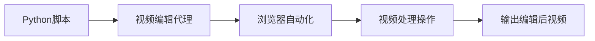
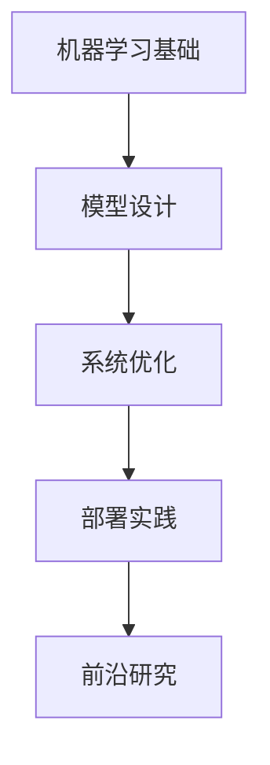
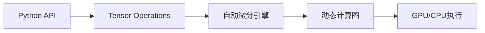
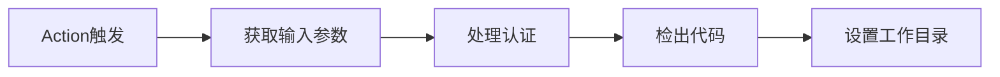

## 今日热点

AI代理与智能体技术持续火热，各类专业化AI工具在各垂直领域快速涌现，从安全测试到求职交易，AI正加速赋能千行百业。

---

## 热门项目一览

| 排名 | 项目 | 语言 | 今日 | 总计 | 简介 |
|:---:|------|:----:|------:|-----:|------|
| 1 | [msitarzewski/agency-agents](https://github.com/msitarzewski/agency-agents) | Shell | +3,032 | 125,571 | A complete AI agency at you... |
| 2 | [usestrix/strix](https://github.com/usestrix/strix) | Python | +2,137 | 32,352 | Open-source AI penetration ... |
| 3 | [HKUDS/Vibe-Trading](https://github.com/HKUDS/Vibe-Trading) | Python | +939 | 17,371 | "Vibe-Trading: Your Persona... |
| 4 | [hasaneyldrm/exercises-dataset](https://github.com/hasaneyldrm/exercises-dataset) | HTML | +938 | 9,297 | A comprehensive dataset of ... |
| 5 | [JuliusBrussee/caveman](https://github.com/JuliusBrussee/caveman) | JavaScript | +926 | 81,069 | 🪨 why use many token when f... |
| 6 | [obra/superpowers](https://github.com/obra/superpowers) | Shell | +897 | 244,490 | An agentic skills framework... |
| 7 | [browser-use/video-use](https://github.com/browser-use/video-use) | Python | +554 | 13,837 | Edit videos with coding agents |
| 8 | [affaan-m/ECC](https://github.com/affaan-m/ECC) | JavaScript | +486 | 225,221 | The agent harness performan... |
| 9 | [santifer/career-ops](https://github.com/santifer/career-ops) | JavaScript | +372 | 57,881 | AI-powered job search syste... |
| 10 | [openai/codex-plugin-cc](https://github.com/openai/codex-plugin-cc) | JavaScript | +352 | 22,660 | Use Codex from Claude Code ... |
| 11 | [langflow-ai/langflow](https://github.com/langflow-ai/langflow) | Python | +117 | 150,767 | Langflow is a powerful tool... |
| 12 | [ChromeDevTools/chrome-devtools-mcp](https://github.com/ChromeDevTools/chrome-devtools-mcp) | TypeScript | +104 | 45,108 | Chrome DevTools for coding ... |

---

## 趋势洞察

```
┌─────────────────────────────────────────────────────────────────┐
│  AI/ML 工具         ████████████████████████  15 个项目        │
│  其他               ███                       2 个项目        │
└─────────────────────────────────────────────────────────────────┘
```

---

## 项目深度解读

### 1. msitarzewski/agency-agents — AI助手集合

> **一句话总结**：提供多种专业AI代理，覆盖前端、社区管理等领域，各具个性与专长。

#### 价值主张

| 维度 | 说明 |
|------|------|
| **解决痛点** | 提供即时可用的专业AI助手，无需复杂配置 |
| **目标用户** | 需要快速获取专业AI支持的开发者和内容创作者 |
| **核心亮点** | 多样化专业领域 + 个性化交互 + 即用型脚本 |

#### 技术架构


**技术特色**：
- 基于Shell的轻量级实现，便于部署和扩展
- 模块化设计，每个代理独立功能
- 命令行交互，简洁高效

#### 热度分析

- 高关注度项目，Star数超12万，近期增长迅速
- 社区活跃度高，Fork数量可观，表明项目实用性强

#### 快速上手

```bash
# 克隆仓库
git clone https://github.com/msitarzewski/agency-agents.git
# 进入目录
cd agency-agents
# 运行某个代理，例如前端助手
./frontend-wizard.sh
```

#### 注意事项

- 需要确保系统支持Shell脚本执行
- 可能需要额外的AI服务API密钥
- 每个代理可能有不同的依赖和配置要求


### 2. usestrix/strix — AI安全测试

> **一句话总结**：基于AI的开源渗透测试工具，自动发现并修复应用程序安全漏洞。

#### 价值主张

| 维度 | 说明 |
|------|------|
| **解决痛点** | 自动化应用程序安全漏洞检测，降低人工渗透测试成本 |
| **目标用户** | 开发者、安全研究员、DevOps团队 |
| **核心亮点** | AI驱动自动化测试 + 漏洞修复建议 + 多平台支持 |

#### 技术架构


**技术特色**：
- 利用机器学习模型识别复杂安全漏洞
- 支持多种编程语言和框架的静态分析
- 集成CI/CD流水线实现自动化安全测试

#### 热度分析

- 项目Star数超过3.2万，近期单日增长2000+，显示强烈市场关注度
- 零开放Issue表明项目维护良好，用户反馈问题及时解决

#### 快速上手

```bash
# 安装strix
pip install strix

# 扫描应用程序
strix scan --app /path/to/your/app

# 生成报告
strix report --format pdf
```

#### 注意事项

- 使用前需确保获得被测试应用程序的授权
- AI检测可能存在误报，需要人工验证结果
- 定期更新工具以获取最新的漏洞检测能力


### 3. HKUDS/Vibe-Trading — 智能交易代理

> **一句话总结**：基于AI的个人交易代理系统，提供自动化交易决策与执行能力。

#### 价值主张

| 维度 | 说明 |
|------|------|
| **解决痛点** | 个人交易缺乏专业指导和自动化执行能力 |
| **目标用户** | 个人投资者、交易爱好者、量化交易初学者 |
| **核心亮点** | AI驱动决策 + 自动化交易 + 风险控制 + 实时市场分析 |

#### 技术架构


**技术特色**：
- 基于AI的智能交易决策系统
- 实时市场数据分析与处理
- 用户友好的交易界面与控制面板

#### 热度分析

- 项目获得超过17k星标，近期增长迅速，表明在交易社区中备受关注
- 零开放Issues可能反映项目成熟度高或问题处理机制完善

#### 快速上手

```bash
# 克隆项目
git clone https://github.com/HKUDS/Vibe-Trading.git
cd Vibe-Trading

# 安装依赖
pip install -r requirements.txt

# 运行项目
python main.py
```

#### 注意事项

- 需了解项目的具体使用场景和适用市场
- 注意交易风险，尤其是自动化交易系统可能导致的风险
- 确保遵守相关金融法规和平台政策


### 4. hasaneyldrm/exercises-dataset — 健身数据集

> **一句话总结**：提供433种健身运动的完整数据集，包含名称、类别、肌群、设备、说明及视觉资源。

#### 价值主张

| 维度 | 说明 |
|------|------|
| **解决痛点** | 解决健身应用开发中数据获取难、标准不统一的问题 |
| **目标用户** | 健身应用开发者、健身教练、健康科技从业者 |
| **核心亮点** | 数据维度完整 + 包含视觉资源 + 分类清晰 + 结构化JSON + 免费可用 |

#### 技术架构


**技术特色**：
- 数据结构完整，包含7种关键信息维度
- 采用JSON格式提供标准化数据接口
- 包含视觉资源增强用户体验，降低开发成本

#### 热度分析
- 项目近期热度显著，单日新增Star近千，表明健身科技领域需求旺盛
- 高Fork比例(11.2%)显示社区活跃度高，数据集被广泛复用和定制

#### 快速上手

```bash
# 克隆项目
git clone https://github.com/hasaneyldrm/exercises-dataset.git

# 访问数据目录
cd exercises-dataset && ls exercises/
```

#### 注意事项
- 项目许可证未知，商业使用前需确认授权方式
- 数据更新频率不明确，可能需要自行维护和更新
- 图片和视频资源托管在第三方平台，需确保长期可用性


### 5. JuliusBrussee/caveman — Claude token 优化

> **一句话总结**：通过简化语言表达减少 Claude AI 编程交互65%的 token 使用量。

#### 价值主张

| 维度 | 说明 |
|------|------|
| **解决痛点** | 减少 Claude AI 编程交互中的 token 消耗，降低 API 调用成本 |
| **目标用户** | Claude AI 开发者和高频使用 AI 编程辅助的用户 |
| **核心亮点** | 简化语言策略 + 保持代码质量 + 显著降低token消耗 |

#### 技术架构


**技术特色**：
- 采用特定句式结构减少冗余表达
- 保留关键编程指令和逻辑关系
- 针对 Claude AI 训练数据特点优化表达方式

#### 热度分析

- 项目获得8万+星且持续增长，显示AI工具市场对降低token成本的需求强烈
- 在AI编程辅助领域具有独特价值主张，解决了用户实际痛点

#### 快速上手

```bash
# 在Claude对话中使用简化表达
"写函数 排序 数字列表"
"帮我 实现一个 计算斐波那契数列的 函数"
```

#### 注意事项

- 简化表达可能需要适应期，初期可能影响代码质量
- 不同复杂度的编程任务可能需要不同程度的简化
- 建议在非关键项目中先行测试效果


### 6. obra/superpowers — 智能开发框架

> **一句话总结**：结合智能体技能框架与实用方法论，提升软件开发效率和质量。

#### 价值主张

| 维度 | 说明 |
|------|------|
| **解决痛点** | 传统软件开发流程缺乏智能支持和系统化方法 |
| **目标用户** | 软件开发者、技术团队和项目管理专业人员 |
| **核心亮点** | 智能体框架 + 实用方法论 + 高效开发流程 + 可扩展架构 + 实战验证 |

#### 技术架构


**技术特色**：
- 基于Shell的轻量级实现，跨平台兼容
- 模块化设计，支持自定义扩展
- 自动化工作流程，减少手动干预

#### 热度分析

- 高星项目持续增长，每日新增近900 stars，表明开发者认可度极高
- 相对较低的Fork比例，显示项目更倾向于直接使用而非二次开发

#### 快速上手

```bash
# 克隆项目
git clone https://github.com/obra/superpowers.git
# 进入目录
cd superpowers
# 查看使用指南
cat README.md
```

#### 注意事项

- 项目文档可能需要进一步补充，特别是对于初次使用者
- 建议在使用前熟悉Shell脚本基础，以便更好地理解和使用框架功能
- 由于项目采用未知许可证，商业使用前需确认授权条款


### 7. browser-use/video-use — 视频编辑自动化

> **一句话总结**：通过编程代理实现自动化视频编辑，提升内容创作效率与批量处理能力

#### 价值主张

| 维度 | 说明 |
|------|------|
| **解决痛点** | 传统视频编辑手动操作繁琐，难以实现批量处理和复杂流程自动化 |
| **目标用户** | 视频内容创作者、开发者、自动化工具爱好者 |
| **核心亮点** | 编程代理控制 + 浏览器自动化 + 批量处理能力 + 代码化操作流程 |

#### 技术架构



**技术特色**：
- 利用Python编程代理控制视频编辑流程
- 结合浏览器自动化技术实现视频操作
- 支持多种视频格式和处理方式的可扩展架构

#### 热度分析

- 项目获得13,837个Star且单日增长554，正处于快速增长期，社区高度关注
- 1,695个Fork显示项目具有较高可扩展性和二次开发价值

#### 快速上手

```bash
# 克隆项目
git clone https://github.com/browser-use/video-use.git

# 安装依赖
pip install -r requirements.txt

# 基本使用
python video_use.py --input input.mp4 --output output.mp4 --operations crop,resize
```

#### 注意事项

- 项目需要一定的编程知识才能有效使用
- 可能需要安装额外的视频处理依赖
- 具体使用方法需参考项目文档
- 由于License信息未知，使用时需注意授权问题


### 8. affaan-m/ECC — AI代码优化系统

> **一句话总结**：为多个AI代码工具提供性能优化，增强技能、记忆和安全性的代理系统。

#### 价值主张

| 维度 | 说明 |
|------|------|
| **解决痛点** | 提升AI代码工具的性能和安全性，优化代理系统效率 |
| **目标用户** | 使用AI辅助编程的开发者和相关工具开发者 |
| **核心亮点** | 技能增强 + 本能优化 + 记忆管理 + 安全保障 + 研究优先开发 |

#### 技术架构


**技术特色**：
- 多AI工具集成支持架构
- 智能性能优化算法
- 安全增强机制

#### 热度分析

- 高Star数(22.5万+)表明项目受到广泛关注，日增486显示持续增长趋势
- Fork数(3.4万+)显示开发者社区活跃度高，可能是AI辅助编程领域的重要项目

#### 快速上手

```bash
# 克隆项目
git clone https://github.com/affaan-m/ECC.git

# 安装依赖
npm install
```

#### 注意事项

- 项目许可证未知，使用前需确认授权条款
- 项目详情有限，可能需要查看源码了解具体使用方法
- 项目似乎专注于优化现有AI代码工具，而非替代它们


### 9. santifer/career-ops — AI求职助手

> **一句话总结**：基于Claude Code的AI驱动求职系统，提供多技能模式与批量处理功能。

#### 价值主张

| 维度 | 说明 |
|------|------|
| **解决痛点** | 传统求职流程繁琐，缺乏AI辅助与批量处理能力 |
| **目标用户** | 求职者、HR专业人士、招聘团队 |
| **核心亮点** | 14种技能模式 + Go仪表板 + PDF生成 + 批量处理 |

#### 技术架构


**技术特色**：
- Claude Code深度集成，提供专业AI求职辅助
- Go语言构建高性能仪表板，提升用户体验
- 多模式技能适配不同行业与职位需求

#### 热度分析

- 项目获57,881星标，单日增长372，表明求职AI工具需求旺盛
- Fork数达11,394，社区活跃度高，二次开发与定制化需求显著

#### 快速上手

```bash
# 克隆仓库
git clone https://github.com/santifer/career-ops.git

# 安装依赖
npm install

# 启动应用
npm start
```

#### 注意事项

- 项目许可证未知，商业使用前需确认授权条款
- 依赖Claude API，需配置有效的API密钥
- 项目无开放问题，建议通过社区渠道获取支持


### 10. openai/codex-plugin-cc — AI代码助手

> **一句话总结**：将OpenAI Codex集成到Claude Code，实现智能代码审查与任务管理。

#### 价值主张

| 维度 | 说明 |
|------|------|
| **解决痛点** | 传统代码审查效率低，难以全面覆盖代码质量与安全问题 |
| **目标用户** | 开发团队、代码审查者、项目经理、DevOps工程师 |
| **核心亮点** | AI辅助代码审查 + 智能任务分配 + 多语言支持 |

#### 技术架构


**技术特色**：
- 利用OpenAI Codex进行深度代码语义分析
- 支持多编程语言的理解与审查
- 提供智能任务生成与分配系统

#### 热度分析

- 项目Star数达22,660且持续增长，显示开发者对AI辅助工具的强烈需求
- 作为OpenAI生态项目，在AI辅助开发领域具有重要影响力

#### 快速上手

```bash
# 安装插件
npm install -g codex-plugin-cc

# 配置API密钥
codex-plugin-cc config --api-key YOUR_API_KEY

# 审查代码
codex-plugin-cc review /path/to/project
```

#### 注意事项

- 需有效的OpenAI API密钥才能使用
- 注意代码隐私，避免提交敏感信息
- 定期更新插件以获取最新功能


### 11. langflow-ai/langflow — AI工作流构建器

> **一句话总结**：低代码平台，可视化构建AI代理和工作流，简化AI应用开发与部署流程。

#### 价值主张

| 维度 | 说明 |
|------|------|
| **解决痛点** | 降低AI应用开发门槛，简化复杂工作流构建 |
| **目标用户** | AI开发者、研究人员和需要快速构建AI应用的业务团队 |
| **核心亮点** | 可视化界面 + 拖拽式构建 + AI组件库 + 快速部署 |

#### 技术架构


**技术特色**：
- 可视化拖拽式工作流设计
- 模块化AI组件架构
- 低代码AI应用开发框架

#### 热度分析

- 项目Star数超15万，增长迅速，日均新增百余Star，Fork近万，表明项目热度高且持续增长
- 作为AI工作流构建工具，位于AI开发工具生态的重要位置，社区活跃度高

#### 快速上手

```bash
# 安装
pip install langflow

# 初始化
langflow init

# 运行
langflow run
```

#### 注意事项

- 项目可能需要一定的AI和机器学习基础知识
- 部署AI模型可能需要额外的计算资源
- 许可证信息不明确，使用前需确认


### 12. ChromeDevTools/chrome-devtools-mcp — 浏览器调试代理

> **一句话总结**：为AI代码智能体提供完整的浏览器调试能力，实现自动化测试与交互。

#### 价值主张

| 维度 | 说明 |
|------|------|
| **解决痛点** | 为AI代码助手提供浏览器环境交互能力，解决自动化测试与调试难题 |
| **目标用户** | AI代码助手开发者、自动化测试工程师、前端工具链开发者 |
| **核心亮点** | + 完整Chrome DevTools API支持 + 智能体环境集成 + 自动化交互能力 + TypeScript类型安全 |

#### 技术架构


**技术特色**：
- 基于Chrome DevTools Protocol构建，提供完整浏览器控制能力
- 通过MCP(Model Context Protocol)实现与AI系统的无缝集成
- 提供TypeScript类型定义，确保开发体验与代码质量
- 支持自动化测试场景下的浏览器交互与数据采集

#### 热度分析

- 项目获得45k+星标并持续增长，表明开发者社区高度认可其价值
- 作为Chrome官方项目，拥有强大的社区支持和持续更新保障

#### 快速上手

```bash
# 安装依赖
npm install chrome-devtools-mcp

# 初始化项目配置
npx chrome-devtools-mcp init

# 启动开发服务器
npm start
```

#### 注意事项

- 需要Node.js环境支持，建议使用最新LTS版本
- 部分高级功能可能需要特定版本的Chrome浏览器
- API接口可能随Chrome版本更新而变化，建议关注更新日志


### 13. agentskills/agentskills — AI Agent技能规范

> **一句话总结**：定义和标准化AI Agent的技能体系，为智能体交互提供统一规范。

#### 价值主张

| 维度 | 说明 |
|------|------|
| **解决痛点** | Agent技能缺乏统一标准，导致智能体间协作困难 |
| **目标用户** | AI开发者、智能体架构师和系统集成工程师 |
| **核心亮点** | 标准化技能定义框架 + 跨平台技能互操作性 + 技能评估标准 |

#### 技术架构


**技术特色**：
- 采用YAML格式定义技能接口，易于理解和扩展
- 支持异步技能调用，提高系统响应效率
- 提供技能版本控制机制，确保向后兼容性

#### 热度分析

- 项目获得超过2万Stars，近86日新增，表明AI Agent领域技能标准化需求旺盛
- 零开放Issues反映项目维护良好，社区问题解决效率高

#### 快速上手

```bash
# 克隆项目
git clone https://github.com/agentskills/agentskills.git

# 查看文档
cd agentskills && cat README.md
```

#### 注意事项

- 项目文档可能需要进一步补充，特别是具体实现细节
- 许可证信息不明确，使用时需注意版权问题


### 14. harvard-edge/cs249r_book — 机器学习系统教材

> **一句话总结**：哈佛大学机器学习系统课程教材，深入探讨ML系统设计与实现的核心原理。

#### 价值主张

| 维度 | 说明 |
|------|------|
| **解决痛点** | 提供系统化机器学习知识体系，弥补理论与工程实践间的鸿沟 |
| **目标用户** | 机器学习研究者、工程师、计算机科学专业学生 |
| **核心亮点** | 学术深度+工程实践+前沿案例+数学严谨性+系统思维 |

#### 技术架构



**技术特色**：
- 结合理论与工程实践，强调可落地的系统设计
- 涵盖从基础模型到大规模部署的全流程知识
- 提供丰富的数学推导和算法实现细节

#### 热度分析

- 高Star数和稳定增长表明该项目在机器学习教育领域具有重要影响力
- 作为学术教材项目，社区贡献可能以内容改进和讨论为主

#### 快速上手

```bash
# 克隆项目到本地
git clone https://github.com/harvard-edge/cs249r_book.git

# 使用Jupyter Notebook阅读教材内容
cd cs249r_book/notebooks
jupyter notebook
```

#### 注意事项

- 项目采用未知许可证，使用前需确认授权条款
- 内容可能需要一定的数学和机器学习基础
- 部分章节可能需要额外的依赖库才能运行示例代码


### 15. pytorch/pytorch — 动态深度框架

> **一句话总结**：PyTorch提供Python中的张量和动态神经网络，拥有强大GPU加速，是学术界和工业界广泛使用的深度学习平台。

#### 价值主张

| 维度 | 说明 |
|------|------|
| **解决痛点** | 解决深度学习开发中灵活性、易用性和性能平衡的问题 |
| **目标用户** | 研究人员、数据科学家、深度学习工程师和AI开发者 |
| **核心亮点** | 动态计算图+直观Python API+强大GPU加速+丰富生态系统+社区活跃 |

#### 技术架构



**技术特色**：
- 基于动态计算图，提供灵活的模型定义和调试能力
- 强大的张量操作和GPU加速，提供接近原生性能
- 丰富的神经网络模块和预训练模型库

#### 热度分析

- 高Star数(101,242)和持续增长(+65 today)，表明项目在深度学习领域具有重要地位
- 活跃的社区贡献和广泛的工业应用，已成为深度学习领域的主流框架之一

#### 快速上手

```bash
# 安装PyTorch
pip install torch torchvision

# 创建一个简单的神经网络
import torch
import torch.nn as nn

model = nn.Sequential(
    nn.Linear(10, 5),
    nn.ReLU(),
    nn.Linear(5, 1)
)
```

#### 注意事项

- PyTorch版本更新较快，API可能会有变化，需要注意版本兼容性
- 大规模生产部署时可能需要考虑优化和稳定性措施


### 16. ryanmcdermott/clean-code-javascript — JavaScript代码整洁指南

> **一句话总结**：将Clean Code原则应用于JavaScript编程，提供实用的代码规范和最佳实践。

#### 价值主张

| 维度 | 说明 |
|------|------|
| **解决痛点** | JavaScript开发者缺乏系统性的代码整洁性指导，导致代码难以维护 |
| **目标用户** | JavaScript开发者、前端工程师、全栈开发人员 |
| **核心亮点** | 实用示例 + 语言特性适配 + 常见反模式警示 |

#### 技术架构

**技术特色**：
- 基于经典Clean Code原则，针对JavaScript特性进行适配
- 提供大量代码对比示例，直观展示整洁与混乱代码的区别
- 覆盖变量、函数、对象、异步编程等多个JavaScript关键领域

#### 热度分析

- 项目获得近10万星，表明JavaScript社区对代码质量的高度重视
- 0个开放问题反映了项目内容成熟稳定，社区贡献主要体现为文档完善

#### 快速上手

```bash
# 克隆项目
git clone https://github.com/ryanmcdermott/clean-code-javascript.git
# 浏览目录结构
cd clean-code-javascript && ls -l
# 查看特定章节内容
cat README.md
```

#### 注意事项

- 本项目主要提供指导原则，而非强制规范，应根据团队实际情况灵活应用
- 随着JavaScript语言发展，部分建议可能需要更新，建议关注项目最新版本


### 17. actions/checkout — 代码检出工具

> **一句话总结**：GitHub官方推出的代码检出Action，支持多种仓库类型和深度自定义配置。

#### 价值主张

| 维度 | 说明 |
|------|------|
| **解决痛点** | 解决GitHub Actions中获取代码仓库内容的核心需求 |
| **目标用户** | CI/CD流程开发者、自动化测试工程师 |
| **核心亮点** | 多仓库支持 + 深度配置选项 + 稳定性高 + 与GitHub生态无缝集成 |

#### 技术架构



**技术特色**：
- 使用TypeScript编写，类型安全且易于维护
- 支持SSH、Personal Access Token等多种认证方式
- 提供丰富的配置选项，如深度检出、子模块处理等

#### 热度分析

- 作为GitHub官方维护的工具，拥有稳定的高星增长，显示其在CI/CD领域的核心地位
- 作为GitHub Actions生态的关键组件，几乎所有CI流程都会依赖此工具

#### 快速上手

```bash
name: Example workflow
on: [push]
jobs:
  build:
    runs-on: ubuntu-latest
    steps:
    - name: Checkout repository
      uses: actions/checkout@v3
```

#### 注意事项

- 注意使用正确的版本号，建议定期更新以获取最新功能和修复
- 处理私有仓库时需要正确配置认证信息，可以使用GitHub token或SSH密钥
- 在处理大型仓库时，可以使用`fetch-depth`参数控制检出深度以提高性能


## 今日推荐

| 主题 | 推荐项目 | 亮点 |
|------|----------|------|
| 今日最热 | [msitarzewski/agency-agents](https://github.com/msitarzewski/agency-agents) | A complete AI age... |
| 值得关注 | [usestrix/strix](https://github.com/usestrix/strix) | Open-source AI pe... |
| 快速上手 | [HKUDS/Vibe-Trading](https://github.com/HKUDS/Vibe-Trading) | "Vibe-Trading: Yo... |
| 长期潜力 | [hasaneyldrm/exercises-dataset](https://github.com/hasaneyldrm/exercises-dataset) | A comprehensive d... |

---

<div align="center">

*Generated on 2026-07-03 | Powered by GitHub Trending Reporter*

</div>