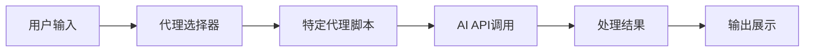
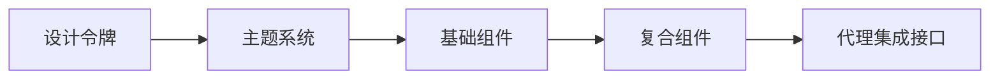
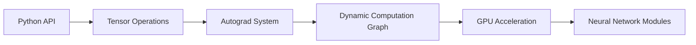
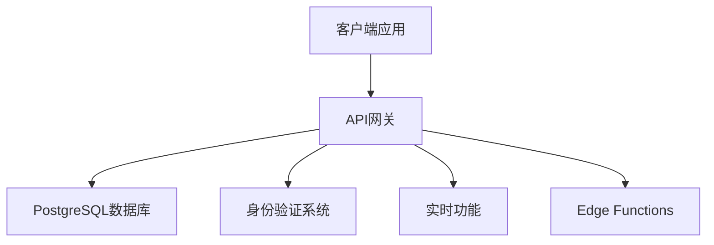
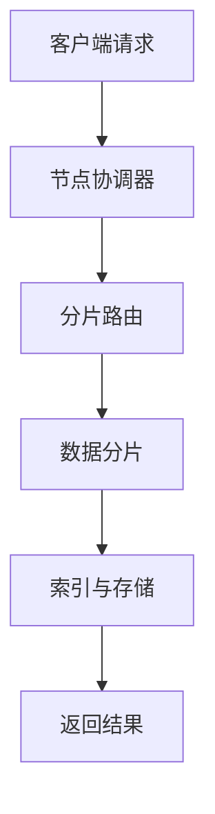
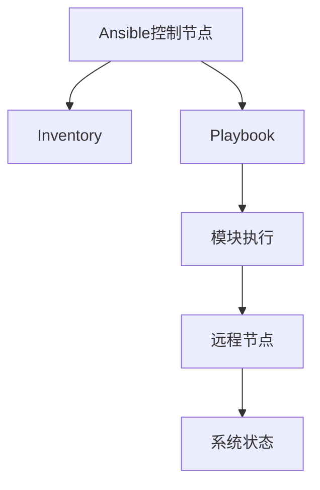
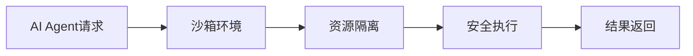
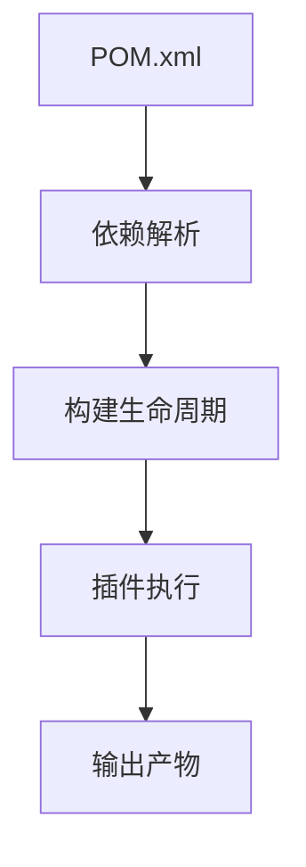

## 今日热点

AI代理工具与自动化开发平台引领今日热榜，Claude Code、Superpowers等项目展现AI赋能开发的新趋势，同时AI安全工具也获得高度关注。

---

## 热门项目一览

| 排名 | 项目 | 语言 | 今日 | 总计 | 简介 |
|:---:|------|:----:|------:|-----:|------|
| 1 | [JuliusBrussee/caveman](https://github.com/JuliusBrussee/caveman) | JavaScript | +2,863 | 82,977 | 🪨 why use many token when f... |
| 2 | [usestrix/strix](https://github.com/usestrix/strix) | Python | +2,803 | 34,710 | Open-source AI penetration ... |
| 3 | [obra/superpowers](https://github.com/obra/superpowers) | Shell | +1,209 | 245,559 | An agentic skills framework... |
| 4 | [msitarzewski/agency-agents](https://github.com/msitarzewski/agency-agents) | Shell | +1,208 | 126,521 | A complete AI agency at you... |
| 5 | [facebook/astryx](https://github.com/facebook/astryx) | TypeScript | +885 | 4,690 | An open source design syste... |
| 6 | [harvard-edge/cs249r_book](https://github.com/harvard-edge/cs249r_book) | Python | +793 | 26,187 | Machine Learning Systems |
| 7 | [openai/codex-plugin-cc](https://github.com/openai/codex-plugin-cc) | JavaScript | +634 | 23,246 | Use Codex from Claude Code ... |
| 8 | [ogulcancelik/herdr](https://github.com/ogulcancelik/herdr) | Rust | +478 | 10,815 | agent multiplexer that live... |
| 9 | [agentskills/agentskills](https://github.com/agentskills/agentskills) | Python | +406 | 22,010 | Specification and documenta... |
| 10 | [ChromeDevTools/chrome-devtools-mcp](https://github.com/ChromeDevTools/chrome-devtools-mcp) | TypeScript | +405 | 45,503 | Chrome DevTools for coding ... |
| 11 | [pytorch/pytorch](https://github.com/pytorch/pytorch) | Python | +293 | 101,440 | Tensors and Dynamic neural ... |
| 12 | [rommapp/romm](https://github.com/rommapp/romm) | Python | +239 | 9,821 | A beautiful, powerful, self... |

---

## 趋势洞察

```
┌─────────────────────────────────────────────────────────────────┐
│  AI/ML 工具         ████████████████████████  15 个项目        │
│  其他               ██████                    4 个项目        │
└─────────────────────────────────────────────────────────────────┘
```

---

## 项目深度解读

### 1. JuliusBrussee/caveman — AI 提示词优化

> **一句话总结**：一种通过简化语言表达来减少与 Claude 交互时 65% token 使用量的提示词优化技术。

#### 价值主张

| 维度 | 说明 |
|------|------|
| **解决痛点** | AI 交互中 token 消耗过高导致成本增加和响应延迟 |
| **目标用户** | 需要频繁与 Claude AI 交互的开发者和内容创作者 |
| **核心亮点** | 简化语言表达 + 减少 65% token 使用 + 保持 AI 理解能力 |

#### 技术架构


**技术特色**：
- 采用极简语言表达方式
- 保持语义完整性的同时减少冗余
- 专门针对 Claude AI 模型优化

#### 热度分析

- 项目 Star 数达 82,977 且近期增长迅速，说明其在 AI 提示词优化领域有显著影响力
- 作为开源项目，吸引了大量关注 AI 效率和成本优化的开发者社区

#### 快速上手

```bash
# 安装（假设通过npm）
npm install caveman

# 使用示例
caveman "write detailed explanation about quantum computing"
```

#### 注意事项

- 可能需要针对不同的 AI 模型进行适配调整
- 过度简化可能导致某些复杂任务的理解偏差
- 需要在简洁性和表达准确性之间找到平衡点


### 2. usestrix/strix — AI安全测试工具

> **一句话总结**：AI驱动的自动化渗透测试工具，智能发现并修复应用程序安全漏洞。

#### 价值主张

| 维度 | 说明 |
|------|------|
| **解决痛点** | 传统渗透测试专业门槛高、耗时长，AI工具自动化安全检测 |
| **目标用户** | 开发团队、安全工程师、DevOps专业人员 |
| **核心亮点** | AI智能分析 + 自动化测试流程 + 多种漏洞类型检测 + 修复建议生成 |

#### 技术架构


**技术特色**：
- 基于机器学习的漏洞识别算法
- 支持多种编程语言和框架集成
- 可嵌入CI/CD开发流程自动化检测

#### 热度分析

- 项目获34,710星标且单日激增2,803，反映安全领域对AI工具的迫切需求
- 高Fork数(3,553)表明社区积极参与，形成活跃的安全工具二次开发生态

#### 快速上手

```bash
# 安装Strix
pip install strix

# 扫描应用程序
strix scan --target https://your-app.com --output security-report.json
```

#### 注意事项

- 项目许可证未知，使用前需确认开源许可类型
- AI检测存在误报可能性，关键漏洞需人工验证
- 仅限授权测试自身应用或获得明确许可的系统，避免法律风险


### 3. obra/superpowers — 智能开发框架

> **一句话总结**：一种实用型代理技能框架与软件开发方法学，提升团队协作效率与代码质量。

#### 价值主张

| 维度 | 说明 |
|------|------|
| **解决痛点** | 解决传统软件开发中效率低下、协作混乱、技能分散问题 |
| **目标用户** | 软件开发团队、技术管理者、全栈开发者 |
| **核心亮点** | + 代理技能框架 + 实用方法论 + 高效协作 + 可执行性强 + 持续改进 |

#### 技术架构


**技术特色**：
- 轻量级Shell脚本实现，跨平台兼容
- 模块化技能框架，易于扩展
- 基于反馈的持续优化机制

#### 热度分析

- 项目获得24万+星标，近期增长稳定，表明方法论被广泛认可
- 社区活跃度高，Fork数量可观，说明开发者积极参与实践与改进

#### 快速上手

```bash
# 克隆项目
git clone https://github.com/obra/superpowers.git
# 进入项目目录
cd superpowers
# 查看使用指南
./superpowers --help
```

#### 注意事项

- 项目许可证未知，商业使用前需确认授权条款
- 作为方法论框架，实际效果依赖于团队执行力和组织文化适配
- 建议先在小范围团队试点，验证效果后再全面推广


### 4. msitarzewski/agency-agents — 智能代理套件

> **一句话总结**：提供多种专业化AI代理，覆盖前端开发、社区管理、创意注入等多个领域的智能助手。

#### 价值主张

| 维度 | 说明 |
|------|------|
| **解决痛点** | 解决用户需要多种专业AI助手但难以集成的痛点 |
| **目标用户** | 需要多种专业AI助手帮助的开发者、内容创作者和社区管理者 |
| **核心亮点** | 多种专业化AI代理 + 每个代理具有独特个性 + 开箱即用 + 覆盖多专业领域 |

#### 技术架构



**技术特色**：
- 基于Shell脚本，轻量级且跨平台兼容
- 模块化设计，每个代理独立运行
- 通过命令行接口提供直观交互体验

#### 热度分析

- 项目Star数超12万，近期增长迅速，日均新增上千Star，表明在AI代理领域高度受关注
- 高Fork数和零Open Issues反映社区积极参与维护且项目稳定性高

#### 快速上手

```bash
# 克隆仓库
git clone https://github.com/msitarzewski/agency-agents.git
cd agency-agents
# 运行特定代理
./agents/[agent-name]
```

#### 注意事项

- 项目许可信息未知，商业使用前需确认许可协议
- 每个代理可能需要配置API密钥才能正常工作
- Shell脚本可能需要特定环境支持，确保系统兼容性


### 5. facebook/astryx — 全栈设计系统

> **一句话总结**：完全可定型的开源设计系统，专为智能代理和现代UI开发而构建。

#### 价值主张

| 维度 | 说明 |
|------|------|
| **解决痛点** | 传统设计系统缺乏灵活性与AI集成能力，难以满足现代应用需求 |
| **目标用户** | 前端开发者、UI设计师、构建智能应用的开发团队 |
| **核心亮点** | 完全可定制 + AI/代理就绪组件 + TypeScript类型安全 |

#### 技术架构



**技术特色**：
- 基于TypeScript构建，提供完整的类型安全支持
- 组件化架构，支持深度定制与扩展
- 内置AI/代理集成能力，降低智能应用开发门槛

#### 热度分析

- 项目单日增长885个Star，显示社区对其高度关注与期待
- Fork数相对较少，表明项目可能处于早期阶段，用户更倾向于直接使用而非二次开发

#### 快速上手

```bash
# 安装设计系统
npm install @astryx/core

# 在项目中引入组件
import { Button, Card } from '@astryx/core';

# 初始化主题配置
import { createTheme } from '@astryx/theme';
```

#### 注意事项

- 项目许可证信息不明确，商业使用前需确认授权条款
- 项目可能处于早期阶段，API与组件库可能存在不稳定变化
- 需要进一步确认与Facebook其他设计系统(如Flow)的关系与定位差异


### 6. harvard-edge/cs249r_book — [机器学习教材]

> **一句话总结**：哈佛大学机器学习系统课程教材，理论与实践结合的系统化知识体系。

#### 价值主张

| 维度 | 说明 |
|------|------|
| **解决痛点** | 填补机器学习理论与工程实践之间的鸿沟 |
| **目标用户** | 机器学习研究者、工程师及高年级学生 |
| **核心亮点** | 系统性视角 + 实用案例 + 前沿技术 + 名校资源 |

#### 技术架构


**技术特色**：
- 融合学术理论与工业界实践
- 涵盖从算法到系统的完整知识链
- 结合最新研究成果与实际应用场景

#### 热度分析

- 26k+星标且持续增长，显示在机器学习领域有广泛影响力
- 零开放问题表明内容成熟稳定，维护质量高

#### 快速上手

```bash
# 克隆项目到本地
git clone https://github.com/harvard-edge/cs249r_book.git

# 使用Jupyter Notebook阅读章节内容
jupyter notebook cs249r_book/notebooks/
```

#### 注意事项

- 项目内容需要一定机器学习基础
- 部分章节可能需要配合课程视频学习
- 注意检查项目许可证信息确保合规使用


### 7. openai/codex-plugin-cc — 代码审查助手

> **一句话总结**：基于OpenAI Codex的智能代码审查与任务委派插件，提升开发效率。

#### 价值主张

| 维度 | 说明 |
|------|------|
| **解决痛点** | 人工代码审查耗时耗力，缺乏智能化分析工具 |
| **目标用户** | 开发团队、代码审查人员、项目经理 |
| **核心亮点** | AI智能审查 + 自动化任务委派 + 多语言支持 |

#### 技术架构


**技术特色**：
- 集成OpenAI Codex进行深度代码语义分析
- 支持多种编程语言的智能审查和优化建议
- 提供自动化任务分配和进度跟踪功能

#### 热度分析

- 项目获得23,246个Star，近期增长迅速(+634 today)，社区活跃度高
- 作为OpenAI生态项目，在AI辅助开发领域具有重要影响力

#### 快速上手

```bash
# 安装插件
npm install codex-plugin-cc

# 初始化配置
codex-plugin-cc init

# 开始代码审查
codex-plugin-cc review
```

#### 注意事项

- 需要配置有效的OpenAI API密钥
- 注意审查结果可能需要人工二次确认
- 建议在非生产环境先测试审查效果


### 8. ogulcancelik/herdr — 终端代理管理器

> **一句话总结**：一款在终端中运行的AI代理多路复用工具，支持无缝切换多个AI服务。

#### 价值主张

| 维度 | 说明 |
|------|------|
| **解决痛点** | 终端中统一管理多个AI代理，避免频繁切换API或工具 |
| **目标用户** | 开发者、AI研究人员、终端重度用户 |
| **核心亮点** | 终端集成 + 多代理支持 + 无缝切换 + 命令行交互 + 高效工作流 |

#### 技术架构


**技术特色**：
- 使用Rust编写，保证高性能和内存安全
- 多代理并行处理，提高响应效率
- 终端原生集成，无需额外图形界面

#### 热度分析

- 项目Star数超过1万，近期增长迅速，单日增加近500星，表明社区高度关注
- Fork数相对较少，可能说明项目以使用为主，定制需求较低

#### 快速上手

```bash
# 安装herdr
cargo install herdr

# 配置AI服务
herdr config add openai --api-key YOUR_KEY

# 启动herdr
herdr

# 在终端中使用代理
herdr > 请解释Rust的所有权系统
```

#### 注意事项

- 需要配置至少一个AI服务的API密钥才能使用
- 项目许可证未知，商业使用前需确认授权方式
- 依赖网络连接，无法在完全离线环境中使用


### 9. agentskills/agentskills — 智能体技能规范

> **一句话总结**：定义AI智能体技能的标准规范与文档，为构建可复用、可组合的智能能力提供技术框架。

#### 价值主张

| 维度 | 说明 |
|------|------|
| **解决痛点** | 解决AI智能体技能缺乏统一标准、难以复用和组合的问题 |
| **目标用户** | AI开发者、智能体研究人员、企业AI应用构建团队 |
| **核心亮点** | 标准化技能定义接口 + 技能组合机制 + 文档自动生成 + 技能评估框架 + 跨平台兼容性 |

#### 技术架构


**技术特色**：
- 基于Python的技能描述语言，支持类型注解和文档生成
- 提供技能注册表和版本管理机制
- 支持技能依赖声明和冲突检测
- 内置技能测试框架和性能评估工具

#### 热度分析

- 项目获得2.2万星标且近期持续增长(+406/天)，表明在AI智能体领域具有高关注度
- Fork数1,395，社区活跃度高，贡献者广泛参与规范完善和实现

#### 快速上手

```bash
# 克隆项目
git clone https://github.com/agentskills/agentskills.git

# 安装依赖
cd agentskills && pip install -r requirements.txt

# 查看示例
python examples/basic_agent_skill.py
```

#### 注意事项

- 项目许可证未知，商业使用前需确认授权条款
- 项目侧重于规范和文档，实际应用需要结合具体实现框架
- 技能规范仍在演进中，需关注版本兼容性变化


### 10. ChromeDevTools/chrome-devtools-mcp — 开发工具扩展

> **一句话总结**：将Chrome开发者工具扩展为AI编码代理的强大接口，提升开发效率与自动化程度

#### 价值主张

| 维度 | 说明 |
|------|------|
| **解决痛点** | 传统开发工具与AI编码代理之间的集成障碍 |
| **目标用户** | AI编码工具开发者、前端开发者、Chrome扩展开发者 |
| **核心亮点** | Chrome DevTools深度集成 + AI编码支持 + 开发工作流优化 + 调试能力增强 |

#### 技术架构


**技术特色**：
- 基于TypeScript开发，确保类型安全与代码质量
- 实现MCP协议，标准化开发工具与AI代理的通信
- 提供丰富的API接口，便于扩展与定制

#### 热度分析

- 项目获得45,503个star，单日增长405，表明热度极高且持续上升
- Fork数达2,958，社区参与度高，在AI编码工具生态中占据重要地位

#### 快速上手

```bash
# 克隆项目
git clone https://github.com/ChromeDevTools/chrome-devtools-mcp.git

# 安装依赖
npm install

# 构建项目
npm run build
```

#### 注意事项

- 项目License未知，商业使用前需确认许可证类型
- 需要Chrome浏览器环境，且可能需要特定版本才能正常运行
- 项目处于活跃开发状态，API可能会有变动，关注更新日志


### 11. pytorch/pytorch — 深度学习框架

> **一句话总结**：PyTorch是支持动态计算图和强大GPU加速的Python深度学习研究平台。

#### 价值主张

| 维度 | 说明 |
|------|------|
| **解决痛点** | 解决传统框架灵活性不足，支持动态计算和快速原型开发 |
| **目标用户** | 深度学习研究者、数据科学家和机器学习工程师 |
| **核心亮点** | 动态计算图 + Python原生API + 强大GPU支持 + 丰富生态系统 |

#### 技术架构



**技术特色**：
- 动态计算图机制，支持灵活模型定义和调试
- 强大的张量操作和GPU加速功能
- 简洁的Python API设计，降低学习曲线

#### 热度分析

- 拥有超10万颗星，日均增长近300颗，显示其在深度学习领域的极高人气
- 作为学术界和工业界广泛采用的框架，已形成活跃的开发社区和完善的生态系统

#### 快速上手

```bash
# 安装PyTorch
pip install torch torchvision

# 基本示例
import torch
x = torch.rand(5, 3)
print(x)
```

#### 注意事项

- PyTorch版本更新较快，需要注意API兼容性
- 大规模生产部署可能需要考虑TorchScript等优化工具


### 12. rommapp/romm — 游戏ROM管理工具

> **一句话总结**：美观且功能强大的自托管ROM管理与播放系统，支持多平台游戏。

#### 价值主张

| 维度 | 说明 |
|------|------|
| **解决痛点** | 解决游戏ROM的统一管理、分类和即时播放问题 |
| **目标用户** | 游戏收藏爱好者、复古游戏玩家 |
| **核心亮点** | 美观界面 + 多平台支持 + 自托管特性 + 强大搜索功能 |

#### 技术架构


**技术特色**：
- 基于Python构建，跨平台兼容性强
- Web界面友好，支持远程访问
- 自托管设计，数据完全由用户控制

#### 热度分析

- 项目获得近万颗星且持续增长，表明在复古游戏社区有较高认可度
- 零开放问题反映项目成熟度高，维护状况良好

#### 快速上手

```bash
# 克隆项目
git clone https://github.com/rommapp/romm.git

# 安装依赖
cd romm && pip install -r requirements.txt
```

#### 注意事项

- 需要自行配置游戏模拟器以支持不同平台游戏
- ROM文件版权问题需用户自行负责
- 自托管需要一定的技术基础来维护服务


### 13. anthropics/claude-code — AI终端编码助手

> **一句话总结**：Claude Code是一款终端内的AI编码助手，通过自然语言理解代码库并执行任务，提升开发效率。

#### 价值主张

| 维度 | 说明 |
|------|------|
| **解决痛点** | 开发者需要快速理解代码库、处理重复任务和复杂代码解释的痛点 |
| **目标用户** | Python开发者、需要高效代码理解和维护的软件工程师 |
| **核心亮点** | 自然语言交互 + 代码库理解 + 终端集成 + Git工作流支持 + 任务自动化 |

#### 技术架构


**技术特色**：
- 基于Claude模型的自然语言理解能力
- 代码库上下文感知与分析
- 终端环境无缝集成与Git工作流自动化

#### 热度分析

- 项目Star数超13.5万且每日稳定增长，显示开发者社区高度认可
- Fork数与Star数比例合理，表明项目已被广泛采用和二次开发

#### 快速上手

```bash
# 安装Claude Code
pip install claude-code

# 启动并交互
claude-code
```

#### 注意事项

- 需要确保已安装Python环境
- 可能需要配置API密钥以使用Claude服务
- 项目可能需要适当的代码库权限才能正常工作
- 由于项目处于开发阶段，API和功能可能会发生变化


### 14. supabase/supabase — Postgres开发平台

> **一句话总结**：提供专用Postgres数据库与自动API，简化Web、移动和AI应用开发流程

#### 价值主张

| 维度 | 说明 |
|------|------|
| **解决痛点** | 消除传统数据库配置与API开发的复杂性，提供开箱即用的后端服务 |
| **目标用户** | Web应用开发者、移动应用开发者、AI应用构建者 |
| **核心亮点** | + 基于PostgreSQL + 自动API生成 + 实时数据同步 + 内置身份验证 + Edge Functions |

#### 技术架构



**技术特色**：
- 基于PostgreSQL构建，提供强大关系型数据库功能与扩展能力
- 自动生成RESTful API和GraphQL接口，无需手动编写后端代码
- 提供实时数据订阅功能，支持WebSocket连接与数据变更监听

#### 热度分析

- Star数超10万且持续稳定增长，日均增长170+，表明开发者认可度高
- 作为Postgres生态的重要补充，在无服务器与全栈开发领域占据显著位置

#### 快速上手

```bash
# 安装Supabase CLI
npm install -g supabase

# 初始化项目并启动本地环境
supabase init
supabase start

# 链接到远程项目
supabase link --project-ref YOUR_PROJECT_REF
```

#### 注意事项

- 项目许可证信息不明确，使用前需确认具体许可条款
- 免费层有资源限制，生产环境随规模扩大需考虑付费方案
- 复杂业务场景可能需要自定义Postgres扩展或优化查询性能


### 15. actions/checkout — 代码检出工具

> **一句话总结**：GitHub Actions基础工具，简化CI/CD流程中的代码检出操作，支持多种仓库和配置选项。

#### 价值主张

| 维度 | 说明 |
|------|------|
| **解决痛点** | 解决CI/CD流程中代码检出标准化问题，简化工作流配置 |
| **目标用户** | 使用GitHub Actions的自动化工作流开发者和DevOps工程师 |
| **核心亮点** | 跨平台支持 + 深度GitHub集成 + 多种检出选项 + 简单易用 + 稳定可靠 |

#### 技术架构


**技术特色**：
- 跨平台兼容性，无缝支持Windows、Linux和macOS环境
- 丰富的配置选项，支持浅层检出、子模块等多种检出需求
- 与GitHub深度集成，自动处理认证和权限问题

#### 热度分析

- 高星持续增长项目，表明其在CI/CD领域的重要性和广泛使用
- 作为GitHub Actions生态系统的基础工具，社区活跃度高，生态位置关键

#### 快速上手

```bash
- name: Checkout repository
  uses: actions/checkout@v3
  with:
    repository: ${{ github.repository }}
    ref: ${{ github.ref }}
```

#### 注意事项

- 注意版本更新，不同版本可能有不同的API和行为变化
- 对于私有仓库，需要适当的token权限配置
- 在Windows平台上可能需要特殊处理路径问题，建议使用路径转换函数


### 16. elastic/elasticsearch — 分布式搜索引擎

> **一句话总结**：开源分布式搜索引擎，提供实时搜索、分析和数据存储能力，支持大规模数据检索

#### 价值主张

| 维度 | 说明 |
|------|------|
| **解决痛点** | 解决海量数据快速检索与实时分析需求，提供高性能搜索解决方案 |
| **目标用户** | 企业级应用开发者、数据分析师、需要全文搜索功能的系统架构师 |
| **核心亮点** | 分布式架构 + 实时搜索能力 + 多语言支持 + 可扩展性 + RESTful API |

#### 技术架构



**技术特色**：
- 基于Lucene的分布式全文搜索引擎，提供高性能检索能力
- 采用分片机制实现水平扩展，支持PB级数据存储
- 提供丰富的RESTful API，支持多种数据格式和查询语言

#### 热度分析

- 作为顶级开源搜索项目，Star数持续稳定增长，社区活跃度高
- 在大数据领域占据重要位置，与Logstash、Kibana构成完整的ELK技术栈

#### 快速上手

```bash
# 下载并启动Elasticsearch
bin/elasticsearch

# 创建索引
curl -X PUT "localhost:9200/customer"

# 添加文档
curl -X POST "localhost:9200/customer/_doc/1" -H "Content-Type: application/json" -d'
{
  "name": "John Doe",
  "email": "john@example.com"
}'

# 搜索文档
curl -X GET "localhost:9200/customer/_search?q=John"
```

#### 注意事项

- 需要合理规划内存配置，避免JVM内存问题影响性能
- 生产环境建议配置集群模式，确保数据安全和高可用性
- 注意版本兼容性，特别是API和插件方面


### 17. ansible/ansible — IT自动化引擎

> **一句话总结**：基于SSH的零代理IT自动化平台，用简洁的YAML语法实现复杂系统配置和应用部署。

#### 价值主张

| 维度 | 说明 |
|------|------|
| **解决痛点** | 解决IT基础设施手动配置复杂、不一致且难以维护的问题 |
| **目标用户** | 系统管理员、DevOps工程师、云架构师和自动化需求团队 |
| **核心亮点** | 基于SSH无需代理 + 声明式配置管理 + 丰富模块库 + 跨平台支持 + 简单YAML语法 |

#### 技术架构



**技术特色**：
- 采用无代理架构，通过SSH连接远程节点
- 使用YAML编写Playbook，实现声明式配置
- 模块化设计，提供超过3000个内置模块
- 支持幂等操作，确保系统状态一致性

#### 热度分析

- 项目拥有近7万星，持续稳定增长，在IT自动化领域处于领先地位
- 作为基础设施即代码(IaC)领域的核心工具，在DevOps生态系统中占据重要位置

#### 快速上手

```bash
# 安装Ansible
pip install ansible

# 创建inventory文件
echo "[webservers]" > inventory.ini
echo "192.168.1.10" >> inventory.ini

# 运行简单命令
ansible webservers -m ping -i inventory.ini
```

#### 注意事项

- 需要确保目标节点已启用SSH且无需密码登录(或使用SSH密钥)
- 复杂环境建议使用Ansible Tower或AWX进行集中管理
- 注意幂等性可能导致意外行为，应充分测试


### 18. TencentCloud/CubeSandbox — AI安全沙箱

> **一句话总结**：为AI Agent提供即时、安全、轻量级的并发执行环境，隔离潜在风险。

#### 价值主张

| 维度 | 说明 |
|------|------|
| **解决痛点** | AI Agent执行过程中的安全隔离与资源控制问题 |
| **目标用户** | AI开发者、研究人员、企业AI应用构建者 |
| **核心亮点** | 即时执行 + 并发处理 + 安全隔离 + 轻量设计 |

#### 技术架构



**技术特色**：
- 基于Rust内存安全特性构建执行环境
- 采用轻量级沙箱技术实现资源隔离
- 支持高并发AI任务执行而不相互干扰

#### 热度分析

- 项目获得7.2K+ Star且持续增长，表明在AI安全领域受关注度高
- Fork数近600，社区参与度良好，二次开发意愿较强

#### 快速上手

```bash
# 克隆仓库
git clone https://github.com/TencentCloud/CubeSandbox.git
# 构建项目
cd CubeSandbox && cargo build --release
# 运行示例
./examples/basic_agent
```

#### 注意事项

- 项目使用Rust开发，需要一定的Rust知识
- 作为沙箱环境，需要配置适当的权限策略
- 在生产环境中使用前需充分验证安全性


### 19. apache/maven — Java项目管理工具

> **一句话总结**：Maven是Java项目的标准化构建工具，通过依赖管理和生命周期自动化简化开发流程。

#### 价值主张

| 维度 | 说明 |
|------|------|
| **解决痛点** | 解决Java项目依赖管理和构建流程标准化问题 |
| **目标用户** | Java开发人员、DevOps工程师、项目构建负责人 |
| **核心亮点** | 依赖管理 + 构建生命周期 + 插件扩展 + 项目信息管理 |

#### 技术架构



**技术特色**：
- 基于POM的声明式项目配置
- 强大的依赖传递解析机制
- 标准化的三阶段构建生命周期

#### 热度分析

- Maven作为Java生态核心工具，拥有稳定的用户基础和持续增长趋势，58个新增stars表明社区活跃度高。
- 作为Java生态系统的基础工具，拥有庞大的用户群体和丰富的插件生态，是Java开发的标准工具链之一。

#### 快速上手

```bash
# 创建新Maven项目
mvn archetype:generate -DgroupId=com.example -DartifactId=my-app

# 构建项目
mvn clean compile

# 运行测试
mvn test
```

#### 注意事项

- Maven依赖传递可能导致冲突，需合理管理依赖范围
- 构建过程可能较慢，可通过本地仓库和并行构建优化
- 学习曲线较陡峭，需理解生命周期和概念模型


## 今日推荐

| 主题 | 推荐项目 | 亮点 |
|------|----------|------|
| AI安全测试 | [usestrix/strix](https://github.com/usestrix/strix) | AI驱动的安全测试 |
| 代码效率优化 | [JuliusBrussee/caveman](https://github

---

<div align="center">

*Generated on 2026-07-04 | Powered by GitHub Trending Reporter*

</div>