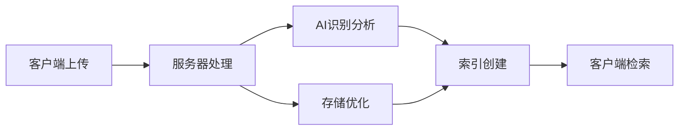

## 今日热点

AI代理与开发工具深度融合，本地化解决方案兴起，开发者通过技能库提升AI协作效率，同时关注隐私保护和系统提示优化。

---

## 热门项目一览

| 排名 | 项目 | 语言 | 今日 | 总计 | 简介 |
|:---:|------|:----:|------:|-----:|------|
| 1 | [usestrix/strix](https://github.com/usestrix/strix) | Python | +1,904 | 36,110 | Open-source AI penetration ... |
| 2 | [JuliusBrussee/caveman](https://github.com/JuliusBrussee/caveman) | JavaScript | +1,089 | 84,020 | 🪨 why use many token when f... |
| 3 | [mattpocock/skills](https://github.com/mattpocock/skills) | Shell | +973 | 156,604 | Skills for Real Engineers. ... |
| 4 | [alibaba/page-agent](https://github.com/alibaba/page-agent) | TypeScript | +742 | 23,146 | JavaScript in-page GUI agen... |
| 5 | [openai/codex-plugin-cc](https://github.com/openai/codex-plugin-cc) | JavaScript | +718 | 24,513 | Use Codex from Claude Code ... |
| 6 | [Zackriya-Solutions/meetily](https://github.com/Zackriya-Solutions/meetily) | Rust | +718 | 15,331 | Privacy first, AI meeting a... |
| 7 | [ogulcancelik/herdr](https://github.com/ogulcancelik/herdr) | Rust | +707 | 11,481 | agent multiplexer that live... |
| 8 | [asgeirtj/system_prompts_leaks](https://github.com/asgeirtj/system_prompts_leaks) | JavaScript | +471 | 48,968 | Extracted system prompts fr... |
| 9 | [harvard-edge/cs249r_book](https://github.com/harvard-edge/cs249r_book) | Python | +443 | 26,586 | Machine Learning Systems |
| 10 | [rommapp/romm](https://github.com/rommapp/romm) | Python | +398 | 10,220 | A beautiful, powerful, self... |
| 11 | [agentskills/agentskills](https://github.com/agentskills/agentskills) | Python | +351 | 22,355 | Specification and documenta... |
| 12 | [ChromeDevTools/chrome-devtools-mcp](https://github.com/ChromeDevTools/chrome-devtools-mcp) | TypeScript | +304 | 45,790 | Chrome DevTools for coding ... |

---

## 趋势洞察

```
┌─────────────────────────────────────────────────────────────────┐
│  AI/ML 工具         ████████████████████████  15 个项目        │
│  其他               ███                       2 个项目        │
│  多媒体应用            █                         1 个项目        │
└─────────────────────────────────────────────────────────────────┘
```

---

## 项目深度解读

### 1. usestrix/strix — AI安全测试工具

> **一句话总结**：利用AI技术自动化发现和修复应用程序安全漏洞，降低渗透测试技术门槛。

#### 价值主张

| 维度 | 说明 |
|------|------|
| **解决痛点** | 传统渗透测试专业知识门槛高、耗时长，难以持续进行 |
| **目标用户** | 安全研究人员、开发团队、DevOps工程师 |
| **核心亮点** | AI驱动自动化检测 + 多框架支持 + 详细修复建议 + 易于集成 |

#### 技术架构


**技术特色**：
- 结合机器学习识别复杂漏洞模式
- 支持多语言静态代码分析
- 提供可操作的修复指导而非仅报告问题

#### 热度分析

- 项目Star数超36,000且持续快速增长，反映安全领域对AI工具的强烈需求
- 在开源安全工具中处于领先地位，形成活跃贡献者社区和生态系统

#### 快速上手

```bash
# 克隆项目
git clone https://github.com/usestrix/strix.git
cd strix
# 安装依赖并运行
pip install -r requirements.txt
python strix.py --target <目标应用路径>
```

#### 注意事项

- 仅用于授权测试，遵守法律法规和道德准则
- AI检测结果可能存在误报，需人工验证确认
- 定期更新以获取最新的漏洞检测能力和安全规则


### 2. JuliusBrussee/caveman — 代码提示优化

> **一句话总结**：通过简化语言减少Claude AI的token消耗，降低65%的API成本。

#### 价值主张

| 维度 | 说明 |
|------|------|
| **解决痛点** | Claude AI API调用成本高，提示词冗长导致资源浪费 |
| **目标用户** | 使用Claude AI API的开发者和研究人员 |
| **核心亮点** | 简化提示语言减少65%token + 保持代码质量不变 + 易于集成工作流 |

#### 技术架构


**技术特色**：
- 采用"穴居人"语言简化策略
- 保持代码功能完整性
- 智能识别可简化部分

#### 热度分析

- 项目获得8.4万星，近期增长迅速，日均增长超千星，表明市场需求强烈
- 零开放问题说明项目成熟稳定，用户反馈积极，社区维护良好

#### 快速上手

```bash
npm install caveman
caveman "your-long-prompt-here"
```

#### 注意事项

- 需要确认具体的使用方法和兼容性
- 可能需要Claude API访问权限
- 简化后的提示可能不适合所有场景


### 3. mattpocock/skills — 工程师技能库

> **一句话总结**：精选工程师必备的Shell脚本集合，提供高效实用的命令行工具和技能。

#### 价值主张

| 维度 | 说明 |
|------|------|
| **解决痛点** | 提供工程师日常工作中实用的Shell脚本和命令行工具 |
| **目标用户** | 开发人员、系统管理员、DevOps工程师 |
| **核心亮点** | 精选实用脚本 + 高效命令行工具 + 工程师最佳实践 |

#### 技术架构


**技术特色**：
- 纯Shell实现，跨平台兼容性强
- 模块化设计，便于复用和扩展
- 脚本精简高效，遵循Unix哲学

#### 热度分析

- Star数高达15万+，每日新增近千星，表明项目深受工程师社区欢迎
- Fork数与Star数比例合理，说明项目不仅被关注，也被广泛使用和定制

#### 快速上手

```bash
# 克隆项目
git clone https://github.com/mattpocock/skills.git
# 进入目录
cd skills
# 查看可用脚本
ls -la
# 执行脚本
./script-name
```

#### 注意事项

- 由于没有明确的许可证信息，使用前需确认授权方式
- Shell脚本可能需要特定环境配置，请确保系统兼容性
- 建议在使用前检查脚本来源，确保安全性


### 4. alibaba/page-agent — 网页智能控制

> **一句话总结**：通过自然语言控制网页界面，实现人机交互的智能化升级。

#### 价值主张

| 维度 | 说明 |
|------|------|
| **解决痛点** | 降低网页操作门槛，无需精确点击即可控制界面元素 |
| **目标用户** | 前端开发者、测试人员、网页自动化需求用户 |
| **核心亮点** | 自然语言交互 + 精准元素定位 + 可视化控制 + 开箱即用 |

#### 技术架构


**技术特色**：
- 基于自然语言处理的界面理解技术
- 精准的网页元素定位机制
- 轻量级JavaScript实现，无需复杂依赖

#### 热度分析

- 项目获得23k+ Star，单日增长700+，表明近期热度显著上升
- 作为阿里巴巴开源项目，在企业级应用领域具有较高影响力

#### 快速上手

```bash
# 安装page-agent
npm install @alibaba/page-agent

# 初始化并启动
page-agent init
page-agent start
```

#### 注意事项

- 需要浏览器环境支持
- 自然语言理解准确性可能受限于语言模型能力
- 复杂网页界面可能需要额外配置


### 5. openai/codex-plugin-cc — AI代码助手

> **一句话总结**：将OpenAI Codex集成到Claude Code，提供智能代码审查与任务分配功能。

#### 价值主张

| 维度 | 说明 |
|------|------|
| **解决痛点** | 解决开发者无法在Claude Code中直接使用OpenAI Codex进行代码审查的问题 |
| **目标用户** | 使用Claude Code的开发者，需要AI辅助代码审查和任务分配 |
| **核心亮点** | + 跨平台AI代码集成 + 代码智能审查 + 任务自动分配 + 无缝工作流整合 |

#### 技术架构


**技术特色**：
- 基于JavaScript的轻量级插件架构
- 无缝集成OpenAI Codex API
- 保持Claude Code原生工作流体验

#### 热度分析

- 项目获得24,513 stars且持续增长(+718 today)，表明开发者社区高度认可其价值
- 相对1,485的fork数，社区更倾向于直接使用而非修改，说明项目成熟度高

#### 快速上手

```bash
# 安装插件
npm install codex-plugin-cc

# 在Claude Code中启用插件
claude-code enable-plugin codex-plugin-cc

# 配置API密钥
codex-plugin-cc config --api-key YOUR_OPENAI_API_KEY
```

#### 注意事项

- 需要有效的OpenAI API密钥才能使用Codex功能
- 可能与特定版本的Claude Code兼容
- 使用AI代码审查时应注意代码安全性和隐私保护


### 6. Zackriya-Solutions/meetily — 隐私AI助手

> **一句话总结**：本地运行的AI会议助手，提供实时转录、说话人分离和智能摘要，保护隐私无需云端。

#### 价值主张

| 维度 | 说明 |
|------|------|
| **解决痛点** | 会议转录慢、隐私泄露风险高、云端依赖问题 |
| **目标用户** | 注重隐私的商务人士、研究人员、远程团队 |
| **核心亮点** | 4倍速实时转录 + 说话人分离 + 本地AI处理 + 跨平台支持 |

#### 技术架构


**技术特色**：
- 基于Rust构建，性能卓越且内存安全
- 4倍速于标准Whisper的实时转录能力
- 100%本地处理，确保数据隐私安全
- 跨平台支持，覆盖macOS和Windows

#### 热度分析

- 项目热度极高，Star数超15K且单日增长700+，显示强烈市场需求
- Fork数相对较低(1.6K)，表明项目以使用为主，定制化需求较少
- 零Open Issues，反映项目成熟度和维护质量高

#### 快速上手

```bash
# 克隆仓库
git clone https://github.com/Zackriya-Solutions/meetily.git
# 构建项目
cargo build --release
# 运行程序
./target/release/meetily
```

#### 注意事项

- 项目需要一定的硬件资源来支持AI模型的本地运行
- 需要安装依赖如Ollama以支持摘要功能
- 项目专注于本地处理，可能缺乏云端协作功能


### 7. ogulcancelik/herdr — 终端代理管理器

> **一句话总结**：终端中的多路复用代理工具，高效管理多个远程连接。

#### 价值主张

| 维度 | 说明 |
|------|------|
| **解决痛点** | 终端中多个代理连接管理混乱，切换不便 |
| **目标用户** | 需要同时管理多个远程连接的开发者和运维人员 |
| **核心亮点** | 多路复用 + 会话持久化 + 快速切换 + 配置管理 |

#### 技术架构


**技术特色**：
- 基于Rust构建，高性能且内存安全
- 多路复用技术，支持同时管理多个代理连接
- 终端原生集成，提供无缝的用户体验

#### 热度分析

- 项目近期热度显著增长，单日Star增加707，表明功能实用且获得社区认可
- 零Open Issues反映项目维护良好，用户问题解决及时

#### 快速上手

```bash
# 安装herdr
cargo install herdr

# 启动herdr并添加代理连接
herdr add my-server user@host:port
herdr add another-server user@anotherhost:port

# 在不同代理间切换
herdr switch my-server
```

#### 注意事项

- 需要Rust环境才能安装
- 配置文件需要妥善保管，避免连接信息丢失
- 可能需要额外的SSH配置才能正常工作


### 8. asgeirtj/system_prompts_leaks — AI系统提示库

> **一句话总结**：收集整理各大AI模型的系统提示词，为研究人员提供直接可用的内部指令参考。

#### 价值主张

| 维度 | 说明 |
|------|------|
| **解决痛点** | 解决AI研究人员无法获取各大模型系统提示词的难题 |
| **目标用户** | AI研究人员、开发者、模型微调工程师 |
| **核心亮点** | 多平台覆盖 + 定期更新 + 结构化整理 + 直接可用 |

#### 技术架构


**技术特色**：
- 多平台系统提示词收集与验证技术
- 结构化数据组织与版本管理
- 定期更新机制保持内容时效性

#### 热度分析

- 项目获得近5万星，单日增长471星，显示出极高的关注度与行业认可度
- 无开放问题，表明项目维护良好，已成为AI研究领域的参考标准

#### 快速上手

```bash
# 克隆项目到本地
git clone https://github.com/asgeirtj/system_prompts_leaks.git

# 查看README获取最新更新信息
cat system_prompts_leaks/README.md
```

#### 注意事项

- 系统提示词可能随时间更新，项目虽定期更新但不保证实时性
- 使用这些提示词进行模型微调时需遵守相关平台的使用条款
- 部分提示词可能经过处理，不完全等同于原始系统提示


### 9. harvard-edge/cs249r_book — [系统教材]

> **一句话总结**：哈佛大学机器学习系统教材，理论与实践结合，深入浅出讲解ML系统设计。

#### 价值主张

| 维度 | 说明 |
|------|------|
| **解决痛点** | 提供系统化的机器学习知识体系，填补理论与实践的鸿沟 |
| **目标用户** | 机器学习学习者、研究人员和工程师 |
| **核心亮点** | 哈佛官方出品 + 系统化知识结构 + 实践导向 |

#### 技术架构


**技术特色**：
- 结合前沿理论与实际应用场景
- 提供完整ML系统开发生命周期指导
- 包含大量Python实现示例和最佳实践

#### 热度分析

- 项目星数持续增长，日增443星，表明社区高度认可
- 高fork但低issues比例，反映项目成熟度高且问题解决及时

#### 快速上手

```bash
# 克隆项目
git clone https://github.com/harvard-edge/cs249r_book.git

# 查看目录结构
cd cs249r_book && ls -la
```

#### 注意事项

- 本项目为教材性质，代码示例可能需要额外依赖
- 部分章节可能需要前置知识，建议按顺序学习


### 10. rommapp/romm — ROM游戏管理平台

> **一句话总结**：美观强大的自托管ROM游戏管理与播放器，让游戏收藏与管理变得简单高效。

#### 价值主张

| 维度 | 说明 |
|------|------|
| **解决痛点** | 解决ROM游戏分散管理、难以播放和整理的问题 |
| **目标用户** | 游戏收藏爱好者、复古游戏玩家、ROM收藏者 |
| **核心亮点** | 美观界面 + 自托管部署 + 多平台支持 + 游戏库管理 |

#### 技术架构


**技术特色**：
- 基于Python构建，跨平台兼容性强
- 自托管部署，保证数据隐私与控制权
- 美观的Web界面，提升用户体验

#### 热度分析

- 项目获得10,220个星标，单日增长398，表明项目热度快速上升，备受游戏爱好者关注
- 无开放问题，表明项目维护状况良好，社区问题处理及时

#### 快速上手

```bash
# 克隆仓库
git clone https://github.com/rommapp/romm.git

# 安装依赖
pip install -r requirements.txt

# 启动应用
python app.py
```

#### 注意事项

- 由于是自托管应用，用户需要自己维护服务器和数据
- ROM版权问题需自行注意，仅拥有个人备份的游戏ROM
- 项目许可证未知，使用前需确认授权条款


### 11. agentskills/agentskills — AI技能规范

> **一句话总结**：为AI智能体提供标准化技能接口与规范，促进智能体能力互操作与扩展。

#### 价值主张

| 维度 | 说明 |
|------|------|
| **解决痛点** | AI智能体技能标准化缺失，难以集成与扩展 |
| **目标用户** | AI开发者、智能体构建者、系统集成工程师 |
| **核心亮点** | 统一技能接口规范 + 跨平台兼容性 + 模块化设计 + 可扩展技能库 |

#### 技术架构

**技术特色**：
- 定义标准化的AI智能体技能接口
- 提供技能描述与实现的规范文档
- 支持技能的组合与链式调用
- 设计可插拔的技能扩展机制

#### 热度分析

- 项目Star数高且增长迅速，表明AI智能体技能规范领域需求旺盛
- 零Open Issues显示项目维护良好，社区问题处理高效

#### 快速上手

```bash
# 克隆项目仓库
git clone https://github.com/agentskills/agentskills.git

# 查看技能规范文档
cd agentskills && cat README.md
```

#### 注意事项

- 项目License未知，商业使用前需确认授权条款
- 需要关注项目更新，确保采用最新的技能规范版本
- 实际应用时可能需要根据具体场景调整技能实现


### 12. ChromeDevTools/chrome-devtools-mcp — AI编程辅助工具

> **一句话总结**：Chrome DevTools扩展，为AI编码代理提供专业调试和代码分析能力。

#### 价值主张

| 维度 | 说明 |
|------|------|
| **解决痛点** | 为AI编码代理提供专业调试环境，解决代码智能生成中的调试难题 |
| **目标用户** | AI编程助手开发者、智能IDE构建者、自动化代码生成工具团队 |
| **核心亮点** | + 深度集成Chrome DevTools + 专为AI代理优化 + 实时代码分析能力 |

#### 技术架构


**技术特色**：
- 基于TypeScript构建的高质量扩展
- 提供标准化的工具接口和API
- 支持AI代理与开发工具的无缝集成

#### 热度分析

- 项目Star数高且持续增长，显示AI辅助编程工具领域热度显著上升
- 作为Chrome官方项目，拥有强大的社区支持和生态影响力

#### 快速上手

```bash
# 安装Chrome DevTools MCP扩展
npm install -g @chrome-devtools/mcp

# 初始化AI代理环境
chrome-devtools-mcp init
```

#### 注意事项

- 需要最新版本的Chrome浏览器
- 可能需要配置AI代理工具的API密钥
- 部分高级功能可能需要订阅服务


### 13. immich-app/immich — 自托管相册管理

> **一句话总结**：高性能自托管照片视频管理系统，提供私有云相册体验，支持智能搜索与多设备同步。

#### 价值主张

| 维度 | 说明 |
|------|------|
| **解决痛点** | 个人/家庭照片视频管理散乱，云服务隐私担忧，缺乏统一管理平台 |
| **目标用户** | 注重隐私的个人用户、摄影爱好者、需要家庭照片管理的小团队 |
| **核心亮点** | 高性能自托管 + 智能搜索 + 多设备同步 + 隐私保护 + AI人脸识别 |

#### 技术架构



**技术特色**：
- 基于TypeScript的全栈开发，确保类型安全
- 高性能媒体处理与索引技术
- 零信任架构保障用户隐私安全

#### 热度分析

- 项目获得10万+星标，近期持续增长，显示高需求与认可度
- 作为自托管解决方案，在隐私意识增强背景下具有重要生态价值

#### 快速上手

```bash
# 克隆项目
git clone https://github.com/immich-app/immich.git

# 安装依赖
cd immich && npm install

# 启动开发服务器
npm run dev
```

#### 注意事项

- 需要一定的技术基础进行部署和维护
- 媒体文件存储需要较大磁盘空间
- 定期更新以获取新功能和安全补丁


### 14. chthollyphile/folia-major — [歌词动画播放器]

> **一句话总结**：专注于绚丽歌词动画效果的音乐播放器，支持多种音乐源。

#### 价值主张

| 维度 | 说明 |
|------|------|
| **解决痛点** | 提供动态歌词可视化效果，提升音乐播放体验 |
| **目标用户** | 注重歌词展示效果的音乐爱好者 |
| **核心亮点** | 绚丽歌词动画 + 多音乐源支持 + 高度自定义 |

#### 技术架构


**技术特色**：
- 基于TypeScript开发，确保代码质量和类型安全
- 高性能歌词动画渲染引擎，提供流畅视觉效果
- 支持多种音乐源和歌词格式的灵活架构

#### 热度分析

- 项目近期热度增长显著，单日增加175星，表明用户认可度高
- 虽然Issues为0，但Fork数相对较少，可能项目处于早期阶段

#### 快速上手

```bash
# 克隆项目
git clone https://github.com/chthollyphile/folia-major.git

# 安装依赖并运行
npm install
npm start
```

#### 注意事项

- 项目许可证未知，商业使用前需确认授权情况
- 由于支持网易云API，需注意平台使用政策限制


### 15. alirezarezvani/claude-skills — AI技能库

> **一句话总结**：为多种AI编程助手提供丰富的技能插件集合，提升开发效率和专业能力。

#### 价值主张

| 维度 | 说明 |
|------|------|
| **解决痛点** | 解决AI编程助手功能有限、专业性不足的问题 |
| **目标用户** | 开发者、产品经理、营销人员、研究人员等多领域专业人士 |
| **核心亮点** | 跨平台兼容性 + 大量专业技能 + 高度可定制化 |

#### 技术架构

**技术特色**：
- 基于Python构建，易于扩展和维护
- 支持多种AI编程助手平台
- 模块化设计，便于定制和扩展

#### 热度分析

- 项目获得20k+高星，近期每日增长136星，表明热度持续上升
- 作为AI编程助手增强工具，处于当前AI辅助开发热潮的前沿位置

#### 快速上手

```bash
# 克隆仓库
git clone https://github.com/alirezarezvani/claude-skills.git

# 安装依赖
pip install -r requirements.txt
```

#### 注意事项

- 需要确保使用的AI编程助手平台支持此类插件扩展
- 不同平台可能需要特定的配置方式
- 部分高级功能可能需要API密钥或订阅


### 16. CoplayDev/unity-mcp — Unity AI桥接

> **一句话总结**：Unity MCP作为AI助手与Unity编辑器之间的桥梁，为大型语言模型提供管理资源、控制场景、编辑脚本和自动化任务的能力。

#### 价值主张

| 维度 | 说明 |
|------|------|
| **解决痛点** | 解决AI助手无法直接操作Unity编辑器的问题，实现AI与开发环境的无缝集成 |
| **目标用户** | Unity开发者、AI研究人员、游戏自动化测试人员 |
| **核心亮点** | 提供完整的Unity编辑器API接口 + 支持多种AI模型集成 + 实现实时代码编辑和场景操作 |

#### 技术架构


**技术特色**：
- 基于MCP(Model Context Protocol)标准构建，确保与多种AI系统的兼容性
- 使用C#实现，深度集成Unity编辑器API，提供全面的功能访问
- 采用异步通信机制，确保AI操作Unity时的流畅性和响应速度

#### 热度分析

- 项目获得超过11,600个星标，近期日均增长约70个星，显示出开发社区对该技术的高度关注
- 作为AI游戏开发领域的创新项目，在Unity与AI结合的前沿领域占据重要位置，吸引大量开发者尝试

#### 快速上手

```bash
# 克隆项目
git clone https://github.com/CoplayDev/unity-mcp.git

# 安装依赖并运行
cd unity-mcp
npm install
npm start
```

#### 注意事项

- 需要Unity编辑器环境支持，确保Unity版本兼容
- 使用前需要配置AI服务API密钥，并正确设置MCP连接参数
- 对于复杂操作，建议先在小规模项目上测试，避免意外修改重要资源


### 17. crynta/terax-ai — 轻量终端AI开发

> **一句话总结**：轻量级7MB终端优先的AI原生开发工作空间，提供智能编程辅助。

#### 价值主张

| 维度 | 说明 |
|------|------|
| **解决痛点** | 传统IDE臃肿，提供轻量级但功能强大的AI辅助终端开发环境 |
| **目标用户** | 终端重度用户、追求效率的开发者、AI工具爱好者 |
| **核心亮点** | 轻量级设计 + 终端原生集成 + AI智能辅助 + 高性能 + 开箱即用 |

#### 技术架构


**技术特色**：
- 轻量级架构，仅占用7MB存储空间
- TypeScript开发，类型安全，性能优化
- 终端优先设计，无缝集成开发者工作流

#### 热度分析

- 项目Star数8,069且持续增长(+62/天)，显示开发者高度认可
- 0个Open Issues表明项目维护良好，社区反馈及时处理

#### 快速上手

```bash
# 全局安装
npm install -g terax-ai

# 初始化项目
terax init my-project

# 启动开发环境
terax start
```

#### 注意事项

- 需要配置AI服务API密钥以启用智能功能
- 终端操作界面可能需要适应期，特别是对习惯图形界面的开发者
- 轻量级设计意味着某些高级IDE功能可能需要替代解决方案


### 18. dotnet/skills — AI编程技能库

> **一句话总结**：为AI编程助手提供结构化的.NET和C#领域专业知识，提升辅助编程质量。

#### 价值主张

| 维度 | 说明 |
|------|------|
| **解决痛点** | 解决AI在.NET领域编程知识不足的问题，提高代码生成准确性 |
| **目标用户** | 使用.NET框架的开发者、AI编程助手工具集成者 |
| **核心亮点** | 结构化技能定义 + .NET专业知识 + AI优化指令 + 可扩展性 |

#### 技术架构


**技术特色**：
- 采用结构化JSON格式定义技能，确保AI可理解
- 技能分类明确，涵盖.NET核心领域和最佳实践
- 支持技能组合与依赖管理，构建复杂编程场景

#### 热度分析

- 项目近期增长迅速，日均增长约2个star，显示社区对AI辅助编程需求旺盛
- 作为微软生态的AI编程支持库，在.NET开发者社区具有独特生态位置

#### 快速上手

```bash
# 克隆仓库
git clone https://github.com/dotnet/skills.git

# 查看技能定义示例
cd skills && cat samples/HelloWorld/skill.json
```

#### 注意事项

- 需要配合支持技能系统的AI编程助手使用
- 技能定义需要遵循项目特定的JSON结构规范
- 部分技能可能需要.NET特定版本或环境支持


## 今日推荐

| 主题 | 推荐项目 | 亮点 |
|------|----------|------|
| 今日最热 | [usestrix/strix](https://github.com/usestrix/strix) | Open-source AI pe... |
| 值得关注 | [JuliusBrussee/caveman](https://github.com/JuliusBrussee/caveman) | 🪨 why use many to... |
| 快速上手 | [mattpocock/skills](https://github.com/mattpocock/skills) | Skills for Real E... |
| 长期潜力 | [alibaba/page-agent](https://github.com/alibaba/page-agent) | JavaScript in-pag... |

---

<div align="center">

*Generated on 2026-07-05 | Powered by GitHub Trending Reporter*

</div>