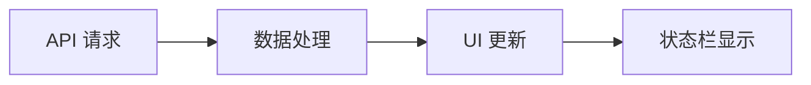
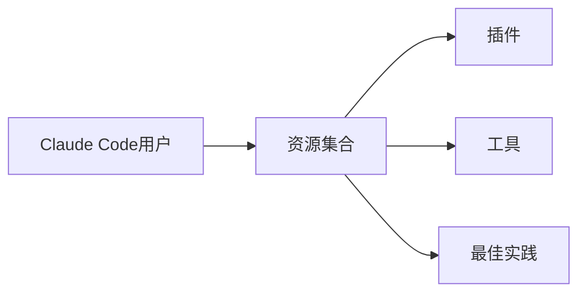

## 今日热点

AI编程助手生态蓬勃发展，Claude Code等工具及其扩展插件受到热捧；同时AI安全与隐私需求增长，系统透明度和安全性成为焦点。

---

## 热门项目一览

| 排名 | 项目 | 语言 | 今日 | 总计 | 简介 |
|:---:|------|:----:|------:|-----:|------|
| 1 | [openai/codex-plugin-cc](https://github.com/openai/codex-plugin-cc) | JavaScript | +1,532 | 25,549 | Use Codex from Claude Code ... |
| 2 | [Zackriya-Solutions/meetily](https://github.com/Zackriya-Solutions/meetily) | Rust | +1,409 | 17,206 | Privacy first, AI meeting a... |
| 3 | [usestrix/strix](https://github.com/usestrix/strix) | Python | +1,114 | 37,201 | Open-source AI penetration ... |
| 4 | [JuliusBrussee/caveman](https://github.com/JuliusBrussee/caveman) | JavaScript | +1,052 | 84,927 | 🪨 why use many token when f... |
| 5 | [asgeirtj/system_prompts_leaks](https://github.com/asgeirtj/system_prompts_leaks) | JavaScript | +981 | 50,070 | Extracted system prompts fr... |
| 6 | [Leonxlnx/taste-skill](https://github.com/Leonxlnx/taste-skill) | JavaScript | +863 | 57,617 | Taste-Skill - gives your AI... |
| 7 | [alibaba/page-agent](https://github.com/alibaba/page-agent) | TypeScript | +805 | 23,969 | JavaScript in-page GUI agen... |
| 8 | [ogulcancelik/herdr](https://github.com/ogulcancelik/herdr) | Rust | +651 | 12,129 | agent multiplexer that live... |
| 9 | [facebook/astryx](https://github.com/facebook/astryx) | TypeScript | +522 | 5,942 | An open source design syste... |
| 10 | [immich-app/immich](https://github.com/immich-app/immich) | TypeScript | +470 | 106,146 | High performance self-hoste... |
| 11 | [CoplayDev/unity-mcp](https://github.com/CoplayDev/unity-mcp) | C# | +414 | 11,961 | Unity MCP acts as a bridge ... |
| 12 | [rommapp/romm](https://github.com/rommapp/romm) | Python | +410 | 10,572 | A beautiful, powerful, self... |

---

## 趋势洞察

```
┌─────────────────────────────────────────────────────────────────┐
│  AI/ML 工具         ████████████████████████  19 个项目        │
│  多媒体应用            ██                        2 个项目        │
│  其他               █                         1 个项目        │
└─────────────────────────────────────────────────────────────────┘
```

---

## 项目深度解读

### 1. openai/codex-plugin-cc — AI代码助手

> **一句话总结**：将OpenAI Codex集成到Claude Code中，实现智能代码审查与任务自动化。

#### 价值主张

| 维度 | 说明 |
|------|------|
| **解决痛点** | 简化代码审查流程，提升开发效率，减少人工审查成本 |
| **目标用户** | 开发者团队、代码审查者、项目管理人员 |
| **核心亮点** | AI驱动 + 自然语言交互 + 代码质量提升 + 自动化任务分配 |

#### 技术架构


**技术特色**：
- 利用OpenAI Codex模型进行代码理解与分析
- 无缝集成到Claude Code开发环境
- 支持自然语言交互进行代码审查和任务分配

#### 热度分析

- 项目Star数达25,549且单日新增1,532，表明近期爆发性增长，可能因AI代码助手需求激增
- Fork数1,543显示社区活跃度高，有较多用户进行二次开发和定制化使用

#### 快速上手

```bash
# 安装插件
npm install -g codex-plugin-cc

# 在Claude Code中激活
claude-code --enable-plugin codex

# 使用示例
codex-review "审查这段代码的安全性"
codex-delegate "将用户认证功能分配给小李"
```

#### 注意事项

- 需要OpenAI API密钥才能使用Codex功能
- 代码审查结果仅供参考，需人工验证
- 可能存在隐私问题，不建议上传敏感代码
- 插件可能随Claude Code版本更新而需要兼容调整


### 2. Zackriya-Solutions/meetily — 隐私会议助手

> **一句话总结**：基于Rust的本地化AI会议助手，提供实时转录、发言者识别和会议摘要功能，无需云端处理。

#### 价值主张

| 维度 | 说明 |
|------|------|
| **解决痛点** | 解决会议记录繁琐、隐私泄露风险高、云端依赖问题 |
| **目标用户** | 注重隐私的商务人士、研究人员、远程团队 |
| **核心亮点** | 100%本地处理 + 4倍速实时转录 + 发言者识别 + Ollama摘要 + 开源自托管 |

#### 技术架构


**技术特色**：
- 基于Rust构建，性能优异，内存安全
- 4倍于Parakeet/Whisper的实时转录速度
- 完全本地化处理，保护用户隐私
- 集成Ollama进行本地AI摘要生成
- 跨平台支持macOS和Windows

#### 热度分析

- 项目获得17,206个Star，单日增长1,409，表明近期热度快速上升
- Fork数1,813，显示社区积极参与和二次开发意愿高
- 0个Open Issues，可能表示项目成熟度高或问题解决及时

#### 快速上手

```bash
# 克隆仓库
git clone https://github.com/Zackriya-Solutions/meetily.git

# 构建项目
cd meetily
cargo build --release
```

#### 注意事项

- 需要本地安装Rust环境
- 首次使用可能需要下载模型文件
- 硬件配置要求较高，特别是对于实时转录功能
- 目前仅支持macOS和Windows平台
- 许可证信息不明确，使用前需确认开源协议


### 3. usestrix/strix — AI安全测试工具

> **一句话总结**：基于AI的自动化渗透测试工具，帮助开发者主动发现和修复应用安全漏洞。

#### 价值主张

| 维度 | 说明 |
|------|------|
| **解决痛点** | 传统渗透测试耗时耗力，AI自动化检测未知漏洞 |
| **目标用户** | 开发者、安全研究员、DevOps工程师 |
| **核心亮点** | AI驱动自动化 + 全栈漏洞检测 + 实时修复建议 |

#### 技术架构


**技术特色**：
- 利用机器学习模型识别传统工具难以发现的漏洞
- 支持多种应用类型和框架的检测
- 提供可操作的修复建议而非仅报告问题

#### 热度分析

- 项目获得37k+ stars，近期增长迅速，表明安全领域对AI工具需求旺盛
- 社区活跃度高，fork数量可观，反映其在安全测试领域的实用价值

#### 快速上手

```bash
# 安装strix
pip install strix

# 基本使用
strix scan https://example.com
```

#### 注意事项

- 使用前需确保获得目标系统的授权，避免非法扫描
- AI检测可能存在误报，需人工验证结果
- 定期更新模型以应对新型漏洞和攻击向量


### 4. JuliusBrussee/caveman — AI 交互优化

> **一句话总结**：一种通过简化语言表达方式显著减少 Claude AI 交互中 token 消耗的方法论。

#### 价值主张

| 维度 | 说明 |
|------|------|
| **解决痛点** | 减少 AI 对话中的 token 消耗，降低 API 调用成本 |
| **目标用户** | 频繁使用 Claude API 的开发者和 AI 交互用户 |
| **核心亮点** | 简化表达 + 减少冗余 + 保持功能完整性 + 节省65% token |

#### 技术架构


**技术特色**：
- 采用极简语言风格减少 token 消耗
- 保留核心语义的同时去除冗余表达
- 通过特定句式结构优化与 AI 的交互效率

#### 热度分析

- 项目获得超过84,000星，近期增长迅速，显示AI开发者对优化token消耗的强烈需求
- 在AI工具生态中占据独特位置，专注于解决AI交互成本问题

#### 快速上手

```bash
# 克隆项目
git clone https://github.com/JuliusBrussee/caveman.git

# 查看使用示例
cat README.md
```

#### 注意事项

- 需要注意过度简化可能导致AI理解偏差
- 不同AI模型对简化表达的接受度可能不同
- 某些复杂任务可能需要保留一定程度的详细表达


### 5. asgeirtj/system_prompts_leaks — AI提示词库

> **一句话总结**：收集整理主流AI模型的系统提示词，为开发者和研究人员提供内部工作原理参考。

#### 价值主张

| 维度 | 说明 |
|------|------|
| **解决痛点** | 解决AI模型系统提示词不透明、难以获取的问题 |
| **目标用户** | AI开发者、研究人员和AI模型爱好者 |
| **核心亮点** | 覆盖主流AI模型 + 定期更新 + 结构化整理 + 来源权威 |

#### 技术架构

**技术特色**：
- 系统化收集和分类AI模型提示词
- 定期更新以适应模型迭代
- 结构化展示便于查阅和理解

#### 热度分析

- 项目获得5万+星标和8千+分叉，增长迅速，表明AI提示词提取需求旺盛
- 作为AI研究领域的稀缺资源，已成为开发者和研究者的必备参考

#### 快速上手

```bash
# 克隆项目到本地
git clone https://github.com/asgeirtj/system_prompts_leaks.git

# 浏览不同模型的系统提示词
cd system_prompts_leaks && ls
```

#### 注意事项

- 收集的提示词可能不完全准确，仅供参考
- 随着AI模型不断更新，提示词也会变化，建议关注项目更新
- 使用这些提示词时需遵守相关AI服务的使用条款


### 6. Leonxlnx/taste-skill — AI内容质量增强器

> **一句话总结**：提升AI生成内容质量，避免生成无聊、通用的内容。

#### 价值主张

| 维度 | 说明 |
|------|------|
| **解决痛点** | AI生成内容常显得无聊、通用，缺乏创意和个性 |
| **目标用户** | AI开发者、内容创作者、使用AI生成文本的用户 |
| **核心亮点** | 增强AI内容质量 + 避免生成通用内容 + 提供个性化输出 |

#### 技术架构


**技术特色**：
- 通过提示工程优化AI输出质量
- 轻量级JavaScript实现，易于集成
- 采用过滤机制排除低质量内容

#### 热度分析
- 项目获得57,617个Star，单日增长863，表明AI内容质量需求旺盛
- 零开放问题，显示项目维护良好，用户反馈积极

#### 快速上手

```bash
# 安装taste-skill
npm install taste-skill

# 使用示例
const tasteSkill = require('taste-skill');
const enhancedResponse = tasteSkill.enhance(aiResponse);
```

#### 注意事项
- 项目许可证未知，使用前需确认授权条款
- 可能需要与特定的AI模型或服务配合使用
- 实际效果可能因AI模型不同而有所差异


### 7. alibaba/page-agent — 页面交互助手

> **一句话总结**：通过自然语言控制网页界面操作，实现无代码化网页交互自动化。

#### 价值主张

| 维度 | 说明 |
|------|------|
| **解决痛点** | 降低网页自动化操作门槛，无需编写代码即可控制界面 |
| **目标用户** | 测试人员、开发者、需要网页自动化的非技术人员 |
| **核心亮点** | 自然语言理解 + 网页元素智能识别 + 交互指令自动执行 |

#### 技术架构


**技术特色**：
- 基于大语言模型的自然语言理解与转换
- 智能网页元素定位与识别算法
- 跨浏览器兼容的自动化执行引擎

#### 热度分析

- 项目近期热度激增，单日新增Stars超800，关注度持续攀升
- 高Star/Fork比例表明项目不仅受关注，且社区参与度活跃

#### 快速上手

```bash
# 安装
npm install -g page-agent

# 启动代理
page-agent --url https://example.com

# 交互式控制
> 点击登录按钮
> 输入用户名"test"
```

#### 注意事项

- 自然语言指令可能存在理解歧义，建议使用精确描述
- 复杂网页交互可能需要额外配置元素选择器
- 某些动态加载的内容可能需要等待时间才能正确识别


### 8. ogulcancelik/herdr — 终端代理复用器

> **一句话总结**：一款终端内运行的代理多路复用工具，简化多代理连接管理。

#### 价值主张

| 维度 | 说明 |
|------|------|
| **解决痛点** | 终端中同时管理多个代理连接的复杂性 |
| **目标用户** | 需要频繁切换代理的开发者和网络测试人员 |
| **核心亮点** | 终端集成 + 多路复用 + 配置简洁 + 实时切换 |

#### 技术架构


**技术特色**：
- 基于Rust构建，内存安全且高性能
- 异步I/O处理，支持高并发代理连接
- 轻量级设计，资源占用低

#### 热度分析

- Star数持续高增长，表明项目实用性强且社区认可度高
- 无开放问题，显示项目维护状态良好，用户反馈积极

#### 快速上手

```bash
# 安装
cargo install herdr

# 基本使用
herdr --config config.toml
```

#### 注意事项

- 需要预先配置好代理服务器信息
- 配置文件格式需符合项目要求
- 可能需要特定网络环境支持


### 9. facebook/astryx — 智能设计系统

> **一句话总结**：Facebook推出的开源设计系统，提供高度可定制能力并支持agent集成，助力快速构建一致的用户界面。

#### 价值主张

| 维度 | 说明 |
|------|------|
| **解决痛点** | 解决设计系统难以定制和智能集成的挑战 |
| **目标用户** | 前端开发团队和UI设计师 |
| **核心亮点** | 完全可定制 + Agent就绪 + 开源 + Facebook背书 |

#### 技术架构

**技术特色**：
- 基于TypeScript构建，提供类型安全
- 模块化设计，支持灵活定制
- 组件化架构，便于扩展和维护

#### 热度分析

- 项目近期热度显著，单日新增522星，表明社区高度关注
- 零未解决问题显示维护质量高，但Fork数相对较少，社区参与度有待提升

#### 快速上手

```bash
# 安装astryx设计系统
npm install @facebook/astryx

# 在项目中引入组件
import { Button, Card } from '@facebook/astryx';

# 使用示例
<Button variant="primary">点击我</Button>
```

#### 注意事项

- 由于项目Open Issues为0，可能存在社区反馈渠道不明确的问题
- 项目License未知，使用前需确认授权条款
- 作为Facebook项目，可能存在与Meta生态系统的深度集成需求


### 10. immich-app/immich — 自托管媒体管理

> **一句话总结**：高性能自托管照片视频管理解决方案，提供私有云媒体存储体验。

#### 价值主张

| 维度 | 说明 |
|------|------|
| **解决痛点** | 解决个人照片视频隐私存储与管理需求，摆脱第三方平台限制 |
| **目标用户** | 注重隐私的个人用户、小型团队、摄影爱好者 |
| **核心亮点** | 高性能媒体处理 + 自托管部署 + 智能相册管理 + AI人脸识别 + 跨平台客户端 |

#### 技术架构


**技术特色**：
- 基于TypeScript开发，保证代码质量与类型安全
- 支持分布式架构，可水平扩展处理大量媒体文件
- 采用现代化API设计，支持多客户端访问

#### 热度分析

- 项目Star数超过10万，日均增长约470，表明社区活跃度高，需求强劲
- 作为自托管媒体管理方案，在隐私意识提升背景下，处于快速上升赛道

#### 快速上手

```bash
# 克隆仓库
git clone https://github.com/immich-app/immich.git

# 安装依赖
cd immich && npm install

# 启动开发环境
docker-compose -f docker-compose.yml up -d
```

#### 注意事项

- 需要一定的技术基础才能部署和维护
- 媒体文件存储需要足够的磁盘空间
- 首次设置可能需要配置API密钥和认证系统


### 11. CoplayDev/unity-mcp — Unity AI桥接

> **一句话总结**：Unity MCP作为AI助手与Unity编辑器之间的桥梁，提供资源管理、场景控制和脚本编辑能力。

#### 价值主张

| 维度 | 说明 |
|------|------|
| **解决痛点** | 解决AI无法直接与Unity编辑器交互的问题，提升开发效率 |
| **目标用户** | Unity开发者、AI工具使用者、游戏自动化需求者 |
| **核心亮点** | AI直接控制Unity编辑器 + 资源自动化管理 + 脚本智能编辑 + 场景控制能力 |

#### 技术架构


**技术特色**：
- MCP协议实现AI与Unity编辑器的通信桥梁
- C#编写的Unity插件，深度集成Unity编辑器API
- 支持资源、场景和脚本的自动化操作能力

#### 热度分析

- 项目获得近12k星，单日增长414星，表明项目在游戏开发AI集成领域热度快速上升
- 零开放问题，说明项目成熟度高或问题处理机制高效，在Unity开发社区具有重要地位

#### 快速上手

```bash
# 克隆项目仓库
git clone https://github.com/CoplayDev/unity-mcp.git

# 导入到Unity项目
# 在Unity中创建新项目，将插件放入Assets文件夹
```

#### 注意事项

- 需要Unity编辑器环境支持
- 可能需要特定的AI服务配置才能正常工作
- 项目许可证不明确，使用前需确认授权条款


### 12. rommapp/romm — 游戏ROM管理平台

> **一句话总结**：一个美观强大的自托管ROM管理器和播放器，提供统一的游戏收藏管理体验。

#### 价值主张

| 维度 | 说明 |
|------|------|
| **解决痛点** | 解决游戏ROM分散管理、模拟器配置复杂、游戏启动不便的问题 |
| **目标用户** | 游戏收藏家、复古游戏爱好者、模拟器用户 |
| **核心亮点** | 美观的Web界面 + 自托管部署 + 多平台支持 + 游戏元数据自动获取 |

#### 技术架构


**技术特色**：
- 基于Python构建的全栈ROM管理系统
- 提供RESTful API进行ROM管理和操作
- 支持多种游戏平台和模拟器集成

#### 热度分析

- 项目Star数突破10,000且近期增长迅速(+410 today)，表明项目受到广泛关注
- 作为自托管ROM管理工具，在游戏模拟和复古游戏社区具有重要生态位置

#### 快速上手

```bash
# 克隆项目
git clone https://github.com/rommapp/romm.git
cd romm

# 安装依赖
pip install -r requirements.txt

# 启动服务
python app.py
```

#### 注意事项

- 由于涉及ROM版权问题，用户应确保拥有合法的游戏副本
- 项目可能需要较强的硬件性能，特别是运行较老游戏的模拟器时
- 自托管部署需要一定的技术知识，特别是网络配置部分


### 13. alirezarezvani/claude-skills — AI助手扩展包

> **一句话总结**：为Claude和8大AI编程助手提供337个专业化技能与插件，提升多领域工作效率。

#### 价值主张

| 维度 | 说明 |
|------|------|
| **解决痛点** | AI编程助手缺乏专业化、行业化技能集，无法满足特定领域深度需求 |
| **目标用户** | 开发者、产品经理、营销人员、法务合规、C级高管和研究分析师 |
| **核心亮点** | 337个专业化技能 + 30+定制代理 + 70+自定义命令 + 多平台兼容 |

#### 技术架构


**技术特色**：
- 模块化技能设计，便于扩展和维护
- 支持多种AI编程助手平台的统一接口
- 可定制的参考系统和脚本执行环境

#### 热度分析

- 项目获得超2万星且持续增长，表明其在AI编程助手扩展领域具有高认可度
- Fork数量近3000，社区活跃度高，用户积极参与定制和二次开发

#### 快速上手

```bash
# 克隆项目
git clone https://github.com/alirezarezvani/claude-skills.git

# 安装依赖
pip install -r requirements.txt
```

#### 注意事项

- 项目需要根据具体使用的AI编程助手平台进行相应配置
- 部分技能可能需要特定的API密钥或访问权限
- 随着AI模型更新，部分技能可能需要适配调整


### 14. harvard-edge/cs249r_book — 机器学习系统教材

> **一句话总结**：哈佛大学机器学习系统课程教材，理论与实践并重，深入讲解现代机器学习系统设计。

#### 价值主张

| 维度 | 说明 |
|------|------|
| **解决痛点** | 将机器学习理论与实践系统相结合，填补学术与工业界知识鸿沟 |
| **目标用户** | 机器学习研究者、工程师、高年级本科生及研究生 |
| **核心亮点** | 案例丰富 + 理论深入 + 代码实践 + 前沿技术覆盖 + 哈佛官方背书 |

#### 技术架构


**技术特色**：
- 涵盖从基础理论到系统实现的完整知识链
- 结合最新研究成果与工业界实践案例
- 提供可运行的代码示例和实验指导

#### 热度分析

- 项目获得2.6万+星标，月均增长约300+，显示学术界和工业界对该教材的高度认可
- 零开放问题表明项目维护良好，内容已相对成熟稳定，适合作为学习参考资料

#### 快速上手

```bash
# 克隆项目到本地
git clone https://github.com/harvard-edge/cs249r_book.git

# 使用Jupyter Notebook运行示例代码
cd cs249r_book/notebooks
jupyter notebook
```

#### 注意事项

- 项目可能需要一定的机器学习和Python基础才能完全理解
- 建议按照章节顺序学习，部分内容可能依赖前序知识
- 代码示例可能需要额外的依赖库，请按README中的说明安装


### 15. dotnet/skills — AI编程技能

> **一句话总结**：提供.NET和C#编程技能库，增强AI助手在.NET生态中的代码生成能力。

#### 价值主张

| 维度 | 说明 |
|------|------|
| **解决痛点** | 解决AI助手缺乏.NET和C#领域专业知识的问题 |
| **目标用户** | 使用AI辅助.NET/C#开发的程序员和AI系统 |
| **核心亮点** | 结构化技能库 + 领域专业化 + 可扩展性 |

#### 技术架构


**技术特色**：
- 结构化技能描述格式
- 针对.NET和C#领域的专业化设计
- 可扩展的技能库架构

#### 热度分析

- 项目Star数持续增长，今日增加246，表明社区对该领域兴趣浓厚
- 作为AI辅助编程的.NET领域专业技能库，处于新兴技术前沿

#### 快速上手

```bash
# 克隆仓库
git clone https://github.com/dotnet/skills.git

# 查看技能文档
cd skills && docs/readme.md
```

#### 注意事项

- 项目许可证信息未知，使用时需确认
- 技能库可能需要与特定AI框架配合使用
- 项目Open Issues为0，可能表示项目处于早期阶段或问题管理方式不同


### 16. ruvnet/RuView — WiFi感知技术

> **一句话总结**：RuView利用普通WiFi信号实现无摄像头空间感知和生命体征监测技术。

#### 价值主张

| 维度 | 说明 |
|------|------|
| **解决痛点** | 解决无摄像头隐私保护下的空间感知和生命体征监测需求 |
| **目标用户** | 隐私敏感场景下的智能家居、医疗监护和安全监控系统开发者 |
| **核心亮点** | 无摄像头隐私保护 + 实时生命体征监测 + WiFi信号多维度分析 + 高精度空间定位 + 低硬件依赖 |

#### 技术架构


**技术特色**：
- 利用WiFi信号多普勒效应进行非接触生命体征监测
- 通过WiFi信号反射特征实现高精度空间定位
- 纯软件实现，无需特殊硬件支持，兼容普通WiFi设备
- 基于Rust开发，提供高性能和内存安全保障
- 支持实时信号处理和分析，低延迟响应

#### 热度分析

- 项目Star数高达7.6万，近期每日新增160+ stars，显示出极强的技术吸引力和实用价值
- Fork数过万，表明开发者社区积极参与，项目具有很高的实践价值和二次开发潜力
- 0个Open Issues，反映项目维护良好，问题解决机制高效

#### 快速上手

```bash
# 克隆项目
git clone https://github.com/ruvnet/RuView.git

# 构建项目
cd RuView && cargo build --release

# 运行示例
./target/release/ruview --interface wlan0
```

#### 注意事项

- 需要具有特定WiFi硬件支持，不是所有WiFi适配器都能完美工作
- 使用时需遵守当地无线电管理法规，避免干扰其他WiFi网络
- 精度受环境因素影响较大，在复杂环境中可能需要校准
- 项目处于积极开发中，API可能会有变化


### 17. anthropics/claude-code — AI编程助手

> **一句话总结**：Claude Code是终端内嵌的AI编程助手，能理解代码库并通过自然语言执行任务、解释代码和Git操作。

#### 价值主张

| 维度 | 说明 |
|------|------|
| **解决痛点** | 开发者需要快速理解复杂代码并自动化常规编程任务 |
| **目标用户** | 软件开发者，特别是处理大型代码库的团队和个人 |
| **核心亮点** | 自然语言交互 + 代码库理解 + 终端集成 + Git工作流自动化 |

#### 技术架构


**技术特色**：
- 基于Claude AI模型的深度代码理解能力
- 终端环境无缝集成，无需离开开发环境
- 智能Git工作流自动化处理

#### 热度分析

- 项目获13万+星标，增长迅速，显示开发者社区对AI编程工具的高度认可
- 作为Anthropic官方产品，在AI辅助编程领域具有显著影响力，与GitHub Copilot等产品形成竞争

#### 快速上手

```bash
# 安装Claude Code
pip install anthropic-claude-code

# 初始化项目
claude-code init

# 使用示例
claude-code "解释这个模块的主要功能"
```

#### 注意事项

- 需要Anthropic API密钥才能使用，可能有调用限制
- 作为AI工具，代码生成质量需要开发者审核，不完全可靠
- 对大型代码库的资源消耗较大，建议在性能充足的机器上运行


### 18. steipete/CodexBar — AI 编码统计

> **一句话总结**：一款 macOS 状态栏工具，实时展示 OpenAI Codex 和 Claude Code 使用统计，无需登录即可获取数据。

#### 价值主张

| 维度 | 说明 |
|------|------|
| **解决痛点** | 让开发者无需登录即可快速查看 AI 编码助手使用情况 |
| **目标用户** | 使用 AI 编码助手的 macOS 开发者 |
| **核心亮点** | 实时数据展示 + 无需登录 + 状态栏集成 + 多平台支持 + 开源免费 |

#### 技术架构



**技术特色**：
- 使用 Swift 开发的原生 macOS 状态栏应用
- 通过 URLSession 进行高效 API 调用获取数据
- 实现了轻量级、低资源占用的状态栏 UI 组件

#### 热度分析

- 项目获得超过 16k 星标且持续增长，表明开发者社区对 AI 编码助手工具有强烈需求
- 作为开源项目，在 AI 辅助编程工具领域具有较高影响力，反映开发者对透明化 AI 工具使用的关注

#### 快速上手

```bash
# 通过 Homebrew 安装
brew install steipete/tap/codexbar

# 或直接从 GitHub 下载最新版本
cd ~/Downloads && unzip CodexBar.zip
```

#### 注意事项

- 需要稳定的网络连接以获取实时数据
- 可能需要定期更新以适应 API 变化


### 19. hesreallyhim/awesome-claude-code — Claude资源集合

> **一句话总结**：精选Claude Code最佳资源集合，提供插件、工具与最佳实践，提升AI辅助开发体验

#### 价值主张

| 维度 | 说明 |
|------|------|
| **解决痛点** | 为Claude Code用户整合分散资源，解决工具发现与配置难题 |
| **目标用户** | 使用Claude Code的AI辅助开发者与技术爱好者 |
| **核心亮点** | 精选高质量资源 + 插件生态 + 开发工具集 + 最佳实践 + 状态线优化 |

#### 技术架构



**技术特色**：
- 结构化资源分类系统便于快速定位
- 社区驱动的内容更新机制保持时效性
- 精选流程确保资源质量与实用性

#### 热度分析

- 项目获48k+星标且持续增长，日均增长约148星，反映Claude Code生态快速扩张
- 零开放问题显示项目维护者对资源质量的严格把控和社区高效协作模式

#### 快速上手

```bash
# 克隆项目获取完整资源列表
git clone https://github.com/hesreallyhim/awesome-claude-code.git

# 浏览README.md获取分类资源
cat awesome-claude-code/README.md
```

#### 注意事项

- 项目依赖Claude Code环境，需先安装Claude Code
- 插件和工具需根据开发环境进行个性化配置
- 部分资源可能需要特定API密钥或订阅服务


### 20. coreyhaines31/marketingskills — AI营销技能库

> **一句话总结**：为AI代理提供全面营销技能集，包括转化率优化、文案创作、SEO策略和增长工程。

#### 价值主张

| 维度 | 说明 |
|------|------|
| **解决痛点** | 为AI代理提供专业营销能力，弥补AI在营销领域的技能短板 |
| **目标用户** | 使用Claude Code的AI开发者和需要营销能力的AI代理 |
| **核心亮点** | 专业营销技能整合 + AI代理适配 + 实用营销策略 + 数据驱动决策 + 多领域覆盖 |

#### 技术架构


**技术特色**：
- 基于JavaScript的模块化营销技能实现
- 适配Claude Code的API接口设计
- 可扩展的营销策略框架

#### 热度分析

- 项目获得超过3.6万星，近期增长迅速，日均增长约145星，显示出市场对AI营销工具的高度需求
- 高star与fork比例表明项目在AI营销领域具有较强影响力，社区活跃度高

#### 快速上手

```bash
# 安装依赖
npm install marketingskills

# 初始化营销技能
npx marketingskills init

# 应用特定营销策略
npx marketingskills apply cro
```

#### 注意事项

- 项目许可证未知，使用前需确认商业使用权限
- 作为营销技能库，可能需要结合具体业务场景进行定制化调整
- 需要Claude Code环境才能充分利用项目功能


### 21. OthmanAdi/planning-with-files — 文件化规划系统

> **一句话总结**：基于持久化文件的任务规划系统，为AI代理提供防崩溃、跨会话的状态管理能力。

#### 价值主张

| 维度 | 说明 |
|------|------|
| **解决痛点** | AI代理任务规划易丢失，缺乏持久化和跨会话状态共享 |
| **目标用户** | AI编程代理开发者，长时间运行任务的研究者和开发者 |
| **核心亮点** | 持久化markdown计划 + 防崩溃设计 + 确定性完成门 + 多代理共享状态 |

#### 技术架构


**技术特色**：
- 基于文件的持久化机制，确保规划不会因崩溃或上下文丢失而消失
- 确定性的任务完成门，确保任务按预期完成
- 支持多代理共享状态，促进协作任务执行

#### 热度分析

- 项目获得24,742个Star，增长率高，表明在AI代理开发领域需求旺盛
- 作为Manus风格项目，已成为AI代理规划领域的标杆解决方案

#### 快速上手

```bash
# 安装项目依赖
pip install planning-with-files

# 初始化规划系统
planning-with-files init

# 创建任务规划
planning-with-files plan my-task.md

# 启动AI代理执行
planning-with-files run --agent claude-code
```

#### 注意事项

- 项目依赖Markdown格式的规划文件，需要遵循SKILL.md标准
- 多代理共享状态需要谨慎管理，避免状态冲突
- 持久化存储需要足够的磁盘空间，特别是长时间运行的任务


### 22. gastownhall/gastown — 多智能体管理器

> **一句话总结**：基于Go构建的多智能体工作空间统一管理工具，简化AI系统协同开发

#### 价值主张

| 维度 | 说明 |
|------|------|
| **解决痛点** | 解决多AI智能体协同工作时的资源隔离与通信管理问题 |
| **目标用户** | AI研究人员、多智能体系统开发者、复杂AI应用构建者 |
| **核心亮点** | 统一工作空间管理 + 智能体间协调机制 + 资源动态分配 |

#### 技术架构


**技术特色**：
- 基于Go语言构建，利用其高并发特性处理多智能体任务
- 提供统一API接口简化多智能体系统开发
- 实现智能体间的消息传递与状态同步机制

#### 热度分析

- 项目拥有16,402个Star且持续增长，表明在AI多智能体管理领域获得高度认可
- Fork数达1,520，显示社区有较强二次开发意愿和活跃的生态系统

#### 快速上手

```bash
# 克隆项目
git clone https://github.com/gastownhall/gastown.git
# 安装依赖
go mod download
# 启动服务
go run main --workspace my-agent-space
```

#### 注意事项

- 项目许可证未知，商业使用前需确认授权条款
- 项目无开放Issues，可能通过其他渠道或社区进行问题反馈
- 需要一定的Go编程基础和AI智能体系统开发经验


## 今日推荐

| 主题 | 推荐项目 | 亮点 |
|------|----------|------|
| 今日最热 | [openai/codex-plugin-cc](https://github.com/openai/codex-plugin-cc) | Use Codex from Cl... |
| 值得关注 | [Zackriya-Solutions/meetily](https://github.com/Zackriya-Solutions/meetily) | Privacy first, AI... |
| 快速上手 | [usestrix/strix](https://github.com/usestrix/strix) | Open-source AI pe... |
| 长期潜力 | [JuliusBrussee/caveman](https://github.com/JuliusBrussee/caveman) | 🪨 why use many to... |

---

<div align="center">

*Generated on 2026-07-06 | Powered by GitHub Trending Reporter*

</div>