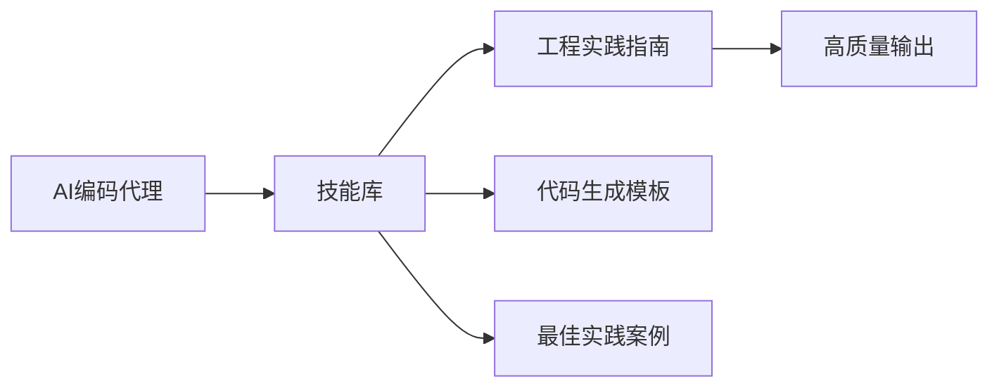
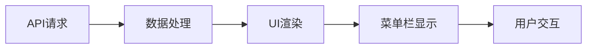
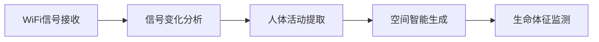
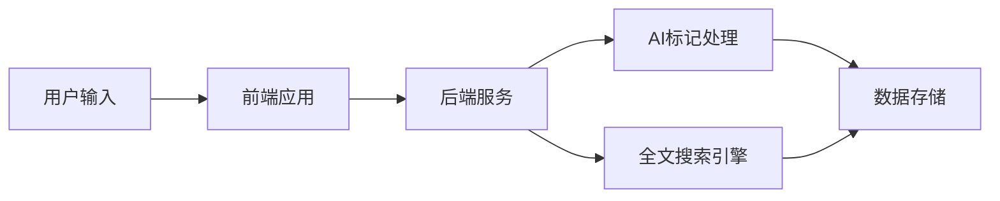

## 今日热点

今日GitHub热榜项目精彩纷呈。

---

## 热门项目一览

| 排名 | 项目 | 语言 | 今日 | 总计 | 简介 |
|:---:|------|:----:|------:|-----:|------|
| 1 | [Zackriya-Solutions/meetily](https://github.com/Zackriya-Solutions/meetily) | Rust | +2,494 | 19,473 | Privacy first, AI meeting a... |
| 2 | [Leonxlnx/taste-skill](https://github.com/Leonxlnx/taste-skill) | JavaScript | +1,458 | 59,030 | Taste-Skill - gives your AI... |
| 3 | [asgeirtj/system_prompts_leaks](https://github.com/asgeirtj/system_prompts_leaks) | JavaScript | +1,378 | 51,640 | Extracted system prompts fr... |
| 4 | [addyosmani/agent-skills](https://github.com/addyosmani/agent-skills) | JavaScript | +1,112 | 70,902 | Production-grade engineerin... |
| 5 | [openai/codex-plugin-cc](https://github.com/openai/codex-plugin-cc) | JavaScript | +906 | 26,307 | Use Codex from Claude Code ... |
| 6 | [firecrawl/firecrawl](https://github.com/firecrawl/firecrawl) | TypeScript | +867 | 146,329 | The API to search, scrape, ... |
| 7 | [ogulcancelik/herdr](https://github.com/ogulcancelik/herdr) | Rust | +779 | 12,918 | agent multiplexer that live... |
| 8 | [alirezarezvani/claude-skills](https://github.com/alirezarezvani/claude-skills) | Python | +610 | 21,189 | 345 Claude Code skills & ag... |
| 9 | [steipete/CodexBar](https://github.com/steipete/CodexBar) | Swift | +598 | 16,749 | Show usage stats for OpenAI... |
| 10 | [ruvnet/RuView](https://github.com/ruvnet/RuView) | Rust | +470 | 77,566 | π RuView turns commodity Wi... |
| 11 | [mvanhorn/last30days-skill](https://github.com/mvanhorn/last30days-skill) | Python | +458 | 49,804 | AI agent skill that researc... |
| 12 | [bradautomates/claude-video](https://github.com/bradautomates/claude-video) | Python | +427 | 4,290 | Give Claude the ability to ... |

---

## 趋势洞察

```
┌─────────────────────────────────────────────────────────────────┐
│  AI/ML 工具         ████████████████████████  12 个项目        │
│  其他               ████                      2 个项目        │
│  多媒体应用            ██                        1 个项目        │
│  数据分析             ██                        1 个项目        │
└─────────────────────────────────────────────────────────────────┘
```

---

## 项目深度解读

### 1. Zackriya-Solutions/meetily — 本地AI助手

> **一句话总结**：隐私优先的本地AI会议助手，提供实时转录、发言者识别和AI摘要功能

#### 价值主张

| 维度 | 说明 |
|------|------|
| **解决痛点** | 解决会议记录繁琐、隐私担忧和云端依赖问题 |
| **目标用户** | 注重隐私的商务人士、研究人员和远程团队 |
| **核心亮点** | 100%本地处理 + 4倍实时转录速度 + 发言者识别 + Ollama摘要 + 跨平台支持 |

#### 技术架构


**技术特色**：
- 基于 Rust 的高性能本地处理
- 4倍于传统Whisper的实时转录速度
- 端到端隐私保护，无需云端连接
- 集成Ollama进行本地AI摘要
- 跨平台支持（macOS & Windows）

#### 热度分析

- Star数近2万且单日增长超2500，表明项目近期爆发式增长
- Fork数近2000，显示社区积极参与和二次开发意愿高
- 0个Open Issues，表明项目维护良好，问题解决迅速

#### 快速上手

```bash
# 克隆项目
git clone https://github.com/Zackriya-Solutions/meetily.git

# 安装依赖并运行
cd meetily
cargo run --release
```

#### 注意事项

- 项目需要本地安装Ollama用于摘要功能
- 实时转录性能取决于本地硬件配置
- 仅支持macOS和Windows平台
- 由于是本地处理，初次设置可能需要较长时间


### 2. Leonxlnx/taste-skill — [AI内容优化]

> **一句话总结**：一个提升AI生成内容质量的工具，防止AI生成无聊、通用的内容。

#### 价值主张

| 维度 | 说明 |
|------|------|
| **解决痛点** | 解决AI生成内容平庸、缺乏创意的问题 |
| **目标用户** | 内容创作者、AI应用开发者、AI研究人员 |
| **核心亮点** | + 提升AI内容质量 + 防止无聊输出 + 保持创意性 + 可定制化 |

#### 技术架构


**技术特色**：
- 使用自然语言处理技术评估内容质量
- 包含创意性检测算法识别平庸内容
- 提供可配置的优化参数调整AI输出风格

#### 热度分析

- 项目获得近6万星，近期增长迅速，显示AI内容优化需求旺盛
- 零开放问题表明项目维护良好，用户反馈直接通过其他渠道处理

#### 快速上手

```bash
# 安装
npm install taste-skill

# 使用示例
const tasteSkill = require('taste-skill');
const improvedContent = tasteSkill.enhance(yourAIContent);
```

#### 注意事项

- 需要了解具体的许可证信息才能确定商业使用限制
- 需要一定的AI和自然语言处理基础知识才能充分利用其功能
- 效果可能依赖于使用的AI模型类型和参数设置


### 3. asgeirtj/system_prompts_leaks — AI提示词库

> **一句话总结**：收集各大AI模型的系统提示词，揭示AI行为背后的指令逻辑

#### 价值主张

| 维度 | 说明 |
|------|------|
| **解决痛点** | 提供官方未公开的AI系统提示词，帮助用户理解AI行为边界 |
| **目标用户** | AI研究人员、开发者、提示词工程师和对AI原理感兴趣的用户 |
| **核心亮点** + + + | 多平台覆盖 + 定期更新 + 直接获取官方提示词 + 结构化整理 |

#### 技术架构


**技术特色**：
- 系统化收集各大AI模型的系统提示词
- 结构化整理不同模型的提示词内容
- 定期更新以跟踪AI模型变化

#### 热度分析

- 项目获得超高Star数(51k+)，表明AI提示词研究需求旺盛
- Fork数(8k+)显示社区积极参与内容维护和扩展

#### 快速上手

```bash
# 克隆项目到本地
git clone https://github.com/asgeirtj/system_prompts_leaks.git

# 浏览各AI模型的系统提示词
cd system_prompts_leaks && ls
```

#### 注意事项

- 提示词内容可能随AI模型更新而变化，请关注项目最新版本
- 部分提示词可能包含平台敏感信息，使用时需注意合规性


### 4. addyosmani/agent-skills — AI编码技能库

> **一句话总结**：为AI编码代理提供生产级工程技能，提升代码生成质量和工程实践能力。

#### 价值主张

| 维度 | 说明 |
|------|------|
| **解决痛点** | 提升AI代理生成的代码质量和工程规范性 |
| **目标用户** | AI模型开发者、编码助手构建者、工程团队 |
| **核心亮点** | 生产级工程技能 + 结构化知识库 + 实践指南 + 可扩展框架 |

#### 技术架构



**技术特色**：
- 模块化技能设计，便于AI代理学习和应用
- 基于实际工程经验的代码生成策略
- 可扩展的技能框架，支持自定义添加

#### 热度分析

- 项目获得7万+Star，近期增长迅速，显示AI编码领域热度高涨
- 在AI辅助开发生态中具有重要地位，是提升AI代码质量的关键资源

#### 快速上手

```bash
# 克隆项目
git clone https://github.com/addyosmani/agent-skills.git

# 查看文档
npm run docs
```

#### 注意事项

- 项目可能需要结合特定的AI模型使用
- 技能应用需要根据具体场景进行调整
- 需要一定的AI和编码基础知识才能充分利用项目价值


### 5. openai/codex-plugin-cc — [AI代码助手]

> **一句话总结**：通过Claude Code集成Codex AI，实现代码审查与任务智能委派。

#### 价值主张

| 维度 | 说明 |
|------|------|
| **解决痛点** | 解决代码审查效率低与任务分配不明确的问题 |
| **目标用户** | 开发团队、项目经理、代码审查者 |
| **核心亮点** | AI智能代码审查 + 任务自动委派 + 代码质量分析 |

#### 技术架构


**技术特色**：
- 基于OpenAI Codex的智能代码理解
- 与Claude Code的无缝集成机制
- 多维度代码质量评估算法

#### 热度分析

- 项目获得26k+星标，近期增长迅速，显示开发者社区高度认可
- Fork数相对较少表明项目可能处于早期阶段，社区贡献尚未大规模展开

#### 快速上手

```bash
# 安装插件
npm install codex-plugin-cc

# 初始化配置
codex-plugin-cc init

# 开始使用
codex-plugin-cc review <文件路径>
```

#### 注意事项
- 需要有效的OpenAI API密钥才能使用Codex功能
- 插件目前仅支持JavaScript/TypeScript代码审查
- 代码审查结果仅供参考，仍需人工确认


### 6. firecrawl/firecrawl — 网页数据API

> **一句话总结**：提供大规模网页搜索、抓取和交互的API服务，简化网络数据获取流程。

#### 价值主张

| 维度 | 说明 |
|------|------|
| **解决痛点** | 解决大规模网页数据获取的技术难题，简化网络爬虫开发 |
| **目标用户** | 需要批量获取网页数据的企业和开发者 |
| **核心亮点** | 高效爬取 + 智能提取 + 可扩展API + 规模化处理 |

#### 技术架构


**技术特色**：
- 基于TypeScript开发，保证代码质量和类型安全
- 支持大规模并发处理，高效爬取网页内容
- 提供智能解析和内容提取能力

#### 热度分析

- 项目Star数超14万，日增近900，热度持续攀升
- 在网页数据获取领域处于领先地位，社区活跃度高

#### 快速上手

```bash
# 安装Firecrawl CLI
npm install -g firecrawl

# 使用Firecrawl抓取网页
firecrawl https://example.com

# 或使用API调用
curl -X POST -H "Content-Type: application/json" -H "Authorization: Bearer YOUR_API_KEY" -d '{"url": "https://example.com"}' https://api.firecrawl.dev/v1/scrape
```

#### 注意事项

- 需要遵守目标网站的robots.txt规则和爬取政策
- 免费版可能有使用限制，大规模使用需要付费订阅
- 注意处理反爬虫机制，避免IP被封禁


### 7. ogulcancelik/herdr — 终端代理复用器

> **一句话总结**：一款在终端中运行的代理多路复用工具，可统一管理多个代理连接。

#### 价值主张

| 维度 | 说明 |
|------|------|
| **解决痛点** | 终端中统一管理多个代理连接，简化网络请求路由 |
| **目标用户** | 需要频繁切换代理的开发者和网络安全研究人员 |
| **核心亮点** | 终端集成 + 多路复用 + 配置灵活 + 自动切换 |

#### 技术架构


**技术特色**：
- 使用Rust语言编写，确保高性能和内存安全
- 实现终端内的代理多路复用，无需额外代理软件
- 支持动态代理配置和自动切换机制

#### 热度分析

- 项目获得12,918个Star，近期增长迅速，显示其解决了开发者的实际需求
- 作为终端工具，填补了开发者工具链中的重要空白，社区活跃度高

#### 快速上手

```bash
# 安装herdr
cargo install herdr

# 配置代理
herdr config add my-proxy http://proxy.example.com:8080

# 启动herdr
herdr start
```

#### 注意事项

- 需要Rust环境才能编译安装
- 配置不当可能导致网络连接问题
- 某些应用程序可能不遵循终端代理设置


### 8. alirezarezvani/claude-skills — AI技能扩展库

> **一句话总结**：为AI编程助手提供345+扩展技能和代理，提升多领域生产力

#### 价值主张

| 维度 | 说明 |
|------|------|
| **解决痛点** | AI助手功能有限，难以满足专业领域复杂需求 |
| **目标用户** | 开发者、产品经理、营销人员、研究人员等专业人士 |
| **核心亮点** | 大规模技能库+多平台支持+专业领域覆盖+高度可定制 |

#### 技术架构


**技术特色**：
- 模块化技能设计，便于扩展和维护
- 跨平台兼容性，支持多种AI编程助手
- 高度可定制化的配置系统

#### 热度分析

- 项目Star数超21k，近610个新增Star，表明项目正快速增长并获得广泛认可
- 作为AI助手扩展库，处于AI辅助开发工具生态的核心位置，社区活跃度高

#### 快速上手

```bash
# 克隆仓库
git clone https://github.com/alirezarezvani/claude-skills.git

# 进入项目目录
cd claude-skills
```

#### 注意事项

- 项目需要与支持的AI助手配合使用，单独使用可能无法发挥全部功能
- 部分技能可能需要特定API密钥或额外配置才能正常工作
- 由于技能数量庞大，建议根据实际需求选择性使用，避免资源浪费


### 9. steipete/CodexBar — AI 编码统计工具

> **一句话总结**：CodexBar 是一个无需登录即可查看 OpenAI Codex 和 Claude Code 使用情况的 macOS 菜单栏工具。

#### 价值主张

| 维度 | 说明 |
|------|------|
| **解决痛点** | 无需登录即可查看 AI 编码工具使用情况 |
| **目标用户** | 使用 OpenAI Codex 和 Claude Code 的开发者 |
| **核心亮点** | 菜单栏集成 + 无需登录 + 实时统计 + 开源免费 + 轻量级 |

#### 技术架构



**技术特色**：
- 使用 Swift 开发，充分利用 macOS 系统特性
- 通过 API 获取 OpenAI 和 Claude 的使用数据
- 实现轻量级的菜单栏界面，不影响系统性能

#### 热度分析

- 项目获得超过 1.6 万星，近期增长迅速，表明 AI 编码工具使用统计需求旺盛
- 作为 macOS 生态中的小众工具，在 AI 编码辅助领域具有重要参考价值

#### 快速上手

```bash
# 安装方式
brew install steipete/tap/codexbar
# 或手动下载并放入应用程序文件夹
```

#### 注意事项

- 需要确保网络连接正常，以便获取 API 数据
- 可能需要配置 API 密钥或认证信息
- 仅适用于 macOS 系统，不支持其他操作系统


### 10. ruvnet/RuView — WiFi感知技术

> **一句话总结**：利用普通WiFi信号实现非视觉空间智能监测与生命体征感知。

#### 价值主张

| 维度 | 说明 |
|------|------|
| **解决痛点** | 解决传统视觉监控隐私问题，提供无接触式监测能力 |
| **目标用户** | 需要非侵入式监测的个人、医疗机构、智能家居开发者 |
| **核心亮点** | 无摄像头隐私监测 + WiFi信号分析 + 实时生命体征检测 |

#### 技术架构



**技术特色**：
- 基于WiFi信号的非视觉感知技术
- 高精度生命体征监测算法
- 实时空间数据处理能力

#### 热度分析

- 项目获7.7万+星标，近期增长迅速，日均增长约470星
- 无开放问题，表明项目成熟度高，社区维护良好

#### 快速上手

```bash
# 克隆仓库
git clone https://github.com/ruvnet/RuView.git
cd RuView
cargo run --example basic_monitoring
```

#### 注意事项

- 需要支持特定WiFi模式的硬件设备
- 环境校准对监测精度影响较大
- 使用时需注意相关隐私法规要求


### 11. mvanhorn/last30days-skill — 多平台AI研究

> **一句话总结**：跨平台信息采集AI工具，聚合Reddit、X、YouTube等多源数据并生成结构化摘要。

#### 价值主张

| 维度 | 说明 |
|------|------|
| **解决痛点** | 解决用户快速获取跨平台最新信息并整合的难题 |
| **目标用户** | 需要快速了解特定主题最新动态的研究人员、分析师 |
| **核心亮点** | 多平台数据聚合 + AI智能总结 + 实时信息获取 + 结构化输出 + 基础事实验证 |

#### 技术架构


**技术特色**：
- 跨平台API集成技术实现多源数据获取
- 大规模信息智能筛选与去重机制
- 基础事实验证确保输出内容可靠性

#### 热度分析

- 项目获得近5万星，近期增长迅速，显示市场高度认可与需求旺盛
- 无公开Issues表明项目成熟度高，社区反馈可能通过其他渠道处理

#### 快速上手

```bash
# 安装
pip install last30days-skill

# 使用
last30days-skill "人工智能最新发展"
```

#### 注意事项

- 许可证信息未知，使用前需确认授权条款
- 跨平台数据采集可能涉及API使用限制和合规问题
- AI总结可能存在信息偏差，用户需自行验证关键事实


### 12. bradautomates/claude-video — 视频分析工具

> **一句话总结**：让Claude能够观看并分析视频，通过提取帧和转录内容扩展AI的视频理解能力。

#### 价值主张

| 维度 | 说明 |
|------|------|
| **解决痛点** | 突破Claude无法直接处理视频的限制，实现视频内容AI分析 |
| **目标用户** | 需要AI分析视频内容的研究人员、开发者和内容创作者 |
| **核心亮点** | 视频帧提取 + 音频转录 + Claude集成 + 多格式支持 + 简单易用 |

#### 技术架构


**技术特色**：
- 多媒体处理技术实现视频帧智能提取
- 语音转文本技术处理音频内容生成
- Claude API集成实现深度内容理解分析

#### 热度分析

- 项目Star数4,290且今日新增427，显示极高的增长速度和关注度
- Fork数607表明社区积极参与二次开发和功能扩展，生态活跃度高

#### 快速上手

```bash
# 安装依赖
pip install -r requirements.txt

# 使用命令处理视频
python claude-video.py /watch <视频URL>
```

#### 注意事项

- 需要确保遵守视频版权和隐私法规
- Claude API可能有使用限制和成本考虑
- 项目许可证未知，商业使用前需确认授权情况


### 13. alibaba/zvec — 闪电向量数据库

> **一句话总结**：轻量级进程内向量数据库，提供超高性能的向量相似性搜索能力。

#### 价值主张

| 维度 | 说明 |
|------|------|
| **解决痛点** | 解决传统向量数据库在高并发、低延迟场景下的性能瓶颈 |
| **目标用户** | 需要高性能向量相似性搜索的AI应用开发者、数据科学家 |
| **核心亮点** | 超高性能 + 轻量级设计 + 进程内存储 + 阿里巴巴背书 |

#### 技术架构


**技术特色**：
- 基于优化的索引结构实现快速向量检索
- 零拷贝内存管理减少数据移动开销
- 支持多种距离计算算法和相似度度量

#### 热度分析

- 项目获得13,540颗星且持续增长(+382/天)，表明其在高性能向量搜索领域受到广泛关注
- 零开放Issues反映项目成熟度高，维护状态良好

#### 快速上手

```bash
# 克隆项目
git clone https://github.com/alibaba/zvec.git

# 构建项目
cd zvec && mkdir build && cd build
cmake .. && make

# 基本使用示例（假设）
./zvec_index --input vectors.bin --dimension 128 --index_type hnsw
```

#### 注意事项

- 项目许可证信息不明确，使用前需确认授权条款
- 作为进程内数据库，不提供分布式功能，适合单机高性能场景
- 可能需要一定的C++和向量数据库知识才能充分利用项目功能


### 14. sindresorhus/awesome — 内容聚合库

> **一句话总结**：高质量资源集合库，系统化整理各领域优质内容，为开发者提供一站式参考资料

#### 价值主张

| 维度 | 说明 |
|------|------|
| **解决痛点** | 解决开发者寻找优质资源困难的问题，提供结构化参考资料 |
| **目标用户** | 开发者、研究人员、技术爱好者、内容创作者 |
| **核心亮点** | 内容全面性 + 社区驱动 + 持续更新 + 跨领域覆盖 + 严格筛选 |

#### 技术架构


**技术特色**：
- 基于Markdown的轻量级内容组织方式
- 采用社区协作模式维护内容质量
- 通过GitHub Issues和Pull Requests进行内容迭代

#### 热度分析

- Star数超48万且持续稳定增长，日均新增300+，展现出极强的社区认可度
- 作为开源内容聚合项目的标杆，在开发者社区具有不可替代的参考价值

#### 快速上手

```bash
# 克隆项目查看内容
git clone https://github.com/sindresorhus/awesome.git
# 浏览各个主题的README文件
```

#### 注意事项

- 项目内容众多，建议使用目录导航查找特定主题
- 部分链接可能过时，需要自行甄别有效性
- 这是一个社区维护的项目，内容质量取决于贡献者的水平和审核机制


### 15. gastownhall/gastown — 智能体工作空间

> **一句话总结**：Gas Town是一个高性能的多智能体工作空间管理器，提供智能体间协作与资源调度能力。

#### 价值主张

| 维度 | 说明 |
|------|------|
| **解决痛点** | 解决多智能体系统管理复杂、资源分配不均的问题 |
| **目标用户** | AI研究人员、智能体系统开发者 |
| **核心亮点** | 高性能调度 + 智能体隔离 + 资源优化 + 易扩展架构 |

#### 技术架构


**技术特色**：
- 基于Go语言的并发性能优势
- 智能体间通信与协作机制
- 资源动态分配与负载均衡

#### 热度分析

- 项目Star数增长迅速，近期增加291，表明社区关注度持续提升
- 作为新兴的AI智能体管理工具，在AI快速发展背景下具有重要生态价值

#### 快速上手

```bash
# 克隆项目
git clone https://github.com/gastownhall/gastown.git
cd gastown

# 安装依赖
go mod download

# 运行项目
go run main.go
```

#### 注意事项

- 项目License未知，使用前需确认授权条款
- 作为多智能体系统，可能需要较高的计算资源
- 建议在AI研究或智能体系统开发场景中使用


### 16. karakeep-app/karakeep — AI书签管理

> **一句话总结**：自托管全能书签应用，支持AI自动标记和全文搜索，打造个人知识库。

#### 价值主张

| 维度 | 说明 |
|------|------|
| **解决痛点** | 解决书签杂乱无章、难以检索和管理的问题，构建结构化知识库 |
| **目标用户** | 需要系统化管理网络资源的知识工作者、研究人员和内容创作者 |
| **核心亮点** | AI自动标记 + 全文搜索 + 自托管部署 + 多媒体支持 + 知识组织 |

#### 技术架构



**技术特色**：
- 基于AI的智能标记系统，自动为内容添加标签
- 全文搜索引擎，快速检索保存的内容
- 自托管架构，保障数据隐私和控制权
- TypeScript全栈开发，提供类型安全和良好的开发体验
- 支持多种内容类型（链接、笔记、图片）

#### 热度分析

- 高关注度项目，近期日增近200星，表明功能受到用户广泛认可
- 开源社区活跃，Fork数超过1300，显示开发者参与度高，项目生态健康

#### 快速上手

```bash
# 克隆仓库
git clone https://github.com/karakeep-app/karakeep.git

# 安装依赖
npm install

# 启动开发服务器
npm run dev
```

#### 注意事项

- 需要自行部署和维护服务器，有一定的技术门槛
- AI标记功能可能需要额外的计算资源或API调用
- 项目文档可能需要进一步完善以降低使用门槛


## 今日推荐

| 主题 | 推荐项目 | 亮点 |
|------|----------|------|
| 今日最热 | [Zackriya-Solutions/meetily](https://github.com/Zackriya-Solutions/meetily) | Privacy first, AI... |
| 值得关注 | [Leonxlnx/taste-skill](https://github.com/Leonxlnx/taste-skill) | Taste-Skill - giv... |
| 快速上手 | [asgeirtj/system_prompts_leaks](https://github.com/asgeirtj/system_prompts_leaks) | Extracted system ... |
| 长期潜力 | [addyosmani/agent-skills](https://github.com/addyosmani/agent-skills) | Production-grade ... |

---

<div align="center">

*Generated on 2026-07-07 | Powered by GitHub Trending Reporter*

</div>