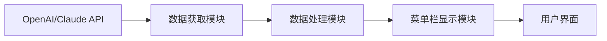

## 今日热点

AI代理工具与本地化解决方案成为主流，Claude Code生态迅速扩展，同时AI系统提示提取揭示模型工作原理，开发者正构建垂直领域专用AI助手。

---

## 热门项目一览

| 排名 | 项目 | 语言 | 今日 | 总计 | 简介 |
|:---:|------|:----:|------:|-----:|------|
| 1 | [MadsLorentzen/ai-job-search](https://github.com/MadsLorentzen/ai-job-search) | TypeScript | +2,514 | 11,096 | AI-powered job application ... |
| 2 | [Zackriya-Solutions/meetily](https://github.com/Zackriya-Solutions/meetily) | Rust | +1,777 | 20,793 | Privacy first, AI meeting a... |
| 3 | [asgeirtj/system_prompts_leaks](https://github.com/asgeirtj/system_prompts_leaks) | JavaScript | +1,691 | 53,051 | Extracted system prompts fr... |
| 4 | [addyosmani/agent-skills](https://github.com/addyosmani/agent-skills) | JavaScript | +1,317 | 72,202 | Production-grade engineerin... |
| 5 | [ruvnet/RuView](https://github.com/ruvnet/RuView) | Rust | +1,129 | 78,532 | π RuView turns commodity Wi... |
| 6 | [bradautomates/claude-video](https://github.com/bradautomates/claude-video) | Python | +965 | 5,203 | Give Claude the ability to ... |
| 7 | [iOfficeAI/OfficeCLI](https://github.com/iOfficeAI/OfficeCLI) | C# | +893 | 10,065 | OfficeCLI is the first and ... |
| 8 | [TencentCloud/CubeSandbox](https://github.com/TencentCloud/CubeSandbox) | Rust | +664 | 8,485 | Instant, Concurrent, Secure... |
| 9 | [kyutai-labs/pocket-tts](https://github.com/kyutai-labs/pocket-tts) | Python | +531 | 6,202 | A TTS that fits in your CPU... |
| 10 | [steipete/CodexBar](https://github.com/steipete/CodexBar) | Swift | +376 | 17,051 | Show usage stats for OpenAI... |
| 11 | [hesreallyhim/awesome-claude-code](https://github.com/hesreallyhim/awesome-claude-code) | Python | +144 | 49,145 | A hand-picked collection of... |
| 12 | [AhmadIbrahiim/Website-downloader](https://github.com/AhmadIbrahiim/Website-downloader) | HTML | +140 | 4,041 | 💡 Download the complete sou... |

---

## 趋势洞察

```
┌─────────────────────────────────────────────────────────────────┐
│  AI/ML 工具         ████████████████████████  11 个项目        │
│  多媒体应用            ████                      2 个项目        │
└─────────────────────────────────────────────────────────────────┘
```

---

## 项目深度解读

### 1. MadsLorentzen/ai-job-search — AI求职助手

> **一句话总结**：基于Claude Code构建的AI求职框架，自动化评估职位、定制简历与准备面试。

#### 价值主张

| 维度 | 说明 |
|------|------|
| **解决痛点** | 简化求职流程，自动化简历定制和申请准备 |
| **目标用户** | 寻找技术职位的求职者，特别是开发者 |
| **核心亮点** | AI职位评估 + 简历自动定制 + 求职信生成 + 面试准备 |

#### 技术架构


**技术特色**：
- 基于Claude Code构建的AI框架
- TypeScript实现，类型安全
- 模块化设计，易于扩展
- 自动化求职流程

#### 热度分析

- 项目获得11,096个Star，单日新增2,514，显示高度关注和快速增长
- 作为AI应用在求职领域的创新尝试，处于AI赋能传统流程的前沿位置

#### 快速上手

```bash
# Fork项目到个人账户
git clone https://github.com/your-username/ai-job-search.git
# 填写个人资料配置文件
# 运行Claude Code进行职位分析和申请
```

#### 注意事项

- 项目依赖Claude Code，需要确保访问权限
- 个人资料的质量会影响AI生成的效果
- 可能需要根据不同地区/行业的求职要求进行定制调整


### 2. Zackriya-Solutions/meetily — 隐私AI会议助手

> **一句话总结**：本地运行的隐私优先AI会议助手，提供快速转录、说话人识别和摘要功能。

#### 价值主张

| 维度 | 说明 |
|------|------|
| **解决痛点** | 解决会议记录繁琐、隐私泄露风险高、依赖云服务的问题 |
| **目标用户** | 注重隐私的商务人士、开发者和需要高效会议记录的用户 |
| **核心亮点** | 100%本地处理 + 4倍更快转录 + 说话人识别 + AI摘要 + 跨平台支持 |

#### 技术架构


**技术特色**：
- 基于Rust构建，性能优异且内存安全
- 采用4倍更快的Parakeet/Whisper转录引擎
- 完全本地化处理，确保数据隐私
- 集成Ollama进行本地AI摘要生成
- 支持macOS和Windows跨平台部署

#### 热度分析

- 项目Star数突破2万，单日增长近1800，显示极强的用户需求和市场认可度
- Fork数适中，表明项目有良好但不过度分叉的社区参与度
- Open Issues为0，可能表明项目成熟度高或问题处理机制高效

#### 快速上手

```bash
# 克隆仓库
git clone https://github.com/Zackriya-Solutions/meetily.git
# 进入项目目录
cd meetily
# 构建项目
cargo build --release
# 运行程序
./target/release/meetily
```

#### 注意事项

- 项目完全本地运行，需要足够的本地计算资源，特别是AI模型处理
- 需要安装依赖的AI模型（Parakeet/Whisper和Ollama）
- 许可证信息不明确，使用前需确认开源协议
- 项目专注于macOS和Windows，Linux支持可能有限


### 3. asgeirtj/system_prompts_leaks — AI提示库

> **一句话总结**：收集并公开各大AI模型的系统提示，为研究人员提供宝贵的内部工作原理资料。

#### 价值主张

| 维度 | 说明 |
|------|------|
| **解决痛点** | 解决AI模型系统提示不透明问题，揭示AI内部工作原理 |
| **目标用户** | AI研究人员、开发者、安全专家及技术爱好者 |
| **核心亮点** | 覆盖主流AI平台 + 定期更新 + 提供原始系统提示 + 结构化展示 |

#### 技术架构


**技术特色**：
- 直接提取原始系统提示，保持真实性
- 分类整理不同AI平台的提示信息
- 定期更新以适应模型变化

#### 热度分析

- 项目获53,051个Star，单日增长1,691，显示AI透明度研究热度高涨
- 作为AI可解释性研究的重要资源，在AI研究社区占据重要位置

#### 快速上手

```bash
git clone https://github.com/asgeirtj/system_prompts_leaks.git
cd system_prompts_leaks
```

#### 注意事项

- 系统提示可能随模型更新而变化，需关注项目最新更新
- 使用这些提示时需遵守相关AI平台的使用条款
- 提示信息可能包含敏感内容，使用时需注意隐私和合规问题


### 4. addyosmani/agent-skills — AI工程技能

> **一句话总结**：为AI编码代理提供生产级工程技能，提升代码生成质量与实用性。

#### 价值主张

| 维度 | 说明 |
|------|------|
| **解决痛点** | 提升AI生成代码的质量与实用性，解决AI编程助手输出代码不专业问题 |
| **目标用户** | AI开发者、编程助手构建者、自动化代码生成工具使用者 |
| **核心亮点** | 工程最佳实践集成 + 代码质量标准 + 可维护性优化 + 生产环境适用 |

#### 技术架构


**技术特色**：
- 模块化工程技能集成，便于AI代理调用
- 代码质量评估与优化机制
- 支持多种编程场景的技能适配

#### 热度分析

- 高Star数及快速增长(+1,317 today)显示AI编程领域需求旺盛
- Fork数适中表明社区积极参与但以使用为主，贡献度有待提升

#### 快速上手

```bash
# 克隆项目
git clone https://github.com/addyosmani/agent-skills.git

# 安装依赖
npm install
```

#### 注意事项

- 需要配合AI编码框架使用，单独使用可能效果有限
- 不同编程语言和场景可能需要特定配置
- 持续更新以适应AI编码技术发展


### 5. ruvnet/RuView — [WiFi感知技术]

> **一句话总结**：利用普通WiFi信号实现无摄像头空间感知、生命体征监测和存在检测的技术。

#### 价值主张

| 维度 | 说明 |
|------|------|
| **解决痛点** | 解决无摄像头场景下的空间感知与生命体征监测需求 |
| **目标用户** | 需要隐私保护的监控系统、智能家居开发者、医疗健康监测机构 |
| **核心亮点** | 无视觉依赖 + 实时监测 + 低成本硬件 + 高隐私保护 |

#### 技术架构


**技术特色**：
- 利用WiFi信道状态信息(CSI)进行环境感知
- 通过多普勒效应检测人体微运动
- 无需专用硬件，使用普通WiFi设备即可
- 采用Rust语言实现高性能信号处理
- 提供实时API与数据可视化功能

#### 热度分析

- 项目Star数超过7.8万，近一天增长1,129，显示极高关注度与快速增长趋势
- Fork数达1万+，表明开发者社区活跃度高，技术方案被广泛认可与应用

#### 快速上手

```bash
# 克隆项目仓库
git clone https://github.com/ruvnet/RuView.git

# 构建项目
cd RuView && cargo build --release
```

#### 注意事项

- 需要支持CSI(信道状态信息)的WiFi网卡才能正常工作
- 实际效果受环境布局和WiFi信号强度影响较大
- 可能需要调整算法参数以适应特定使用场景
- 项目尚未明确许可证，使用时需注意合规性


### 6. bradautomates/claude-video — 视频分析助手

> **一句话总结**：为 Claude AI 提供视频内容分析能力，通过帧提取和转录实现视频理解。

#### 价值主张

| 维度 | 说明 |
|------|------|
| **解决痛点** | 让 Claude 无法直接处理视频内容的限制，扩展AI视频分析能力 |
| **目标用户** | 需要AI分析视频内容的研究人员和开发者 |
| **核心亮点** | 视频帧提取 + 音频转录 + 多模态内容整合 + Claude API集成 |

#### 技术架构


**技术特色**：
- 多模态数据处理技术
- 高效视频帧提取算法
- 音视频内容智能转录

#### 热度分析

- 项目短期内获得大量关注（单日增长965星），表明AI视频分析领域需求旺盛
- 社区活跃度高，Fork数合理，显示技术方案被广泛认可

#### 快速上手

```bash
# 安装依赖
pip install -r requirements.txt

# 运行视频分析
python claude-video.py --url [视频URL]
```

#### 注意事项

- 项目许可证未知，商业使用前需确认版权问题
- 依赖Claude API，需确保API配额充足
- 处理大型视频可能需要较高计算资源


### 7. iOfficeAI/OfficeCLI — AI Office工具

> **一句话总结**：为AI代理设计的轻量级Office套件，无需安装即可操作Word、Excel和PowerPoint文件。

#### 价值主张

| 维度 | 说明 |
|------|------|
| **解决痛点** | 解决AI代理无法直接处理Office文件的问题，无需安装Office |
| **目标用户** | AI开发者、自动化脚本编写者、需要处理Office文件的智能系统 |
| **核心亮点** | 单二进制文件 + 无需安装Office + 支持多种Office格式 + 专为AI优化 |

#### 技术架构


**技术特色**：
- 使用C#开发的轻量级解析器，无需依赖Office组件
- 提供命令行接口，便于AI代理调用
- 支持Word、Excel和PowerPoint三种主流Office格式

#### 热度分析

- 项目获得1万+星标，单日新增近900星，表明社区对AI工具Office集成的强烈需求
- 零开放问题反映项目成熟度高，可能已稳定用于生产环境

#### 快速上手

```bash
# 安装（假设已编译为单一可执行文件）
./officecli --help

# 基本使用示例
officecli read document.docx
officecli edit spreadsheet.xlsx --formula "A1+B1"
officecli convert presentation.pptx --format pdf
```

#### 注意事项

- 项目许可信息未知，使用前需确认开源许可条款
- 虽然无需安装Office，但可能需要.NET运行时环境
- 对于复杂Office文档的处理能力可能有限，建议测试后再用于生产环境


### 8. TencentCloud/CubeSandbox — AI安全沙箱

> **一句话总结**：为AI Agent提供即时、并发、安全的轻量级沙箱环境。

#### 价值主张

| 维度 | 说明 |
|------|------|
| **解决痛点** | 解决AI Agent运行时的安全隔离与资源限制问题 |
| **目标用户** | AI开发者、研究人员和企业应用构建者 |
| **核心亮点** | 即时启动 + 并发执行 + 安全隔离 + 轻量级设计 |

#### 技术架构

**技术特色**：
- 基于 Rust 语言构建，确保内存安全和并发性能
- 提供细粒度的资源控制和隔离机制
- 支持多 AI Agent 并发执行而相互干扰
- 实现了低开销的进程隔离机制

#### 热度分析

- Star 数量快速增长（+664 today），表明项目受社区高度关注
- 作为腾讯云开源项目，在云服务和AI安全领域具有重要影响力

#### 快速上手

```bash
# 克隆仓库
git clone https://github.com/TencentCloud/CubeSandbox.git

# 编译项目
cd CubeSandbox && cargo build --release

# 运行示例
cargo run --example basic_sandbox
```

#### 注意事项

- 需要了解 Rust 编程语言才能进行二次开发
- 项目许可证信息不明确，使用前需确认授权条款
- 作为安全沙箱，可能需要配置适当的资源限制策略
- 确保系统满足 Rust 运行环境要求


### 9. kyutai-labs/pocket-tts — 轻量级TTS引擎

> **一句话总结**：轻量级文本转语音系统，专为CPU优化，实现高性能离线语音合成。

#### 价值主张

| 维度 | 说明 |
|------|------|
| **解决痛点** | 解决TTS系统依赖GPU/云端资源，无法在本地设备高效运行的问题 |
| **目标用户** | 开发者、内容创作者、需要离线语音功能的开发者 |
| **核心亮点** | 轻量级设计+纯CPU运行+高质量语音合成+开源可用+易于集成 |

#### 技术架构


**技术特色**：
- 纯Python实现，无需GPU依赖
- 优化的神经声学模型，在普通CPU上运行流畅
- 轻量级设计，模型体积小，适合资源受限环境

#### 热度分析

- 项目短时间内获得大量关注，单日新增531个star，显示社区高度认可
- 作为开源TTS解决方案，填补了轻量级离线语音合成领域的空白

#### 快速上手

```bash
# 安装
pip install -e .

# 使用
pocket-tts "Hello, this is a test."
```

#### 注意事项

- 项目许可证信息未知，使用前需确认
- 可能需要预训练模型才能运行
- 语音质量可能与云端服务有差距
- 可能需要特定Python版本依赖


### 10. steipete/CodexBar — AI统计工具

> **一句话总结**：一款无需登录即可展示OpenAI Codex和Claude Code使用统计的macOS菜单栏工具。

#### 价值主张

| 维度 | 说明 |
|------|------|
| **解决痛点** | 解决开发者需登录才能查看AI编码助手使用统计的问题 |
| **目标用户** | 使用OpenAI Codex和Claude Code的macOS开发者 |
| **核心亮点** | 菜单栏集成 + 实时数据展示 + 隐私保护 + 无需登录 |

#### 技术架构



**技术特色**：
- 使用Swift编写的macOS原生应用，性能优异
- 实现本地数据缓存机制，减少API调用
- 菜单栏集成设计，不干扰用户工作流程

#### 热度分析

- 项目星数突破17k，单日增长376，表明开发者社区对此类工具有强烈需求
- Fork数量适中(1.3k)，说明项目有一定活跃度但可能不是高度定制化的类型

#### 快速上手

```bash
# 克隆仓库
git clone https://github.com/steipete/CodexBar.git

# 构建项目
cd CodexBar
xcodebuild -project CodexBar.xcodeproj -scheme CodexBar build
```

#### 注意事项

- 需要确保有有效的OpenAI和Claude API访问权限
- 可能需要macOS系统特定版本支持
- 项目许可证未知，使用前需确认商业使用限制


### 11. hesreallyhim/awesome-claude-code — Claude资源精选

> **一句话总结**：精选Claude Code编程助手最佳资源集合，提供插件、工具和优质开发体验。

#### 价值主张

| 维度 | 说明 |
|------|------|
| **解决痛点** | 为Claude Code用户集中整理优质资源和插件，解决发现和筛选难题 |
| **目标用户** | 使用Claude Code的AI编程助手用户和开发者 |
| **核心亮点** | 精选资源 + 插件生态 + 开发工具集成 + 状态线优化 + 双向能力支持 |

#### 技术架构


**技术特色**：
- 采用awesome-list标准格式，便于维护和导航
- 精心筛选资源，确保质量相关性
- 结构化分类，提升资源查找效率

#### 热度分析

- Star数近5万且持续增长，显示Claude Code生态快速发展，用户需求旺盛
- 无开放问题表明项目维护良好，资源质量稳定，社区参与度高

#### 快速上手

```bash
# 克隆项目获取完整资源列表
git clone https://github.com/hesreallyhim/awesome-claude-code.git

# 访问README.md查看分类资源和直接链接
cat awesome-claude-code/README.md
```

#### 注意事项

- 项目依赖Claude Code服务，需确保API访问权限
- 部分插件可能需要额外配置或订阅
- 资源质量会随时间变化，建议定期检查更新


### 12. AhmadIbrahiim/Website-downloader — 网站完整下载器

> **一句话总结**：基于Node.js的网站全资源下载工具，可完整捕获网页及其所有依赖资源。

#### 价值主张

| 维度 | 说明 |
|------|------|
| **解决痛点** | 解决网站完整离线保存需求，保留原始结构和所有资源 |
| **目标用户** | 网站开发者、内容创作者、研究人员和需要网站备份的用户 |
| **核心亮点** | 完整资源下载 + 保持目录结构 + Node.js跨平台支持 + 递归抓取 |

#### 技术架构


**技术特色**：
- 使用Node.js实现跨平台兼容性
- 递归抓取确保资源完整性
- 保持原有网站目录结构保存

#### 热度分析

- 项目获得4000+ Star且增长迅速，显示社区对网站完整下载工具的强烈需求
- 近1000次Fork表明项目被广泛使用和二次开发，在网站抓取领域有影响力

#### 快速上手

```bash
# 安装依赖
npm install

# 下载网站
node index.js https://example.com
```

#### 注意事项

- 需遵守网站的robots.txt和版权信息，尊重网站所有者的规则
- 大型网站下载可能消耗大量时间和带宽
- 某些网站可能有反爬虫机制，可能导致下载失败
- 动态生成的内容可能无法正确获取


### 13. dotnet/skills — [.NET AI技能库]

> **一句话总结**：为AI编程代理提供.NET和C#开发技能库，提升AI辅助开发能力

#### 价值主张

| 维度 | 说明 |
|------|------|
| **解决痛点** | AI代理缺乏专业.NET开发指导，难以生成高质量代码 |
| **目标用户** | AI编程工具开发者、.NET开发人员、AI研究人员 |
| **核心亮点** | 结构化技能库 + 多场景覆盖 + .NET最佳实践集成 |

#### 技术架构


**技术特色**：
- 采用结构化JSON定义技能，便于AI理解和执行
- 提供多层次的.NET开发技能，从基础到高级
- 技能库可扩展，支持社区贡献和持续更新

#### 热度分析

- 项目Star数持续增长(+64 today)，表明社区关注度上升，AI辅助开发领域热度高
- 作为微软生态项目，在.NET开发社区具有独特影响力，连接AI与开发工具链

#### 快速上手

```bash
# 克隆项目
git clone https://github.com/dotnet/skills.git

# 查看技能目录
cd skills && ls -R
```

#### 注意事项

- 许可证信息不明确，使用前需确认授权条款
- 技能库可能随.NET版本更新而需要维护，注意版本兼容性


## 今日推荐

| 主题 | 推荐项目 | 亮点 |
|------|----------|------|
| 今日最热 | [MadsLorentzen/ai-job-search](https://github.com/MadsLorentzen/ai-job-search) | AI-powered job ap... |
| 值得关注 | [Zackriya-Solutions/meetily](https://github.com/Zackriya-Solutions/meetily) | Privacy first, AI... |
| 快速上手 | [asgeirtj/system_prompts_leaks](https://github.com/asgeirtj/system_prompts_leaks) | Extracted system ... |
| 长期潜力 | [addyosmani/agent-skills](https://github.com/addyosmani/agent-skills) | Production-grade ... |

---

<div align="center">

*Generated on 2026-07-08 | Powered by GitHub Trending Reporter*

</div>