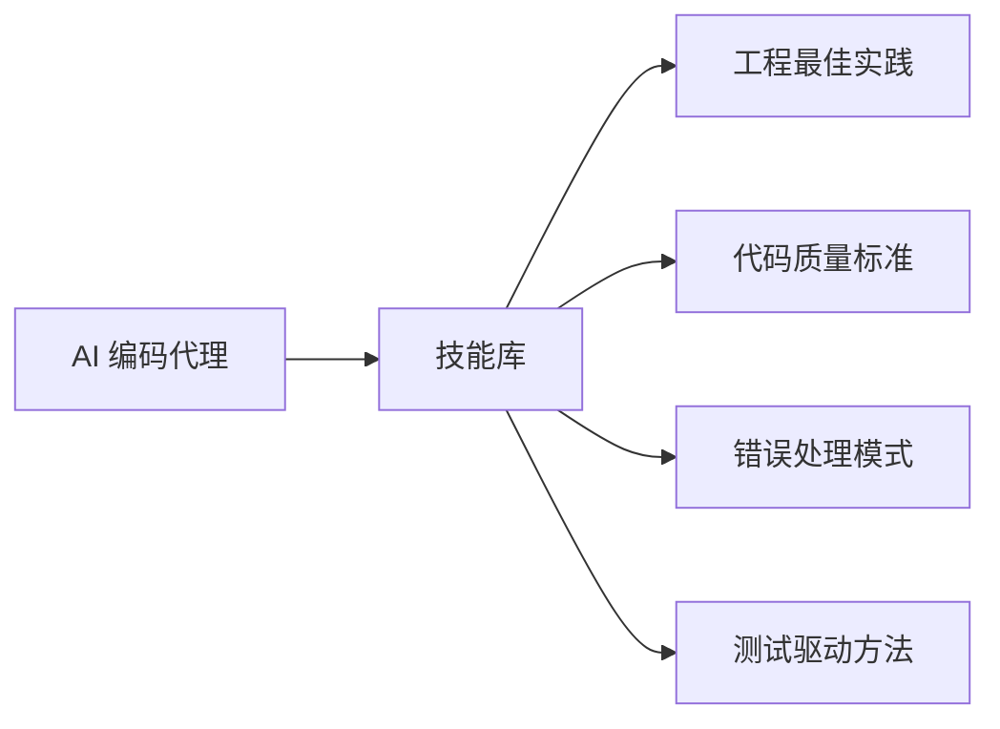
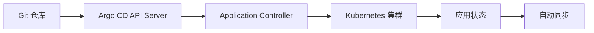
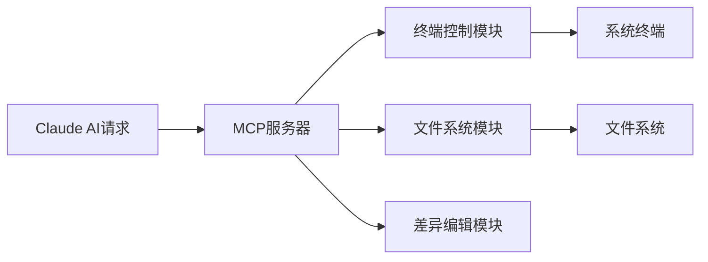

## 今日热点

AI代理能力爆发式增长，工具生态迅速完善，从记忆系统到办公自动化，AI正加速融入各工作流程并与传统软件深度融合。

---

## 热门项目一览

| 排名 | 项目 | 语言 | 今日 | 总计 | 简介 |
|:---:|------|:----:|------:|-----:|------|
| 1 | [iOfficeAI/OfficeCLI](https://github.com/iOfficeAI/OfficeCLI) | C# | +1,717 | 11,964 | OfficeCLI is the first and ... |
| 2 | [addyosmani/agent-skills](https://github.com/addyosmani/agent-skills) | JavaScript | +1,297 | 74,220 | Production-grade engineerin... |
| 3 | [asgeirtj/system_prompts_leaks](https://github.com/asgeirtj/system_prompts_leaks) | JavaScript | +1,218 | 54,249 | Extracted system prompts fr... |
| 4 | [Diolinux/PhotoGIMP](https://github.com/Diolinux/PhotoGIMP) | CSS | +1,125 | 15,056 | A Patch for GIMP 3+ for Pho... |
| 5 | [obra/superpowers](https://github.com/obra/superpowers) | Shell | +1,116 | 249,875 | An agentic skills framework... |
| 6 | [bradautomates/claude-video](https://github.com/bradautomates/claude-video) | Python | +951 | 6,088 | Give Claude the ability to ... |
| 7 | [ruvnet/RuView](https://github.com/ruvnet/RuView) | Rust | +799 | 79,169 | π RuView turns commodity Wi... |
| 8 | [TencentCloud/CubeSandbox](https://github.com/TencentCloud/CubeSandbox) | Rust | +564 | 8,954 | Instant, Concurrent, Secure... |
| 9 | [alibaba/zvec](https://github.com/alibaba/zvec) | C++ | +395 | 14,434 | A lightweight, lightning-fa... |
| 10 | [mvanhorn/last30days-skill](https://github.com/mvanhorn/last30days-skill) | Python | +352 | 50,784 | AI agent skill that researc... |
| 11 | [TencentCloud/TencentDB-Agent-Memory](https://github.com/TencentCloud/TencentDB-Agent-Memory) | TypeScript | +318 | 7,689 | TencentDB Agent Memory deli... |
| 12 | [huxingyi/autoremesher](https://github.com/huxingyi/autoremesher) | C++ | +296 | 2,033 | Automatic quad remeshing tool |

---

## 趋势洞察

```
┌─────────────────────────────────────────────────────────────────┐
│  AI/ML 工具         ████████████████████████  9 个项目        │
│  其他               ████████                  3 个项目        │
│  多媒体应用            ██                        1 个项目        │
│  开发工具             ██                        1 个项目        │
│  数据分析             ██                        1 个项目        │
└─────────────────────────────────────────────────────────────────┘
```

---

## 项目深度解读

### 1. iOfficeAI/OfficeCLI — AI Office工具集

> **一句话总结**：OfficeCLI是专为AI代理设计的轻量级Office文件处理工具，无需安装Office即可操作Word、Excel和PowerPoint文件。

#### 价值主张

| 维度 | 说明 |
|------|------|
| **解决痛点** | 解决AI代理无法直接处理Office文件的问题，无需安装Office套件 |
| **目标用户** | AI开发者、自动化脚本编写者、需要批量处理Office文件的用户 |
| **核心亮点** | 单一可执行文件 + 无Office依赖 + 支持AI集成 + 跨平台兼容 + 开源免费 |

#### 技术架构


**技术特色**：
- 使用C#开发，提供高性能的Office文档处理能力
- 单一可执行文件设计，无需依赖Office组件
- 提供简洁的命令行接口，便于AI集成

#### 热度分析

- 项目近期获得大量关注（单日新增1700+星），表明AI与Office自动化结合需求强烈
- 相对较少的fork数（812）表明用户更倾向于直接使用而非二次开发，工具成熟度高

#### 快速上手

```bash
# 安装OfficeCLI（假设通过GitHub Releases获取）
wget https://github.com/iOfficeAI/OfficeCLI/releases/latest/download/officecli
chmod +x officecli

# 使用示例
officecli word --input document.docx --output modified.docx --replace "old text" "new text"
officecli excel --input data.xlsx --output summary.xlsx --formula "SUM(A1:A10)"
```

#### 注意事项

- 项目许可证未知，商业使用前需确认授权方式
- 可能存在与最新Office格式的兼容性问题
- 命令行参数和功能可能随版本更新而变化，需参考最新文档


### 2. addyosmani/agent-skills — AI 编程技能库

> **一句话总结**：为 AI 编码代理提供生产级工程技能，提升生成代码质量与工程实践能力。

#### 价值主张

| 维度 | 说明 |
|------|------|
| **解决痛点** | 解决 AI 编码代理缺乏工程最佳实践问题，提升代码质量 |
| **目标用户** | AI 编码代理开发者、AI 工程师、代码质量研究者 |
| **核心亮点** | 提供工程最佳实践 + 代码质量标准 + 工程化流程 + 错误处理模式 + 测试驱动方法 |

#### 技术架构



**技术特色**：
- 聚焦 AI 编程代理的生产级工程能力
- 提供结构化的代码质量标准
- 强调工程化流程与最佳实践

#### 热度分析

- 项目获 74k+ 星标且近期增长迅速，在 AI 编程辅助领域具有重要影响力
- 作为 AI 工程实践的重要参考资源，在开发者社区中有较高认可度

#### 快速上手

```bash
# 克隆仓库
git clone https://github.com/addyosmani/agent-skills.git
# 安装依赖
npm install
# 查看文档
npm run docs
```

#### 注意事项

- 项目许可证信息未知，使用前需确认授权条款
- Issue 数为 0，可能采用其他问题处理机制或反馈渠道


### 3. asgeirtj/system_prompts_leaks — AI系统提示词库

> **一句话总结**：收集并整理各大主流AI模型的系统提示词，为开发者和研究人员提供宝贵参考。

#### 价值主张

| 维度 | 说明 |
|------|------|
| **解决痛点** | 揭秘AI模型行为边界，帮助开发者理解模型工作原理 |
| **目标用户** | AI开发者、研究人员、AI模型爱好者 |
| **核心亮点** | 多平台覆盖 + 定期更新 + 实用性强 + 社区驱动 + 结构化整理 |

#### 技术架构


**技术特色**：
- 轻量级数据结构，便于检索和使用
- 版本控制系统，确保信息可追溯
- 社区协作机制，持续更新内容

#### 热度分析

- 项目Star数超5万且持续快速增长，反映AI社区对系统提示词的高度关注
- 高Fork比例表明项目被广泛用作参考和二次开发的基础资源

#### 快速上手

```bash
# 克隆项目到本地
git clone https://github.com/asgeirtj/system_prompts_leaks.git

# 查看所有AI模型的系统提示词
ls system_prompts_leaks/
```

#### 注意事项

- 收集的系统提示词可能非官方发布，使用时需验证准确性
- AI模型系统提示词会随版本更新而变化，建议定期关注项目更新
- 部分提示词可能受版权保护，商业使用前需确认授权情况
- 不要直接复制粘贴提示词用于商业AI服务，可能违反使用条款


### 4. Diolinux/PhotoGIMP — [Photoshop风格GIMP]

> **一句话总结**：为GIMP 3+添加Photoshop风格界面，帮助Photoshop用户快速适应开源图像编辑器。

#### 价值主张

| 维度 | 说明 |
|------|------|
| **解决痛点** | 解决Photoshop用户转向GIMP时的界面适应问题 |
| **目标用户** | 从Photoshop迁移到GIMP的设计师和图像编辑者 |
| **核心亮点** | Photoshop风格界面布局 + 熟悉的工具位置 + 保留GIMP核心功能 |

#### 技术架构


**技术特色**：
- 基于CSS的界面重设计，无需修改GIMP核心代码
- 保持GIMP功能完整性的同时优化用户界面
- 轻量级实现，不影响GIMP性能

#### 热度分析

- 项目获得超过15,000星，近期增长迅速(+1,125 today)，表明市场需求旺盛
- 相对较高的star/fork比例(15,056/597)，说明用户更倾向于使用而非分叉修改

#### 快速上手

```bash
# 下载PhotoGIMP
git clone https://github.com/Diolinux/PhotoGIMP.git

# 应用补丁到GIMP安装目录
cp -r PhotoGIMP/themes ~/.config/gimp/3.0/
```

#### 注意事项

- 需要先安装GIMP 3+才能应用此补丁
- 可能会与GIMP未来版本不兼容，需要关注项目更新
- 仅改变界面外观，不添加Photoshop特有的功能


### 5. obra/superpowers — 智能技能框架

> **一句话总结**：提供智能化的技能框架和实用软件开发方法论，提升开发效率和代码质量。

#### 价值主张

| 维度 | 说明 |
|------|------|
| **解决痛点** | 解决软件开发中技能分散、方法论缺失的问题 |
| **目标用户** | 软件开发者、技术团队和项目管理专业人士 |
| **核心亮点** | 智能化技能框架 + 实用方法论 + 高效工作流 |

#### 技术架构


**技术特色**：
- 基于Shell的轻量级工具集
- 模块化技能框架设计
- 自动化工作流支持

#### 热度分析

- 近25万stars，日增1000+，表明项目获得开发者广泛认可
- 零开放问题，反映项目成熟度高且维护完善

#### 快速上手

```bash
# 克隆项目
git clone https://github.com/obra/superpowers.git
# 进入目录
cd superpowers
# 初始化框架
./init.sh
```

#### 注意事项

- 需要基本的Shell环境和命令行操作能力
- 建议先阅读项目文档理解方法论核心思想
- 框架可能需要根据个人或团队特点进行定制调整


### 6. bradautomates/claude-video — 视频AI分析

> **一句话总结**：通过视频帧提取与转录，赋予Claude"观看"并理解视频内容的能力。

#### 价值主张

| 维度 | 说明 |
|------|------|
| **解决痛点** | 为AI助手提供视频内容理解能力，打破文本交互限制 |
| **目标用户** | AI研究人员、内容创作者、视频分析师 |
| **核心亮点** | 多模态视频处理 + 完整信息提取 + Claude API集成 |

#### 技术架构


**技术特色**：
- 高效视频帧提取算法，降低处理资源消耗
- 多模态信息整合，将视觉和文本信息统一处理
- Claude API深度集成，优化视频内容理解流程

#### 热度分析

- 项目短期内获得大量关注，单日新增近千星，表明视频AI分析需求旺盛
- 无开放Issues反映项目成熟度高，用户问题解决渠道畅通

#### 快速上手

```bash
# 安装依赖
pip install -r requirements.txt

# 运行视频分析
python claude_video.py /watch [视频URL]
```

#### 注意事项

- 需要确保Claude API密钥配置正确
- 处理长视频可能需要大量计算资源和时间
- 注意视频内容的版权和使用限制


### 7. ruvnet/RuView — [WiFi感知技术]

> **一句话总结**：利用普通WiFi信号实现非接触式空间感知与生命体征监测的创新技术。

#### 价值主张

| 维度 | 说明 |
|------|------|
| **解决痛点** | 无需摄像头即可实现空间感知与生命体征监测，解决隐私保护问题 |
| **目标用户** | 需要非接触式监测的家庭、医疗机构、安全系统开发者 |
| **核心亮点** | WiFi信号感知 + 实时分析 + 隐私保护 + 无需视觉设备 |

#### 技术架构


**技术特色**：
- 利用WiFi信号多径效应进行人体活动感知
- 通过信号波动分析提取呼吸、心率等生命体征
- 不依赖任何视觉设备，完全基于无线信号处理

#### 热度分析

- 项目获得近8万星，日增近800星，增长迅猛，显示市场高度认可
- Fork数过万，表明开发者社区积极参与技术二次开发和扩展应用

#### 快速上手

```bash
# 克隆仓库
git clone https://github.com/ruvnet/RuView.git

# 构建项目
cd RuView && cargo build --release
```

#### 注意事项
- 项目依赖特定的硬件设备支持，不是所有WiFi适配器都能正常工作
- 信号处理效果受环境因素影响较大，在复杂环境中精度可能降低
- 需要一定的Rust编程基础进行定制化开发


### 8. TencentCloud/CubeSandbox — AI沙箱框架

> **一句话总结**：为AI Agent提供即时、安全、轻量级的并发沙箱执行环境。

#### 价值主张

| 维度 | 说明 |
|------|------|
| **解决痛点** | 解决AI Agent执行环境的安全隔离与资源限制问题 |
| **目标用户** | AI应用开发者、模型安全研究员、AI系统架构师 |
| **核心亮点** | 高并发安全隔离 + 资源高效利用 + 低延迟执行 + Rust内存安全 |

#### 技术架构


**技术特色**：
- 基于Rust实现内存安全，防止内存泄漏和越界访问
- 采用细粒度资源隔离，确保各Agent间的安全边界
- 高效的并发调度机制，最大化资源利用率
- 轻量级设计，减少系统开销

#### 热度分析

- 项目近期Star增长显著，单日新增564，显示社区高度关注
- Fork数量适中，表明项目处于活跃开发阶段，但尚未形成大规模生态
- 0个Open Issues反映项目维护状况良好，问题响应及时

#### 快速上手

```bash
# 安装CubeSandbox
cargo install cube-sandbox

# 创建AI Agent沙箱环境
cube-sandbox create --name my_agent --memory 512 --cpu 0.5

# 在沙箱中运行AI Agent
cube-sandbox run --agent my_agent --script agent_script.py
```

#### 注意事项

- 项目使用Rust开发，需要一定的Rust语言基础
- 沙箱环境配置需要合理设置资源限制，避免资源竞争
- 对于复杂AI模型，可能需要调整沙箱参数以优化性能


### 9. alibaba/zvec — 极速向量检索

> **一句话总结**：轻量级、闪电般快速的进程内向量数据库，专为高性能向量检索而设计。

#### 价值主张

| 维度 | 说明 |
|------|------|
| **解决痛点** | 解决传统向量数据库延迟高、资源占用大的问题 |
| **目标用户** | 需要高性能向量检索的AI应用开发者和数据科学家 |
| **核心亮点** | 超高性能 + 轻量级设计 + 进程内集成 + 零拷贝操作 + 内存优化 |

#### 技术架构


**技术特色**：
- 基于内存的向量索引结构，实现极低延迟
- 优化的向量计算算法，减少CPU计算开销
- 零拷贝数据访问机制，最大化I/O效率
- 精简的内存管理，最小化资源占用

#### 热度分析

- 项目获得14,434个Star，近期增长迅速(+395/天)，表明其在向量数据库领域受到高度关注
- 作为阿里巴巴开源项目，在企业级应用场景中具有较强影响力，社区活跃度高

#### 快速上手

```bash
# 克隆仓库
git clone https://github.com/alibaba/zvec.git

# 构建项目
cd zvec && mkdir build && cd build
cmake .. && make
```

#### 注意事项

- 项目目前未明确许可证信息，使用前需确认开源协议
- 作为进程内数据库，不适用于分布式场景
- 需要一定的C++和向量数据库知识才能充分利用其性能优势


### 10. mvanhorn/last30days-skill — 跨平台AI研究

> **一句话总结**：AI代理技能，跨平台研究任意话题并生成基于事实的综合摘要。

#### 价值主张

| 维度 | 说明 |
|------|------|
| **解决痛点** | 解决跨平台信息过载，提供结构化、全面的研究摘要 |
| **目标用户** | 研究人员、分析师、内容创作者和决策者 |
| **核心亮点** | 多平台数据整合 + AI智能分析 + 基于事实的总结 + 自动化研究流程 + 实时信息获取 |

#### 技术架构


**技术特色**：
- 跨平台API集成技术，支持Reddit、X、YouTube等多源数据
- 基于LLM的内容分析与结构化提取
- 智能过滤与验证机制，确保信息可靠性
- 自动化研究工作流，减少人工干预

#### 热度分析

- 项目获得5万+星标，日增350+，显示强烈市场认可度
- 零开放问题表明项目成熟度高，社区维护良好

#### 快速上手

```bash
# 安装依赖
pip install last30days-skill

# 基本使用
last30days-skill "研究主题"
```

#### 注意事项
- 需要各平台API访问权限，可能需要额外配置
- 摘要质量依赖于输入数据的质量和覆盖范围
- 定期更新API密钥以确保数据采集功能正常


### 11. TencentCloud/TencentDB-Agent-Memory — AI本地记忆引擎

> **一句话总结**：通过四层渐进式管道为AI代理提供完全本地化的长期记忆能力，无需外部API依赖。

#### 价值主张

| 维度 | 说明 |
|------|------|
| **解决痛点** | 解决AI长期记忆依赖外部API的隐私与可靠性问题 |
| **目标用户** | 需要本地化长期记忆的AI应用开发者和研究人员 |
| **核心亮点** | 四层渐进架构 + 完全本地存储 + 零外部依赖 + 高效检索机制 |

#### 技术架构


**技术特色**：
- 四层渐进式记忆架构，确保记忆的完整性和可用性
- 完全本地化存储，保护用户隐私和数据安全
- 高效的记忆检索机制，支持长期记忆的快速调用

#### 热度分析

- 项目获得7689个Star，单日增长318，显示项目受到广泛关注
- Fork数为711，表明社区活跃度高，开发者积极尝试和贡献

#### 快速上手

```bash
# 安装依赖
npm install @tencentcloud/tencentdb-agent-memory

# 初始化记忆系统
const agentMemory = new AgentMemory();

# 添加记忆
agentMemory.addMemory({ content: "这是一个重要信息", timestamp: Date.now() });
```

#### 注意事项

- 项目依赖本地存储，需考虑存储空间的管理策略
- 由于是本地化解决方案，跨设备同步功能需自行实现
- 项目许可证信息未知，商业使用前需确认授权条款


### 12. huxingyi/autoremesher — 四边形网格重划分

> **一句话总结**：自动将任意网格转换为高质量四边形网格的专业工具，适用于3D建模与仿真。

#### 价值主张

| 维度 | 说明 |
|------|------|
| **解决痛点** | 免除手动创建高质量四边形网格的繁琐工作，大幅提升建模效率 |
| **目标用户** | 3D建模师、计算机图形学研究者和有限元分析工程师 |
| **核心亮点** | 自动化处理 + 高质量输出 + 支持复杂几何 + 高效算法 |

#### 技术架构


**技术特色**：
- 基于前沿的参数化方法生成四边形网格
- 采用迭代优化算法提高网格质量
- 支持多种常见3D模型格式导入导出

#### 热度分析

- 项目Star数近期大幅增长（今日+296），表明社区关注度快速提升
- 虽然Issues数量为0，但Fork数相对较少，可能暗示使用门槛较高

#### 快速上手

```bash
# 克隆项目
git clone https://github.com/huxingyi/autoremesher.git
# 编译项目
cd autoremesher && mkdir build && cd build && cmake .. && make
# 运行示例
./autoremesher input.obj output.obj
```

#### 注意事项

- 项目许可证信息不明确，使用前需确认授权条款
- 可能需要一定的计算机图形学基础知识才能有效使用
- 输入模型的质量直接影响最终四边形网格的生成效果


### 13. prisma/prisma — 数据库ORM工具

> **一句话总结**：类型安全的现代数据库访问层，通过自动生成类型定义简化数据库操作。

#### 价值主张

| 维度 | 说明 |
|------|------|
| **解决痛点** | 解决传统ORM类型不安全、性能低下、复杂查询困难的问题 |
| **目标用户** | 使用TypeScript/Node.js的开发者，需要数据库操作的全栈和后端开发者 |
| **核心亮点** | 类型安全 + 自动生成的类型定义 + 查询API + 数据库迁移工具 + 多数据库支持 |

#### 技术架构


**技术特色**：
- 基于Prisma Schema定义数据模型，自动生成类型安全的客户端
- 采用查询构建器模式，提供直观的API进行数据库操作
- 支持数据库迁移和版本控制，确保团队协作一致性

#### 热度分析

- 项目获得46,583个星标，日均增长约46个，表明项目处于活跃发展阶段
- 作为TypeScript生态中领先的数据库工具，Prisma已成为现代Node.js应用的事实标准之一

#### 快速上手

```bash
# 安装Prisma CLI
npm install -g prisma

# 初始化新项目
npx prisma init

# 生成Prisma客户端
npx prisma generate
```

#### 注意事项

- Prisma的学习曲线相对传统ORM较陡，需要理解其概念和模式
- 对于某些复杂查询，可能需要编写原始SQL
- Prisma的免费版本有一些限制，高级功能需要付费


### 14. argoproj/argo-cd — K8s 声明式 CD

> **一句话总结**：基于 GitOps 工作流的 Kubernetes 持续交付平台，实现自动化部署和同步。

#### 价值主张

| 维度 | 说明 |
|------|------|
| **解决痛点** | 解决 Kubernetes 应用部署复杂、手动操作繁琐、环境不一致问题 |
| **目标用户** | Kubernetes 运维团队、DevOps 工程师、云原生应用开发者 |
| **核心亮点** | GitOps 工作流 + 声明式配置 + 自动同步 + 多环境管理 + 回滚能力 |

#### 技术架构



**技术特色**：
- 基于 GitOps 理念，实现基础设施即代码
- 支持多环境管理和渐进式交付策略
- 提供丰富的 Web UI 和 CLI 工具

#### 热度分析

- Star 数超 23k，稳定增长，是云原生领域重要项目
- 作为 CNCF 孵化项目，在 Kubernetes 生态系统中占据核心位置

#### 快速上手

```bash
# 安装 Argo CD
kubectl create namespace argocd
kubectl apply -n argocd -f https://raw.githubusercontent.com/argoproj/argo-cd/stable/manifests/install.yaml

# 获取初始密码并启动 UI
kubectl get secret argocd-initial-admin-secret -n argocd -o jsonpath='{.data.password}' | base64 -d
kubectl port-forward svc/argocd-server -n argocd 8080:443
```

#### 注意事项

- 需要确保对目标 Kubernetes 集群有足够的 RBAC 权限
- Git 仓库需要可访问且内容符合 Argo CD 的期望格式
- 大规模部署时需要考虑资源使用和性能优化


### 15. wonderwhy-er/DesktopCommanderMCP — AI终端控制工具

> **一句话总结**：为Claude AI提供终端控制、文件系统操作和差异编辑能力的MCP服务器。

#### 价值主张

| 维度 | 说明 |
|------|------|
| **解决痛点** | 解决AI助手无法直接与终端和文件系统交互的问题 |
| **目标用户** | 使用Claude AI的开发者和技术人员 |
| **核心亮点** | 终端控制能力 + 文件系统搜索 + 差异文件编辑 + 安全命令执行 |

#### 技术架构



**技术特色**：
- 基于TypeScript实现，提供类型安全和良好的开发体验
- 集成MCP协议，实现与Claude AI的无缝对接
- 模块化设计，分离终端控制、文件操作和编辑功能

#### 热度分析

- 项目获得6393个Star且持续增长(+28 today)，表明该工具在AI辅助开发领域具有高度需求
- Fork数为750，说明社区积极参与二次开发和功能扩展，形成了活跃的技术生态

#### 快速上手

```bash
# 安装依赖
npm install

# 配置Claude使用MCP服务器
# 在Claude配置中添加MCP服务器路径
```

#### 注意事项

- 项目许可证未知，使用前需确认授权条款
- 需要确保终端操作的安全性，避免执行危险命令
- 可能需要配置适当的文件系统访问权限


## 今日推荐

| 主题 | 推荐项目 | 亮点 |
|------|----------|------|
| 今日最热 | [iOfficeAI/OfficeCLI](https://github.com/iOfficeAI/OfficeCLI) | OfficeCLI is the ... |
| 值得关注 | [addyosmani/agent-skills](https://github.com/addyosmani/agent-skills) | Production-grade ... |
| 快速上手 | [asgeirtj/system_prompts_leaks](https://github.com/asgeirtj/system_prompts_leaks) | Extracted system ... |
| 长期潜力 | [Diolinux/PhotoGIMP](https://github.com/Diolinux/PhotoGIMP) | A Patch for GIMP ... |

---

<div align="center">

*Generated on 2026-07-09 | Powered by GitHub Trending Reporter*

</div>