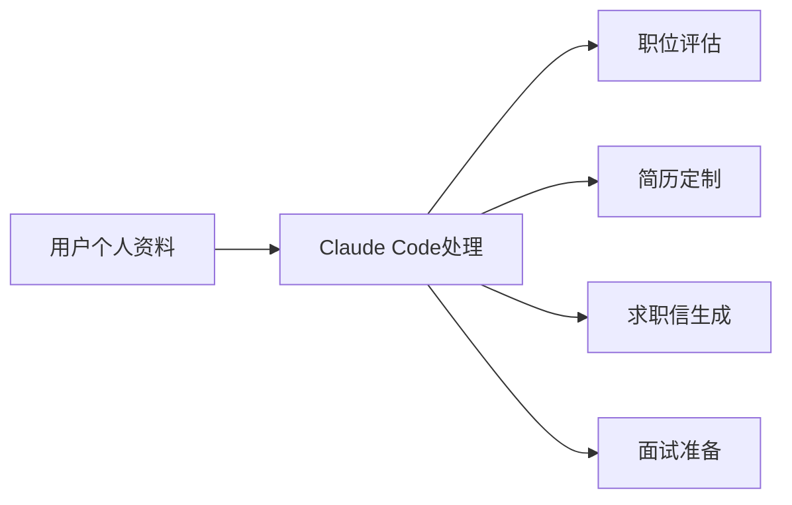
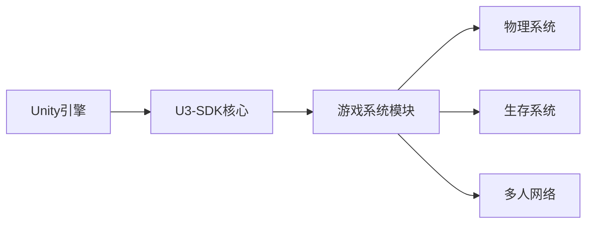
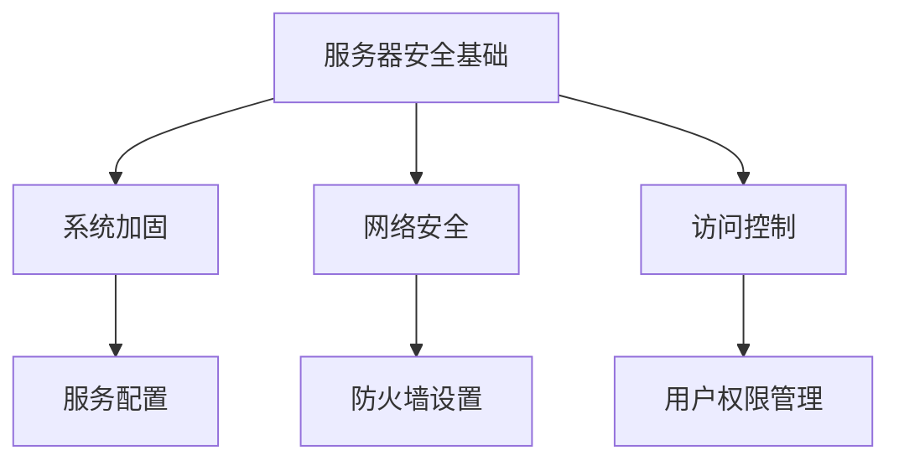

## 今日热点

AI代理应用爆发式增长，Claude生态系统扩展迅速，AI与办公工具深度融合，自动化安全测试成为新热点。

---

## 热门项目一览

| 排名 | 项目 | 语言 | 今日 | 总计 | 简介 |
|:---:|------|:----:|------:|-----:|------|
| 1 | [MadsLorentzen/ai-job-search](https://github.com/MadsLorentzen/ai-job-search) | TypeScript | +3,716 | 19,169 | AI-powered job application ... |
| 2 | [addyosmani/agent-skills](https://github.com/addyosmani/agent-skills) | JavaScript | +2,554 | 75,936 | Production-grade engineerin... |
| 3 | [iOfficeAI/OfficeCLI](https://github.com/iOfficeAI/OfficeCLI) | C# | +1,929 | 13,519 | OfficeCLI is the first and ... |
| 4 | [VoltAgent/awesome-design-md](https://github.com/VoltAgent/awesome-design-md) | Unknown | +1,391 | 99,781 | A collection of DESIGN.md f... |
| 5 | [asgeirtj/system_prompts_leaks](https://github.com/asgeirtj/system_prompts_leaks) | JavaScript | +1,125 | 55,191 | Extracted system prompts fr... |
| 6 | [bradautomates/claude-video](https://github.com/bradautomates/claude-video) | Python | +718 | 6,735 | Give Claude the ability to ... |
| 7 | [vxcontrol/pentagi](https://github.com/vxcontrol/pentagi) | Go | +535 | 19,443 | Fully autonomous AI Agents ... |
| 8 | [SmartlyDressedGames/U3-SDK](https://github.com/SmartlyDressedGames/U3-SDK) | C# | +524 | 2,061 | Source code for Unturned, a... |
| 9 | [huxingyi/autoremesher](https://github.com/huxingyi/autoremesher) | C++ | +403 | 2,383 | Automatic quad remeshing tool |
| 10 | [prisma/prisma](https://github.com/prisma/prisma) | TypeScript | +376 | 46,917 | Next-generation ORM for Nod... |
| 11 | [imthenachoman/How-To-Secure-A-Linux-Server](https://github.com/imthenachoman/How-To-Secure-A-Linux-Server) | Unknown | +243 | 29,109 | An evolving how-to guide fo... |
| 12 | [kyutai-labs/pocket-tts](https://github.com/kyutai-labs/pocket-tts) | Python | +235 | 7,003 | A TTS that fits in your CPU... |

---

## 趋势洞察

```
┌─────────────────────────────────────────────────────────────────┐
│  AI/ML 工具         ████████████████████████  11 个项目        │
│  其他               ████                      2 个项目        │
│  智能家居             ██                        1 个项目        │
│  开发工具             ██                        1 个项目        │
└─────────────────────────────────────────────────────────────────┘
```

---

## 项目深度解读

### 1. MadsLorentzen/ai-job-search — 智能求职助手

> **一句话总结**：基于Claude Code的AI求职框架，自动评估职位、定制简历、撰写求职信并准备面试，大幅提升求职效率。

#### 价值主张

| 维度 | 说明 |
|------|------|
| **解决痛点** | 传统求职流程繁琐耗时，需要针对每个职位定制材料，效率低下 |
| **目标用户** | 求职者，特别是需要大量申请职位的应届生或转行人士 |
| **核心亮点** | 基于Claude Code的AI处理 + 自动职位评估与匹配 + 简历与求职信自动定制 + 面试准备功能 |

#### 技术架构



**技术特色**：
- 基于Claude Code的AI处理能力
- TypeScript实现的框架结构
- 可定制的开源模板系统
- 自动化求职流程整合

#### 热度分析

- 项目短期内获得大量关注，单日新增Star数超过3700，显示市场对AI求职工具的强烈需求
- Fork数约为Star数的29%，表明用户不仅关注项目，更积极参与二次开发

#### 快速上手

```bash
# Fork项目到个人账户
git clone https://github.com/your-username/ai-job-search.git
cd ai-job-search
# 填写个人资料配置文件
```

#### 注意事项

- 项目依赖Claude Code服务，需确保API访问权限
- 需要适当配置个人信息以获得最佳匹配效果
- 生成的材料仍需人工审核和调整
- 项目许可证未知，商业使用前需确认授权条款


### 2. addyosmani/agent-skills — AI编程工程化

> **一句话总结**：提供AI编程代理所需的生产级工程技能，提升生成代码质量与实用性。

#### 价值主张

| 维度 | 说明 |
|------|------|
| **解决痛点** | 解决AI生成代码缺乏工程化实践的问题，提升代码质量 |
| **目标用户** | AI开发工具开发者、AI辅助编程平台构建者 |
| **核心亮点** | 生产级最佳实践 + 全面错误处理 + 性能优化策略 + 安全编码规范 + 可扩展技能架构 |

#### 技术架构


**技术特色**：
- 模块化技能架构设计，便于扩展和维护
- 轻量级JavaScript实现，易于集成
- 实用的代码生成模板，提高开发效率

#### 热度分析

- 项目获得超7.5万stars，单日增长2554，显示AI编程辅助领域极高关注度
- 在AI编程工程化领域处于领先地位，社区活跃，贡献者众多

#### 快速上手

```bash
# 克隆项目
git clone https://github.com/addyosmani/agent-skills.git

# 安装依赖
cd agent-skills && npm install
```

#### 注意事项

- 项目许可证未知，商业使用前需确认授权条款
- 作为工程技能库，需与具体AI编程工具配合使用才能发挥最大价值
- 项目持续更新中，建议关注最新版本以获取最新功能


### 3. iOfficeAI/OfficeCLI — AI Office工具

> **一句话总结**：专为AI代理设计的Office套件，无需安装即可处理Word、Excel和PowerPoint文件。

#### 价值主张

| 维度 | 说明 |
|------|------|
| **解决痛点** | 解决AI代理无法直接处理Office文档的问题，无需安装完整Office套件 |
| **目标用户** | AI开发者、自动化工具使用者、需要处理Office文档的程序 |
| **核心亮点** | 单二进制文件 + 开源免费 + 无Office依赖 + AI优化接口 |

#### 技术架构


**技术特色**：
- 纯C#实现，跨平台支持
- 单文件部署，无需复杂依赖
- 提供AI友好的API接口
- 支持文档批量处理自动化

#### 热度分析

- 项目近期增长迅猛，单日增加近2000个Star，显示市场需求强烈
- 在AI工具生态中占据独特位置，填补了AI代理与Office文档处理之间的空白

#### 快速上手

```bash
# 安装OfficeCLI
dotnet tool install -g OfficeCLI

# 处理Word文档
officecli word process input.docx --output output.docx --prompt "总结文档内容"

# 处理Excel表格
officecli excel analyze data.xlsx --chart --output chart.png
```

#### 注意事项

- 项目可能仍在快速迭代中，API可能会有变化
- 复杂Office文档格式支持可能有限
- 需要.NET运行环境才能执行


### 4. VoltAgent/awesome-design-md — 设计系统库

> **一句话总结**：收录知名品牌设计系统文档，助力AI工具生成一致化界面。

#### 价值主张

| 维度 | 说明 |
|------|------|
| **解决痛点** | 统一设计规范，解决多项目UI风格不一致问题 |
| **目标用户** | 前端开发者、UI设计师、产品团队 |
| **核心亮点** | + 知名品牌设计系统集合 + AI生成匹配UI + 设计规范标准化 |

#### 技术架构


**技术特色**：
- 设计系统文档标准化格式
- 与AI编程工具无缝集成
- 跨品牌设计系统兼容方案

#### 热度分析

- 近10万星标，日增超1,400，项目受开发者高度关注
- 社区贡献活跃，已成为设计系统参考标准

#### 快速上手

```bash
# 克隆项目
git clone https://github.com/VoltAgent/awesome-design-md.git

# 查看可用设计系统
ls awesome-design-md/systems/

# 复制特定设计系统到项目
cp awesome-design-md/systems/material-design/DESIGN.md ./project/
```

#### 注意事项

- 需确保所选设计系统与项目技术栈兼容
- 使用AI生成UI时可能需要额外配置提示词
- 注意各设计系统的版权和使用许可限制


### 5. asgeirtj/system_prompts_leaks — AI系统提示库

> **一句话总结**：收集并分享主流AI模型的系统提示词，帮助开发者和研究人员了解AI模型的工作原理和边界。

#### 价值主张

| 维度 | 说明 |
|------|------|
| **解决痛点** | 解决研究人员无法直接获取AI模型内部系统提示词的问题，提供透明度 |
| **目标用户** | AI研究人员、开发者、伦理学者和对AI模型工作原理感兴趣的技术爱好者 |
| **核心亮点** | 覆盖主流AI模型 + 定期更新 + 结构化整理 + 开源共享 + 无需API调用 |

#### 技术架构


**技术特色**：
- 多源信息整合能力
- 版本追踪与更新机制
- 结构化数据组织方式

#### 热度分析

- 项目获得超5.5万星且近期增长迅速，表明AI系统提示词研究需求旺盛
- 零开放问题，说明项目维护良好，社区贡献度高，处于AI研究工具生态的重要位置

#### 快速上手

```bash
# 克隆项目仓库
git clone https://github.com/asgeirtj/system_prompts_leaks.git

# 查看特定AI模型的系统提示
cat path/to/ai_model/system_prompt.txt
```

#### 注意事项

- 这些系统提示词可能不完全准确，因为AI厂商可能会更改或隐藏真实提示词
- 使用这些提示词进行研究时需遵守相关AI服务提供商的使用条款
- 项目依赖社区贡献，某些模型可能缺少最新版本的提示词


### 6. bradautomates/claude-video — 视频分析工具

> **一句话总结**：将视频内容转换为可处理的数据，使 Claude AI 能够理解和分析视频内容。

#### 价值主张

| 维度 | 说明 |
|------|------|
| **解决痛点** | 解决 AI 无法直接处理视频内容的问题 |
| **目标用户** | AI 研究者、内容分析师、开发者 |
| **核心亮点** | 视频下载 + 帧提取 + 内容转录 + Claude 集成 |

#### 技术架构


**技术特色**：
- 多媒体处理与AI内容集成
- 视频帧智能提取与分析
- 高效数据转换与处理流程

#### 热度分析

- 项目获得6,735个Star，单日增长718，表明功能创新性受到高度认可
- Fork数量相对较少，显示项目处于早期阶段，社区贡献尚未大规模展开

#### 快速上手

```bash
# 安装依赖
pip install -r requirements.txt

# 基本使用
python claude_video.py --url [视频URL]
```

#### 注意事项

- 项目需要 OpenAI API 访问权限
- 视频处理可能需要大量计算资源
- 转录质量受视频音频质量影响


### 7. vxcontrol/pentagi — AI渗透测试系统

> **一句话总结**：自主AI代理系统，实现自动化复杂渗透测试任务，提升安全评估效率与覆盖面。

#### 价值主张

| 维度 | 说明 |
|------|------|
| **解决痛点** | 渗透测试需要专业知识且耗时，自动化程度低，覆盖面有限。 |
| **目标用户** | 网络安全专家、渗透测试人员、安全研究团队。 |
| **核心亮点** | 自主AI代理 + 自动化渗透测试 + 复杂任务处理 + 持续学习适应 + 安全评估全流程覆盖 |

#### 技术架构


**技术特色**：
- 多AI代理协同工作系统，实现复杂任务的智能分解
- 自主决策与学习适应能力，持续优化渗透策略
- 基于Go语言的高性能并发架构，支持大规模安全评估

#### 热度分析

- 项目Star数近2万且单日增长500+，表明在安全领域AI工具中热度极高。
- Fork数适中，显示项目被广泛采用但二次开发相对较少。

#### 快速上手

```bash
# 克隆项目
git clone https://github.com/vxcontrol/pentagi.git
# 安装依赖
go mod download
# 运行项目
go run main.go
```

#### 注意事项

- 项目License未知，使用前需确认商业使用限制
- AI执行渗透测试需在合法授权范围内进行
- 可能需要额外配置AI模型和依赖项
- 0 Open Issues可能表明项目处于早期阶段或问题管理方式特殊


### 8. SmartlyDressedGames/U3-SDK — 游戏SDK

> **一句话总结**：Unturned开源游戏SDK，提供沙盒生存游戏完整开发框架与工具集。

#### 价值主张

| 维度 | 说明 |
|------|------|
| **解决痛点** | 提供完整的沙盒游戏开发框架，降低独立游戏开发门槛 |
| **目标用户** | 独立游戏开发者、Mod创作者、游戏教育机构 |
| **核心亮点** | 开源免费 + 完整游戏框架 + C#开发 + 跨平台支持 + 活跃社区 |

#### 技术架构



**技术特色**：
- 基于Unity引擎构建，充分利用Unity生态系统
- 使用C#语言开发，提供类型安全和面向对象特性
- 模块化设计，支持高度可扩展的游戏系统

#### 热度分析

- 项目Star数超过2000且近期增长迅速(+524 today)，显示社区高度关注
- 零开放问题表明项目维护良好，用户反馈及时处理
- 适中的Fork数量(262)表明项目既有一定使用率，又保持相对稳定的分支状态

#### 快速上手

```bash
# 克隆仓库
git clone https://github.com/SmartlyDressedGames/U3-SDK.git

# 使用Unity打开项目
# 导入必要的Unity包并构建项目
```

#### 注意事项

- 项目使用Unity引擎，需要熟悉Unity开发环境
- SDK可能需要特定的Unity版本兼容性
- 许可证信息未知，使用前需确认具体许可条款
- 项目文档可能不够完善，需要参考源码和社区讨论


### 9. huxingyi/autoremesher — 智能网格重划分工具

> **一句话总结**：自动将任意三角形网格转换为高质量四边形网格，提升3D模型处理效率

#### 价值主张

| 维度 | 说明 |
|------|------|
| **解决痛点** | 解决3D模型从三角形网格到四边形网格自动转换难题 |
| **目标用户** | 3D建模师、游戏开发者、CAD工程师 |
| **核心亮点** | 高质量四边形网格生成 + 自动化处理 + 保留几何特征 |

#### 技术架构


**技术特色**：
- 采用先进算法实现高质量四边形网格自动生成
- 保留原始模型的关键几何特征和细节
- 支持多种输入输出格式兼容性

#### 热度分析

- 项目近期增长迅速，单日新增403个Star，表明社区高度关注
- Fork数相对较少，可能表明项目主要作为工具使用而非二次开发

#### 快速上手

```bash
# 克隆项目
git clone https://github.com/huxingyi/autoremesher.git

# 构建项目
cd autoremesher
mkdir build && cd build
cmake ..
make

# 使用示例
./autoremesher input.obj output.obj
```

#### 注意事项

- 项目许可证未知，商业使用前需确认授权条款
- 依赖项可能在README中未完全列出，使用前需检查
- 输入网格质量可能影响最终四边形网格效果


### 10. prisma/prisma — 现代数据库工具链

> **一句话总结**：Prisma提供类型安全的数据库访问，简化数据操作并提升开发效率。

#### 价值主张

| 维度 | 说明 |
|------|------|
| **解决痛点** | 传统ORM类型安全缺失、配置复杂、性能低下问题 |
| **目标用户** | 使用TypeScript/JavaScript的全栈应用开发者 |
| **核心亮点** | 类型安全查询 + 自动生成数据库客户端 + 直观IDE支持 + 多数据库支持 + 声明式数据建模 |

#### 技术架构


**技术特色**：
- 基于GraphQL的查询引擎，提供统一数据访问层
- 自动生成TypeScript类型，确保查询类型安全
- 支持数据库迁移和数据浏览，提供完整开发工具链

#### 热度分析

- 项目拥有近47k星标，每日增长约376个，社区认可度极高
- 作为现代ORM代表，在Node.js/TypeScript生态中处于领先地位

#### 快速上手

```bash
# 安装Prisma CLI
npm install -g prisma

# 初始化新项目
npx prisma init

# 定义数据模型并生成客户端
npx prisma generate
```

#### 注意事项

- Prisma学习曲线相对传统ORM较陡，需要理解其概念和工具链
- 对于复杂查询场景，有时仍需编写原生SQL
- Prisma查询引擎层可能带来一定性能开销，但多数场景下影响有限


### 11. imthenachoman/How-To-Secure-A-Linux-Server — 服务器安全指南

> **一句话总结**：全面的Linux服务器安全实践指南，从基础加固到高级防护策略。

#### 价值主张

| 维度 | 说明 |
|------|------|
| **解决痛点** | 提供系统化的Linux服务器安全配置方法，填补安全实践知识空白 |
| **目标用户** | 系统管理员、DevOps工程师、服务器运维人员 |
| **核心亮点** | 实用性强 + 涵盖面广 + 持续更新 + 可操作性强 |

#### 技术架构



**技术特色**：
- 基于最新Linux发行版的安全最佳实践
- 提供可执行的命令和配置示例
- 结合了自动化工具与手动配置方法

#### 热度分析

- 高关注度项目，近一个月日均增长约8 stars，表明社区对服务器安全知识需求旺盛
- Fork数量与Star比例约为1:15，说明用户更倾向于收藏而非二次开发，符合指南类项目特性

#### 快速上手

```bash
# 克隆项目到本地
git clone https://github.com/imthenachoman/How-To-Secure-A-Linux-Server.git

# 在浏览器中查看HTML版本
How-To-Secure-A-Linux-Server/index.html
```

#### 注意事项

- 本指南需要一定的Linux基础知识，新手可能需要额外学习相关命令和概念
- 部分安全措施可能需要根据实际服务器环境进行调整，不建议直接套用所有配置


### 12. kyutai-labs/pocket-tts — 轻量级TTS引擎

> **一句话总结**：轻量级CPU运行的高效TTS系统，无需GPU资源即可实现文本转语音功能。

#### 价值主张

| 维度 | 说明 |
|------|------|
| **解决痛点** | 传统TTS依赖GPU资源，限制部署场景与使用门槛 |
| **目标用户** | 需要集成TTS功能的开发者、资源受限设备的应用开发者 |
| **核心亮点** | 轻量级设计 + CPU高效运行 + 低资源消耗 + 易于集成部署 |

#### 技术架构


**技术特色**：
- 模型优化技术，大幅减少计算需求
- 高效的推理算法，平衡速度与质量
- 轻量级模型架构，适应CPU环境

#### 热度分析

- 项目近期热度激增，今日Star数增加235，显示社区高度关注
- Fork数与Star数比例适中，表明项目有良好的社区参与度

#### 快速上手

```bash
# 安装依赖
pip install -r requirements.txt

# 基本使用
python -m pocket_tts "这是一段测试文本"
```

#### 注意事项

- 模型可能需要较大的内存资源，建议在配置良好的机器上运行
- 语音质量可能受限于计算资源，平衡效果与性能需要调整参数
- 需要适当的预训练模型才能运行，请确保下载所需模型文件


### 13. unclecode/crawl4ai — LLM友好爬虫

> **一句话总结**：开源智能爬虫，专为LLM优化，高效提取网页数据并适配大语言模型需求。

#### 价值主张

| 维度 | 说明 |
|------|------|
| **解决痛点** | 传统爬虫难以适配LLM数据需求，提取效率低 |
| **目标用户** | AI开发者、数据科学家、企业数据分析师 |
| **核心亮点** | LLM友好数据格式 + 高效并行爬取 + 智能内容提取 |

#### 技术架构


**技术特色**：
- 智能识别并提取网页关键内容
- 专为LLM优化的数据输出格式
- 支持大规模并发高效爬取

#### 热度分析

- 项目star数超7万，日增215，呈现高速增长态势
- 拥有独立Discord社区，开发者生态活跃，形成完整支持体系

#### 快速上手

```bash
pip install crawl4ai
python -m crawl4ai crawl https://example.com --output data.json
```

#### 注意事项

- 遵守目标网站的robots.txt规则，尊重爬取限制
- 注意处理反爬虫机制，适当设置请求间隔和headers
- 避免高频请求导致IP被封，建议使用代理池轮换


### 14. anthropics/claude-cookbooks — AI应用示例集

> **一句话总结**：Anthropic官方提供的Claude AI使用示例集，展示多种实用场景和最佳实践。

#### 价值主张

| 维度 | 说明 |
|------|------|
| **解决痛点** | 缺乏Claude AI实际应用案例和最佳实践指导 |
| **目标用户** | 开发者、研究人员、AI爱好者 |
| **核心亮点** | 官方权威性 + 实用代码示例 + 多场景覆盖 + 持续更新 |

#### 技术架构

**技术特色**：
- 基于Jupyter Notebook的交互式教程
- 提供完整可运行的代码示例
- 涵盖从简单到复杂的多种使用场景

#### 热度分析

- 项目获得47k+ Star，近期增长迅速，显示社区对Claude AI应用的高度关注
- 作为Anthropic官方示例库，在AI应用生态中具有重要参考价值

#### 快速上手

```bash
# 克隆仓库
git clone https://github.com/anthropics/claude-cookbooks.git

# 运行示例笔记本
cd claude-cookbooks
jupyter notebook
```

#### 注意事项

- 部分示例可能需要API密钥才能运行
- 示例代码可能随着Claude API更新而需要调整
- 建议在使用前查看仓库的最新更新，以获取最新的使用方法


### 15. wonderwhy-er/DesktopCommanderMCP — AI终端控制工具

> **一句话总结**：为Claude AI提供终端控制、文件系统搜索和差异编辑能力的MCP服务器。

#### 价值主张

| 维度 | 说明 |
|------|------|
| **解决痛点** | 为AI助手提供对本地系统的直接控制能力 |
| **目标用户** | 开发者、研究人员和需要AI辅助系统操作的用户 |
| **核心亮点** | 终端控制能力 + 文件系统搜索 + 差异编辑功能 + 安全隔离 |

#### 技术架构


**技术特色**：
- 基于TypeScript构建，提供类型安全
- 实现了MCP协议，与Claude深度集成
- 提供了安全的系统访问隔离机制

#### 热度分析

- 项目获得6588个Star，且每日增长185个，表明近期热度快速上升
- Fork数781，表明社区参与度高，用户愿意基于此项目进行二次开发
- 0个Open Issues，可能表明项目维护良好或问题解决及时

#### 快速上手

```bash
# 安装MCP服务器
npm install -g @wonderwhy-er/desktop-commander-mcp

# 配置Claude客户端
# 在Claude配置中添加DesktopCommanderMCP服务器地址
```

#### 注意事项

- 需要确保系统安全，避免AI执行危险操作
- 可能需要适当的权限配置才能访问系统资源
- 需要了解MCP协议的基本概念才能正确配置和使用


## 今日推荐

| 主题 | 推荐项目 | 亮点 |
|------|----------|------|
| 今日最热 | [MadsLorentzen/ai-job-search](https://github.com/MadsLorentzen/ai-job-search) | AI-powered job ap... |
| 值得关注 | [addyosmani/agent-skills](https://github.com/addyosmani/agent-skills) | Production-grade ... |
| 快速上手 | [iOfficeAI/OfficeCLI](https://github.com/iOfficeAI/OfficeCLI) | OfficeCLI is the ... |
| 长期潜力 | [VoltAgent/awesome-design-md](https://github.com/VoltAgent/awesome-design-md) | A collection of D... |

---

<div align="center">

*Generated on 2026-07-10 | Powered by GitHub Trending Reporter*

</div>