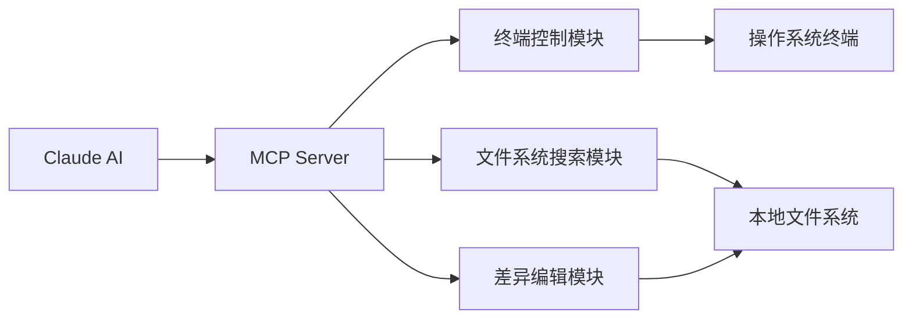
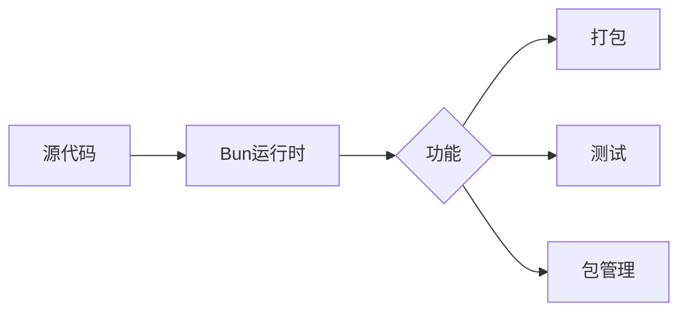
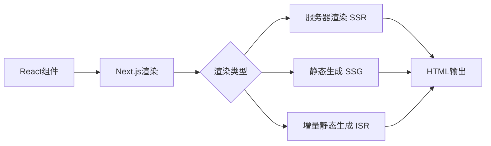
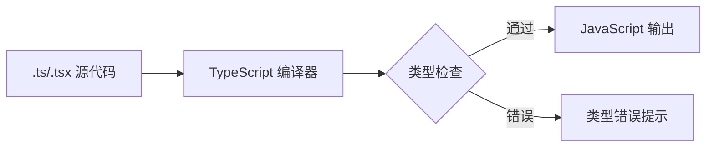
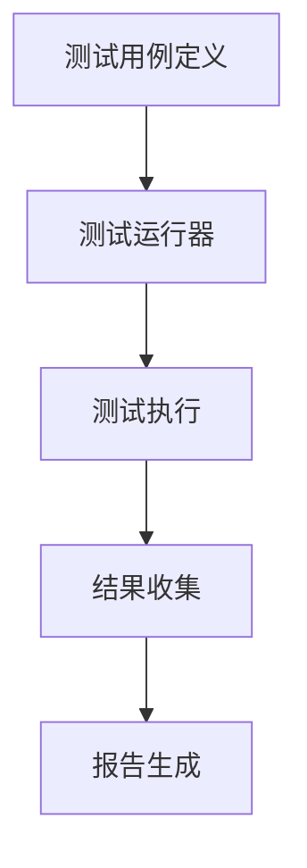

## 今日热点

AI代理技能工具呈现爆发式增长，JavaScript生态系统持续创新，开发者积极构建与AI协同的新一代开发工具链。

---

## 热门项目一览

| 排名 | 项目 | 语言 | 今日 | 总计 | 简介 |
|:---:|------|:----:|------:|-----:|------|
| 1 | [mattpocock/skills](https://github.com/mattpocock/skills) | Shell | +1,712 | 164,681 | Skills for Real Engineers. ... |
| 2 | [iOfficeAI/OfficeCLI](https://github.com/iOfficeAI/OfficeCLI) | C# | +1,224 | 14,455 | OfficeCLI is the first and ... |
| 3 | [addyosmani/agent-skills](https://github.com/addyosmani/agent-skills) | JavaScript | +1,116 | 76,840 | Production-grade engineerin... |
| 4 | [obra/superpowers](https://github.com/obra/superpowers) | Shell | +1,013 | 251,805 | An agentic skills framework... |
| 5 | [wonderwhy-er/DesktopCommanderMCP](https://github.com/wonderwhy-er/DesktopCommanderMCP) | TypeScript | +328 | 7,321 | This is MCP server for Clau... |
| 6 | [oven-sh/bun](https://github.com/oven-sh/bun) | Rust | +209 | 94,252 | Incredibly fast JavaScript ... |
| 7 | [vercel/next.js](https://github.com/vercel/next.js) | JavaScript | +191 | 140,716 | The React Framework |
| 8 | [microsoft/TypeScript](https://github.com/microsoft/TypeScript) | TypeScript | +177 | 109,781 | TypeScript is a superset of... |
| 9 | [hashicorp/terraform](https://github.com/hashicorp/terraform) | Go | +172 | 49,172 | Terraform enables you to sa... |
| 10 | [tailscale/tailscale](https://github.com/tailscale/tailscale) | Go | +143 | 33,662 | The easiest, most secure wa... |
| 11 | [TencentCloud/TencentDB-Agent-Memory](https://github.com/TencentCloud/TencentDB-Agent-Memory) | TypeScript | +123 | 8,250 | TencentDB Agent Memory deli... |
| 12 | [davila7/claude-code-templates](https://github.com/davila7/claude-code-templates) | Python | +118 | 28,777 | CLI tool for configuring an... |

---

## 趋势洞察

```
┌─────────────────────────────────────────────────────────────────┐
│  AI/ML 工具         ████████████████████████  11 个项目        │
│  其他               █████████████             6 个项目        │
│  开发框架             ████                      2 个项目        │
└─────────────────────────────────────────────────────────────────┘
```

---

## 项目深度解读

### 1. mattpocock/skills — Shell技能集合

> **一句话总结**：实用的Shell脚本与工具集合，源自真实工程师经验，提升开发效率与生产力。

#### 价值主张

| 维度 | 说明 |
|------|------|
| **解决痛点** | 提供日常开发中实用的Shell脚本和命令，减少重复工作 |
| **目标用户** | 开发人员、系统管理员、DevOps工程师 |
| **核心亮点** | 实用性强 + 覆盖面广 + 持续更新 + 源自真实经验 + 高社区认可 |

#### 技术架构

**技术特色**：
- 使用原生Shell脚本，兼容性强
- 模块化设计，各功能独立
- 提供丰富的命令行工具和别名

#### 热度分析

- 拥有16万+星标且持续快速增长，表明其高度实用性和社区认可
- 高fork数与star数比例，显示项目被广泛采用和二次开发

#### 快速上手

```bash
# 克隆仓库
git clone https://github.com/mattpocock/skills.git

# 进入目录
cd skills

# 查看可用脚本
ls -la
```

#### 注意事项

- 项目没有明确的许可证，使用时需要注意版权问题
- 需要一定的Shell基础知识才能充分利用这些脚本
- 不同系统环境可能需要调整部分脚本


### 2. iOfficeAI/OfficeCLI — [AI办公自动化]

> **一句话总结**：专为AI代理设计的单文件Office文档处理工具，无需安装Office即可操作Word/Excel/PowerPoint。

#### 价值主张

| 维度 | 说明 |
|------|------|
| **解决痛点** | 让AI代理能够直接处理Office文档，无需依赖完整的Office安装环境 |
| **目标用户** | 需要AI自动化处理Office文档的开发者和AI系统 |
| **核心亮点** | 单文件二进制 + 无Office安装依赖 + 支持多种Office格式 + 专为AI设计 + 开源免费 |

#### 技术架构


**技术特色**：
- 基于C#开发的高性能文档处理引擎
- 单文件部署，无需复杂依赖
- 兼容多种Office文档格式解析

#### 热度分析

- 项目获得14,455个Star，单日增长1,224，表明近期热度极高，可能因AI自动化需求激增
- 零Open Issues反映项目维护良好，社区参与度可能集中在代码贡献而非问题报告

#### 快速上手

```bash
# 安装OfficeCLI
dotnet tool install -g OfficeCLI

# 使用AI处理Word文档
officecli word document.docx --extract-text
```

#### 注意事项

- 项目许可证未知，商业使用前需确认授权方式
- 依赖.NET环境，需确保系统兼容性
- 对于复杂Office文档，可能存在兼容性问题


### 3. addyosmani/agent-skills — AI编码技能库

> **一句话总结**：为AI编程代理提供生产级工程技能的JavaScript库，提升代码质量和开发效率。

#### 价值主张

| 维度 | 说明 |
|------|------|
| **解决痛点** | 提升AI代理的代码质量和工程实践能力 |
| **目标用户** | AI开发者、编程工具构建者和智能IDE团队 |
| **核心亮点** | 工程最佳实践集成 + 代码质量优化 + AI辅助开发增强 |

#### 技术架构


**技术特色**：
- 提供结构化的AI编码技能集
- 融入现代前端工程最佳实践
- 支持代码质量自动检测与优化

#### 热度分析

- 项目获得7.6万+星标，近期增长迅速，表明AI编程工具领域热度高涨
- 零开放问题反映项目维护质量高，已形成稳定的技术生态

#### 快速上手

```bash
# 安装依赖
npm install agent-skills

# 基本使用
const agentSkills = require('agent-skills');
agentSkills.enable('best-practices');
```

#### 注意事项

- 项目许可证信息不明确，使用前需确认授权条款
- 作为AI辅助工具，应结合人工审查确保代码质量
- 可能需要配合特定的AI编程框架使用才能发挥最大效能


### 4. obra/superpowers — 智能技能框架

> **一句话总结**：一个实用的智能技能框架和软件开发方法论，帮助开发者提升工作效率和能力。

#### 价值主张

| 维度 | 说明 |
|------|------|
| **解决痛点** | 解决开发者技能提升和高效开发方法的需求 |
| **目标用户** | 软件开发者、技术团队和个人能力提升者 |
| **核心亮点** | 基于代理的技能框架 + 实用的软件开发方法论 + 提升工作效率 |

#### 技术架构


**技术特色**：
- 基于Shell脚本实现轻量级框架
- 强调实用性和可执行性
- 注重方法论和实践指导结合

#### 热度分析

- 项目拥有超25万星，近期每日增长约1000星，表明社区认可度高
- Fork数超过2.2万，显示被广泛采用和二次开发

#### 快速上手

```bash
# 克隆项目到本地
git clone https://github.com/obra/superpowers.git
# 进入项目目录
cd superpowers
# 查看使用说明
cat README.md
```

#### 注意事项

- 项目采用Unknown许可证，使用前需确认授权条款
- 作为Shell项目，可能需要特定环境支持
- 项目方法论可能需要一定时间理解和实践


### 5. wonderwhy-er/DesktopCommanderMCP — AI助手终端增强

> **一句话总结**：为Claude提供终端控制、文件系统操作和编辑能力的MCP服务器。

#### 价值主张

| 维度 | 说明 |
|------|------|
| **解决痛点** | 为AI助手提供终端访问和文件操作能力，扩展其功能边界 |
| **目标用户** | 使用Claude AI进行开发工作的开发者和技术人员 |
| **核心亮点** | 终端控制 + 文件系统搜索 + 差异编辑能力 + MCP集成 |

#### 技术架构



**技术特色**：
- 基于TypeScript开发，提供类型安全
- 实现MCP协议，与Claude深度集成
- 模块化设计，功能解耦

#### 热度分析

- 项目Star数超过7300，近期增长迅速（单日增长328），表明社区对该项目高度关注
- 作为AI辅助工具生态中的重要组件，填补了Claude在终端操作和文件管理方面的功能空白

#### 快速上手

```bash
# 克隆项目
git clone https://github.com/wonderwhy-er/DesktopCommanderMCP.git
# 安装依赖
npm install
# 配置Claude使用MCP服务器
```

#### 注意事项

- 项目许可证未知，商业使用前需确认授权条款
- 作为MCP服务器，需要正确配置才能与Claude协同工作
- 终端操作存在安全风险，应在受控环境中使用


### 6. oven-sh/bun — 全栈JS工具链

> **一句话总结**：Bun是一个极快的JavaScript全栈工具链，集运行时、打包、测试和包管理于一体。

#### 价值主张

| 维度 | 说明 |
|------|------|
| **解决痛点** | JavaScript开发工具链分散、性能低下问题，提供一体化解决方案 |
| **目标用户** | JavaScript/Node.js开发者，特别是关注性能和开发效率的人群 |
| **核心亮点** | 极高性能 + 与Node.js兼容 + 原生TypeScript支持 + 原生Web API + 内置包管理 |

#### 技术架构



**技术特色**：
- 基于JavaScriptCore而非V8，提供更高性能
- 使用Rust编写核心，提供内存安全和高性能
- 原生支持TypeScript，无需额外配置

#### 热度分析

- 项目Star数已达94,252，且仍有209个新增/日，增长势头强劲
- 作为新兴工具，社区活跃度高，有望成为Node.js的强力竞争者

#### 快速上手

```bash
# 安装Bun
curl -fsSL https://bun.sh/install | bash

# 运行JavaScript文件
bun run index.js

# 运行TypeScript文件
bun run index.ts
```

#### 注意事项

- Bun仍处于早期开发阶段，API可能会有变化
- 与某些Node.js模块可能存在兼容性问题
- 某些特定平台或环境可能不支持


### 7. vercel/next.js — React全栈框架

> **一句话总结**：一个React全栈框架，提供服务器渲染、静态生成和API路由等功能。

#### 价值主张

| 维度 | 说明 |
|------|------|
| **解决痛点** | 解决React应用在SEO、性能和开发体验方面的痛点 |
| **目标用户** | React开发者、需要高性能Web应用的开发团队 |
| **核心亮点** | 服务器渲染 + 静态生成 + API路由 + 零配置 + 开箱即用的优化 |

#### 技术架构



**技术特色**：
- 基于React的服务端渲染框架，提供开箱即用的开发体验
- 支持静态站点生成(SSG)和服务器端渲染(SSR)两种渲染模式
- 内置路由系统和API路由功能，无需额外配置

#### 热度分析

- Star数超过14万，增长稳定，表明项目在React生态中处于核心地位
- 作为Vercel公司的旗舰产品，拥有活跃的社区和丰富的生态系统

#### 快速上手

```bash
# 创建Next.js项目
npx create-next-app@latest my-app
# 进入项目目录
cd my-app
# 启动开发服务器
npm run dev
```

#### 注意事项

- Next.js版本更新频繁，需要注意API兼容性
- 对于大型项目，可能需要考虑自定义配置和优化策略


### 8. microsoft/TypeScript — 类型化JavaScript

> **一句话总结**：JavaScript的超集，添加静态类型系统，提升代码质量和开发体验。

#### 价值主张

| 维度 | 说明 |
|------|------|
| **解决痛点** | JavaScript缺乏静态类型，导致大型项目难以维护，易出现运行时错误 |
| **目标用户** | 中大型前端团队、企业级应用开发者、库/框架作者 |
| **核心亮点** | 静态类型检查 + 渐进式采用 + 工具链完善 + 跨平台编译 |

#### 技术架构



**技术特色**：
- 静态类型系统支持接口、泛型、枚举等高级类型
- 渐进式类型设计，可在现有JavaScript项目中逐步引入
- 丰富的配置选项，支持不同项目需求与编译目标

#### 热度分析
- Star数超10万，日均增长约177，表明持续高热度与广泛认可
- 作为微软主导的开源项目，在前端领域占据核心生态位置

#### 快速上手

```bash
# 全局安装TypeScript
npm install -g typescript

# 创建TypeScript配置文件
tsc --init

# 编译TypeScript文件
tsc yourfile.ts
```

#### 注意事项
- 类型定义需要维护，可能增加初期开发成本
- 某些JavaScript动态特性在TypeScript中需要特殊处理
- 类型系统有学习曲线，需要时间适应


### 9. hashicorp/terraform — 基础设施即代码

> **一句话总结**：通过声明式配置文件安全、可预测地创建、变更和管理云基础设施资源。

#### 价值主张

| 维度 | 说明 |
|------|------|
| **解决痛点** | 解决基础设施手动管理带来的不一致、不可重复和难以版本控制的问题 |
| **目标用户** | DevOps工程师、云架构师、系统管理员和需要自动化基础设施的团队 |
| **核心亮点** | 声明式配置 + 状态管理 + 资源依赖图 + 提供者生态系统 + 变量和输出管理 |

#### 技术架构

```mermaid
graph LR
    A[配置文件(.tf)] --> B[解析与验证]
    B --> C[构建依赖图]
    C --> D[执行计划]
    D --> E[应用变更]
    E --> F[状态更新]
```

**技术特色**：
- 声明式语法使基础设施配置更易于理解和维护
- 状态管理跟踪资源及其关系，支持复杂的基础设施场景
- 提供者模型支持多云环境下的统一管理

#### 热度分析

- 项目拥有近5万星，每日稳定增长约170星，表明企业级采用率持续上升
- 作为HashiCorp生态的核心组件，在基础设施自动化领域占据主导地位

#### 快速上手

```bash
# 安装Terraform
wget https://releases.hashicorp.com/terraform/1.5.7/terraform_1.5.7_linux_amd64.zip
unzip terraform_1.5.7_linux_amd64.zip

# 创建简单的AWS EC2实例配置
cat > main.tf <<EOF
provider "aws" {
  region = "us-west-2"
}

resource "aws_instance" "example" {
  ami           = "ami-0c55b159cbfafe1f0"
  instance_type = "t2.micro"
}
EOF

# 初始化并应用配置
terraform init
terraform apply
```

#### 注意事项

- Terraform状态文件包含敏感信息，应妥善保管并考虑使用远程状态后端
- 大型项目中资源依赖关系复杂，需谨慎规划模块结构和变量管理
- 版本升级可能导致配置不兼容，建议在测试环境充分验证


### 10. tailscale/tailscale — 简单安全的网络连接工具

> **一句话总结**：基于 WireGuard 的零配置 VPN 解决方案，提供安全易用的私有网络连接。

#### 价值主张

| 维度 | 说明 |
|------|------|
| **解决痛点** | 传统 VPN 配置复杂、安全性不足，提供即插即用的安全网络连接 |
| **目标用户** | 远程开发团队、分布式企业、需要安全访问内部资源的个人用户 |
| **核心亮点** | 零配置部署 + WireGuard加密 + 双因素认证 + MagicDNS + 跨平台支持 |

#### 技术架构


**技术特色**：
- 基于 WireGuard 协议提供高性能加密连接
- 采用 DERP 服务器穿透 NAT 限制
- 使用 MagicDNS 简化网络访问

#### 热度分析

- 项目 Star 数超3.3万，日增140+，呈现稳定高速增长态势
- 无开放 Issues，表明问题解决效率高，社区管理成熟

#### 快速上手

```bash
# 安装 Tailscale
curl -fsSL https://tailscale.com/install.sh | sh

# 登录并加入网络
tailscale up
```

#### 注意事项

- 免费版本有设备数量限制，企业版需付费订阅
- 依赖中央控制服务器进行身份验证，存在单点故障风险
- 在企业环境中使用需考虑数据隐私和合规要求


### 11. TencentCloud/TencentDB-Agent-Memory — AI代理记忆库

> **一句话总结**：为AI代理提供完全本地化的长期记忆解决方案，通过4层渐进式管道实现，无需外部API依赖。

#### 价值主张

| 维度 | 说明 |
|------|------|
| **解决痛点** | AI代理长期记忆缺失与外部API依赖问题 |
| **目标用户** | AI开发者、智能代理系统构建者 |
| **核心亮点** | 完全本地化实现 + 4层渐进式记忆管道 + 零外部API依赖 |

#### 技术架构


**技术特色**：
- 4层渐进式记忆管道设计，优化记忆处理效率
- 完全本地化实现，确保数据安全与隐私
- 高效的长期记忆存储与检索机制

#### 热度分析

- 项目获得8,250个Star，日均新增123个，增长势头强劲
- Fork数760，显示开发者社区积极参与二次开发与定制

#### 快速上手

```bash
# 克隆项目
git clone https://github.com/TencentCloud/TencentDB-Agent-Memory.git

# 安装依赖
cd TencentDB-Agent-Memory
npm install

# 构建运行
npm run build && npm start
```

#### 注意事项

- 项目许可证信息不明确，使用前需确认许可条款
- 作为腾讯云项目，可能需要相关云服务支持
- 本地存储容量和性能可能成为大规模应用的限制因素


### 12. davila7/claude-code-templates — Claude 命令工具集

> **一句话总结**：提供简洁高效的命令行界面，用于配置和监控 Claude Code 工具，提升开发体验。

#### 价值主张

| 维度 | 说明 |
|------|------|
| **解决痛点** | 简化 Claude Code 的配置流程，提供统一的监控管理界面 |
| **目标用户** | 使用 Claude Code 进行开发的程序员和技术团队 |
| **核心亮点** | 命令行友好 + 配置简化 + 实时监控 + 批量操作 + 插件扩展 |

#### 技术架构


**技术特色**：
- 基于Python构建的轻量级CLI工具
- 提供模块化的配置管理系统
- 支持实时状态监控和日志记录

#### 热度分析

- 项目获得近3万星，日增118星，增长势头强劲，表明市场需求旺盛
- 无开放问题，维护状态良好，社区认可度高

#### 快速上手

```bash
# 安装工具
pip install claude-code-templates

# 初始化配置
claude-code init

# 连接并监控Claude Code
claude-code monitor
```

#### 注意事项

- 需要先安装Claude Code服务才能使用此工具
- 配置文件需要根据实际环境进行调整
- 工具依赖于Python环境，确保Python版本兼容


### 13. google-labs-code/stitch-skills — AI技能库

> **一句话总结**：为Stitch MCP服务器提供可扩展的AI编程技能库，兼容主流代码助手工具。

#### 价值主张

| 维度 | 说明 |
|------|------|
| **解决痛点** | 解决AI编码助手功能有限、难以执行复杂编程任务的痛点 |
| **目标用户** | 使用AI编码助手的开发者和编程爱好者 |
| **核心亮点** | 遵循开放标准 + 多平台兼容性 + 可扩展技能库 + 专业领域支持 |

#### 技术架构


**技术特色**：
- TypeScript实现确保类型安全与代码质量
- 模块化设计支持灵活扩展与定制
- 标准化接口实现多平台无缝集成

#### 热度分析

- 项目获得6,754个star，近期增长117个，显示社区高度关注
- 0个open_issues反映项目维护良好或问题解决效率高

#### 快速上手

```bash
# 安装Stitch MCP服务器
npm install -g @stitch-mcp/server

# 初始化技能库
npx @stitch-mcp/skills init

# 启动服务并加载技能
stitch-mcp --skills-dir ./skills
```

#### 注意事项

- 需要配合Stitch MCP服务器使用，无法独立运行
- 与特定编码助手工具集成可能需要额外配置
- License信息不明确，使用前需确认授权条款


### 14. chriskohlhoff/asio — 跨平台网络I/O库

> **一句话总结**：Asio是强大的C++跨平台网络编程库，提供统一异步I/O模型，支持高性能网络应用开发。

#### 价值主张

| 维度 | 说明 |
|------|------|
| **解决痛点** | 解决C++中跨平台网络编程复杂性和低效性问题，提供统一异步模型 |
| **目标用户** | C++网络应用开发者、系统级编程人员、高性能服务端应用开发者 |
| **核心亮点** | 跨平台支持 + 异步I/O模型 + 统一API设计 + 可扩展架构 + 零拷贝支持 |

#### 技术架构


**技术特色**：
- 异步I/O模型支持，提高系统并发性能
- 跨平台设计，支持Windows、Linux、macOS等多种操作系统
- 与Boost库集成，提供丰富的扩展功能

#### 热度分析

- 项目持续稳定增长，Star数超过6000，近期每日新增约90个Star，表明社区活跃度高
- 作为C++网络编程领域的重要库，已成为许多网络应用和框架的基础组件

#### 快速上手

```bash
# 克隆仓库
git clone https://github.com/chriskohlhoff/asio.git
# 编译示例
cd asio && make
# 运行TCP服务器示例
./src/examples/cpp03/echo/server
```

#### 注意事项

- Asio的学习曲线相对较陡，特别是对于不熟悉异步编程模型的开发者
- 在Windows平台上使用时，可能需要额外的配置以支持IOCP
- 项目文档较为全面，但示例代码分散在多个版本中（C++03、C++11等），需要选择合适的版本参考


### 15. zeux/meshoptimizer — 网格优化引擎

> **一句话总结**：高性能网格优化库，通过算法优化减小网格体积并提升渲染性能。

#### 价值主张

| 维度 | 说明 |
|------|------|
| **解决痛点** | 解决3D模型数据量大导致渲染效率低下的问题 |
| **目标用户** | 3D游戏开发者、图形引擎开发者、VR/AR应用开发者 |
| **核心亮点** | 顶点缓存优化 + 索引缓冲区优化 + 顶点重排 + 过度绘制优化 |

#### 技术架构


**技术特色**：
- 基于顶点缓存优化的高效算法
- 支持多种网格压缩和简化技术
- 跨平台无依赖的轻量级实现

#### 热度分析

- 项目获得8,026个Star且持续增长(+91 today)，表明其在3D图形领域具有较高的实用价值
- 作为底层图形库，在游戏引擎和3D应用生态中扮演重要角色，但直接用户相对较少

#### 快速上手

```bash
# 克隆仓库
git clone https://github.com/zeux/meshoptimizer.git

# 编译示例
cd meshoptimizer
mkdir build && cd build
cmake ..
make
```

#### 注意事项

- 这是一个C++库，需要C++11或更高版本支持
- 仅处理网格数据，不包含渲染功能，需与图形API配合使用
- 对于大规模网格，可能需要考虑内存使用和优化时间


### 16. abseil/abseil-cpp — Google C++基础库

> **一句话总结**：Google开源的C++基础库集合，提供高质量、跨平台的常用组件和工具。

#### 价值主张

| 维度 | 说明 |
|------|------|
| **解决痛点** | 提供稳定、高效的C++基础组件，解决跨平台开发中的常见问题 |
| **目标用户** | 需要高质量C++库的专业开发者和企业级C++项目 |
| **核心亮点** | Google内部实践 + 跨平台兼容性 + 高性能 + API稳定性 + 持久维护 |

#### 技术架构


**技术特色**：
- 采用非侵入式设计，与标准库良好兼容
- 提供现代C++风格的API，支持C++11及以上版本
- 包含Google内部使用的成熟组件，经过大规模生产环境验证
- 提供明确的版本兼容性保证，避免破坏性变更

#### 热度分析

- 项目持续获得高星关注，近期增长稳定，表明其在C++社区具有持久影响力
- 作为Google背书的开源项目，在企业级C++开发中具有重要生态位置

#### 快速上手

```bash
# 克隆仓库
git clone https://github.com/abseil/abseil-cpp.git
# 创建构建目录
mkdir build && cd build
# 配置和构建
cmake .. && make -j4
```

#### 注意事项
- 使用时需注意与特定C++版本的兼容性要求
- 某些组件可能依赖于特定的编译器特性或平台支持
- 需要遵循Abseil的版本兼容性政策，避免不兼容的组合


### 17. grpc/grpc — 高性能RPC框架

> **一句话总结**：基于HTTP/2的高性能RPC框架，支持多语言，提供强类型服务定义和高效通信。

#### 价值主张

| 维度 | 说明 |
|------|------|
| **解决痛点** | 解决分布式系统中服务间通信效率低、跨语言调用复杂的问题 |
| **目标用户** | 分布式系统开发者、微服务架构师、云原生应用开发者 |
| **核心亮点** | 基于HTTP/2的高效传输 + 强类型服务定义 + 流式通信支持 + 多语言支持 + 负载均衡 |

#### 技术架构


**技术特色**：
- 使用Protocol Buffers进行服务定义和高效序列化
- 基于HTTP/2实现多路复用和流式通信
- 支持四种RPC调用模式：简单RPC、流式RPC、双向流式RPC和服务器流式RPC
- 提供拦截器机制便于中间件扩展
- 内置负载均衡和超时控制机制

#### 热度分析

- 项目Star数超过4.5万，Fork数超过1.1万，近7天新增78个Star，表明其在RPC领域具有极高认可度和稳定增长趋势
- 作为Google主导的开源项目，在云原生和微服务生态中占据核心地位，是CNCF(云原生计算基金会)的重要项目

#### 快速上手

```bash
# 安装g工具
$ go get google.golang.org/grpc

# 创建简单服务
$ protoc --go_out=. --go-grpc_out=. *.proto
```

#### 注意事项

- 需要理解Protocol Buffers和服务定义语言(IDL)的设计原则
- 在高并发场景下需要合理配置连接池和超时参数
- 对于跨语言服务调用，需注意各语言版本的API差异和最佳实践


### 18. catchorg/Catch2 — C++测试框架

> **一句话总结**：现代C++原生测试框架，支持多种测试风格，轻量级且功能强大。

#### 价值主张

| 维度 | 说明 |
|------|------|
| **解决痛点** | 为C++开发者提供统一、易用的测试解决方案，解决测试编写和维护难题 |
| **目标用户** | C++开发者、测试工程师、TDD/BDD实践者 |
| **核心亮点** | 现代C++特性支持 + 轻量级设计 + 跨平台兼容 + 丰富的断言宏 + BDD风格支持 |

#### 技术架构



**技术特色**：
- 基于宏的简洁测试语法，降低测试编写门槛
- 支持多种测试报告格式，便于集成到CI/CD流程
- 完整的异常处理机制，确保测试稳定性

#### 热度分析

- 项目拥有超过20k stars，月均增长稳定，表明其在C++测试领域具有极高认可度
- 作为C++生态中最流行的测试框架之一，拥有完善的社区支持和丰富的第三方集成

#### 快速上手

```bash
# 安装Catch2
git clone https://github.com/catchorg/Catch2.git
cd Catch2
cmake -B build
cmake --build build

# 编写简单测试
#include <catch2/catch_test_macros.hpp>

TEST_CASE("Test case example") {
    int a = 1;
    REQUIRE(a == 1);
}
```

#### 注意事项

- Catch2 v3.x 不再支持C++11，如需使用C++11应选择v2.x分支
- 宏定义可能影响调试体验，建议在编译时开启调试信息
- 对于大型项目，可能需要配置适当的测试分组和标签机制以优化测试执行效率


### 19. jbeder/yaml-cpp — [YAML解析库]

> **一句话总结**：轻量级、高性能的C++ YAML解析与生成库，提供简单易用的API和良好的错误处理。

#### 价值主张

| 维度 | 说明 |
|------|------|
| **解决痛点** | 为C++开发者提供高效、易用的YAML数据处理解决方案 |
| **目标用户** | 需要处理YAML配置文件的C++应用开发者 |
| **核心亮点** | 流式API设计 + 高性能解析 + 良好的错误报告 + 内存安全 + 跨平台兼容 |

#### 技术架构


**技术特色**：
- 采用事件驱动模型，支持流式处理大文件
- 实现完整的YAML 1.2规范兼容性
- 提供非侵入式API，无需修改现有代码结构

#### 热度分析

- 项目持续稳定增长，表明YAML在C++生态中的重要性不断提升
- 在C++配置处理领域处于领先地位，社区活跃度高

#### 快速上手

```bash
# 安装
sudo apt-get install libyaml-cpp-dev  # Ubuntu/Debian
# 或使用vcpkg: vcpkg install yaml-cpp

# 使用示例
#include <yaml-cpp/yaml.h>
YAML::Node config = YAML::LoadFile("config.yaml");
std::string name = config["name"].as<std::string>();
```

#### 注意事项

- 使用前需要明确了解YAML::Node的生命周期管理
- 对于大型YAML文件，建议使用流式API而非一次性加载


## 今日推荐

| 主题 | 推荐项目 | 亮点 |
|------|----------|------|
| 今日最热 | [mattpocock/skills](https://github.com/mattpocock/skills) | Skills for Real E... |
| 值得关注 | [iOfficeAI/OfficeCLI](https://github.com/iOfficeAI/OfficeCLI) | OfficeCLI is the ... |
| 快速上手 | [addyosmani/agent-skills](https://github.com/addyosmani/agent-skills) | Production-grade ... |
| 长期潜力 | [obra/superpowers](https://github.com/obra/superpowers) | An agentic skills... |

---

<div align="center">

*Generated on 2026-07-11 | Powered by GitHub Trending Reporter*

</div>