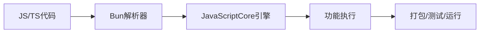
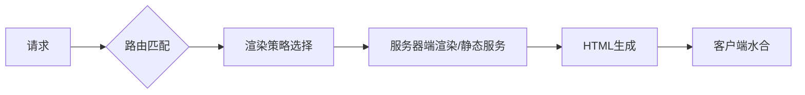
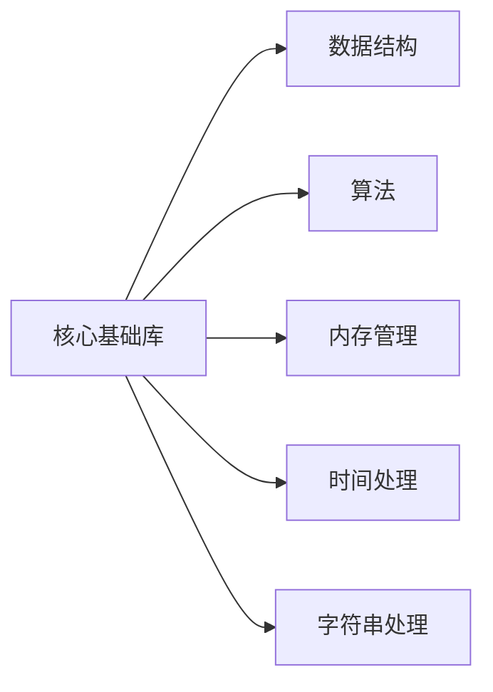
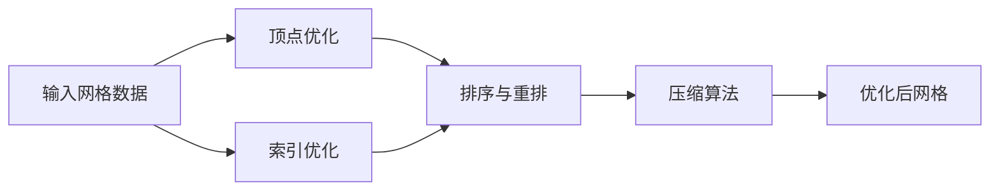
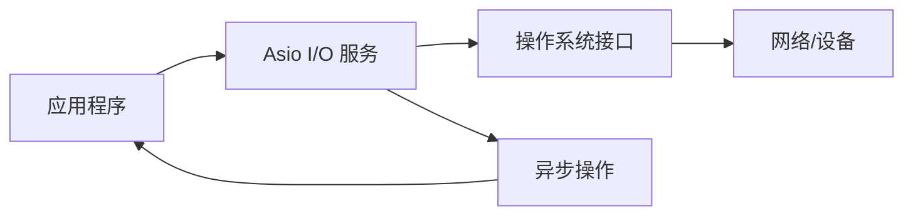
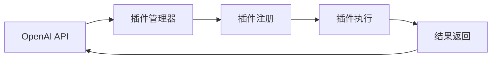
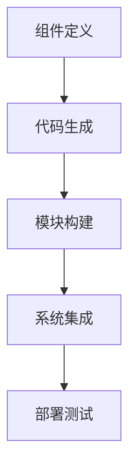

## 今日热点

AI工具链与开发者生产力工具成为今日焦点，Claude相关项目强势增长，同时Bun等全能型开发工具受到广泛关注，显示开发者对效率提升的持续追求。

---

## 热门项目一览

| 排名 | 项目 | 语言 | 今日 | 总计 | 简介 |
|:---:|------|:----:|------:|-----:|------|
| 1 | [wonderwhy-er/DesktopCommanderMCP](https://github.com/wonderwhy-er/DesktopCommanderMCP) | TypeScript | +909 | 7,781 | This is MCP server for Clau... |
| 2 | [malisper/pgrust](https://github.com/malisper/pgrust) | Rust | +774 | 2,085 | Postgres rewritten in Rust,... |
| 3 | [obra/superpowers](https://github.com/obra/superpowers) | Shell | +740 | 252,476 | An agentic skills framework... |
| 4 | [oven-sh/bun](https://github.com/oven-sh/bun) | Rust | +658 | 94,572 | Incredibly fast JavaScript ... |
| 5 | [google-labs-code/stitch-skills](https://github.com/google-labs-code/stitch-skills) | TypeScript | +340 | 7,076 | A library of Agent Skills d... |
| 6 | [vercel/next.js](https://github.com/vercel/next.js) | JavaScript | +334 | 140,962 | The React Framework |
| 7 | [davila7/claude-code-templates](https://github.com/davila7/claude-code-templates) | Python | +232 | 29,027 | CLI tool for configuring an... |
| 8 | [hashicorp/terraform](https://github.com/hashicorp/terraform) | Go | +229 | 49,375 | Terraform enables you to sa... |
| 9 | [anthropics/claude-cookbooks](https://github.com/anthropics/claude-cookbooks) | Jupyter Notebook | +219 | 47,952 | A collection of notebooks/r... |
| 10 | [abseil/abseil-cpp](https://github.com/abseil/abseil-cpp) | C++ | +118 | 17,808 | Abseil Common Libraries (C++) |
| 11 | [catchorg/Catch2](https://github.com/catchorg/Catch2) | C++ | +113 | 21,058 | A modern, C++-native, test ... |
| 12 | [zeux/meshoptimizer](https://github.com/zeux/meshoptimizer) | C++ | +110 | 8,142 | Mesh optimization library t... |

---

## 趋势洞察

```
┌─────────────────────────────────────────────────────────────────┐
│  AI/ML 工具         ████████████████████████  9 个项目        │
│  其他               ████████████████████████  9 个项目        │
│  开发框架             █████████████             5 个项目        │
│  智能家居             ██                        1 个项目        │
└─────────────────────────────────────────────────────────────────┘
```

---

## 项目深度解读

### 1. wonderwhy-er/DesktopCommanderMCP — [Claude终端增强]

> **一句话总结**：为Claude提供终端控制、文件搜索和差异编辑能力的MCP服务器，扩展AI助手系统操作能力

#### 价值主张

| 维度 | 说明 |
|------|------|
| **解决痛点** | 突破Claude无法直接操作终端和文件系统的限制，实现AI与系统深度交互 |
| **目标用户** | 使用Claude的开发者和技术用户，需要AI辅助系统管理和文件操作 |
| **核心亮点** | 终端控制 + 文件系统搜索 + 差异编辑 + MCP协议集成 |

#### 技术架构


**技术特色**：
- TypeScript实现，保证代码类型安全与可维护性
- MCP协议集成，与Claude无缝对接通信
- 终端控制能力，安全执行系统命令
- 文件系统操作，支持高效搜索与编辑
- 差异编辑功能，精准变更文件内容

#### 热度分析

- 项目Star数7,781且单日增长909，表明在AI辅助开发工具领域热度极高且增长迅猛
- 作为Claude生态的重要扩展，处于AI与系统操作融合的前沿位置

#### 快速上手

```bash
# 安装依赖
npm install

# 配置MCP服务器
# 在Claude配置中添加DesktopCommanderMCP服务器地址
```

#### 注意事项

- 终端控制涉及系统操作，需注意安全权限设置
- 文件操作可能影响系统文件，建议在安全环境中使用
- 项目License未知，使用前需确认授权条款
- 可能需要特定版本的Claude支持MCP协议


### 2. malisper/pgrust — Rust PostgreSQL 重写

> **一句话总结**：用 Rust 完全重写的 PostgreSQL 数据库，实现 100% 回归测试兼容性。

#### 价值主张

| 维度 | 说明 |
|------|------|
| **解决痛点** | 提供内存安全、高性能的 PostgreSQL 替代实现 |
| **目标用户** | 需要高性能数据库的企业和 Rust 开发者 |
| **核心亮点** | 100% 回归测试兼容 + 内存安全 + 高性能 |

#### 技术架构


**技术特色**：
- 使用 Rust 实现内存安全，避免 C 语言的常见内存问题
- 保持与原版 PostgreSQL 完全兼容的 API 和功能
- 通过 100% 回归测试确保功能一致性

#### 热度分析

- 项目近期 Star 增长迅速（单日增长 774），表明社区高度关注
- Fork 数相对较少（50），说明项目可能还处于早期阶段，社区贡献尚未大规模展开

#### 快速上手

```bash
git clone https://github.com/malisper/pgrust.git
cd pgrust
cargo build --release
```

#### 注意事项

- 项目尚处于开发阶段，可能不适合生产环境使用
- 虽然 100% 通过回归测试，但可能还有一些未发现的问题或性能优化空间
- 需要关注项目的长期维护和发展状况


### 3. obra/superpowers — 智能技能框架

> **一句话总结**：一个实用的代理技能框架与软件开发方法论，提升个人和团队效能。

#### 价值主张

| 维度 | 说明 |
|------|------|
| **解决痛点** | 解决个人技能提升和团队开发效率问题 |
| **目标用户** | 开发者、技术团队、个人提升者 |
| **核心亮点** | 实用方法论 + 技能框架 + 命令行工具 + 开发流程 + 效率提升 |

#### 技术架构


**技术特色**：
- 基于Shell的轻量级实现
- 模块化技能框架设计
- 实用导向的方法论体系

#### 热度分析

- 项目获得25万+星标，日增740星，显示极强的社区认可度
- 作为方法论框架，在开发者社区具有广泛影响力

#### 快速上手

```bash
# 假设的命令示例
git clone https://github.com/obra/superpowers.git
cd superpowers
./install.sh
```

#### 注意事项

- 项目许可信息不明确，使用前需确认授权条款
- 作为方法论框架，可能需要一定的学习成本来理解和应用


### 4. oven-sh/bun — 全栈JS工具链

> **一句话总结**：Bun是一个超快的JavaScript全栈工具链，整合运行时、打包、测试和包管理功能。

#### 价值主张

| 维度 | 说明 |
|------|------|
| **解决痛点** | 整合分散的JS工具链，解决多工具切换与性能低下问题 |
| **目标用户** | JavaScript/TypeScript开发者，关注性能与简化工具链 |
| **核心亮点** | 基于Rust和JavaScriptCore + 原生TypeScript支持 + 多功能整合 |

#### 技术架构



**技术特色**：
- 使用Rust重写，底层采用JavaScriptCore引擎，性能超越Node.js
- 自定义Zig实现的打包器，提供极快的打包速度
- 原生支持TypeScript，无需预编译步骤

#### 热度分析

- 项目Star数超9万且日增600+，社区认可度极高
- 作为新兴工具，生态与兼容性仍在快速发展中

#### 快速上手

```bash
# 安装Bun
curl -fsSL https://bun.sh/install | bash

# 运行文件
bun run index.js

# 安装依赖
bun install
```

#### 注意事项

- 项目相对较新，某些Node.js模块可能不完全兼容
- 长期稳定性和企业级采用率仍需时间验证


### 5. google-labs-code/stitch-skills — AI代理技能库

> **一句话总结**：为AI开发代理提供标准化技能库，支持多种编码工具的无缝集成。

#### 价值主张

| 维度 | 说明 |
|------|------|
| **解决痛点** | 解决AI代理缺乏标准化技能生态问题 |
| **目标用户** | AI开发人员、AI工具构建者和集成商 |
| **核心亮点** | 开放标准兼容性 + 多工具支持 + 模块化设计 |

#### 技术架构


**技术特色**：
- 基于TypeScript实现，提供类型安全
- 遵循Agent Skills开放标准，确保互操作性
- 模块化设计，便于扩展和维护

#### 热度分析

- 项目Star数量超过7000且持续增长(+340 today)，表明社区高度关注
- 零Open Issues显示项目维护良好，问题解决效率高

#### 快速上手

```bash
# 安装Stitch MCP服务器
npm install -g @stitch-mcp/server

# 安装stitch-skills
npm install @stitch-mcp/skills

# 初始化配置
stitch init
```

#### 注意事项

- 项目许可证信息未知，商业使用前需确认授权条款
- 需要兼容的MCP服务器才能使用，依赖特定环境
- 技能库可能随时间更新，需关注版本兼容性


### 6. vercel/next.js — React全栈框架

> **一句话总结**：React全栈框架，提供SSR/SSG/ISR等多种渲染模式，简化现代Web应用开发。

#### 价值主张

| 维度 | 说明 |
|------|------|
| **解决痛点** | 解决React应用中的路由、性能优化、SEO等核心开发难题 |
| **目标用户** | React开发者、Web应用团队、追求高性能的网站开发者 |
| **核心亮点** | 文件系统路由 + 多种渲染模式 + API路由 + 自动代码优化 + 全栈开发 |

#### 技术架构



**技术特色**：
- 基于文件系统的自动路由，无需手动配置路由表
- 支持多种渲染策略，满足不同场景性能需求
- 内置代码分割和优化，提升应用加载速度

#### 热度分析

- Star数超14万，持续稳定增长，日均新增300+，表明项目活跃度高
- 作为React生态核心框架，已成为现代Web开发的事实标准，社区生态完善

#### 快速上手

```bash
# 创建Next.js项目
npx create-next-app@latest my-app
cd my-app
npm run dev
```

#### 注意事项
- 版本更新较快，需关注版本兼容性和迁移指南
- 大型项目需合理规划页面结构和资源加载策略


### 7. davila7/claude-code-templates — [CLI配置工具]

> **一句话总结**：为 Claude Code 提供配置与监控的命令行工具，简化AI编程助手使用流程。

#### 价值主张

| 维度 | 说明 |
|------|------|
| **解决痛点** | 简化Claude Code的配置与监控，提升AI辅助开发效率 |
| **目标用户** | 使用Claude Code进行开发的程序员与AI编程爱好者 |
| **核心亮点** | 命令行界面 + 配置管理 + 实时监控 + 模板定制 + 易用性 |

#### 技术架构


**技术特色**：
- 基于Python构建，跨平台兼容性强
- 提供直观的命令行界面，降低使用门槛
- 集成配置管理系统，支持个性化定制

#### 热度分析

- 项目获得近3万星，日增232星，表明需求旺盛且增长迅速
- Fork数相对较低，说明项目处于早期阶段，社区贡献潜力大

#### 快速上手

```bash
# 安装工具
pip install claude-code-templates

# 初始化配置
claude-code init

# 启动监控
claude-code monitor
```

#### 注意事项

- 项目许可证信息未知，商业使用前需确认授权条款
- 依赖Claude Code服务，确保网络连接稳定
- 可能需要Anthropic账户和API密钥才能正常使用


### 8. hashicorp/terraform — 基础设施即代码

> **一句话总结**：通过声明式配置文件实现基础设施的自动化创建、变更和管理，确保部署的一致性和可重复性。

#### 价值主张

| 维度 | 说明 |
|------|------|
| **解决痛点** | 手动管理基础设施复杂、易出错、难以版本控制和团队协作 |
| **目标用户** | DevOps工程师、云架构师、系统管理员和开发团队 |
| **核心亮点** | 声明式配置 + 跨云平台支持 + 状态管理 + 变量系统 + 模块化设计 |

#### 技术架构


**技术特色**：
- 声明式语法抽象底层API复杂性
- 状态管理机制跟踪基础设施变更
- 提供丰富的provider生态系统支持多云环境

#### 热度分析

- Terraform拥有近5万星，每日新增约230星，表明其在基础设施即代码领域处于领先地位
- 作为HashiCorp的核心产品，拥有庞大的社区和丰富的生态系统，企业采用率高

#### 快速上手

```bash
# 安装Terraform
wget https://releases.hashicorp.com/terraform/1.5.7/terraform_1.5.7_linux_amd64.zip
unzip terraform_1.5.7_linux_amd64.zip

# 创建简单的AWS EC2实例配置
cat > main.tf <<EOF
provider "aws" {
  region = "us-west-2"
}

resource "aws_instance" "example" {
  ami           = "ami-0c55b159cbfafe1f0"
  instance_type = "t2.micro"
}
EOF

# 初始化并应用配置
terraform init
terraform apply
```

#### 注意事项

- Terraform状态文件包含敏感信息，需妥善保管，不应提交到版本控制系统
- 大规模基础设施管理时需考虑状态文件后端存储和团队协作策略
- 使用前需熟悉HCL语法和目标云平台API特性，避免因理解偏差导致资源错误创建


### 9. anthropics/claude-cookbooks — Claude 使用示例集

> **一句话总结**：Anthropic 官方提供的 Claude AI 使用示例集合，通过 Jupyter Notebook 展示各种实用技巧和最佳实践。

#### 价值主张

| 维度 | 说明 |
|------|------|
| **解决痛点** | 解决开发者如何有效利用 Claude AI 各种功能的问题 |
| **目标用户** | AI 开发者、研究人员、对 Claude AI 感兴趣的技术爱好者 |
| **核心亮点** | 官方出品 + Jupyter Notebook 形式 + 多场景应用示例 + 最佳实践指导 |

#### 技术架构


**技术特色**：
- 基于 Jupyter Notebook 的交互式学习环境
- 涵盖从基础到高级的 Claude 使用技巧
- 提供可直接运行的代码示例

#### 热度分析

- 项目获得近 48,000 个 Star，每日增长约 220，显示 Claude AI 生态的强劲发展势头
- 作为 Anthropic 官方示例库，在 Claude AI 生态中占据核心位置，是开发者学习的重要资源

#### 快速上手

```bash
# 克隆仓库
git clone https://github.com/anthropics/claude-cookbooks.git

# 进入目录并启动 Jupyter Notebook
cd claude-cookbooks && jupyter notebook
```

#### 注意事项

- 需要安装 Jupyter 和相关依赖才能运行示例
- 某些示例可能需要 Claude API 密钥或特定环境配置
- 随着 Claude 模型的更新，部分示例可能需要调整以保持有效性


### 10. abseil/abseil-cpp — Google C++基础库

> **一句话总结**：Google 开发的高质量 C++ 基础库集合，提供经过生产验证的常用组件

#### 价值主张

| 维度 | 说明 |
|------|------|
| **解决痛点** | 提供标准化、跨平台的 C++ 基础库，解决代码重复和兼容性问题 |
| **目标用户** | C++ 开发者，特别是需要构建高性能、可靠系统的团队 |
| **核心亮点** | 生产验证 + 跨平台支持 + 模块化设计 + 持续更新 |

#### 技术架构



**技术特色**：
- 提供与 Google 内部生产环境相同质量的库组件
- 采用宽松的 Apache 2.0 许可证，便于商业使用
- 强调不破坏的兼容性保证，降低长期维护成本
- 提供现代化 C++ 特性支持，同时保持向后兼容

#### 热度分析

- 作为 Google 主导的开源项目，获得稳定增长，表明 C++ 社区对高质量基础库的持续需求
- 在 C++ 生态系统中占据重要位置，被众多知名项目和公司采用

#### 快速上手

```bash
# 克隆仓库
git clone https://github.com/abseil/abseil-cpp.git
# 创建构建目录并构建
mkdir build && cd build
cmake .. && make
```

#### 注意事项

- 某些库可能依赖特定版本的 C++ 标准（C++11 或更高）
- 需要遵循 Abseil 的兼容性政策，避免直接依赖内部实现细节
- 部分组件可能需要额外配置才能在特定平台上正常工作


### 11. catchorg/Catch2 — C++测试框架

> **一句话总结**：现代C++原生测试框架，提供简洁语法和丰富功能，支持单元测试、TDD和BDD。

#### 价值主张

| 维度 | 说明 |
|------|------|
| **解决痛点** | 解决C++测试框架复杂、配置困难、依赖多的痛点 |
| **目标用户** | C++开发者，特别是进行单元测试、TDD和BDD的开发团队 |
| **核心亮点** | 简洁直观语法 + 单头文件设计 + 无外部依赖 + 丰富断言宏 + 多种测试风格支持 |

#### 技术架构


**技术特色**：
- 基于宏和模板的自动测试发现机制
- 单头文件设计，便于快速集成
- 支持参数化测试和测试套件分组
- 提供丰富的断言宏和异常测试功能

#### 热度分析

- 拥有21,000+ Star和3,400+ Fork，每日新增约113个Star，表明在C++测试领域有极高认可度
- 0个Open Issues反映项目维护良好，社区问题解决及时，生态成熟稳定

#### 快速上手

```bash
# 下载Catch2
git clone https://github.com/catchorg/Catch2.git
cd Catch2
mkdir build && cd build
cmake .. && make
# 编写测试用例并运行
```

#### 注意事项

- 需要支持C++11或更高版本的编译器
- 单头文件版本需要正确配置头文件包含路径
- 对于大型项目，可能需要配置测试发现规则以避免扫描过多文件


### 12. zeux/meshoptimizer — 网格优化引擎

> **一句话总结**：高效网格优化库，减小模型体积并提升渲染性能。

#### 价值主张

| 维度 | 说明 |
|------|------|
| **解决痛点** | 3D模型体积大、渲染效率低，占用大量内存和带宽 |
| **目标用户** | 游戏开发者、3D图形引擎开发者、实时渲染应用开发者 |
| **核心亮点** | 缓存优化算法 + 多种压缩策略 + 渲染性能提升 + 轻量级实现 + 跨平台兼容 |

#### 技术架构



**技术特色**：
- 基于GPU缓存优化的顶点排序算法
- 高效的网格压缩和简化技术
- 针对现代渲染管线优化的数据结构

#### 热度分析

- 项目获得8,142个星标，近期增长稳定，表明其在3D图形领域有较高认可度
- Fork数786，社区活跃度高，有较好的二次开发和扩展活动

#### 快速上手

```bash
# 克隆仓库
git clone https://github.com/zeux/meshoptimizer.git

# 基本使用示例
#include "meshoptimizer.h"

// 优化顶点缓存
meshopt_optimizeVertexCache(indices, indices, indexCount, vertexCount);
```

#### 注意事项

- 需要明确许可证信息（当前显示为Unknown）
- 作为C++库，需要适当的C++标准支持（建议C++11或更高）
- 对于不同类型的3D模型，优化效果可能有所差异


### 13. DayuanJiang/next-ai-draw-io — AI图表设计工具

> **一句话总结**：将AI能力与draw.io图表结合，支持自然语言命令创建和修改图表的智能工具。

#### 价值主张

| 维度 | 说明 |
|------|------|
| **解决痛点** | 传统图表设计需要专业技能，AI辅助降低使用门槛 |
| **目标用户** | 需要创建专业图表的开发者、设计师和业务分析师 |
| **核心亮点** | 自然语言命令生成图表 + AI辅助可视化 + draw.io集成 |

#### 技术架构


**技术特色**：
- 基于Next.js构建的现代化Web应用，支持服务端渲染
- 集成AI能力处理自然语言命令并生成图表
- 与draw.io深度集成，提供专业图表编辑功能
- 使用TypeScript确保类型安全，提高代码质量

#### 热度分析

- 项目获得33,300个Star，且仍有81个今日新增，表明项目热度持续上升
- 3,603个Fork显示社区积极参与和贡献意愿
- 零Open Issues可能表明项目维护良好或问题解决机制高效

#### 快速上手

```bash
# 克隆项目
git clone https://github.com/DayuanJiang/next-ai-draw-io.git
# 进入项目目录
cd next-ai-draw-io
# 安装依赖
npm install
# 启动开发服务器
npm run dev
```

#### 注意事项

- 项目使用Unknown许可证，使用前需确认具体许可条款
- 需要确保API密钥安全配置，特别是AI相关服务
- 项目依赖外部AI服务，需关注API使用限制和成本


### 14. home-assistant/core — 智能家居中枢

> **一句话总结**：开源家庭自动化平台，优先本地控制与隐私保护。

#### 价值主张

| 维度 | 说明 |
|------|------|
| **解决痛点** | 统一控制各类智能家居设备，保障本地数据隐私 |
| **目标用户** | 注重隐私的智能家居爱好者与自动化发烧友 |
| **核心亮点** | 开源可定制 + 本地优先架构 + 强大集成能力 |

#### 技术架构


**技术特色**：
- 基于Python构建，易于扩展与定制
- 采用本地优先架构，确保数据隐私安全
- 提供丰富的REST API与WebSocket接口

#### 热度分析

- 项目拥有超过8.8万星，日增80星，表明其作为智能家居解决方案受到广泛认可
- 活跃的开发社区与丰富的第三方组件形成完整智能家居生态系统

#### 快速上手

```bash
# 安装Home Assistant
sudo apt update
sudo apt install home-assistant

# 启动服务
sudo systemctl start home-assistant
sudo systemctl enable home-assistant
```

#### 注意事项

- 需要一定的Python知识进行深度定制与开发
- 某些设备集成可能需要额外硬件支持
- 配置文件复杂度可能随集成设备数量增加而提高


### 15. chriskohlhoff/asio — 跨平台异步IO库

> **一句话总结**：Asio 是一个强大的跨平台 C++ 库，提供高效异步网络和低级 I/O 操作能力。

#### 价值主张

| 维度 | 说明 |
|------|------|
| **解决痛点** | 解决 C++ 中跨平台网络编程和高效异步 I/O 的复杂性问题 |
| **目标用户** | C++ 网络开发者、高性能系统架构师、跨平台应用开发者 |
| **核心亮点** | 跨平台兼容性 + 高性能异步模型 + 统一I/O接口 + 可扩展设计 + 与 Boost 库集成 |

#### 技术架构



**技术特色**：
- 基于 Reactor 模式的异步 I/O 框架
- 支持多种异步操作方式，如回调函数、仿函数、future 等
- 提供统一的接口处理不同类型的 I/O 操作，包括网络套接字、定时器、串口等

#### 热度分析

- Asio 是 C++ 网络编程的事实标准库，拥有稳定的高增长率和广泛的工业应用
- 作为 Boost.Asio 的独立版本，在 C++ 社区中具有重要地位，是构建高性能网络服务的基础组件

#### 快速上手

```bash
# 安装 Asio
wget https://github.com/chriskohlhoff/asio/archive/asio-1-22-0.tar.gz
tar -xzf asio-1-22-0.tar.gz
# 在项目中包含 Asio 头文件
#include <asio.hpp>
```

#### 注意事项

- Asio 是一个头文件库，不需要编译，但需要正确设置包含路径
- 异步编程模型需要仔细处理错误和生命周期问题
- 在不同平台上可能需要特定的编译器标志或配置


### 16. microsoft/PowerToys — Windows 增强工具集

> **一句话总结**：微软官方开发的 Windows 系统增强工具集，提供多个实用工具提升用户体验和效率。

#### 价值主张

| 维度 | 说明 |
|------|------|
| **解决痛点** | Windows 系统原生功能有限，用户需要更高效、更个性化的操作体验 |
| **目标用户** | 高级 Windows 用户、开发者、系统管理员和追求效率的普通用户 |
| **核心亮点** | 系统级增强 + 多工具集成 + 官方支持 + 开源可定制 + 跨功能整合 |

#### 技术架构


**技术特色**：
- 基于 Windows API 和系统服务进行深度集成
- 采用模块化设计，各工具独立运行又统一管理
- 使用现代 UI 框架提供流畅用户体验

#### 热度分析

- 作为微软开源项目，Star 数持续稳定增长，显示开发者社区高度认可
- 作为系统级工具，在 Windows 生态中占据独特位置，无直接竞争对手

#### 快速上手

```bash
# 克隆项目
git clone https://github.com/microsoft/PowerToys.git

# 构建项目
cd PowerToys
build -x64

# 安装并运行
.\PowerToys.exe
```

#### 注意事项

- 需要较新的 Windows 版本才能运行所有工具
- 部分工具需要管理员权限才能完全发挥功能
- 开发构建版本可能不稳定，建议使用官方发布的稳定版本


### 17. prisma/prisma — 现代数据库 ORM

> **一句话总结**：Prisma 是一个类型安全的现代 ORM 工具，为 Node.js 和 TypeScript 提供高效数据库访问能力。

#### 价值主张

| 维度 | 说明 |
|------|------|
| **解决痛点** | 解决传统 ORM 类型安全缺失、性能低下和开发体验差的问题 |
| **目标用户** | 使用 Node.js 和 TypeScript 的全栈开发者和数据库工程师 |
| **核心亮点** | 类型安全 + 自动生成查询 + 数据库迁移工具 + 多数据库支持 + 智能IDE支持 |

#### 技术架构


**技术特色**：
- 采用声明式数据模型定义，支持类型自动生成
- 提供类型安全的查询构建器，避免运行时错误
- 支持数据库迁移和版本控制，简化数据库变更管理
- 内置性能优化，自动生成高效查询
- 提供直观的 API 和丰富的开发工具

#### 热度分析

- Prisma 项目获得近 5 万星，持续增长，表明其在现代数据库工具领域具有显著影响力
- 作为 TypeScript 生态中的重要项目，已成为 Node.js 开发中替代传统 ORM 的首选方案之一

#### 快速上手

```bash
# 安装 Prisma CLI
npm install -g prisma

# 初始化新项目
prisma init

# 定义数据模型
# 编辑 schema.prisma 文件

# 生成 Prisma Client
npx prisma generate

# 运行迁移
npx prisma migrate dev
```

#### 注意事项

- Prisma 的查询语法与传统 SQL 或其他 ORM 有显著差异，需要适应学习曲线
- 对于复杂查询，可能需要使用原始 SQL 或 Prisma 的扩展功能
- 某些高级数据库特性可能不完全支持，需查阅兼容性文档
- Prisma 的免费版本有一些功能限制，企业级功能需要付费订阅


### 18. openai/plugins — AI插件扩展平台

> **一句话总结**：OpenAI官方插件框架，赋能开发者扩展AI模型能力与集成外部服务。

#### 价值主张

| 维度 | 说明 |
|------|------|
| **解决痛点** | 突破AI原生功能限制，实现模型与外部工具的无缝集成 |
| **目标用户** | AI应用开发者、企业集成人员和AI研究人员 |
| **核心亮点** | 模块化架构设计 + 安全沙箱执行 + 多语言支持 + 工具调用能力 + API集成友好 |

#### 技术架构



**技术特色**：
- 基于JavaScript/TypeScript的轻量级插件架构
- 提供插件开发和部署的标准规范
- 支持插件的安全隔离和权限控制

#### 热度分析

- 项目Star数持续增长，显示OpenAI插件生态正快速发展
- 社区活跃度高，表明开发者对AI扩展功能需求强烈

#### 快速上手

```bash
# 克隆项目
git clone https://github.com/openai/plugins.git

# 安装依赖
npm install

# 启动开发环境
npm run dev
```

#### 注意事项

- 插件开发需遵循OpenAI的安全指南
- 注意API调用限制和成本控制
- 插件需经过审核才能在生产环境使用


### 19. ansible/ansible — IT自动化平台

> **一句话总结**：基于Python的无代理IT自动化工具，使用SSH和声明式YAML配置简化系统部署与维护工作。

#### 价值主张

| 维度 | 说明 |
|------|------|
| **解决痛点** | 消除IT环境配置管理复杂性和手动操作的不一致性，实现标准化自动化部署 |
| **目标用户** | 运维工程师、系统管理员、DevOps团队、云架构师 |
| **核心亮点** | 无代理架构 + 声明式YAML配置 + 跨平台支持 + 丰富模块库 + 幂等性操作 |

#### 技术架构


**技术特色**：
- 基于Python构建，利用SSH实现无代理远程管理
- 采用模块化设计，提供数千个预置模块覆盖各种IT场景
- 实现幂等性操作，确保重复执行不会产生副作用
- 支持多种插件扩展，满足不同环境需求

#### 热度分析

- 拥有近7万Star，日增24个，表明在企业自动化领域持续保持强劲吸引力
- 作为IT自动化领域的领导者，拥有庞大活跃社区和丰富生态系统，是企业级自动化解决方案的首选

#### 快速上手

```bash
# 安装Ansible
pip install ansible

# 创建inventory文件
echo '[servers]' > inventory.ini
echo '192.168.1.10' >> inventory.ini

# 执行简单命令
ansible -i inventory.ini servers -m ping
```

#### 注意事项

- 确保目标系统已启用SSH服务并配置好密钥认证，避免密码明文传输
- Playbook编写时严格遵守YAML语法规则，缩进错误会导致执行失败
- 复杂环境建议使用AWX/Tower进行集中管理和可视化操作
- 对于Windows节点，需额外配置WinRM服务才能实现管理功能
- 大规模部署时合理配置并发连接数(fork参数)，避免控制节点过载


### 20. nasa/fprime — 航天软件框架

> **一句话总结**：NASA官方开发的模块化C++框架，为航天任务提供高可靠性的飞行软件开发环境。

#### 价值主张

| 维度 | 说明 |
|------|------|
| **解决痛点** | 解决航天软件高可靠性、可追溯性和模块化需求，降低系统错误风险 |
| **目标用户** | 航天任务开发者、嵌入式系统工程师、航空航天领域研究人员 |
| **核心亮点** | 模块化架构 + 自动代码生成 + 实时系统支持 + NASA官方认证 |

#### 技术架构



**技术特色**：
- 基于组件的架构设计，提高代码复用性和可维护性
- 自动代码生成机制，减少人为错误，确保一致性
- 支持多任务实时操作系统，满足航天任务实时性需求

#### 热度分析

- 作为NASA官方项目，FPrime获得稳定高星增长，表明其在航天软件领域的重要地位
- 社区活跃度高，尽管Open Issues为0，但Fork数量表明有大量实际应用和二次开发

#### 快速上手

```bash
# 克隆仓库
git clone https://github.com/nasa/fprime.git
# 进入目录
cd fprime
# 构建示例
mkdir build && cd build && cmake .. && make
```

#### 注意事项

- FPrime主要用于航天和关键嵌入式系统，学习曲线较陡
- 需要一定的C++和实时系统基础知识
- NASA官方文档和示例是学习的重要资源


### 21. cypress-io/cypress — 前端测试框架

> **一句话总结**：Cypress 是一个快速、简单且可靠的浏览器自动化测试工具，支持现代 Web 应用的端到端测试。

#### 价值主张

| 维度 | 说明 |
|------|------|
| **解决痛点** | 解决了 Web 应用测试的复杂性，提供一站式测试解决方案 |
| **目标用户** | Web 开发者、QA 工程师、前端团队 |
| **核心亮点** | 实时重新加载 + 自动等待 + 时间旅行调试 + 强大的选择器 |

#### 技术架构

```mermaid
graph LR
    A[测试用例] --> B[Cypress 测试运行器]
    B --> C[浏览器自动化]
    C --> D[DOM 操作]
    D --> E[断言验证]
```

**技术特色**：
- 基于 Electron 构建，提供一致的环境
- 直接在浏览器中运行测试，无需外部依赖
- 智能自动等待机制，解决异步测试问题
- 完整的时间旅行调试功能，可逐步查看测试执行过程

#### 热度分析

- 项目拥有超过 50k stars，持续稳定增长，表明在前端测试领域具有强大影响力
- 社区活跃度高，被众多知名公司采用，已成为行业标准工具之一

#### 快速上手

```bash
# 安装 Cypress
npm install cypress --save-dev

# 打开 Cypress 测试运行器
npx cypress open

# 运行测试
npx cypress run
```

#### 注意事项

- 测试环境应尽可能与生产环境一致，避免环境差异导致的问题
- 对于复杂应用，可能需要优化测试策略以提高测试执行效率
- 注意 Cypress 的免费版和企业版功能差异，某些高级功能可能需要付费


### 22. nuxt/nuxt — 全栈Vue框架

> **一句话总结**：基于Vue的全栈框架，提供SSR/SSG能力，简化现代Web应用开发

#### 价值主张

| 维度 | 说明 |
|------|------|
| **解决痛点** | 解决Vue应用SEO、性能优化及全栈开发复杂性 |
| **目标用户** | 需要构建高性能、SEO友好的Vue应用的开发者 |
| **核心亮点** | 自动化路由 + 服务端渲染 + 静态生成 + 模块化架构 + 开箱即用的开发体验 |

#### 技术架构

```mermaid
graph LR
    A[Vue组件] --> B[Nuxt引擎]
    B --> C[渲染中间件]
    C --> D[服务端/客户端]
    D --> E[输出HTML/JSON]
```

**技术特色**：
- 基于Vue.js生态系统，提供统一的开发范式
- 支持服务端渲染(SSR)和静态站点生成(SSG)两种模式
- 自动化路由系统和文件系统路由
- 模块化架构，可通过插件扩展功能
- 内置优化，如代码分割、懒加载等

#### 热度分析

- 高星项目，持续稳定增长，表明其在Vue生态中的重要地位
- 拥有活跃的社区和丰富的插件生态，是Vue全栈开发的首选框架之一

#### 快速上手

```bash
# 创建Nuxt项目
npx nuxi@latest init my-project
cd my-project
npm install
npm run dev
```

#### 注意事项

- 需要Node.js环境支持
- 学习曲线比普通Vue应用陡峭
- 部署需要考虑服务端环境的配置


### 23. actions/checkout — Git代码检出工具

> **一句话总结**：GitHub官方提供的代码检出Action，简化CI/CD中的代码获取流程，支持多种认证方式和检出配置。

#### 价值主张

| 维度 | 说明 |
|------|------|
| **解决痛点** | 解决CI/CD流程中代码检出的复杂配置问题，简化工作流设置 |
| **目标用户** | GitHub Actions工作流开发者，CI/CD工程师，DevOps实践者 |
| **核心亮点** | 多种认证方式支持 + 深度Git功能支持 + 灵活的检出配置 + 跨平台兼容性 + 官方维护保证 |

#### 技术架构

```mermaid
graph LR
    A[工作流触发] --> B[输入参数处理]
    B --> C[认证处理]
    C --> D[Git检出操作]
    D --> E[输出工作区]
```

**技术特色**：
- 轻量级Node.js实现，性能高效
- 支持多种Git认证方式，包括GitHub App、Personal Access Token等
- 提供丰富的检出选项，如深度检出、单一分支检出等
- 内置错误处理和日志机制，便于调试
- 跨平台兼容，支持Windows、Linux和macOS

#### 热度分析

- 作为GitHub官方Actions之一，拥有8467个Star和2713个Fork，稳定增长，表明其在CI/CD领域的核心地位
- 作为GitHub Actions生态系统的基础组件，被广泛使用，社区贡献活跃，是DevOps工作流中不可或缺的工具

#### 快速上手

```yaml
name: CI
on: [push]
jobs:
  build:
    runs-on: ubuntu-latest
    steps:
    - uses: actions/checkout@v3
    - run: npm install && npm test
```

#### 注意事项

- 需要为Action提供适当的认证令牌，否则可能无法访问私有仓库
- 不同版本之间可能有API变化，建议锁定版本号以确保工作流稳定性
- 对于大型仓库，考虑使用`fetch-depth: 0`或指定具体分支以提高性能
- 注意Action的版本兼容性，v3版本与v2版本在功能上有显著差异


### 24. dotnet/aspnetcore — 跨平台Web框架

> **一句话总结**：微软高性能开源Web框架，支持跨平台云原生应用开发，提供现代Web开发体验。

#### 价值主张

| 维度 | 说明 |
|------|------|
| **解决痛点** | 解决.NET框架跨平台部署和性能优化的核心问题 |
| **目标用户** | .NET开发者、企业Web应用开发者、云原生应用构建者 |
| **核心亮点** | 跨平台支持 + 高性能 + 开源 + 模块化设计 + 云原生 |

#### 技术架构

```mermaid
graph LR
    A[HTTP请求] --> B[中间件管道]
    B --> C[路由系统]
    C --> D[控制器/页面]
    D --> E[业务逻辑]
    E --> F[响应]
```

**技术特色**：
- Kestrel高性能Web服务器，支持跨平台运行
- 依赖注入容器，提供灵活解耦与测试支持
- 中间件管道架构，实现高度可扩展性

#### 热度分析

- 作为微软主力开源项目，Star数稳定增长，社区参与度高
- 在.NET生态中占据核心地位，带动整个.NET开源生态系统发展

#### 快速上手

```bash
# 安装.NET SDK
# 创建新项目
dotnet new web -n MyWebApp
# 运行项目
cd MyWebApp
dotnet run
```

#### 注意事项

- 版本更新较快，需要注意版本兼容性
- 配置相对复杂，需要一定学习成本
- 部署到Linux环境时需要注意特定配置


## 今日推荐

| 主题 | 推荐项目 | 亮点 |
|------|----------|------|
| 今日最热 | [wonderwhy-er/DesktopCommanderMCP](https://github.com/wonderwhy-er/DesktopCommanderMCP) | This is MCP serve... |
| 值得关注 | [malisper/pgrust](https://github.com/malisper/pgrust) | Postgres rewritte... |
| 快速上手 | [obra/superpowers](https://github.com/obra/superpowers) | An agentic skills... |
| 长期潜力 | [oven-sh/bun](https://github.com/oven-sh/bun) | Incredibly fast J... |

---

<div align="center">

*Generated on 2026-07-12 | Powered by GitHub Trending Reporter*

</div>