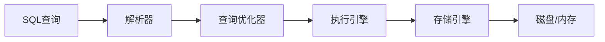
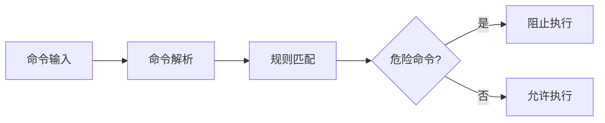
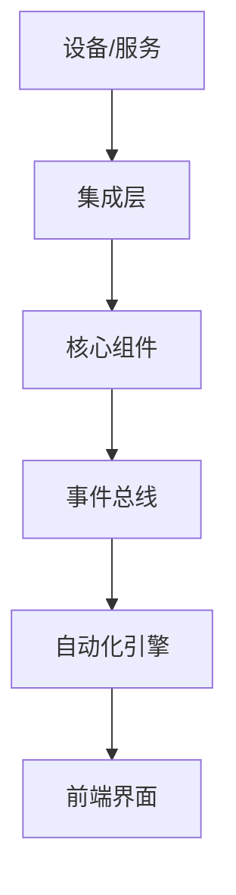
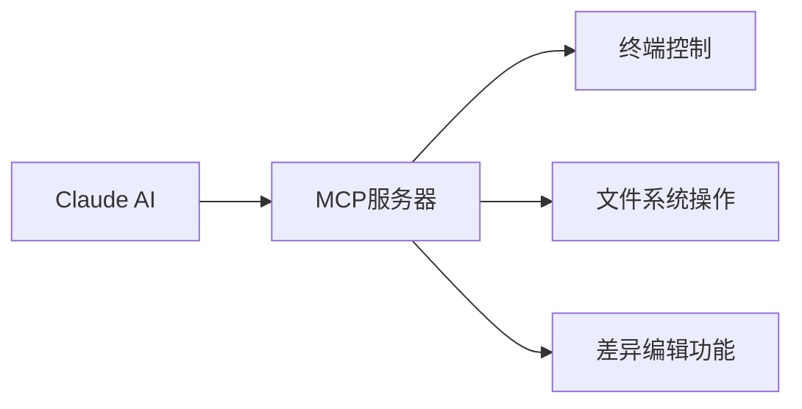
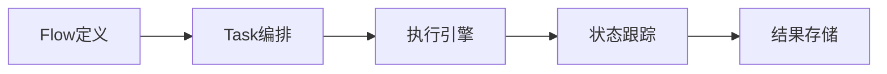

## 今日热点

今日GitHub热榜项目精彩纷呈。

---

## 热门项目一览

| 排名 | 项目 | 语言 | 今日 | 总计 | 简介 |
|:---:|------|:----:|------:|-----:|------|
| 1 | [HKUDS/Vibe-Trading](https://github.com/HKUDS/Vibe-Trading) | Python | +768 | 20,612 | "Vibe-Trading: Your Persona... |
| 2 | [k1tbyte/Wand-Enhancer](https://github.com/k1tbyte/Wand-Enhancer) | C# | +609 | 6,976 | Advanced UX and interoperab... |
| 3 | [malisper/pgrust](https://github.com/malisper/pgrust) | Rust | +518 | 2,490 | Postgres rewritten in Rust,... |
| 4 | [anthropics/claude-cookbooks](https://github.com/anthropics/claude-cookbooks) | Jupyter Notebook | +459 | 48,445 | A collection of notebooks/r... |
| 5 | [Dicklesworthstone/destructive_command_guard](https://github.com/Dicklesworthstone/destructive_command_guard) | Rust | +444 | 2,964 | The Destructive Command Gua... |
| 6 | [Shubhamsaboo/awesome-llm-apps](https://github.com/Shubhamsaboo/awesome-llm-apps) | Python | +408 | 118,609 | 100+ AI Agent & RAG apps yo... |
| 7 | [home-assistant/core](https://github.com/home-assistant/core) | Python | +400 | 89,086 | 🏡 Open source home automati... |
| 8 | [par274/sharpemu](https://github.com/par274/sharpemu) | C# | +314 | 1,290 | An experimental PlayStation... |
| 9 | [davila7/claude-code-templates](https://github.com/davila7/claude-code-templates) | Python | +274 | 29,250 | CLI tool for configuring an... |
| 10 | [wonderwhy-er/DesktopCommanderMCP](https://github.com/wonderwhy-er/DesktopCommanderMCP) | TypeScript | +210 | 8,006 | This is MCP server for Clau... |
| 11 | [Nutlope/hallmark](https://github.com/Nutlope/hallmark) | CSS | +155 | 4,313 | Anti-AI-slop design skill f... |
| 12 | [chen08209/FlClash](https://github.com/chen08209/FlClash) | Dart | +154 | 45,240 | A multi-platform proxy clie... |

---

## 趋势洞察

```
┌─────────────────────────────────────────────────────────────────┐
│  AI/ML 工具         ████████████████████████  10 个项目        │
│  其他               ███████                   3 个项目        │
│  开发框架             ██                        1 个项目        │
│  智能家居             ██                        1 个项目        │
│  项目管理             ██                        1 个项目        │
│  开发工具             ██                        1 个项目        │
└─────────────────────────────────────────────────────────────────┘
```

---

## 项目深度解读

### 1. HKUDS/Vibe-Trading — AI交易助手

> **一句话总结**：基于AI的个人交易代理，提供智能市场分析和交易决策支持。

#### 价值主张

| 维度 | 说明 |
|------|------|
| **解决痛点** | 金融交易中信息过载和决策困难，提供AI辅助决策支持 |
| **目标用户** | 个人投资者、交易员和金融分析师，需要AI辅助决策的人群 |
| **核心亮点** | AI驱动的市场分析 + 个性化交易策略 + 实时市场洞察 + 风险管理功能 |

#### 技术架构


**技术特色**：
- 基于深度学习的市场预测算法
- 实时数据处理与分析能力
- 多维度风险控制系统

#### 热度分析

- 项目获得超20k星标，单日新增768星，显示极高社区关注度和认可度
- 作为开源交易代理项目，填补了市场上个人交易AI助手的需求空缺

#### 快速上手

```bash
# 克隆项目
git clone https://github.com/HKUDS/Vibe-Trading.git
cd Vibe-Trading
# 安装依赖
pip install -r requirements.txt
# 运行交易代理
python vibe_trading.py
```

#### 注意事项

- 金融交易存在风险，AI代理建议仅作为参考，不构成投资建议
- 需要了解基本的金融市场知识才能有效使用系统
- 可能需要配置API密钥以获取实时市场数据
- 开源项目可能需要自行维护和更新，确保与市场变化同步


### 2. k1tbyte/Wand-Enhancer — [游戏辅助增强]

> **一句话总结**：为WeMod游戏修改器提供高级功能扩展和互操作性的增强工具

#### 价值主张

| 维度 | 说明 |
|------|------|
| **解决痛点** | 增强WeMod功能，提供更强大的游戏修改和辅助能力 |
| **目标用户** | 游戏玩家，特别是需要高级游戏辅助功能的用户 |
| **核心亮点** | 高级用户体验 + 多平台互操作性 + 功能扩展 + 界面优化 + 自动化支持 |

#### 技术架构


**技术特色**：
- 基于C#开发的插件系统，与WeMod深度集成
- 通过内存注入和修改实现游戏功能增强
- 模块化设计支持多种游戏和自定义功能
- 提供自动化脚本支持，实现复杂游戏辅助功能

#### 热度分析

- 项目近期热度飙升，单日新增Star数超过600，增长速度迅猛
- Fork数远高于Star数，表明项目被广泛二次开发和功能定制，社区活跃度高

#### 快速上手

```bash
# 克隆仓库
git clone https://github.com/k1tbyte/Wand-Enhancer.git

# 构建运行（需要.NET环境）
cd Wand-Enhancer
dotnet build && dotnet run
```

#### 注意事项

- 此项目仅用于学习和研究目的，请遵守相关游戏服务条款
- 使用不当可能导致游戏账号被封禁
- 项目依赖WeMod应用，需要先安装基础版WeMod
- 由于许可证未知，商业使用前需确认授权方式


### 3. malisper/pgrust — PostgreSQL Rust实现

> **一句话总结**：用Rust完全重写的PostgreSQL数据库，实现100%回归测试兼容，提供高性能安全数据库解决方案。

#### 价值主张

| 维度 | 说明 |
|------|------|
| **解决痛点** | 解决传统PostgreSQL性能瓶颈和内存安全问题，提供现代数据库实现 |
| **目标用户** | 对性能和安全性有高要求的数据库开发者、企业级应用构建者 |
| **核心亮点** | 100% Postgres回归测试通过 + Rust内存安全 + 高性能并发处理 |

#### 技术架构



**技术特色**：
- 基于Rust的高并发、零成本抽象设计
- 完全兼容PostgreSQL协议和SQL方言
- 利用Rust的所有权系统确保内存安全
- 通过所有PostgreSQL回归测试，保证功能完整性

#### 热度分析

- 项目近期Star增长迅速（单日新增518），表明社区对其Rust实现的兴趣高涨
- 虽然Issues为零，但Fork数相对较少，可能表明项目仍处于早期阶段或技术门槛较高

#### 快速上手

```bash
# 克隆项目
git clone https://github.com/malisper/pgrust.git
cd pgrust

# 构建项目
cargo build --release

# 运行测试（验证100%回归测试通过）
cargo test
```

#### 注意事项

- 项目尚处于开发阶段，可能不适合生产环境使用
- 需要一定的Rust和数据库系统知识才能有效参与贡献
- 许可证信息不明确，使用前需确认开源许可条款


### 4. anthropics/claude-cookbooks — Claude 应用指南

> **一句话总结**：精选 Claude 应用实例集，提供实用技巧和创意用法，提升 AI 交互体验。

#### 价值主张

| 维度 | 说明 |
|------|------|
| **解决痛点** | 解决如何有效利用 Claude 功能的问题，提供实用应用场景 |
| **目标用户** | Claude 用户、AI 开发者、研究人员 |
| **核心亮点** | 丰富的使用示例 + 实用的代码模板 + 创意的应用场景 + 清晰的教程指导 |

#### 技术架构


**技术特色**：
- 基于 Jupyter Notebook 的交互式展示
- 多样化的 Claude 应用场景
- 实用的代码示例和模板
- 清晰的教程和解释

#### 热度分析

- 项目获得近5万星，日增近500星，显示出极高的社区关注度和认可度
- 作为 Anthropic 官方项目，处于 Claude AI 生态的核心位置，是用户学习和应用 Claude 的重要资源

#### 快速上手

```bash
# 克隆仓库
git clone https://github.com/anthropics/claude-cookbooks.git

# 打开并运行笔记本
cd claude-cookbooks
jupyter notebook
```

#### 注意事项

- 需要安装 Jupyter 才能运行笔记本
- 某些示例可能需要 Claude API 访问权限
- 建议按照笔记本的难度顺序学习
- 注意遵守 Anthropic 的使用政策


### 5. Dicklesworthstone/destructive_command_guard — 命令安全卫士

> **一句话总结**：用Rust构建的命令拦截工具，防止危险git和shell命令意外或恶意执行。

#### 价值主张

| 维度 | 说明 |
|------|------|
| **解决痛点** | 防止危险命令被意外或恶意执行导致系统损坏或数据丢失 |
| **目标用户** | 开发者、系统管理员、CI/CD管道管理者 |
| **核心亮点** | + 基于Rust内存安全 + 可自定义危险命令规则 + 支持git和shell拦截 |

#### 技术架构



**技术特色**：
- 基于Rust高性能特性，低资源消耗实现高效拦截
- 支持灵活的危险命令规则配置系统
- 可作为前置拦截层与多种shell环境集成

#### 热度分析

- 单日新增444星，表明命令安全领域需求旺盛，增长迅速
- 虽然Open Issues为0，但Fork数相对较低，可能处于早期发展阶段

#### 快速上手

```bash
# 安装
cargo install destructive_command_guard

# 使用
dcg --config /path/to/config.toml --command "rm -rf /"
```

#### 注意事项

- 需要正确配置危险命令规则，可能存在误拦截风险
- 作为安全工具，应定期更新规则以应对新型危险命令模式
- 在生产环境中使用前应充分测试，避免阻止必要的合法操作


### 6. Shubhamsaboo/awesome-llm-apps — LLM应用集合

> **一句话总结**：收录100+可直接运行的AI代理与RAG应用，支持克隆、定制和部署。

#### 价值主张

| 维度 | 说明 |
|------|------|
| **解决痛点** | 解决AI应用开发门槛高、缺乏实用示例的问题 |
| **目标用户** | AI开发者、研究人员和企业技术团队 |
| **核心亮点** | + 即用型应用示例 + 可克隆定制 + 涵盖多种LLM场景 |

#### 技术架构


**技术特色**：
- 多样化的LLM应用场景覆盖
- 提供完整的可运行代码示例
- 支持多种主流LLM框架和API

#### 热度分析

- 项目Star数超11万，日均增长400+，显示LLM应用开发社区高度活跃
- 作为LLM应用资源库，处于AI开发生态的关键枢纽位置

#### 快速上手

```bash
# 克隆项目
git clone https://github.com/Shubhamsaboo/awesome-llm-apps.git

# 进入项目目录
cd awesome-llm-apps

# 查看可用的应用列表
ls apps/
```

#### 注意事项

- 不同应用可能需要不同的API密钥和环境配置
- 部分应用可能需要额外的依赖库，建议查看每个应用目录下的README文件
- 项目持续更新，建议关注最新应用和最佳实践


### 7. home-assistant/core — 家庭自动化系统

> **一句话总结**：开源家庭自动化平台，将本地控制和隐私保护置于首位，支持多设备集成。

#### 价值主张

| 维度 | 说明 |
|------|------|
| **解决痛点** | 破除智能家居云端依赖，实现完全本地化控制，保障用户隐私 |
| **目标用户** | 技术爱好者、智能家居用户、自动化开发者、隐私关注者 |
| **核心亮点** | 完全本地运行 + 开源免费 + 支持数千设备 + 模块化架构 + 强大的自动化引擎 |

#### 技术架构



**技术特色**：
- 基于Python的事件驱动架构，高效处理设备状态变化
- 插件化集成系统，支持轻松扩展新设备和服务
- RESTful API设计，便于与其他系统集成
- 本地优先设计，确保离线状态下的基本功能
- YAML配置系统，简化自动化规则定义

#### 热度分析

- 项目拥有近9万星，日增400+，表明项目处于高速增长期，深受用户认可
- 作为智能家居领域的开源领导者，拥有活跃的社区贡献和丰富的第三方生态

#### 快速上手

```bash
# 克隆仓库
git clone https://github.com/home-assistant/core.git

# 安装依赖
pip install -r requirements.txt

# 启动Home Assistant
python -m homeassistant
```

#### 注意事项

- Home Assistant需要一定的技术背景才能完全配置和定制
- 某些设备集成可能需要额外的配置或依赖
- 系统资源消耗与集成的设备数量和自动化复杂度成正比
- 建议在正式部署前先在测试环境中验证配置


### 8. par274/sharpemu — PS5模拟器

> **一句话总结**：实验性PlayStation 5模拟器项目，用C#开发，让PC用户可体验PS5游戏。

#### 价值主张

| 维度 | 说明 |
|------|------|
| **解决痛点** | 为PC用户提供PS5游戏体验，无需购买昂贵主机 |
| **目标用户** | 游戏爱好者、模拟器研究者、PC游戏玩家 |
| **核心亮点** | 实验性PS5模拟器 + C#实现 + 开源项目 + 近期热度高 |

#### 技术架构


**技术特色**：
- 使用C#开发的PS5模拟器，跨平台性强
- 实验性项目，具有创新性和探索性
- 开源架构，社区可参与和贡献

#### 热度分析

- 项目star数短期内大幅增长(+314 today)，关注度极高
- 作为PS5模拟器领域的早期开源项目，具有先发优势

#### 快速上手

```bash
# 克隆仓库
git clone https://github.com/par274/sharpemu.git

# 构建项目
dotnet build

# 运行模拟器
dotnet run --project SharpEmu.csproj
```

#### 注意事项
- 项目处于实验阶段，功能可能不完整
- 可能需要高性能PC才能流畅运行
- 请遵守游戏版权相关法律法规
- 项目可能经常更新，不稳定是常态


### 9. davila7/claude-code-templates — Claude Code 工具集

> **一句话总结**：为 Claude Code 提供 CLI 配置和监控功能的工具，简化 AI 辅助编程体验。

#### 价值主张

| 维度 | 说明 |
|------|------|
| **解决痛点** | 解决 Claude Code 配置复杂、缺乏统一管理工具的问题 |
| **目标用户** | 使用 Claude Code 进行开发的程序员和 AI 辅助编程爱好者 |
| **核心亮点** | + 命令行界面 + 配置管理 + 监控功能 + 模板化设置 |

#### 技术架构


**技术特色**：
- 基于 Python CLI 开发，提供跨平台支持
- 采用模板化配置，简化 Claude Code 设置流程
- 集成监控功能，实时反馈 AI 编程辅助效果

#### 热度分析

- 项目 Star 数量高且持续增长，表明 Claude Code 用户需求旺盛
- Fork 数量适中，说明项目社区活跃，但尚未形成大规模二次开发

#### 快速上手

```bash
# 安装项目
pip install davila7/claude-code-templates

# 初始化配置
claude-code init

# 应用模板
claude-code apply template-name
```

#### 注意事项

- 项目许可证未知，商业使用前需确认授权条款
- 依赖 Claude Code 服务，需确保网络连接稳定
- 配置模板可能需要根据个人开发环境进行调整


### 10. wonderwhy-er/DesktopCommanderMCP — AI终端控制工具

> **一句话总结**：为Claude AI提供终端控制、文件系统操作和差异编辑能力的MCP服务器。

#### 价值主张

| 维度 | 说明 |
|------|------|
| **解决痛点** | 为Claude AI提供直接操作终端和文件系统的能力，扩展其功能边界 |
| **目标用户** | 使用Claude AI进行自动化任务、代码编写和系统管理的开发者 |
| **核心亮点** | 终端控制能力 + 文件系统搜索 + 差异文件编辑 + MCP协议支持 |

#### 技术架构



**技术特色**：
- 基于MCP协议实现AI与系统工具的无缝集成
- 使用TypeScript开发，提供类型安全和高性能执行环境
- 实现了安全的终端访问和文件操作机制，确保系统安全

#### 热度分析

- 项目Star数已达8,006，且近期增长迅速(+210 today)，表明其受到开发者高度关注
- 作为AI工具链的补充组件，处于Claude生态系统的重要位置，满足AI系统操作现实需求

#### 快速上手

```bash
# 安装依赖
npm install

# 配置Claude使用MCP服务器
# 在Claude配置中添加MCP服务器路径
```

#### 注意事项

- 确保在使用终端控制功能时注意安全性，避免执行危险命令
- 文件操作权限需要适当配置，防止意外修改重要系统文件
- 需要Claude支持MCP协议才能使用此功能


### 11. Nutlope/hallmark — AI代码美化

> **一句话总结**：提供CSS样式类，提升AI生成代码的专业性和可读性。

#### 价值主张

| 维度 | 说明 |
|------|------|
| **解决痛点** | 改善AI生成代码的视觉呈现，减少"AI粗糙感" |
| **目标用户** | 使用Claude Code、Cursor和Codex的开发者 |
| **核心亮点** | 即用CSS类 + 提升代码可读性 + 保持代码功能性 |

#### 技术架构


**技术特色**：
- 轻量级CSS类设计，不影响代码功能
- 专为AI生成代码优化的样式规则
- 简单集成，只需添加类名即可

#### 热度分析

- 项目获得4,313个Star，今日增长155，表明AI辅助编程工具用户对代码美化需求强烈
- 无开放Issues，暗示项目成熟稳定，用户反馈通过其他渠道处理

#### 快速上手

```bash
# 克隆项目
git clone https://github.com/Nutlope/hallmark.git

# 在项目中引入hallmark.css
<link rel="stylesheet" href="path/to/hallmark.css">
```

#### 注意事项
- 主要针对AI生成的代码，可能不适用于所有手写代码
- 需要根据具体项目调整样式以保持一致性
- 项目许可证未知，商业使用前需确认授权情况


### 12. chen08209/FlClash — 跨平台代理工具

> **一句话总结**：基于ClashMeta的跨平台代理客户端，提供简单易用的开源无广告代理解决方案。

#### 价值主张

| 维度 | 说明 |
|------|------|
| **解决痛点** | 提供跨平台统一代理体验，解决多设备代理配置不一致问题 |
| **目标用户** | 需要跨平台代理服务的普通用户和技术爱好者 |
| **核心亮点** | 多平台支持 + 基于ClashMeta + 简易界面设计 + 开源无广告 |

#### 技术架构


**技术特色**：
- 使用Dart语言实现跨平台兼容性
- 基于成熟的ClashMeta代理引擎
- 提供简洁直观的用户界面设计

#### 热度分析

- 项目拥有45,240个Star，近7天增长154个，表明项目持续受到社区关注
- Fork数为2,856，说明社区有较高的参与度和二次开发意愿

#### 快速上手

```bash
# 克隆项目
git clone https://github.com/chen08209/FlClash.git

# 安装依赖
flutter pub get
```

#### 注意事项

- 项目许可证信息未知，使用前需确认授权条款
- 作为代理工具，使用时需遵守当地法律法规


### 13. Crosstalk-Solutions/project-nomad — 离线生存计算机

> **一句话总结**：Project N.O.M.A.D 是一个自包含的离线生存计算机，集成关键工具、知识和AI，为用户提供无网络环境下的信息支持。

#### 价值主张

| 维度 | 说明 |
|------|------|
| **解决痛点** | 在无网络环境下提供生存所需的信息和工具支持 |
| **目标用户** | 户外探险者、紧急救援人员、偏远地区工作者 |
| **核心亮点** | 完全离线运行 + 集成AI助手 + 生存工具集合 |

#### 技术架构


**技术特色**：
- 基于TypeScript构建的全栈离线应用
- 集成AI引擎实现智能信息处理
- 自包含设计无需网络连接即可运行

#### 热度分析

- 项目获得33,819个Star，日均增长约125个，表明项目受到广泛关注
- Zero Open Issues反映出项目维护良好，社区问题处理高效

#### 快速上手

```bash
# 克隆项目仓库
git clone https://github.com/Crosstalk-Solutions/project-nomad.git

# 安装依赖
npm install

# 构建项目
npm run build
```

#### 注意事项

- 项目需要离线环境部署，确保资源完整性
- 使用前需确认数据更新频率，确保信息时效性
- 可能需要特定硬件支持才能充分利用功能


### 14. virattt/ai-hedge-fund — AI对冲基金

> **一句话总结**：利用人工智能技术构建的自动化交易系统，实现量化投资与风险管理

#### 价值主张

| 维度 | 说明 |
|------|------|
| **解决痛点** | 传统金融投资依赖人工决策，效率低下且受情绪影响 |
| **目标用户** | 金融科技从业者、量化交易爱好者、投资机构 |
| **核心亮点** | AI算法驱动交易决策 + 多策略融合 + 实时风险控制 |

#### 技术架构


**技术特色**：
- 采用深度学习算法分析市场趋势和模式
- 实时数据处理与模型更新机制
- 多维风险评估与动态仓位管理

#### 热度分析

- 项目获得超6万星，日均增长约115星，显示AI金融领域高度关注
- Fork数达1万以上，表明社区活跃度高，二次开发与定制需求旺盛

#### 快速上手

```bash
# 克隆项目
git clone https://github.com/virattt/ai-hedge-fund.git

# 安装依赖
cd ai-hedge-fund
pip install -r requirements.txt

# 运行示例
python run_example.py
```

#### 注意事项
- 项目涉及实际金融交易，需谨慎使用并充分理解风险
- 建议在模拟环境中测试策略后再考虑实盘应用
- 需要金融数据和API密钥才能完整运行项目


### 15. pingdotgg/t3code — TS开发框架

> **一句话总结**：TypeScript全栈开发框架，提供类型安全的前后端一体化解决方案。

#### 价值主张

| 维度 | 说明 |
|------


### 16. PrefectHQ/prefect — 数据工作流编排

> **一句话总结**：Prefect是现代化的数据工作流编排框架，提供弹性、可视化的数据管道解决方案。

#### 价值主张

| 维度 | 说明 |
|------|------|
| **解决痛点** | 解决传统ETL流程难以监控、调度和容错的问题 |
| **目标用户** | 数据工程师、数据科学家、ML工程师 |
| **核心亮点** | 高度可视化 + 自动恢复 + 动态映射 + 灵活调度 |

#### 技术架构



**技术特色**：
- 基于Python的声明式API设计，易于上手
- 内置重试机制和错误处理，提高工作流可靠性
- 支持本地和云端执行，适应不同部署环境

#### 热度分析

- 项目Star数超过2.3万，增长稳定，表明在数据编排领域有广泛认可
- 社区活跃度高，定期更新，与Airflow等工具有良好互操作性

#### 快速上手

```bash
# 安装Prefect
pip install prefect

# 创建简单工作流
from prefect import flow, task

@task
def say_hello():
    return "Hello, Prefect!"

@flow
def hello_world():
    msg = say_hello()
    print(msg)

if __name__ == "__main__":
    hello_world()
```

#### 注意事项

- Prefect 2.x与1.x版本有较大差异，迁移时需要注意API变化
- 对于大规模部署，建议使用Prefect Cloud而非仅依赖本地部署


### 17. ColeMurray/background-agents — 后台代理系统

> **一句话总结**：开源后台代理编码系统，简化后台任务处理与自动化流程。

#### 价值主张

| 维度 | 说明 |
|------|------|
| **解决痛点** | 简化后台任务处理与自动化流程的开发复杂度 |
| **目标用户** | 需要后台任务处理的开发者与自动化流程设计者 |
| **核心亮点** | 后台任务管理 + 自动化流程编排 + TypeScript支持 + 开源可定制 |

#### 技术架构


**技术特色**：
- 基于TypeScript开发，提供类型安全
- 后台任务管理与调度系统
- 开源可定制，适应多种场景

#### 热度分析

- 项目获得2268个星标，近期增长稳定，表明社区认可度高
- 零开放问题，说明项目维护良好，功能相对完善

#### 快速上手

```bash
# 克隆项目
git clone https://github.com/ColeMurray/background-agents.git

# 安装依赖
npm install

# 启动示例
npm run example
```

#### 注意事项

- 项目许可证未知，商业使用前需确认授权条款
- 由于缺乏详细文档，可能需要阅读源码来理解完整用法


## 今日推荐

| 主题 | 推荐项目 | 亮点 |
|------|----------|------|
| 今日最热 | [HKUDS/Vibe-Trading](https://github.com/HKUDS/Vibe-Trading) | "Vibe-Trading: Yo... |
| 值得关注 | [k1tbyte/Wand-Enhancer](https://github.com/k1tbyte/Wand-Enhancer) | Advanced UX and i... |
| 快速上手 | [malisper/pgrust](https://github.com/malisper/pgrust) | Postgres rewritte... |
| 长期潜力 | [anthropics/claude-cookbooks](https://github.com/anthropics/claude-cookbooks) | A collection of n... |

---

<div align="center">

*Generated on 2026-07-13 | Powered by GitHub Trending Reporter*

</div>