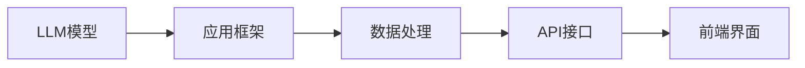
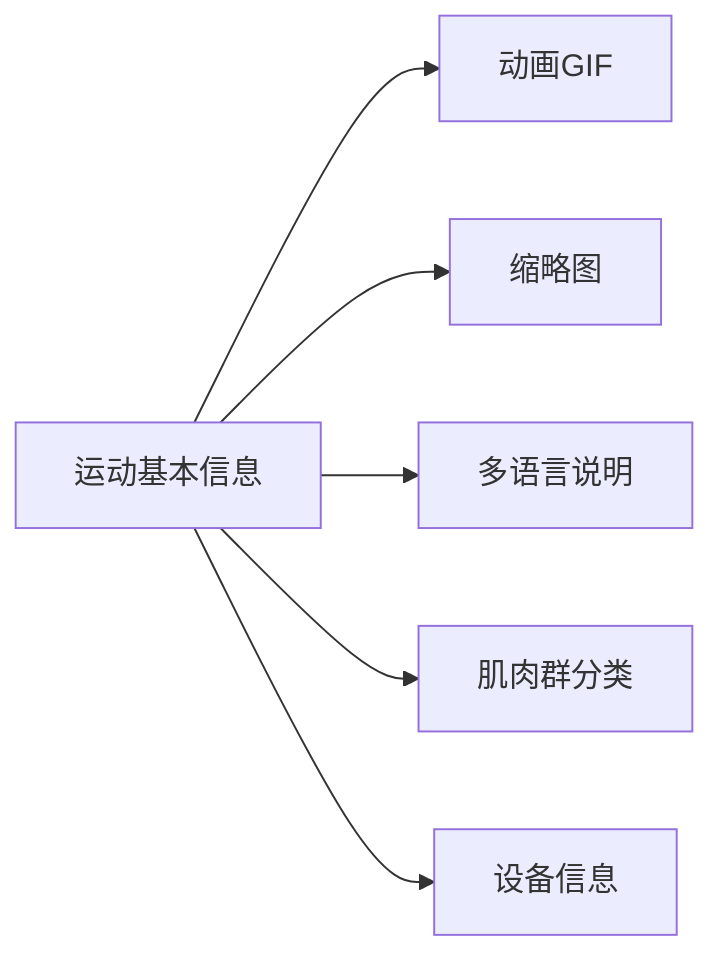
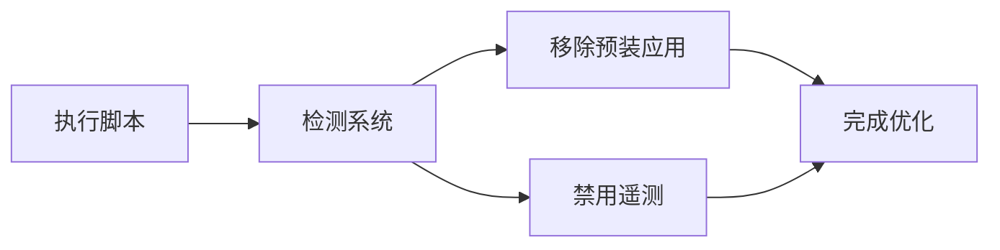
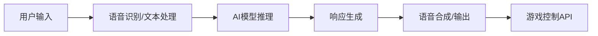

## 今日热点

AI工具与开发效率项目持续领跑，LLM应用生态繁荣，AI编码助手与系统优化工具同时受到开发者高度关注，开源替代软件热度攀升。

---

## 热门项目一览

| 排名 | 项目 | 语言 | 今日 | 总计 | 简介 |
|:---:|------|:----:|------:|-----:|------|
| 1 | [OpenCut-app/OpenCut](https://github.com/OpenCut-app/OpenCut) | TypeScript | +1,229 | 66,511 | The open-source CapCut alte... |
| 2 | [HKUDS/Vibe-Trading](https://github.com/HKUDS/Vibe-Trading) | Python | +1,153 | 21,796 | "Vibe-Trading: Your Persona... |
| 3 | [Graphify-Labs/graphify](https://github.com/Graphify-Labs/graphify) | Python | +1,095 | 84,784 | AI coding assistant skill (... |
| 4 | [Shubhamsaboo/awesome-llm-apps](https://github.com/Shubhamsaboo/awesome-llm-apps) | Python | +996 | 119,659 | 100+ AI Agent & RAG apps yo... |
| 5 | [Nutlope/hallmark](https://github.com/Nutlope/hallmark) | CSS | +794 | 5,185 | Anti-AI-slop design skill f... |
| 6 | [github/spec-kit](https://github.com/github/spec-kit) | Python | +543 | 120,624 | 💫 Toolkit to help you get s... |
| 7 | [hasaneyldrm/exercises-dataset](https://github.com/hasaneyldrm/exercises-dataset) | HTML | +451 | 12,639 | 1,324-exercise fitness data... |
| 8 | [coreyhaines31/marketingskills](https://github.com/coreyhaines31/marketingskills) | JavaScript | +299 | 38,600 | Marketing skills for Claude... |
| 9 | [Raphire/Win11Debloat](https://github.com/Raphire/Win11Debloat) | PowerShell | +118 | 50,897 | A simple, lightweight Power... |
| 10 | [moeru-ai/airi](https://github.com/moeru-ai/airi) | TypeScript | +78 | 41,899 | 💖🧸 Self hosted, you-owned G... |

---

## 趋势洞察

```
┌─────────────────────────────────────────────────────────────────┐
│  AI/ML 工具         ████████████████████████  7 个项目        │
│  开发工具             ██████                    2 个项目        │
│  其他               ███                       1 个项目        │
└─────────────────────────────────────────────────────────────────┘
```

---

## 项目深度解读

### 1. OpenCut-app/OpenCut — 开源视频编辑

> **一句话总结**：开源CapCut替代方案，提供免费强大的视频编辑功能

#### 价值主张

| 维度 | 说明 |
|------|------|
| **解决痛点** | 提供免费开源的视频编辑解决方案，替代付费的CapCut |
| **目标用户** | 个人创作者、小型团队和教育机构用户 |
| **核心亮点** | 开源免费 + 跨平台支持 + 专业功能 + 社区驱动 + 持续更新 |

#### 技术架构


**技术特色**：
- 基于TypeScript开发，确保代码质量和类型安全
- 采用模块化架构设计，便于功能扩展和维护
- 支持多种媒体格式，兼容性强

#### 热度分析

- 项目获得66,511个星标，单日新增1,229星，增长迅猛表明用户需求强烈
- 7,002次Fork反映开发者社区积极参与项目贡献和定制化开发

#### 快速上手

```bash
# 克隆项目
git clone https://github.com/OpenCut-app/OpenCut.git

# 安装依赖
npm install

# 启动应用
npm run dev
```

#### 注意事项

- 项目许可证信息缺失，商业使用前需确认授权条款
- 作为开源项目，稳定性可能不如商业软件，建议重要项目提前测试
- 功能更新依赖社区贡献，新特性发布时间可能不确定


### 2. HKUDS/Vibe-Trading — AI交易助手

> **一句话总结**：基于AI的个性化交易代理，提供市场分析与自动交易执行支持。

#### 价值主张

| 维度 | 说明 |
|------|------|
| **解决痛点** | 降低专业交易门槛，提供智能决策支持与自动化执行 |
| **目标用户** | 个人投资者、量化交易爱好者、金融科技开发者 |
| **核心亮点** | AI驱动分析 + 自动化交易 + 风险控制 + 策略定制 |

#### 技术架构


**技术特色**：
- 采用深度学习算法分析市场趋势与模式
- 多维度风险评估机制确保交易安全
- 模块化设计支持多种交易策略与API集成

#### 热度分析

- 高星值且持续快速增长，表明在量化交易领域有显著影响力
- 零开放问题反映项目维护良好，社区问题解决效率高

#### 快速上手

```bash
# 安装依赖
pip install vibe-trading

# 初始化配置
vibe init

# 启动交易代理
vibe trade --config config.yaml
```

#### 注意事项

- 需要金融知识和风险意识，AI交易不保证盈利
- 建议在模拟环境中测试后再投入真实资金
- 项目可能需要特定的API密钥和数据源支持


### 3. Graphify-Labs/graphify — 代码知识图谱

> **一句话总结**：将代码、文档和媒体转换为可查询的知识图谱，提供统一的AI编程助手功能。

#### 价值主张

| 维度 | 说明 |
|------|------|
| **解决痛点** | 碎片化代码和文档难以关联查询，缺乏统一知识管理平台 |
| **目标用户** | 开发者、数据科学家、研究人员和工程师 |
| **核心亮点** | 多AI助手集成 + 知识图谱构建 + 多媒体文件支持 + 统一知识管理 |

#### 技术架构


**技术特色**：
- 多模态数据处理能力，支持代码、SQL、R脚本、文档和媒体
- 知识图谱技术实现代码和文档的语义关联
- 多AI助手API集成，提供统一的编程辅助接口

#### 热度分析

- 项目获得超过8.4万星，近期日增1000+星，表明项目正在快速流行
- 0个开放问题表明项目维护良好，用户反馈可能通过其他渠道处理

#### 快速上手

```bash
# 安装Graphify
pip install graphify

# 初始化知识图谱
graphify init my-project

# 添加文件到知识库
graphify add ./src ./docs

# 启动AI助手交互
graphify chat
```

#### 注意事项

- 项目许可证未知，使用前需确认商业使用限制
- 集成多个AI助手API可能需要各自的API密钥
- 知识图谱构建可能需要大量计算资源，处理大型项目时需考虑性能


### 4. Shubhamsaboo/awesome-llm-apps — LLM应用库

> **一句话总结**：精选100+可直接运行的AI代理和RAG应用，降低AI落地门槛。

#### 价值主张

| 维度 | 说明 |
|------|------|
| **解决痛点** | 解决AI应用从理论到实践的转化难题，提供可立即使用的示例 |
| **目标用户** | AI开发者、研究人员和企业技术决策者 |
| **核心亮点** | 实用性 + 多样性 + 可定制性 + 完整文档 + 开源免费 |

#### 技术架构



**技术特色**：
- 基于Python生态系统，集成主流LLM框架和工具
- 采用模块化设计，便于组件复用和功能扩展
- 提供完整的应用实现，包括前后端和部署方案

#### 热度分析

- 项目获近12万星，单日增长近千，在AI应用领域具有显著影响力
- 作为LLM应用参考标杆，社区活跃度高，贡献者持续更新内容

#### 快速上手

```bash
# 克隆项目
git clone https://github.com/Shubhamsaboo/awesome-llm-apps.git

# 查看可用应用
cd awesome-llm-apps && ls apps
```

#### 注意事项

- 项目包含大量应用，需根据实际需求选择相关深入研究
- 部分应用可能需要额外API密钥或计算资源才能完全运行
- 建议使用前阅读各应用README，了解依赖和配置要求


### 5. Nutlope/hallmark — AI代码美化工具

> **一句话总结**：为AI编程助手提供高质量CSS设计规范，提升生成代码的视觉质量与一致性。

#### 价值主张

| 维度 | 说明 |
|------|------|
| **解决痛点** | 解决AI生成代码视觉质量差、设计不一致问题 |
| **目标用户** | 使用Claude、Cursor等AI编程助手的开发者 |
| **核心亮点** | 提供高质量CSS设计规范 + 简单易用 + 提升代码视觉效果 |

#### 技术架构


**技术特色**：
- 轻量级CSS样式规范
- 针对AI生成代码优化
- 保持代码可读性与美观性平衡

#### 热度分析

- 项目Star数超5K，单日增长近800，表明近期获得极大关注
- 无Open Issues，可能项目已成熟或问题通过其他渠道解决

#### 快速上手

```bash
# 克隆项目
git clone https://github.com/Nutlope/hallmark.git

# 在项目中引入CSS
<link rel="stylesheet" href="path/to/hallmark.css">
```

#### 注意事项

- 项目许可证未知，使用前需确认授权条款
- 目前仅支持Claude Code、Cursor和Codex，其他AI工具可能不兼容


### 6. github/spec-kit — 规范驱动工具包

> **一句话总结**：提供规范驱动开发全流程工具链，帮助团队高效编写、测试和维护API规范。

#### 价值主张

| 维度 | 说明 |
|------|------|
| **解决痛点** | 解决API规范与实现不一致、测试覆盖率低、文档维护困难等问题 |
| **目标用户** | API开发者、后端工程师、技术文档编写者、QA测试人员 |
| **核心亮点** | 规范自动生成 + 实现代码验证 + 测试用例生成 + 文档同步更新 |

#### 技术架构


**技术特色**：
- 支持OpenAPI/Swagger等多种规范格式
- 提供自动化验证和测试生成机制
- 集成CI/CD流程实现规范即代码

#### 热度分析

- 高Star数(12万+)且持续稳定增长，表明项目在开发者社区中有极高认可度和实用价值
- Fork数适中，说明项目被广泛采用但核心贡献相对集中，社区活跃度有待提高

#### 快速上手

```bash
# 安装spec-kit
pip install spec-kit

# 初始化规范项目
spec-kit init my-api-spec

# 生成代码和测试
spec-kit generate --language python
```

#### 注意事项

- 需要熟悉规范驱动开发的基本概念和流程
- 根据项目需求可能需要自定义配置和扩展
- 确保团队对规范格式和工具使用达成一致


### 7. hasaneyldrm/exercises-dataset — 健身运动数据集

> **一句话总结**：包含1324种运动的多语言数据集，提供动画演示和详细指导，是健身应用的核心资源。

#### 价值主张

| 维度 | 说明 |
|------|------|
| **解决痛点** | 健身应用缺乏标准化的运动数据和可视化资源 |
| **目标用户** | 健身应用开发者、健身爱好者、教练 |
| **核心亮点** | 1324种运动数据 + 6种语言说明 + 动画演示 + 肌肉群分类 |

#### 技术架构



**技术特色**：
- 标准化的运动数据格式，便于集成
- 多语言支持，覆盖全球用户
- 丰富的视觉资源，提升用户体验

#### 热度分析

- 项目获得12,639个Star，近期增长迅速，表明健身数据需求旺盛
- Fork数1,484，社区活跃度高，是健身应用开发者的热门资源库

#### 快速上手

```bash
# 克隆项目到本地
git clone https://github.com/hasaneyldrm/exercises-dataset.git

# 进入项目目录
cd exercises-dataset
```

#### 注意事项

- 项目许可证未知，商业使用前需确认授权方式
- 数据集包含大量视觉资源，占用存储空间较大
- 多语言数据可能需要进一步本地化处理以适应特定地区需求


### 8. coreyhaines31/marketingskills — AI营销技能库

> **一句话总结**：为AI代理提供全面的营销技能集，涵盖转化率优化、SEO、文案等专业领域。

#### 价值主张

| 维度 | 说明 |
|------|------|
| **解决痛点** | AI代理缺乏专业营销知识和技能，无法执行复杂营销任务 |
| **目标用户** | 使用Claude Code和AI代理进行营销工作的开发者和营销人员 |
| **核心亮点** | 模块化技能库 + 专为AI优化 + 覆盖全营销领域 + 易于集成 |

#### 技术架构


**技术特色**：
- 基于JavaScript构建，便于集成
- 模块化设计，支持灵活调用
- 针对AI代理优化，提供专业指令

#### 热度分析

- 项目星标超3.8万，近期增长迅速，显示社区对AI营销工具的强烈需求
- 作为AI辅助营销领域的前沿项目，处于技术与应用结合的关键位置

#### 快速上手

```bash
# 克隆项目
git clone https://github.com/coreyhaines31/marketingskills.git

# 安装依赖
npm install

# 导入营销技能
const { cro, copywriting, seo } = require('./marketingskills');
```

#### 注意事项

- 项目许可证未知，使用前需确认授权条款
- 需要了解Claude Code和AI代理的基本使用方法
- 营销技能可能需要根据具体场景进行调优


### 9. Raphire/Win11Debloat — 系统优化工具

> **一句话总结**：轻量级PowerShell脚本，一键清理Windows预装应用并禁用遥测，提升系统纯净度。

#### 价值主张

| 维度 | 说明 |
|------|------|
| **解决痛点** | Windows系统预装应用冗余、遥测收集隐私问题 |
| **目标用户** | 注重系统纯净度与隐私的Windows用户 |
| **核心亮点** | + 脚本轻量执行 + 支持Win10/Win11 + 可自定义禁用项目 + 批量处理预装应用 |

#### 技术架构



**技术特色**：
- 基于PowerShell原生命令，无需额外依赖
- 采用模块化设计，各功能可独立执行
- 兼容Windows 10和Windows 11系统

#### 热度分析

- 项目获得5万+星标，近期持续增长，显示用户对系统优化工具的高需求
- Fork数达2000+，表明社区活跃度高，用户愿意进行二次开发和定制

#### 快速上手

```bash
# 以管理员身份运行PowerShell
Set-ExecutionPolicy -ExecutionPolicy RemoteSigned -Scope CurrentUser
.\Win11Debloat.ps1
```

#### 注意事项

- 需要以管理员权限运行脚本
- 执行前建议创建系统还原点或备份
- 部分功能可能影响Windows更新体验
- 脚本执行后可能需要重启系统生效


### 10. moeru-ai/airi — [动漫AI伴侣]

> **一句话总结**：自托管动漫角色AI助手，支持实时语音交互与游戏控制，打造沉浸式虚拟陪伴体验。

#### 价值主张

| 维度 | 说明 |
|------|------|
| **解决痛点** | 提供可私有化部署的AI角色交互，解决数据隐私与定制化需求 |
| **目标用户** | 动漫爱好者、AI开发者、虚拟角色收藏者、游戏自动化玩家 |
| **核心亮点** | 自托管架构 + 实时语音对话 + 游戏控制能力 + 跨平台支持 |

#### 技术架构



**技术特色**：
- 自托管架构确保用户数据隐私与完全控制权
- 多模态交互能力支持文本与语音双重交流
- 游戏API集成实现虚拟角色在游戏中的自主操作
- 开源设计允许社区扩展与功能定制

#### 热度分析

- 项目获得近42k星且持续稳定增长，在AI伴侣领域具有显著影响力
- 高star与fork比例(约10:1)显示社区活跃度高，项目生态健康发展

#### 快速上手

```bash
# 克隆仓库
git clone https://github.com/moeru-ai/airi.git

# 安装依赖
cd airi && npm install

# 运行服务
npm run start
```

#### 注意事项

- 项目许可证信息未知，使用前需确认授权条款
- 自托管部署需要一定的技术基础，非技术用户可能面临挑战
- 项目可能需要较高的计算资源，特别是运行AI模型时
- 游戏集成功能可能需要额外配置或特定游戏版本支持


## 今日推荐

| 主题 | 推荐项目 | 亮点 |
|------|----------|------|
| 今日最热 | [OpenCut-app/OpenCut](https://github.com/OpenCut-app/OpenCut) | The open-source C... |
| 值得关注 | [HKUDS/Vibe-Trading](https://github.com/HKUDS/Vibe-Trading) | "Vibe-Trading: Yo... |
| 快速上手 | [Graphify-Labs/graphify](https://github.com/Graphify-Labs/graphify) | AI coding assista... |
| 长期潜力 | [Shubhamsaboo/awesome-llm-apps](https://github.com/Shubhamsaboo/awesome-llm-apps) | 100+ AI Agent & R... |

---

<div align="center">

*Generated on 2026-07-14 | Powered by GitHub Trending Reporter*

</div>