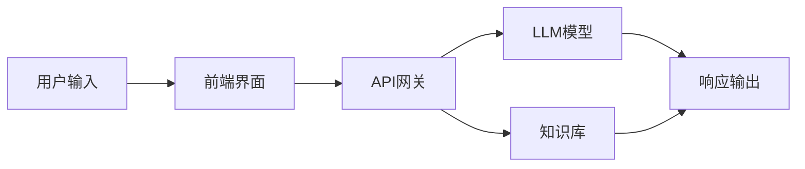
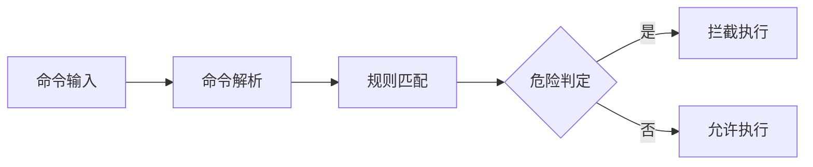
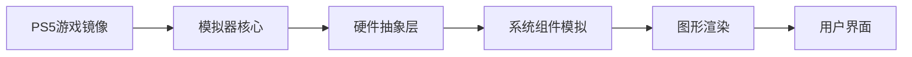
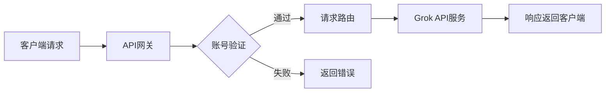
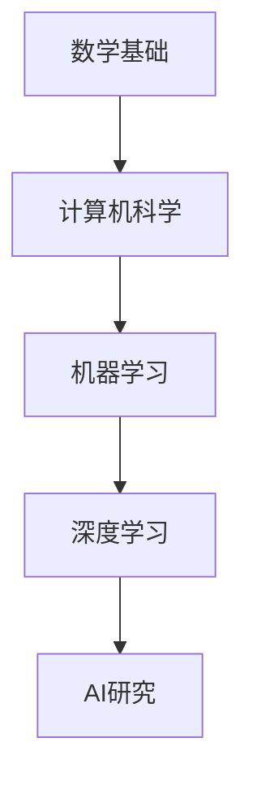
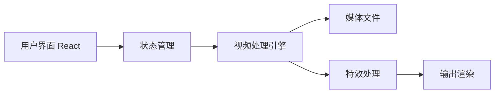

## 今日热点

AI应用与工具持续火爆，开源替代商业软件趋势明显，开发者积极拥抱AI技术并寻求更安全、高效

---

## 热门项目一览

| 排名 | 项目 | 语言 | 今日 | 总计 | 简介 |
|:---:|------|:----:|------:|-----:|------|
| 1 | [OpenCut-app/OpenCut](https://github.com/OpenCut-app/OpenCut) | TypeScript | +4,276 | 69,242 | The open-source CapCut alte... |
| 2 | [Graphify-Labs/graphify](https://github.com/Graphify-Labs/graphify) | Python | +1,851 | 86,422 | AI coding assistant skill (... |
| 3 | [mattpocock/skills](https://github.com/mattpocock/skills) | Shell | +1,679 | 170,305 | Skills for Real Engineers. ... |
| 4 | [HKUDS/Vibe-Trading](https://github.com/HKUDS/Vibe-Trading) | Python | +1,256 | 22,883 | "Vibe-Trading: Your Persona... |
| 5 | [Shubhamsaboo/awesome-llm-apps](https://github.com/Shubhamsaboo/awesome-llm-apps) | Python | +1,106 | 120,843 | 100+ AI Agent & RAG apps yo... |
| 6 | [Nutlope/hallmark](https://github.com/Nutlope/hallmark) | CSS | +1,015 | 6,181 | Anti-AI-slop design skill f... |
| 7 | [hasaneyldrm/exercises-dataset](https://github.com/hasaneyldrm/exercises-dataset) | HTML | +851 | 13,544 | 1,324-exercise fitness data... |
| 8 | [Raphire/Win11Debloat](https://github.com/Raphire/Win11Debloat) | PowerShell | +783 | 51,722 | A simple, lightweight Power... |
| 9 | [Dicklesworthstone/destructive_command_guard](https://github.com/Dicklesworthstone/destructive_command_guard) | Rust | +473 | 4,424 | The Destructive Command Gua... |
| 10 | [penpot/penpot](https://github.com/penpot/penpot) | Clojure | +395 | 56,170 | Penpot: The open-source des... |
| 11 | [par274/sharpemu](https://github.com/par274/sharpemu) | C# | +332 | 2,147 | An experimental PlayStation... |
| 12 | [chenyme/grok2api](https://github.com/chenyme/grok2api) | Go | +186 | 5,863 | 面向 Grok Build、Grok Web 与 Gr... |

---

## 趋势洞察

```
┌─────────────────────────────────────────────────────────────────┐
│  AI/ML 工具         ████████████████████████  10 个项目        │
│  其他               ███████                   3 个项目        │
│  项目管理             ██                        1 个项目        │
│  开发工具             ██                        1 个项目        │
└─────────────────────────────────────────────────────────────────┘
```

---

## 项目深度解读

### 1. OpenCut-app/OpenCut — 开源视频编辑器

> **一句话总结**：一款功能强大的开源视频编辑工具，提供与CapCut相似的专业编辑体验。

#### 价值主张

| 维度 | 说明 |
|------|------|
| **解决痛点** | 提供免费开源的视频编辑替代方案，摆脱商业软件依赖 |
| **目标用户** | 视频内容创作者、社交媒体用户、开源爱好者 |
| **核心亮点** | 跨平台支持 + 专业编辑功能 + 开源可定制 + 无水印导出 |

#### 技术架构


**技术特色**：
- 基于 TypeScript 开发，确保类型安全和高性能
- 采用模块化设计，便于功能扩展和维护
- 支持跨平台运行，兼容 Windows、macOS 和 Linux

#### 热度分析

- 项目近期获得大量关注，Star 数量快速增长，表明视频编辑开源工具需求旺盛
- 相对 Fork 数量，社区参与度高，说明项目具有实用价值和可贡献性

#### 快速上手

```bash
# 克隆项目
git clone https://github.com/OpenCut-app/OpenCut.git

# 安装依赖
npm install

# 启动应用
npm start
```

#### 注意事项

- 项目可能需要较高的硬件性能，特别是处理大型视频文件时
- 作为开源项目，用户需要自行承担数据安全和隐私保护责任
- 可能存在与 CapCut 功能不完全对等的情况，需要用户自行评估


### 2. Graphify-Labs/graphify — 代码知识图谱化

> **一句话总结**：将代码、文档和数据库转化为可查询知识图谱，提供统一AI编码助手能力。

#### 价值主张

| 维度 | 说明 |
|------|------|
| **解决痛点** | 分散的代码、数据库和文档难以有效整合和智能查询 |
| **目标用户** | 开发者、数据科学家、架构师和技术团队 |
| **核心亮点** | 多格式支持 + 知识图谱构建 + AI助手集成 + 跨平台兼容 |

#### 技术架构


**技术特色**：
- 多格式内容统一解析框架
- 知识图谱与AI助手深度融合
- 支持主流AI编码平台集成

#### 热度分析

- 项目获高关注度(8.6万星)，近期增长迅猛(单日增长1851星)，社区认可度高
- 零开放问题反映项目维护成熟度高，已进入稳定维护阶段

#### 快速上手

```bash
# 安装
pip install graphify

# 初始化项目
graphify init

# 启动服务
graphify serve
```

#### 注意事项

- 许可证信息不明确，使用前需确认开源许可类型
- 项目依赖可能较多，建议在虚拟环境中安装
- 大型代码库处理可能需要较多计算资源


### 3. mattpocock/skills — [工程师技能库]

> **一句话总结**：实用Shell脚本集合，提供高效命令行工具和工程最佳实践。

#### 价值主张

| 维度 | 说明 |
|------|------|
| **解决痛点** | 提供工程师日常工作中需要的实用命令和技巧 |
| **目标用户** | 开发者、系统管理员和技术工程师 |
| **核心亮点** | 实用性强 + 命令行效率 + 最佳实践分享 |

#### 技术架构


**技术特色**：
- 纯Shell实现，跨平台兼容性强
- 模块化设计，便于按需使用
- 聚焦实用场景，解决实际问题

#### 热度分析

- 项目获得超17万星，日增星数近1.7k，表明技术社区认可度高
- 无开放问题，说明项目维护良好，功能相对稳定成熟

#### 快速上手

```bash
# 克隆项目
git clone https://github.com/mattpocock/skills.git

# 进入目录
cd skills

# 查看可用技能
ls -la
```

#### 注意事项

- 需要基本的Shell知识才能理解和使用这些脚本
- 某些脚本可能需要特定的系统环境或工具支持
- 使用前建议阅读每个技能目录中的README文件


### 4. HKUDS/Vibe-Trading — 个人交易智能

> **一句话总结**：AI驱动的个人交易代理，通过情绪分析提供自动化交易决策支持

#### 价值主张

| 维度 | 说明 |
|------|------|
| **解决痛点** | 消除交易中的情绪干扰，提供数据驱动的客观决策 |
| **目标用户** | 个人投资者、量化交易爱好者、加密货币交易者 |
| **核心亮点** | AI情绪分析 + 自动化交易 + 风险控制 |

#### 技术架构


**技术特色**：
- 基于NLP的市场情绪分析模型
- 自适应交易策略生成系统
- 多维度风险量化评估框架

#### 热度分析

- 近期Star数激增，日均增长超千，表明项目正处于爆发式增长期
- 高Fork/Star比例显示项目具有高度实用性和可扩展性，社区参与度活跃

#### 快速上手

```bash
git clone https://github.com/HKUDS/Vibe-Trading.git
cd Vibe-Trading
pip install -r requirements.txt
python setup.py install
```

#### 注意事项

- 项目未明确许可证，使用前需确认授权条款
- 交易系统涉及真实资金风险，建议先在模拟环境测试
- 需配置相应的交易所API才能完整使用功能


### 5. Shubhamsaboo/awesome-llm-apps — LLM应用集锦

> **一句话总结**：100+可直接运行的AI Agent和RAG应用集合，助力开发者快速构建和部署智能应用。

#### 价值主张

| 维度 | 说明 |
|------|------|
| **解决痛点** | 提供可直接运行的LLM应用示例，解决开发起点高、实现复杂的问题 |
| **目标用户** | AI开发者、研究人员、希望快速集成LLM技术的产品团队 |
| **核心亮点** | 可直接运行 + 丰富示例 + 易于定制 + 多样化应用场景 + 持续更新 |

#### 技术架构



**技术特色**：
- 涵盖多种LLM应用场景和架构模式
- 提供从简单到复杂的完整实现示例
- 整合前沿AI技术与实际业务需求

#### 热度分析

- 超过12万星标，日增千星，表明项目受到AI开发者高度关注
- 作为AI应用资源库，处于LLM生态系统的核心位置，影响广泛

#### 快速上手

```bash
# 克隆项目
git clone https://github.com/Shubhamsaboo/awesome-llm-apps.git

# 进入项目目录
cd awesome-llm-apps

# 查看可用的应用列表
ls apps/
```

#### 注意事项

- 项目包含多个独立应用，需要根据具体需求选择合适的示例
- 部分应用可能需要额外的API密钥或环境配置
- 建议从简单应用开始，逐步尝试复杂场景


### 6. Nutlope/hallmark — AI设计增强

> **一句话总结**：为AI代码编辑器提供高质量设计规范，提升代码美观度和一致性。

#### 价值主张

| 维度 | 说明 |
|------|------|
| **解决痛点** | 解决AI辅助编程中代码样式混乱、设计不一致问题 |
| **目标用户** | 使用Claude Code、Cursor和Codex的开发者 |
| **核心亮点** | 高质量CSS设计规范 + 现代化UI组件 + 一致性保证 |

#### 技术架构


**技术特色**：
- 精心设计的CSS变量系统，确保设计一致性
- 模块化组件架构，便于集成到各种AI代码编辑器
- 针对开发者优化的设计语言，提升代码可读性

#### 热度分析

- 项目近期增长迅猛，单日新增超1000星，显示AI辅助开发设计工具需求旺盛
- 社区活跃度高，虽Issues为0但高Fork/Star比表明开发者认可度强

#### 快速上手

```bash
# 克隆项目到本地
git clone https://github.com/Nutlope/hallmark.git

# 将CSS文件导入到AI编辑器项目中
# import './hallmark/styles/main.css';
```

#### 注意事项

- 确保与现有AI编辑器兼容性
- 根据项目需求可能需要自定义CSS变量
- 建议先在小规模项目中测试效果


### 7. hasaneyldrm/exercises-dataset — 健身运动数据集

> **一句话总结**：包含1324种健身运动的完整数据集，提供动画GIF、缩略图和6种语言指导，是健身应用的基础数据层。

#### 价值主张

| 维度 | 说明 |
|------|------|
| **解决痛点** | 健身应用开发者缺乏标准化的运动数据资源 |
| **目标用户** | 健身应用开发者、健身教练、健身爱好者 |
| **核心亮点** | 多语言支持 + 丰富的可视化资源 + 结构化的运动分类 |

#### 技术架构

**技术特色**：
- 多语言运动数据结构化存储
- 标准化的运动分类体系
- 丰富的可视化资源支持

#### 热度分析

- 项目获得超过13,500星，近期增长迅速（单日增加851星），表明健身数据需求旺盛
- Fork数适中，社区参与度良好，可能被多个健身项目采用

#### 快速上手

```bash
# 克隆项目
git clone https://github.com/hasaneyldrm/exercises-dataset.git

# 查看项目结构
cd exercises-dataset && ls -la
```

#### 注意事项

- 项目许可证未知，商业使用前需确认版权信息
- 数据集可能需要根据具体应用场景进行适配和扩展
- GIF文件较大，在移动应用中可能需要优化处理


### 8. Raphire/Win11Debloat — 系统优化工具

> **一句话总结**：轻量级PowerShell脚本，一键清理Windows预装应用并禁用遥测，提升系统性能与隐私保护。

#### 价值主张

| 维度 | 说明 |
|------|------|
| **解决痛点** | 解决Windows系统臃肿、隐私泄露和用户体验差的问题 |
| **目标用户** | 隐私意识强、追求简洁高效Windows体验的用户 |
| **核心亮点** | 轻量级脚本 + 全面系统优化 + 即用即改 |

#### 技术架构


**技术特色**：
- 纯PowerShell实现，无需额外依赖
- 模块化设计，可选择特定优化项
- 支持Windows 10和11双版本兼容

#### 热度分析

- 项目Star数超过5万，近一个月增长近千，表明其解决实际问题且用户认可度高
- Fork数相对Star数比例适中，说明项目以使用为主，二次开发需求不高

#### 快速上手

```bash
# 下载脚本
Invoke-WebRequest -Uri "https://github.com/Raphire/Win11Debloat/raw/main/Win11Debloat.ps1" -OutFile "Win11Debloat.ps1"

# 以管理员权限运行
Set-ExecutionPolicy -ExecutionPolicy RemoteSigned -Scope CurrentUser
.\Win11Debloat.ps1
```

#### 注意事项

- 需要以管理员权限运行
- 执行前建议备份重要数据
- 某些优化操作可能影响系统更新功能


### 9. Dicklesworthstone/destructive_command_guard — 命令防护工具

> **一句话总结**：一个用Rust编写的命令防护工具，通过拦截危险git和shell命令保障系统安全。

#### 价值主张

| 维度 | 说明 |
|------|------|
| **解决痛点** | 防止开发者或CI系统意外执行危险命令，避免数据丢失或系统损坏 |
| **目标用户** | 需要安全执行git和shell命令的开发者、运维人员和自动化系统 |
| **核心亮点** | 基于规则的命令拦截系统 + Rust高性能实现 + 灵活的自定义规则配置 |

#### 技术架构



**技术特色**：
- 使用Rust语言编写，提供高性能的命令拦截能力
- 基于规则的灵活拦截机制，可自定义危险命令
- 轻量级设计，易于集成到现有工作流程

#### 热度分析

- 项目获得4424个Star，单日增长473，表明项目受到广泛关注，可能最近有重要更新
- 0个Open Issues，表明项目维护良好，问题解决及时，Fork数较少说明更偏向工具类而非框架类

#### 快速上手

```bash
# 安装dcg
cargo install destructive_command_guard

# 启动守护进程
dcg --config /path/to/config.toml
```

#### 注意事项
- 需要仔细配置拦截规则，避免误拦截合法命令
- 可能需要与现有工作流程集成，确保不影响正常开发
- 需要定期更新规则库，以应对新的危险命令模式


### 10. penpot/penpot — 开源设计协作平台

> **一句话总结**：开源协作式设计平台，专为产品团队提供可扩展的矢量设计工具和无缝协作体验。

#### 价值主张

| 维度 | 说明 |
|------|------|
| **解决痛点** | 打破设计工具协作壁垒，提供免费替代方案，确保设计系统一致性 |
| **目标用户** | 产品团队、UI/UX设计师、开发团队及需要协作创建设计系统的组织 |
| **核心亮点** | 开源免费 + 实时协作 + 矢量设计 + 跨平台支持 + 可扩展架构 |

#### 技术架构


**技术特色**：
- 基于Clojure和ClojureScript构建，提供高性能函数式编程体验
- 采用自研渲染引擎，支持复杂的矢量图形操作和导出
- 实现WebSocket实时协作机制，支持多人同时编辑设计文档

#### 热度分析

- 项目star数持续增长，近期日均增长约400，表明社区认可度高
- 作为设计领域开源替代方案，正逐渐形成生态影响力，挑战专有设计工具市场

#### 快速上手

```bash
# 克隆项目
git clone https://github.com/penpot/penpot.git

# 安装依赖并启动
cd penpot && make install && make dev
```

#### 注意事项

- 需要一定Clojure知识才能深度参与开发
- 大型部署建议参考官方文档配置适当的服务器资源
- 与Adobe XD等专有工具的文件格式兼容性有限，可能需要导出为通用格式


### 11. par274/sharpemu — PS5模拟器

> **一句话总结**：实验性PS5模拟器项目，用C#实现，致力于在PC上复刻PS5游戏体验。

#### 价值主张

| 维度 | 说明 |
|------|------|
| **解决痛点** | 让用户能在PC上体验PS5独占游戏，无需购买昂贵主机 |
| **目标用户** | PC游戏玩家、模拟器爱好者、游戏开发者 |
| **核心亮点** | C#实现架构 + PS5游戏兼容性 + 实验性功能探索 |

#### 技术架构



**技术特色**：
- 使用C#构建，跨平台性能优化
- 模拟PS5定制硬件架构AMD Zen 2+RDNA 2
- 实现PS5系统底层调用和API转换

#### 热度分析

- 项目Star数快速增长，近期日增300+，显示社区高度关注
- 作为新兴模拟器项目，在模拟器生态中占据前沿位置

#### 快速上手

```bash
# 克隆仓库
git clone https://github.com/par274/sharpemu.git

# 构建项目
cd sharpemu
dotnet build
```

#### 注意事项

- 项目仍处于实验阶段，游戏兼容性有限
- 可能需要高性能PC硬件才能流畅运行
- 法律使用需确保拥有正版游戏
- 模拟器开发可能违反索尼服务条款


### 12. chenyme/grok2api — Grok API 网关

> **一句话总结**：为 Grok 构建的多账号统一 API 网关，简化访问流程并支持账号管理。

#### 价值主张

| 维度 | 说明 |
|------|------|
| **解决痛点** | 解决 Grok API 多账号管理混乱、访问不统一的问题 |
| **目标用户** | 需要使用 Grok API 开发应用的团队和个人开发者 |
| **核心亮点** | 多账号统一管理 + API 网关 + 负载均衡 + 访问控制 + 监控统计 |

#### 技术架构



**技术特色**：
- 基于 Go 语言构建，高性能并发处理能力
- 多账号认证与授权机制
- 请求路由与负载均衡策略

#### 热度分析

- 项目 Star 数达 5863 且近期增长迅速(+186 today)，表明社区关注度持续上升
- Fork 数达 1926，显示项目被广泛采用和二次开发，社区活跃度高

#### 快速上手

```bash
# 克隆项目
git clone https://github.com/chenyme/grok2api.git
cd grok2api

# 安装依赖
go mod download

# 运行项目
go run main.go
```

#### 注意事项

- 项目许可证未知，使用前需确认许可条款
- 可能需要配置 Grok API 凭据才能正常使用
- 建议在生产环境部署前进行充分测试


### 13. HenryNdubuaku/maths-cs-ai-compendium — AI学习宝典

> **一句话总结**：系统化AI/ML研究工程师培养指南，涵盖数学基础到前沿应用的全栈知识。

#### 价值主张

| 维度 | 说明 |
|------|------|
| **解决痛点** | 打破AI学习壁垒，提供从零到专家的完整知识体系 |
| **目标用户** | AI初学者、转行者、希望提升研究能力的技术人员 |
| **核心亮点** | 结构化知识体系+实战导向+持续更新+社区支持+全面覆盖 |

#### 技术架构



**技术特色**：
- TypeScript编写确保代码示例类型安全
- 模块化组织便于按需学习和导航
- 交互式示例强化理论与实践结合
- 涵盖最新研究进展和应用案例

#### 热度分析

- 项目获5263星且持续增长，表明AI学习资源需求旺盛
- Fork数适中，主要作为参考资源使用而非二次开发
- 0开放问题反映项目维护良好，用户问题通过其他渠道解决

#### 快速上手

```bash
# 克隆项目到本地
git clone https://github.com/HenryNdubuaku/maths-cs-ai-compendium.git

# 使用本地服务器查看文档
cd maths-cs-ai-compendium
npm install && npm run dev
```

#### 注意事项

- 项目内容庞大，建议按推荐顺序逐步学习，避免贪多嚼不烂
- 部分高级内容需扎实的数学和编程基础，建议先打牢基础
- 项目持续更新，关注GitHub获取最新内容和改进


### 14. virattt/ai-hedge-fund — AI对冲基金

> **一句话总结**：利用人工智能技术构建的对冲基金平台，通过算法交易实现投资收益最大化。

#### 价值主张

| 维度 | 说明 |
|------|------|
| **解决痛点** | 传统对冲基金依赖人工决策，效率低下且受情绪影响，AI提供更客观、快速的投资决策 |
| **目标用户** | 量化交易者、金融科技爱好者、投资机构及个人投资者 |
| **核心亮点** | AI算法交易策略 + 实时市场数据处理 + 风险控制系统 + 投资组合优化 |

#### 技术架构


**技术特色**：
- 基于深度学习的市场预测模型
- 实时数据处理与分析框架
- 多元化投资组合优化算法

#### 热度分析

- 项目获得近6.2万stars，每日新增约100，显示强劲的社区关注度和持续增长趋势
- 高Fork比例(约1/6)表明该项目被广泛研究和二次开发，在量化金融领域具有重要生态地位

#### 快速上手

```bash
# 克隆项目
git clone https://github.com/virattt/ai-hedge-fund.git

# 安装依赖
pip install -r requirements.txt

# 运行示例策略
python run_strategy.py --mode backtest --config config/default.yaml
```

#### 注意事项

- 该项目涉及真实的金融交易，实际使用前需充分理解风险并谨慎投入资金
- 项目未明确说明许可证，使用时需注意可能的版权限制
- AI交易策略需要持续优化和市场适应性调整，不是一劳永逸的解决方案
- 在实际交易前，建议先使用历史数据进行回测验证


### 15. AIEraDev/Clypra — 视频编辑工具

> **一句话总结**：基于Tauri和React的开源视频编辑器，提供类似CapCut的免费专业视频编辑功能。

#### 价值主张

| 维度 | 说明 |
|------|------|
| **解决痛点** | 提供免费但功能强大的视频编辑工具，替代付费软件 |
| **目标用户** | 内容创作者、社交媒体用户、视频爱好者 |
| **核心亮点** | 跨平台支持 + 开源免费 + 类CapCut功能 + 原生性能 + TypeScript开发 |

#### 技术架构



**技术特色**：
- 基于Tauri框架，结合Web技术实现原生应用体验
- 使用TypeScript确保代码质量和开发效率
- React构建现代化UI组件，提供流畅交互体验

#### 热度分析

- 项目Star数快速增长(2633，单日+85)，表明社区关注度持续上升
- Fork数相对较低(279)，暗示项目处于早期阶段，社区参与度有待提升

#### 快速上手

```bash
# 克隆项目
git clone https://github.com/AIEraDev/Clypra.git
cd Clypra

# 安装依赖并运行
npm install && npm run tauri dev
```

#### 注意事项

- 项目许可证未知，使用前需确认开源协议
- 作为视频编辑软件，对硬件性能有一定要求
- 项目仍在积极开发中，功能可能不完整或有变化


## 今日推荐

| 主题 | 推荐项目 | 亮点 |
|------|----------|------|
| 今日最热 | [OpenCut-app/OpenCut](https://github.com/OpenCut-app/OpenCut) | The open-source C... |
| 值得关注 | [Graphify-Labs/graphify](https://github.com/Graphify-Labs/graphify) | AI coding assista... |
| 快速上手 | [mattpocock/skills](https://github.com/mattpocock/skills) | Skills for Real E... |
| 长期潜力 | [HKUDS/Vibe-Trading](https://github.com/HKUDS/Vibe-Trading) | "Vibe-Trading: Yo... |

---

<div align="center">

*Generated on 2026-07-15 | Powered by GitHub Trending Reporter*

</div>