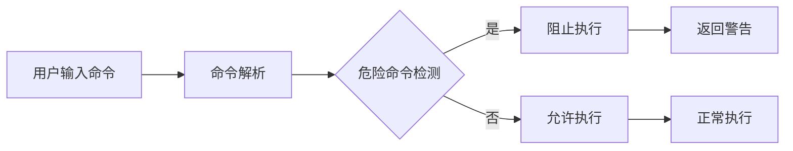
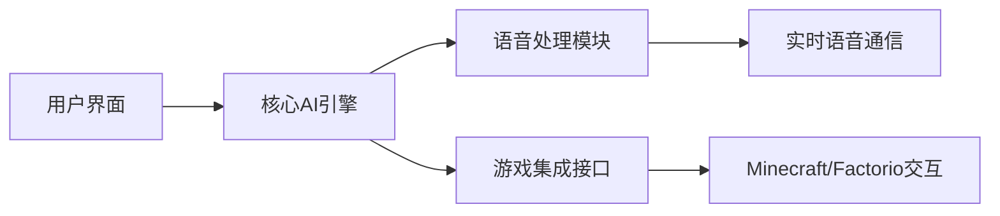

## 今日热点

今日GitHub热榜显示AI代理与应用开发呈爆发式增长，同时AI工具增强与技能集成需求激增，开源替代方案备受青睐。

---

## 热门项目一览

| 排名 | 项目 | 语言 | 今日 | 总计 | 简介 |
|:---:|------|:----:|------:|-----:|------|
| 1 | [mattpocock/skills](https://github.com/mattpocock/skills) | Shell | +2,130 | 172,352 | Skills for Real Engineers. ... |
| 2 | [OpenCut-app/OpenCut](https://github.com/OpenCut-app/OpenCut) | TypeScript | +1,664 | 71,869 | The open-source CapCut alte... |
| 3 | [Nutlope/hallmark](https://github.com/Nutlope/hallmark) | CSS | +1,277 | 8,617 | Anti-AI-slop design skill f... |
| 4 | [Shubhamsaboo/awesome-llm-apps](https://github.com/Shubhamsaboo/awesome-llm-apps) | Python | +1,236 | 121,942 | 100+ AI Agent & RAG apps yo... |
| 5 | [hasaneyldrm/exercises-dataset](https://github.com/hasaneyldrm/exercises-dataset) | HTML | +949 | 14,408 | 1,324-exercise fitness data... |
| 6 | [HKUDS/Vibe-Trading](https://github.com/HKUDS/Vibe-Trading) | Python | +915 | 23,735 | "Vibe-Trading: Your Persona... |
| 7 | [HenryNdubuaku/maths-cs-ai-compendium](https://github.com/HenryNdubuaku/maths-cs-ai-compendium) | TypeScript | +725 | 5,928 | Become a cracked AI/ML Rese... |
| 8 | [Dicklesworthstone/destructive_command_guard](https://github.com/Dicklesworthstone/destructive_command_guard) | Rust | +471 | 4,784 | The Destructive Command Gua... |
| 9 | [coreyhaines31/marketingskills](https://github.com/coreyhaines31/marketingskills) | JavaScript | +340 | 39,781 | Marketing skills for Claude... |
| 10 | [openinterpreter/openinterpreter](https://github.com/openinterpreter/openinterpreter) | Rust | +299 | 65,508 | A coding agent for low-cost... |
| 11 | [HKUDS/DeepTutor](https://github.com/HKUDS/DeepTutor) | Python | +172 | 26,295 | DeepTutor: Lifelong Persona... |
| 12 | [moeru-ai/airi](https://github.com/moeru-ai/airi) | TypeScript | +110 | 42,525 | 💖🧸 Self hosted, you-owned G... |

---

## 趋势洞察

```
┌─────────────────────────────────────────────────────────────────┐
│  AI/ML 工具         ████████████████████████  10 个项目        │
│  其他               ███████                   3 个项目        │
└─────────────────────────────────────────────────────────────────┘
```

---

## 项目深度解读

### 1. mattpocock/skills — 工程师技能库

> **一句话总结**：一个收集真实工程师实用技能和脚本的Shell脚本集合，直接来自作者的.claude目录。

#### 价值主张

| 维度 | 说明 |
|------|------|
| **解决痛点** | 提供工程师日常工作中可直接使用的实用脚本和技能 |
| **目标用户** | 开发人员、系统管理员和DevOps工程师 |
| **核心亮点** | 实用性高 + 直接可复制 + 来源真实 + 分类清晰 + 持续更新 |

#### 技术架构


**技术特色**：
- 纯Shell脚本实现，跨平台兼容性强
- 模块化设计，每个脚本功能单一明确
- 注重实用性和效率，直击工程师日常需求

#### 热度分析

- 项目获得17万+星，日增2千+，表明工程师群体对此类实用资源高度认可
- Fork数约为Star数的8.5%，说明用户不仅收藏，还积极参与使用和二次开发
- 零开放问题，表明项目文档完善，用户反馈渠道可能通过其他方式处理

#### 快速上手

```bash
# 克隆仓库
git clone https://github.com/mattpocock/skills.git

# 查看可用技能
cd skills && ls

# 使用特定技能
./<script-name>
```

#### 注意事项

- 部分脚本可能需要根据个人环境进行适当调整
- 建议在使用前检查脚本内容，确保安全性


### 2. OpenCut-app/OpenCut — 开源视频编辑器

> **一句话总结**：开源替代CapCut的视频编辑应用，提供专业剪辑功能与跨平台支持

#### 价值主张

| 维度 | 说明 |
|------|------|
| **解决痛点** | 提供开源免费的专业视频编辑工具，替代闭源CapCut |
| **目标用户** | 需要视频编辑功能但不愿付费或担心隐私的用户 |
| **核心亮点** | 跨平台支持 + 专业编辑功能 + 开源可定制 + 无水印 |

#### 技术架构


**技术特色**：
- 基于TypeScript构建，保证跨平台兼容性
- 采用模块化设计，便于功能扩展
- 支持多种媒体格式和编解码器

#### 热度分析

- 项目Star数超7万且近期增长迅速，显示社区高度认可
- Fork数适中，表明项目既有使用价值也有定制开发需求
- 无Open Issues，反映项目维护良好或问题处理高效

#### 快速上手

```bash
# 克隆仓库
git clone https://github.com/OpenCut-app/OpenCut.git

# 安装依赖
npm install

# 运行项目
npm run dev
```

#### 注意事项

- 项目License未知，使用前需确认授权条款
- 作为视频编辑应用，可能需要较高性能的硬件支持
- 开源项目可能存在功能不完整或稳定性问题


### 3. Nutlope/hallmark — AI代码美化工具

> **一句话总结**：通过CSS样式提升AI代码编辑器输出质量，对抗AI生成代码的粗糙设计。

#### 价值主张

| 维度 | 说明 |
|------|------|
| **解决痛点** | AI代码生成界面粗糙，缺乏专业设计感 |
| **目标用户** | 使用Claude Code、Cursor和Codex的开发者 |
| **核心亮点** | 提供高质量CSS样式 + 改善代码阅读体验 + 提升专业感 |

#### 技术架构


**技术特色**：
- 纯CSS实现，无需额外依赖
- 针对主流AI代码编辑器优化
- 注重代码可读性和视觉层次

#### 热度分析
- 项目获得8,617个Star，单日增长1,277，显示极高关注度
- 0个Open Issues表明项目维护良好，用户反馈渠道可能通过其他方式

#### 快速上手

```bash
# 克隆项目到本地
git clone https://github.com/Nutlope/hallmark.git

# 在项目中引入CSS文件
<link rel="stylesheet" href="path/to/hallmark.css">
```

#### 注意事项
- 需要确保与目标AI编辑器的兼容性
- 可能需要根据具体使用场景进行样式调整
- 项目许可证未知，使用前需确认授权条款


### 4. Shubhamsaboo/awesome-llm-apps — LLM应用集合库

> **一句话总结**：精选可运行的开源LLM和RAG应用集合，支持克隆、定制和部署。

#### 价值主张

| 维度 | 说明 |
|------|------|
| **解决痛点** | 解决开发者寻找高质量、可运行LLM应用实例的难题，提供一站式解决方案 |
| **目标用户** | AI开发者、研究人员和企业技术团队 |
| **核心亮点** | 100+可直接运行的应用 + 涵盖AI代理和RAG技术 + 支持克隆定制部署 + 高质量精选 |

#### 技术架构


**技术特色**：
- 基于Python构建，易于扩展和定制
- 集成多种LLM框架和API
- 实现RAG技术增强生成质量

#### 热度分析

- 项目Star数超12万，近期每日新增超1200个Star，增长势头强劲
- 作为LLM应用领域的精选集合，已成为开发者的重要参考资源

#### 快速上手

```bash
# 克隆项目
git clone https://github.com/Shubhamsaboo/awesome-llm-apps.git

# 进入项目目录
cd awesome-llm-apps
```

#### 注意事项

- 项目包含多个独立应用，需要根据具体应用的要求进行环境配置
- 部分应用可能需要API密钥或额外依赖
- 建议仔细阅读每个应用的自述文档以了解具体使用方法


### 5. hasaneyldrm/exercises-dataset — 健身数据集资源

> **一句话总结**：包含1324个健身练习的完整数据集，提供动画GIF、多语言指导及分类信息。

#### 价值主张

| 维度 | 说明 |
|------|------|
| **解决痛点** | 健身应用开发者缺乏标准化的多语言健身练习数据资源 |
| **目标用户** | 健身应用开发者、健身教练、健康类APP团队 |
| **核心亮点** | + 1324个完整健身练习数据 + 动画GIF与缩略图可视化 + 6种语言分步指导 |

#### 技术架构

**技术特色**：
- 结构化的健身数据存储格式
- 多媒体资源(GIF+缩略图)标准化
- 多语言数据组织方式

#### 热度分析

- 项目获得14,408星且近期增长迅速，表明健身数据需求旺盛
- Fork数相对较低，说明项目主要作为数据资源被使用，而非二次开发

#### 快速上手

```bash
# 克隆项目获取完整数据集
git clone https://github.com/hasaneyldrm/exercises-dataset.git

# 查看数据结构
cd exercises-dataset && ls
```

#### 注意事项

- 项目许可证未知，商业使用前需确认授权
- 数据集定期更新，建议关注最新版本
- 使用时需注意数据引用和版权问题


### 6. HKUDS/Vibe-Trading — 智能交易助手

> **一句话总结**：基于AI的个人交易代理，自动化执行交易策略并分析市场情绪。

#### 价值主张

| 维度 | 说明 |
|------|------|
| **解决痛点** | 个人交易者缺乏专业分析工具和自动化执行能力 |
| **目标用户** | 个人投资者、量化交易爱好者、金融市场参与者 |
| **核心亮点** | AI驱动决策 + 多市场支持 + 情绪分析 + 自动化执行 + 回测功能 |

#### 技术架构


**技术特色**：
- 集成多种金融API获取实时市场数据
- 采用机器学习算法分析市场情绪和趋势
- 提供完整的回测框架验证交易策略

#### 热度分析

- 项目Star数突破2.3万，日增900+，显示交易自动化工具需求激增
- 无开放Issues表明项目维护良好，社区问题解决高效

#### 快速上手

```bash
# 克隆项目
git clone https://github.com/HKUDS/Vibe-Trading.git
cd Vibe-Trading

# 安装依赖并运行
pip install -r requirements.txt
python vibe_trading --config config.yaml
```

#### 注意事项

- 交易存在风险，建议先用模拟账户测试策略
- 确保妥善保管API密钥，不要在公共代码库中暴露
- 根据个人风险偏好调整参数，不要盲目跟随默认配置


### 7. HenryNdubuaku/maths-cs-ai-compendium — AI学习资源库

> **一句话总结**：全面的AI/ML研究工程师学习资源库，整合数学、计算机科学与人工智能核心知识。

#### 价值主张

| 维度 | 说明 |
|------|------|
| **解决痛点** | 提供系统化的AI学习路径，解决知识零散、缺乏体系的问题 |
| **目标用户** | AI/ML初学者、希望转行AI的工程师、研究型学生 |
| **核心亮点** | 系统性学习路径 + 实践项目导向 + 数学基础扎实 |

#### 技术架构


**技术特色**：
- 基于TypeScript构建的交互式学习平台
- 模块化设计，各知识点相互关联
- 结合理论与实践的渐进式学习路径

#### 热度分析

- 项目Star数近6000，单日增长725，显示AI学习资源需求旺盛
- 零Open Issues表明项目维护良好，社区反馈可能通过其他渠道

#### 快速上手

```bash
# 克隆项目
git clone https://github.com/HenryNdubuaku/maths-cs-ai-compendium.git

# 安装依赖并启动
cd maths-cs-ai-compendium
npm install && npm start
```

#### 注意事项

- 项目可能需要一定的数学和编程基础
- 建议按照项目推荐的顺序学习，以建立完整的知识体系
- 由于没有明确的许可证信息，使用时需要注意版权问题


### 8. Dicklesworthstone/destructive_command_guard — 命令防护工具

> **一句话总结**：基于Rust的危险命令拦截工具，防止执行可能导致系统损害的git和shell命令。

#### 价值主张

| 维度 | 说明 |
|------|------|
| **解决痛点** | 防止执行可能导致数据丢失或系统损害的危险命令 |
| **目标用户** | 开发者、运维人员、自动化脚本执行者 |
| **核心亮点** | 命令拦截 + 危险检测 + 实时防护 + 配置灵活 + 轻量级 |

#### 技术架构



**技术特色**：
- 基于Rust构建，提供高性能和内存安全保障
- 内置常见危险命令库，可扩展自定义规则
- 支持git和shell命令的双重拦截机制
- 轻量级设计，资源占用低

#### 热度分析

- 项目近期热度显著增长，单日新增471个Star，表明安全防护需求旺盛
- 作为安全工具，在DevOps和自动化运维领域有重要应用价值

#### 快速上手

```bash
# 安装
cargo install destructive_command_guard

# 基本使用
dcg --help
dcg --config config.yaml --command "git push origin main"
```

#### 注意事项

- 需要正确配置拦截规则，避免误拦截必要命令
- 对于复杂的管道命令，可能需要额外配置
- 定期更新危险命令库，以应对新的威胁


### 9. coreyhaines31/marketingskills — AI 营销技能库

> **一句话总结**：为 Claude Code 和 AI 代理提供全面的营销技能库，助力提升转化率、内容质量和增长策略。

#### 价值主张

| 维度 | 说明 |
|------|------|
| **解决痛点** | 解决 AI 代理在营销决策中缺乏专业策略和最佳实践的问题 |
| **目标用户** | 使用 AI 代理的营销人员、增长黑客和数字营销专家 |
| **核心亮点** | 全面营销技能覆盖 + AI 代理优化 + 实用案例分析 + 增长工程方法 |

#### 技术架构


**技术特色**：
- JavaScript 实现的模块化营销知识框架
- 针对 Claude Code 优化的提示工程方法
- 可扩展的营销技能分类系统

#### 热度分析

- 项目星数达近4万，日增340+，在营销AI领域增长迅猛
- 作为营销与AI交叉项目，在AI辅助营销工具生态中占据重要位置

#### 快速上手

```bash
# 克隆项目
git clone https://github.com/coreyhaines31/marketingskills.git

# 安装依赖
npm install
```

#### 注意事项

- 项目需要 Claude Code 基础知识才能充分利用
- 营销策略需根据具体业务场景进行本地化调整
- 建议定期关注项目更新以获取最新营销趋势和AI应用方法


### 10. openinterpreter/openinterpreter — 轻量编程助手

> **一句话总结**：为低成本模型设计的编程代理工具，实现高效代码生成与执行。

#### 价值主张

| 维度 | 说明 |
|------|------|
| **解决痛点** | 降低AI编程门槛，使小型模型也能执行复杂代码任务 |
| **目标用户** | 开发者、研究人员、教育工作者 |
| **核心亮点** | 低成本模型支持 + 代码自动执行 + 跨平台兼容 + 安全沙箱 |

#### 技术架构


**技术特色**：
- 采用Rust语言构建，确保高性能和内存安全
- 实现轻量级代码解释引擎，支持多种编程语言
- 内置安全沙箱机制，隔离代码执行环境

#### 热度分析

- 项目获得65K+星标，近期增长迅速，表明开发者社区对其高度认可
- Fork数与Star数比例约为8.6%，显示用户不仅关注还积极参与贡献

#### 快速上手

```bash
# 安装openinterpreter
pip install openinterpreter

# 运行交互式编程助手
interpreter

# 使用特定模型
interpreter --model gpt-3.5-turbo
```

#### 注意事项

- 注意代码执行的安全风险，建议在沙箱环境中运行
- 项目依赖Python环境，确保系统已安装最新版Python
- 可能需要额外的模型API密钥才能使用某些功能


### 11. HKUDS/DeepTutor — 智能教育平台

> **一句话总结**：利用深度学习技术提供个性化、自适应的终身学习体验，动态调整教学内容与难度。

#### 价值主张

| 维度 | 说明 |
|------|------|
| **解决痛点** | 传统教育模式难以满足个性化学习需求，无法根据学生能力和进度动态调整教学内容 |
| **目标用户** | 需要个性化学习体验的学生、教育机构以及在线教育平台开发者 |
| **核心亮点** | 深度学习驱动的个性化教学 + 自适应学习路径 + 终身学习支持 + 多模态交互 + 学习效果追踪 |

#### 技术架构


**技术特色**：
- 基于深度学习的知识状态建模技术
- 多维度学习路径自适应算法
- 学习效果实时评估与反馈机制

#### 热度分析

- 项目获得26,295个Star，近期每日增长约172个，表明其在教育科技领域具有显著影响力
- 高Star与Fork比例(约7.4:1)反映了项目的高质量与社区认可度，Issue数为零说明项目维护良好

#### 快速上手

```bash
# 克隆项目
git clone https://github.com/HKUDS/DeepTutor.git
cd DeepTutor

# 安装依赖
pip install -r requirements.txt

# 运行示例
python example_tutoring_session.py
```

#### 注意事项

- 项目使用了复杂的深度学习模型，需要一定的机器学习基础知识才能完全理解和定制
- 由于是教育系统，可能需要考虑数据隐私和伦理问题，特别是在处理学生数据时
- 项目可能需要大量计算资源才能完全运行，特别是训练和评估阶段


### 12. moeru-ai/airi — 虚拟生命容器

> **一句话总结**：自托管AI伴侣平台，支持实时语音聊天和游戏交互，打造个性化虚拟生命体验。

#### 价值主张

| 维度 | 说明 |
|------|------|
| **解决痛点** | 提供可自主控制的AI伴侣，打破主流AI服务的封闭性和隐私限制 |
| **目标用户** | AI爱好者、动漫迷、游戏玩家、开发者、虚拟生命探索者 |
| **核心亮点** | 自托管部署 + 实时语音交互 + 多平台支持 + 游戏集成 + 高度定制化 |

#### 技术架构



**技术特色**：
- 基于TypeScript的全栈开发，确保跨平台兼容性
- 自托管架构设计，保障用户数据隐私和控制权
- 多模态交互能力，整合语音、文本和游戏环境交互

#### 热度分析

- 项目Star数超过4.2万，且持续稳定增长(+110 today)，表明社区高度关注和认可
- Fork数相对较少(4,253)，可能暗示项目复杂度高或用户更倾向于直接使用而非二次开发

#### 快速上手

```bash
# 克隆项目仓库
git clone https://github.com/moeru-ai/airi.git
# 安装依赖
npm install
# 启动服务
npm start
```

#### 注意事项

- 项目需要自托管部署，用户需具备一定的技术能力
- 游戏集成功能可能需要额外配置或依赖特定游戏环境
- 项目许可证未知，使用前需确认授权条款
- 实时语音功能可能需要较好的网络环境和硬件支持


### 13. YimMenu/YimMenuV2 — GTA增强菜单

> **一句话总结**：为GTA 5提供实验性功能增强菜单，扩展游戏体验和自定义选项。

#### 价值主张

| 维度 | 说明 |
|------|------|
| **解决痛点** | 为GTA 5玩家提供游戏内功能增强和自定义选项，突破游戏原生限制 |
| **目标用户** | GTA 5玩家，特别是希望扩展游戏体验和功能的模组爱好者 |
| **核心亮点** | 增强游戏功能 + 自定义UI + 实验性特性 + 游戏内集成 |

#### 技术架构


**技术特色**：
- 基于C++开发的高效游戏模组框架
- 支持实时游戏状态监控和内存操作
- 模块化设计便于功能扩展和维护

#### 热度分析

- 项目Star数持续稳定增长，今日新增38个Star，显示社区认可度高
- Fork数相对Star数比例适中，表明项目有一定社区贡献和二次开发

#### 快速上手

```bash
# 下载最新版本
git clone https://github.com/YimMenu/YimMenuV2.git

# 构建项目
cd YimMenuV2
mkdir build && cd build
cmake .. && make
```

#### 注意事项

- 此类游戏菜单可能违反游戏服务条款，使用前请了解相关风险
- 建议仅在单人游戏模式中使用，避免多人游戏封禁风险
- 项目处于实验阶段，可能存在不稳定问题，建议定期备份游戏存档


## 今日推荐

| 主题 | 推荐项目 | 亮点 |
|------|----------|------|
| 今日最热 | [mattpocock/skills](https://github.com/mattpocock/skills) | Skills for Real E... |
| 值得关注 | [OpenCut-app/OpenCut](https://github.com/OpenCut-app/OpenCut) | The open-source C... |
| 快速上手 | [Nutlope/hallmark](https://github.com/Nutlope/hallmark) | Anti-AI-slop desi... |
| 长期潜力 | [Shubhamsaboo/awesome-llm-apps](https://github.com/Shubhamsaboo/awesome-llm-apps) | 100+ AI Agent & R... |

---

<div align="center">

*Generated on 2026-07-16 | Powered by GitHub Trending Reporter*

</div>