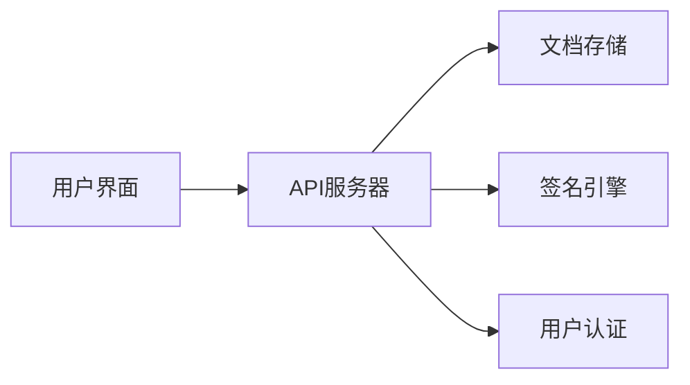

## 今日热点

今日GitHub热榜项目精彩纷呈。

---

## 热门项目一览

| 排名 | 项目 | 语言 | 今日 | 总计 | 简介 |
|:---:|------|:----:|------:|-----:|------|
| 1 | [Nutlope/hallmark](https://github.com/Nutlope/hallmark) | CSS | +1,485 | 12,057 | Anti-AI-slop design skill f... |
| 2 | [OpenCut-app/OpenCut](https://github.com/OpenCut-app/OpenCut) | TypeScript | +1,074 | 74,890 | The open-source CapCut alte... |
| 3 | [codecrafters-io/build-your-own-x](https://github.com/codecrafters-io/build-your-own-x) | Markdown | +1,068 | 527,395 | Master programming by recre... |
| 4 | [HKUDS/DeepTutor](https://github.com/HKUDS/DeepTutor) | Python | +531 | 27,370 | DeepTutor: Lifelong Persona... |
| 5 | [PostHog/posthog](https://github.com/PostHog/posthog) | Python | +438 | 36,201 | 🦔 PostHog is the leading pl... |
| 6 | [openinterpreter/openinterpreter](https://github.com/openinterpreter/openinterpreter) | Rust | +431 | 66,383 | A coding agent for open mod... |
| 7 | [RyanCodrai/turbovec](https://github.com/RyanCodrai/turbovec) | Python | +280 | 13,321 | A vector index built on Tur... |
| 8 | [PrismML-Eng/Bonsai-demo](https://github.com/PrismML-Eng/Bonsai-demo) | Shell | +278 | 1,716 | Bonsai Demo |
| 9 | [github/copilot-sdk](https://github.com/github/copilot-sdk) | Java | +233 | 9,800 | Multi-platform SDK for inte... |
| 10 | [HenryNdubuaku/maths-cs-ai-compendium](https://github.com/HenryNdubuaku/maths-cs-ai-compendium) | TypeScript | +200 | 6,632 | Become a cracked AI/ML Rese... |
| 11 | [docusealco/docuseal](https://github.com/docusealco/docuseal) | Ruby | +91 | 17,854 | Open source DocuSign altern... |
| 12 | [tirth8205/code-review-graph](https://github.com/tirth8205/code-review-graph) | Python | +74 | 19,765 | Local-first code intelligen... |

---

## 趋势洞察

```
┌─────────────────────────────────────────────────────────────────┐
│  AI/ML 工具         ████████████████████████  8 个项目        │
│  其他               ███████████████           5 个项目        │
│  数据分析             ███                       1 个项目        │
└─────────────────────────────────────────────────────────────────┘
```

---

## 项目深度解读

### 1. Nutlope/hallmark — AI代码设计优化

> **一句话总结**：提升AI编程工具生成代码的设计质量，对抗AI生成的粗糙设计。

#### 价值主张

| 维度 | 说明 |
|------|------|
| **解决痛点** | 解决AI编程工具生成代码设计粗糙、风格不一致的问题 |
| **目标用户** | 使用Claude Code、Cursor和Codex的开发者 |
| **核心亮点** | 统一设计规范 + 提升代码可读性 + 减少手动设计工作量 |

#### 技术架构


**技术特色**：
- 精心设计的CSS类和规则集
- 针对编程环境的视觉优化
- 保持代码功能性的同时提升美观度

#### 热度分析

- 项目在短时间内获得大量关注，今日激增1,485 stars，显示开发者对AI代码设计优化的迫切需求
- Fork数相对较少，表明更多用户是直接使用而非二次开发，说明项目定位精准且实用

#### 快速上手

```bash
# 克隆项目到本地
git clone https://github.com/Nutlope/hallmark.git

# 在项目中引入样式
<link rel="stylesheet" href="path/to/hallmark.css">
```

#### 注意事项

- 项目可能需要配合特定的AI编程工具使用效果最佳
- 由于主要是CSS，可能需要根据具体项目进行适当调整
- License未知，使用前需确认授权条款


### 2. OpenCut-app/OpenCut — 开源视频编辑

> **一句话总结**：开源替代CapCut的视频编辑工具，提供专业级剪辑功能与跨平台支持。

#### 价值主张

| 维度 | 说明 |
|------|------|
| **解决痛点** | 提供免费开源的视频编辑方案，替代商业软件依赖 |
| **目标用户** | 内容创作者、短视频制作者、视频编辑爱好者 |
| **核心亮点** | 跨平台支持 + 实时预览 + 丰富滤镜效果 + 无水印导出 |

#### 技术架构


**技术特色**：
- 基于Web技术栈实现，确保跨平台兼容性
- 采用WebAssembly优化视频处理性能
- 响应式设计适配不同屏幕尺寸

#### 热度分析

- Star数超7万且持续快速增长，表明项目获得社区高度认可
- Fork数与Star比例健康，显示项目活跃度高且社区参与度强

#### 快速上手

```bash
# 克隆项目
git clone https://github.com/OpenCut-app/OpenCut.git

# 安装依赖并启动
npm install && npm run dev
```

#### 注意事项

- 项目许可证信息不明确，使用前需确认具体授权条款
- 作为新兴项目，部分高级功能可能仍在开发中


### 3. codecrafters-io/build-your-own-x — 编程实践指南

> **一句话总结**：通过亲手重建知名技术工具，深入理解系统实现原理，提升编程实战能力。

#### 价值主张

| 维度 | 说明 |
|------|------|
| **解决痛点** | 理论与实践脱节，缺乏系统级实现经验 |
| **目标用户** | 有一定基础的中高级开发者和计算机科学学习者 |
| **核心亮点** | 项目式学习 + 真实案例复现 + 递进难度设计 |

#### 技术架构


**技术特色**：
- 基于真实技术栈的重建教程
- 递进式学习路径设计
- 注重核心原理而非表面实现

#### 热度分析

- 项目Star数超过52万，持续稳定增长，表明编程实践类内容需求旺盛
- 无开放Issue但Fork数高，说明用户更倾向于自行实践而非报告问题

#### 快速上手

```bash
# 克隆项目
git clone https://github.com/codecrafters-io/build-your-own-x.git
# 浏览目录选择感兴趣的技术栈
cd build-your-own-x
```

#### 注意事项

- 本项目提供的是学习指南而非可直接使用的代码
- 需要具备相应技术栈的基础知识才能有效学习
- 实现过程可能需要根据个人技术能力调整难度


### 4. HKUDS/DeepTutor — [智能教育系统]

> **一句话总结**：基于深度学习的个性化终身辅导系统，提供自适应学习体验。

#### 价值主张

| 维度 | 说明 |
|------|------|
| **解决痛点** | 传统教育缺乏个性化，无法根据学习者特点调整教学内容和方法 |
| **目标用户** | 学生、教育机构、在线学习平台、教育研究人员 |
| **核心亮点** | 深度学习模型 + 个性化推荐 + 终身学习跟踪 + 自适应内容 + 学习分析 |

#### 技术架构


**技术特色**：
- 结合深度学习与教育心理学原理实现个性化辅导
- 持续跟踪学习者进度并动态调整教学内容
- 多模态学习内容支持，适应不同学习风格

#### 热度分析

- 项目Star数超过2.7万，近期增长迅速，表明教育AI领域热度高
- Fork数适中，说明项目更多被作为参考而非二次开发，可能更偏向研究性质

#### 快速上手

```bash
# 克隆项目
git clone https://github.com/HKUDS/DeepTutor.git

# 安装依赖
pip install -r requirements.txt
```

#### 注意事项

- 项目许可证未知，商业使用前需确认授权条款
- 可能需要大量计算资源来运行深度学习模型
- 作为研究项目，可能需要一定的技术背景才能完全理解和使用


### 5. PostHog/posthog — 产品分析开发平台

> **一句话总结**：PostHog是集AI可观测性与产品分析于一体的开发者平台，提供全方位的产品洞察工具。

#### 价值主张

| 维度 | 说明 |
|------|------|
| **解决痛点** | 产品开发中缺乏全面上下文和数据分析，难以快速诊断问题 |
| **目标用户** | 软件开发团队、产品经理和数据分析师 |
| **核心亮点** | AI可观测性 + 会话回放 + 功能标志管理 + 多渠道控制 |

#### 技术架构


**技术特色**：
- 基于Python构建，支持大规模数据处理
- 提供完整API和SDK，便于系统集成
- 实时数据处理与智能分析能力

#### 热度分析

- 项目拥有36k+ Star且持续增长，在产品分析领域备受关注
- 作为开源产品分析工具的重要选择，社区活跃度高

#### 快速上手

```bash
# 安装PostHog Python客户端
pip install posthog

# 初始化客户端
from posthog import Posthog
posthog = Posthog(project_api_key='your_project_api_key')
```

#### 注意事项

- 需要注册PostHog账号获取API密钥才能使用
- 数据收集需要配置正确的端点URL
- 根据使用规模可能需要考虑资源扩展问题


### 6. openinterpreter/openinterpreter — 开源编程助手

> **一句话总结**：为开源大模型提供代码执行能力的智能编程助手。

#### 价值主张

| 维度 | 说明 |
|------|------|
| **解决痛点** | 为开源大模型提供代码执行能力，扩展模型应用场景 |
| **目标用户** | 开发者、研究人员、AI模型使用者 |
| **核心亮点** | 支持多种开源模型 + 代码执行环境 + 跨平台兼容 + 安全隔离 |

#### 技术架构


**技术特色**：
- 使用Rust语言实现，保证高性能和安全性
- 提供代码执行环境的隔离机制
- 支持多种开源大模型的集成

#### 热度分析

- 项目Star数超过6.6万，日增400+，表明开发者社区对该项目高度关注
- Fork数与Star数比例适中，表明项目既有高关注度也有较高参与度

#### 快速上手

```bash
# 克隆项目
git clone https://github.com/openinterpreter/openinterpreter.git

# 进入项目目录
cd openinterpreter

# 运行项目（假设有README中的安装和运行说明）
cargo run
```

#### 注意事项

- 项目License未知，使用前需确认开源协议
- 代码执行可能存在安全风险，建议在隔离环境中运行
- 目前Open Issues为0，可能意味着项目处于早期阶段或问题处理机制不同


### 7. RyanCodrai/turbovec — 高性能向量索引

> **一句话总结**：基于Rust实现的高性能向量索引库，提供Python接口，加速向量搜索与相似性计算。

#### 价值主张

| 维度 | 说明 |
|------|------|
| **解决痛点** | 高效处理大规模向量数据的索引与检索问题 |
| **目标用户** | 机器学习工程师、数据科学家、NLP研究人员 |
| **核心亮点** | Rust高性能实现 + Python易用接口 + TurboQuant基础 |

#### 技术架构


**技术特色**：
- 基于Rust实现，提供C级别的高性能
- Python绑定设计，兼顾开发效率与执行速度
- 基于TurboQuant，可能包含量化技术优化内存与计算

#### 热度分析

- 项目Star数超1.3万且单日新增280，呈现快速增长趋势
- Fork数约1200，表明社区参与度高，可能被广泛用于实际项目
- 无Open Issues，项目维护状态良好，问题响应和解决效率高

#### 快速上手

```bash
# 安装turbovec
pip install turbovec

# 基本使用示例
import turbovec
index = turbovec.Index()
index.add([1.0, 2.0, 3.0])
results = index.query([1.1, 2.1, 3.1], k=3)
```

#### 注意事项

- 项目依赖Rust环境，安装前需确保系统已配置Rust工具链
- 由于是高性能向量库，大规模数据使用时需注意内存管理
- 项目License信息不明确，商业使用前需确认授权条款


### 8. PrismML-Eng/Bonsai-demo — 模型演示工具

> **一句话总结**：一个基于Shell的Bonsai模型演示工具，简化机器学习模型部署与应用流程。

#### 价值主张

| 维度 | 说明 |
|------|------|
| **解决痛点** | 降低复杂机器学习模型的部署门槛，提供即用型解决方案 |
| **目标用户** | 机器学习工程师、研究人员和AI应用开发者 |
| **核心亮点** | Shell脚本实现 + 轻量级架构 + 快速部署 + 跨平台兼容 |

#### 技术架构


**技术特色**：
- 基于Shell脚本实现，无需复杂依赖环境
- 采用模块化设计，便于扩展和定制
- 提供简洁的CLI接口，支持自动化流程

#### 热度分析

- 项目近期热度显著上升，单日增长278个Star，显示社区强烈关注
- 高Star/Fork比例(约10:1)表明项目以实用为主，用户更倾向于直接使用而非二次开发

#### 快速上手

```bash
# 克隆项目
git clone https://github.com/PrismML-Eng/Bonsai-demo.git
# 运行演示
cd Bonsai-demo && ./run_demo.sh
```

#### 注意事项

- 项目许可证未知，商业使用前需确认授权条款
- 建议查看项目README文件获取详细的安装和使用说明


### 9. github/copilot-sdk — AI助手集成

> **一句话总结**：提供多平台SDK，使开发者能够无缝集成GitHub Copilot Agent功能到各类应用和服务中。

#### 价值主张

| 维度 | 说明 |
|------|------|
| **解决痛点** | 简化Copilot Agent集成流程，降低应用AI辅助功能的开发门槛 |
| **目标用户** | 需要集成AI编程助手功能的应用开发者和企业 |
| **核心亮点** | 跨平台支持 + 简化集成流程 + API丰富 + 扩展性强 + 易于定制 |

#### 技术架构

**技术特色**：
- 多语言API设计，支持Java等多种编程语言
- 模块化架构，便于功能扩展和定制
- 与GitHub Copilot服务深度集成，提供原生体验

#### 热度分析

- 项目Star数近万且持续增长，表明开发者对AI编程助手集成需求旺盛
- Fork数适中，社区活跃度良好，处于AI开发工具生态的关键位置

#### 快速上手

```bash
# 克隆仓库
git clone https://github.com/github/copilot-sdk.git

# 构建项目
./gradlew build
```

#### 注意事项

- 需要有效的GitHub Copilot服务访问权限
- 集成时需注意数据隐私和安全性问题
- API可能随GitHub Copilot服务更新而变化，需关注版本兼容性


### 10. HenryNdubuaku/maths-cs-ai-compendium — AI学习资源库

> **一句话总结**：全面的AI/ML研究工程师学习资源集合，整合数学基础、计算机科学与专业知识。

#### 价值主张

| 维度 | 说明 |
|------|------|
| **解决痛点** | 系统化AI/ML知识体系缺失，提供清晰学习路径与资源整合 |
| **目标用户** | AI/ML初学者、计算机专业学生、领域转型开发者 |
| **核心亮点** | 结构化知识组织 + 数学与理论深度 + 实践资源整合 |

#### 技术架构


**技术特色**：
- 基于TypeScript构建的知识管理系统
- 模块化组织便于内容维护与扩展
- 交互式学习元素增强理解深度

#### 热度分析
- 高增长社区认可度(6.6k stars)，日增200表明持续吸引学习者
- 811 forks反映社区积极参与，用户进行个性化定制与扩展

#### 快速上手

```bash
# 克隆仓库
git clone https://github.com/HenryNdubuaku/maths-cs-ai-compendium.git

# 浏览内容结构
cd maths-cs-ai-compendium && ls -la
```

#### 注意事项
- 项目需要持续更新以跟上AI领域快速发展
- 部分高级内容需要扎实的数学与编程基础
- 建议结合实践项目进行学习，避免纯理论学习


### 11. docusealco/docuseal — 开源签名平台

> **一句话总结**：开源替代 DocuSign，提供文档创建、填写和签名全流程解决方案

#### 价值主张

| 维度 | 说明 |
|------|------|
| **解决痛点** | 解决商业文档电子签名的高成本和封闭生态问题 |
| **目标用户** | 中小企业、开发者和需要文档签名的个人用户 |
| **核心亮点** | 完全开源替代 + 文档模板化 + 安全签名 + 自托管部署 |

#### 技术架构



**技术特色**：
- 基于 Ruby on Rails 构建的全栈应用
- 支持文档模板化和自定义字段
- 采用自托管模式保障数据安全

#### 热度分析

- 项目 Star 数持续增长，日增近百星，表明社区认可度高
- Fork 数相对较少，说明项目更多被直接使用而非二次开发

#### 快速上手

```bash
# 克隆项目
git clone https://github.com/docusealco/docuseal.git

# 安装依赖
bundle install

# 启动服务
rails server
```

#### 注意事项

- 需要一定的 Ruby 和 Rails 知识才能进行二次开发
- 自托管需要维护服务器和相关依赖
- 项目许可证不明确，可能存在商业使用限制


### 12. tirth8205/code-review-graph — 代码智能图谱

> **一句话总结**：构建代码库持久化图谱，使AI工具精准获取代码上下文，提升大仓库代码审查效率。

#### 价值主张

| 维度 | 说明 |
|------|------|
| **解决痛点** | AI编程工具在大型代码库中处理效率低下和上下文获取不准确 |
| **目标用户** | 使用AI辅助编程工具的开发者，特别是处理大型代码库的团队 |
| **核心亮点** | 本地优先图谱构建 + 持久化存储代码结构 + 智能上下文减少 + MCP和CLI支持 |

#### 技术架构


**技术特色**：
- 基于Python的代码解析与关系图谱构建系统
- 持久化存储代码结构关系，支持增量更新
- 智能上下文减少算法优化，显著提升AI工具处理效率

#### 热度分析

- 近2万星且持续增长，表明开发者社区对其AI辅助代码处理功能高度认可
- 高星低Issues状态反映项目成熟度高，用户反馈问题少

#### 快速上手

```bash
# 安装
pip install code-review-graph

# 初始化项目图谱
code-review-graph init

# 扫描代码库
code-review-graph scan
```

#### 注意事项

- 由于许可证信息未知，商业使用前需确认授权条款
- 项目依赖Python环境，需确保兼容性
- 可能需要根据项目类型进行适当配置才能获得最佳效果


### 13. anthropics/cwc-workshops — AI 安全工作坊

> **一句话总结**：Anthropic 公司开发的交互式 AI 安全实践工作坊，聚焦 Claude 模型的安全应用。

#### 价值主张

| 维度 | 说明 |
|------|------|
| **解决痛点** | 提供结构化 AI 安全实践，弥合理论到应用的鸿沟 |
| **目标用户** | AI 研究人员、开发者、安全工程师和 AI 伦理关注者 |
| **核心亮点** | 实践导向 + 安全第一原则 + Claude 深度应用 + 交互式学习 + 开源内容 |

#### 技术架构


**技术特色**：
- 基于 TypeScript 构建，确保类型安全和开发效率
- 模块化设计，各工作坊可独立开发维护
- 集成 Anthropic API，提供 Claude 实际应用示例

#### 热度分析

- 项目获得 1,589 个星标，45 个今日新增，显示稳定增长趋势
- 作为 Anthropic 官方项目，在 AI 安全领域具有重要生态位置

#### 快速上手

```bash
# 克隆仓库
git clone https://github.com/anthropics/cwc-workshops.git

# 安装依赖
cd cwc-workshops && npm install
```

#### 注意事项
- 需要 Anthropic API 访问权限才能运行完整示例
- 建议具备 TypeScript 和基础 AI 知识后再开始学习
- 工作坊内容可能随着 API 更新而需要同步更新


### 14. protocolbuffers/protobuf — 高效序列化框架

> **一句话总结**：Protocol Buffers是一种高效、可扩展的二进制数据序列化方案，提供强类型支持和多语言实现。

#### 价值主张

| 维度 | 说明 |
|------|------|
| **解决痛点** | 解决XML/JSON等文本格式在数据序列化时体积大、解析慢的问题 |
| **目标用户** | 需要高效数据交换的分布式系统开发者、微服务架构师、API设计者 |
| **核心亮点** | 跨语言支持 + 高效二进制编码 + 向后兼容性 + 强类型定义 |

#### 技术架构


**技术特色**：
- 基于二进制的高效编码，比文本格式小3-10倍
- 支持字段扩展和向后兼容，不影响已有数据解析
- 通过IDL(接口定义语言)实现跨语言类型系统

#### 热度分析

- 项目拥有7万+星标，增长稳定，是数据序列化领域的标杆项目
- 作为Google开源的核心项目之一，在微服务、大数据领域有广泛应用

#### 快速上手

```bash
# 安装protoc编译器
sudo apt install protobuf-compiler  # Ubuntu
# 编译.proto文件
protoc --cpp_out=. example.proto
# 使用生成的代码
g++ -std=c++11 example.pb.cc main.cpp -o myapp
```

#### 注意事项

- .proto文件定义一旦发布，修改需谨慎考虑向后兼容性
- 二进制格式虽然高效，但可读性差，不适合调试场景
- 不同语言版本间可能存在细微差异，需注意跨语言互操作性


## 今日推荐

| 主题 | 推荐项目 | 亮点 |
|------|----------|------|
| 今日最热 | [Nutlope/hallmark](https://github.com/Nutlope/hallmark) | Anti-AI-slop desi... |
| 值得关注 | [OpenCut-app/OpenCut](https://github.com/OpenCut-app/OpenCut) | The open-source C... |
| 快速上手 | [codecrafters-io/build-your-own-x](https://github.com/codecrafters-io/build-your-own-x) | Master programmin... |
| 长期潜力 | [HKUDS/DeepTutor](https://github.com/HKUDS/DeepTutor) | DeepTutor: Lifelo... |

---

<div align="center">

*Generated on 2026-07-18 | Powered by GitHub Trending Reporter*

</div>