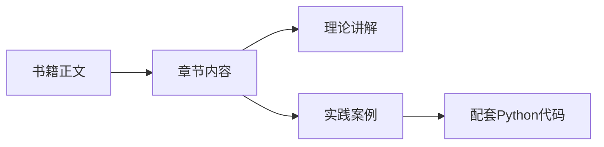
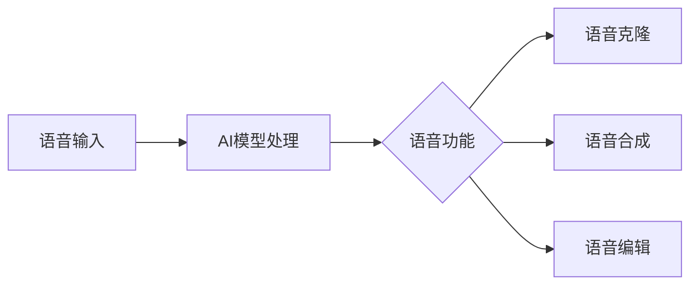
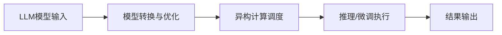
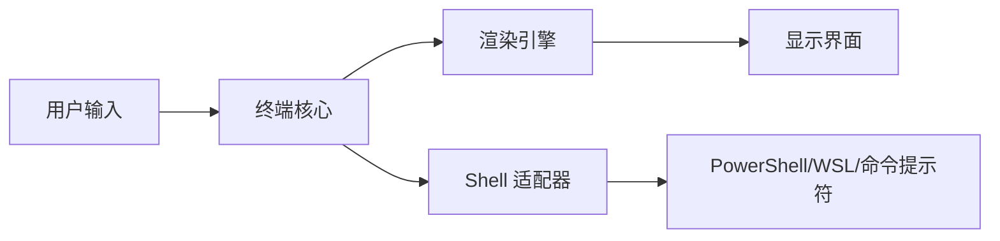
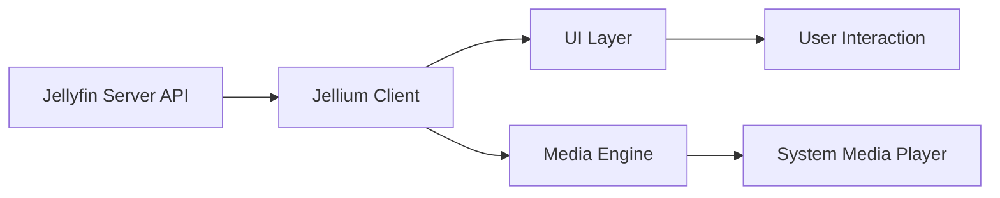

## 今日热点

AI Agent生态迎来爆发式增长，本地优先开发模式兴起，开发者正加速构建隐私保护型AI工具，同时高质量教育资源开源共享成为趋势。

---

## 热门项目一览

| 排名 | 项目 | 语言 | 今日 | 总计 | 简介 |
|:---:|------|:----:|------:|-----:|------|
| 1 | [bojieli/ai-agent-book](https://github.com/bojieli/ai-agent-book) | Python | +1,734 | 6,329 | 《深入理解 AI Agent：设计原理与工程实践》（李... |
| 2 | [codecrafters-io/build-your-own-x](https://github.com/codecrafters-io/build-your-own-x) | Markdown | +754 | 528,992 | Master programming by recre... |
| 3 | [tirth8205/code-review-graph](https://github.com/tirth8205/code-review-graph) | Python | +663 | 21,462 | Local-first code intelligen... |
| 4 | [jamiepine/voicebox](https://github.com/jamiepine/voicebox) | TypeScript | +610 | 43,458 | The open-source AI voice st... |
| 5 | [KnockOutEZ/wigolo](https://github.com/KnockOutEZ/wigolo) | TypeScript | +595 | 1,930 | The go-to web for your AI c... |
| 6 | [rohitg00/ai-engineering-from-scratch](https://github.com/rohitg00/ai-engineering-from-scratch) | Python | +501 | 39,788 | Learn it. Build it. Ship it... |
| 7 | [PostHog/posthog](https://github.com/PostHog/posthog) | Python | +411 | 36,970 | 🦔 PostHog is the leading pl... |
| 8 | [MoonshotAI/kimi-cli](https://github.com/MoonshotAI/kimi-cli) | Python | +410 | 9,929 | Kimi Code CLI is your next ... |
| 9 | [kvcache-ai/ktransformers](https://github.com/kvcache-ai/ktransformers) | Python | +360 | 18,425 | A Flexible Framework for Ex... |
| 10 | [lyogavin/airllm](https://github.com/lyogavin/airllm) | Jupyter Notebook | +358 | 23,672 | AirLLM 70B inference with s... |
| 11 | [1jehuang/jcode](https://github.com/1jehuang/jcode) | Rust | +235 | 8,963 | Coding Agent Harness |
| 12 | [PKUFlyingPig/cs-self-learning](https://github.com/PKUFlyingPig/cs-self-learning) | HTML | +134 | 74,226 | 计算机自学指南 |

---

## 趋势洞察

```
┌─────────────────────────────────────────────────────────────────┐
│  AI/ML 工具         ████████████████████████  14 个项目        │
│  其他               █████                     3 个项目        │
│  开发工具             ███                       2 个项目        │
└─────────────────────────────────────────────────────────────────┘
```

---

## 项目深度解读

### 1. bojieli/ai-agent-book — AI Agent理论与实践

> **一句话总结**：一本系统介绍AI Agent设计原理与工程实践的权威著作，配套完整代码实现。

#### 价值主张

| 维度 | 说明 |
|------|------|
| **解决痛点** | AI Agent领域缺乏系统化理论与实践结合的优质资源 |
| **目标用户** | AI开发者、研究人员、智能系统工程师、技术学习者 |
| **核心亮点** | 系统化理论体系 + 实战代码示例 + 工程实践指导 |

#### 技术架构



**技术特色**：
- 理论与实践相结合的AI Agent系统性介绍
- 按章节组织的配套Python代码实现
- 工程实践导向的AI Agent开发指南

#### 热度分析

- 项目近期Star数激增，单日增长1700+，反映AI Agent领域关注度高涨
- 零Open Issues表明项目维护良好，社区反馈通过其他渠道处理

#### 快速上手

```bash
# 克隆项目仓库
git clone https://github.com/bojieli/ai-agent-book.git

# 进入项目目录
cd ai-agent-book
```

#### 注意事项

- 项目需要一定的AI和机器学习基础知识
- 代码可能需要依赖特定版本的Python库
- 建议配合书籍内容阅读以获得完整理解


### 2. codecrafters-io/build-your-own-x — 编程实践学习库

> **一句话总结**：通过从零开始重建流行技术来掌握编程核心原理的实践学习资源库。

#### 价值主张

| 维度 | 说明 |
|------|------|
| **解决痛点** | 解决理论学习与实际应用脱节，缺乏系统性实践问题 |
| **目标用户** | 想深入理解技术原理的中高级开发者 |
| **核心亮点** | 实践导向 + 系统性学习 + 多技术覆盖 + 社区驱动 |

#### 技术架构

**技术特色**：
- 基于项目的"从零开始重建"理念，强调动手实践
- 采用渐进式学习路径，从简单到复杂
- 聚焦实际工作原理，而非表面应用

#### 热度分析

- 项目拥有52万+星标，日增750+，表明开发者社区高度认可其学习价值
- Fork数接近5万，说明大量用户积极参与实践和贡献

#### 快速上手

```bash
# 克隆项目
git clone https://github.com/codecrafters-io/build-your-own-x.git

# 浏览目录选择感兴趣的技术开始学习
cd build-your-own-x
```

#### 注意事项

- 项目依赖读者已有一定编程基础
- 不同教程难度不一，建议根据自身水平选择合适起点
- 实践过程需要耐心，重在理解原理而非快速完成


### 3. tirth8205/code-review-graph — 代码智能图

> **一句话总结**：构建代码库持久化智能图，优化AI工具上下文处理，提升代码审查效率。

#### 价值主张

| 维度 | 说明 |
|------|------|
| **解决痛点** | AI编码工具在大型代码库中上下文冗余，处理效率低下 |
| **目标用户** | AI辅助开发者、代码审查人员、大型项目维护者 |
| **核心亮点** | 本地优先处理+持久化代码图+上下文优化+MCP集成+CLI支持 |

#### 技术架构


**技术特色**：
- 本地优先处理架构，减少云端依赖和隐私风险
- 持久化代码图存储，提高重复使用效率
- MCP协议深度集成，增强AI工具兼容性

#### 热度分析

- 项目获得21,462个Star，单日增长663个，呈现爆发式增长趋势
- 在AI辅助开发领域具有较高影响力，社区活跃度持续攀升

#### 快速上手

```bash
# 克隆项目
git clone https://github.com/tirth8205/code-review-graph.git
cd code-review-graph

# 安装依赖
pip install -r requirements.txt

# 初始化项目
python setup.py install
```

#### 注意事项

- 项目License未知，商业使用前需确认许可条款
- 依赖Python环境，确保系统兼容性
- 对于大型代码库，建议配置资源使用限制以获得最佳性能


### 4. jamiepine/voicebox — AI语音创作平台

> **一句话总结**：开源AI语音工作室，支持语音克隆、听写与创作功能。

#### 价值主张

| 维度 | 说明 |
|------|------|
| **解决痛点** | 提供一站式AI语音处理工具，解决语音克隆、生成与编辑需求 |
| **目标用户** | 内容创作者、语音开发者、多媒体制作人员 |
| **核心亮点** | 开源可定制 + 多样化语音处理 + 简易操作界面 |

#### 技术架构



**技术特色**：
- 基于TypeScript开发，确保类型安全与跨平台兼容性
- 开源架构，支持社区定制与功能扩展
- 集成先进AI语音处理模型，支持多种语音转换

#### 热度分析

- 项目Star数超4.3万，日增600+，表明项目热度持续攀升
- 零开放Issues反映项目维护良好，社区问题解决高效

#### 快速上手

```bash
# 克隆项目
git clone https://github.com/jamiepine/voicebox.git
# 安装依赖
cd voicebox && npm install
# 启动应用
npm start
```

#### 注意事项

- 项目许可证信息未知，商业使用前需确认授权条款
- 作为AI语音工具，使用时需注意语音数据隐私与版权问题


### 5. KnockOutEZ/wigolo — [AI编程助手]

> **一句话总结**：本地优先的AI编程代理工具，无需API密钥，提供搜索、获取、爬取和研究功能，完全免费使用。

#### 价值主张

| 维度 | 说明 |
|------|------|
| **解决痛点** | 解决AI编程工具依赖云服务和API密钥的高成本问题 |
| **目标用户** | 开发者、研究人员和需要本地化AI编程辅助的用户 |
| **核心亮点** | 本地优先运行 + 无API密钥要求 + 完全免费 + MCP协议支持 + 隐私保护 |

#### 技术架构

**技术特色**：
- 基于TypeScript开发，确保类型安全和跨平台兼容性
- 采用MCP协议，实现高效的本地数据处理
- 实现了完整的本地搜索、获取、爬取和研究功能链

#### 热度分析

- 项目近期热度显著增长，单日增加595个Star，表明开发者社区对此类本地化AI工具需求旺盛
- 相对较低的Fork数量(121)暗示项目可能处于早期阶段，社区参与度正在形成中

#### 快速上手

```bash
# 克隆项目
git clone https://github.com/KnockOutEZ/wigolo.git

# 安装依赖
cd wigolo && npm install

# 启动服务
npm run dev
```

#### 注意事项

- 项目目前处于公开测试阶段，可能存在稳定性问题
- 虽然项目描述强调无需API密钥，但实际使用时可能需要配置本地环境
- 许可证信息未知，使用前需确认开源协议条款


### 6. rohitg00/ai-engineering-from-scratch — AI工程实战指南

> **一句话总结**：从零开始学习AI工程，提供完整学习路径和实践项目，助力AI产品落地。

#### 价值主张

| 维度 | 说明 |
|------|------|
| **解决痛点** | AI学习理论与实践脱节，缺乏工程化部署指导 |
| **目标用户** | AI初学者、希望提升工程化能力的开发者 |
| **核心亮点** | 完整学习路径 + 实战项目 + 部署指导 + 资源整合 + 社区支持 |

#### 技术架构


**技术特色**：
- 提供从理论到实践的完整AI工程路径
- 整合多种AI工具和框架的使用指南
- 包含实际部署和运维的最佳实践

#### 热度分析

- Star数近4万且持续增长，表明项目在AI学习领域具有高认可度和影响力
- Fork数较高，说明项目被广泛采用和二次开发，形成活跃的学习社区

#### 快速上手

```bash
# 克隆项目
git clone https://github.com/rohitg00/ai-engineering-from-scratch.git

# 安装依赖
cd ai-engineering-from-scratch
pip install -r requirements.txt
```

#### 注意事项

- 项目内容可能需要定期更新以适应AI技术的快速发展
- 建议结合官方文档和相关课程进行学习，以获取更全面的知识
- 部分实践项目可能需要一定的硬件资源，特别是大型模型训练


### 7. PostHog/posthog — 产品分析平台

> **一句话总结**：PostHog提供全面的开发者分析工具，帮助构建数据驱动的智能产品。

#### 价值主张

| 维度 | 说明 |
|------|------|
| **解决痛点** | 产品开发中缺乏全面数据洞察和问题诊断能力 |
| **目标用户** | 产品开发团队、数据分析师、SaaS产品开发者 |
| **核心亮点** | AI驱动的可观测性分析 + 全面的用户行为追踪 + 多平台集成控制 |

#### 技术架构


**技术特色**：
- 基于Python构建的高性能数据处理引擎
- 提供完整的API和SDK支持多平台集成
- 采用分布式架构确保大规模数据处理能力

#### 热度分析

- 项目Star数持续增长，日增400+，表明社区对其功能高度认可
- 作为分析工具领域的重要项目，已建立活跃的开发者生态系统

#### 快速上手

```bash
# 安装PostHog Python客户端
pip install posthog

# 初始化PostHog客户端
from posthog import Posthog
posthog = Posthog('YOUR_API_KEY')

# 捕获事件
posthog.capture('distinct_id', 'event_name', properties={'property1': 'value'})
```

#### 注意事项

- 需要配置API密钥才能使用PostHog服务
- 数据隐私和合规性需要根据当地法规进行配置
- 对于大型应用，建议考虑使用PostHog的自托管版本以获得更好的性能和控制


### 8. MoonshotAI/kimi-cli — [CLI智能助手]

> **一句话总结**：Kimi CLI是一款强大的命令行AI代理工具，提供智能编程与文本处理能力。

#### 价值主张

| 维度 | 说明 |
|------|------|
| **解决痛点** | 为开发者提供命令行环境下的智能编程助手，提升效率 |
| **目标用户** | 开发者、技术文档撰写者、命令行爱好者 |
| **核心亮点** | 命令行交互 + AI代码生成 + 文本理解 + 多语言支持 + 集成开发环境 |

#### 技术架构


**技术特色**：
- 基于大语言模型的命令行智能代理
- 支持多种编程语言的代码生成与解释
- 轻量级设计，快速响应与执行
- 模块化架构，易于扩展新功能

#### 热度分析

- 项目近期热度增长显著，单日新增星标超过400，表明社区关注度持续上升
- 高星低issue比例(9929星/0issue)反映项目质量稳定，用户体验良好

#### 快速上手

```bash
# 安装Kimi CLI
pip install kimi-cli

# 初始化配置
kimi-cli init

# 开始对话
kimi-cli "帮我写一个Python函数来计算斐波那契数列"
```

#### 注意事项

- 需要有效的Kimi API密钥才能使用全部功能
- 在处理敏感代码或信息时需注意数据安全
- 建议在使用前查看最新文档，因为API可能更新


### 9. kvcache-ai/ktransformers — LLM优化框架

> **一句话总结**：一个支持异构计算的灵活大语言模型推理与微调优化框架

#### 价值主张

| 维度 | 说明 |
|------|------|
| **解决痛点** | 解决大模型在不同硬件环境下的高效推理与微调问题 |
| **目标用户** | 大模型研究人员、AI工程师、计算优化专家 |
| **核心亮点** | 异构计算支持 + 灵活框架设计 + 高性能优化 + 易于扩展 |

#### 技术架构



**技术特色**：
- 支持多种硬件异构计算环境
- 提供灵活的模型转换和优化接口
- 高效的kvcache管理机制

#### 热度分析

- 项目Star数已达18,425，近期增长迅速(+360 today)，表明社区高度关注
- Fork数1,455显示项目具有良好的可扩展性和社区贡献潜力
- Open Issues为0，可能表明项目问题处理机制高效或社区问题主要通过其他渠道解决

#### 快速上手

```bash
# 克隆项目
git clone https://github.com/kvcache-ai/ktransformers.git
cd ktransformers

# 安装依赖
pip install -r requirements.txt

# 运行示例
python examples/basic_optimization.py --model gpt-2 --device cuda
```

#### 注意事项

- 项目可能需要一定的硬件资源支持，特别是GPU环境
- 由于项目涉及多种优化技术，用户需要具备一定的AI和系统优化知识
- 许可证信息不明确，使用前需确认开源协议


### 10. lyogavin/airllm — 低资源LLM推理

> **一句话总结**：突破显存限制，实现4GB GPU运行70B参数大模型的高效推理。

#### 价值主张

| 维度 | 说明 |
|------|------|
| **解决痛点** | 大语言模型推理受限于高端GPU显存资源，难以普及到普通用户 |
| **目标用户** | 资源受限的研究者、开发者及普通AI爱好者 |
| **核心亮点** | 显存优化技术 + 4GB GPU支持 + 70B模型推理 + 高效计算 + 开源实现 |

#### 技术架构


**技术特色**：
- 显存优化算法，突破硬件限制
- 模型分块加载与计算技术
- 高效的推理流程优化

#### 热度分析

- Star数持续快速增长，单日新增358，显示社区对该技术高度关注
- 高Fork数表明开发者积极尝试和二次开发，形成活跃的技术生态

#### 快速上手

```bash
# 克隆项目
git clone https://github.com/lyogavin/airllm.git
# 安装依赖
pip install -r requirements.txt
# 运行Notebook
jupyter notebook airllm.ipynb
```

#### 注意事项

- 需要确保有CUDA支持的GPU，即使显存较小
- 可能需要根据具体硬件环境调整某些参数
- 推理速度可能受限于硬件性能，需要合理预期


### 11. 1jehuang/jcode — AI编程助手

> **一句话总结**：基于Rust构建的AI编程助手工具，提供代码生成与优化功能。

#### 价值主张

| 维度 | 说明 |
|------|------|
| **解决痛点** | 提升编程效率，智能生成高质量代码，减少重复性开发工作 |
| **目标用户** | 软件开发人员、程序员、代码审查者 |
| **核心亮点** | AI辅助代码生成 + Rust高性能 + 多语言支持 + 智能代码优化 + 开源可定制 |

#### 技术架构


**技术特色**：
- 基于Rust构建，提供高性能和内存安全
- 集成AI模型进行代码理解和生成
- 支持多种编程语言的代码处理

#### 热度分析

- 项目Star数近9000，且有每日新增，表明社区认可度高，增长迅速
- Fork数超过1000，显示开发者积极参与和二次开发热情高

#### 快速上手

```bash
# 克隆项目
git clone https://github.com/1jehuang/jcode.git
# 进入项目目录
cd jcode
# 构建项目
cargo build --release
```

#### 注意事项

- 项目许可证未知，可能存在使用限制
- 需要一定的Rust知识才能进行深度定制或贡献
- AI生成代码可能需要人工审查和优化


### 12. PKUFlyingPig/cs-self-learning — 计算机学习导航

> **一句话总结**：全面的计算机科学自学资源导航，提供系统化学习路径和精选优质内容

#### 价值主张

| 维度 | 说明 |
|------|------|
| **解决痛点** | 计算机自学资源分散混乱，缺乏系统性和方向性指导 |
| **目标用户** | 计算机专业学生、IT转行者、自学者和技能提升者 |
| **核心亮点** | 系统化学习路径 + 精选优质资源 + 全领域覆盖 + 实践项目指导 + 持续更新维护 |

#### 技术架构


**技术特色**：
- 基于HTML的静态页面设计，加载速度快
- 采用文档组织结构，便于导航和内容查找
- 使用Git进行版本控制和协作更新维护

#### 热度分析

- 项目获得7.4万星，近期稳定增长（日增约134星），内容持续受社区认可
- 0个开放问题反映项目维护良好，质量高，社区依赖度强

#### 快速上手

```bash
# 克隆项目到本地
git clone https://github.com/PKUFlyingPig/cs-self-learning.git

# 使用本地服务器预览（可选）
cd cs-self-learning
python -m http.server 8000
```

#### 注意事项

- 本项目主要是学习资源导航，并非可直接运行的代码库
- 部分链接可能需要网络访问才能正常使用
- 建议结合自身基础和学习目标选择适合的学习路径


### 13. Canner/WrenAI — 智能SQL生成

> **一句话总结**：开源生成式BI工具，通过自然语言将用户问题转化为SQL查询，支持20+种数据源。

#### 价值主张

| 维度 | 说明 |
|------|------|
| **解决痛点** | 解决非技术人员通过自然语言直接查询复杂数据的难题 |
| **目标用户** | 数据分析师、业务用户、需要快速获取数据洞察的团队 |
| **核心亮点** | 开源 governed + 多数据源支持 + 自然语言转SQL + 可信任结果 + AI代理集成 |

#### 技术架构


**技术特色**：
- 开源上下文层架构，确保查询可解释和受控
- 支持20+主流数据源的统一接口
- 结合AI代理能力实现智能数据分析

#### 热度分析

- 项目Star数达16,249且持续增长(+121 today)，表明在AI辅助数据分析领域有显著影响力
- Fork数1,843显示社区活跃度高，开发者参与度强

#### 快速上手

```bash
# 安装WrenAI
pip install wren-ai

# 初始化配置
wren-ai init

# 启动服务
wren-ai serve
```

#### 注意事项

- 项目许可证信息未知，使用前需确认开源许可类型
- 作为生成式BI工具，需注意数据安全与隐私保护问题
- 可能需要一定的SQL知识以优化查询性能


### 14. Flowseal/zapret-discord-youtube — 网络绕行工具

> **一句话总结**：Windows批处理脚本，用于绕过网络限制访问Discord和YouTube。

#### 价值主张

| 维度 | 说明 |
|------|------|
| **解决痛点** | 解决网络限制下无法访问Discord和YouTube的问题 |
| **目标用户** | 受网络限制的Windows用户 |
| **核心亮点** | + 简单易用 + 批处理实现 + 无需安装 |

#### 技术架构

**技术特色**：
- 基于Windows批处理文件，无需额外安装
- 通过修改系统网络配置实现访问
- 简单的命令行操作界面

#### 热度分析

- 项目获得31,040个Star，显示有广泛需求，日增106表明持续热度
- 无开放问题，表明项目成熟稳定，社区依赖度高

#### 快速上手

```bash
# 下载批处理文件
# 右键以管理员身份运行
# 按照提示操作
```

#### 注意事项

- 需要以管理员权限运行
- 可能违反某些网络使用政策
- 仅适用于Windows操作系统


### 15. AstrBotDevs/AstrBot — AI助手框架

> **一句话总结**：一个集成多平台IM和LLMs的AI助手开发框架，可作为OpenClaw替代方案。

#### 价值主张

| 维度 | 说明 |
|------|------|
| **解决痛点** | 解决AI助手跨平台集成和开发复杂性高的痛点 |
| **目标用户** | 需要多平台AI助手的开发者和企业用户 |
| **核心亮点** | 多平台IM集成 + LLM支持 + 插件系统 + 开源可定制 |

#### 技术架构


**技术特色**：
- 支持多种即时通讯平台统一接入
- 提供LLM接口适配层，兼容多种AI模型
- 模块化插件系统设计，便于功能扩展
- 基于Python开发，易于二次开发和定制

#### 热度分析

- 高星数增长稳定，日增83星，表明项目热度持续上升
- Fork数适中，表明项目处于活跃开发阶段，社区参与度较高

#### 快速上手

```bash
# 克隆项目
git clone https://github.com/AstrBotDevs/AstrBot.git

# 安装依赖
pip install -r requirements.txt

# 启动服务
python bot.py
```

#### 注意事项

- 需要配置各平台API密钥才能正常使用
- 项目许可证信息不明确，使用前需确认授权条款


### 16. trycua/cua — 计算机使用规模化

> **一句话总结**：开源驱动与跨平台基准测试，实现计算机使用规模化训练与数据生成。

#### 价值主张

| 维度 | 说明 |
|------|------|
| **解决痛点** | 提供开源驱动和跨平台解决方案，解决计算机规模化使用的标准化问题 |
| **目标用户** | AI训练者、计算机视觉研究人员、自动化测试团队 |
| **核心亮点** | 开源驱动程序 + 跨操作系统支持 + 训练基准测试 + 数据生成工具 + 规模化部署 |

#### 技术架构


**技术特色**：
- 开源驱动程序实现跨平台兼容性
- 标准化基准测试确保评估一致性
- 支持大规模计算机使用数据的生成与处理

#### 热度分析

- 项目获得超过2万颗星，近期每日增长约60颗，表明项目受社区高度关注
- 零开放问题显示项目维护成熟，社区可能通过其他渠道交流讨论

#### 快速上手

```bash
# 克隆项目
git clone https://github.com/trycua/cua.git

# 安装依赖
cd cua && npm install

# 运行示例
npm start
```

#### 注意事项

- 项目许可证未知，商业使用前需确认授权情况
- 由于项目描述较为简略，可能需要进一步阅读文档了解完整功能
- 跨平台支持可能存在兼容性问题，需在实际环境中测试


### 17. microsoft/terminal — 现代终端平台

> **一句话总结**：微软推出的新一代 Windows 终端应用，集成命令行、PowerShell 和 WSL，提升开发者命令行体验。

#### 价值主张

| 维度 | 说明 |
|------|------|
| **解决痛点** | Windows 原生命令行体验落后，缺乏现代终端功能，开发者效率低下 |
| **目标用户** | Windows 平台的开发者、系统管理员和命令行重度用户 |
| **核心亮点** | 多标签支持 + 自定义主题 + GPU 加速渲染 + Unicode 和 UTF-8 支持 + PowerShell 集成 |

#### 技术架构



**技术特色**：
- 基于 C++ 和 WinUI 3 构建，性能优异
- 采用 GPU 加速渲染，支持流畅文本显示
- 插件化架构，支持扩展和自定义

#### 热度分析

- 项目 Star 数超过 10 万，近期持续稳定增长，表明其在 Windows 开发者社区中广受欢迎
- 作为微软官方项目，处于 Windows 开发生态的核心位置，影响力和用户基础庞大

#### 快速上手

```bash
# 从 Microsoft Store 安装 Windows Terminal
# 或通过 winget 安装
winget install Microsoft.WindowsTerminal

# 启动 Windows Terminal
wt
```

#### 注意事项

- 目前仅支持 Windows 10 和 Windows 11
- 需要启用 Windows 的某些功能才能完全支持 WSL
- 部分高级功能可能需要较新的 Windows 更新


### 18. andrewrabert/jellium-desktop — Jellyfin桌面客户端

> **一句话总结**：Rust编写的非官方Jellyfin桌面客户端，提供原生媒体播放与跨平台体验。

#### 价值主张

| 维度 | 说明 |
|------|------|
| **解决痛点** | 为Jellyfin提供官方未支持的桌面客户端，解决跨平台访问需求 |
| **目标用户** | Jellyfin媒体服务器用户，特别是需要桌面体验的用户 |
| **核心亮点** | 跨平台支持 + 原生性能 + Rust安全性 + 媒体播放控制 + 用户友好界面 |

#### 技术架构



**技术特色**：
- 使用 Rust 构建，提供内存安全和性能优势
- 可能使用 Tauri 框架实现跨平台桌面应用
- 原生媒体播放支持，提供流畅的媒体体验

#### 热度分析

- 项目获得1,308个Star和110个Fork，显示Jellyfin社区对桌面客户端的需求
- 43个新增Star表明项目近期有活跃的开发和社区关注

#### 快速上手

```bash
# 从 GitHub 下载最新版本
wget https://github.com/andrewrabert/jellium-desktop/releases/latest/download/jellium-desktop.tar.gz
tar -xzf jellium-desktop.tar.gz
./jellium-desktop
```

#### 注意事项

- 作为非官方客户端，可能与 Jellyfin 官方更新不兼容
- 项目许可证未知，可能影响商业使用
- 需要运行 Jellyfin 服务器才能使用


### 19. github/copilot-sdk — AI 代码助手集成

> **一句话总结**：GitHub Copilot SDK 提供跨平台能力，让开发者能轻松将 AI 代码助手功能集成到各种应用中。

#### 价值主张

| 维度 | 说明 |
|------|------|
| **解决痛点** | 解决开发者将 AI 代码助手能力集成到自有应用中的技术门槛 |
| **目标用户** | 需要集成 AI 代码助手功能的应用开发者和服务提供商 |
| **核心亮点** | 多平台支持 + 轻量级集成 + AI 能力无缝对接 + 开箱即用的 API |

#### 技术架构


**技术特色**：
- 跨平台兼容性设计，支持多种编程环境
- 轻量级 API 接口，降低集成复杂度
- 安全的代码生成流程，保障代码质量

#### 热度分析

- 项目获得近万星，日增39星，表明开发者对 AI 代码助手集成需求旺盛
- 作为 GitHub 官方 SDK，处于 AI 辅助编程生态的核心位置

#### 快速上手

```bash
# 添加 Maven 依赖
mvn com.github.copilot:copilot-sdk:1.0.0

# 初始化 Copilot 客户端
CopilotClient client = new CopilotClient("your-api-key");

# 获取代码建议
String suggestion = client.getSuggestion("your code context");
```

#### 注意事项

- 需要有效的 GitHub Copilot API 密钥才能使用服务
- 注意代码生成的版权和许可问题，建议对生成代码进行审查
- 考虑网络连接要求，确保能稳定访问 GitHub Copilot 服务


## 今日推荐

| 主题 | 推荐项目 | 亮点 |
|------|----------|------|
| 今日最热 | [bojieli/ai-agent-book](https://github.com/bojieli/ai-agent-book) | 《深入理解 AI Agent：设计... |
| 值得关注 | [codecrafters-io/build-your-own-x](https://github.com/codecrafters-io/build-your-own-x) | Master programmin... |
| 快速上手 | [tirth8205/code-review-graph](https://github.com/tirth8205/code-review-graph) | Local-first code ... |
| 长期潜力 | [jamiepine/voicebox](https://github.com/jamiepine/voicebox) | The open-source A... |

---

<div align="center">

*Generated on 2026-07-20 | Powered by GitHub Trending Reporter*

</div>