## 今日热点

AI代理与本地优先工具引领今日趋势，代码智能与多模型集成框架获得开发者高度关注，语音处理技术持续突破。

---

## 热门项目一览

| 排名 | 项目 | 语言 | 今日 | 总计 | 简介 |
|:---:|------|:----:|------:|-----:|------|
| 1 | [tirth8205/code-review-graph](https://github.com/tirth8205/code-review-graph) | Python | +1,833 | 23,286 | Local-first code intelligen... |
| 2 | [oblien/openship](https://github.com/oblien/openship) | TypeScript | +1,641 | 4,867 | Self-hosted deployment plat... |
| 3 | [diegosouzapw/OmniRoute](https://github.com/diegosouzapw/OmniRoute) | TypeScript | +1,107 | 21,927 | Never stop coding. Free MIT... |
| 4 | [every-app/open-seo](https://github.com/every-app/open-seo) | TypeScript | +939 | 5,888 | Open source alternative to ... |
| 5 | [msitarzewski/agency-agents](https://github.com/msitarzewski/agency-agents) | Shell | +862 | 134,752 | A complete AI agency at you... |
| 6 | [rohitg00/ai-engineering-from-scratch](https://github.com/rohitg00/ai-engineering-from-scratch) | Python | +823 | 40,582 | Learn it. Build it. Ship it... |
| 7 | [jamiepine/voicebox](https://github.com/jamiepine/voicebox) | TypeScript | +821 | 44,206 | The open-source AI voice st... |
| 8 | [KnockOutEZ/wigolo](https://github.com/KnockOutEZ/wigolo) | TypeScript | +689 | 2,578 | The go-to web for your AI c... |
| 9 | [1jehuang/jcode](https://github.com/1jehuang/jcode) | Rust | +568 | 9,671 | The most intelligent agent ... |
| 10 | [Robbyant/lingbot-map](https://github.com/Robbyant/lingbot-map) | Python | +565 | 14,266 | A feed-forward 3D foundatio... |
| 11 | [microsoft/Ontology-Playground](https://github.com/microsoft/Ontology-Playground) | TypeScript | +464 | 1,750 | Free, open-source web app f... |
| 12 | [kvcache-ai/ktransformers](https://github.com/kvcache-ai/ktransformers) | Python | +458 | 18,750 | A Flexible Framework for Ex... |

---

## 趋势洞察

```
┌─────────────────────────────────────────────────────────────────┐
│  AI/ML 工具         ████████████████████████  15 个项目        │
│  其他               ███                       2 个项目        │
│  开发框架             █                         1 个项目        │
│  媒体资源             █                         1 个项目        │
│  开发工具             █                         1 个项目        │
└─────────────────────────────────────────────────────────────────┘
```

---

## 项目深度解读

### 1. tirth8205/code-review-graph — 代码智能图

> **一句话总结**：构建代码库持久映射，优化AI工具上下文，提升代码审查效率

#### 价值主张

| 维度 | 说明 |
|------|------|
| **解决痛点** | 解决AI工具在大型代码库中上下文过载问题，提高代码审查效率 |
| **目标用户** | AI辅助开发者、代码审查团队、大型项目维护者 |
| **核心亮点** | 本地优先代码智能图 + MCP协议支持 + 上下文优化 + CLI工具 + 基准化性能 |

#### 技术架构

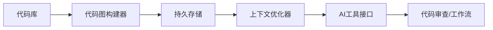

**技术特色**：
- 基于图的代码结构分析，构建代码间关系映射
- 实现MCP协议，与AI工具无缝集成
- 本地优先设计，保护代码隐私，减少网络依赖

#### 热度分析

- 项目star数增长迅速，单日新增800+，表明开发者社区高度认可其价值
- 相比同类代码分析工具，本项目在AI辅助编程领域处于领先地位

#### 快速上手

```bash
# 安装项目
pip install code-review-graph

# 初始化代码库图
code-review-graph init --path /path/to/codebase

# 运行代码审查
code-review-graph review --context optimized
```

#### 注意事项

- 项目可能需要较大的存储空间来维护代码图
- 对于大型代码库，初次构建可能需要较长时间
- 确保代码库结构符合项目的预期格式以获得最佳效果


### 2. oblien/openship — 自托管部署平台

> **一句话总结**：企业级自托管部署解决方案，实现应用全流程自动化交付。

#### 价值主张

| 维度 | 说明 |
|------|------|
| **解决痛点** | 打破云服务依赖，提供完全自主可控的应用部署能力 |
| **目标用户** | 中大型企业、DevOps团队、注重数据自主权的组织 |
| **核心亮点** | 自托管架构 + 多环境管理 + 部署流水线 + 可视化监控 + 插件扩展 |

#### 技术架构

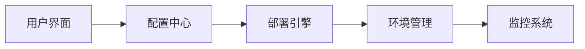

**技术特色**：
- 基于TypeScript/Node.js构建，确保类型安全与高性能
- 微服务架构设计，支持水平扩展与高可用部署
- 提供RESTful API与CLI工具，满足不同使用场景

#### 热度分析

- 单日增长1.6个Star，显示近期关注度迅速攀升，可能因新版本发布或功能更新
- 零Open Issues暗示项目采用高效问题管理机制，用户反馈可能通过其他渠道处理

#### 快速上手

```bash
# 克隆仓库
git clone https://github.com/oblien/openship.git

# 安装依赖
npm install

# 启动服务
npm run start
```

#### 注意事项
- 项目许可证信息不明确，企业使用前需确认授权条款
- 自托管部署需要一定的技术基础设施与运维能力支持
- 建议先在测试环境验证，再逐步迁移生产环境工作负载


### 3. diegosouzapw/OmniRoute — AI统一网关

> **一句话总结**：免费MIT AI网关，统一接入268+提供商和500+模型，支持智能配额回退和压缩技术。

#### 价值主张

| 维度 | 说明 |
|------|------|
| **解决痛点** | 解决AI服务碎片化、成本高和API不统一的问题 |
| **目标用户** | 开发者、AI应用构建者、企业技术团队 |
| **核心亮点** | 多提供商支持 + 智能配额回退 + RTK+Caveman压缩技术 + MCP/A2A支持 + 多模态能力 |

#### 技术架构

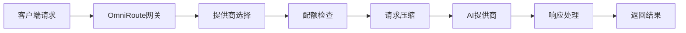

**技术特色**：
- RTK+Caveman压缩技术，节省15-95% token使用量
- 智能配额感知和自动回退机制
- 统一接口抽象多个AI提供商差异，简化集成复杂度

#### 热度分析

- 项目Star数超过2万，今日新增1千+，呈现快速增长趋势
- 由500+贡献者共同构建，社区活跃度高，处于AI中间件核心生态位

#### 快速上手

```bash
# 克隆项目
git clone https://github.com/diegosouzapw/OmniRoute.git

# 安装依赖
cd OmniRoute && npm install

# 启动服务
npm start
```

#### 注意事项

- 项目许可证未知，商业使用前需确认授权条款
- 配置复杂AI提供商可能需要额外设置API密钥
- 高频使用建议关注配额限制和回退机制配置
- 部署时需考虑数据安全和隐私保护措施


### 4. every-app/open-seo — 开源SEO工具

> **一句话总结**：开源多功能SEO分析平台，提供关键词研究、竞品分析和网站健康检查功能。

#### 价值主张

| 维度 | 说明 |
|------|------|
| **解决痛点** | 提供免费替代商业SEO工具，降低网站分析成本 |
| **目标用户** | 中小型网站管理员、数字营销人员和SEO专家 |
| **核心亮点** | 关键词研究功能 + 竞争对手分析 + 网站健康检查 + 数据可视化报告 |

#### 技术架构

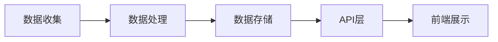

**技术特色**：
- 使用TypeScript开发，提供类型安全保障
- 模块化架构设计，便于功能扩展和维护
- 可能集成第三方API获取SEO相关数据

#### 热度分析

- 项目近期Star激增，单日新增939星，表明市场需求强烈
- 作为商业工具的开源替代品，填补了市场空白，社区关注度持续攀升

#### 快速上手

```bash
# 克隆项目
git clone https://github.com/every-app/open-seo.git
# 安装依赖
npm install
# 启动开发服务器
npm run dev
```

#### 注意事项

- 项目许可证信息未知，商业使用前需确认授权条款
- 作为SEO分析工具，数据来源可能受外部API限制，影响功能稳定性
- 使用时需遵守目标网站的使用条款，避免过度请求导致封禁


### 5. msitarzewski/agency-agents — AI代理集合

> **一句话总结**：提供多种专业AI代理的Shell脚本集合，覆盖前端开发、社区管理等多个领域。

#### 价值主张

| 维度 | 说明 |
|------|------|
| **解决痛点** | 为用户一站式提供多种专业AI代理，无需单独配置 |
| **目标用户** | 开发者、内容创作者、社区管理员等需要AI辅助的用户 |
| **核心亮点** | 多样化专业代理 + 即用型Shell脚本 + 个性化AI助手 |

#### 技术架构

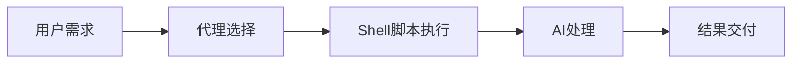

**技术特色**：
- 基于Shell脚本实现，轻量级且跨平台兼容
- 模块化代理设计，易于扩展和定制
- 通过命令行接口提供便捷的AI代理访问

#### 热度分析

- 项目获得超13万星，日增近千星，表明其受到开发者高度关注和认可
- 高Fork数反映了社区的活跃参与和二次开发意愿
- 零Open Issues可能表明项目维护良好或问题处理高效

#### 快速上手

```bash
# 克隆仓库
git clone https://github.com/msitarzewski/agency-agents.git

# 进入目录并执行特定代理
cd agency-agents
./frontend-wizard.sh
```

#### 注意事项
- 需要安装相应的Shell环境和依赖
- 某些代理可能需要额外的API密钥或配置
- Shell脚本执行前应检查安全性，特别是处理敏感数据时


### 6. rohitg00/ai-engineering-from-scratch — AI工程学习路径

> **一句话总结**：提供从零开始的AI工程完整学习路径，涵盖理论到实践的系统化指导。

#### 价值主张

| 维度 | 说明 |
|------|------|
| **解决痛点** | AI学习资源零散，缺乏从理论到部署的系统化工程指导 |
| **目标用户** | AI初学者、转行者、需要工程化AI技能的开发者 |
| **核心亮点** | 系统化学习路径 + 实战项目导向 + 全流程覆盖 |

#### 技术架构

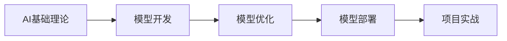

**技术特色**：
- 理论与实践相结合的学习方法
- 提供完整的工程化AI项目开发流程
- 从零开始构建AI系统的系统化指导

#### 热度分析

- 项目Star数超4万且持续增长，表明AI工程学习需求旺盛
- 高Fork数反映社区认可度高，被广泛参考和二次开发

#### 快速上手

```bash
# 克隆项目
git clone https://github.com/rohitg00/ai-engineering-from-scratch.git

# 进入项目目录
cd ai-engineering-from-scratch
```

#### 注意事项

- 项目License未知，商业使用前需确认授权情况
- 建议具备Python编程基础和数学基础后再学习
- 学习过程中应结合实际项目进行实践，加深理解


### 7. jamiepine/voicebox — AI语音工作室

> **一句话总结**：开源AI语音工作室，支持语音克隆、语音识别与生成，打造个性化语音体验。

#### 价值主张

| 维度 | 说明 |
|------|------|
| **解决痛点** | 解决专业语音生成与克隆门槛高、工具分散的问题 |
| **目标用户** | 内容创作者、开发者、语音设计师、AI爱好者 |
| **核心亮点** | 开源可定制 + 高质量语音生成 + 多语言支持 + 易于集成 |

#### 技术架构

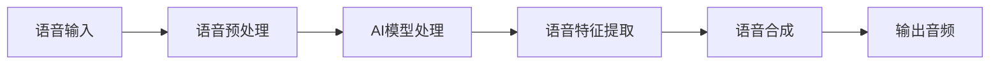

**技术特色**：
- 基于深度学习的语音合成技术，实现高质量语音克隆
- 开源架构，支持自定义训练和模型优化
- 多语言和多种声音风格支持，满足不同场景需求

#### 热度分析

- 项目Star数超过4.4万，单日增长800+，呈现快速增长态势
- 作为开源AI语音工具，在开发者社区和内容创作领域形成广泛影响力

#### 快速上手

```bash
# 克隆项目
git clone https://github.com/jamiepine/voicebox.git

# 安装依赖
cd voicebox
npm install

# 运行示例
npm run example
```

#### 注意事项

- 项目可能需要较高的计算资源，特别是训练自定义模型时
- 使用时需注意语音数据的版权和隐私问题
- 某些功能可能需要额外的API密钥或订阅服务


### 8. KnockOutEZ/wigolo — 本地AI搜索

> **一句话总结**：本地优先的AI编程代理工具，提供搜索、爬取和研究功能，无需API密钥和云服务。

#### 价值主张

| 维度 | 说明 |
|------|------|
| **解决痛点** | 解决AI编程依赖云端服务、需要API密钥和产生费用的问题 |
| **目标用户** | 开发者、研究人员、需要本地化AI辅助的用户 |
| **核心亮点** | 本地优先 + 无API密钥 + 零费用 + MCP支持 + 公开测试版 |

#### 技术架构

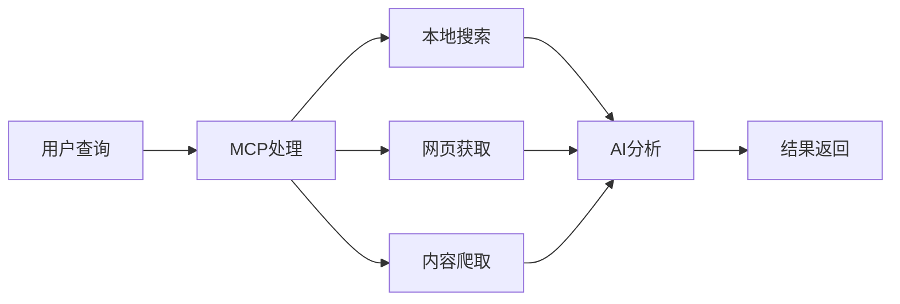

**技术特色**：
- 基于TypeScript开发，确保类型安全和跨平台兼容性
- 实现本地优先的数据处理，保护隐私并降低延迟
- 通过MCP协议连接多种数据源，扩展性强

#### 热度分析

- 项目在短时间内获得大量关注，单日新增689个Star，表明市场需求强烈
- Fork数相对较少(153)，可能说明项目处于早期阶段，用户主要关注而非二次开发

#### 快速上手

```bash
# 克隆项目
git clone https://github.com/KnockOutEZ/wigolo.git
# 安装依赖
npm install
# 启动应用
npm start
```

#### 注意事项

- 项目处于公开测试阶段，可能存在不稳定因素
- 需要确认MCP的具体实现方式和兼容性
- 项目许可证未知，使用前需确认商业使用限制


### 9. 1jehuang/jcode — 智能代码助手

> **一句话总结**：基于Rust构建的智能代码助手，提供代码生成与理解能力。

#### 价值主张

| 维度 | 说明 |
|------|------|
| **解决痛点** | 提升代码编写效率，减少重复性工作，增强代码质量 |
| **目标用户** | 软件开发者、编程学习者、代码审查人员 |
| **核心亮点** | 智能代码生成 + 代码理解能力 + 多语言支持 + 高性能实现 |

#### 技术架构

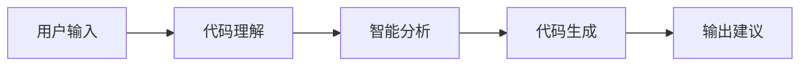

**技术特色**：
- 基于Rust实现的高性能代码处理引擎
- 支持多种编程语言的智能分析
- 模块化设计便于扩展与定制

#### 热度分析

- 项目Star数近万，单日新增568，显示快速增长趋势，表明开发者高度认可
- Fork数超千，社区积极参与，可能已有大量二次开发或定制化应用

#### 快速上手

```bash
# 克隆项目
git clone https://github.com/1jehuang/jcode.git
# 进入目录
cd jcode
# 构建项目
cargo build --release
```

#### 注意事项

- 项目许可证信息未知，使用前需确认授权条款
- 由于Open Issues为0，可能处于早期阶段或问题管理方式不同，需评估稳定性
- 需要Rust环境才能运行，增加了使用门槛


### 10. Robbyant/lingbot-map — 3D场景重建

> **一句话总结**：一个前馈3D基础模型，可从流数据实时重建三维场景。

#### 价值主张

| 维度 | 说明 |
|------|------|
| **解决痛点** | 解决传统3D重建计算效率低、难以实时处理流数据的问题 |
| **目标用户** | 机器人开发者、AR/VR应用开发者、自动驾驶系统开发者 |
| **核心亮点** | 前馈架构高效处理 + 支持流数据实时输入 + 基础模型可扩展 |

#### 技术架构

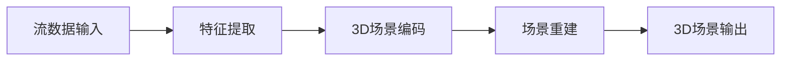

**技术特色**：
- 前馈架构显著提升处理效率
- 基础模型支持场景语义理解
- 流式数据处理实现实时重建

#### 热度分析

- 项目获得14,266个Star，单日增长565，呈现快速增长态势
- 作为3D重建领域的前沿项目，在机器人视觉领域具有重要生态价值

#### 快速上手

```bash
# 安装依赖
pip install -r requirements.txt

# 运行示例
python demo.py --input_stream data_stream
```

#### 注意事项

- 项目可能需要高性能GPU支持
- 数据输入格式需符合特定要求
- 模型训练可能需要大量计算资源


### 11. microsoft/Ontology-Playground — 本体可视化工具

> **一句话总结**：免费开源的本体设计与可视化工具，支持创建、分享和导出本体，零后端全静态部署。

#### 价值主张

| 维度 | 说明 |
|------|------|
| **解决痛点** | 解决本体学习曲线陡峭、可视化设计困难问题 |
| **目标用户** | 本体学习研究者、数据架构师、语义网开发者 |
| **核心亮点** | 预构建本体目录 + 可视化设计器 + RDF/XML导出 + 交互式图表分享 + 全静态部署 |

#### 技术架构

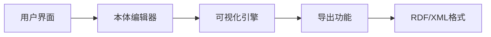

**技术特色**：
- 全栈TypeScript实现，保证类型安全
- 零后端架构，完全静态部署
- 支持交互式本体设计和可视化

#### 热度分析

- 项目近期增长迅猛，单日新增464个Star，社区关注度极高
- 作为微软生态中的开源项目，与Fabric IQ产品线形成技术协同效应

#### 快速上手

```bash
# 克隆项目
git clone https://github.com/microsoft/Ontology-Playground.git

# 安装依赖
npm install

# 启动开发服务器
npm run start
```

#### 注意事项

- 项目许可证信息不明确，使用前需确认
- 作为静态应用，可能需要额外配置才能实现某些后端功能
- 项目依赖Microsoft Fabric IQ，可能需要相关环境支持


### 12. kvcache-ai/ktransformers — LLM优化框架

> **一句话总结**：提供灵活的异构LLM推理和微调优化框架，提升大模型性能与效率。

#### 价值主张

| 维度 | 说明 |
|------|------|
| **解决痛点** | 解决大语言模型推理和微调过程中性能与资源利用效率低下问题 |
| **目标用户** | AI研究人员、大模型工程师和需要优化LLM性能的开发者 |
| **核心亮点** | 异构计算支持 + 多种优化策略 + 灵活框架设计 + 高性能缓存 |

#### 技术架构

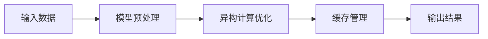

**技术特色**：
- 支持异构计算环境下的LLM并行优化
- 实现高效的键值缓存机制减少重复计算
- 提供灵活的微调策略适配不同模型

#### 热度分析

- 项目Star数达18,750，单日增长458，显示在LLM优化领域关注度极高
- Fork数1,463反映社区活跃度高，Issues为0表明项目稳定性良好

#### 快速上手

```bash
# 克隆项目
git clone https://github.com/kvcache-ai/ktransformers.git
cd ktransformers

# 安装依赖
pip install -r requirements.txt
```

#### 注意事项

- 需要理解LLM基础知识和优化原理才能充分利用框架功能
- 可能需要特定的硬件环境来发挥异构计算优势
- 建议参考项目文档了解不同优化策略的适用场景


### 13. MoonshotAI/kimi-cli — AI命令助手

> **一句话总结**：Kimi CLI是一款强大的AI命令行助手，提供自然语言交互的编程辅助功能。

#### 价值主张

| 维度 | 说明 |
|------|------|
| **解决痛点** | 将AI能力引入命令行环境，提升开发效率和代码质量 |
| **目标用户** | 开发者、系统管理员和需要高效命令行操作的技术人员 |
| **核心亮点** | 自然语言交互 + 多语言支持 + 上下文理解 + 智能代码生成 |

#### 技术架构

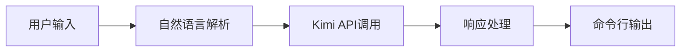

**技术特色**：
- 基于大语言模型的智能对话系统
- 轻量级设计，确保命令行操作的高效响应
- 支持多轮对话和上下文记忆功能

#### 热度分析

- 项目Star数突破10k，日增400+，显示用户认可度高
- Fork数量稳定增长，表明社区贡献活跃，已成为开发者工具生态中的重要组件

#### 快速上手

```bash
# 安装kimi-cli
pip install kimi-cli

# 启动交互式会话
kimi

# 直接提问
kimi "如何用Python实现快速排序？"
```

#### 注意事项

- 需要有效的API密钥才能使用Kimi AI服务
- 网络连接质量会影响响应速度和稳定性
- 部分高级功能可能需要订阅付费计划


### 14. handy-computer/transcribe.cpp — 语音转文本引擎

> **一句话总结**：基于 ggml 的高性能 C++ 语音转文本推理引擎，支持 16+ 模型家族。

#### 价值主张

| 维度 | 说明 |
|------|------|
| **解决痛点** | 提供轻量级、高性能的本地语音识别解决方案，无需云端依赖 |
| **目标用户** | 需要本地语音识别的开发者、研究人员和隐私敏感用户 |
| **核心亮点** | 轻量级部署 + 高性能推理 + 多模型支持 + 本地处理 + 隐私保护 |

#### 技术架构

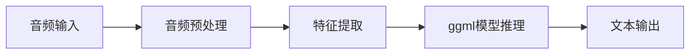

**技术特色**：
- 基于 ggml 库实现高效 CPU 推理，避免深度学习框架依赖
- 支持 16+ 种语音识别模型架构，覆盖不同场景需求
- 纯 C++ 实现，适合资源受限环境部署

#### 热度分析

- 项目短时间内获得 1,282 stars，单日增长 395，显示社区对本地语音识别解决方案的高度关注
- Fork 数相对较少(31)，表明项目处于早期阶段，更多用户是作为使用者而非贡献者

#### 快速上手

```bash
# 克隆仓库
git clone https://github.com/handy-computer/transcribe.cpp.git
cd transcribe.cpp

# 构建项目
mkdir build && cd build
cmake ..
make

# 运行语音识别
./transcribe audio.wav
```

#### 注意事项

- 项目许可证未知，使用前需确认许可条款
- 项目 Issue 数为 0，可能表示项目处于早期阶段，社区支持有限
- 需要确认支持的模型类型和具体使用方法
- 可能需要额外下载预训练模型才能运行


### 15. tokio-rs/topcoat — 全栈Web框架

> **一句话总结**：基于tokio的高性能全栈Web框架，提供开箱即用的开发组件。

#### 价值主张

| 维度 | 说明 |
|------|------|
| **解决痛点** | 简化Rust Web应用开发流程，减少组件集成复杂度 |
| **目标用户** | 需要构建高性能、类型安全Web应用的Rust开发者 |
| **核心亮点** | 异步高性能 + 全栈功能 + 零配置 + 类型安全 + 生态集成 |

#### 技术架构

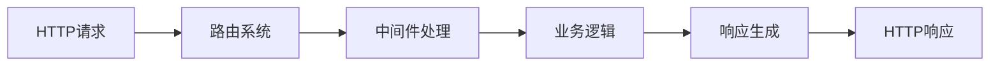

**技术特色**：
- 基于tokio异步运行时，提供高并发处理能力
- 与tokio生态系统无缝集成，如hyper、serde等
- 采用Rust语言特性，确保内存安全和类型安全

#### 热度分析

- 项目Star数达1577，单日增长371，显示近期关注度迅速提升
- Fork数相对较少，表明项目处于早期阶段，社区正在形成

#### 快速上手

```bash
cargo new my-topcoat-app
cd my-topcoat-app
cargo add topcoat
```

#### 注意事项

- 项目仍处于早期阶段，API可能不稳定
- 文档和示例可能不够完善，需要参考源码
- 社区规模较小，遇到问题时可能需要自行探索


### 16. AstrBotDevs/AstrBot — AI助手框架

> **一句话总结**：集成多平台IM与LLM的AI助手开发框架，可作为OpenClaw替代方案。

#### 价值主张

| 维度 | 说明 |
|------|------|
| **解决痛点** | 统一管理多平台AI助手功能，简化开发流程 |
| **目标用户** | 开发者、AI应用爱好者、企业自动化需求者 |
| **核心亮点** | 多平台IM集成 + 大语言模型支持 + 插件系统 + AI功能整合 |

#### 技术架构

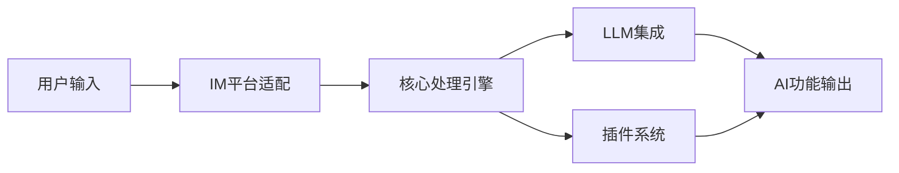

**技术特色**：
- 基于Python开发，易于扩展和定制
- 支持多种即时通讯平台接入
- 模块化设计，便于功能扩展

#### 热度分析

- 项目Star数超过3.7万，近期增长迅速，日均新增300+星标，显示社区高度关注
- Fork数相对适中，表明项目处于积极开发阶段，但尚未形成大规模二次开发生态

#### 快速上手

```bash
# 克隆项目
git clone https://github.com/AstrBotDevs/AstrBot.git
cd AstrBot
# 安装依赖
pip install -r requirements.txt
# 启动服务
python run.py
```

#### 注意事项

- 项目许可证未知，使用前需确认开源协议
- 集成LLM服务可能需要API密钥和额外配置
- 作为OpenClaw替代品，可能需要数据迁移工作


### 17. moonshine-ai/moonshine — 低延迟语音交互

> **一句话总结**：提供超低延迟的语音转文本、意图识别和文本转语音能力，专为构建实时语音助手设计。

#### 价值主张

| 维度 | 说明 |
|------|------|
| **解决痛点** | 解决语音交互高延迟痛点，实现实时语音助手响应 |
| **目标用户** | 语音助手开发者与智能交互产品团队 |
| **核心亮点** | 超低延迟处理 + 端到端语音交互 + 多模态理解能力 |

#### 技术架构

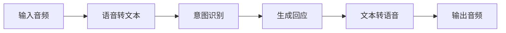

**技术特色**：
- 基于C++实现的高性能低延迟处理引擎
- 专为实时语音交互优化的端到端架构
- 融合语音识别与自然语言理解的混合模型

#### 热度分析

- Star数近万且单日新增282，项目增长势头强劲，关注度持续攀升
- Issues数为0可能表明项目维护良好或问题通过其他渠道高效解决

#### 快速上手

```bash
# 克隆仓库
git clone https://github.com/moonshine-ai/moonshine.git
# 构建项目
cd moonshine && mkdir build && cd build && cmake .. && make
```

#### 注意事项

- 项目使用C++开发，需要相应的编译环境和依赖库
- 可能需要额外的预训练模型文件才能完整运行功能
- 许可证信息未知，商业使用前需确认授权条款


### 18. iptv-org/iptv — [全球IPTV库]

> **一句话总结**：全球公开IPTV频道集合，提供世界各国电视流媒体资源

#### 价值主张

| 维度 | 说明 |
|------|------|
| **解决痛点** | 集中整理全球公开IPTV频道，解决分散难寻问题 |
| **目标用户** | IPTV爱好者、内容开发者、媒体研究人员 |
| **核心亮点** | 全球覆盖+免费资源+持续更新+多格式支持+开源维护 |

#### 技术架构

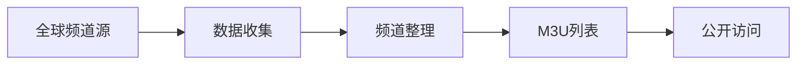

**技术特色**：
- 全球IPTV频道聚合与分类系统
- 多格式兼容支持(M3U, M3U8等)
- 社区驱动的持续更新机制

#### 热度分析

- 高关注度项目，13万+Star表明其在IPTV领域具有显著影响力
- 社区活跃度高，0开放Issues反映问题解决机制完善

#### 快速上手

```bash
# 克隆项目
git clone https://github.com/iptv-org/iptv.git

# 浏览频道列表
cd iptv && cat playlist.m3u
```

#### 注意事项

- 所有频道均为公开资源，使用时请遵守当地法律法规
- 频道可用性可能随时间变化，项目团队不保证永久可用性
- 建议使用前检查频道列表更新日期以获取最新可用资源


### 19. topoteretes/cognee — AI记忆引擎

> **一句话总结**：开源AI记忆平台，通过自托管知识图谱引擎为AI代理提供跨会话持久记忆能力

#### 价值主张

| 维度 | 说明 |
|------|------|
| **解决痛点** | AI代理缺乏长期记忆能力，无法在多次会话间保持知识和上下文 |
| **目标用户** | 需要持久记忆能力的AI开发者、研究人员和智能代理构建者 |
| **核心亮点** | 自托管知识图谱引擎 + 跨会话记忆持久化 + 开源可定制 + 专为AI代理优化 |

#### 技术架构

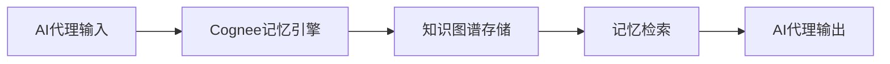

**技术特色**：
- 基于知识图谱的记忆存储系统
- 自托管架构确保数据隐私控制
- 跨会话的记忆持久化机制

#### 热度分析

- 项目拥有28,808个Star，近期增长迅速，单日增加234个，反映AI记忆领域热度高涨
- 社区活跃度高，Fork数达2,743，显示开发者参与度强

#### 快速上手

```bash
# 克隆仓库
git clone https://github.com/topoteretes/cognee.git

# 安装依赖
pip install -r requirements.txt

# 启动服务
python -m cognee start
```

#### 注意事项

- 项目许可证未知，使用前需确认许可证条款
- 作为自托管解决方案，需要一定的技术基础设施来部署和维护
- 项目处于活跃开发中，API可能会有变化


### 20. PrefectHQ/fastmcp — Python MCP工具

> **一句话总结**：提供快速、Pythonic的方式构建MCP服务器和客户端，简化通信协议实现

#### 价值主张

| 维度 | 说明 |
|------|------|
| **解决痛点** | 简化MCP协议实现，降低消息通信系统开发复杂度 |
| **目标用户** | Python开发者，需要构建高效消息通信系统的工程师 |
| **核心亮点** | 快速构建 + Pythonic设计 + 高性能 + 简化API + 类型安全 |

#### 技术架构

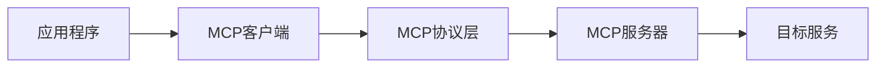

**技术特色**：
- 基于Python异步IO实现高性能通信
- 提供简洁直观的API接口
- 支持多种传输协议和自定义扩展

#### 热度分析

- 项目获得26K+ Star且持续增长，表明其在消息通信领域受到高度认可
- Fork数2K+，显示有相当多的开发者基于此项目进行二次开发

#### 快速上手

```bash
# 安装fastmcp
pip install fastmcp

# 创建简单的MCP服务器
from fastmcp import Server

server = Server()
server.start()
```

#### 注意事项

- 项目License信息不明确，使用前需确认开源许可条款
- 需要一定的Python异步编程基础以充分发挥其性能优势


## 今日推荐

| 主题 | 推荐项目 | 亮点 |
|------|----------|------|
| 今日最热 | [tirth8205/code-review-graph](https://github.com/tirth8205/code-review-graph) | Local-first code ... |
| 值得关注 | [oblien/openship](https://github.com/oblien/openship) | Self-hosted deplo... |
| 快速上手 | [diegosouzapw/OmniRoute](https://github.com/diegosouzapw/OmniRoute) | Never stop coding... |
| 长期潜力 | [every-app/open-seo](https://github.com/every-app/open-seo) | Open source alter... |

---

<div align="center">

*Generated on 2026-07-21 | Powered by GitHub Trending Reporter*

</div>