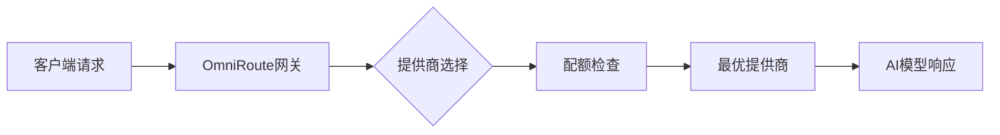
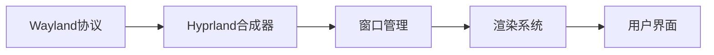

## 今日热点

今日GitHub热榜项目精彩纷呈。

---

## 热门项目一览

| 排名 | 项目 | 语言 | 今日 | 总计 | 简介 |
|:---:|------|:----:|------:|-----:|------|
| 1 | [bojieli/ai-agent-book](https://github.com/bojieli/ai-agent-book) | Python | +4,624 | 14,729 | 《深入理解 AI Agent：设计原理与工程实践》（李... |
| 2 | [diegosouzapw/OmniRoute](https://github.com/diegosouzapw/OmniRoute) | TypeScript | +2,034 | 23,658 | Never stop coding. Free MIT... |
| 3 | [tirth8205/code-review-graph](https://github.com/tirth8205/code-review-graph) | Python | +1,925 | 24,593 | Local-first code intelligen... |
| 4 | [ayghri/i-have-adhd](https://github.com/ayghri/i-have-adhd) | Unknown | +1,866 | 6,916 | A skill for your coding age... |
| 5 | [oblien/openship](https://github.com/oblien/openship) | TypeScript | +1,562 | 6,262 | Self-hosted deployment plat... |
| 6 | [koala73/worldmonitor](https://github.com/koala73/worldmonitor) | TypeScript | +1,295 | 65,592 | Real-time global intelligen... |
| 7 | [chrislgarry/Apollo-11](https://github.com/chrislgarry/Apollo-11) | Assembly | +1,235 | 69,977 | Original Apollo 11 Guidance... |
| 8 | [every-app/open-seo](https://github.com/every-app/open-seo) | TypeScript | +849 | 6,621 | Open source alternative to ... |
| 9 | [1jehuang/jcode](https://github.com/1jehuang/jcode) | Rust | +843 | 10,341 | The most intelligent agent ... |
| 10 | [KnockOutEZ/wigolo](https://github.com/KnockOutEZ/wigolo) | TypeScript | +642 | 3,163 | The go-to web for your AI c... |
| 11 | [AstrBotDevs/AstrBot](https://github.com/AstrBotDevs/AstrBot) | Python | +416 | 37,484 | AI Agent Assistant & develo... |
| 12 | [schollz/croc](https://github.com/schollz/croc) | Go | +361 | 36,822 | Easily and securely send th... |

---

## 趋势洞察

```
┌─────────────────────────────────────────────────────────────────┐
│  AI/ML 工具         ████████████████████████  15 个项目        │
│  其他               ████████                  5 个项目        │
│  开发框架             █                         1 个项目        │
└─────────────────────────────────────────────────────────────────┘
```

---

## 项目深度解读

### 1. bojieli/ai-agent-book — AI Agent实战指南

> **一句话总结**：理论与实践结合的AI Agent设计指南，提供完整书籍内容和可执行代码示例。

#### 价值主张

| 维度 | 说明 |
|------|------|
| **解决痛点** | AI Agent领域缺乏系统性的理论与实践结合教材，开发者难以从零构建完整Agent系统 |
| **目标用户** | AI/ML工程师、研究者、对智能系统开发感兴趣的技术人员 |
| **核心亮点** | 理论与实践结合 + 完整代码示例 + 系统性知识结构 + 工程实践指导 |

#### 技术架构


**技术特色**：
- 基于Python实现，易于上手
- 按章节组织代码结构清晰
- 提供从理论到实践的完整路径

#### 热度分析

- 项目近期增长迅猛，单日新增星标4624，显示AI Agent领域热度高涨
- 社区活跃度高，Fork比例适中(约9.4%)，表明项目兼具学习价值和实践价值

#### 快速上手

```bash
# 克隆仓库
git clone https://github.com/bojieli/ai-agent-book.git

# 进入项目目录
cd ai-agent-book

# 查看目录结构
ls -la
```

#### 注意事项

- 项目许可证未知，商业使用前需确认授权
- 代码示例可能需要依赖特定环境，注意查看README中的依赖说明
- 部分高级案例可能需要较强的AI/ML基础


### 2. diegosouzapw/OmniRoute — AI统一网关

> **一句话总结**：一个免费开源的AI网关，统一接入268+提供商、500+模型，支持智能回退和压缩技术。

#### 价值主张

| 维度 | 说明 |
|------|------|
| **解决痛点** | 解决AI服务提供商分散、接口不统一、成本高的问题 |
| **目标用户** | 需要使用多种AI服务的开发者和企业用户 |
| **核心亮点** | 统一API接口 + 智能配额感知 + RTK+Caveman压缩技术 |

#### 技术架构



**技术特色**：
- 统一API接口，兼容Claude、GPT、Gemini等多种AI模型
- 配额感知和自动回退机制，确保服务稳定性
- RTK+Caveman压缩技术减少15-95% token消耗

#### 热度分析

- 项目Star数超过2.3万且单日增长2000+，社区热度极高
- 由500+贡献者共同维护，形成活跃的开源生态

#### 快速上手

```bash
# 克隆项目
git clone https://github.com/diegosouzapw/OmniRoute.git

# 安装依赖
npm install

# 启动服务
npm start
```

#### 注意事项

- 项目许可证未知，使用前需确认授权条款
- 需要配置各AI提供商的API密钥才能正常使用
- 压缩技术可能影响某些特定AI模型的输出质量


### 3. tirth8205/code-review-graph — 代码智能图谱

> **一句话总结**：构建本地代码智能图谱，为AI工具提供精准代码上下文，显著提升代码审查效率。

#### 价值主张

| 维度 | 说明 |
|------|------|
| **解决痛点** | AI工具处理代码时上下文冗余，效率低下的问题 |
| **目标用户** | AI辅助开发工具用户、代码审查人员 |
| **核心亮点** | 本地优先构建 + 持久化代码映射 + 智能上下文精简 |

#### 技术架构


**技术特色**：
- 本地优先的持久化代码映射技术
- 基于图结构的代码关系分析
- 智能上下文精简算法

#### 热度分析

- Star数量24,593且单日增长近2千，显示出极高的社区关注度和快速上升趋势
- Fork数2,355，表明项目有较高的实用价值和二次开发需求

#### 快速上手

```bash
# 克隆项目
git clone https://github.com/tirth8205/code-review-graph.git
# 安装依赖
pip install -r requirements.txt
# 初始化代码图谱
python init_graph.py --path /path/to/code
```

#### 注意事项

- 由于没有明确许可证信息，使用前需确认授权条款
- 项目可能与特定AI工具集成紧密，需确认与现有开发环境的兼容性
- 对于大型代码库，可能需要较高的计算资源


### 4. ayghri/i-have-adhd — [ADHD友好代码]

> **一句话总结**：为编程助手提供ADHD友好输出格式，提升信息获取效率

#### 价值主张

| 维度 | 说明 |
|------|------|
| **解决痛点** | 解决AI代码回答信息过载、难以快速获取核心内容的问题 |
| **目标用户** | ADHD开发者、注意力分散的程序员、信息处理困难者 |
| **核心亮点** | 简洁输出结构 + 关键信息前置 + 减少认知负担 |

#### 技术架构


**技术特色**：
- 信息层级优化技术，将核心内容前置
- 减少冗余信息的过滤机制
- 适合注意力分散的输出格式设计

#### 热度分析

- 项目近期获得大量关注，单日增长超过1800星，表明ADHD友好开发工具需求激增
- 社区对开发者心理健康和认知辅助工具的关注度显著提升

#### 快速上手

```bash
# 假设这是一个npm包的安装方式
npm install i-have-adhd
# 或者在代码助手中启用该技能
coding-agent --enable-adhd-friendly
```

#### 注意事项

- 该项目主要针对ADHD开发者，但所有程序员都能从中受益
- 使用时可能需要调整个人工作流以适应新的输出格式
- 项目文档可能需要进一步完善以便更好地理解和使用


### 5. oblien/openship — 自托管部署工具

> **一句话总结**：开源自托管部署平台，简化应用自动化部署流程，支持多环境管理。

#### 价值主张

| 维度 | 说明 |
|------|------|
| **解决痛点** | 打破云服务依赖，提供完全可控的应用部署方案 |
| **目标用户** | DevOps团队、中小型技术企业及需要私有部署的组织 |
| **核心亮点** | 自托管部署 + 多环境支持 + 自动化流程 + 安全可控 |

#### 技术架构


**技术特色**：
- TypeScript全栈开发，提供类型安全
- 自托管架构，数据本地控制
- 支持多环境部署策略

#### 热度分析

- 项目Star数6,262且今日新增1,562，表明近期获得高度关注和认可，增长迅猛
- Fork数452，无开放问题，显示项目成熟度高，社区维护良好，处于自托管部署工具生态前沿

#### 快速上手

```bash
# 克隆项目
git clone https://github.com/oblien/openship.git

# 安装依赖
npm install

# 启动服务
npm run start
```

#### 注意事项

- 项目许可证信息不明确，使用前需确认开源协议
- 作为自托管平台，需要一定的基础设施和运维能力支持


### 6. koala73/worldmonitor — 全球情报监控平台

> **一句话总结**：AI驱动的实时全球情报仪表板，整合新闻聚合与地缘政治监测功能。

#### 价值主张

| 维度 | 说明 |
|------|------|
| **解决痛点** | 全球信息碎片化，难以及时获取全面的地缘政治情报 |
| **目标用户** | 安全分析师、情报机构、国际关系研究者 |
| **核心亮点** | AI新闻聚合+实时全球监测+可视化情报展示+多源数据整合+态势感知 |

#### 技术架构


**技术特色**：
- 多源异构数据智能聚合
- AI驱动的信息筛选与优先级排序
- 实时数据流处理与可视化展示

#### 热度分析

- 项目获得超过6.5万星标，近期增长迅速，日均新增约1300星标，表明项目受到广泛关注
- 作为开源情报工具，在安全研究和国防分析领域具有重要生态价值

#### 快速上手

```bash
# 克隆仓库
git clone https://github.com/koala73/worldmonitor.git
cd worldmonitor

# 安装依赖并启动
npm install
npm start
```

#### 注意事项

- 项目可能需要API密钥才能访问某些数据源
- 系统资源消耗可能较高，建议在配置良好的环境中运行
- 数据源的可靠性和准确性需要用户自行判断


### 7. chrislgarry/Apollo-11 — 历史航天代码

> **一句话总结**：阿波罗11号导航计算机的原始汇编代码，是人类登月任务的核心控制系统，具有极高的历史价值。

#### 价值主张

| 维度 | 说明 |
|------|------|
| **解决痛点** | 保存和重现人类登月任务的关键技术遗产 |
| **目标用户** | 航史研究者、航天工程师、复古计算爱好者 |
| **核心亮点** | 历史真实性 + 完整系统代码 + 低级汇编实现 + 实际飞行验证 |

#### 技术架构


**技术特色**：
- 使用独特的"机器汇编语言"(MAC)编写，是早期航天计算机的典型代表
- 代码极其精简，仅包含约72K字节的内存和约2K字节的指令
- 实时操作系统设计，具有优先级任务调度和中断处理机制

#### 热度分析

- 项目Star数接近7万且持续增长，表明历史代码仍具有极高关注度
- 无Open Issues说明项目维护状态稳定，主要用于历史研究和教育目的

#### 快速上手

```bash
# 克隆项目
git clone https://github.com/chrislgarry/Apollo-11.git
# 查看项目结构
cd Apollo-11 && ls
# 阅读README了解如何编译和模拟
```

#### 注意事项

- 这是历史代码，与现代系统不兼容，需要专门的模拟器才能运行
- 汇编代码阅读难度高，需要理解特定的AGC指令集和系统架构
- 代码中的注释和文档可能不完整，需要参考额外的历史资料


### 8. every-app/open-seo — 开源SEO工具

> **一句话总结**：开源替代方案，提供网站SEO分析，无需付费订阅即可获取专业级数据。

#### 价值主张

| 维度 | 说明 |
|------|------|
| **解决痛点** | 商业SEO工具价格昂贵，中小企业难以负担 |
| **目标用户** | 网站管理员、数字营销人员、SEO专家和小型企业主 |
| **核心亮点** | 完全开源 + 提供专业级SEO分析 + 无需付费订阅 + 数据隐私保护 + 可自托管 |

#### 技术架构


**技术特色**：
- 基于TypeScript开发，确保代码质量和类型安全
- 采用模块化设计，便于扩展和维护
- 支持本地部署，保障数据隐私安全

#### 热度分析

- 项目短期内获得大量关注，今日新增849个Star，显示市场需求强烈
- 在商业工具主导的SEO分析市场具有重要开源替代价值

#### 快速上手

```bash
# 克隆项目
git clone https://github.com/every-app/open-seo.git

# 安装依赖
npm install

# 启动开发服务器
npm run dev
```

#### 注意事项

- 项目许可证未知，使用前需确认开源许可条款
- 作为替代商业工具的开源项目，可能存在数据覆盖范围或功能完整性方面的限制


### 9. 1jehuang/jcode — 智能代码助手

> **一句话总结**：基于Rust开发的智能代码代理工具，提升开发者编写、理解和优化代码的效率。

#### 价值主张

| 维度 | 说明 |
|------|------|
| **解决痛点** | 解决开发者代码编写效率低、复杂代码理解困难的问题 |
| **目标用户** | 软件开发者、代码审查人员、自动化测试工程师 |
| **核心亮点** | 智能代码分析 + 自动化代码生成 + 多语言支持 + 高性能Rust实现 |

#### 技术架构


**技术特色**：
- 基于Rust的高性能实现，确保处理效率
- 采用先进的AI技术理解代码意图
- 提供可扩展的插件架构支持

#### 热度分析

- 项目Star数突破1万，单日增长800+，处于快速上升期
- Fork数适中，表明项目处于早期阶段，社区贡献尚未大规模展开

#### 快速上手

```bash
# 克隆仓库
git clone https://github.com/1jehuang/jcode.git
cd jcode

# 构建项目
cargo build --release

# 运行示例
./jcode analyze --file example.rs
```

#### 注意事项

- 项目许可证未知，商业使用前需确认授权方式
- 项目处于活跃开发阶段，API可能不稳定
- 需要一定的Rust知识才能贡献代码


### 10. KnockOutEZ/wigolo — AI编程助手

> **一句话总结**：本地优先的AI编程助手Web平台，无需API密钥和云端服务，完全免费使用。

#### 价值主张

| 维度 | 说明 |
|------|------|
| **解决痛点** | 解决AI编程助手依赖云端和API密钥的高成本问题 |
| **目标用户** | 开发者、研究人员和需要AI编程辅助的专业人士 |
| **核心亮点** | 本地优先架构 + 无API密钥 + 完全免费 + MCP支持 |

#### 技术架构


**技术特色**：
- 基于TypeScript构建，确保类型安全和跨平台兼容性
- 采用本地优先架构，减少对云服务的依赖
- 通过MCP协议实现高效的信息获取和处理

#### 热度分析

- 项目Star数达3163，单日增长642，显示快速增长态势
- Fork数相对较少，表明项目处于早期阶段，社区生态正在形成

#### 快速上手

```bash
# 克隆项目
git clone https://github.com/KnockOutEZ/wigolo.git

# 安装依赖
npm install

# 启动应用
npm run dev
```

#### 注意事项

- 项目目前处于公开测试阶段，功能可能不稳定
- 许可证信息未知，使用前需确认开源协议
- 需要了解MCP协议的具体实现方式才能充分利用项目功能


### 11. AstrBotDevs/AstrBot — 多平台AI助手

> **一句话总结**：集成多平台IM与LLM的AI助手开发框架，提供可扩展的AI功能解决方案。

#### 价值主张

| 维度 | 说明 |
|------|------|
| **解决痛点** | 统一管理多平台AI交互，简化AI助手开发流程 |
| **目标用户** | 需要跨平台AI助手功能的开发者和企业用户 |
| **核心亮点** | 多平台集成 + LLM支持 + 插件系统 + 开源可定制 |

#### 技术架构


**技术特色**：
- 基于Python开发，易于扩展和定制
- 模块化设计，支持多种即时通讯平台集成
- 提供插件系统，增强功能可扩展性

#### 热度分析

- 项目Star数超过3.7万，近期增长迅速，表明社区高度关注和认可
- 作为OpenClaw替代方案，在AI助手开发领域具有显著影响力

#### 快速上手

```bash
# 克隆项目
git clone https://github.com/AstrBotDevs/AstrBot.git
# 安装依赖
pip install -r requirements.txt
# 启动服务
python main.py
```

#### 注意事项

- 项目许可证未知，使用前需确认授权条款
- 集成LLM服务可能需要额外的API密钥和配置
- 多平台支持可能需要针对特定平台进行额外配置


### 12. schollz/croc — 安全跨传工具

> **一句话总结**：简单安全的跨设备文件传输工具，无需配置即可实现点对点加密传输。

#### 价值主张

| 维度 | 说明 |
|------|------|
| **解决痛点** | 解决跨设备文件传输复杂性和安全性问题 |
| **目标用户** | 开发者、普通用户


### 13. microsoft/Ontology-Playground — 本体可视化工具

> **一句话总结**：零后端的静态Web应用，可学习和设计本体，支持导出RDF/XML并交互式分享。

#### 价值主张

| 维度 | 说明 |
|------|------|
| **解决痛点** | 降低本体设计门槛，提供直观可视化的本体构建体验 |
| **目标用户** | 数据建模者、知识工程师、语义网络学习者 |
| **核心亮点** | 零后端全静态设计 + 可视化本体编辑器 + 导出RDF/XML格式 + 交互式图表分享 + 预构建本体目录 |

#### 技术架构


**技术特色**：
- 纯前端实现，无需后端支持
- 使用TypeScript确保代码类型安全
- 静态部署，便于分享和分发
- 支持RDF/XML标准格式导出
- 提供交互式本体可视化体验

#### 热度分析

- 项目Star数达2016，单日新增355，显示快速增长态势，表明市场需求强烈
- 零Issues状态反映项目成熟度高，社区反馈积极，生态位置良好

#### 快速上手

```bash
# 克隆项目
git clone https://github.com/microsoft/Ontology-Playground.git

# 安装依赖
npm install

# 启动开发服务器
npm run dev
```

#### 注意事项

- 项目许可证未知，使用前需确认授权条款
- 作为纯前端应用，本体数据仅在客户端处理，不涉及后端存储
- 需要现代浏览器支持，可能不兼容旧版浏览器
- 项目依赖Microsoft Fabric IQ，可能需要相关环境配置


### 14. agegr/pi-web — AI编程助手界面

> **一句话总结**：为AI编程助手提供现代化Web界面，提升开发者与AI代码助手的交互体验。

#### 价值主张

| 维度 | 说明 |
|------|------|
| **解决痛点** | 为AI编程命令行工具提供直观可视化界面，解决交互不便问题 |
| **目标用户** | 需要与AI编程助手交互的开发者和编程学习者 |
| **核心亮点** | TypeScript开发保证代码质量 + 现代化Web界面设计 + 提升AI工具可用性 |

#### 技术架构


**技术特色**：
- 采用TypeScript开发，提高代码健壮性
- 前端Web界面设计，提升用户体验
- 可能使用现代前端框架构建交互界面

#### 热度分析

- 项目近期Star增长迅速（今日+298），表明社区关注度较高，处于上升期
- Fork数量适中，显示有一定社区参与度，但尚未形成大规模二次开发生态

#### 快速上手

```bash
# 克隆项目
git clone https://github.com/agegr/pi-web.git
# 安装依赖
npm install
# 启动开发服务器
npm run dev
```

#### 注意事项

- 项目License未知，商业使用前需确认授权方式
- 项目Open Issues为0，可能处于早期阶段或问题管理方式不同
- 作为Web UI项目，可能需要后端API支持才能完全运行


### 15. earthtojake/text-to-cad — 文本转CAD工具

> **一句话总结**：通过自然语言描述直接生成CAD设计，大幅降低硬件设计门槛。

#### 价值主张

| 维度 | 说明 |
|------|------|
| **解决痛点** | 解决CAD设计专业门槛高、流程繁琐的问题，实现快速设计转化 |
| **目标用户** | 硬件工程师、机器人设计师、产品设计师和创客爱好者 |
| **核心亮点** | 文本转CAD + 自动化设计流程 + 多格式支持 + AI辅助设计 |

#### 技术架构


**技术特色**：
- 基于大语言模型的CAD设计意图理解
- 支持多种CAD格式转换与导出
- 集成硬件设计专业知识库与最佳实践

#### 热度分析

- 项目获得9,163星，近期增长迅速（+291今天），表明在CAD自动化领域有较强吸引力
- Fork数1,026显示社区参与度较高，处于CAD自动化工具生态的前沿位置

#### 快速上手

```bash
# 安装依赖
npm install earthtojake/text-to-cad

# 基本使用
text-to-cad "设计一个10cm的正方形" --output square.dxf
```

#### 注意事项

- 项目可能需要一定的CAD基础知识才能充分利用
- 生成的CAD设计可能需要人工调整和优化
- 项目License未知，使用前需确认授权方式


### 16. DioxusLabs/dioxus — 跨平台全栈框架

> **一句话总结**：基于 Rust 的全栈应用框架，支持 Web、桌面和移动平台开发，提供高性能与安全性。

#### 价值主张

| 维度 | 说明 |
|------|------|
| **解决痛点** | 解决 JavaScript 框架性能与安全问题，提供原生级体验的全栈解决方案 |
| **目标用户** | Rust 开发者、跨平台应用开发者、追求高性能和安全性的团队 |
| **核心亮点** | 单一代码库多平台 + 原生性能 + 响应式UI + 组件化架构 + 强类型安全 |

#### 技术架构


**技术特色**：
- 基于 React 声明式 UI 模型的 Rust 实现
- 虚拟 DOM 高效渲染机制
- 与 Rust 生态系统无缝集成
- 支持服务端渲染 (SSR)

#### 热度分析

- 项目 Star 数持续增长，今日新增 271，表明社区活跃度高，发展势头强劲
- 作为 Rust 生态中的全栈框架，填补了 JavaScript 框架与 Rust 之间的空白，在性能敏感型应用领域具有独特优势

#### 快速上手

```bash
# 创建新项目
cargo install dioxus-cli
dx new my_app
cd my_app
# 运行应用
dx serve
```

#### 注意事项

- Dioxus 相对较新，生态系统和第三方库可能不如成熟框架丰富
- 需要一定的 Rust 基础，学习曲线可能较陡峭
- 某些平台特性可能仍在开发中，稳定性有待验证


### 17. AlexsJones/llmfit — [模型硬件适配]

> **一句话总结**：硬件兼容性检测工具，一键识别可运行的AI模型

#### 价值主张

| 维度 | 说明 |
|------|------|
| **解决痛点** | 解决用户无法确定硬件能否运行特定AI模型的问题 |
| **目标用户** | AI开发者、研究人员及普通用户 |
| **核心亮点** | 支持数百种模型和提供商 + 硬件自动检测 + 一键查询 |

#### 技术架构


**技术特色**：
- 使用Rust编写，提供高性能和安全性
- 广泛的模型和提供商支持
- 硬件兼容性智能检测算法

#### 热度分析

- 项目获得3万+星标且持续增长，表明其在AI社区中具有重要价值
- 零开放问题反映项目成熟度高，维护良好

#### 快速上手

```bash
# 安装llmfit
cargo install llmfit

# 检测可运行的模型
llmfit list
```

#### 注意事项

- 需要Rust环境才能安装和运行
- 硬件检测结果可能受系统配置影响
- 部分模型可能需要额外依赖才能完全运行
- 项目许可证信息不明确，使用时需注意授权问题


### 18. tradesdontlie/tradingview-mcp — AI交易分析助手

> **一句话总结**：将Claude AI集成到TradingView中，实现智能图表分析与交易工作流自动化。

#### 价值主张

| 维度 | 说明 |
|------|------|
| **解决痛点** | 交易分析自动化，减少人工判断，提高决策效率 |
| **目标用户** | 交易者、分析师、量化投资爱好者 |
| **核心亮点** | AI辅助分析 + TradingView深度集成 + 工作流自动化 + 智能决策支持 |

#### 技术架构


**技术特色**：
- 基于JavaScript的跨平台实现
- TradingView API深度集成
- Claude AI模型调用与分析
- 实时数据处理与响应

#### 热度分析

- 项目Star数量快速增长，日增114个，表明市场认可度高
- Fork数接近Star数一半，说明社区参与度高，实际使用广泛

#### 快速上手

```bash
# 安装依赖
npm install tradingview-mcp

# 初始化配置
tradingview-mcp init

# 启动服务
tradingview-mcp start
```

#### 注意事项

- 需要TradingView Desktop客户端支持
- 可能需要Claude API访问权限
- 交易决策应结合人工判断，不完全依赖AI


### 19. dottxt-ai/outlines — 结构化输出工具

> **一句话总结**：outlines是一个为大型语言模型提供结构化输出能力的Python库，帮助开发者定义和控制AI输出的格式。

#### 价值主张

| 维度 | 说明 |
|------|------|
| **解决痛点** | 大型语言模型输出格式不固定，难以直接集成到结构化应用中 |
| **目标用户** | 需要将LLM输出整合到结构化应用程序中的AI开发者 |
| **核心亮点** | + 支持多种输出格式 + 与主流LLM框架集成 + 类型安全的数据提取 |

#### 技术架构


**技术特色**：
- 基于Python的类型提示系统定义输出结构
- 支持多种LLM后端(OpenAI, Anthropic等)
- 提供灵活的验证和错误处理机制

#### 热度分析

- 项目获得近15k星，近期增长稳定，显示其在AI开发者社区中受到高度关注
- 作为LLM工具链中的重要组件，填补了结构化输出这一细分领域的空白

#### 快速上手

```bash
# 安装outlines
pip install outlines

# 基本使用示例
from outlines import models, generate
model = models.openai("gpt-3.5-turbo")
prompt = "Generate a JSON object with name and age"
structured_output = generate.json(model, prompt)
```

#### 注意事项

- 需要有效的API密钥才能使用支持的LLM后端
- 复杂结构定义可能导致提示长度增加
- 输出格式严格性可能会影响LLM的创意能力


### 20. hyprwm/Hyprland — 现代Wayland合成器

> **一句话总结**：高度可定制且美观的动态瓦片式Wayland合成器，提供卓越的Linux桌面体验。

#### 价值主张

| 维度 | 说明 |
|------|------|
| **解决痛点** | 替代传统X Window系统，提供更现代、高性能的Wayland桌面环境 |
| **目标用户** | 追求高性能、高度可定制性和美观界面的Linux桌面用户 |
| **核心亮点** | 高度可定制 + 动态瓦片布局 + 高性能渲染 + 美观界面 |

#### 技术架构



**技术特色**：
- 基于C++实现的高性能合成器
- 自定义的动态瓦片布局算法
- 支持多种输入设备和快捷键系统
- 完全独立的Wayland合成器，不依赖其他组件

#### 热度分析

- 项目star数高达37,050，近期增长稳定(+58 today)，表明Wayland生态正在快速发展
- 相比其他Wayland合成器，Hyprland社区活跃度高，fork数适中，说明项目发展健康

#### 快速上手

```bash
# 克隆仓库
git clone --recursive https://github.com/hyprwm/Hyprland.git
# 构建项目
cd Hyprland && mkdir build && cd build && cmake .. && make -j$(nproc)
# 安装
sudo make install
```

#### 注意事项

- 需要较新的Linux内核和Wayland支持
- 配置主要通过Hyprland的配置文件进行，需要一定的学习曲线
- 可能与某些专有显卡驱动兼容性有限，建议使用开源驱动


### 21. langchain-ai/open_deep_research — 深度研究工具

> **一句话总结**：基于LangChain的AI深度研究框架，可自动收集、分析和整合多源信息。

#### 价值主张

| 维度 | 说明 |
|------|------|
| **解决痛点** | 简化复杂研究流程，自动整合分散信息源，节省研究时间 |
| **目标用户** | 研究人员、分析师、内容创作者、产品经理 |
| **核心亮点** | 多源信息整合 + 智能内容分析 + 自动化研究流程 + 结构化输出 |

#### 技术架构


**技术特色**：
- 基于LangChain框架构建，支持多种LLM模型
- 多模态信息处理与智能摘要能力
- 研究流程自动化与可定制化

#### 热度分析

- 项目获得12k+星标，近期持续增长，社区活跃度高
- 作为LangChain生态系统重要组件，处于AI研究工具前沿位置

#### 快速上手

```bash
# 安装依赖
pip install langchain-open-deep-research

# 基本使用
from deep_research import DeepResearcher
researcher = DeepResearcher()
result = researcher.research("人工智能在教育领域的最新应用")
print(result.summary)
```

#### 注意事项

- 需要配置相应的API密钥才能使用外部服务
- 研究结果质量依赖于底层模型能力和数据源质量
- 建议在使用前阅读项目文档以了解完整功能和限制


## 今日推荐

| 主题 | 推荐项目 | 亮点 |
|------|----------|------|
| 今日最热 | [bojieli/ai-agent-book](https://github.com/bojieli/ai-agent-book) | 《深入理解 AI Agent：设计... |
| 值得关注 | [diegosouzapw/OmniRoute](https://github.com/diegosouzapw/OmniRoute) | Never stop coding... |
| 快速上手 | [tirth8205/code-review-graph](https://github.com/tirth8205/code-review-graph) | Local-first code ... |
| 长期潜力 | [ayghri/i-have-adhd](https://github.com/ayghri/i-have-adhd) | A skill for your ... |

---

<div align="center">

*Generated on 2026-07-22 | Powered by GitHub Trending Reporter*

</div>