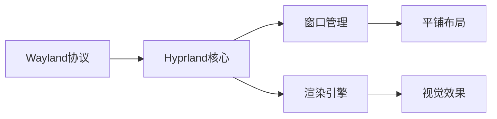

## 今日热点

AI工具持续火热，从通用模型向专业化场景扩展；同时，基础设施工具创新活跃，网络监控、文件传输和部署平台等领域技术迭代加速。

---

## 热门项目一览

| 排名 | 项目 | 语言 | 今日 | 总计 | 简介 |
|:---:|------|:----:|------:|-----:|------|
| 1 | [koala73/worldmonitor](https://github.com/koala73/worldmonitor) | TypeScript | +4,139 | 69,098 | Real-time global intelligen... |
| 2 | [ayghri/i-have-adhd](https://github.com/ayghri/i-have-adhd) | Python | +1,699 | 8,340 | A skill for your coding age... |
| 3 | [diegosouzapw/OmniRoute](https://github.com/diegosouzapw/OmniRoute) | TypeScript | +1,651 | 25,385 | Never stop coding. Free MIT... |
| 4 | [oblien/openship](https://github.com/oblien/openship) | TypeScript | +1,302 | 7,332 | Self-hosted deployment plat... |
| 5 | [tirth8205/code-review-graph](https://github.com/tirth8205/code-review-graph) | Python | +882 | 25,344 | Local-first code intelligen... |
| 6 | [chrislgarry/Apollo-11](https://github.com/chrislgarry/Apollo-11) | Assembly | +768 | 70,634 | Original Apollo 11 Guidance... |
| 7 | [ruvnet/RuView](https://github.com/ruvnet/RuView) | Rust | +741 | 83,877 | π RuView turns commodity Wi... |
| 8 | [schollz/croc](https://github.com/schollz/croc) | Go | +739 | 37,640 | Easily and securely send th... |
| 9 | [rohitg00/ai-engineering-from-scratch](https://github.com/rohitg00/ai-engineering-from-scratch) | Python | +652 | 42,286 | Learn it. Build it. Ship it... |
| 10 | [jamiepine/voicebox](https://github.com/jamiepine/voicebox) | TypeScript | +557 | 45,803 | The open-source AI voice st... |
| 11 | [DioxusLabs/dioxus](https://github.com/DioxusLabs/dioxus) | Rust | +420 | 38,028 | Fullstack app framework for... |
| 12 | [dottxt-ai/outlines](https://github.com/dottxt-ai/outlines) | Python | +364 | 15,111 | Structured Outputs |

---

## 趋势洞察

```
┌─────────────────────────────────────────────────────────────────┐
│  AI/ML 工具         ████████████████████████  10 个项目        │
│  其他               ████████████████          7 个项目        │
│  开发框架             ██                        1 个项目        │
│  多媒体应用            ██                        1 个项目        │
└─────────────────────────────────────────────────────────────────┘
```

---

## 项目深度解读

### 1. koala73/worldmonitor — 全球情报监控平台

> **一句话总结**：AI驱动的实时全球情报监控平台，整合新闻、地缘政治和基础设施数据于统一界面。

#### 价值主张

| 维度 | 说明 |
|------|------|
| **解决痛点** | 全球情报分散获取困难，缺乏实时整合的态势感知能力 |
| **目标用户** | 情报分析师、政策制定者、安全专家、国际关系研究人员 |
| **核心亮点** | AI驱动新闻聚合 + 多源数据整合 + 实时全球监控 + 可视化态势展示 |

#### 技术架构


**技术特色**：
- 多源异构数据智能整合技术
- AI驱动的实时情报分析引擎
- 高性能数据可视化与态势感知系统

#### 热度分析

- 项目获得超过69,000星且单日增长4,000+，表明其具有极高的市场关注度和实用价值
- 高Fork数显示社区积极参与二次开发和功能扩展，形成活跃的情报工具生态

#### 快速上手

```bash
git clone https://github.com/koala73/worldmonitor.git
cd worldmonitor
npm install && npm start
```

#### 注意事项

- 项目许可证未知，使用前需确认授权条款
- 零开放问题可能表示项目已成熟或问题管理方式不同
- 作为情报监控平台，使用时需注意数据来源的合法性和隐私问题


### 2. ayghri/i-have-adhd — ADHD编程助手

> **一句话总结**：为编程助手提供ADHD友好输出格式，防止关键信息被埋没，提升信息获取效率。

#### 价值主张

| 维度 | 说明 |
|------|------|
| **解决痛点** | 编程助手输出冗长，关键信息难以快速获取 |
| **目标用户** | ADHD开发者、需要高效获取信息的程序员 |
| **核心亮点** | 结构化输出 + 关键信息前置 + 减少认知负荷 |

#### 技术架构


**技术特色**：
- 通过重新组织输出结构提升信息获取效率
- 针对ADHD认知特点优化信息呈现方式
- 保持与主流编程助手兼容的接口设计

#### 热度分析

- 项目近期获得大量关注（单日增长1700+ stars），表明ADHD友好工具需求强烈
- 在开发者工具生态中占据特殊位置，解决特定人群的痛点需求

#### 快速上手

```bash
# 安装为编程助手的插件
pip install i-have-adhd

# 在编程助手的配置文件中启用
# 例如在VS Code或JetBrains IDE的配置中添加
```

#### 注意事项

- 主要适用于支持插件扩展的编程环境
- 可能需要根据具体编程助手进行配置调整
- 对于非ADHD用户，可能需要适应新的输出格式


### 3. diegosouzapw/OmniRoute — AI 统一网关

> **一句话总结**：免费开源的AI统一网关，支持500+模型，自动配额管理和15-95%的token节省。

#### 价值主张

| 维度 | 说明 |
|------|------|
| **解决痛点** | 开发者需要统一接口访问多个AI服务，避免重复配置和管理成本 |
| **目标用户** | 使用多种AI服务的开发者和AI工具使用者，如Copilot、Cursor等 |
| **核心亮点** | 统一端点访问500+模型 + 自动配额回退 + RTK+Caveman压缩节省token + 兼容主流AI工具 + 支持桌面/PWA |

#### 技术架构


**技术特色**：
- 多提供商统一网关架构，实现AI服务无缝切换
- 配额感知的智能路由，确保服务持续可用
- RTK+Caveman压缩算法，大幅降低token消耗

#### 热度分析

- 项目Star数达25,385，单日增长1,651，表明项目处于高速增长期，受到开发者高度关注
- 500+贡献者参与，表明项目拥有活跃的社区和良好的生态建设

#### 快速上手

```bash
# 克隆项目
git clone https://github.com/diegosouzapw/OmniRoute.git

# 安装依赖
npm install

# 启动服务
npm start
```

#### 注意事项

- 项目License未知，使用前需确认授权条款
- 项目依赖多个AI服务提供商，需注意各提供商的配额限制和政策变化
- 压缩技术可能影响某些AI服务的响应质量，使用时需评估权衡


### 4. oblien/openship — 自托管部署平台

> **一句话总结**：简洁强大的自托管部署平台，让应用一键部署到任何服务器。

#### 价值主张

| 维度 | 说明 |
|------|------|
| **解决痛点** | 简化自托管应用部署流程，降低技术门槛 |
| **目标用户** | 开发者、DevOps工程师、中小型企业 |
| **核心亮点** | 一键部署 + 自托管可控 + 多环境支持 + 零配置 |

#### 技术架构


**技术特色**：
- 基于TypeScript构建，类型安全可靠
- 自托管架构，数据完全可控
- 简洁的API设计，易于集成扩展

#### 热度分析

- 近期Star数大幅增长(+1,302 today)，项目热度快速攀升
- 高Star/Fork比例(7,332/541)，社区参与度高，用户认可度高

#### 快速上手

```bash
# 克隆仓库
git clone https://github.com/oblien/openship.git

# 安装依赖并启动
npm install && npm start
```

#### 注意事项

- 需要基本的Linux服务器管理知识
- 推荐使用Docker环境以获得最佳体验
- 自托管模式意味着用户需自行维护服务器安全


### 5. tirth8205/code-review-graph — 代码智能图谱

> **一句话总结**：构建代码库持久化图谱，优化AI编码工具上下文，提升大仓库审查效率。

#### 价值主张

| 维度 | 说明 |
|------|------|
| **解决痛点** | AI工具处理大型代码库时上下文冗余，效率低下 |
| **目标用户** | 使用AI辅助编码的开发者，特别是处理大代码库团队 |
| **核心亮点** | 持久化代码图谱 + 智能上下文缩减 + 高效大仓库处理 |

#### 技术架构


**技术特色**：
- 基于Python的AST解析构建代码依赖关系图谱
- 持久化存储代码结构与调用关系映射
- 智能算法识别关键代码路径，缩减无关上下文

#### 热度分析

- 项目获得2.5万+星标，近千日增长，热度持续攀升
- 零开放问题显示项目维护状态良好，社区认可度高

#### 快速上手

```bash
# 安装
pip install code-review-graph

# 初始化
code-review-graph init

# 扫描项目
code-review-graph scan
```

#### 注意事项

- 需要Python 3.7+环境运行
- 大型代码库初次扫描可能需要较长时间
- 与MCP(Microsoft Copilot Protocol)集成需要特定配置


### 6. chrislgarry/Apollo-11 — 历史航天代码

> **一句话总结**：阿波罗11号导航计算机原始源代码，重现人类登月里程碑的技术奇迹。

#### 价值主张

| 维度 | 说明 |
|------|------|
| **解决痛点** | 保存并公开阿波罗导航系统核心代码，防止历史技术流失 |
| **目标用户** | 航天历史研究者、复古计算机爱好者、航天工程师 |
| **核心亮点** | 原始历史代码 + 登月任务核心系统 + 汇编语言实现 + 完整保存 + 教育价值高 |

#### 技术架构


**技术特色**：
- 15位字长汇编语言实现
- 磁芯存储器与只读存储器结合
- 实时导航与制导系统
- 冗余设计与容错机制
- 有限资源下的高效算法

#### 热度分析

- 高星数(7万+)与持续增长(+768今日)表明项目具有极高历史和技术价值
- 零开放问题反映项目已完整保存，社区更关注学习而非功能改进

#### 快速上手

```bash
# 搭建阿波罗AGC模拟环境
git clone https://github.com/chrislgarry/Apollo-11.git
cd Apollo-11
# 使用虚拟AGC模拟器运行代码
make agc-sim
```

#### 注意事项

- 这是历史代码，与现代编程环境和标准不兼容
- 需要专门的模拟器或硬件才能运行
- 代码注释和文档可能不完整
- 汇编语言需要专业知识才能理解
- 代码修改可能影响历史准确性


### 7. ruvnet/RuView — 无感感知技术

> **一句话总结**：利用普通WiFi信号实现无摄像头空间感知、生命体征监测和存在检测。

#### 价值主张

| 维度 | 说明 |
|------|------|
| **解决痛点** | 解决无摄像头环境下空间感知与隐私保护的矛盾 |
| **目标用户** | 智能家居、医疗机构和安防系统开发者 |
| **核心亮点** | 利用WiFi信号 + 无隐私侵犯 + 实时监测 + 高精度感知 + 低成本实现 |

#### 技术架构


**技术特色**：
- 利用WiFi信号反射特性进行非接触式感知
- 通过机器学习算法分析信号变化模式
- 实现高精度的位置追踪和生命体征监测
- 保护用户隐私，无需摄像头采集视频数据

#### 热度分析

- 项目获得83,877个星标，单日增长741，显示出极高的关注度和发展速度
- 11,240个fork表明社区活跃度高，开发者参与度强，项目生态正在快速扩展

#### 快速上手

```bash
# 克隆项目仓库
git clone https://github.com/ruvnet/RuView.git
# 进入项目目录
cd RuView
# 运行示例
cargo run --example basic_monitoring
```

#### 注意事项

- 需要适当的硬件支持，包括支持WiFi监听模式的网卡
- 不同WiFi硬件和环境下性能可能存在差异
- 项目可能需要额外的数据处理和机器学习模型才能实现最佳效果
- 注意使用时的隐私合规性问题，确保监测行为符合当地法规


### 8. schollz/croc — 安全文件传输工具

> **一句话总结**：一个简单安全、跨平台的命令行工具，可在两台计算机间直接传输文件。

#### 价值主张

| 维度 | 说明 |
|------|------|
| **解决痛点** | 解决传统文件传输方式复杂、不安全或需要第三方服务器的问题 |
| **目标用户** | 需要安全地在设备间传输文件的开发者和技术用户 |
| **核心亮点** | 端到端加密 + 跨平台支持 + 无需服务器中转 + 简单易用的命令行界面 |

#### 技术架构


**技术特色**：
- 使用端到端加密确保传输安全
- 通过中继服务器穿透NAT，实现直接连接
- 支持断点续传和大文件传输

#### 热度分析

- 项目获得超过37k stars且持续增长，表明其在文件传输领域有显著影响力
- Fork数相对较少(1,488)，说明用户更倾向于直接使用而非修改

#### 快速上手

```bash
# 在发送方运行
croc send filename

# 在接收方运行
croc
```

#### 注意事项

- 需要两台设备都能访问互联网
- 中继服务器可能存在隐私风险（尽管数据已加密）
- 大文件传输可能需要较长时间，具体取决于网络状况


### 9. rohitg00/ai-engineering-from-scratch — AI工程学习指南

> **一句话总结**：从零开始的AI工程实践指南，提供完整项目开发到部署的学习路径。

#### 价值主张

| 维度 | 说明 |
|------|------|
| **解决痛点** | 系统化解决AI学习碎片化问题，提供端到端项目实践路径 |
| **目标用户** | AI/ML初学者和希望提升工程化能力的开发者 |
| **核心亮点** | 实战导向 + 全流程覆盖 + 工程化实践 + 最佳实践分享 + 社区驱动 |

#### 技术架构

**技术特色**：
- 以Python为核心语言，结合主流AI框架和工具链
- 采用模块化学习路径，从基础到高级循序渐进
- 提供完整的项目模板和脚手架，加速开发实践

#### 热度分析

- 项目Star数超4.2万，日均新增650+，表明学习需求旺盛且内容质量高
- 作为AI教育项目，在开源社区占据重要位置，影响力持续扩大

#### 快速上手

```bash
# 克隆项目仓库
git clone https://github.com/rohitg00/ai-engineering-from-scratch.git

# 进入项目目录并查看README
cd ai-engineering-from-scratch && cat README.md
```

#### 注意事项

- 项目可能需要一定的Python和机器学习基础
- 部分实践内容可能需要GPU加速，建议配置适当开发环境
- 由于AI技术迭代快，部分内容可能需要更新以适应最新框架


### 10. jamiepine/voicebox — AI语音工作室

> **一句话总结**：开源AI语音工作室，提供语音克隆、听写和创作功能，实现专业级语音处理。

#### 价值主张

| 维度 | 说明 |
|------|------|
| **解决痛点** | 传统语音工具功能单一，提供全流程语音克隆与合成解决方案 |
| **目标用户** | 语音开发者、内容创作者、语音研究人员 |
| **核心亮点** | 多功能语音处理平台 + 开源可定制 + 高质量语音合成 + 语音克隆技术 |

#### 技术架构


**技术特色**：
- 基于深度学习的先进语音合成技术
- 支持多种语音风格和情感表达
- 开源可扩展的架构设计，便于二次开发

#### 热度分析

- 项目Star数高达45,803且持续快速增长，反映语音AI领域热度上升
- 作为开源语音工具，在开发者社区具有重要影响力，可能是语音AI基础设施

#### 快速上手

```bash
# 克隆项目
git clone https://github.com/jamiepine/voicebox.git

# 安装依赖
npm install

# 运行项目
npm start
```

#### 注意事项

- 需要一定的AI和语音处理基础知识才能充分利用项目功能
- 语音克隆技术涉及伦理问题，使用时需注意隐私和版权问题
- 项目可能需要较高的计算资源，特别是运行大型模型时


### 11. DioxusLabs/dioxus — 全栈跨端框架

> **一句话总结**：基于Rust的全栈跨平台框架，一次编写支持Web、桌面和移动应用开发。

#### 价值主张

| 维度 | 说明 |
|------|------|
| **解决痛点** | 解决跨平台开发中代码重复和性能问题，利用Rust保证内存安全 |
| **目标用户** | Rust开发者、追求高性能和安全性的全栈应用开发者 |
| **核心亮点** | 跨平台支持 + 虚拟DOM实现 + Rust内存安全 + 全栈能力 + 高性能渲染 |

#### 技术架构


**技术特色**：
- 基于React-inspired的组件模型，但使用Rust的所有权系统确保内存安全
- 跨平台渲染器，支持Web、桌面(Tauri)和移动平台
- 高效的虚拟DOM实现，利用Rust的性能优势

#### 热度分析

- 项目Star数持续快速增长，日增420+，表明社区对其高度关注和认可
- 作为Rust生态中的新兴全栈框架，正在填补跨平台开发领域的技术空白

#### 快速上手

```bash
# 创建新项目
cargo install dioxus-cli
dx create my_app
cd my_app

# 运行项目
dx serve
```

#### 注意事项

- 项目相对较新，生态系统和第三方库还在发展中
- 与React等成熟框架相比，社区资源和教程相对有限
- 需要一定的Rust语言基础才能充分利用框架优势


### 12. dottxt-ai/outlines — 结构化输出工具

> **一句话总结**：提供结构化输出能力，让AI生成符合特定格式的结果，增强输出的可预测性和一致性。

#### 价值主张

| 维度 | 说明 |
|------|------|
| **解决痛点** | 解决AI生成内容格式不规范、难以解析的问题，确保输出符合预期结构 |
| **目标用户** | 需要结构化AI输出的开发者、研究人员和AI应用构建者 |
| **核心亮点** | 强类型输出 + 多格式支持 + 模型无关集成 + 提示词工程优化 |

#### 技术架构


**技术特色**：
- 通过JSON Schema定义输出结构，确保类型安全
- 支持多种主流语言模型的无缝集成
- 提供提示词优化技术，提高结构化输出质量
- 内置输出验证机制，防止不符合预期的生成结果

#### 热度分析
- 项目Star数超过15k且持续增长，日增360+，表明社区认可度极高
- Fork数适中，表明项目在保持稳定的同时有良好的二次开发潜力

#### 快速上手

```bash
pip install outlines
from outlines import models, generate
model = models.openai("gpt-3.5-turbo")
schema = {"type": "object", "properties": {"name": {"type": "string"}}}
result = generate.json(model, schema, "请生成一个人物名字")
```

#### 注意事项
- 需要配置相应的API密钥才能使用OpenAI等外部模型
- 复杂的输出结构可能需要多次尝试才能获得最佳效果
- 项目仍在积极开发中，API可能会有变化


### 13. hyprwm/Hyprland — 高性能平铺管理器

> **一句话总结**：Hyprland是一个高度可定制且视觉效果出色的Wayland平铺式窗口管理器，兼顾性能与美观。

#### 价值主张

| 维度 | 说明 |
|------|------|
| **解决痛点** | 解决传统X Window系统性能与可定制性平衡不足的问题 |
| **目标用户** | 追求高性能与高度可定制化的Linux高级用户 |
| **核心亮点** | 高度可定制 + 动态平铺 + 独立性 + 视觉效果出色 |

#### 技术架构



**技术特色**：
- 基于C++实现的高性能窗口管理
- 支持高度可定制的配置系统
- 独立开发，不依赖其他窗口管理器组件

#### 热度分析

- 37k+的高星数及每日稳定增长表明其在Wayland生态中具有重要地位
- 作为新兴Wayland合成器，社区活跃度高，正在成为Wayland生态的重要替代选择

#### 快速上手

```bash
# 克隆仓库并构建
git clone --recursive https://github.com/hyprwm/Hyprland.git
cd Hyprland
cmake --build build --target Hyprland -- -j$(nproc)
```

#### 注意事项

- 需要Wayland环境支持
- 配置相对复杂，需要一定的技术背景
- 可能与某些应用程序兼容性问题


### 14. agegr/pi-web — 编程助手界面

> **一句话总结**：为pi编程助手提供直观的Web交互界面，提升代码生成与编辑体验。

#### 价值主张

| 维度 | 说明 |
|------|------|
| **解决痛点** | 将命令行编程助手转化为可视化Web界面，提升交互便捷性 |
| **目标用户** | 需要编程辅助的开发者，特别是使用pi coding agent的用户 |
| **核心亮点** | 直观的代码编辑界面 + 实时代码预览 + 与pi agent深度集成 |

#### 技术架构


**技术特色**：
- 基于TypeScript开发，确保代码质量和类型安全
- 采用现代前端框架构建响应式用户界面
- 与pi coding agent API无缝集成，支持实时交互

#### 热度分析
- 项目近期增长迅猛，单日新增314个Star，显示开发社区高度关注
- Fork数与Star数比例约为1:7，表明项目更多被用作参考而非二次开发

#### 快速上手

```bash
# 克隆项目
git clone https://github.com/agegr/pi-web.git

# 安装依赖并启动
npm install && npm run dev
```

#### 注意事项
- 项目许可证信息不明确，使用前需确认授权条款
- 可能需要配置后端服务或API密钥才能完全使用pi coding agent功能


### 15. ComposioHQ/awesome-claude-skills — AI技能库

> **一句话总结**：精选Claude AI技能与工具资源，助力用户定制高效AI工作流。

#### 价值主张

| 维度 | 说明 |
|------|------|
| **解决痛点** | 解决Claude AI技能分散、缺乏整合资源的问题 |
| **目标用户** | AI开发者、研究人员及Claude AI应用使用者 |
| **核心亮点** | 精选资源 + 实用工具 + 社区贡献 + 持续更新 |

#### 技术架构


**技术特色**：
- 采用Python编写，便于资源管理和自动化处理
- 结构化组织Claude AI相关资源，便于查找和使用
- 社区驱动的内容更新机制，保持资源时效性

#### 热度分析

- 高星项目(+163今日增长)，表明Claude AI技能资源需求旺盛，社区活跃度高
- 作为资源聚合项目，处于AI工具生态的关键位置，为开发者提供一站式参考

#### 快速上手

```bash
# 克隆项目到本地
git clone https://github.com/ComposioHQ/awesome-claude-skills.git

# 查看项目内容
cd awesome-claude-skills && cat README.md
```

#### 注意事项

- 项目许可证未知，使用时需注意版权问题
- 资源链接可能需要定期更新，建议关注项目维护情况
- 部分资源可能需要API访问权限或付费订阅


### 16. shiyu-coder/Kronos — [金融大模型]

> **一句话总结**：专为金融市场设计的语言基础模型，提供专业金融知识理解与分析能力。

#### 价值主张

| 维度 | 说明 |
|------|------|
| **解决痛点** | 通用大模型在金融专业领域知识不足，缺乏市场语言理解能力 |
| **目标用户** | 金融分析师、量化交易员、投资机构、金融科技开发者 |
| **核心亮点** | 金融专业知识深度 + 市场语言理解 + 金融数据分析 + 预测能力 |

#### 技术架构


**技术特色**：
- 基于Transformer架构的专业金融语言模型
- 金融领域知识和市场语言的高效融合
- 针对金融任务优化的模型架构设计

#### 热度分析

- 项目获得超过3.2万星，近期增长稳定，显示金融AI领域的强劲需求
- Fork数量较高，表明开发者社区积极参与和二次开发
- Issues数量为0，可能表明项目维护良好或问题主要通过其他渠道解决

#### 快速上手

```bash
# 安装Kronos
pip install kronos-model

# 基本使用示例
from kronos import KronosModel
model = KronosModel.from_pretrained("shiyu-coder/kronos")
result = model.analyze_market("分析最近科技股市场趋势")
print(result)
```

#### 注意事项

- 需要遵守金融数据使用相关法规和隐私政策
- 模型预测仅供参考，不应作为唯一投资决策依据
- 可能需要较强的计算资源才能高效运行


### 17. Pumpkin-MC/Pumpkin — 高性能MC服务器

> **一句话总结**：基于Rust构建的高性能Minecraft服务器，提供卓越性能与资源效率。

#### 价值主张

| 维度 | 说明 |
|------|------|
| **解决痛点** | 传统Java版MC服务器资源消耗大，性能优化有限，难以承载大规模玩家 |
| **目标用户** | 寻求高性能服务器解决方案的个人服务器管理员和中小型社区 |
| **核心亮点** | Rust语言编写 + 高性能网络处理 + 低内存占用 + 模块化架构 |

#### 技术架构


**技术特色**：
- Rust内存安全模型保障服务器稳定性
- 异步I/O处理提升并发性能
- 零成本抽象优化运行效率

#### 热度分析

- 项目Star数持续增长，表明社区认可度高，Rust生态中MC服务器解决方案受欢迎
- 相比传统Java服务器，Rust实现的Pumpkin提供显著性能优势，吸引寻求技术升级的用户

#### 快速上手

```bash
# 安装Rust环境
curl --proto '=https' --tlsv1.2 -sSf https://sh.rustup.rs | sh
# 克隆项目
git clone https://github.com/Pumpkin-MC/Pumpkin.git
# 构建项目
cd Pumpkin && cargo build --release
```

#### 注意事项

- 需要一定的Rust知识才能进行深度定制
- 可能与某些Java插件不兼容，需要寻找Rust替代方案
- 项目相对较新，生态系统可能不如传统Java服务器成熟


### 18. likec4/likec4 — 架构可视化工具

> **一句话总结**：从代码自动生成实时架构图，实现架构可视化与团队协作，确保架构图与代码同步更新。

#### 价值主张

| 维度 | 说明 |
|------|------|
| **解决痛点** | 架构图与代码不同步，传统架构图维护成本高，无法反映系统当前真实状态 |
| **目标用户** | 软件架构师、技术团队负责人、开发人员，需要维护和沟通系统架构的团队 |
| **核心亮点** | 从代码自动生成架构图 + 实时更新确保准确性 + 协作功能 + 多种图表格式支持 + 与开发工具集成 |

#### 技术架构


**技术特色**：
- 基于TypeScript开发，提供类型安全的架构描述
- 支持从多种编程语言和框架自动提取架构信息
- 提供实时更新机制，确保架构图与代码同步

#### 热度分析

- 项目Star数4,298且今日增长80，表明项目处于快速增长期，受到开发者社区高度关注
- Open Issues为0，表明项目维护良好，可能在GitHub外有其他支持渠道，或通过其他方式处理问题

#### 快速上手

```bash
# 安装likec4
npm install -g likec4

# 初始化项目
likec4 init

# 生成架构图
likec4 generate
```

#### 注意事项

- 项目许可证未知，商业使用前需确认授权方式
- 需要一定的学习成本来掌握配置语法和最佳实践
- 可能需要与现有开发流程集成才能发挥最大价值


### 19. dreamhunter2333/cloudflare_temp_email — 临时云邮箱

> **一句话总结**：基于Cloudflare的免费临时邮箱服务，支持邮件收发、附件和IMAP/SMTP协议。

#### 价值主张

| 维度 | 说明 |
|------|------|
| **解决痛点** | 提供无需注册的临时邮箱，保护隐私并避免垃圾邮件 |
| **目标用户** | 需要临时邮箱地址的开发者、测试人员和临时注册用户 |
| **核心亮点** | + 免费使用 + 支持附件 + IMAP/SMTP协议 + TelegramBot集成 |

#### 技术架构


**技术特色**：
- 利用 Cloudflare Workers 实现无服务器架构
- 通过临时域名提供邮箱服务
- 集成 Telegram Bot 实现通知功能

#### 热度分析

- 高 star 增长表明项目解决了实际需求，社区认可度高
- Fork 数量高说明项目有二次开发和扩展价值

#### 快速上手

```bash
# 克隆项目
git clone https://github.com/dreamhunter2333/cloudflare_temp_email.git

# 部署到 Cloudflare Workers
wrangler deploy
```

#### 注意事项

- 临时邮箱地址可能有自动过期机制
- 不适合需要长期稳定邮箱的场景
- 使用时需遵守 Cloudflare 的服务条款


## 今日推荐

| 主题 | 推荐项目 | 亮点 |
|------|----------|------|
| 今日最热 | [koala73/worldmonitor](https://github.com/koala73/worldmonitor) | Real-time global ... |
| 值得关注 | [ayghri/i-have-adhd](https://github.com/ayghri/i-have-adhd) | A skill for your ... |
| 快速上手 | [diegosouzapw/OmniRoute](https://github.com/diegosouzapw/OmniRoute) | Never stop coding... |
| 长期潜力 | [oblien/openship](https://github.com/oblien/openship) | Self-hosted deplo... |

---

<div align="center">

*Generated on 2026-07-23 | Powered by GitHub Trending Reporter*

</div>