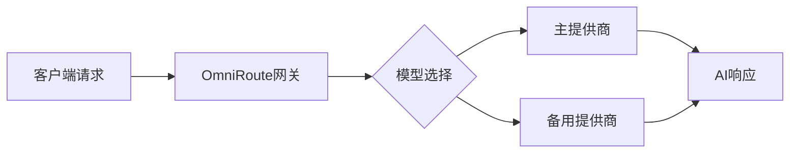

## 今日热点

今日GitHub热榜显示AI工具与平台持续繁荣，特别是AI网关和技能增强工具受到高度关注，同时隐私优先技术和开发效率工具也呈现上升趋势。

---

## 热门项目一览

| 排名 | 项目 | 语言 | 今日 | 总计 | 简介 |
|:---:|------|:----:|------:|-----:|------|
| 1 | [koala73/worldmonitor](https://github.com/koala73/worldmonitor) | TypeScript | +3,175 | 71,697 | Real-time global intelligen... |
| 2 | [block/buzz](https://github.com/block/buzz) | Rust | +2,162 | 7,028 | A hive mind communication p... |
| 3 | [diegosouzapw/OmniRoute](https://github.com/diegosouzapw/OmniRoute) | TypeScript | +1,929 | 27,279 | Never stop coding. Free MIT... |
| 4 | [ruvnet/RuView](https://github.com/ruvnet/RuView) | Rust | +1,708 | 85,242 | π RuView turns commodity Wi... |
| 5 | [ComposioHQ/awesome-claude-skills](https://github.com/ComposioHQ/awesome-claude-skills) | Python | +636 | 69,462 | A curated list of awesome C... |
| 6 | [Automattic/harper](https://github.com/Automattic/harper) | Rust | +624 | 12,354 | Offline, privacy-first gram... |
| 7 | [chrislgarry/Apollo-11](https://github.com/chrislgarry/Apollo-11) | Assembly | +592 | 71,126 | Original Apollo 11 Guidance... |
| 8 | [Pumpkin-MC/Pumpkin](https://github.com/Pumpkin-MC/Pumpkin) | Rust | +565 | 8,946 | Empowering everyone to host... |
| 9 | [likec4/likec4](https://github.com/likec4/likec4) | TypeScript | +472 | 4,710 | Visualize, collaborate, and... |
| 10 | [shiyu-coder/Kronos](https://github.com/shiyu-coder/Kronos) | Python | +401 | 33,088 | Kronos: A Foundation Model ... |
| 11 | [agegr/pi-web](https://github.com/agegr/pi-web) | TypeScript | +315 | 2,383 | Web UI for the pi coding agent |
| 12 | [citrolabs/ego-lite](https://github.com/citrolabs/ego-lite) | JavaScript | +247 | 1,700 | The best browser for both y... |

---

## 趋势洞察

```
┌─────────────────────────────────────────────────────────────────┐
│  AI/ML 工具         ████████████████████████  7 个项目        │
│  其他               ████████████████████      6 个项目        │
│  多媒体应用            ██████                    2 个项目        │
└─────────────────────────────────────────────────────────────────┘
```

---

## 项目深度解读

### 1. koala73/worldmonitor — 全球情报监测平台

> **一句话总结**：AI驱动的全球实时情报监测平台，整合新闻、地缘政治和基础设施数据。

#### 价值主张

| 维度 | 说明 |
|------|------|
| **解决痛点** | 解决全球信息分散、获取不及时、难以综合分析的问题 |
| **目标用户** | 情报分析师、政策制定者、企业战略团队、安全研究人员 |
| **核心亮点** | AI新闻聚合 + 实时全球监测 + 多源数据整合 + 可视化仪表板 |

#### 技术架构


**技术特色**：
- TypeScript全栈开发，确保代码质量和类型安全
- AI驱动的新闻聚合和分析技术
- 实时数据处理与可视化系统

#### 热度分析

- 项目获得71,697个Star，单日增长3,175，表明项目热度极高且持续快速增长
- Fork数为10,805，表明项目被广泛使用和二次开发，社区活跃度高

#### 快速上手

```bash
# 克隆项目
git clone https://github.com/koala73/worldmonitor.git

# 安装依赖
npm install

# 启动开发服务器
npm run dev
```

#### 注意事项

- 项目许可类型未知，使用前需确认开源许可条款
- 项目Open Issues为0，可能表明问题通过其他渠道处理或社区管理良好


### 2. block/buzz — 群体思维平台

> **一句话总结**：去中心化群体思维同步平台，实现多人实时共享想法与集体决策。

#### 价值主张

| 维度 | 说明 |
|------|------|
| **解决痛点** | 打破个体思维壁垒，实现群体智能实时协同与决策 |
| **目标用户** | 远程团队、研究小组、创意协作组织 |
| **核心亮点** | 去中心化架构 + 实时思维同步 + Rust高性能实现 |

#### 技术架构


**技术特色**：
- 基于Rust的内存安全保证
- 去中心化通信架构
- 区块链确保思维数据不可篡改

#### 热度分析

- 项目Star数激增，表明获得广泛关注，可能有重大更新或突破
- Fork数相对较少，显示项目核心功能稳定，社区更倾向于直接使用而非分叉

#### 快速上手

```bash
git clone https://github.com/block/buzz
cd buzz
cargo run --release
```

#### 注意事项

- 项目许可证未知，使用前需确认开源协议
- 项目Issues为0，可能采用其他反馈渠道或处于早期阶段


### 3. diegosouzapw/OmniRoute — AI统一网关

> **一句话总结**：一站式AI模型聚合网关，支持90+免费服务商，实现智能路由与token优化。

#### 价值主张

| 维度 | 说明 |
|------|------|
| **解决痛点** | 解决AI模型API碎片化问题，统一接口管理多厂商服务 |
| **目标用户** | 开发者、AI工具用户、需要集成多模型服务的应用 |
| **核心亮点** | 统一接口 + 自动回退机制 + token压缩 + 多平台支持 |

#### 技术架构



**技术特色**：
- RTK+Caveman压缩技术，显著减少token消耗
- 配额感知自动回退系统，确保服务连续性
- MCP/A2A协议支持，增强扩展性与互操作性

#### 热度分析

- 项目Star数突破2.7万且单日增长近2000，处于AI工具类项目热度第一梯队
- 500+贡献者参与，社区活跃度高，形成完整的AI工具链生态

#### 快速上手

```bash
# 克隆项目
git clone https://github.com/diegosouzapw/OmniRoute.git

# 安装依赖
npm install

# 启动服务
npm start
```

#### 注意事项

- 项目License信息不明确，商业使用前需确认授权条款
- 需要配置多个AI服务商的API密钥才能充分利用全部功能
- 建议先在小规模项目中测试，再逐步扩展到生产环境


### 4. ruvnet/RuView — WiFi感知技术

> **一句话总结**：利用普通WiFi信号实现无摄像头空间感知、生命体征监测和存在检测的创新技术。

#### 价值主张

| 维度 | 说明 |
|------|------|
| **解决痛点** | 解决隐私保护下的空间感知需求，无需摄像头即可监测 |
| **目标用户** | 智能家居、安防系统、健康监测应用开发者 |
| **核心亮点** | WiFi信号分析 + 非视觉感知 + 实时处理 + 隐私保护 |

#### 技术架构


**技术特色**：
- 通过WiFi信号变化分析人体活动和生命体征
- 利用商用WiFi设备实现专业级感知能力
- 实时处理算法提供即时空间智能反馈
- 无需专用硬件，降低部署门槛

#### 热度分析

- 项目Star数超8.5万，日均增长约1700，表明技术热度极高
- Fork数超1.1万，社区活跃度高，开发者参与度强
- 零Open Issues，暗示项目成熟度高或问题解决机制高效

#### 快速上手

```bash
# 克隆仓库
git clone https://github.com/ruvnet/RuView.git

# 构建项目
cd RuView && cargo build --release

# 运行示例
./target/release/ruview --interface wlan0
```

#### 注意事项

- 需要支持监听模式的WiFi网卡
- 环境因素和信号质量会影响检测精度
- 可能需要特定的硬件配置才能获得最佳效果
- 项目涉及信号处理知识，建议相关背景开发者深入使用


### 5. ComposioHQ/awesome-claude-skills — Claude技能精选

> **一句话总结**：精选Claude AI技能、资源与工具集合，助力用户定制化Claude工作流程

#### 价值主张

| 维度 | 说明 |
|------|------|
| **解决痛点** | 提供Claude AI的定制化技能与工具，扩展AI能力边界 |
| **目标用户** | AI开发者、研究人员、Claude AI使用者、工作流自动化爱好者 |
| **核心亮点** | 精选高质量资源 + 多领域应用覆盖 + 社区持续更新 + 结构化组织 |

#### 技术架构


**技术特色**：
- 结构化资源组织方式便于查找
- 社区驱动的资源筛选机制保证质量
- 精选高质量AI技能资源覆盖多领域

#### 热度分析

- 项目获得近7万星，单日增长600+，表明Claude AI工具需求旺盛，社区活跃度高
- 作为资源集合项目，高星反映用户对Claude AI技能扩展的强烈需求

#### 快速上手

```bash
# 克隆项目获取完整资源列表
git clone https://github.com/ComposioHQ/awesome-claude-skills.git

# 查看README获取技能分类
cat awesome-claude-skills/README.md
```

#### 注意事项

- 资源质量可能参差不齐，需要自行验证
- 部分技能可能需要API访问权限
- 项目持续更新，建议关注最新变化


### 6. Automattic/harper — 隐私语法检查器

> **一句话总结**：基于Rust构建的离线、注重隐私的快速语法检查工具，无需联网即可使用。

#### 价值主张

| 维度 | 说明 |
|------|------|
| **解决痛点** | 解决在线语法检查工具的隐私泄露问题，提供完全本地化的语法检查方案 |
| **目标用户** | 注重隐私的写作者、编辑、学生和内容创作者 |
| **核心亮点** | 离线工作 + 隐私保护 + Rust高性能 + 开源免费 + 跨平台支持 |

#### 技术架构


**技术特色**：
- 基于Rust构建，提供高性能的语法检查能力
- 完全本地处理，确保用户隐私安全
- 支持多种语言和复杂的语法规则分析

#### 热度分析

- 项目Star数快速增长，单日新增624，表明受关注度持续上升
- Issues数量为0，反映项目成熟度较高或问题解决机制高效

#### 快速上手

```bash
# 安装Harper
cargo install harper

# 检查语法
harper check your_document.txt

# 实时模式
harper watch
```

#### 注意事项

- 项目许可证信息未知，商业使用前需确认授权条款
- 语法检查准确性可能不如专业商业工具，建议结合人工校对
- 可能需要定期更新以获得最新的语法规则和改进


### 7. chrislgarry/Apollo-11 — 历史代码遗产

> **一句话总结**：阿波罗11号导航计算机原始汇编代码，重现人类登月的技术奇迹。

#### 价值主张

| 维度 | 说明 |
|------|------|
| **解决痛点** | 保存人类太空探索关键技术遗产，防止历史性成就被遗忘 |
| **目标用户** | 航天历史研究者、复古计算爱好者、计算机架构学者 |
| **核心亮点** | 历史代码重现 + 汇编语言教学价值 + 太空技术遗产保存 + 人类登月关键组件 |

#### 技术架构


**技术特色**：
- 使用独特汇编语言编写，体现早期计算机编程特点
- 采用"核心绳"存储技术，是早期计算机存储技术的代表
- 实时操作系统设计，支持关键任务计算
- 极简指令集架构，体现资源受限环境下的高效设计

#### 热度分析

- 项目获得超7万星，每日新增近600星，表明历史代码项目具有极高吸引力
- 0个开放问题，说明项目维护状态良好，代码已完整归档

#### 快速上手

```bash
# 使用AGC模拟器运行阿波罗11号导航计算机代码
git clone https://github.com/chrislgarry/Apollo-11.git
cd Apollo-11
make agc_sim  # 构建并运行模拟器
```

#### 注意事项

- 代码使用的是20世纪60年代的汇编语言，与现代编程语言差异巨大
- 需要专门的模拟器环境才能运行，普通计算机无法直接执行
- 代码中的注释可能有限，阅读需要一定背景知识
- 这是历史文物级代码，不应直接用于现代系统开发


### 8. Pumpkin-MC/Pumpkin — 高性能MC服务器

> **一句话总结**：Rust编写的高性能Minecraft服务器实现，提供高效低耗的游戏托管体验

#### 价值主张

| 维度 | 说明 |
|------|------|
| **解决痛点** | 传统Java服务器资源消耗高、性能受限，Rust实现提供显著性能提升 |
| **目标用户** | 追求高性能服务器体验的个人主机提供商和大型服务器管理员 |
| **核心亮点** | 高性能网络处理 + 低内存占用 + 高并发能力 + 跨平台支持 + 模块化架构 |

#### 技术架构


**技术特色**：
- 基于Rust的零成本抽象和内存安全保证
- 异步I/O模型实现高并发处理能力
- 模块化设计便于功能扩展和维护

#### 热度分析

- 项目近9000星且持续快速增长，社区认可度高，今日新增565星表明关注度持续上升
- 零开放问题反映项目成熟度较高，维护良好，可能是稳定可用的生产级实现

#### 快速上手

```bash
# 克隆仓库
git clone https://github.com/Pumpkin-MC/Pumpkin.git
# 构建项目
cargo build --release
# 运行服务器
./target/release/pumpkin
```

#### 注意事项
- 项目可能仍处于开发阶段，某些功能可能尚未完全实现
- 与原版Minecraft的兼容性需要进一步验证
- Rust的学习曲线可能对传统Java服务器管理员构成挑战


### 9. likec4/likec4 — 架构可视化工具

> **一句话总结**：从代码自动生成实时架构图，促进团队协作与架构演进。

#### 价值主张

| 维度 | 说明 |
|------|------|
| **解决痛点** | 解决架构图与代码脱节、手动维护困难的问题 |
| **目标用户** | 软件架构师、开发团队、技术文档编写者 |
| **核心亮点** | + 代码自动生成架构图 + 实时同步更新 + 团队协作编辑 + 轻量级集成 + 多种图表类型 |

#### 技术架构


**技术特色**：
- 基于TypeScript构建，提供类型安全和开发体验
- 采用C4模型进行架构可视化，层次清晰
- 支持自定义样式和布局，满足不同场景需求

#### 热度分析

- 项目Star数增长迅速，单日新增472星，关注度极高
- Fork数相对较少，表明项目处于早期阶段，用户更多在关注而非二次开发

#### 快速上手

```bash
# 安装
npm install -g likec4

# 初始化项目
likec4 init my-project

# 生成架构图
likec4 generate
```

#### 注意事项

- 项目需要在代码中添加特定注释或标记才能正确解析
- 对于大型项目，可能需要配置优化处理性能
- 图表自定义需要学习特定的标记语法，存在学习曲线


### 10. shiyu-coder/Kronos — [金融大模型]

> **一句话总结**：Kronos是面向金融市场的基础模型，提供专业金融语言理解和市场分析能力。

#### 价值主张

| 维度 | 说明 |
|------|------|
| **解决痛点** | 金融领域专业知识整合与市场趋势智能分析 |
| **目标用户** | 金融分析师、量化交易员、投资机构研究人员 |
| **核心亮点** | 金融专业术语理解 + 市场预测能力 + 数据分析 |

#### 技术架构


**技术特色**：
- 专为金融市场语言优化的基础模型架构
- 结合金融专业知识与大规模语言模型能力
- 支持多种金融分析和预测任务

#### 热度分析

- 项目获得33,088颗星，日增401颗，增长势头强劲
- 在金融AI领域处于领先地位，社区活跃度高

#### 快速上手

```bash
# 安装Kronos
pip install kronos

# 基本使用示例
from kronos import KronosModel
model = KronosModel()
result = model.analyze_market("近期股市走势分析")
```

#### 注意事项

- 需要金融领域专业知识才能有效利用模型能力
- 模型预测结果仅供参考，实际投资决策需谨慎
- 完整功能可能需要较高计算资源支持


### 11. agegr/pi-web — AI 编程助手界面

> **一句话总结**：为 pi 编程代理提供的现代化 Web 界面，提升代码生成与交互体验。

#### 价值主张

| 维度 | 说明 |
|------|------|
| **解决痛点** | 解决编程代理 pi 缺乏友好用户界面的问题，提升可用性 |
| **目标用户** | 软件开发者、编程学习者和需要代码辅助生成的技术用户 |
| **核心亮点** | 基于 TypeScript 开发 + 提供直观的代码生成界面 + 可能支持实时协作 |

#### 技术架构

**技术特色**：
- 基于 TypeScript 开发，保证代码质量和类型安全
- 提供直观的 Web 界面，增强 pi 编程代理的可用性
- 可能采用响应式设计，支持多设备访问

#### 热度分析

- 项目获得 2,383 个 Star 且单日增长 315，显示高关注度与快速增长趋势
- 0 个 Open Issues 表明项目维护良好，社区活跃度高

#### 快速上手

```bash
git clone https://github.com/agegr/pi-web.git
cd pi-web
npm install && npm run dev
```

#### 注意事项

- 项目许可证未知，使用前需确认授权条款
- 项目可能依赖后端服务 pi coding agent，需要确保相关环境配置


### 12. citrolabs/ego-lite — AI协作浏览器

> **一句话总结**：专为人类与AI代理并行工作设计的智能浏览器，提升协作效率。

#### 价值主张

| 维度 | 说明 |
|------|------|
| **解决痛点** | 传统浏览器无法有效支持AI代理与人类的并行协作工作流 |
| **目标用户** | 需要与AI工具协作的开发者、研究人员和知识工作者 |
| **核心亮点** | 多窗口并行 + AI代理集成 + 智能任务管理 + 上下文共享 |

#### 技术架构


**技术特色**：
- 基于JavaScript构建的轻量级浏览器架构
- AI代理与人类用户的无缝协作机制
- 高效的上下文共享和任务管理系统

#### 热度分析

- 项目近期Star增长迅速，单日增长247，显示市场对此类AI协作工具有强烈需求
- 虽然Fork数量相对较少，但可能表明项目处于早期阶段，社区贡献尚未充分形成

#### 快速上手

```bash
# 克隆项目
git clone https://github.com/citrolabs/ego-lite.git

# 安装依赖
cd ego-lite
npm install

# 启动应用
npm start
```

#### 注意事项

- 项目许可证未知，可能存在使用限制
- 作为浏览器工具，需要考虑数据隐私和安全问题
- 项目处于早期阶段，API和功能可能不稳定


### 13. earthtojake/text-to-cad — AI辅助设计工具

> **一句话总结**：利用AI技术将自然语言描述转化为CAD模型和设计方案的智能工具集

#### 价值主张

| 维度 | 说明 |
|------|------|
| **解决痛点** | 降低CAD设计门槛，使非专业人员也能快速创建专业设计 |
| **目标用户** | CAD设计师、机器人工程师、硬件开发人员、产品设计师 |
| **核心亮点** | 自然语言转CAD + 多种设计工具集成 + 机器人设计支持 + 硬件设计优化 + 易扩展agent系统 |

#### 技术架构


**技术特色**：
- 基于JavaScript的跨平台解决方案，支持多环境部署
- 模块化agent技能系统，支持功能扩展和定制
- 集成多种CAD格式转换，兼容主流设计工具

#### 热度分析

- 项目突破1万星，每日增长约230星，显示在AI辅助设计领域强劲吸引力
- 作为CAD与AI交叉项目，填补了自然语言到设计转换的市场空白

#### 快速上手

```bash
# 克隆项目
git clone https://github.com/earthtojake/text-to-cad.git

# 安装依赖
npm install

# 运行示例
npm run example
```

#### 注意事项

- 项目许可证未知，商业使用前需确认版权条款
- 作为AI生成工具，设计精度可能有限，需人工审核和优化
- 项目文档不够完善，可能需要研究源码了解详细用法


### 14. alibaba/open-code-review — 智能代码审查

> **一句话总结**：阿里开源的混合架构代码审查工具，结合确定性流程与LLM Agent，提供精准行级评论和内置安全规则集。

#### 价值主张

| 维度 | 说明 |
|------|------|
| **解决痛点** | 传统代码审查效率低、质量参差不齐，难以规模化覆盖安全风险 |
| **目标用户** | 企业开发团队、开源项目维护者、DevOps工程师 |
| **核心亮点** | 混合架构设计 + 确定性流程 + LLM智能分析 + 内置安全规则集 + 精准行级评论 |

#### 技术架构


**技术特色**：
- 混合架构结合确定性流程与LLM Agent，提高审查准确性和效率
- 内置针对NPE、线程安全、XSS和SQL注入等问题的微调规则集
- 兼容OpenAI和Anthropic API，支持多种LLM模型
- 精确到行级的代码评论，提供具体改进建议

#### 热度分析

- 项目获得11,595个Star，近期每日增长约180，显示出极高的社区关注度和认可度
- 作为阿里开源的企业级代码审查工具，在DevOps和代码质量保障领域具有重要生态价值

#### 快速上手

```bash
# 安装工具
go install github.com/alibaba/open-code-review/cmd/cr

# 基本使用
cr review --path ./src --model gpt-4
```

#### 注意事项

- 项目License未知，商业使用前需确认授权条款
- 作为混合架构工具，可能需要配置LLM API密钥才能发挥全部功能
- 内置规则集可能需要根据团队实际编程语言和框架进行调整优化


### 15. jellyfin/jellyfin — 开源媒体服务器

> **一句话总结**：免费开源的媒体系统，提供媒体服务器、流媒体服务和完整的媒体管理解决方案。

#### 价值主张

| 维度 | 说明 |
|------|------|
| **解决痛点** | 解决个人媒体集中管理、跨设备播放和流媒体服务问题 |
| **目标用户** | 媒体收藏爱好者、家庭用户、小型组织 |
| **核心亮点** | + 免费开源 + 跨平台支持 + 丰富的客户端应用 + 强大的媒体管理功能 |

#### 技术架构


**技术特色**：
- 基于 .NET Core 构建跨平台媒体服务
- 支持多种媒体格式和协议，包括 HLS, DASH
- 提供 RESTful API 供第三方客户端集成

#### 热度分析

- 项目 Star 数超过 54,000，日增长约 66，表明项目处于活跃发展阶段
- 作为 Plex 和 Emby 的开源替代品，在开源媒体服务器领域占据重要地位

#### 快速上手

```bash
# 克隆仓库
git clone https://github.com/jellyfin/jellyfin.git

# 构建项目
cd jellyfin
dotnet build
```

#### 注意事项

- 需要一定的技术基础来部署和配置
- 某些高级功能可能需要额外的硬件支持以获得最佳性能
- 社区文档相对完善，但部分高级配置可能需要参考源码


## 今日推荐

| 主题 | 推荐项目 | 亮点 |
|------|----------|------|
| 今日最热 | [koala73/worldmonitor](https://github.com/koala73/worldmonitor) | Real-time global ... |
| 值得关注 | [block/buzz](https://github.com/block/buzz) | A hive mind commu... |
| 快速上手 | [diegosouzapw/OmniRoute](https://github.com/diegosouzapw/OmniRoute) | Never stop coding... |
| 长期潜力 | [ruvnet/RuView](https://github.com/ruvnet/RuView) | π RuView turns co... |

---

<div align="center">

*Generated on 2026-07-24 | Powered by GitHub Trending Reporter*

</div>