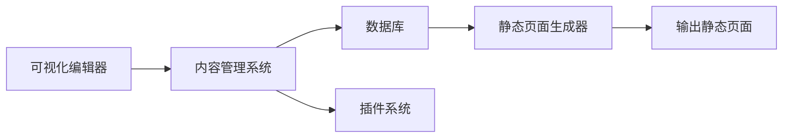
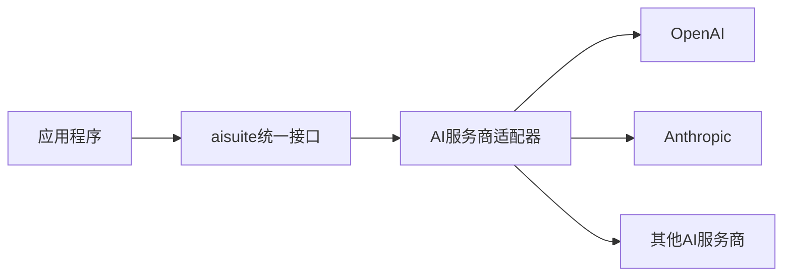

## 今日热点

今日GitHub热榜核心趋势为AI工具与代理框架的爆发式增长，Claude生态和"技能"相关框架引领潮流，反映AI辅助编程正在重塑开发方式。

---

## 热门项目一览

| 排名 | 项目 | 语言 | 今日 | 总计 | 简介 |
|:---:|------|:----:|------:|-----:|------|
| 1 | [block/buzz](https://github.com/block/buzz) | Rust | +2,491 | 11,984 | A hive mind communication p... |
| 2 | [mattpocock/skills](https://github.com/mattpocock/skills) | Shell | +1,740 | 188,306 | Skills for Real Engineers. ... |
| 3 | [permissionlesstech/bitchat](https://github.com/permissionlesstech/bitchat) | Swift | +1,720 | 28,746 | bluetooth mesh chat, IRC vibes |
| 4 | [citrolabs/ego-lite](https://github.com/citrolabs/ego-lite) | JavaScript | +986 | 3,619 | The fastest browser for AI ... |
| 5 | [ComposioHQ/awesome-claude-skills](https://github.com/ComposioHQ/awesome-claude-skills) | Python | +577 | 70,600 | A curated list of awesome C... |
| 6 | [Automattic/harper](https://github.com/Automattic/harper) | Rust | +503 | 13,432 | Offline, privacy-first gram... |
| 7 | [obra/superpowers](https://github.com/obra/superpowers) | Shell | +479 | 261,118 | An agentic skills framework... |
| 8 | [alibaba/open-code-review](https://github.com/alibaba/open-code-review) | Go | +431 | 12,995 | Open-source & free — Battle... |
| 9 | [CoreBunch/Instatic](https://github.com/CoreBunch/Instatic) | TypeScript | +426 | 5,106 | The open-source alternative... |
| 10 | [palmier-io/palmier-pro](https://github.com/palmier-io/palmier-pro) | Swift | +412 | 12,230 | macOS video editor built fo... |
| 11 | [Lordog/dive-into-llms](https://github.com/Lordog/dive-into-llms) | Jupyter Notebook | +408 | 45,366 | 《动手学大模型Dive into LLMs》系列编程实践教程 |
| 12 | [affaan-m/ECC](https://github.com/affaan-m/ECC) | JavaScript | +377 | 233,325 | The agent harness performan... |

---

## 趋势洞察

```
┌─────────────────────────────────────────────────────────────────┐
│  AI/ML 工具         ████████████████████████  13 个项目        │
│  其他               █████████                 5 个项目        │
└─────────────────────────────────────────────────────────────────┘
```

---

## 项目深度解读

### 1. block/buzz — 分布式通信平台

> **一句话总结**：基于Rust的去中心化蜂群思维通信平台，实现群体智能实时协作。

#### 价值主张

| 维度 | 说明 |
|------|------|
| **解决痛点** | 解决传统中心化通信平台的单点故障和隐私泄露问题 |
| **目标用户** | 注重隐私和安全的技术团队和分布式组织 |
| **核心亮点** | 去中心化架构 + 端到端加密 + 高性能通信 + 蜂群思维算法 |

#### 技术架构


**技术特色**：
- 基于Rust的高性能并发通信实现
- 去中心化网络架构，避免单点故障
- 蜂群思维算法实现群体智能决策

#### 热度分析

- 项目在短期内获得大量关注，今日新增Star数超过2400，呈现爆发式增长趋势
- 作为新兴通信平台，可能正处在技术突破或社区推广的关键期

#### 快速上手

```bash
# 克隆仓库
git clone https://github.com/block/buzz.git
# 构建项目
cd buzz && cargo build --release
# 启动服务
./target/release/buzz-server
```

#### 注意事项

- 项目许可证未知，商业使用前需确认授权条款
- 作为新兴项目，API和功能可能仍在快速迭代中


### 2. mattpocock/skills — 实用Shell脚本集

> **一句话总结**：提供工程师日常工作中实用的Shell脚本工具集，提升命令行工作效率。

#### 价值主张

| 维度 | 说明 |
|------|------|
| **解决痛点** | 提供高效Shell脚本解决常见工程任务，减少重复劳动 |
| **目标用户** | 开发者、系统管理员、DevOps工程师 |
| **核心亮点** | 实用性强 + 即插即用 + 高效解决常见问题 + 精简设计 |

#### 技术架构


**技术特色**：
- 纯Shell实现，兼容性强
- 模块化设计，便于扩展
- 脚本精简，专注于单一功能

#### 热度分析

- 超高关注度和活跃度，近期快速增长，表明工程社区对实用工具的强烈需求
- 零开放问题，反映项目维护良好，用户反馈问题得到及时解决

#### 快速上手

```bash
# 克隆仓库
git clone https://github.com/mattpocock/skills.git
# 进入目录
cd skills
# 查看可用脚本
ls -la
# 运行需要的脚本
./script-name.sh
```

#### 注意事项
- 需要基本Shell环境支持
- 使用前建议查看脚本注释了解具体功能
- 部分脚本可能需要特定系统环境支持


### 3. permissionlesstech/bitchat — [蓝牙Mesh聊天]

> **一句话总结**：基于蓝牙Mesh网络的去中心化聊天应用，无需服务器即可实现多人通信。

#### 价值主张

| 维度 | 说明 |
|------|------|
| **解决痛点** | 解决无网络环境下的设备间即时通信问题 |
| **目标用户** | 需要离线通信能力的开发者和极客群体 |
| **核心亮点** | 蓝牙Mesh技术 + 去中心化架构 + IRC风格界面 + 无需服务器 + 隐私保护 |

#### 技术架构


**技术特色**：
- 利用蓝牙Mesh技术实现设备间直接通信
- 去中心化架构，无需中央服务器
- 采用Swift开发，充分利用iOS系统底层能力
- 模拟IRC界面设计，提供经典聊天体验

#### 热度分析

- 项目获得28,746个星标，单日增长1,720，表明近期热度迅速上升
- 零开放问题显示项目维护状态良好，社区参与度高

#### 快速上手

```bash
# 克隆项目
git clone https://github.com/permissionlesstech/bitchat.git

# 运行项目
cd bitchat
open Bitchat.xcworkspace
```

#### 注意事项

- 项目需要iOS设备运行，仅支持Apple生态系统
- 蓝牙Mesh通信距离有限，适合近距离设备通信
- 由于去中心化设计，消息可能无法保证即时送达所有设备


### 4. citrolabs/ego-lite — AI浏览器代理

> **一句话总结**：专为AI代理设计的极速浏览器，可无缝共享已登录状态而不干扰用户操作。

#### 价值主张

| 维度 | 说明 |
|------|------|
| **解决痛点** | 解决AI代理无法直接使用用户已登录浏览器状态的问题 |
| **目标用户** | 使用AI代理进行网页自动化的开发者 |
| **核心亮点** | 极速浏览器 + 无缝状态共享 + 零配置 + 不干扰用户 + 零成本 |

#### 技术架构


**技术特色**：
- 浏览器状态共享技术，保持登录状态
- 轻量级架构，确保极速性能
- 零配置设计，降低使用门槛

#### 热度分析

- Star数达3619且近期增长迅速(+986 today)，表明项目受到广泛关注和认可
- Fork数相对较少(176)，说明项目可能处于早期阶段，用户更倾向于直接使用而非二次开发

#### 快速上手

```bash
npm install -g ego-lite
ego-lite
```

#### 注意事项

- 项目许可证未知，可能存在使用限制
- 作为早期项目，可能存在稳定性问题
- 依赖特定的AI代理服务(如Codex或Claude Code)，可能需要相关API访问权限


### 5. ComposioHQ/awesome-claude-skills — Claude技能集合

> **一句话总结**：精选Claude AI技能与工具列表，助力用户定制高效AI工作流。

#### 价值主张

| 维度 | 说明 |
|------|------|
| **解决痛点** | 解决Claude AI能力扩展和定制化需求 |
| **目标用户** | AI开发者、Claude用户、工作流自动化爱好者 |
| **核心亮点** | 精选资源 + 实用工具 + 代码示例 + 社区贡献 + 持续更新 |

#### 技术架构


**技术特色**：
- 基于Python的资源管理系统
- 结构化组织Claude相关工具和技能
- 社区驱动的持续更新机制

#### 热度分析

- 项目Star数高达7万+，日增577+，显示Claude生态热度极高
- 作为Claude生态资源枢纽，具有极高的社区影响力和参考价值

#### 快速上手

```bash
# 克隆项目
git clone https://github.com/ComposioHQ/awesome-claude-skills.git

# 浏览目录结构
cd awesome-claude-skills
ls -la
```

#### 注意事项

- 项目依赖社区贡献，内容质量可能参差不齐
- 部分工具可能需要API密钥或额外配置
- Claude API可能发生变化，需关注项目更新


### 6. Automattic/harper — 离线语法检查器

> **一句话总结**：基于Rust开发的快速离线语法检查工具，注重用户隐私保护，开源且无需联网。

#### 价值主张

| 维度 | 说明 |
|------|------|
| **解决痛点** | 解决了传统语法检查工具需要联网、可能收集用户数据的问题 |
| **目标用户** | 注重隐私的写作者、开发者和内容创作者 |
| **核心亮点** | 离线运行 + 隐私保护 + Rust高性能 + 开源免费 + 语法准确性 |

#### 技术架构


**技术特色**：
- 基于Rust开发，提供高性能的语法检查体验
- 完全离线运行，无需联网，保护用户隐私
- 开源可定制，可根据需求扩展语法规则

#### 热度分析

- 项目Star数达13,432，近期增长迅速(+503 today)，表明社区对其离线隐私语法检查功能高度认可
- Open Issues为0，表明项目维护良好，用户反馈得到及时处理，社区活跃度高

#### 快速上手

```bash
# 安装Harper
cargo install harper

# 使用Harper检查文件语法
harper check document.txt

# 交互式语法检查
harper
```

#### 注意事项

- 项目完全离线运行，因此更新可能需要手动获取最新版本
- 由于是开源项目，用户可以根据需要自定义语法规则，但需要一定的Rust编程知识
- 隐私保护是项目的核心特点，用户数据不会上传到任何服务器


### 7. obra/superpowers — 高效开发框架

> **一句话总结**：提供代理技能框架与实用方法论，帮助开发者系统性提升软件工程能力。

#### 价值主张

| 维度 | 说明 |
|------|------|
| **解决痛点** | 解决软件开发效率低下和技能碎片化问题 |
| **目标用户** | 专业软件开发者和技术团队 |
| **核心亮点** | 实用方法论 + 技能框架 + 工作流优化 |

#### 技术架构


**技术特色**：
- Shell脚本实现，跨平台兼容性强
- 模块化设计，易于扩展和定制
- 实用工具集成，减少开发摩擦

#### 热度分析

- 项目获得26万+星，近479日新增，增长势头强劲
- 23k+ Fork数，表明社区参与度高，方法论被广泛实践

#### 快速上手

```bash
# 克隆项目
git clone https://github.com/obra/superpowers.git
# 进入项目目录
cd superpowers
# 执行安装脚本
./install.sh
```

#### 注意事项

- 项目采用Shell脚本，需要在Linux/macOS环境运行，Windows需通过WSL使用
- 方法论需要一定时间学习和实践，建议从小项目开始应用


### 8. alibaba/open-code-review — 智能审查工具

> **一句话总结**：阿里开源的混合架构代码审查工具，结合确定性流水线与LLM代理，提供精准行级评论和内置安全规则检查。

#### 价值主张

| 维度 | 说明 |
|------|------|
| **解决痛点** | 传统代码审查效率低、漏检多、反馈不够精准的问题 |
| **目标用户** | 软件开发团队、代码审查者、DevOps工程师 |
| **核心亮点** | 确定性流水线+LLM Agent混合架构 + 精确行级评论 + 内置精调规则集 |

#### 技术架构


**技术特色**：
- 混合架构结合确定性流程与AI智能分析
- 内置阿里巴巴大规模使用验证的精调规则集
- 支持多种AI模型提供商(OpenAI, Anthropic)

#### 热度分析

- 近1.3万星数，单日增长431，表明项目热度高且增长迅速
- 作为阿里开源的企业级工具，在企业级代码审查领域具有显著影响力

#### 快速上手

```bash
# 安装工具
go install github.com/alibaba/open-code-review/cmd/ocr

# 初始化配置
ocr init

# 运行代码审查
ocr review --path ./src
```

#### 注意事项

- 需要配置AI服务提供商的API密钥
- 可能需要一定的Go环境配置
- 内置规则可能需要根据项目需求进行调整


### 9. CoreBunch/Instatic — 开源可视化CMS

> **一句话总结**：开源自托管可视化CMS，提供用户、角色、插件和内容管理，输出干净静态页面。

#### 价值主张

| 维度 | 说明 |
|------|------|
| **解决痛点** | 提供开源替代方案，摆脱商业CMS依赖和限制 |
| **目标用户** | 寻求自托管开源解决方案的开发者和内容创作者 |
| **核心亮点** | 可视化编辑 + 自托管部署 + 静态页面输出 + 用户角色管理 + 插件扩展 |

#### 技术架构



**技术特色**：
- 基于TypeScript开发，提供类型安全
- 自托管部署，数据完全控制
- 输出静态页面，性能优异
- 插件系统，功能可扩展
- 用户角色管理，安全性高

#### 热度分析

- 项目有5,106个Star，其中426个是今天新增的，显示近期有显著增长，可能是由于项目刚发布或获得重要更新
- Open Issues为0，表明项目可能处于早期阶段或问题管理高效，作为Webflow、Framer和WordPress的开源替代品，填补了市场空白

#### 快速上手

```bash
# 克隆仓库
git clone https://github.com/CoreBunch/Instatic.git
# 安装依赖
npm install
# 启动开发服务器
npm run dev
```

#### 注意事项

- 由于项目Open Issues为0，可能表示项目仍在早期阶段，API和功能可能不稳定
- 作为开源替代品，可能在功能丰富度和生态系统方面与商业产品(如Webflow、Framer)存在差距


### 10. palmier-io/palmier-pro — AI视频编辑器

> **一句话总结**：专为macOS打造的AI视频编辑器，提供智能化的视频处理与创作体验。

#### 价值主张

| 维度 | 说明 |
|------|------|
| **解决痛点** | 传统视频编辑工具操作复杂，AI辅助不足，创作效率低下 |
| **目标用户** | macOS视频创作者、内容制作者、AI技术应用爱好者 |
| **核心亮点** | AI智能剪辑 + 自动化特效 + 智能内容识别 + 高性能渲染 |

#### 技术架构


**技术特色**：
- 基于Swift的原生macOS应用，性能优异
- 集成AI技术进行视频内容智能识别与处理
- 高效的视频处理引擎，支持4K/8K视频编辑

#### 热度分析

- 项目获得12,230个Star，日增412个，表明社区关注度高，增长迅速
- 作为AI+视频编辑领域的创新项目，在macOS生态中具有独特定位

#### 快速上手

```bash
# 克隆项目
git clone https://github.com/palmier-io/palmier-pro.git

# 安装依赖
cd palmier-pro && brew install swiftlint

# 构建项目
swift build
```

#### 注意事项

- 项目目前License未知，使用前需确认授权条款
- 作为AI驱动的视频编辑器，可能需要较好的硬件配置以获得最佳性能
- 项目Open Issues为0，可能表示项目处于早期阶段，社区支持可能有限


### 11. Lordog/dive-into-llms — 大模型教程

> **一句话总结**：系统性大模型学习教程，通过Jupyter Notebook提供可实践的LLM编程指南。

#### 价值主张

| 维度 | 说明 |
|------|------|
| **解决痛点** | 提供系统性、可实践的大模型学习路径，解决理论难落地问题 |
| **目标用户** | AI研究人员、工程师及对大模型感兴趣的学习者 |
| **核心亮点** | 系统性教程 + 实践导向 + Jupyter Notebook形式 |

#### 技术架构


**技术特色**：
- 基于 Jupyter Notebook 的交互式学习体验
- 覆盖大模型全栈知识体系
- 提供可直接运行的代码示例

#### 热度分析

- 项目获得45,366颗星且近期增长迅速(+408/天)，表明大模型学习需求旺盛
- 高星高fork比例反映项目在AI教育领域的权威性和实用性

#### 快速上手

```bash
# 克隆项目
git clone https://github.com/Lordog/dive-into-llms.git

# 运行示例 notebook
cd dive-into-llms
jupyter notebook
```

#### 注意事项

- 项目依赖较多Python科学计算库，建议使用conda创建独立环境
- 部分章节可能需要GPU资源支持，建议使用Google Colab或本地GPU环境
- 由于大模型领域发展迅速，部分内容可能需要根据最新研究进展更新


### 12. affaan-m/ECC — AI编程性能优化

> **一句话总结**：提升AI编程助手性能的综合系统，优化技能、本能、记忆和安全特性。

#### 价值主张

| 维度 | 说明 |
|------|------|
| **解决痛点** | AI编程助手在性能、响应速度和代码质量方面的局限性 |
| **目标用户** | 使用AI编程工具的开发者和研究人员 |
| **核心亮点** | 性能优化 + 技能增强 + 记忆管理 + 安全保障 |

#### 技术架构


**技术特色**：
- 基于JavaScript实现的轻量级优化系统
- 集成多种AI编程工具的通用接口
- 注重安全性和代码质量的输出机制

#### 热度分析

- 项目拥有超23万Stars，近期增长迅速，表明在AI编程工具领域认可度高
- 零开放问题反映项目维护质量高，社区依赖性强

#### 快速上手

```bash
# 安装ECC
npm install ecc

# 初始化配置
ecc init

# 启动优化服务
ecc start
```

#### 注意事项

- 项目许可证未知，可能存在使用限制
- 需要配合特定的AI编程工具使用才能发挥最大效用


### 13. OtterMind/Chat2DB — AI数据库客户端

> **一句话总结**：基于人工智能的跨平台数据库管理工具，提供智能SQL辅助和多数据库连接支持。

#### 价值主张

| 维度 | 说明 |
|------|------|
| **解决痛点** | 解决传统数据库工具功能单一、学习成本高、缺乏智能辅助的问题 |
| **目标用户** | 数据库管理员、开发人员、数据分析师等需要频繁操作数据库的专业人士 |
| **核心亮点** | AI智能辅助 + 多数据库支持 + 直观的GUI界面 + SQL优化建议 + 数据可视化 |

#### 技术架构


**技术特色**：
- 基于Java开发，跨平台兼容性强
- 集成AI技术提供智能SQL辅助
- 支持多种主流数据库系统，统一接口

#### 热度分析
- 项目Star数达26,688且持续增长(+360 today)，表明社区认可度高且热度上升明显
- 作为新兴的AI数据库工具，在数据库管理领域已形成一定影响力，可能成为传统工具的有力竞争者

#### 快速上手

```bash
# 下载最新版本
wget https://github.com/OtterMind/Chat2DB/releases/latest/download/Chat2DB.zip

# 解压并运行
unzip Chat2DB.zip
cd Chat2DB
java -jar Chat2DB.jar
```

#### 注意事项
- 项目License信息未知，使用前需确认开源协议
- 作为较新的项目，某些高级功能的稳定性和成熟度可能需要进一步验证
- AI功能的准确性和可靠性需要实际使用评估，不应完全依赖自动生成的SQL语句


### 15. shiyu-coder/Kronos — 金融语言大模型

> **一句话总结**：专为金融市场语言设计的基础模型，深度理解金融文本与市场动态。

#### 价值主张

| 维度 | 说明 |
|------|------|
| **解决痛点** | 金融数据复杂多变，传统模型难以理解专业金融术语与市场动态 |
| **目标用户** | 金融分析师、量化交易员、投资机构、金融科技开发者 |
| **核心亮点** | 金融领域专业理解 + 金融知识推理 + 市场预测能力 + 多模态数据处理 |

#### 技术架构


**技术特色**：
- 基于Transformer架构的金融领域优化
- 金融专业知识和市场动态的持续学习机制
- 多模态金融数据处理能力

#### 热度分析

- 项目获星数持续快速增长，表明金融AI领域存在强烈需求
- 社区活跃度高，Fork数与Star数比例合理，具备良好二次开发潜力

#### 快速上手

```bash
# 克隆仓库
git clone https://github.com/shiyu-coder/Kronos.git

# 安装依赖
pip install -r requirements.txt

# 基本使用
from kronos import KronosModel
model = KronosModel.from_pretrained("kronos-financial")
response = model.generate("分析最近比特币市场的波动因素")
```

#### 注意事项

- 使用时需确保符合金融合规要求
- 模型输出应结合专业金融知识进行验证，不可完全依赖
- 注意保护敏感金融数据，遵循相关数据隐私法规


### 16. anthropics/claude-cookbooks — Claude使用示例集

> **一句话总结**：Anthropic官方提供的Claude AI实用示例集，通过Jupyter Notebook展示多种应用场景。

#### 价值主张

| 维度 | 说明 |
|------|------|
| **解决痛点** | 降低Claude API使用门槛，提供可直接运行的实践案例 |
| **目标用户** | AI开发者、研究人员和Claude API使用者 |
| **核心亮点** | 官方权威性 + 实用示例丰富 + 交互式学习体验 |

#### 技术架构


**技术特色**：
- 基于Jupyter Notebook的交互式学习环境
- 包含多种Claude API使用场景和最佳实践
- 官方维护确保示例的权威性和时效性

#### 热度分析

- 项目获得近5万星，每日新增约130星，显示社区高度关注和持续增长
- 作为Anthropic官方项目，在Claude AI生态中占据核心位置，是开发者学习和参考的重要资源

#### 快速上手

```bash
# 克隆项目仓库
git clone https://github.com/anthropics/claude-cookbooks.git

# 进入项目目录并查看可用示例
cd claude-cookbooks && ls notebooks
```

#### 注意事项

- 项目中的示例需要Claude API密钥才能运行
- 部分示例可能需要额外的Python依赖库，建议使用项目提供的requirements文件
- 随着Claude API更新，部分示例代码可能需要调整以保持兼容性


### 17. RyanCodrai/turbovec — 高性能向量索引

> **一句话总结**：基于Rust构建的高性能向量索引库，提供Python接口，专为大规模向量搜索优化。

#### 价值主张

| 维度 | 说明 |
|------|------|
| **解决痛点** | 传统向量索引在大规模数据下性能瓶颈明显，内存占用高 |
| **目标用户** | 需要高性能向量搜索的机器学习工程师和数据科学家 |
| **核心亮点** | Rust高性能核心 + Python易用接口 + TurboQuant优化 + 内存高效 + 低延迟查询 |

#### 技术架构


**技术特色**：
- 基于Rust实现，提供C级别性能，内存占用低
- 提供Python绑定，易于在Python生态中使用
- 基于TurboQuant优化，针对向量搜索场景专门优化

#### 热度分析

- 项目Star数超过14k且每日新增约86个，增长迅速，社区认可度高
- Fork数相对Star数比例适中(约8.8%)，表明项目更被关注而非二次开发

#### 快速上手

```bash
# 安装rust和turbovec
curl --proto '=https' --tlsv1.2 -sSf https://sh.rustup.rs | sh
pip install turbovec

# 基本使用示例
import turbovec
index = turbovec.Index(dim=128)
index.add(vectors)
results = index.query(query_vector, k=10)
```

#### 注意事项

- 项目依赖Rust环境，安装可能需要额外配置
- 作为高性能库，在资源受限环境中有内存使用考量
- 项目License未知，商业使用前需确认许可协议


### 18. andrewyng/aisuite — AI统一接口层

> **一句话总结**：为多个生成式AI提供商提供简单统一的Python接口，简化AI模型调用流程。

#### 价值主张

| 维度 | 说明 |
|------|------|
| **解决痛点** | 解决不同AI服务商API接口不统一，开发者需要重复编写适配代码的问题 |
| **目标用户** | 需要调用多个AI服务的开发者、研究人员和企业 |
| **核心亮点** | 统一接口设计 + 多服务商支持 + 简单易用 + 高度兼容性 |

#### 技术架构



**技术特色**：
- 采用适配器模式统一不同AI服务商的接口差异
- 提供一致的API调用体验，隐藏底层实现细节
- 支持热插拔式添加新的AI服务商支持

#### 热度分析

- 项目获得15,231个Star，近期增长迅速（今日+77），表明市场需求旺盛
- 作为AI工具链中的基础组件，具有高复用性和生态价值

#### 快速上手

```bash
# 安装
pip install aisuite

# 使用示例
import aisuite as ai

# 初始化客户端
client = ai.Client()

# 调用AI模型
response = client.chat.completions.create(
    model="gpt-4",
    messages=[{"role": "user", "content": "Hello, world!"}]
)
print(response.choices[0].message.content)
```

#### 注意事项

- 需要为不同AI服务商配置相应的API密钥
- 不同模型可能有特定的参数限制和特性，需要查阅文档
- 项目仍在积极开发中，API可能会有变动


## 今日推荐

| 主题 | 推荐项目 | 亮点 |
|------|----------|------|
| 今日最热 | [block/buzz](https://github.com/block/buzz) | A hive mind commu... |
| 值得关注 | [mattpocock/skills](https://github.com/mattpocock/skills) | Skills for Real E... |
| 快速上手 | [permissionlesstech/bitchat](https://github.com/permissionlesstech/bitchat) | bluetooth mesh ch... |
| 长期潜力 | [citrolabs/ego-lite](https://github.com/citrolabs/ego-lite) | The fastest brows... |

---

<div align="center">

*Generated on 2026-07-26 | Powered by GitHub Trending Reporter*

</div>