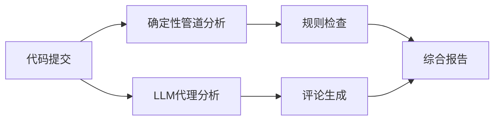
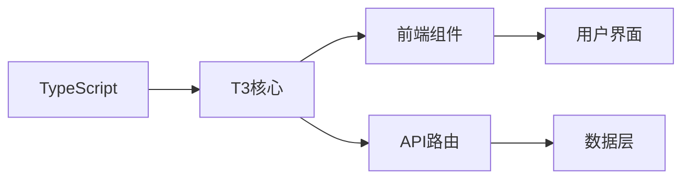
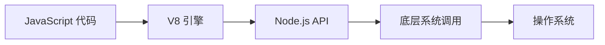

## 今日热点

今日GitHub热榜项目精彩纷呈。

---

## 热门项目一览

| 排名 | 项目 | 语言 | 今日 | 总计 | 简介 |
|:---:|------|:----:|------:|-----:|------|
| 1 | [block/buzz](https://github.com/block/buzz) | Rust | +1,710 | 13,363 | A hive mind communication p... |
| 2 | [permissionlesstech/bitchat](https://github.com/permissionlesstech/bitchat) | Swift | +1,166 | 30,446 | bluetooth mesh chat, IRC vibes |
| 3 | [citrolabs/ego-lite](https://github.com/citrolabs/ego-lite) | JavaScript | +900 | 4,627 | The fastest browser for AI ... |
| 4 | [CoreBunch/Instatic](https://github.com/CoreBunch/Instatic) | TypeScript | +888 | 5,703 | The open-source alternative... |
| 5 | [alibaba/open-code-review](https://github.com/alibaba/open-code-review) | Go | +832 | 13,892 | Open-source & free — Battle... |
| 6 | [pbakaus/impeccable](https://github.com/pbakaus/impeccable) | JavaScript | +413 | 50,722 | The design language that ma... |
| 7 | [OtterMind/Chat2DB](https://github.com/OtterMind/Chat2DB) | Java | +398 | 27,150 | 🔥🔥🔥 AI-driven database tool... |
| 8 | [anthropics/claude-cookbooks](https://github.com/anthropics/claude-cookbooks) | Jupyter Notebook | +379 | 50,246 | A collection of notebooks/r... |
| 9 | [Pumpkin-MC/Pumpkin](https://github.com/Pumpkin-MC/Pumpkin) | Rust | +338 | 10,025 | Empowering everyone to host... |
| 10 | [shiyu-coder/Kronos](https://github.com/shiyu-coder/Kronos) | Python | +321 | 34,188 | Kronos: A Foundation Model ... |
| 11 | [permissionlesstech/bitchat-android](https://github.com/permissionlesstech/bitchat-android) | Kotlin | +260 | 6,728 | bluetooth mesh chat, IRC vibes |
| 12 | [andrewyng/aisuite](https://github.com/andrewyng/aisuite) | Python | +187 | 15,412 | Simple, unified interface t... |

---

## 趋势洞察

```
┌─────────────────────────────────────────────────────────────────┐
│  AI/ML 工具         ████████████████████████  7 个项目        │
│  其他               ████████████████████████  7 个项目        │
│  开发工具             ██████                    2 个项目        │
│  智能家居             ███                       1 个项目        │
└─────────────────────────────────────────────────────────────────┘
```

---

## 项目深度解读

### 1. block/buzz — 蜂群思维通信

> **一句话总结**：基于Rust构建的去中心化蜂群思维通信平台，实现群体智能实时协作

#### 价值主张

| 维度 | 说明 |
|------|------|
| **解决痛点** | 打破传统通信局限，实现群体智能实时协作与决策 |
| **目标用户** | 分布式团队、开源社区、需要群体决策的组织 |
| **核心亮点** | 去中心化架构 + 高性能Rust实现 + 蜂群思维算法 + 实时协作 + 隐私保护 |

#### 技术架构


**技术特色**：
- 基于Rust的高性能并发通信框架
- 创新的蜂群思维算法实现群体智能
- 去中心化架构确保通信自由与隐私保护
- 高效的共识机制保证数据一致性

#### 热度分析
- 项目Star数快速增长，一日增加1700+，显示社区高度关注
- 高Star与低Fork比例表明项目处于早期但极具潜力阶段

#### 快速上手

```bash
git clone https://github.com/block/buzz.git
cd buzz
cargo run --release
```

#### 注意事项
- 项目License未知，使用前需确认授权条款
- 项目Issues为0，可能处于早期开发阶段，稳定性有待验证
- 需关注项目文档完善度和社区支持情况


### 2. permissionlesstech/bitchat — 蓝牙聊天应用

> **一句话总结**：基于蓝牙mesh网络的去中心化聊天应用，无需服务器即可实现多人通信

#### 价值主张

| 维度 | 说明 |
|------|------|
| **解决痛点** | 解决无网络环境下多人即时通信需求，保护隐私无需中央服务器 |
| **目标用户** | 注重隐私、离线通信需求的技术爱好者、应急通信场景用户 |
| **核心亮点** | 蓝牙mesh网络 + 去中心化架构 + IRC风格界面 + 离线可用 + 隐私保护 |

#### 技术架构


**技术特色**：
- 基于蓝牙mesh网络实现去中心化通信
- 采用Swift开发，兼容iOS生态系统
- 模拟IRC界面风格，提供熟悉的聊天体验

#### 热度分析

- 项目Star数超过3万，近期增长迅速，表明技术社区对去中心化通信工具的高度关注
- Fork数相对较低，说明项目可能更偏向于使用而非二次开发，符合工具类项目特性

#### 快速上手

```bash
# 克隆项目
git clone https://github.com/permissionlesstech/bitchat.git

# 进入项目目录
cd bitchat

# 使用Xcode打开项目（需要macOS环境）
open bitchat.xcodeproj
```

#### 注意事项

- 项目需要iOS设备支持，且需要蓝牙功能
- 由于是mesh网络，设备间距离和障碍物可能影响通信效果
- 项目许可证信息未知，商业使用前需确认授权条款
- 需要Xcode环境进行编译，仅支持苹果生态系统


### 3. citrolabs/ego-lite — AI浏览器自动化

> **一句话总结**：为AI代理提供快速、零配置的浏览器自动化能力，共享登录状态而不干扰用户。

#### 价值主张

| 维度 | 说明 |
|------|------|
| **解决痛点** | AI代理无法直接使用已登录浏览器状态，需重复登录或手动切换 |
| **目标用户** | AI开发者、自动化测试人员、需要网页自动化的AI应用开发者 |
| **核心亮点** | 快速浏览器共享 + 零配置 + 不干扰用户 + 零成本 + 与AI代理无缝集成 |

#### 技术架构


**技术特色**：
- 浏览器状态捕获与共享技术
- 轻量级JavaScript实现
- 与AI代理的无缝集成接口

#### 热度分析

- 项目单日增长900个Star，表明近期关注度极高，可能是AI自动化领域的热门解决方案
- 零Open Issues暗示项目可能已成熟稳定，或社区通过其他渠道支持

#### 快速上手

```bash
# 安装ego-lite
npm install ego-lite

# 初始化并连接到浏览器
ego-lite init

# 配置AI代理连接
ego-lite connect --agent claude-code
```

#### 注意事项

- 项目许可证未知，商业使用前需确认授权条款
- 可能需要特定浏览器环境支持
- 隐私安全考虑：共享浏览器状态可能涉及敏感信息
- 项目处于快速发展阶段，API可能不稳定


### 4. CoreBunch/Instatic — [可视化静态CMS]

> **一句话总结**：自托管视觉CMS，替代Webflow和WordPress，输出干净静态页面，提供完整内容管理功能。

#### 价值主张

| 维度 | 说明 |
|------|------|
| **解决痛点** | 提供开源、自托管的可视化内容管理方案，摆脱SaaS平台依赖 |
| **目标用户** | 需要可视化编辑但希望自托管静态网站的开发者和内容创作者 |
| **核心亮点** | 可视化编辑界面 + 静态页面输出 + 完整CMS功能 + 自托管部署 |

#### 技术架构


**技术特色**：
- 使用 TypeScript 开发，提供类型安全和良好的开发体验
- 自托管架构，用户拥有完全的数据控制权
- 输出静态页面，提高加载速度和SEO表现

#### 热度分析

- 项目近期增长迅猛，单日新增888 stars，表明社区关注度极高
- 相比521的fork数，star数较高，显示项目受到广泛认可而非只是技术人员的关注

#### 快速上手

```bash
# 克隆项目
git clone https://github.com/CoreBunch/Instatic.git

# 安装依赖
npm install

# 启动开发服务器
npm run dev
```

#### 注意事项

- 项目许可证未知，商业使用前需确认许可条款
- 作为新兴项目，生态系统和文档可能还不够完善
- 需要一定的技术背景才能进行自托管部署和维护


### 5. alibaba/open-code-review — 智能代码审查工具

> **一句话总结**：结合确定性管道与LLM代理的企业级代码审查工具，提供行级精确评论和内置安全规则。

#### 价值主张

| 维度 | 说明 |
|------|------|
| **解决痛点** | 提高大规模团队代码审查效率与一致性，降低人工审查成本 |
| **目标用户** | 需要高质量代码审查的大型企业开发团队 |
| **核心亮点** | 确定性管道+LLM代理混合架构 + 行级精确评论 + 内置安全规则集 |

#### 技术架构



**技术特色**：
- 结合规则引擎与AI代理的混合架构，兼顾准确性与智能性
- 针对NPE、线程安全等常见问题的精细调整规则集
- 支持OpenAI和Anthropic等多种AI模型，提供灵活集成选项

#### 热度分析

- 单日增长832个Star，显示企业级代码审查工具需求旺盛
- 阿里巴巴开源背书，通过大规模实战验证，在企业工具领域具有权威性

#### 快速上手

```bash
# 安装
go install github.com/alibaba/open-code-review/cmd/cr

# 基本使用
cr review --model=openai --branch=main
```

#### 注意事项

- 项目许可证信息不明确，商业使用前需确认授权条款
- 使用LLM代理功能需要配置相应的API密钥
- 可能需要根据团队特定规范调整内置规则集以获得最佳效果


### 6. pbakaus/impeccable — AI设计语言

> **一句话总结**：Impeccable是一个专为AI应用优化的设计语言，提供直观的设计系统提升AI交互体验。

#### 价值主张

| 维度 | 说明 |
|------|------|
| **解决痛点** | AI应用设计缺乏统一规范，导致用户体验不一致和开发效率低下 |
| **目标用户** | AI应用开发者、UI/UX设计师、产品经理 |
| **核心亮点** | 组件化设计系统 + AI交互优化 + 可视化配置 + 响应式设计 + 易于集成 |

#### 技术架构


**技术特色**：
- 基于JavaScript的轻量级设计系统
- 专为AI应用优化的组件库
- 模块化架构便于扩展和定制

#### 热度分析
- 项目获得5万+星标，近期增长迅速，表明社区对其高度认可
- 零开放问题反映项目维护良好，但可能意味着社区参与度有限

#### 快速上手

```bash
# 安装依赖
npm install impeccable

# 在项目中引入
import { Button, Card } from 'impeccable';

# 使用组件
<Button variant="primary">AI交互按钮</Button>
```

#### 注意事项
- 需要确认项目的具体许可证类型
- 可能需要了解项目的兼容性和依赖要求
- 建议查看官方文档以获取最新的使用指南


### 7. OtterMind/Chat2DB — AI数据库客户端

> **一句话总结**：AI驱动的多数据库SQL客户端，提供智能化的数据库操作和查询体验。

#### 价值主张

| 维度 | 说明 |
|------|------|
| **解决痛点** | 传统数据库工具操作复杂，缺乏智能化辅助，用户体验不佳 |
| **目标用户** | 数据库管理员、开发人员、数据分析师等需要频繁操作数据库的用户 |
| **核心亮点** | AI驱动 + 多数据库支持 + 智能SQL生成 + 可视化界面 + 数据管理 |

#### 技术架构


**技术特色**：
- 基于Java开发的跨平台数据库客户端
- 集成AI技术辅助SQL生成和优化
- 支持多种数据库的统一连接和管理

#### 热度分析

- 项目Star数超过27,000，且近期增长迅速(+398/天)，表明社区高度认可
- 作为开源数据库工具，在同类项目中具有明显的竞争优势，生态活跃

#### 快速上手

```bash
# 下载最新版本
wget https://github.com/OtterMind/Chat2DB/releases/download/v1.0.0/Chat2DB-1.0.0.zip

# 解压并运行
unzip Chat2DB-1.0.0.zip
cd Chat2DB
java -jar Chat2DB.jar
```

#### 注意事项

- 需要安装Java运行环境(JRE)
- 连接生产数据库时注意数据安全，避免敏感信息泄露
- AI功能可能需要联网才能正常使用


### 8. anthropics/claude-cookbooks — Claude使用示例库

> **一句话总结**：官方Jupyter笔记本集合，展示Claude AI多样化实用场景与最佳实践。

#### 价值主张

| 维度 | 说明 |
|------|------|
| **解决痛点** | 提供Claude使用指南，解决用户如何有效应用AI能力的困惑 |
| **目标用户** | AI开发者、研究人员及对Claude应用感兴趣的技术爱好者 |
| **核心亮点** | 多样化用例展示 + 完整可运行示例 + 官方最佳实践指导 |

#### 技术架构


**技术特色**：
- 使用Jupyter Notebook提供交互式学习体验
- 提供完整可运行的代码示例，降低学习门槛
- 涵盖多种Claude API使用场景，展示最佳实践

#### 热度分析

- 项目获得超过5万星，近期每日增长近400星，表明Claude生态快速扩张
- 作为Anthropic官方示例库，处于Claude应用生态的核心位置，社区活跃度高

#### 快速上手

```bash
git clone https://github.com/anthropics/claude-cookbooks.git
cd claude-cookbooks
jupyter notebook
```

#### 注意事项

- 需要Anthropic API密钥才能运行部分示例
- 某些示例可能需要特定的依赖库，请查看每个notebook的requirements
- 随着Claude API更新，部分示例可能需要调整以保持兼容性


### 9. Pumpkin-MC/Pumpkin — 高效MC服务器

> **一句话总结**：基于Rust开发的高性能Minecraft服务器实现，提供卓越的运行效率与资源利用率。

#### 价值主张

| 维度 | 说明 |
|------|------|
| **解决痛点** | 传统Java版Minecraft服务器资源消耗高、性能瓶颈明显 |
| **目标用户** | 服务器主机提供商、大型社区管理员、追求高性能的个人玩家 |
| **核心亮点** | Rust内存安全+异步网络处理+低资源占用+高并发支持 |

#### 技术架构


**技术特色**：
- 利用Rust零成本抽象实现高性能游戏逻辑处理
- 异步I/O模型支持高并发连接，减少阻塞
- 精细化的内存管理显著降低服务器资源占用

#### 热度分析

- 项目Star数过万且持续增长，日均新增300+，社区认可度高
- 无Open Issues表明项目成熟度较高，问题响应与解决机制完善

#### 快速上手

```bash
# 克隆项目
git clone https://github.com/Pumpkin-MC/Pumpkin.git

# 构建运行
cd Pumpkin
cargo run --release
```

#### 注意事项

- 项目仍处于开发阶段，API可能存在不稳定性
- 需要一定Rust知识进行深度定制和问题排查
- 与原版Minecraft客户端的兼容性需要持续关注更新


### 10. shiyu-coder/Kronos — 金融语言模型

> **一句话总结**：Kronos是专为金融市场设计的语言基础模型，能理解和生成金融专业内容，提供市场洞察与预测。

#### 价值主张

| 维度 | 说明 |
|------|------|
| **解决痛点** | 金融专业文本理解与生成难题，市场预测准确性不足 |
| **目标用户** | 金融分析师、量化交易员、投资机构、研究机构 |
| **核心亮点** | 专业金融领域理解能力 + 市场趋势预测 + 金融文本生成 |

#### 技术架构


**技术特色**：
- 基于Transformer架构的金融领域预训练
- 专业金融术语和概念的理解与生成
- 多模态金融数据处理能力

#### 热度分析

- 项目获得34,188个Star，近期增长迅速(+321 today)，显示金融AI领域的高度关注
- Fork数5,758表明社区活跃度高，可能有大量二次开发或应用实践

#### 快速上手

```bash
# 克隆仓库
git clone https://github.com/shiyu-coder/Kronos.git

# 安装依赖
pip install -r requirements.txt

# 基本使用示例
python example.py --input "市场分析文本" --task "预测"
```

#### 注意事项

- 需要大量金融领域数据进行模型训练，数据获取可能存在挑战
- 模型可能需要专业金融知识背景才能正确解读输出结果
- 金融预测存在不确定性，模型输出应作为参考而非投资决策的唯一依据


### 11. permissionlesstech/bitchat-android — 蓝牙Mesh聊天

> **一句话总结**：基于蓝牙Mesh网络的去中心化聊天应用，提供IRC风格的通信体验，无需互联网连接。

#### 价值主张

| 维度 | 说明 |
|------|------|
| **解决痛点** | 解决无网络环境下的设备间通信问题，提供去中心化聊天体验 |
| **目标用户** | 需要离线通信的户外活动者、应急通信人员和技术爱好者 |
| **核心亮点** | 蓝牙Mesh网络 + IRC风格界面 + 去中心化架构 + 设备自动发现 + 无需互联网 |

#### 技术架构


**技术特色**：
- 基于蓝牙Mesh协议实现设备间自组织通信
- 采用Kotlin开发，充分利用Android平台特性
- 实现类似IRC的频道和私聊功能架构

#### 热度分析

- 项目获得6,728个Star，近期增长迅速(+260 today)，显示出较高关注度和发展潜力
- 社区活跃度较高，1,596个Fork表明开发者对其技术实现和功能扩展有浓厚兴趣

#### 快速上手

```bash
# 克隆项目
git clone https://github.com/permissionlesstech/bitchat-android.git

# 构建项目
./gradlew assembleDebug

# 安装到设备
./gradlew installDebug
```

#### 注意事项

- 需要支持蓝牙功能的Android设备
- 应用需要蓝牙权限才能正常工作
- 首次使用需要等待设备间的Mesh网络建立
- 设备间距离可能影响通信质量


### 12. andrewyng/aisuite — AI接口统一工具

> **一句话总结**：提供简单统一的接口，连接多个生成式AI服务提供商，简化AI集成流程。

#### 价值主张

| 维度 | 说明 |
|------|------|
| **解决痛点** | 多个AI服务API不统一，开发者需分别学习不同接口 |
| **目标用户** | 需要集成多种AI服务的开发者和企业 |
| **核心亮点** | 统一API接口 + 支持多个AI提供商 + 简化集成流程 |

#### 技术架构


**技术特色**：
- 提供统一的API接口抽象层，隐藏不同AI服务差异
- 支持多种AI服务提供商的无缝切换，提高开发灵活性
- 简化AI服务集成流程，降低开发复杂度

#### 热度分析

- 项目获得高关注，近一日增加187星，显示出社区对其统一AI接口方案的强烈兴趣
- Fork数与Star数比例约为1:9.5，表明项目主要被用作参考而非分叉开发

#### 快速上手

```bash
# 安装
pip install aisuite

# 使用
import aisuite as ai
client = ai.Client()
response = client.chat.completions.create(
    model="gpt-4",
    messages=[{"role": "user", "content": "Hello"}]
)
```

#### 注意事项

- 项目未明确许可证，使用前需确认版权和许可条款
- 需要为不同的AI服务提供商配置API密钥
- 可能存在API兼容性问题，建议查阅最新文档


### 13. pingdotgg/t3code — 全栈开发框架

> **一句话总结**：T3是现代化的全栈开发框架，提供类型安全的高效应用构建体验。

#### 价值主张

| 维度 | 说明 |
|------|------|
| **解决痛点** | 简化全栈应用开发流程，减少配置复杂度 |
| **目标用户** | TypeScript开发者，全栈应用构建者 |
| **核心亮点** | 类型安全 + 开箱即用 + 高性能 + 统一API |

#### 技术架构



**技术特色**：
- 基于Next.js构建的全栈解决方案
- 内置TypeScript类型支持与验证
- 提供开箱即用的项目脚手架

#### 热度分析

- 项目获得15K+ Star，近期增长稳定，表明社区认可度高
- Fork数达3.3K，显示开发者积极参与和二次开发

#### 快速上手

```bash
# 创建新项目
npx create-t3-app@latest my-project
# 进入项目目录
cd my-project
# 启动开发服务器
npm run dev
```

#### 注意事项
- 需要Node.js环境支持
- 建议具备TypeScript基础知识
- 需遵循T3的约定和最佳实践


### 14. yorukot/superfile — 现代终端文件管理器

> **一句话总结**：以现代化界面提供直观的终端文件管理体验，提升命令行操作效率。

#### 价值主张

| 维度 | 说明 |
|------|------|
| **解决痛点** | 终端文件管理缺乏直观界面，传统命令行操作效率低下 |
| **目标用户** | 开发者、系统管理员和高级终端用户 |
| **核心亮点** | 现代化UI设计 + 键盘快捷键操作 + 文件预览功能 + 多标签支持 |

#### 技术架构


**技术特色**：
- 基于Go语言开发，提供高性能和跨平台支持
- 采用现代UI设计原则，提供美观的终端界面
- 支持自定义快捷键，提高操作效率

#### 热度分析

- Star数超过2万且持续增长，表明项目获得广泛关注和认可
- 零开放问题显示项目维护良好，在终端工具领域占据重要位置

#### 快速上手

```bash
# 克隆项目
git clone https://github.com/yorukot/superfile.git
# 构建项目
cd superfile && go build
# 运行
./superfile
```

#### 注意事项

- 需要Go环境才能编译和运行
- 可能需要配置终端支持特定特性以获得最佳体验


### 15. nodejs/node — JavaScript 运行时

> **一句话总结**：基于 Chrome V8 引擎的服务器端 JavaScript 运行时，实现前后端语言统一与高效网络应用开发。

#### 价值主张

| 维度 | 说明 |
|------|------|
| **解决痛点** | 解决 JavaScript 只能在浏览器中运行的限制，实现全栈 JavaScript 开发 |
| **目标用户** | Web 开发者、全栈开发者、构建网络应用的开发团队 |
| **核心亮点** | 异步非阻塞 I/O + 事件驱动架构 + 轻量高效 + npm 生态系统 + 跨平台支持 |

#### 技术架构



**技术特色**：
- 基于 Chrome V8 引擎提供高性能 JavaScript 执行环境
- 事件驱动、非阻塞 I/O 模型提高并发处理能力
- 模块化系统 (CommonJS) 促进代码组织和复用
- 内置 npm 包管理器，拥有全球最大的开源软件生态系统
- 跨平台支持，可在 Windows、Linux、macOS 等系统运行

#### 热度分析

- Node.js 作为最流行的服务器端 JavaScript 运行时，拥有超过 11.8 万 stars 和 3.6 万 forks，持续保持活跃增长。
- 作为前端生态的自然延伸，Node.js 在全栈开发领域占据核心位置，拥有庞大且活跃的开发者社区。

#### 快速上手

```bash
# 安装 Node.js
curl -o- https://raw.githubusercontent.com/nvm-sh/nvm/v0.39.0/install.sh | bash

# 使用 nvm 安装最新 LTS 版本
nvm install --lts

# 验证安装
node -v
npm -v

# 创建第一个应用
mkdir my-node-app
cd my-node-app
npm init -y
```

#### 注意事项

- Node.js 是单线程事件循环模型，CPU 密集型任务可能导致性能瓶颈，应考虑使用 Worker Threads 或 cluster 模块
- 异步编程虽然提高了性能，但也可能带来回调地狱问题，建议使用 async/await 或 Promise 进行优化
- npm 包版本管理需要谨慎，建议使用 package-lock.json 或 yarn.lock 确保环境一致性


### 16. amnezia-vpn/amnezia-client — 安全网络工具

> **一句话总结**：Amnezia VPN是跨平台安全网络工具，提供强加密连接和隐私保护功能。

#### 价值主张

| 维度 | 说明 |
|------|------|
| **解决痛点** | 提供安全网络连接和隐私保护，防止数据泄露和网络监控 |
| **目标用户** | 注重隐私安全的技术用户和普通网络使用者 |
| **核心亮点** | 多平台支持 + 强加密技术 + 隐私保护功能 |

#### 技术架构


**技术特色**：
- 基于C++开发，提供高性能网络处理
- 支持多种加密协议，确保数据传输安全
- 跨平台兼容，覆盖桌面和移动设备

#### 热度分析

- 项目获得13k+星标且持续增长，表明VPN需求旺盛且用户认可度高
- Fork数适中，社区参与度稳定，项目维护活跃

#### 快速上手

```bash
# 克隆项目
git clone https://github.com/amnezia-vpn/amnezia-client.git

# 构建项目
cd amnezia-client
mkdir build && cd build
cmake ..
make
```

#### 注意事项

- 项目许可证未知，使用前需确认授权条款
- VPN服务在某些国家/地区可能受到法律限制，使用前请遵守当地法律法规


### 17. jenkinsci/jenkins — CI/CD 自动化平台

> **一句话总结**：功能强大的开源自动化服务器，支持构建、部署和自动化各种任务，是 DevOps 实践的核心工具。

#### 价值主张

| 维度 | 说明 |
|------|------|
| **解决痛点** | 解决软件开发过程中的自动化构建、测试和部署问题，提高软件交付效率和质量 |
| **目标用户** | 软件开发团队、DevOps 工程师、系统管理员和需要自动化构建流程的项目 |
| **核心亮点** | 插件生态系统丰富 + 支持分布式构建 + 可视化配置界面 + 多种版本控制集成 + 强大的扩展能力 |

#### 技术架构


**技术特色**：
- 基于 Java 开发，跨平台兼容性强
- 插件架构支持高度定制化
- 支持主从分布式构建，提高处理能力
- 提供丰富的 REST API，便于与其他系统集成
- 支持流水线即代码(Pipeline as Code)

#### 热度分析

- 拥有超过 25,000 个 Star，持续的正增长表明项目仍在活跃发展中，是 CI/CD 领域最受欢迎工具之一
- 作为 DevOps 生态系统的核心组件，拥有庞大的用户社区和丰富的插件生态，在持续集成工具中占据重要地位

#### 快速上手

```bash
# 下载 Jenkins WAR 文件
wget https://get.jenkins.io/war-stable/latest/jenkins.war

# 运行 Jenkins
java -jar jenkins.war --httpPort=8080

# 访问 Jenkins 控制台
http://localhost:8080
```

#### 注意事项

- Jenkins 默认需要 Java 运行环境，推荐使用 Java 8 或更高版本
- 安全配置非常重要，建议启用基本认证和 CSRF 保护
- 大规模部署时建议考虑使用反向代理和 SSL 配置
- 定期更新 Jenkins 以获取安全补丁和新功能
- 插件数量庞大，但并非所有插件都维护良好，选择时需谨慎


## 今日推荐

| 主题 | 推荐项目 | 亮点 |
|------|----------|------|
| 今日最热 | [block/buzz](https://github.com/block/buzz) | A hive mind commu... |
| 值得关注 | [permissionlesstech/bitchat](https://github.com/permissionlesstech/bitchat) | bluetooth mesh ch... |
| 快速上手 | [citrolabs/ego-lite](https://github.com/citrolabs/ego-lite) | The fastest brows... |
| 长期潜力 | [CoreBunch/Instatic](https://github.com/CoreBunch/Instatic) | The open-source a... |

---

<div align="center">

*Generated on 2026-07-27 | Powered by GitHub Trending Reporter*

</div>