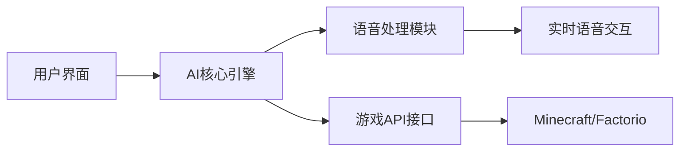
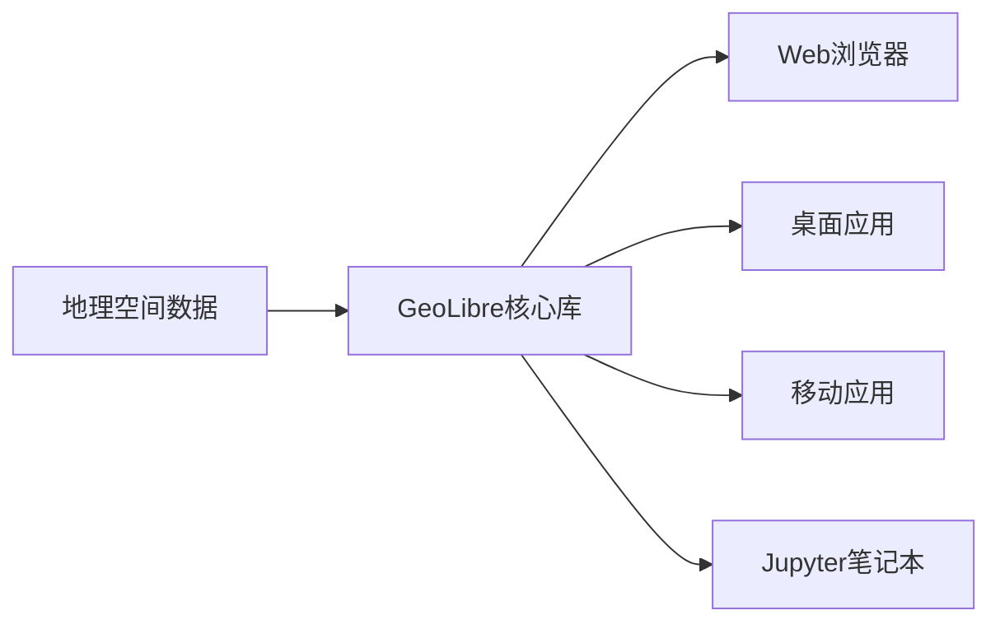
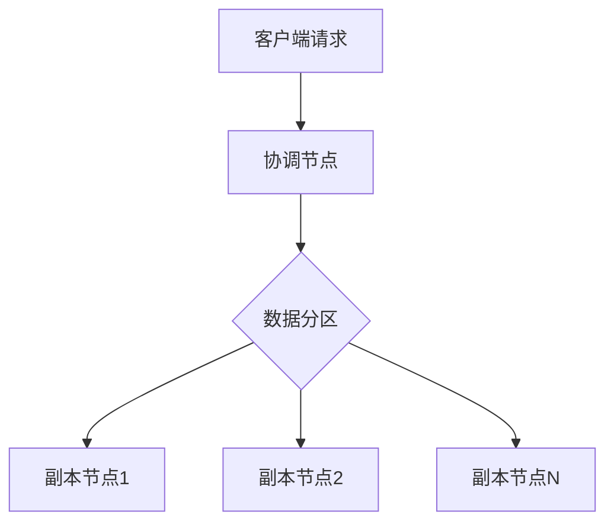

## 今日热点

AI应用与工具类项目引领今日GitHub热榜，尤其是AI增强型应用和多模态AI系统获得广泛关注，传统基础设施工具保持稳定活跃。

---

## 热门项目一览

| 排名 | 项目 | 语言 | 今日 | 总计 | 简介 |
|:---:|------|:----:|------:|-----:|------|
| 1 | [permissionlesstech/bitchat](https://github.com/permissionlesstech/bitchat) | Swift | +2,346 | 32,314 | bluetooth mesh chat, IRC vibes |
| 2 | [alibaba/open-code-review](https://github.com/alibaba/open-code-review) | Go | +979 | 14,855 | Open-source & free — Battle... |
| 3 | [pbakaus/impeccable](https://github.com/pbakaus/impeccable) | JavaScript | +847 | 51,580 | The design language that ma... |
| 4 | [yorukot/superfile](https://github.com/yorukot/superfile) | Go | +600 | 20,916 | Pretty fancy and modern ter... |
| 5 | [moeru-ai/airi](https://github.com/moeru-ai/airi) | TypeScript | +572 | 44,064 | 💖🧸 Self hosted, you-owned G... |
| 6 | [amnezia-vpn/amnezia-client](https://github.com/amnezia-vpn/amnezia-client) | C++ | +515 | 13,843 | Amnezia VPN Client (Desktop... |
| 7 | [shiyu-coder/Kronos](https://github.com/shiyu-coder/Kronos) | Python | +441 | 34,578 | Kronos: A Foundation Model ... |
| 8 | [bradautomates/claude-video](https://github.com/bradautomates/claude-video) | Python | +434 | 11,121 | Give Claude the ability to ... |
| 9 | [opengeos/GeoLibre](https://github.com/opengeos/GeoLibre) | TypeScript | +420 | 2,715 | A lightweight, cloud-native... |
| 10 | [NanmiCoder/MediaCrawler](https://github.com/NanmiCoder/MediaCrawler) | Python | +362 | 58,233 | 小红书笔记 | 评论爬虫、抖音视频 | 评论爬虫、快手... |
| 11 | [mvanhorn/last30days-skill](https://github.com/mvanhorn/last30days-skill) | Python | +240 | 54,193 | AI agent skill that researc... |
| 12 | [jenkinsci/jenkins](https://github.com/jenkinsci/jenkins) | Java | +180 | 25,897 | Jenkins automation server |

---

## 趋势洞察

```
┌─────────────────────────────────────────────────────────────────┐
│  AI/ML 工具         ████████████████████████  5 个项目        │
│  其他               ██████████████            3 个项目        │
│  多媒体应用            █████████                 2 个项目        │
│  开发工具             █████████                 2 个项目        │
│  数据分析             █████████                 2 个项目        │
│  智能家居             ████                      1 个项目        │
└─────────────────────────────────────────────────────────────────┘
```

---

## 项目深度解读

### 1. permissionlesstech/bitchat — [蓝牙群聊应用]

> **一句话总结**：基于蓝牙Mesh网络的去中心化聊天应用，重现传统IRC的聊天体验。

#### 价值主张

| 维度 | 说明 |
|------|------|
| **解决痛点** | 解决无网络环境下的即时通讯需求，无需服务器支持 |
| **目标用户** | 需要离线通讯、注重隐私、或网络受限环境的iOS用户 |
| **核心亮点** | 蓝牙Mesh网络支持 + 去中心化架构 + IRC风格界面 + 离线可用 + 隐私保护 |

#### 技术架构


**技术特色**：
- 基于蓝牙Mesh协议实现设备间直接通信
- 采用Swift语言开发，充分利用iOS平台特性
- 实现去中心化消息传递机制，无需中央服务器

#### 热度分析

- 项目获得32,314个Star，单日增长2,346，显示出极高的关注度和爆发式增长
- Fork数为5,066，表明社区参与度高，存在多个衍生版本或定制化实现
- Open Issues为0，可能表示项目已成熟或问题解决机制高效

#### 快速上手

```bash
# 克隆项目
git clone https://github.com/permissionlesstech/bitchat.git

# 使用Xcode打开项目
open bitchat.xcworkspace
```

#### 注意事项

- 项目许可证未知，使用前需确认开源协议
- 仅支持iOS设备，依赖蓝牙功能
- 需要iOS设备支持蓝牙Mesh功能
- 在无网络环境下使用，可能受到蓝牙通信距离限制


### 2. alibaba/open-code-review — 智能审查工具

> **一句话总结**：结合确定性流水线和LLM智能体的混合架构代码审查工具，提供精确的行级注释和内置安全规则。

#### 价值主张

| 维度 | 说明 |
|------|------|
| **解决痛点** | 提升代码审查效率与质量，解决大规模代码库中的安全漏洞和代码规范问题 |
| **目标用户** | 企业级开发团队、代码审查人员、DevOps工程师 |
| **核心亮点** | 确定性流水线+LLM智能体混合架构 + 精确行级注释 + 内置微调规则集 |

#### 技术架构


**技术特色**：
- 混合架构结合确定性流水线和LLM智能体
- 内置阿里巴巴实践验证的安全规则集
- 支持多模型API兼容性

#### 热度分析

- 项目Star数达14,855且单日增长近千，表明受到广泛关注和快速采用
- 作为阿里巴巴开源的企业级工具，在代码质量保障领域具有显著影响力

#### 快速上手

```bash
# 克隆项目
git clone https://github.com/alibaba/open-code-review.git
cd open-code-review

# 安装依赖并运行
go mod download
go run main.go --help
```

#### 注意事项

- 由于项目未明确许可证，使用前需确认具体开源协议
- 企业级部署可能需要额外的配置和优化
- 集成到现有CI/CD流程可能需要定制开发


### 3. pbakaus/impeccable — AI设计语言

> **一句话总结**：为AI系统提供专业设计语言，提升AI在创意设计领域的能力与质量。

#### 价值主张

| 维度 | 说明 |
|------|------|
| **解决痛点** | AI生成内容缺乏设计规范与美学指导 |
| **目标用户** | AI开发者、UI设计师、产品团队 |
| **核心亮点** | 设计规范库 + AI优化算法 + 跨平台兼容 + 实时预览 + 组件化设计 |

#### 技术架构


**技术特色**：
- 基于深度学习的设计优化算法
- 模块化设计系统与组件库
- 响应式设计适配多平台场景

#### 热度分析

- 项目5万+ stars，日增800+，显示AI设计领域需求旺盛
- 无开放问题表明项目成熟度高，维护稳定

#### 快速上手

```bash
# 安装依赖
npm install impeccable

# 基础使用
import { DesignSystem } from 'impeccable';
const aiDesign = new DesignSystem().applyAIOptimization(yourDesign);
```

#### 注意事项

- 项目许可证未明确，商业使用前需确认授权条款
- 可能需要设计领域基础知识才能充分利用其功能
- 建议结合现有设计流程逐步集成，而非全盘替换


### 4. yorukot/superfile — 终端文件管理器

> **一句话总结**：现代美观的终端文件管理器，提供直观的文件操作体验

#### 价值主张

| 维度 | 说明 |
|------|------|
| **解决痛点** | 传统终端文件操作界面简陋、效率低下的问题 |
| **目标用户** | 命令行爱好者、开发者、系统管理员 |
| **核心亮点** | 现代UI设计 + 键盘快捷操作 + 文件预览功能 |

#### 技术架构


**技术特色**：
- 使用Go语言开发，跨平台性能优异
- 自定义UI渲染引擎，无需依赖外部图形库
- 事件驱动架构，响应迅速

#### 热度分析

- 项目Star数突破2万且日增600+，增长势头强劲
- Fork数相对较少表明用户更倾向于直接使用而非二次开发

#### 快速上手

```bash
# 安装项目
git clone https://github.com/yorukot/superfile.git
cd superfile
go install

# 运行程序
superfile
```

#### 注意事项

- 需要Go环境(1.18+)才能编译安装
- 终端需支持UTF-8和基本颜色显示功能
- 项目许可证信息不明确，商业使用前需确认授权条款


### 5. moeru-ai/airi — 虚拟AI伴侣

> **一句话总结**：自托管AI伴侣系统，支持实时语音聊天和游戏互动，打造个性化虚拟角色体验。

#### 价值主张

| 维度 | 说明 |
|------|------|
| **解决痛点** | 提供可定制的自托管AI伴侣，满足虚拟交互和陪伴需求 |
| **目标用户** | 动漫爱好者、AI开发者、游戏玩家、虚拟角色爱好者 |
| **核心亮点** | 自托管架构 + 实时语音交互 + 游戏集成能力 + 跨平台支持 + 可定制化角色 |

#### 技术架构



**技术特色**：
- 基于TypeScript的全栈开发，确保跨平台兼容性
- 实时语音处理技术，支持流畅对话和情感表达
- 游戏API集成，实现AI与游戏世界的智能互动

#### 热度分析

- 项目获得44,000+ Stars且持续快速增长，日均新增572，显示强烈社区兴趣
- 作为AI伴侣领域代表项目，在虚拟角色和AI交互生态中占据重要位置

#### 快速上手

```bash
# 克隆仓库
git clone https://github.com/moeru-ai/airi.git

# 安装依赖
npm install

# 启动项目
npm start
```

#### 注意事项

- 项目许可证未知，使用时需注意版权和合规问题
- 作为AI伴侣系统，使用时需关注数据隐私和伦理问题
- 项目涉及虚拟角色交互，建议根据当地法律法规合理使用


### 6. amnezia-vpn/amnezia-client — 隐私保护VPN

> **一句话总结**：Amnezia VPN客户端提供跨平台隐私保护，支持多种加密协议，确保用户网络安全与匿名性。

#### 价值主张

| 维度 | 说明 |
|------|------|
| **解决痛点** | 解决网络监控与隐私泄露问题，提供安全匿名网络访问 |
| **目标用户** | 注重隐私的个人用户、需要突破网络限制的安全研究人员 |
| **核心亮点** | 跨平台支持 + 多层加密 + 高匿名性 + 防DNS泄露 + 强防火墙 |

#### 技术架构


**技术特色**：
- 基于C++实现的高性能网络通信
- 支持WireGuard、OpenVPN等多种协议
- 自定义加密算法增强安全性

#### 热度分析

- 项目Star数持续快速增长，单日增长500+，表明用户认可度高
- 社区活跃，Fork数过千，显示开发者参与度良好

#### 快速上手

```bash
# 克隆项目
git clone https://github.com/amnezia-vpn/amnezia-client.git

# 构建项目
cd amnezia-client && mkdir build && cd build
cmake .. && make
```

#### 注意事项

- 项目License未知，使用前需确认授权条款
- VPN服务使用需遵守当地法律法规
- 可能需要额外配置系统防火墙和网络设置


### 7. shiyu-coder/Kronos — [金融语言模型]

> **一句话总结**：Kronos是专为金融市场语言设计的基础模型，提供金融文本理解和分析能力。

#### 价值主张

| 维度 | 说明 |
|------|------|
| **解决痛点** | 解决金融市场专业语言理解和分析需求，提供金融领域专用AI模型 |
| **目标用户** | 金融分析师、量化交易员、投资研究机构、金融科技开发者 |
| **核心亮点** | 金融领域专业语料训练 + 金融术语理解 + 市场趋势分析能力 |

#### 技术架构


**技术特色**：
- 基于大规模金融语料预训练，掌握专业金融术语和表达
- 针对金融文本特点优化的注意力机制，提高金融关系提取准确性
- 结合时间序列分析能力，提供市场趋势预测功能

#### 热度分析

- 项目Star数达3.4万，近期每日新增440+星，显示金融AI领域热度持续上升
- Fork数近5.8千，表明开发者社区积极参与模型应用和二次开发

#### 快速上手

```bash
# 安装依赖
pip install kronos

# 基本使用
from kronos import FinancialAnalyzer
analyzer = FinancialAnalyzer()
result = analyzer.analyze("AAPL财报显示营收同比增长15%")
print(result)
```

#### 注意事项

- 模型仅针对金融领域优化，通用语言能力可能有限
- 金融预测仅供参考，实际投资决策需结合专业判断
- 使用前需确保遵守相关金融数据隐私法规


### 8. bradautomates/claude-video — [视频理解工具]

> **一句话总结**：为 Claude AI 提供视频分析能力，通过下载、提取帧和转录，实现 AI 对视频内容的全面理解。

#### 价值主张

| 维度 | 说明 |
|------|------|
| **解决痛点** | 解决 AI 无法直接处理和理解视频内容的问题 |
| **目标用户** | AI 研究人员、视频内容分析师、AI 应用开发者 |
| **核心亮点** | 视频帧提取 + 音频转录 + Claude AI 分析 + 自动化处理 |

#### 技术架构


**技术特色**：
- 多模态数据处理能力，结合视觉和听觉信息
- 高效的视频帧提取算法，保留关键信息
- 与 Claude AI 的深度集成，实现智能分析

#### 热度分析

- 项目获得超11k星标，单日增长400+，显示AI视频分析领域需求旺盛
- 作为AI视频理解的前沿工具，在AI社区中具有高影响力

#### 快速上手

```bash
# 安装依赖
pip install -r requirements.txt

# 运行视频分析
python claude_video.py /watch [视频URL]
```

#### 注意事项

- 项目许可证不明确，使用前需确认授权条款
- 可能需要 Anthropic API 密钥才能与 Claude 交互
- 处理长视频可能需要大量计算资源和存储空间


### 9. opengeos/GeoLibre — 跨平台GIS平台

> **一句话总结**：轻量级云原生GIS平台，支持多端部署，提供地理空间数据可视化与分析能力。

#### 价值主张

| 维度 | 说明 |
|------|------|
| **解决痛点** | 解决传统GIS平台重依赖、跨平台兼容性差的问题 |
| **目标用户** | 地理信息系统开发者、数据分析师、科研人员 |
| **核心亮点** | 轻量级 + 云原生 + 多端支持 + Jupyter集成 + 地理空间分析 |

#### 技术架构



**技术特色**：
- 使用TypeScript开发，提供类型安全
- 云原生架构，轻量级部署
- 跨平台支持，覆盖主流使用场景

#### 热度分析

- 项目Star数达2715，单日增长420，表明项目近期受到高度关注
- Fork数355，显示社区活跃度较高，但Issues为0可能表示项目处于早期阶段

#### 快速上手

```bash
# 克隆项目
git clone https://github.com/opengeos/GeoLibre.git
# 安装依赖
npm install
# 启动开发服务器
npm start
```

#### 注意事项

- 项目许可证未知，使用前需确认许可条款
- 项目处于快速发展阶段，API可能会有变化
- 需要地理空间数据专业知识才能充分利用平台功能


### 10. NanmiCoder/MediaCrawler — 多平台爬虫

> **一句话总结**：一站式爬取中国主流社交媒体平台内容，支持视频、笔记、评论等结构化数据采集。

#### 价值主张

| 维度 | 说明 |
|------|------|
| **解决痛点** | 集成多平台爬虫功能，避免重复开发，提高数据采集效率 |
| **目标用户** | 数据分析师、内容研究者、市场营销人员、AI训练数据收集者 |
| **核心亮点** | 多平台支持 + 高效数据采集 + 规避反爬机制 + 结构化输出 |

#### 技术架构


**技术特色**：
- 针对不同平台定制适配器，处理各自独特的API和数据结构
- 实现反爬虫机制规避策略，提高爬取成功率和稳定性
- 支持异步请求和并发处理，提升数据采集效率

#### 热度分析

- 项目获得超5.8万星，日增300+，表明在数据采集领域具有较高认可度和实用价值
- Fork数超过1.1万，说明社区活跃度高，用户参与贡献意愿强

#### 快速上手

```bash
# 克隆项目
git clone https://github.com/NanmiCoder/MediaCrawler.git

# 安装依赖
pip install -r requirements.txt

# 运行爬虫
python run.py platform_name
```

#### 注意事项

- 使用时需遵守各平台的使用条款，避免违反法律法规
- 部分平台可能需要更新适配器以应对接口变更
- 建议适当设置请求间隔，避免对目标服务器造成过大压力


### 11. mvanhorn/last30days-skill — AI研究助手

> **一句话总结**：跨平台AI研究工具，聚合多平台信息并生成带引用的综合摘要。

#### 价值主张

| 维度 | 说明 |
|------|------|
| **解决痛点** | 解决信息分散问题，一键获取多平台最新综合资讯 |
| **目标用户** | 研究人员、分析师、内容创作者和决策者 |
| **核心亮点** | 多平台数据聚合 + AI智能总结 + 信息溯源 + 时间范围限定 |

#### 技术架构


**技术特色**：
- 跨平台API数据获取与整合技术
- 大型语言模型内容分析与合成能力
- 信息可信度评估与溯源机制

#### 热度分析

- 项目Star数超5.4万且日增240，显示极强的社区关注度和实用价值
- 作为AI代理技能代表项目，处于AI应用开发前沿，生态位置重要

#### 快速上手

```bash
# 克隆项目
git clone https://github.com/mvanhorn/last30days-skill.git

# 安装依赖
pip install -r requirements.txt
```

#### 注意事项

- 项目许可证未知，商业使用前需确认授权条款
- 依赖多个外部API，可能面临访问限制或变更
- AI生成内容需验证准确性，不应作为唯一信息来源


### 12. jenkinsci/jenkins — 持续集成引擎

> **一句话总结**：Jenkins是功能强大的开源CI/CD服务器，支持自动化构建、测试和部署任何软件项目。

#### 价值主张

| 维度 | 说明 |
|------|------|
| **解决痛点** | 解决软件开发中的自动化构建、测试和部署问题 |
| **目标用户** | 软件开发团队、DevOps工程师、自动化测试人员 |
| **核心亮点** | 插件系统丰富 + 支持分布式构建 + 高度可定制 + 强大的社区支持 |

#### 技术架构


**技术特色**：
- 基于Java构建，跨平台兼容性好
- 插件架构实现高度可扩展性
- 支持主从分布式架构，提高构建效率
- REST API提供丰富的集成接口

#### 热度分析

- Jenkins作为CI/CD领域的领导者，拥有超过25k星标和稳定增长趋势，表明其在开发者社区中广受欢迎
- 拥有庞大的插件生态系统和活跃的开发者社区，持续贡献新功能和改进

#### 快速上手

```bash
# 安装Jenkins（基于Debian/Ubuntu）
sudo apt update
sudo apt install jenkins

# 启动Jenkins服务
sudo systemctl start jenkins
sudo systemctl enable jenkins

# 访问Jenkins
# http://localhost:8080
```

#### 注意事项

- 初始安装后需要从日志中获取管理员密码才能完成设置
- 大规模部署时建议配置适当的存储和资源限制
- 定期更新Jenkins版本以获取安全补丁和新功能


### 13. ocornut/imgui — 轻量级即时GUI库

> **一句话总结**：ImGui是一个无依赖、轻量级的C++即时模式图形用户界面库，专为游戏工具和可视化应用设计。

#### 价值主张

| 维度 | 说明 |
|------|------|
| **解决痛点** | 解决在游戏开发和高性能应用中创建轻量级、无依赖图形用户界面的问题 |
| **目标用户** | 游戏开发者、工具开发者、可视化应用开发者以及需要嵌入式GUI的C++程序员 |
| **核心亮点** | 无依赖 + 轻量级 + 即时模式 + 高性能 + 易于集成 |

#### 技术架构


**技术特色**：
- 即时模式渲染，无需传统GUI的状态维护
- 零外部依赖，仅需兼容C++98的编译器
- 高度可移植，支持DirectX、OpenGL、Vulkan等多种图形后端

#### 热度分析

- 拥有超过75k的Star和近12k的Fork，持续稳定增长，表明其在游戏开发工具链中的重要地位
- 社区活跃度高，被广泛应用于游戏引擎和开发工具中，形成了丰富的生态系统和第三方扩展

#### 快速上手

```bash
# 克隆仓库
git clone https://github.com/ocornut/imgui.git
# 进入目录
cd imgui
# 创建示例项目
mkdir build && cd build
# 使用CMake构建
cmake ..
# 编译示例
make -j4
```

#### 注意事项

- ImGui采用即时模式GUI范式，与传统保留模式GUI有本质区别，需要适应其编程模型
- ImGui不提供内置的布局管理，需要开发者手动处理位置和大小
- 对于复杂的GUI应用，可能需要结合其他UI库或自行实现高级功能


### 14. vudovn/ag-kit — 管理工具包

> **一句话总结**：功能完备的TypeScript管理后台UI工具包，提供丰富组件与模板。

#### 价值主张

| 维度 | 说明 |
|------|------|
| **解决痛点** | 解决企业级应用后台开发效率低、样式不统一问题 |
| **目标用户** | 前端开发者、UI设计师、全栈工程师 |
| **核心亮点** | 组件丰富 + TypeScript支持 + 响应式设计 + 开箱即用 + 高度可定制 |

#### 技术架构


**技术特色**：
- 基于TypeScript开发，提供类型安全
- 组件化设计，支持按需引入
- 主题定制系统，适应不同品牌风格
- 响应式设计，适配多端设备

#### 热度分析

- 高星项目(+14 stars/day)，表明社区认可度高且持续增长
- Fork数与Star数比例约为1:5，反映项目以使用为主，二次开发较少

#### 快速上手

```bash
# 安装
npm install ag-kit

# 引入组件
import { Button, Table } from 'ag-kit';

# 使用
<Button type="primary">主要按钮</Button>
```

#### 注意事项

- 需要确保项目依赖的版本兼容性
- 定期关注更新，及时获取安全修复和新特性


### 15. apache/cassandra — 分布式数据库

> **一句话总结**：高度可扩展的NoSQL数据库，提供无单点故障的线性扩展能力和高性能。

#### 价值主张

| 维度 | 说明 |
|------|------|
| **解决痛点** | 解决传统数据库在分布式环境下的扩展性瓶颈和高可用性问题 |
| **目标用户** | 需要高可用性、线性扩展能力的大规模数据存储用户 |
| **核心亮点** | 无单点故障架构 + 线性扩展能力 + 多数据中心支持 + 最终一致性模型 + 高吞吐量 |

#### 技术架构



**技术特色**：
- 基于DHT的一致性哈希分区机制
- 适用于多数据中心部署的复制策略
- 支持多版本并发控制(MVCC)

#### 热度分析

- 项目拥有近10k星标，显示其在分布式数据库领域的重要地位，且保持稳定增长
- 作为Apache顶级项目，拥有活跃的开发社区和广泛的企业应用

#### 快速上手

```bash
# 下载并启动Cassandra
wget https://downloads.apache.org/cassandra/4.1.0/apache-cassandra-4.1.0-bin.tar.gz
tar -xzf apache-cassandra-4.1.0-bin.tar.gz
cd apache-cassandra-4.1.0
./bin/cassandra

# 使用cqlsh连接
./bin/cqlsh
```

#### 注意事项

- Cassandra采用最终一致性模型，不适合需要强一致性的事务场景
- 数据模型设计对性能影响巨大，需要根据查询模式合理设计表结构
- 调优参数较多，需要根据实际负载进行配置优化


## 今日推荐

| 主题 | 推荐项目 | 亮点 |
|------|----------|------|
| 今日最热 | [permissionlesstech/bitchat](https://github.com/permissionlesstech/bitchat) | bluetooth mesh ch... |
| 值得关注 | [alibaba/open-code-review](https://github.com/alibaba/open-code-review) | Open-source & fre... |
| 快速上手 | [pbakaus/impeccable](https://github.com/pbakaus/impeccable) | The design langua... |
| 长期潜力 | [yorukot/superfile](https://github.com/yorukot/superfile) | Pretty fancy and ... |

---

<div align="center">

*Generated on 2026-07-28 | Powered by GitHub Trending Reporter*

</div>