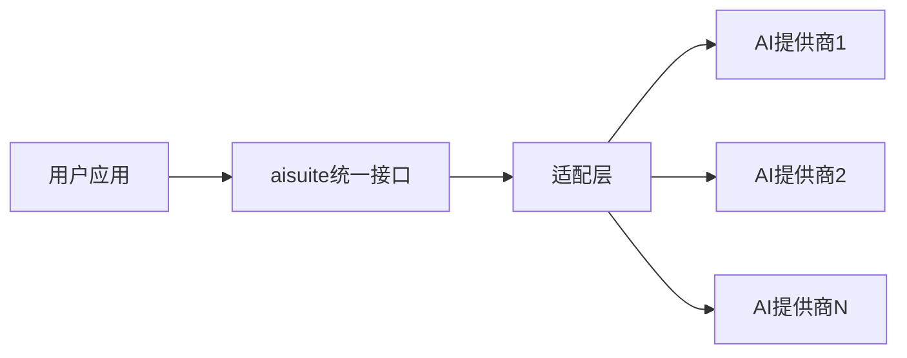

## 今日热点

今日GitHub热榜项目精彩纷呈。

---

## 热门项目一览

| 排名 | 项目 | 语言 | 今日 | 总计 | 简介 |
|:---:|------|:----:|------:|-----:|------|
| 1 | [bradautomates/claude-video](https://github.com/bradautomates/claude-video) | Python | +988 | 12,127 | Give Claude the ability to ... |
| 2 | [moeru-ai/airi](https://github.com/moeru-ai/airi) | TypeScript | +797 | 44,792 | 💖🧸 Self hosted, you-owned G... |
| 3 | [yorukot/superfile](https://github.com/yorukot/superfile) | Go | +662 | 21,499 | Pretty fancy and modern ter... |
| 4 | [affaan-m/ECC](https://github.com/affaan-m/ECC) | JavaScript | +636 | 234,841 | The agent harness performan... |
| 5 | [opengeos/GeoLibre](https://github.com/opengeos/GeoLibre) | TypeScript | +607 | 3,424 | A lightweight, cloud-native... |
| 6 | [virgiliojr94/book-to-skill](https://github.com/virgiliojr94/book-to-skill) | Python | +423 | 11,460 | Turn any technical book PDF... |
| 7 | [pascalorg/editor](https://github.com/pascalorg/editor) | TypeScript | +341 | 18,754 | Create and share 3D archite... |
| 8 | [paperswithbacktest/awesome-systematic-trading](https://github.com/paperswithbacktest/awesome-systematic-trading) | Python | +309 | 9,644 | A curated list of awesome l... |
| 9 | [huggingface/speech-to-speech](https://github.com/huggingface/speech-to-speech) | Python | +227 | 7,285 | Build local voice agents wi... |
| 10 | [jenkinsci/jenkins](https://github.com/jenkinsci/jenkins) | Java | +180 | 26,080 | Jenkins automation server |
| 11 | [andrewyng/aisuite](https://github.com/andrewyng/aisuite) | Python | +62 | 15,696 | Simple, unified interface t... |
| 12 | [hello245m/free-stockdb](https://github.com/hello245m/free-stockdb) | HTML | +50 | 1,311 | 面向 A 股日K、分钟K与ETF分钟数据的本地量化引擎... |

---

## 趋势洞察

```
┌─────────────────────────────────────────────────────────────────┐
│  AI/ML 工具         ████████████████████████  7 个项目        │
│  其他               ██████                    2 个项目        │
│  智能家居             ███                       1 个项目        │
│  项目管理             ███                       1 个项目        │
│  开发工具             ███                       1 个项目        │
│  数据分析             ███                       1 个项目        │
└─────────────────────────────────────────────────────────────────┘
```

---

## 项目深度解读

### 1. bradautomates/claude-video — AI视频分析工具

> **一句话总结**：通过视频下载、帧提取和转录技术，赋予Claude AI观看和分析视频内容的能力。

#### 价值主张

| 维度 | 说明 |
|------|------|
| **解决痛点** | 解决Claude无法直接处理视频内容的问题，扩展AI应用场景 |
| **目标用户** | AI研究者、内容分析师、需要视频理解的开发者 |
| **核心亮点** | 多模态数据处理 + 高效帧提取 + 精准转录 + 无缝Claude集成 |

#### 技术架构


**技术特色**：
- 多模态数据处理技术，实现视频到文本的转化
- 高效视频帧提取算法，保留关键视觉信息
- 与Claude API的深度集成，实现智能内容分析

#### 热度分析

- 项目获得12,127个Star，近期增长迅速(+988 today)，显示社区对该功能有强烈需求
- 作为AI视频处理工具，处于AI应用开发前沿，吸引了大量关注

#### 快速上手

```bash
# 安装依赖
pip install -r requirements.txt

# 使用命令
/watch [视频URL]
```

#### 注意事项

- 需要Claude API访问权限
- 视频处理可能需要较高的计算资源
- 不同长度的视频可能需要不同的处理策略


### 2. moeru-ai/airi — AI虚拟伴侣

> **一句话总结**：自托管AI虚拟伴侣，支持实时语音互动和游戏集成，打造个性化数字生命体。

#### 价值主张

| 维度 | 说明 |
|------|------|
| **解决痛点** | 解决AI助手缺乏个性化和情感连接问题，同时提供完全数据隐私控制 |
| **目标用户** | 寻求个性化AI交互的科技爱好者、游戏玩家及数字内容创作者 |
| **核心亮点** | 自托管隐私保护 + 实时语音交互 + 游戏集成能力 + 多平台支持 + 角色定制化 |

#### 技术架构


**技术特色**：
- 基于TypeScript的全栈开发，确保跨平台兼容性
- 实时语音处理技术，支持自然对话体验
- 游戏API集成，实现Minecraft和Factorio的交互控制

#### 热度分析

- 项目Star数高达4.4万且持续增长，表明在AI虚拟伴侣领域具有显著吸引力
- 零开放Issues反映项目维护良好，社区问题解决效率高

#### 快速上手

```bash
# 克隆项目
git clone https://github.com/moeru-ai/airi.git
# 安装依赖
npm install
# 启动服务
npm start
```

#### 注意事项

- 项目License未知，使用前需确认授权条款
- 自托管模式需要一定的技术配置能力
- 游戏集成功能可能需要特定环境支持


### 3. yorukot/superfile — 精美终端管理器

> **一句话总结**：基于Go开发的高颜值终端文件管理器，提供现代化UI与高效操作体验。

#### 价值主张

| 维度 | 说明 |
|------|------|
| **解决痛点** | 传统终端文件操作命令复杂，缺乏可视化界面 |
| **目标用户** | 追求高效操作且重视视觉体验的开发者和终端爱好者 |
| **核心亮点** | 现代化UI设计 + 高效键盘导航 + 轻量级架构 |

#### 技术架构

```mermaid
graph LR
    A[用户输入] --> B[事件处理]


### 4. affaan-m/ECC — [智能代码优化]

> **一句话总结**：为AI代码助手提供性能优化系统，增强技能、记忆与安全性。

#### 价值主张

| 维度 | 说明 |
|------|------|
| **解决痛点** | 提升AI代码助手性能，解决智能与效率不足问题 |
| **目标用户** | AI代码开发者、AI工具使用者、效率优化需求者 |
| **核心亮点** | 多层次性能优化 + 记忆增强 + 安全性保障 + 研究优先开发 |

#### 技术架构

```mermaid
graph LR
    A[AI代码助手输入] --> B[性能优化系统]
    B --> C[技能处理]
    B --> D[记忆管理]
    B --> E[安全检查]
    B --> F[研究优化]
    C --> G[增强输出]
    D --> G
    E --> G
    F --> G
```

**技术特色**：
- 多层次性能优化架构，全面提升AI代码助手表现
- 记忆管理系统，增强AI上下文理解能力
- 安全保障机制，确保代码生成安全可靠

#### 热度分析

- 项目获得23万+ stars，日增600+，表明社区认可度高，增长势头强劲
- Fork数达3.5万+，显示开发者积极参与，贡献活跃

#### 快速上手

```bash
# 克隆项目并安装依赖
git clone https://github.com/affaan-m/ECC.git
cd ECC
npm install
```

#### 注意事项

- 项目许可证未知，商业使用前需确认授权情况
- 作为AI辅助工具，需注意代码质量和安全性验证


### 5. opengeos/GeoLibre — 轻量地理平台

> **一句话总结**：轻量级云原生GIS平台，多端运行，支持地理空间数据可视化与分析。

#### 价值主张

| 维度 | 说明 |
|------|------|
| **解决痛点** | 传统GIS系统笨重，难以跨平台部署和使用 |
| **目标用户** | 地理数据分析师、研究人员、开发者 |
| **核心亮点** | 轻量级 + 云原生 + 多平台支持 + Jupyter集成 |

#### 技术架构


**技术特色**：
- 基于TypeScript开发，类型安全
- 云原生架构，轻量级设计
- 跨平台兼容，支持多种运行环境

#### 热度分析

- 项目Star数快速增长，单日新增607个，显示社区高度关注
- Fork数适中，表明项目有良好的技术基础和实用价值

#### 快速上手

```bash
# 安装GeoLibre
npm install @opengeos/geolibre

# 在Jupyter中使用
import { GeoLibre } from '@opengeos/geolibre';
const glb = new GeoLibre();
```

#### 注意事项

- 项目许可证未知，可能影响商业应用
- 零开放Issues，可能表明项目处于早期阶段或问题管理方式不同


### 6. virgiliojr94/book-to-skill — 书籍转技能工具

> **一句话总结**：将技术书籍PDF转换为Claude Code技能，实现动态学习与知识应用的无缝衔接。

#### 价值主张

| 维度 | 说明 |
|------|------|
| **解决痛点** | 将静态PDF技术书籍转化为可交互的Claude技能，消除知识获取与应用的鸿沟 |
| **目标用户** | 技术学习者、开发者、研究人员，需要整合书籍内容到工作流程中的专业人士 |
| **核心亮点** | PDF智能解析 + 内容结构化处理 + Claude Code技能生成 + 便捷搜索引用 + 工作流集成 |

#### 技术架构


**技术特色**：
- 高级PDF解析与内容提取技术
- 智能内容结构化与分类算法
- Claude Code技能自动生成机制

#### 热度分析

- 项目获11,460个Star，近期增长迅速(+423 today)，表明受到开发者广泛认可
- 作为AI赋能知识管理工具，处于当前技术社区热点生态位置，满足知识工作者需求

#### 快速上手

```bash
# 克隆项目
git clone https://github.com/virgiliojr94/book-to-skill.git

# 运行转换工具
python book_to_skill.py input.pdf --output my_skill
```

#### 注意事项

- 确保输入PDF具有清晰的结构和格式，以获得最佳转换效果
- 转换质量可能因原始PDF的组织方式和清晰度而异
- 可能需要根据不同书籍类型调整转换参数


### 7. pascalorg/editor — 3D建筑可视化

> **一句话总结**：基于Web的3D建筑设计编辑器，提供直观的建模工具和实时渲染功能。

#### 价值主张

| 维度 | 说明 |
|------|------|
| **解决痛点** | 简化3D建筑创作流程，降低专业建模门槛 |
| **目标用户** | 建筑师、设计师和3D建模爱好者 |
| **核心亮点** | 直观3D建模界面 + 实时渲染效果 + 在线分享协作 |

#### 技术架构


**技术特色**：
- 基于Web的3D渲染技术，无需专业软件
- TypeScript全栈开发，确保代码质量
- 实时协作编辑功能

#### 热度分析

- Star数增长迅速，日增300+，表明项目活跃度高且用户认可
- 作为3D建筑领域开源工具，填补了专业与轻量级工具之间的空白

#### 快速上手

```bash
# 克隆项目
git clone https://github.com/pascalorg/editor.git
# 安装依赖
npm install
# 启动开发服务器
npm run dev
```

#### 注意事项

- 项目许可证未知，商业使用前需确认授权
- 可能需要一定的3D建模基础知识才能充分利用
- 项目架构复杂，自定义扩展需要深入了解代码库


### 8. paperswithbacktest/awesome-systematic-trading — 量化资源库

> **一句话总结**：系统化交易领域精选资源集合，提供从工具到策略的全方位支持。

#### 价值主张

| 维度 | 说明 |
|------|------|
| **解决痛点** | 解决系统化交易者资源分散、筛选困难的问题 |
| **目标用户** | 量化交易开发者、金融科技研究者、系统化交易从业者 |
| **核心亮点** | 精选资源整理 + 分类清晰 + 持续更新 + 多领域覆盖 + 实用性强 |

#### 技术架构


**技术特色**：
- 跨平台工具整合，支持多操作系统环境
- 涵盖从基础到高级的完整学习路径
- 包含开源和商业工具的混合资源体系

#### 热度分析
- 项目近万星且持续快速增长，反映系统化交易领域热度攀升
- 作为awesome系列项目，在量化社区具有重要参考价值和生态地位

#### 快速上手

```bash
# 克隆项目到本地
git clone https://github.com/paperswithbacktest/awesome-systematic-trading.git

# 浏览README获取完整资源列表
cat awesome-systematic-trading/README.md
```

#### 注意事项
- 项目本身是资源列表，不是可直接运行的交易系统
- 部分资源可能需要付费订阅或商业许可
- 使用开源交易工具时需注意安全性和合规性
- 回测结果不代表实盘表现，需谨慎评估风险


### 9. huggingface/speech-to-speech — 本地语音助手

> **一句话总结**：基于开源模型构建本地语音助手，实现端到端语音交互能力

#### 价值主张

| 维度 | 说明 |
|------|------|
| **解决痛点** | 解决云端语音服务依赖与隐私问题，提供本地化语音交互方案 |
| **目标用户** | 开发者、语音交互爱好者、注重隐私的个人用户 |
| **核心亮点** | 开源模型支持 + 本地部署 + 隐私保护 + 低延迟响应 |

#### 技术架构


**技术特色**：
- 利用开源模型实现端到端语音处理
- 本地部署减少云端依赖和延迟
- 支持自定义语音助手功能和交互流程

#### 热度分析

- 项目单日新增227个Star，表明社区关注度快速上升
- 作为Hugging Face生态项目，受益于AI开源社区热度，语音交互领域关注度提升

#### 快速上手

```bash
# 克隆仓库
git clone https://github.com/huggingface/speech-to-speech.git

# 安装依赖
cd speech-to-speech && pip install -e .

# 运行示例
python examples/basic_demo.py
```

#### 注意事项

- 本地运行需要一定计算资源，特别是处理复杂语音模型
- 语音识别和合成效果可能受硬件性能影响
- 需要适当的麦克风和音频设备以获得最佳体验


### 10. jenkinsci/jenkins — 持续集成引擎

> **一句话总结**：Jenkins是功能强大的开源自动化服务器，支持构建、部署和自动化任何项目。

#### 价值主张

| 维度 | 说明 |
|------|------|
| **解决痛点** | 解决软件开发中手动流程繁琐、效率低下、错误率高的问题 |
| **目标用户** | 软件开发团队、DevOps工程师、系统管理员 |
| **核心亮点** | 插件生态系统丰富 + 支持分布式构建 + 强大的管道功能 + 跨平台支持 |

#### 技术架构


**技术特色**：
- 基于 Java 构建的高性能服务器，支持大规模分布式构建
- 插件化架构，可通过插件扩展功能，支持数百种工具和集成
- 流水线(Pipeline)即代码，使用 Jenkinsfile 实现CI/CD流程的版本控制

#### 热度分析

- Jenkins 作为 CI/CD 领域的领导者，拥有超过 2.6 万星标，表明其在开发者社区中的广泛认可度和持续增长趋势。
- 拥有庞大的生态系统和活跃的贡献者社区，成为 DevOps 实践的核心工具之一。

#### 快速上手

```bash
# 安装 Jenkins
sudo apt-get update
sudo apt-get install jenkins

# 启动 Jenkins
sudo systemctl start jenkins
sudo systemctl enable jenkins

# 访问 Jenkins
http://localhost:8080
```

#### 注意事项

- Jenkins 需要足够的系统资源，特别是在处理大型项目或多个并发构建时
- 安全配置非常重要，默认安装后需要更改默认管理员密码并适当限制匿名访问
- 插件管理需要谨慎，某些插件可能存在兼容性问题或不稳定


### 11. andrewyng/aisuite — AI统一接口框架

> **一句话总结**：为多种生成式AI模型提供统一调用接口，简化多模型集成与切换。

#### 价值主张

| 维度 | 说明 |
|------|------|
| **解决痛点** | 解决多AI模型接口不统一导致的集成复杂性问题 |
| **目标用户** | 需要集成多种AI模型的应用开发者与研究人员 |
| **核心亮点** | 统一接口设计 + 多模型支持 + 简化集成流程 + 降低切换成本 |

#### 技术架构



**技术特色**：
- 抽象化多种AI模型接口，提供统一调用方式
- 模块化设计，便于扩展新的AI提供商
- 简化认证与错误处理机制

#### 热度分析

- 项目Star数高且持续增长，显示其在AI集成领域有较强吸引力
- 无Open Issues表明项目维护状态良好，社区反馈渠道可能通过其他方式

#### 快速上手

```bash
# 安装aisuite
pip install aisuite

# 使用示例
import aisuite
client = aisuite.Client()
response = client.chat.completions.create(
    model="gpt-4",
    messages=[{"role": "user", "content": "Hello"}]
)
```

#### 注意事项

- 需要单独配置各AI提供商的API密钥
- 不同模型可能有不同的参数限制和特性
- 项目License未知，使用前需确认授权条款


### 12. hello245m/free-stockdb — [A股数据引擎]

> **一句话总结**：面向A股的本地量化数据库，提供完整的数据获取、处理和分析解决方案。

#### 价值主张

| 维度 | 说明 |
|------|------|
| **解决痛点** | 解决A股量化交易数据获取难、处理慢的问题 |
| **目标用户** | 中国A股量化交易者、数据分析师、投资研究员 |
| **核心亮点** | 本地数据库 + 增量同步 + 复权处理 + 回测支持 + 指标计算 |

#### 技术架构


**技术特色**：
- 本地化存储减少外部依赖
- 增量同步机制节省带宽资源
- 支持复权处理确保数据准确性

#### 热度分析

- 项目获得1311个Star且近期增长迅速，显示A股量化社区对该项目的强烈需求
- 相比同类项目，Fork比例适中，表明用户主要将其作为直接使用工具而非二次开发基础

#### 快速上手

```bash
# 克隆项目
git clone https://github.com/hello245m/free-stockdb.git

# 初始化数据库
python init_db.py
```

#### 注意事项

- 项目License未知，商业使用前需确认授权方式
- 主要面向A股市场，其他市场数据支持可能有限
- HTML作为主要编程语言可能有误，实际可能使用Python等语言实现核心功能


### 13. microsoft/agent-governance-toolkit — AI代理治理框架

> **一句话总结**：微软开源的AI代理治理工具包，提供安全策略执行、零信任身份和沙箱化环境。

#### 价值主张

| 维度 | 说明 |
|------|------|
| **解决痛点** | 解决AI代理的安全风险、越权访问和不可靠执行问题 |
| **目标用户** | AI系统开发者、企业安全团队、AI解决方案提供商 |
| **核心亮点** | 策略执行 + 零信任身份 + 执行沙箱化 + 可靠性工程 + OWASP全面覆盖 |

#### 技术架构


**技术特色**：
- 基于零信任模型的身份验证机制
- 沙箱化执行环境隔离潜在风险
- 全面的OWASP代理十大风险防护
- 可靠性工程保障系统稳定性
- 策略驱动的治理框架

#### 热度分析

- 项目获得5,222个Star且持续增长，表明AI安全治理领域需求旺盛
- 微软背书的开源项目，在AI治理生态中具有重要影响力

#### 快速上手

```bash
# 克隆仓库
git clone https://github.com/microsoft/agent-governance-toolkit.git

# 安装依赖
pip install -r requirements.txt

# 初始化配置
python setup.py init
```

#### 注意事项

- 项目许可证信息不明确，使用前需确认开源协议
- 项目当前没有开放的Issues，可能通过其他渠道提供支持
- 需要一定的AI安全和系统管理知识才能充分利用工具功能


## 今日推荐

| 主题 | 推荐项目 | 亮点 |
|------|----------|------|
| 今日最热 | [bradautomates/claude-video](https://github.com/bradautomates/claude-video) | Give Claude the a... |
| 值得关注 | [moeru-ai/airi](https://github.com/moeru-ai/airi) | 💖🧸 Self hosted, y... |
| 快速上手 | [yorukot/superfile](https://github.com/yorukot/superfile) | Pretty fancy and ... |
| 长期潜力 | [affaan-m/ECC](https://github.com/affaan-m/ECC) | The agent harness... |

---

<div align="center">

*Generated on 2026-07-29 | Powered by GitHub Trending Reporter*

</div>