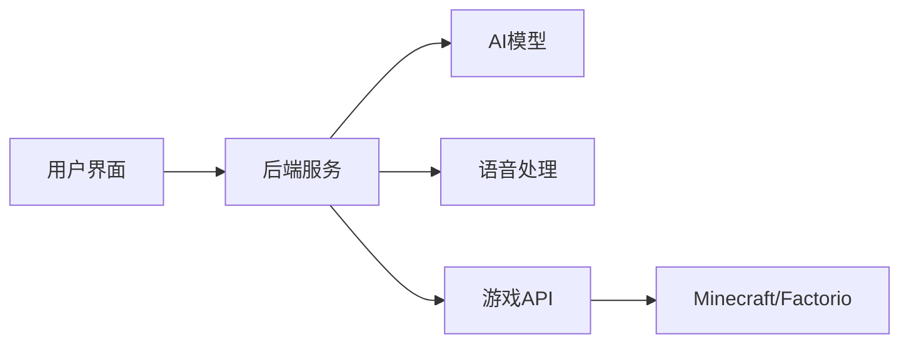
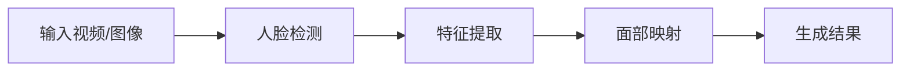
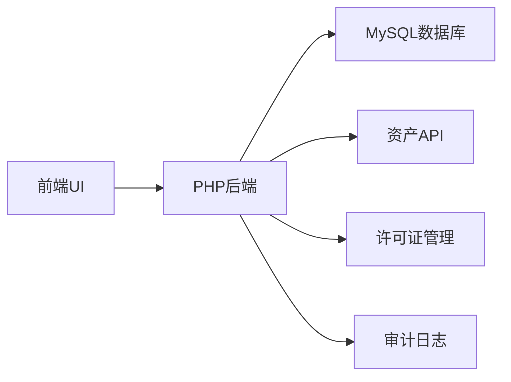
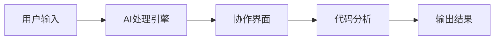

## 今日热点

今日GitHub热榜显示AI代理系统和语音助手技术引领潮流，同时AI性能优化和辅助开发工具也获得高度关注，反映出开源社区正加速AI技术的实用化和普及化。

---

## 热门项目一览

| 排名 | 项目 | 语言 | 今日 | 总计 | 简介 |
|:---:|------|:----:|------:|-----:|------|
| 1 | [virgiliojr94/book-to-skill](https://github.com/virgiliojr94/book-to-skill) | Python | +1,421 | 12,790 | Turn any technical book PDF... |
| 2 | [pascalorg/editor](https://github.com/pascalorg/editor) | TypeScript | +1,022 | 19,590 | Create and share 3D archite... |
| 3 | [paperswithbacktest/awesome-systematic-trading](https://github.com/paperswithbacktest/awesome-systematic-trading) | Python | +945 | 10,402 | A curated list of awesome l... |
| 4 | [affaan-m/ECC](https://github.com/affaan-m/ECC) | JavaScript | +857 | 235,595 | The agent harness performan... |
| 5 | [huggingface/speech-to-speech](https://github.com/huggingface/speech-to-speech) | Python | +827 | 7,884 | Build local voice agents wi... |
| 6 | [moeru-ai/airi](https://github.com/moeru-ai/airi) | TypeScript | +682 | 45,398 | 💖🧸 Self hosted, you-owned G... |
| 7 | [opengeos/GeoLibre](https://github.com/opengeos/GeoLibre) | TypeScript | +671 | 4,065 | A lightweight, cloud-native... |
| 8 | [1jehuang/jcode](https://github.com/1jehuang/jcode) | Rust | +640 | 13,481 | The most RAM efficient harness |
| 9 | [obra/superpowers](https://github.com/obra/superpowers) | Shell | +616 | 263,310 | An agentic skills framework... |
| 10 | [alibaba/open-code-review](https://github.com/alibaba/open-code-review) | Go | +359 | 16,024 | Open-source & free — Battle... |
| 11 | [microsoft/VibeVoice](https://github.com/microsoft/VibeVoice) | Python | +336 | 51,307 | Open-Source Frontier Voice AI |
| 12 | [deepfakes/faceswap](https://github.com/deepfakes/faceswap) | Python | +166 | 56,301 | Deepfakes Software For All |

---

## 趋势洞察

```
┌─────────────────────────────────────────────────────────────────┐
│  AI/ML 工具         ████████████████████████  10 个项目        │
│  多媒体应用            ████                      2 个项目        │
│  项目管理             ████                      2 个项目        │
│  其他               ████                      2 个项目        │
│  数据分析             ██                        1 个项目        │
└─────────────────────────────────────────────────────────────────┘
```

---

## 项目深度解读

### 1. virgiliojr94/book-to-skill — [书籍技能转换工具]

> **一句话总结**：将技术书籍PDF转换为Claude Code技能，提升学习和工作效率。

#### 价值主张

| 维度 | 说明 |
|------|------|
| **解决痛点** | 将静态PDF书籍转化为动态可交互的AI技能，解决学习资料难以快速检索和应用的问题 |
| **目标用户** | 技术学习者、开发者、研究人员和需要参考技术书籍的专业人士 |
| **核心亮点** | 支持任意技术书籍PDF转换 + 生成可直接在Claude中使用的技能 + 保留书籍完整内容便于检索 + 边工作边学习参考 |

#### 技术架构


**技术特色**：
- 利用Python强大的PDF处理能力提取书籍内容
- 将非结构化PDF内容转化为结构化数据
- 生成符合Claude Code技能规范的输出格式

#### 热度分析

- 项目Star数超过12,000，且单日增长1,400+，显示极强的社区关注度和实用性
- 零Open Issues表明项目成熟度高，用户反馈良好，或问题解决机制高效

#### 快速上手

```bash
# 安装依赖
pip install -r requirements.txt

# 运行转换工具
python book_to_skill.py input.pdf -o output_skill.json
```

#### 注意事项

- 需要确保PDF内容有良好的文本提取能力，避免扫描版PDF
- 生成的技能可能需要根据具体书籍内容进行微调
- 使用前需确认Claude Code API的可用性和限制


### 2. pascalorg/editor — 3D建筑设计

> **一句话总结**：基于Web的3D建筑设计平台，提供直观建模与实时协作功能

#### 价值主张

| 维度 | 说明 |
|------|------|
| **解决痛点** | 降低3D建筑设计门槛，提供云端协作工具 |
| **目标用户** | 建筑师、设计师、3D建模爱好者 |
| **核心亮点** | 实时协作 + 云端存储 + 跨平台访问 + 直观操作 + 免费使用 |

#### 技术架构


**技术特色**：
- TypeScript开发确保代码质量和类型安全
- 基于Web的3D渲染技术，无需客户端安装
- 实时协作功能支持多人同时编辑项目

#### 热度分析

- 项目Star数高达19,590且近期增长迅猛(+1,022 today)，显示项目活跃度高
- Fork数相对较低，表明用户更倾向于直接使用而非修改代码

#### 快速上手

```bash
# 克隆项目
git clone https://github.com/pascalorg/editor.git
# 安装依赖
npm install
# 启动开发服务器
npm run dev
```

#### 注意事项

- 项目许可证未知，使用时需注意授权问题
- 作为3D设计工具，可能需要较好的硬件性能支持


### 3. paperswithbacktest/awesome-systematic-trading — 系统化交易资源库

> **一句话总结**：系统化交易领域精选资源库，涵盖库、策略、教程等全方位内容

#### 价值主张

| 维度 | 说明 |
|------|------|
| **解决痛点** | 解决系统化交易资源分散、质量参差不齐的问题 |
| **目标用户** | 量化交易开发者、金融工程师、算法交易研究员 |
| **核心亮点** | 精选高质量资源 + 分类清晰 + 持续更新 + 社区驱动 + 实用性强 |

#### 技术架构

**技术特色**：
- 采用Markdown格式组织资源，便于维护和阅读
- 使用分类标签体系，帮助用户快速定位所需资源
- 社区贡献机制，确保资源持续更新和扩展

#### 热度分析

- 项目获得10,402个Star，单日增长945，表明系统化交易领域关注度极高
- 作为awesome系列项目，已成为量化交易领域的权威资源索引，社区活跃度极高

#### 快速上手

```bash
# 克隆项目到本地
git clone https://github.com/paperswithbacktest/awesome-systematic-trading.git

# 浏览README.md获取资源列表
cat awesome-systematic-trading/README.md
```

#### 注意事项

- 资源链接可能需要访问权限，部分内容可能需要订阅或付费
- 项目中的策略仅供参考，实际交易前需进行充分回测和风险评估
- 某些资源库可能存在维护状态不一致的情况，使用前需检查更新时间


### 4. affaan-m/ECC — AI代码优化

> **一句话总结**：专为AI编程助手设计的性能优化系统，提升代码生成效率与质量。

#### 价值主张

| 维度 | 说明 |
|------|------|
| **解决痛点** | AI编程工具响应慢、质量不稳定、安全风险高 |
| **目标用户** | 使用Claude、Codex、Cursor等AI编程工具的开发者 |
| **核心亮点** | 性能优化 + 技能增强 + 安全保障 + 记忆管理 |

#### 技术架构


**技术特色**：
- JavaScript实现的高性能代理框架
- 专为AI编程工具优化的技能增强系统
- 集成安全检查和研发优先的开发模式

#### 热度分析

- 项目获得超23.5万星，单日增长857，表明社区高度认可
- Fork数达3.5万，显示开发者积极参与定制和扩展，形成活跃生态

#### 快速上手

```bash
# 克隆项目
git clone https://github.com/affaan-m/ECC.git
# 进入目录
cd ECC
# 安装依赖
npm install
```

#### 注意事项

- 项目许可证信息未知，商业使用前需确认授权条款
- 确保使用的AI编程助手与系统兼容
- 可能需要特定配置才能发挥最佳性能


### 5. huggingface/speech-to-speech — 开源语音助手

> **一句话总结**：基于开源模型的本地语音助手构建工具，支持端到端语音交互

#### 价值主张

| 维度 | 说明 |
|------|------|
| **解决痛点** | 解决本地化语音助手部署需求，保护用户隐私数据 |
| **目标用户** | AI开发者、语音交互研究者和自定义语音助手构建者 |
| **核心亮点** | 完全本地化处理 + 开源可定制 + 零隐私泄露 |

#### 技术架构


**技术特色**：
- 基于Hugging Face生态的开源模型
- 支持多种语音识别与合成模型
- 完全本地化运行，无需云端依赖

#### 热度分析

- 项目近期热度激增，单日新增Stars超800，显示社区高度关注
- 作为Hugging Face语音AI生态的重要组件，处于技术前沿位置

#### 快速上手

```bash
# 克隆项目仓库
git clone https://github.com/huggingface/speech-to-speech.git

# 安装依赖并运行示例
cd speech-to-speech && pip install -e . && python examples/basic_demo.py
```

#### 注意事项

- 需要确保本地硬件支持语音处理所需的计算资源
- 模型下载和运行可能需要较大的存储空间和内存
- 识别和合成质量取决于所选模型的能力和硬件配置


### 6. moeru-ai/airi — AI角色伴侣系统

> **一句话总结**：自托管AI角色伴侣，支持实时语音交互与游戏集成，打造个性化虚拟生命体验。

#### 价值主张

| 维度 | 说明 |
|------|------|
| **解决痛点** | 缺乏个性化和情感连接的AI助手，提供具有独特人格的虚拟伴侣体验 |
| **目标用户** | 科技爱好者、游戏玩家及追求AI个性化交互体验的用户 |
| **核心亮点** | 自托管隐私保护 + 多平台支持 + 实时语音交互 + 游戏集成能力 + 角色人格塑造 |

#### 技术架构



**技术特色**：
- TypeScript全栈开发，保证代码质量和类型安全
- 自托管架构，保护用户隐私和数据安全
- 实时语音交互能力，提供自然对话体验
- 游戏API集成，实现AI与游戏世界的交互

#### 热度分析

- 项目获得45,398个星标，单日增长682，表明在AI助手领域具有极高关注度和增长潜力
- Fork数4,488，显示社区活跃度高，开发者参与度强，已有多个分支和衍生项目

#### 快速上手

```bash
# 克隆项目
git clone https://github.com/moeru-ai/airi.git
cd airi

# 安装依赖
npm install

# 启动服务
npm run start
```

#### 注意事项

- 项目需要自托管服务器，用户需具备一定的技术能力进行部署
- AI模型可能需要大量计算资源，建议使用高性能硬件
- 项目许可证未知，使用前需确认商业使用限制
- 实时语音交互可能需要麦克风权限和网络连接


### 7. opengeos/GeoLibre — 云原生GIS平台

> **一句话总结**：轻量级跨平台GIS解决方案，支持多端部署与地理空间数据分析。

#### 价值主张

| 维度 | 说明 |
|------|------|
| **解决痛点** | 提供轻量级、跨平台的地理空间数据可视化与分析工具，解决传统GIS软件复杂笨重问题 |
| **目标用户** | 地理信息科学家、数据分析师、城市规划师、环境研究人员 |
| **核心亮点** | 云原生架构 + 跨平台支持 + 轻量级设计 + 多端部署 + Jupyter集成 |

#### 技术架构

**技术特色**：
- 基于TypeScript开发，提供类型安全和现代开发体验
- 云原生设计，支持容器化部署和微服务架构
- 跨平台兼容，支持Web、桌面和移动环境

#### 热度分析

- 项目Star数达4065，近期增长迅速(+671)，表明社区关注度快速提升
- Fork数相对较少(434)，可能表明项目处于早期发展阶段，用户更多在关注而非二次开发
- Open Issues为0，可能表明问题管理良好或社区主要通过其他渠道反馈问题

#### 快速上手

```bash
# 克隆仓库
git clone https://github.com/opengeos/GeoLibre.git

# 安装依赖
npm install

# 启动开发服务器
npm run dev
```

#### 注意事项

- 项目许可证信息未知，在使用前需确认授权条款
- 项目处于早期阶段，API和功能可能发生变化
- 需要一定的地理信息系统基础知识才能充分利用项目功能


### 8. 1jehuang/jcode — 高效测试框架

> **一句话总结**：基于Rust开发的高内存效率测试工具，显著降低测试资源消耗。

#### 价值主张

| 维度 | 说明 |
|------|------|
| **解决痛点** | 解决测试框架高内存消耗问题，提供极致资源效率 |
| **目标用户** | 资源敏感型测试开发者及高性能计算应用开发者 |
| **核心亮点** | 极致内存优化 + Rust语言保障 + 轻量级设计 + 跨平台支持 |

#### 技术架构


**技术特色**：
- Rust语言提供零成本抽象和内存安全保证
- 自主内存管理机制，减少垃圾回收开销
- 高效的资源调度算法，最大化硬件利用率

#### 热度分析

- 单日增长640个Star，表明近期热度激增，可能发布重要更新
- Fork/Star比例约为1:9，表明项目更受关注而非二次开发，趋于成熟稳定

#### 快速上手

```bash
# 安装jcode
cargo install jcode

# 运行测试
jcode test --path ./tests

# 内存分析
jcode analyze --memory ./benchmark
```

#### 注意事项

- 项目许可证未知，商业使用需谨慎
- 作为内存高效工具，可能在某些功能上有所取舍
- Rust学习曲线可能对部分开发者构成门槛


### 9. obra/superpowers — 智能开发框架

> **一句话总结**：一个基于代理的技能框架和实用的软件开发方法论，有效提升开发效率和质量。

#### 价值主张

| 维度 | 说明 |
|------|------|
| **解决痛点** | 解决软件开发中技能培养与效率提升的系统化需求 |
| **目标用户** | 软件开发者、技术团队、技能提升追求者 |
| **核心亮点** | 代理技能框架 + 实用方法论 + 系统化培养 + 效率提升 |

#### 技术架构


**技术特色**：
- 基于Shell脚本实现，跨平台兼容性强
- 模块化的技能框架设计，灵活可扩展
- 实践导向的方法论，注重实际应用效果

#### 热度分析

- 项目获26万+星，近期日增600+，持续受到开发者高度关注
- Fork/Star比例约1:11，表明项目不仅被广泛采用，也形成活跃贡献生态

#### 快速上手

```bash
# 克隆项目
git clone https://github.com/obra/superpowers.git
cd superpowers
# 初始化框架
./superpowers init
```

#### 注意事项

- 项目License未知，商业使用前需确认授权方式
- 作为方法论框架，实际效果可能因团队和个人而异
- 需要一定时间投入和实践才能真正掌握其方法论


### 10. alibaba/open-code-review — 智能审查工具

> **一句话总结**：阿里巴巴开源的混合架构代码审查工具，结合确定性管道与LLM代理，提供精准行级注释和内置安全规则。

#### 价值主张

| 维度 | 说明 |
|------|------|
| **解决痛点** | 解决传统代码审查效率低、一致性问题，难以全面覆盖安全漏洞 |
| **目标用户** | 企业级开发团队、代码审查者、安全合规团队、Go语言开发者 |
| **核心亮点** | 混合架构设计 + 精准行级注释 + 内置安全规则集 + 支持多种LLM + 大规模实战验证 |

#### 技术架构


**技术特色**：
- Go语言实现，适合企业级部署
- 混合架构结合规则引擎与AI分析
- 内置针对NPE、线程安全、XSS等专项规则
- 兼容OpenAI和Anthropic API
- 支持行级精准注释

#### 热度分析

- 项目获得16k+星标，近期增长迅速(单日+359)，表明社区高度认可
- 零开放问题显示项目维护成熟，适合企业级应用，在DevOps生态中具有重要地位

#### 快速上手

```bash
# 克隆项目
git clone https://github.com/alibaba/open-code-review.git

# 安装依赖
cd open-code-review && go mod download

# 配置并启动
cp config.example.yaml config.yaml
# 编辑config.yaml配置LLM等信息
go run main.go
```

#### 注意事项

- 需要配置OpenAI或Anthropic的API密钥才能使用LLM功能
- 可能需要根据团队代码规范调整内置规则集
- 大规模部署时需要考虑资源消耗和性能优化
- 项目许可证信息不明确，使用前需确认授权条款


### 11. microsoft/VibeVoice — 前沿语音AI

> **一句话总结**：微软开源的先进语音AI技术，提供高质量语音处理能力。

#### 价值主张

| 维度 | 说明 |
|------|------|
| **解决痛点** | 提供高效、准确的语音处理解决方案，打破传统语音技术限制 |
| **目标用户** | 开发者、研究人员和企业AI应用开发者 |
| **核心亮点** | 先进的语音识别 + 高质量语音合成 + 低延迟处理 + 多语言支持 |

#### 技术架构


**技术特色**：
- 基于深度学习的语音识别技术
- 低延迟实时语音处理
- 支持多语言和方言识别

#### 热度分析
- 项目Star数超过5万，增长迅速，日均增长300+，表明技术热度高
- 作为微软开源的前沿AI项目，在语音AI领域具有重要影响力

#### 快速上手

```bash
# 克隆仓库
git clone https://github.com/microsoft/VibeVoice.git
cd VibeVoice

# 安装依赖
pip install -r requirements.txt

# 基本使用示例
python example.py --input audio.wav --output transcript.txt
```

#### 注意事项
- 项目许可证未知，使用前需确认开源许可条款
- 可能需要强大的计算资源进行模型训练和推理
- 建议查看官方文档了解最新API和最佳实践


### 12. deepfakes/faceswap — 人脸交换工具

> **一句话总结**：基于深度学习的人脸交换工具，可实现视频中人物面部替换，支持多种模型和算法。

#### 价值主张

| 维度 | 说明 |
|------|------|
| **解决痛点** | 解决用户在视频中进行面部替换的需求，无需专业技能即可操作 |
| **目标用户** | 内容创作者、特效爱好者及研究人员 |
| **核心亮点** | 基于深度学习+多种模型支持+易用界面+高质量输出+跨平台 |

#### 技术架构



**技术特色**：
- 基于GAN生成对抗网络实现高质量面部替换
- 采用多尺度特征融合技术提升换脸精度
- 支持实时处理与批量操作两种模式

#### 热度分析

- 项目获得5.6万星，日增166星，表明社区活跃度高且增长稳定
- 作为深度伪造领域代表性项目，拥有完善的插件系统和活跃的贡献者社区

#### 快速上手

```bash
git clone https://github.com/deepfakes/faceswap.git
cd faceswap
python faceswap.py -h
```

#### 注意事项

- 使用此工具需遵守法律法规，不得用于欺诈、诽谤等非法用途
- 项目依赖较多，建议使用虚拟环境安装以避免依赖冲突


### 13. grokability/snipe-it — IT资产管理系统

> **一句话总结**：免费开源的IT资产与许可证管理系统，提供全方位的IT资源追踪解决方案。

#### 价值主张

| 维度 | 说明 |
|------|------|
| **解决痛点** | 企业难以系统化管理IT资产、跟踪许可证使用及维护设备历史记录 |
| **目标用户** | IT部门管理员、企业资产管理员、IT运维团队 |
| **核心亮点** | 资产全生命周期管理 + 许可证追踪 + 多设备支持 + 详细审计日志 + 用户友好界面 |

#### 技术架构



**技术特色**：
- 基于PHP的开源解决方案，易于部署和定制
- 支持多种数据库后端，提供灵活的存储选项
- 提供RESTful API便于与其他系统集成

#### 热度分析

- 项目Star数超过14,000且持续稳定增长，表明其在IT资产管理领域有较高认可度
- Fork数近4,000，反映社区活跃度高，有较多二次开发和定制应用

#### 快速上手

```bash
# 克隆仓库
git clone https://github.com/grokability/snipe-it.git

# 安装依赖
composer install

# 配置环境变量并运行安装脚本
php artisan install
```

#### 注意事项

- 需要PHP环境和MySQL数据库支持，推荐使用LAMP或LEMP环境
- 定期更新以获取安全补丁和新功能，确保系统安全稳定
- 根据企业规模可能需要调整服务器配置以满足性能需求


### 14. NanmiCoder/MediaCrawler — 多平台媒体爬虫

> **一句话总结**：一个支持小红书、抖音、B站等多平台内容评论的高效爬虫工具。

#### 价值主张

| 维度 | 说明 |
|------|------|
| **解决痛点** | 解决多平台中文社交媒体数据批量获取难题 |
| **目标用户** | 数据分析师、研究人员、市场营销人员 |
| **核心亮点** | 多平台支持 + 高效稳定 + 配置简单 + 更新及时 + 规避反爬 |

#### 技术架构


**技术特色**：
- 异步IO提高爬取效率
- 模拟真实用户行为降低封禁风险
- 模块化设计便于扩展新平台
- 支持断点续爬功能
- 完善的错误处理和重试机制

#### 热度分析

- 项目Star数超5万，日均增长约150，表明在数据获取领域有高需求
- 社区活跃度高，Fork数量超1万，显示项目被广泛采用和二次开发

#### 快速上手

```bash
# 克隆项目
git clone https://github.com/NanmiCoder/MediaCrawler.git

# 安装依赖
pip install -r requirements.txt

# 运行爬虫
python run.py
```

#### 注意事项

- 需遵守各平台使用协议，避免过度频繁请求导致账号被封
- 爬取数据仅可用于合法合规的研究或分析目的
- 定期更新项目以适应平台规则变化
- 注意保护用户隐私，避免爬取敏感信息


### 15. different-ai/openwork — 开源协作工具

> **一句话总结**：开源替代Claude Cowork的AI协作平台，提供团队协作和智能代码辅助功能。

#### 价值主张

| 维度 | 说明 |
|------|------|
| **解决痛点** | 提供开源替代Claude Cowork的团队协作解决方案 |
| **目标用户** | 需要AI辅助协作的开发团队和创意工作者 |
| **核心亮点** | 开源免费 + AI辅助协作 + 团队功能 + 代码支持 |

#### 技术架构



**技术特色**：
- 基于TypeScript构建，确保代码质量和类型安全
- 采用模块化设计，支持功能扩展和定制化
- 集成AI模型提供智能代码分析和协作建议

#### 热度分析

- 项目获得近1.8万星标，增长率高，表明社区认可度和需求旺盛
- 作为Claude Cowork的开源替代品，填补了市场空白，吸引大量关注

#### 快速上手

```bash
# 克隆项目
git clone https://github.com/different-ai/openwork.git

# 安装依赖
cd openwork
npm install

# 启动项目
npm run dev
```

#### 注意事项

- 项目许可证未知，商业使用前需确认授权条款
- 作为Claude Cowork的替代品，可能存在功能差异或兼容性问题
- 建议关注项目更新日志，了解最新功能变化


### 16. MoonshotAI/FlashKDA — 高性能注意力内核

> **一句话总结**：FlashKDA提供基于CUDA的高性能Kimi Delta注意力计算内核，显著提升大模型推理效率。

#### 价值主张

| 维度 | 说明 |
|------|------|
| **解决痛点** | 大语言模型注意力计算效率低下，推理速度慢 |
| **目标用户** | 大模型开发者、AI研究人员、算力密集型应用团队 |
| **核心亮点** | CUDA优化实现 + Delta注意力机制 + 高性能计算 + 内存优化 |

#### 技术架构


**技术特色**：
- 基于CUDA的并行计算优化，充分利用GPU资源
- Delta注意力机制，减少计算复杂度
- 内存访问优化，减少数据传输开销
- 针对特定模型架构(Kimi)的定制化优化

#### 热度分析

- 项目近期获得91个Star，增长迅速，表明社区对其高性能内核需求强烈
- 虽然Issue数为0，但Fork数相对较少，可能项目处于早期阶段或专业性较强

#### 快速上手

```bash
# 克隆仓库
git clone https://github.com/MoonshotAI/FlashKDA.git

# 编译CUDA内核
cd FlashKDA && make
```

#### 注意事项

- 项目License未知，使用前需确认授权条款
- 作为CUDA项目，需要NVIDIA GPU环境支持
- 可能需要特定版本的CUDA工具包
- 项目文档可能不够完善，需要自行探索代码实现


### 17. maderix/ANE — 神经引擎逆向

> **一句话总结**：通过逆向工程Apple私有API，实现在神经网络引擎上高效训练AI模型。

#### 价值主张

| 维度 | 说明 |
|------|------|
| **解决痛点** | 突破Apple官方ANE API限制，实现自定义神经网络训练方案 |
| **目标用户** | iOS/macOS AI开发者，性能优化工程师，机器学习研究者 |
| **核心亮点** | 逆向私有API + 硬件加速优化 + 跨设备兼容性 |

#### 技术架构


**技术特色**：
- 通过逆向工程获取Apple ANE底层API访问权限
- 实现神经网络在Apple专用硬件上的高效并行计算
- 提供与官方API兼容的替代实现方案

#### 热度分析

- 高Star数(7.15K)表明开发者社区对Apple硬件AI加速有强烈需求
- Fork数较高(959)，说明项目被广泛用于二次开发和实验研究

#### 快速上手

```bash
# 克隆仓库
git clone https://github.com/maderix/ANE.git

# 编译项目
xcodebuild -project ANE.xcodeproj -scheme ANE build
```

#### 注意事项

- 此项目使用逆向工程获取的私有API，可能违反Apple开发者协议
- 在App Store审核中可能无法通过，仅适用于研究和内部应用
- 随着Apple系统更新，API可能发生变化，需要持续维护更新
- 仅适用于Apple设备，不支持其他平台系统


## 今日推荐

| 主题 | 推荐项目 | 亮点 |
|------|----------|------|
| 今日最热 | [virgiliojr94/book-to-skill](https://github.com/virgiliojr94/book-to-skill) | Turn any technica... |
| 值得关注 | [pascalorg/editor](https://github.com/pascalorg/editor) | Create and share ... |
| 快速上手 | [paperswithbacktest/awesome-systematic-trading](https://github.com/paperswithbacktest/awesome-systematic-trading) | A curated list of... |
| 长期潜力 | [affaan-m/ECC](https://github.com/affaan-m/ECC) | The agent harness... |

---

<div align="center">

*Generated on 2026-07-30 | Powered by GitHub Trending Reporter*

</div>