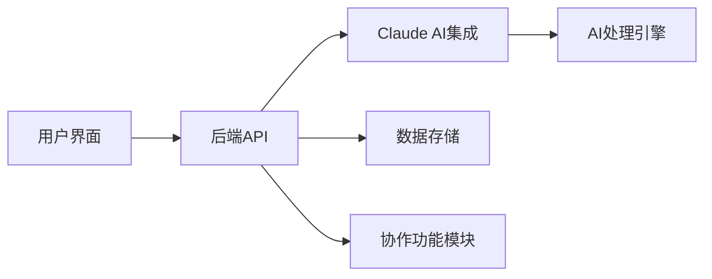
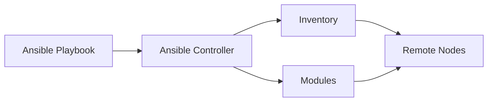
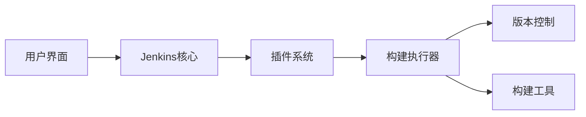
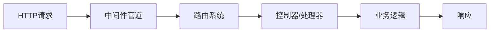

## 今日热点

AI代理和开发者工具成为今日热点，语音交互技术受关注，开源替代品和自动化工具持续受欢迎，反映开发者对效率和AI应用的需求增长。

---

## 热门项目一览

| 排名 | 项目 | 语言 | 今日 | 总计 | 简介 |
|:---:|------|:----:|------:|-----:|------|
| 1 | [different-ai/openwork](https://github.com/different-ai/openwork) | TypeScript | +915 | 18,778 | The open-source alternative... |
| 2 | [affaan-m/ECC](https://github.com/affaan-m/ECC) | JavaScript | +804 | 236,251 | The agent harness performan... |
| 3 | [huggingface/speech-to-speech](https://github.com/huggingface/speech-to-speech) | Python | +628 | 8,934 | Build local voice agents wi... |
| 4 | [pascalorg/editor](https://github.com/pascalorg/editor) | TypeScript | +625 | 20,143 | Create and share 3D archite... |
| 5 | [paperswithbacktest/awesome-systematic-trading](https://github.com/paperswithbacktest/awesome-systematic-trading) | Python | +621 | 11,090 | A curated list of awesome l... |
| 6 | [mvanhorn/last30days-skill](https://github.com/mvanhorn/last30days-skill) | Python | +378 | 55,581 | AI agent skill that researc... |
| 7 | [agavra/tuicr](https://github.com/agavra/tuicr) | Rust | +190 | 1,878 | a code review TUI with vim ... |
| 8 | [microsoft/AI-For-Beginners](https://github.com/microsoft/AI-For-Beginners) | Jupyter Notebook | +155 | 54,050 | 12 Weeks, 24 Lessons, AI fo... |
| 9 | [ChromeDevTools/chrome-devtools-mcp](https://github.com/ChromeDevTools/chrome-devtools-mcp) | TypeScript | +80 | 48,077 | Chrome DevTools for coding ... |
| 10 | [microsoft/PowerToys](https://github.com/microsoft/PowerToys) | C | +70 | 137,144 | Microsoft PowerToys is a co... |
| 11 | [ansible/ansible](https://github.com/ansible/ansible) | Python | +29 | 69,895 | Ansible is a radically simp... |
| 12 | [jenkinsci/jenkins](https://github.com/jenkinsci/jenkins) | Java | +25 | 26,304 | Jenkins automation server |

---

## 趋势洞察

```
┌─────────────────────────────────────────────────────────────────┐
│  AI/ML 工具         ████████████████████████  8 个项目        │
│  其他               █████████                 3 个项目        │
│  开发框架             ███                       1 个项目        │
│  智能家居             ███                       1 个项目        │
│  项目管理             ███                       1 个项目        │
└─────────────────────────────────────────────────────────────────┘
```

---

## 项目深度解读

### 1. different-ai/openwork — [AI协作平台]

> **一句话总结**：开源的Claude协作工具替代品，提供AI辅助的团队工作空间。

#### 价值主张

| 维度 | 说明 |
|------|------|
| **解决痛点** | 提供开源替代方案，摆脱专有AI协作工具依赖 |
| **目标用户** | 开发团队、AI研究人员、需要协作处理AI任务的群体 |
| **核心亮点** | 开源可定制 + Claude集成 + 协作功能 + 自托管支持 + 数据隐私保护 |

#### 技术架构



**技术特色**：
- 基于TypeScript构建，确保类型安全和代码质量
- 开源架构支持自托管，满足数据隐私需求
- 提供Claude AI集成，实现智能辅助功能

#### 热度分析

- 项目获得近19k星，单日新增900+星，表明社区关注度极高
- 零开放问题显示项目维护良好，用户反馈渠道可能已转移或其他方式处理

#### 快速上手

```bash
# 克隆仓库
git clone https://github.com/different-ai/openwork.git

# 安装依赖并启动
cd openwork && npm install && npm run dev
```

#### 注意事项

- 项目许可证信息未知，使用前需确认许可条款
- 作为AI协作工具，可能涉及数据处理和隐私问题，需审慎评估


### 2. affaan-m/ECC — 智能代码优化系统

> **一句话总结**：多平台AI代码工具性能优化系统，提升开发效率与代码质量。

#### 价值主张

| 维度 | 说明 |
|------|------|
| **解决痛点** | AI代码工具性能瓶颈与开发效率低下问题 |
| **目标用户** | AI代码工具使用者与高效开发者 |
| **核心亮点** | 技能增强 + 本能优化 + 记忆管理 + 安全保障 + 研究优先 |

#### 技术架构


**技术特色**：
- 基于JavaScript的跨平台性能优化
- 针对AI代码工具的专用优化策略
- 安全优先的开发理念

#### 热度分析

- 项目获得23万+星标，日增800+，表明项目受高度关注且增长迅速
- 35k+次Fork与零开放问题，反映项目维护良好且社区参与度高

#### 快速上手

```bash
# 安装ECC
npm install ecc

# 初始化配置
ecc init

# 启动优化
ecc start
```

#### 注意事项

- 项目许可证未知，使用前需确认授权条款
- 项目依赖特定AI代码工具，需确保环境兼容


### 3. huggingface/speech-to-speech — 开源语音助手

> **一句话总结**：基于开源模型构建本地语音助手，实现端到端语音交互与隐私保护。

#### 价值主张

| 维度 | 说明 |
|------|------|
| **解决痛点** | 提供本地部署的语音助手方案，无需联网即可使用，保护用户隐私 |
| **目标用户** | 开发者、AI研究员、隐私关注型用户 |
| **核心亮点** | 开源模型 + 本地部署 + 隐私保护 + 多语言支持 + 低延迟响应 |

#### 技术架构


**技术特色**：
- 基于HuggingFace生态模型，支持Whisper等先进语音识别技术
- 端到端语音处理流水线，减少中间转换损失
- 轻量化设计，可在边缘设备运行

#### 热度分析

- 项目近9K星且单日增长600+，表明语音助手领域需求旺盛且增长迅速
- 作为HuggingFace生态项目，依托强大社区支持，模型迭代速度快

#### 快速上手

```bash
# 克隆仓库
git clone https://github.com/huggingface/speech-to-speech.git

# 安装依赖并运行
cd speech-to-speech && pip install -e . && python demo.py
```

#### 注意事项

- 模型运行需要较大计算资源，建议使用GPU加速以获得更好性能
- 不同模型对语言支持程度不同，需根据使用场景选择合适模型


### 4. pascalorg/editor — 3D建筑设计平台

> **一句话总结**：基于Web的3D建筑设计工具，支持实时协作与云端分享。

#### 价值主张

| 维度 | 说明 |
|------|------|
| **解决痛点** | 提供浏览器内运行的3D建筑设计工具，无需专业软件安装 |
| **目标用户** | 建筑师、设计师、城市规划者及教育工作者 |
| **核心亮点** | 实时协作 + 云端存储 + 跨平台访问 + 易用界面 |

#### 技术架构


**技术特色**：
- 使用TypeScript确保代码类型安全，提高大型项目可维护性
- 基于Web的3D渲染技术，无需安装专业软件
- 实时协作架构，支持多人同时编辑项目

#### 热度分析

- 项目获得超过2万星，今日新增625星，表明项目处于快速增长阶段
- Fork数量相对稳定，说明项目具有良好社区参与度和持续贡献

#### 快速上手

```bash
# 克隆项目
git clone https://github.com/pascalorg/editor.git

# 安装依赖
npm install

# 启动开发服务器
npm run dev
```

#### 注意事项

- 项目开源协议未知，商业使用前需确认授权方式
- 项目依赖大量Web技术，对浏览器性能有一定要求
- 大型3D模型可能在低端设备上运行不畅


### 5. paperswithbacktest/awesome-systematic-trading — [量化交易资源库]

> **一句话总结**：系统化交易全栈资源集合，覆盖从基础理论到实践工具的完整生态。

#### 价值主张

| 维度 | 说明 |
|------|------|
| **解决痛点** | 解决量化交易资源分散、学习路径不清晰的问题 |
| **目标用户** | 量化交易开发者、金融分析师、系统交易研究者 |
| **核心亮点** | 资源全面性 + 分类科学性 + 实用导向性 + 社区认可度高 |

#### 技术架构

**技术特色**：
- 采用Awesome List标准格式，便于快速浏览和检索
- 资源分类清晰，覆盖从数据获取到策略回测的完整流程
- 包含可直接参考的代码库和实战案例

#### 热度分析

- 项目Star数超万，单日增长600+，反映量化交易领域持续升温
- Fork数与Star比达1:8，表明项目不仅是收藏资源，更被广泛实践应用

#### 快速上手

```bash
# 克隆项目到本地
git clone https://github.com/paperswithbacktest/awesome-systematic-trading.git

# 查看项目结构
cd awesome-systematic-trading && ls -la
```

#### 注意事项

- 项目本身是资源集合，不包含可直接运行的交易系统
- 使用第三方资源时需注意许可证兼容性问题
- 部分高级策略资源需要扎实的金融和编程基础


### 6. mvanhorn/last30days-skill — AI多平台研究工具

> **一句话总结**：AI智能体技能，跨平台研究热门话题并生成基于事实的综合摘要。

#### 价值主张

| 维度 | 说明 |
|------|------|
| **解决痛点** | 解决用户快速获取多平台关于特定主题综合信息的需求 |
| **目标用户** | 研究人员、内容创作者、市场分析师和决策者 |
| **核心亮点** | 多平台信息聚合 + AI智能分析 + 基于事实的摘要生成 |

#### 技术架构


**技术特色**：
- 多平台API集成技术
- 大型语言模型处理能力
- 信息可信度评估机制

#### 热度分析

- 项目获得5.5万+Star，每日增长378+，表明项目受到高度关注和认可
- 在AI研究工具领域具有显著影响力，是当前热门的AI研究助手之一

#### 快速上手

```bash
# 克隆项目
git clone https://github.com/mvanhorn/last30days-skill.git
cd last30days-skill
# 安装依赖
pip install -r requirements.txt
```

#### 注意事项

- 项目许可证未知，使用前需确认授权条款
- 需确保各平台API访问权限符合服务条款
- 摘准质量依赖于AI模型的准确性和数据来源的可靠性


### 7. agavra/tuicr — vim风格代码审查

> **一句话总结**：基于Rust开发的vim键位绑定代码审查工具，提供高效的终端交互体验。

#### 价值主张

| 维度 | 说明 |
|------|------|
| **解决痛点** | 提供更高效的终端代码审查体验，减少鼠标依赖 |
| **目标用户** | 终端爱好者、vim用户和频繁进行代码审查的开发者 |
| **核心亮点** | vim键位绑定 + TUI界面 + Rust高性能实现 + 轻量级设计 |

#### 技术架构


**技术特色**：
- 使用Rust构建，保证高性能和内存安全
- 基于成熟的TUI库实现原生终端体验
- 完全兼容vim键位绑定，无需学习新操作模式
- 轻量级设计，资源占用少，启动快速

#### 热度分析

- 项目近期热度迅速上升，单日增长190 stars，表明开发者社区对高效代码审查工具的需求强烈
- 作为代码审查工具的新兴选择，在Rust生态系统中占据独特位置，填补了终端代码审查工具的空白

#### 快速上手

```bash
# 安装依赖
cargo install tuicr

# 基本使用
tuicr <repository-url>
```

#### 注意事项

- 项目可能处于早期阶段，功能和稳定性可能有限
- 需要熟悉vim键位绑定才能充分利用
- 需要Rust环境来构建或安装
- 许可证信息不明确，使用前需确认


### 8. microsoft/AI-For-Beginners — AI入门教程

> **一句话总结**：微软推出的12周AI入门课程，通过24个实践课程让所有人都能学习人工智能。

#### 价值主张

| 维度 | 说明 |
|------|------|
| **解决痛点** | 降低AI学习门槛，提供系统化入门路径 |
| **目标用户** | AI初学者、学生、转行者或对AI感兴趣的普通用户 |
| **核心亮点** | 系统化课程结构 + 实践导向 + 微软官方背书 + 多语言支持 + 互动性强 |

#### 技术架构


**技术特色**：
- Jupyter Notebook交互式学习体验
- 循序渐进的课程设计，从基础到应用
- 结合理论与实践，强化学习效果

#### 热度分析

- Star数超5万，日均增长约150，显示极高关注度
- 微软官方项目，在AI学习领域具有重要生态位置

#### 快速上手

```bash
# 克隆仓库
git clone https://github.com/microsoft/AI-For-Beginners.git

# 进入目录并查看课程
cd AI-For-Beginners && ls
```

#### 注意事项

- 需要基本的Python编程知识
- 部分课程可能需要GPU加速才能完全体验


### 9. ChromeDevTools/chrome-devtools-mcp — [开发者工具集成]

> **一句话总结**：Chrome DevTools 与编码代理的集成工具，提供强大的网页调试和开发能力。

#### 价值主张

| 维度 | 说明 |
|------|------|
| **解决痛点** | 为编码代理提供真实的浏览器调试环境，解决网页开发调试难题 |
| **目标用户** | AI 编码代理、自动化测试工具、网页开发辅助系统 |
| **核心亮点** | 完整 Chrome DevTools API + 编程接口 + 跨平台支持 + 自动化调试能力 |

#### 技术架构


**技术特色**：
- 基于 TypeScript 开发，提供类型安全
- 实现完整的 Chrome DevTools 协议
- 支持 MCP (Model Context Protocol) 集成
- 提供编程化的浏览器操作接口

#### 热度分析

- 项目获得超过 48,000 个 Star，日增 80+，表明开发者社区高度关注
- 作为 Chrome DevTools 的官方扩展，拥有强大的生态支持和开发者认可

#### 快速上手

```bash
# 安装项目
npm install chrome-devtools-mcp

# 初始化配置
npx chrome-devtools-mcp init

# 启动开发工具
npx chrome-devtools-mcp start
```

#### 注意事项

- 需要安装 Chrome 浏览器作为后端
- 配置可能需要网络访问权限
- 建议在使用前熟悉 Chrome DevTools API
- 可能需要额外的配置文件来定义代理行为


### 10. microsoft/PowerToys — Windows效率工具集

> **一句话总结**：微软官方开发的Windows系统增强工具集，通过多个实用小工具提升系统操作效率和自定义能力。

#### 价值主张

| 维度 | 说明 |
|------|------|
| **解决痛点** | 解决Windows系统原生功能不足，提升高级用户操作效率 |
| **目标用户** | Windows高级用户、开发者、系统管理员 |
| **核心亮点** | 系统级增强+多工具集成+开源可定制 |

#### 技术架构


**技术特色**：
- 采用模块化设计，各工具独立运行互不干扰
- 深度集成Windows API，实现系统级功能增强
- 使用现代C++开发，兼顾性能与可维护性

#### 热度分析

- Star数超过13万，日均增长约70，表明项目持续受开发者关注
- 作为微软官方开源项目，在Windows生态系统中具有重要地位

#### 快速上手

```bash
# 克隆仓库
git clone https://github.com/microsoft/PowerToys.git

# 构建项目
cd PowerToys
.\build.ps1 -SkipModules

# 安装并运行
.\PowerToys.exe
```

#### 注意事项

- 需要Windows 10或更高版本
- 某些高级功能可能需要管理员权限
- 工具较多，建议根据实际需求选择性安装和使用


### 11. ansible/ansible — IT自动化先锋

> **一句话总结**：基于SSH的无代理自动化平台，使用声明式语言实现应用部署与系统管理。

#### 价值主张

| 维度 | 说明 |
|------|------|
| **解决痛点** | 简化IT基础设施管理复杂性，消除手动操作错误，实现跨环境一致性部署 |
| **目标用户** | 系统管理员、DevOps工程师、IT运维团队和需要自动化的开发人员 |
| **核心亮点** | 无代理架构 + 声明式YAML语言 + SSH连接 + 模块化设计 + 跨平台支持 |

#### 技术架构



**技术特色**：
- 基于SSH的无代理架构，无需在远程节点安装客户端软件
- 使用YAML格式的Playbook定义自动化任务，语法接近自然语言
- 丰富的模块库和插件生态系统，支持各种IT操作和第三方工具集成

#### 热度分析
- 作为开源自动化工具领域的领导者，拥有近7万星标，持续稳定增长，表明其在IT自动化领域的强大影响力
- 社区活跃度高，被Red Hat收购后成为企业级解决方案，与Terraform、Docker等工具形成完整DevOps生态

#### 快速上手

```bash
# 安装Ansible
pip install ansible

# 创建inventory文件
echo "[web]" > inventory.ini
echo "192.168.1.10" >> inventory.ini

# 运行简单ping测试
ansible -i inventory.ini web -m ping
```

#### 注意事项
- Ansible依赖于SSH连接，需要确保目标节点已正确配置SSH访问
- 大规模部署时，需要考虑性能优化，如使用SSH连接池和并行执行
- 复杂环境可能需要编写自定义模块和插件，需要一定的Python开发能力


### 12. jenkinsci/jenkins — CI/CD自动化平台

> **一句话总结**：开源自动化服务器，实现软件构建、测试和部署全流程自动化。

#### 价值主张

| 维度 | 说明 |
|------|------|
| **解决痛点** | 解决软件开发过程中持续集成和持续部署的自动化难题 |
| **目标用户** | 开发团队、DevOps工程师、自动化测试人员 |
| **核心亮点** | 插件生态系统丰富 + 可扩展架构 + 分布式构建支持 + 多环境部署能力 |

#### 技术架构



**技术特色**：
- 基于Java的跨平台架构，支持多种操作系统
- 插件化设计实现功能高度可扩展
- 主从架构支持分布式构建和负载均衡
- 提供REST API实现与其他工具无缝集成

#### 热度分析

- Jenkins作为CI/CD领域领导者，拥有超过26k的Star，持续稳定增长，表明其在DevOps社区中的核心地位稳固。
- 拥有庞大的插件生态系统和活跃的贡献者社区，形成了完善的CI/CD解决方案生态，覆盖从代码管理到部署的全流程。

#### 快速上手

```bash
# 下载并运行Jenkins
java -jar jenkins.war
# 访问 http://localhost:8080
# 初始密码在日志中输出或位于 ~/.jenkins/secrets/initialAdminPassword
```

#### 注意事项

- 需要Java运行环境(JRE或JDK)支持
- 大规模部署时需要合理配置内存和存储资源
- 安全配置需谨慎，特别是对于公开访问的实例
- 插件管理需要定期更新以保持安全性和功能性


### 13. WhiskeySockets/Baileys — WhatsApp API框架

> **一句话总结**：基于Socket的TypeScript/JavaScript API，为WhatsApp Web提供稳定可靠的自动化交互能力。

#### 价值主张

| 维度 | 说明 |
|------|------|
| **解决痛点** | 提供稳定可靠的WhatsApp Web自动化API，突破官方功能限制 |
| **目标用户** | 需要WhatsApp集成功能的开发者、企业自动化应用构建者 |
| **核心亮点** | 类型安全 + Socket连接 + 完整功能覆盖 + 高性能 + 易于集成 |

#### 技术架构


**技术特色**：
- 基于Socket连接实现与WhatsApp Web的双向实时通信
- 提供TypeScript类型定义，增强开发体验和代码安全性
- 支持消息、群组、状态、媒体文件等完整WhatsApp功能

#### 热度分析

- 项目获星超1万，近19星/日增长，表明WhatsApp API需求旺盛且持续增长
- Fork数达3000+，社区活跃度高，开发者积极参与维护和功能扩展

#### 快速上手

```bash
# 安装Baileys
npm install @whiskeysockets/baileys

# 基本使用示例
const { makeWASocket, useMultiFileAuthState } = require('@whiskeysockets/baileys');
const { state, saveCreds } = await useMultiFileAuthState('auth_info');
const sock = makeWASocket({ auth: state });
```

#### 注意事项

- 使用此API需遵守WhatsApp的服务条款，避免账号被封禁
- 项目依赖WhatsApp Web的未公开API，可能随官方更新而失效
- 需妥善处理认证信息，确保安全存储，防止会话泄露


### 14. dotnet/aspnetcore — 跨平台Web框架

> **一句话总结**：ASP.NET Core是微软高性能、模块化的跨平台Web应用开发框架，支持云原生部署。

#### 价值主张

| 维度 | 说明 |
|------|------|
| **解决痛点** | 解决传统ASP.NET仅限Windows平台问题，提供高性能跨平台开发体验 |
| **目标用户** | .NET开发者、企业Web应用开发团队、云原生应用构建者 |
| **核心亮点** | 跨平台支持 + 高性能 + 模块化架构 + 依赖注入 + 开源生态 |

#### 技术架构



**技术特色**：
- Kestrel服务器提供高性能请求处理能力
- 中间件管道支持灵活的请求处理流程定制
- 内置依赖注入容器促进松耦合架构设计

#### 热度分析

- 项目Star数超3.8万且持续稳定增长，表明在Web开发领域有广泛认可度
- 作为.NET Core生态核心组件，拥有庞大开发者社区和丰富第三方库支持

#### 快速上手

```bash
# 创建新Web应用
dotnet new web -n MyWebApp
# 进入项目目录
cd MyWebApp
# 运行应用
dotnet run
```

#### 注意事项

- ASP.NET Core 2.x与3.x/5.x/6.x/7.x之间存在重大API变更，升级时需注意兼容性
- 虽然跨平台支持良好，但某些Windows特定功能可能不完全兼容
- 高并发场景下需合理配置线程池和连接数限制以优化性能


## 今日推荐

| 主题 | 推荐项目 | 亮点 |
|------|----------|------|
| 今日最热 | [different-ai/openwork](https://github.com/different-ai/openwork) | The open-source a... |
| 值得关注 | [affaan-m/ECC](https://github.com/affaan-m/ECC) | The agent harness... |
| 快速上手 | [huggingface/speech-to-speech](https://github.com/huggingface/speech-to-speech) | Build local voice... |
| 长期潜力 | [pascalorg/editor](https://github.com/pascalorg/editor) | Create and share ... |

---

<div align="center">

*Generated on 2026-07-31 | Powered by GitHub Trending Reporter*

</div>