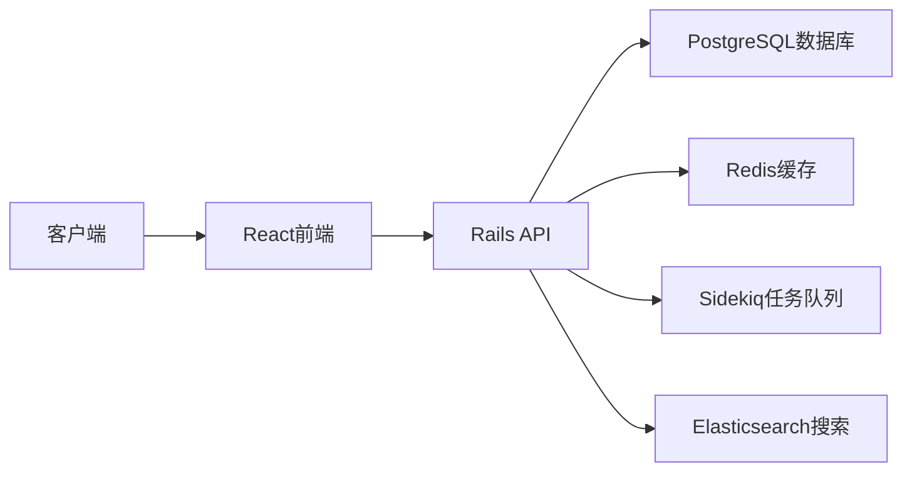

## 今日热点

今日GitHub热榜项目精彩纷呈。

---

## 热门项目一览

| 排名 | 项目 | 语言 | 今日 | 总计 | 简介 |
|:---:|------|:----:|------:|-----:|------|
| 1 | [microsoft/AI-For-Beginners](https://github.com/microsoft/AI-For-Beginners) | Jupyter Notebook | +1,592 | 55,361 | 12 Weeks, 24 Lessons, AI fo... |
| 2 | [different-ai/openwork](https://github.com/different-ai/openwork) | TypeScript | +806 | 19,537 | The open-source alternative... |
| 3 | [paperswithbacktest/awesome-systematic-trading](https://github.com/paperswithbacktest/awesome-systematic-trading) | Python | +763 | 11,780 | A curated list of awesome l... |
| 4 | [mvanhorn/last30days-skill](https://github.com/mvanhorn/last30days-skill) | Python | +658 | 56,246 | AI agent skill that researc... |
| 5 | [1jehuang/jcode](https://github.com/1jehuang/jcode) | Rust | +527 | 14,637 | The most RAM efficient harness |
| 6 | [zhaoxuya520/reverse-skill](https://github.com/zhaoxuya520/reverse-skill) | PowerShell | +335 | 10,777 | Reverse Engineering / Autho... |
| 7 | [agavra/tuicr](https://github.com/agavra/tuicr) | Rust | +335 | 2,164 | a code review TUI with vim ... |
| 8 | [usekaneo/kaneo](https://github.com/usekaneo/kaneo) | TypeScript | +194 | 5,118 | 🎯 All you need. Nothing you... |
| 9 | [deepfakes/faceswap](https://github.com/deepfakes/faceswap) | Python | +93 | 57,002 | Deepfakes Software For All |
| 10 | [geo-tp/ESP32-Bit-Pirate](https://github.com/geo-tp/ESP32-Bit-Pirate) | C++ | +83 | 5,031 | A Hardware Hacking Tool wit... |
| 11 | [chatwoot/chatwoot](https://github.com/chatwoot/chatwoot) | Ruby | +35 | 35,138 | Open-source live-chat, emai... |
| 12 | [github/copilot-sdk](https://github.com/github/copilot-sdk) | Java | +7 | 10,146 | Multi-platform SDK for inte... |

---

## 趋势洞察

```
┌─────────────────────────────────────────────────────────────────┐
│  AI/ML 工具         ████████████████████████  7 个项目        │
│  其他               ██████████                3 个项目        │
│  多媒体应用            ███                       1 个项目        │
│  开发工具             ███                       1 个项目        │
└─────────────────────────────────────────────────────────────────┘
```

---

## 项目深度解读

### 1. microsoft/AI-For-Beginners — AI入门课程

> **一句话总结**：微软推出的12周AI入门课程，通过24节Jupyter Notebook课程实现零基础AI学习。

#### 价值主张

| 维度 | 说明 |
|------|------|
| **解决痛点** | AI学习门槛高，缺乏系统化的入门路径 |
| **目标用户** | AI零基础初学者、希望转行AI的职场人士 |
| **核心亮点** | 结构化课程设计 + 微软官方背书 + 实践导向 + 免费获取 |

#### 技术架构


**技术特色**：
- 基于Jupyter Notebook的交互式学习环境
- 理论与实践相结合的教学方式
- 微软官方AI教学资源，内容权威可靠

#### 热度分析

- 项目获得超过5.5万星，近期增长迅速（单日增长近1600星），表明AI入门学习需求旺盛
- 作为微软官方推出的AI入门课程，在开源教育领域具有重要影响力，是AI学习生态中的重要节点

#### 快速上手

```bash
# 克隆项目到本地
git clone https://github.com/microsoft/AI-For-Beginners.git

# 使用Jupyter Notebook打开课程
cd AI-For-Beginners
jupyter notebook
```

#### 注意事项

- 课程基于微软技术栈，部分内容可能需要Azure云服务支持
- 学习过程中需要一定的Python编程基础
- 建议按照课程顺序学习，因为内容具有递进性


### 2. different-ai/openwork — 开源协作平台

> **一句话总结**：开源替代 Claude Cowork 的协作工具，提供类似功能的免费实现

#### 价值主张

| 维度 | 说明 |
|------|------|
| **解决痛点** | 提供付费工具的开源替代方案，降低协作成本 |
| **目标用户** | 开发团队、个人研究者和预算有限的协作需求用户 |
| **核心亮点** | 完全开源 + 无需订阅费用 + 功能对齐 Claude Cowork |

#### 技术架构


**技术特色**：
- 基于 TypeScript 开发，确保代码质量和类型安全
- 开源架构，支持本地部署和功能扩展
- 可能集成 OpenAI 或其他大模型 API 提供智能功能

#### 热度分析

- 项目单日新增800+星，增长迅速，表明市场需求强烈
- Fork 数量适中，表明项目有稳定的二次开发和采用率

#### 快速上手

```bash
# 克隆项目
git clone https://github.com/different-ai/openwork.git

# 安装依赖
npm install

# 启动开发环境
npm run dev
```

#### 注意事项

- 项目许可证未知，商业使用前需确认授权方式
- 作为替代方案，可能存在功能差异，使用前需评估是否符合需求
- 需要自行部署和维护，与 Claude Cowork 的云服务不同


### 3. paperswithbacktest/awesome-systematic-trading — 量化交易资源库

> **一句话总结**：精选的系统化交易资源库，涵盖库包、策略、教程等全方位量化交易内容。

#### 价值主张

| 维度 | 说明 |
|------|------|
| **解决痛点** | 系统化交易资源分散，缺乏一站式高质量资源整合平台 |
| **目标用户** | 量化交易开发者、策略研究员、金融科技从业者 |
| **核心亮点** | 精选高质量资源 + 多维度分类 + 持续更新维护 + 实用工具整合 + 策略示例丰富 |

#### 技术架构

**技术特色**：
- 采用 Markdown 格式组织内容，便于维护和阅读
- 分类清晰，涵盖从基础到高级的量化交易全流程资源
- 持续更新机制，确保资源的时效性和前沿性

#### 热度分析

- 项目 Star 数超 11k 且单日增长 700+，显示量化交易领域持续升温
- Fork 数近 1500，表明社区积极参与贡献和二次开发

#### 快速上手

```bash
# 克隆仓库获取完整资源列表
git clone https://github.com/paperswithbacktest/awesome-systematic-trading.git

# 浏览在线资源
https://github.com/paperswithbacktest/awesome-systematic-trading
```

#### 注意事项

- 项目本身不包含具体的交易代码，而是提供资源的索引和链接
- 使用时需要自行评估资源的质量和适用性
- 部分资源可能需要一定的金融和编程基础


### 4. mvanhorn/last30days-skill — AI研究助手

> **一句话总结**：多平台信息采集与AI摘要生成工具，整合Reddit、X、YouTube等平台内容。

#### 价值主张

| 维度 | 说明 |
|------|------|
| **解决痛点** | 解决跨平台信息分散与研究效率低下的问题 |
| **目标用户** | 研究人员、分析师、内容创作者、决策者 |
| **核心亮点** | 多源数据采集 + AI智能摘要 + 信息验证标注 |

#### 技术架构


**技术特色**：
- 多平台API集成与数据标准化处理
- 大型语言模型驱动的内容理解与摘要
- 信息来源验证与可信度评估机制

#### 热度分析

- 项目星数超5.6万，近期增长迅猛，今日新增658星，处于AI研究工具前沿
- 零开放问题，社区维护良好，Fork/Star比合理，表明项目稳定性高

#### 快速上手

```bash
# 克隆项目
git clone https://github.com/mvanhorn/last30days-skill.git

# 安装依赖
pip install -r requirements.txt

# 运行示例
python main.py --topic "人工智能发展趋势"
```

#### 注意事项

- 项目许可证信息不明，使用前需确认授权条款
- 依赖多个外部API，需准备相应平台的API密钥
- 作为研究工具，应关注数据来源的可靠性和隐私合规问题


### 6. zhaoxuya520/reverse-skill — AI安全工具路由

> **一句话总结**：AI驱动的逆向工程与渗透测试智能路由工具，支持多种AI编程客户端。

#### 价值主张

| 维度 | 说明 |
|------|------|
| **解决痛点** | 解决逆向工程和渗透测试中工具选择和知识获取的效率问题 |
| **目标用户** | 逆向工程师、渗透测试人员、安全研究人员 |
| **核心亮点** | AI智能路由 + 按需工具链自举 + 自动进化经验库 |

#### 技术架构


**技术特色**：
- PowerShell实现跨平台安全工具集成
- AI智能路由算法优化工具选择
- 动态工具链按需加载机制
- 自动化知识库进化系统

#### 热度分析

- 项目获得超过1万星且持续增长，表明在安全研究领域有较高认可度
- Fork数量适中，反映项目处于成熟维护阶段，社区参与度稳定

#### 快速上手

```bash
# 设置执行策略并运行主脚本
Set-ExecutionPolicy RemoteSigned -Scope CurrentUser
.\reverse-skill.ps1
```

#### 注意事项

- 此工具仅限授权的渗透测试和安全研究使用
- 使用前需要确保符合当地法律法规
- AI路由结果需要人工验证，不能完全依赖自动化决策


### 7. agavra/tuicr — vim 代码审查器

> **一句话总结**：基于 Rust 开发的 vim 风格终端代码审查工具，提供高效直观的代码审查体验。

#### 价值主张

| 维度 | 说明 |
|------|------|
| **解决痛点** | 传统代码审查工具操作繁琐，缺乏高效快捷的交互方式 |
| **目标用户** | 熟悉 vim 键绑定的开发者和需要进行频繁代码审查的团队 |
| **核心亮点** | vim 键绑定支持 + 高效的终端界面 + 轻量级设计 + 快速导航能力 |

#### 技术架构

**技术特色**：
- 基于 Rust 语言开发，提供高性能和内存安全
- 采用 TUI 架构，提供流畅的终端交互体验
- 实现了 vim 键绑定，提高开发者操作效率

#### 热度分析

- 项目获得 2,164 个 star，单日增长 335 个，表明近期关注度迅速攀升
- 虽然 Open Issues 为 0，但 star 数量快速增长，在代码审查工具领域具有一定影响力

#### 快速上手

```bash
# 安装 tuicr
cargo install tuicr

# 使用 tuicr 进行代码审查
tuicr <repository-url>
```

#### 注意事项

- 项目许可证未知，商业使用前需确认许可证类型
- 项目可能需要一定的 vim 使用经验才能充分利用其功能


### 8. usekaneo/kaneo — 精简项目管理

> **一句话总结**：轻量级开源项目管理工具，提供必要功能，拒绝冗余设计。

#### 价值主张

| 维度 | 说明 |
|------|------|
| **解决痛点** | 解决传统项目管理工具功能臃肿、操作复杂的问题 |
| **目标用户** | 中小型团队、敏捷开发者和注重效率的个人 |
| **核心亮点** | 界面简洁 + 功能精简 + 易于上手 + 开源免费 + 高度可定制 |

#### 技术架构


**技术特色**：
- 基于TypeScript开发，确保代码质量和类型安全
- 采用模块化架构，便于功能扩展和维护
- 前后端一体化设计，减少集成复杂度

#### 热度分析

- 项目Star数快速增长，近一日增加194个，显示社区高度关注
- Fork数相对较少，表明项目可能处于早期阶段，尚未形成广泛分支

#### 快速上手

```bash
# 克隆项目
git clone https://github.com/usekaneo/kaneo.git

# 安装依赖
npm install

# 启动开发服务器
npm run dev
```

#### 注意事项

- 项目许可证信息不明确，商业使用前需确认授权条款
- Open Issues为0，可能表明项目刚起步，社区支持体系尚未完善


### 9. deepfakes/faceswap — AI换脸工具

> **一句话总结**：基于深度学习的面部交换技术，可生成高逼真度的换脸视频。

#### 价值主张

| 维度 | 说明 |
|------|------|
| **解决痛点** | 提供简单易用的工具，使普通用户能够创建高质量的换脸内容 |
| **目标用户** | 内容创作者、视频编辑爱好者、特效制作人员、AI技术研究者 |
| **核心亮点** | 基于深度学习 + 高精度面部识别 + 支持多种视频格式 + 实时处理能力 |

#### 技术架构


**技术特色**：
- 采用GAN(生成对抗网络)技术实现逼真的面部替换
- 使用dlib库进行高精度面部关键点检测
- 支持多种深度学习模型，如Autoencoder, First Order Motion Model等
- 提供命令行和GUI两种操作界面
- 使用CUDA加速处理，提高生成效率

#### 热度分析

- 项目获得超过5.7万星，近期保持稳定增长，表明其在换脸领域具有显著影响力
- 拥有活跃的开发社区，大量fork表明项目被广泛研究和二次开发，在AI视频生成领域占据重要位置

#### 快速上手

```bash
# 克隆项目
git clone https://github.com/deepfakes/faceswap.git
cd faceswap
# 安装依赖
pip install -r requirements.txt
# 运行训练
python faceswap.py train -A <actor_folder> -B <victim_folder>
```

#### 注意事项

- 此技术可能涉及隐私和伦理问题，使用时需遵守相关法律法规
- 换脸视频可能被用于恶意目的，如虚假信息传播，建议负责任地使用
- 项目处理需要较强的计算能力，建议使用NVIDIA GPU加速
- 面部替换效果受原始视频质量和面部角度影响较大
- 某些国家和地区对深度伪造技术有法律限制，使用前应了解当地法律


### 10. geo-tp/ESP32-Bit-Pirate — 多功能硬件黑客工具

> **一句话总结**：ESP32多功能硬件黑客工具，提供Web界面支持多种通信协议。

#### 价值主张

| 维度 | 说明 |
|------|------|
| **解决痛点** | 为硬件黑客提供统一工具，支持多种通信协议和便捷Web操作 |
| **目标用户** | 硬件安全研究员、电子工程师和物联网安全专家 |
| **核心亮点** | ESP32硬件平台 + Web-based CLI + 多协议支持框架 |

#### 技术架构


**技术特色**：
- ESP32作为核心处理器提供足够的计算能力和无线连接
- Web-based CLI实现远程操作和可视化控制界面
- 模块化协议支持框架便于扩展和适配新通信协议

#### 热度分析

- 项目获得5031个star且今日增长83个，显示项目热度持续上升，受到硬件安全领域关注
- Fork数量408表明社区有较高参与度，在硬件安全工具领域具有一定影响力

#### 快速上手

```bash
# 克隆项目
git clone https://github.com/geo-tp/ESP32-Bit-Pirate.git

# 安装依赖
cd ESP32-Bit-Pirate
pip install -r requirements.txt
```

#### 注意事项

- 由于项目许可证未知，使用时需注意版权问题
- 作为硬件黑客工具，使用时需遵守相关法律法规和道德准则
- 可能需要一定的硬件知识和电子技能才能充分利用工具功能


### 11. chatwoot/chatwoot — 开源客服平台

> **一句话总结**：开源全渠道客服平台，整合聊天、邮件等多渠道支持，提供企业级客户服务解决方案。

#### 价值主张

| 维度 | 说明 |
|------|------|
| **解决痛点** | 解决企业多渠道客户分散、服务效率低、成本高的客户服务管理难题 |
| **目标用户** | 需要整合多渠道客户服务的中大型企业和开发团队 |
| **核心亮点** | 开源免费+全渠道整合+可自托管+API丰富+界面友好 |

#### 技术架构



**技术特色**：
- 基于Ruby on Rails构建的全栈开源客服平台
- 采用微服务架构设计，支持高并发场景
- 提供丰富的API和Webhook集成能力

#### 热度分析

- 项目Star数超过3.5万，近期保持稳定增长，表明社区认可度高
- 作为开源客服系统替代方案，生态扩展迅速，插件和集成丰富

#### 快速上手

```bash
# 克隆仓库
git clone https://github.com/chatwoot/chatwoot.git
# 安装依赖
bundle install
# 启动开发服务器
rails s
```

#### 注意事项

- 需要Ruby环境和Rails框架支持
- 部署时需要配置数据库和Redis
- 生产环境建议使用Docker容器化部署


### 12. github/copilot-sdk — AI代码助手SDK

> **一句话总结**：跨平台SDK赋能开发者将GitHub Copilot AI代码助手无缝集成至各类应用与服务。

#### 价值主张

| 维度 | 说明 |
|------|------|
| **解决痛点** | 简化AI代码助手集成流程，降低开发者实现智能代码辅助的技术门槛 |
| **目标用户** | 需要为应用添加AI代码辅助功能的应用开发者和技术团队 |
| **核心亮点** | 跨平台支持 + 无缝Copilot集成 + 简化API调用 + 智能代码建议 + 开箱即用 |

#### 技术架构


**技术特色**：
- 多语言API接口支持
- 智能上下文感知能力
- 安全的认证授权机制

#### 热度分析

- 高关注度项目，持续稳定增长，社区活跃度高
- 处于AI开发工具前沿，有望成为开发者必备的AI辅助集成方案

#### 快速上手

```bash
# 安装Copilot SDK
mvn com.github.copilot:copilot-sdk:latest

# 初始化Copilot客户端
CopilotClient client = new CopilotClient("YOUR_GITHUB_TOKEN");

# 获取代码建议
List<Suggestion> suggestions = client.getCodeSuggestions(context);
```

#### 注意事项

- 需要有效的GitHub Copilot访问权限
- 注意API调用频率限制
- 确保遵守GitHub Copilot的使用条款
- 需要适当处理可能的网络延迟和错误情况


## 今日推荐

| 主题 | 推荐项目 | 亮点 |
|------|----------|------|
| 今日最热 | [microsoft/AI-For-Beginners](https://github.com/microsoft/AI-For-Beginners) | 12 Weeks, 24 Less... |
| 值得关注 | [different-ai/openwork](https://github.com/different-ai/openwork) | The open-source a... |
| 快速上手 | [paperswithbacktest/awesome-systematic-trading](https://github.com/paperswithbacktest/awesome-systematic-trading) | A curated list of... |
| 长期潜力 | [mvanhorn/last30days-skill](https://github.com/mvanhorn/last30days-skill) | AI agent skill th... |

---

<div align="center">

*Generated on 2026-08-01 | Powered by GitHub Trending Reporter*

</div>