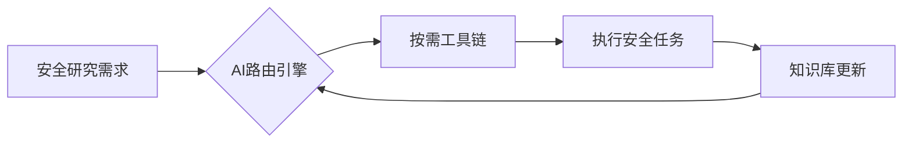
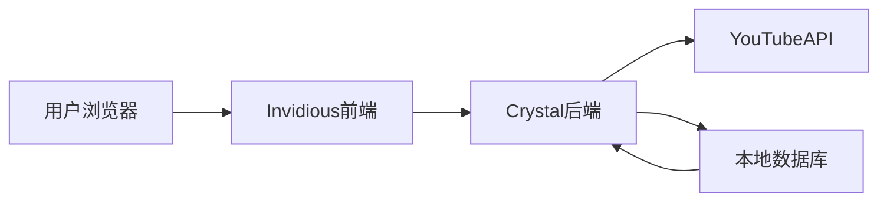
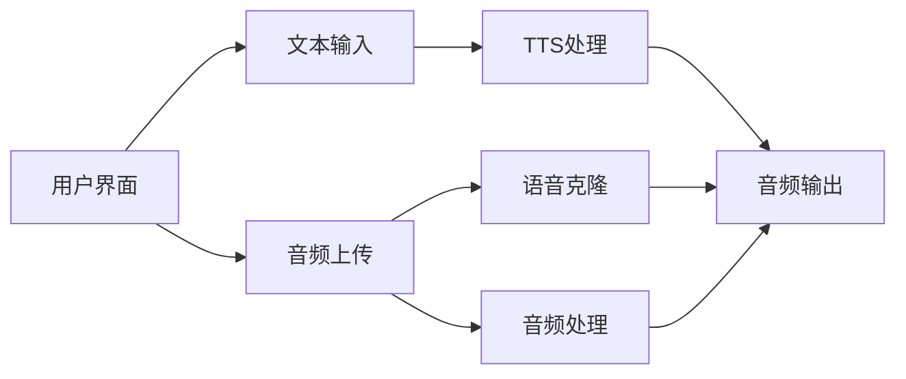

## 今日热点

AI入门教程持续火热，语音AI技术爆发式增长，AI代理框架与企业级工具成为主流趋势。

---

## 热门项目一览

| 排名 | 项目 | 语言 | 今日 | 总计 | 简介 |
|:---:|------|:----:|------:|-----:|------|
| 1 | [zhaoxuya520/reverse-skill](https://github.com/zhaoxuya520/reverse-skill) | PowerShell | +1,320 | 11,947 | Reverse Engineering / Autho... |
| 2 | [microsoft/AI-For-Beginners](https://github.com/microsoft/AI-For-Beginners) | Jupyter Notebook | +949 | 57,297 | 12 Weeks, 24 Lessons, AI fo... |
| 3 | [usekaneo/kaneo](https://github.com/usekaneo/kaneo) | TypeScript | +760 | 5,704 | 🎯 All you need. Nothing you... |
| 4 | [paperswithbacktest/awesome-systematic-trading](https://github.com/paperswithbacktest/awesome-systematic-trading) | Python | +523 | 12,259 | A curated list of awesome l... |
| 5 | [huggingface/speech-to-speech](https://github.com/huggingface/speech-to-speech) | Python | +442 | 10,224 | Build local voice agents wi... |
| 6 | [iv-org/invidious](https://github.com/iv-org/invidious) | Crystal | +435 | 21,628 | Invidious is an alternative... |
| 7 | [TencentCloud/TencentDB-Agent-Memory](https://github.com/TencentCloud/TencentDB-Agent-Memory) | TypeScript | +227 | 10,308 | TencentDB Agent Memory is a... |
| 8 | [bytedance/deer-flow](https://github.com/bytedance/deer-flow) | Python | +209 | 78,744 | An open-source long-horizon... |
| 9 | [github/copilot-sdk](https://github.com/github/copilot-sdk) | Java | +142 | 10,282 | Multi-platform SDK for inte... |
| 10 | [microsoft/generative-ai-for-beginners](https://github.com/microsoft/generative-ai-for-beginners) | Jupyter Notebook | +108 | 114,228 | 21 Lessons, Get Started Bui... |
| 11 | [microsoft/TRELLIS.2](https://github.com/microsoft/TRELLIS.2) | Python | +107 | 9,940 | Native and Compact Structur... |
| 12 | [abus-aikorea/voice-pro](https://github.com/abus-aikorea/voice-pro) | Python | +58 | 11,764 | Gradio WebUI for creators a... |

---

## 趋势洞察

```
┌─────────────────────────────────────────────────────────────────┐
│  AI/ML 工具         ████████████████████████  10 个项目        │
│  其他               ████████████              5 个项目        │
└─────────────────────────────────────────────────────────────────┘
```

---

## 项目深度解读

### 1. zhaoxuya520/reverse-skill — [安全技能路由]

> **一句话总结**：AI驱动的逆向工程与安全研究技能路由包，集成多AI客户端的智能安全工具集。

#### 价值主张

| 维度 | 说明 |
|------|------|
| **解决痛点** | 安全研究工具分散、技能获取效率低、知识更新滞后 |
| **目标用户** | 逆向工程师、渗透测试人员、安全研究员 |
| **核心亮点** | AI智能路由 + 按需工具链自举 + 自进化知识库 + 多AI客户端支持 |

#### 技术架构



**技术特色**：
- 基于PowerShell构建的跨平台安全工具集
- AI智能匹配最适合的安全研究方法
- 动态工具链加载与资源优化
- 支持多种主流AI编程客户端集成

#### 热度分析

- 项目近期获得大量关注，单日新增Stars超过1300，表明安全社区对该项目高度认可
- 作为安全研究工具集，在开源安全工具生态中具有独特定位，填补了AI辅助安全研究的空白

#### 快速上手

```bash
# 克隆项目
git clone https://github.com/zhaoxuya520/reverse-skill.git

# 初始化环境
cd reverse-skill
powershell -ExecutionPolicy Bypass -File setup.ps1
```

#### 注意事项

- 项目仅授权用于合法的安全研究和授权渗透测试
- 使用前需确保遵守相关法律法规和道德准则
- 工具链可能包含敏感功能，需谨慎使用并注意数据安全


### 2. microsoft/AI-For-Beginners — AI零基础课程

> **一句话总结**：微软官方推出的12周系统化AI入门课程，零门槛学习人工智能核心概念。

#### 价值主张

| 维度 | 说明 |
|------|------|
| **解决痛点** | 破解AI学习高门槛，提供从零开始的系统化学习路径 |
| **目标用户** | AI初学者、学生、希望转行AI的职场人士 |
| **核心亮点** | 微软官方出品 + 24节系统课程 + 实践导向 + 多语言支持 + 免费开放 |

#### 技术架构

**技术特色**：
- 基于Jupyter Notebook的交互式学习环境
- 渐进式课程设计，从基础概念到实际应用
- 涵盖机器学习、深度学习、计算机视觉等AI核心领域

#### 热度分析

- 项目获57k+星标，近千日增星，反映AI学习需求持续高涨
- 微软背书的教育项目，在AI学习领域具有权威性和影响力

#### 快速上手

```bash
# 克隆项目到本地
git clone https://github.com/microsoft/AI-For-Beginners.git

# 使用Jupyter Notebook打开课程
cd AI-For-Beginners
jupyter notebook
```

#### 注意事项

- 需要基本的Python编程知识
- 建议按照12周进度系统学习，不要跳跃
- 部分实验可能需要GPU加速支持


### 3. usekaneo/kaneo — 轻量项目管理

> **一句话总结**：极简主义开源项目管理工具，专注用户需求，提供必要功能，拒绝冗余复杂。

#### 价值主张

| 维度 | 说明 |
|------|------|
| **解决痛点** | 传统项目管理工具功能臃肿、学习曲线陡峭，用户被迫使用大量不需要的功能 |
| **目标用户** | 中小型团队、个人开发者、追求效率的敏捷实践者 |
| **核心亮点** | 极简主义设计 + 开源可定制 + 专注核心功能 + 用户友好界面 + 高效协作工具 |

#### 技术架构


**技术特色**：
- 基于TypeScript构建，提供类型安全
- 采用模块化设计，便于扩展定制
- 响应式界面，支持多设备访问

#### 热度分析

- 项目近期获得大量关注，今日Star数激增760，表明社区对其极简理念高度认可
- 虽然Open Issues为0，可能表明项目早期阶段或问题处理高效，但需关注后续社区反馈机制

#### 快速上手

```bash
# 克隆项目
git clone https://github.com/usekaneo/kaneo.git

# 安装依赖
npm install

# 启动服务
npm start
```

#### 注意事项

- 项目许可证未知，使用前需确认商业使用限制
- 作为新兴项目，生态系统和插件支持可能有限
- 功能相对精简，可能无法满足复杂项目管理需求


### 4. paperswithbacktest/awesome-systematic-trading — 量化交易资源库

> **一句话总结**：一个精选的系统化交易资源库，涵盖策略、工具、教程等全方位内容。

#### 价值主张

| 维度 | 说明 |
|------|------|
| **解决痛点** | 解决系统化交易资源分散、质量参差不齐的问题 |
| **目标用户** | 量化交易开发者、系统化交易研究者、金融科技从业者 |
| **核心亮点** | 资源精选性 + 分类全面性 + 持续更新 + 社区驱动 + 实用导向 |

#### 技术架构

**技术特色**：
- 采用Markdown组织结构清晰
- 使用分类标签便于导航
- 包含开源工具和商业资源对比
- 提供直接链接和简短描述
- 社区贡献机制保持资源更新

#### 热度分析

- 项目获得超12K星标且持续增长，显示量化交易社区高度认可
- 在量化交易领域具有标杆性地位，是开发者的必看资源

#### 快速上手

```bash
# 克隆仓库查看完整资源列表
git clone https://github.com/paperswithbacktest/awesome-systematic-trading.git

# 直接访问README查看在线资源
https://github.com/paperswithbacktest/awesome-systematic-trading
```

#### 注意事项

- 项目本身不提供交易代码，而是资源导航
- 部分资源可能需要付费订阅或商业许可
- 使用前应评估资源的时效性和适用性
- 注意区分学术资源和实战工具的差异


### 5. huggingface/speech-to-speech — 开源语音助手

> **一句话总结**：基于开源模型构建本地语音助手，实现隐私保护、低延迟的语音交互体验

#### 价值主张

| 维度 | 说明 |
|------|------|
| **解决痛点** | 解决云端语音助手隐私泄露、延迟高、依赖网络的问题 |
| **目标用户** | 语音AI开发者、隐私敏感用户、智能硬件制造商 |
| **核心亮点** | 开源模型 + 本地部署 + 隐私保护 + 端到端处理 + 跨平台 |

#### 技术架构


**技术特色**：
- 端到端语音处理流水线，无需云端依赖
- 支持多种轻量级开源模型，适配不同硬件
- 模块化设计，易于扩展和定制

#### 热度分析
- 项目Star数破万，近期增长迅速，反映社区对隐私AI工具的高度关注
- 作为Hugging Face生态系统项目，享有强大的技术背书和开发资源支持

#### 快速上手

```bash
# 安装依赖
pip install transformers torch torchaudio

# 基本语音识别示例
python -c "from transformers import pipeline; stt = pipeline('automatic-speech-recognition'); result = stt('audio.wav'); print(result['text'])"
```

#### 注意事项
- 本地运行需要较强的计算资源，建议使用GPU加速
- 模型精度和响应速度受硬件配置影响，可能不如云端服务
- 需要一定的AI专业知识进行模型选择和调优


### 6. iv-org/invidious — YouTube隐私替代前端

> **一句话总结**：Invidious 是一个开源的 YouTube 替代前端，提供无广告、隐私友好的视频浏览体验。

#### 价值主张

| 维度 | 说明 |
|------|------|
| **解决痛点** | 解决 YouTube 广告过多、隐私问题及算法推荐限制用户选择的问题 |
| **目标用户** | 注重隐私、厌恶广告、希望获得无干扰视频体验的用户 |
| **核心亮点** | 无广告浏览 + 隐私保护 + 开源透明 + 自托管选项 |

#### 技术架构



**技术特色**：
- 使用 Crystal 语言开发，性能高效且内存占用低
- 响应式前端设计，适配多种设备
- 支持多种实例部署方式，包括 Docker 和自托管

#### 热度分析

- 项目 Star 数超过 21,000，近期增长迅速，表明用户对 YouTube 替代方案需求强烈
- 作为开源项目，社区活跃度高，但 Issues 为 0 可能表示问题通过其他渠道解决或项目维护良好

#### 快速上手

```bash
# 使用 Docker 快速部署
docker run -d --name invidious -p 3000:3000 quay.io/invidious/invidious:latest

# 或使用 docker-compose
git clone https://github.com/iv-org/invidious.git
cd invidious
docker-compose up -d
```

#### 注意事项

- 需要注意 YouTube API 可能的变化，这会影响 Invidious 的功能
- 自托管时需要考虑法律合规性，尤其是版权和地区法规
- 项目依赖第三方 API，长期稳定性可能受外部因素影响


### 7. TencentDB-Agent-Memory — AI记忆中心

> **一句话总结**：腾讯云推出的AI团队记忆中心，将对话、文档和代码转化为可重用的记忆资产，供多代理共享。

#### 价值主张

| 维度 | 说明 |
|------|------|
| **解决痛点** | 解决AI代理间信息孤岛问题，实现团队知识资产统一管理共享 |
| **目标用户** | AI系统架构师、智能代理开发团队、知识管理平台建设者 |
| **核心亮点** | 团队记忆中心 + 四种记忆资产类型 + 跨框架共享 + 智能知识治理 |

#### 技术架构


**技术特色**：
- 基于TypeScript开发，确保代码质量和类型安全
- 支持Chat Memory、Skill、LLM-Wiki、Code-Graph四种记忆资产
- 提供记忆资产治理机制，确保知识质量与安全

#### 热度分析

- Star数超万且持续高增长，反映项目在AI记忆管理领域的重要影响力
- 零Open Issues表明项目维护良好，社区可能通过其他渠道进行问题反馈

#### 快速上手

```bash
# 克隆项目
git clone https://github.com/TencentCloud/TencentDB-Agent-Memory.git

# 安装依赖
npm install
```

#### 注意事项

- 项目许可证未知，使用前需确认授权条款
- 作为腾讯云项目，可能需要与腾讯云服务集成才能发挥最大价值
- 项目文档可能需要进一步查看以了解完整的使用方法和API


### 8. bytedance/deer-flow — 智能任务代理平台

> **一句话总结**：deer-flow是一个开源的长时程SuperAgent控制平台，通过多种组件协作处理从分钟到小时级别的复杂任务。

#### 价值主张

| 维度 | 说明 |
|------|------|
| **解决痛点** | 解决AI代理无法长时间处理复杂任务的问题 |
| **目标用户** | 需要AI处理长时间复杂任务的开发者和研究人员 |
| **核心亮点** | 沙盒隔离 + 记忆系统 + 多代理协作 + 工具集成 |

#### 技术架构


**技术特色**：
- 长时程任务处理能力，支持分钟到小时级别任务
- 多代理协作框架，实现复杂任务分解与并行处理
- 沙盒安全执行环境，确保任务隔离与安全
- 记忆系统支持持续学习与上下文保持

#### 热度分析

- 项目获得近8万星，日增长约200星，表明项目受到广泛关注
- Fork数与Star数比例适中，表明项目既有高关注度也有较高采用率

#### 快速上手

```bash
# 克隆项目
git clone https://github.com/bytedance/deer-flow.git
cd deer-flow

# 安装依赖
pip install -r requirements.txt

# 运行示例
python examples/basic_task.py
```

#### 注意事项

- 项目许可证信息未知，使用前需确认许可条款
- 项目Open Issues为0，可能意味着社区支持渠道有限
- 长时程任务处理需要充足的计算资源
- 沙盒环境的安全性需要额外验证


### 9. github/copilot-sdk — 跨平台AI助手集成

> **一句话总结**：GitHub官方推出的多平台SDK，使开发者能轻松将Copilot AI助手能力集成到各类应用中。

#### 价值主张

| 维度 | 说明 |
|------|------|
| **解决痛点** | 简化Copilot Agent的集成流程，降低应用AI助手功能的开发门槛 |
| **目标用户** | 需要在应用中集成AI助手功能的开发者、软件企业 |
| **核心亮点** | 跨平台支持 + 官方SDK + 简化集成流程 + AI能力扩展 |

#### 技术架构


**技术特色**：
- 多平台兼容性，支持多种操作系统和开发环境
- 模块化设计，便于按需集成Copilot功能
- 提供统一的API接口，简化开发流程

#### 热度分析

- Star数超万且持续增长，显示开发者社区对AI助手集成工具的高度关注和需求
- 作为GitHub官方项目，在开发者生态中具有独特地位，有望成为AI辅助开发的标准工具

#### 快速上手

```bash
# 添加依赖
mvn com.github.copilot:copilot-sdk:latest

# 初始化Copilot
CopilotAgent agent = new CopilotAgent("your-api-key");

# 使用助手功能
String response = agent.ask("How to optimize this code?");
```

#### 注意事项

- 需要有效的GitHub API密钥才能使用Copilot服务
- 可能需要订阅Copilot服务才能获得完整功能
- 集成时需注意数据隐私和安全问题
- 不同平台可能有特定的配置要求和限制


### 10. microsoft/generative-ai-for-beginners — AI入门教程

> **一句话总结**：微软官方推出的21课生成式AI入门教程，系统化引导初学者掌握AI应用开发。

#### 价值主张

| 维度 | 说明 |
|------|------|
| **解决痛点** | 为初学者提供结构化学习路径，降低生成式AI技术门槛 |
| **目标用户** | 对生成式AI感兴趣但缺乏基础知识的技术初学者 |
| **核心亮点** | 21个结构化课程 + 微软官方出品 + 实践导向 + Jupyter交互式学习 |

#### 技术架构


**技术特色**：
- 基于Jupyter Notebook的交互式学习环境
- 覆盖从基础到高级的完整学习路径
- 结合微软AI工具和服务的实践案例

#### 热度分析

- 高星高fork项目，日均增长108星，表明生成式AI学习需求旺盛
- 微软官方出品，社区活跃度高，已成为生成式AI入门领域的标杆资源

#### 快速上手

```bash
# 克隆项目到本地
git clone https://github.com/microsoft/generative-ai-for-beginners.git

# 在本地运行Jupyter Notebook
cd generative-ai-for-beginners
jupyter notebook
```

#### 注意事项

- 项目依赖Python环境，建议提前配置好Python和相关依赖
- 部分课程可能需要访问微软云服务，可能需要创建账户
- 建议按顺序学习21个课程，以获得完整的学习体验


### 11. microsoft/TRELLIS.2 — AI 3D生成

> **一句话总结**：基于结构化潜在表示的高效3D生成框架，实现原生紧凑的3D模型创建。

#### 价值主张

| 维度 | 说明 |
|------|------|
| **解决痛点** | 解决3D生成中潜在表示冗余和结构不紧凑的问题 |
| **目标用户** | 3D内容创作者、AI研究人员、游戏开发人员 |
| **核心亮点** | 结构化潜在表示+高效3D生成+紧凑模型表示+原生处理能力 |

#### 技术架构


**技术特色**：
- 结构化潜在空间表示，提高3D生成效率
- 紧凑的模型表示，减少计算资源需求
- 原生处理能力，直接优化3D生成流程

#### 热度分析

- 项目获得近万星，近期增长迅速，表明在3D生成领域具有显著影响力
- 作为微软开源项目，在AI 3D生成领域占据重要生态位置

#### 快速上手

```bash
# 克隆仓库
git clone https://github.com/microsoft/TRELLIS.2.git
cd TRELLIS.2

# 安装依赖
pip install -r requirements.txt

# 运行示例
python examples/basic_generation.py
```

#### 注意事项

- 项目许可证未知，商业使用前需确认授权
- 作为研究项目，可能需要一定的机器学习/深度学习基础知识
- 可能需要高性能GPU来运行3D生成任务


### 12. abus-aikorea/voice-pro — AI语音创作工具

> **一句话总结**：集成多种TTS与语音克隆技术，提供全方位语音创作解决方案的Gradio WebUI。

#### 价值主张

| 维度 | 说明 |
|------|------|
| **解决痛点** | 简化AI语音创作流程，无需编程即可使用高级语音技术 |
| **目标用户** | 内容创作者、开发者、语音合成爱好者 |
| **核心亮点** | 多种TTS引擎 + 零样本语音克隆 + 音频处理工具集成 |

#### 技术架构



**技术特色**：
- 基于Gradio构建的直观Web界面，降低使用门槛
- 集成多种前沿语音技术，包括Edge-TTS、F5-TTS、CosyVoice等
- 提供端到端音频处理流程，从文本到最终音频

#### 热度分析

- 项目获得11,764个Star，日均增长约58个，表明语音AI领域需求旺盛
- 作为语音技术集成工具，在AI内容创作生态中占据重要位置

#### 快速上手

```bash
# 克隆项目
git clone https://github.com/abus-aikorea/voice-pro.git

# 安装依赖
pip install -r requirements.txt

# 启动应用
python app.py
```

#### 注意事项

- 项目依赖较多，确保Python环境兼容
- 部分功能可能需要额外配置API密钥
- 音频处理可能需要较高计算资源，建议在良好硬件环境下运行


### 13. NomaDamas/k-skill — 韩AI技能库

> **一句话总结**：为韩国人打造的AI技能集合，专注于将智能体韩国化并提供本地化功能。

#### 价值主张

| 维度 | 说明 |
|------|------|
| **解决痛点** | 为韩国用户解决AI智能体的语言和文化适应问题 |
| **目标用户** | 韩国开发者和对韩语AI功能感兴趣的用户 |
| **核心亮点** | 韩语本地化 + 文化适应性 + 智能体定制化 |

#### 技术架构


**技术特色**：
- 基于JavaScript的AI本地化框架
- 韩语自然语言处理优化
- 文化适应性算法

#### 热度分析

- 项目拥有6,740个Star和796个Fork，显示较高关注度，近期新增53个Star表明活跃度持续上升
- 无开放Issues显示项目进入稳定维护阶段，有稳定的用户群体和贡献者社区

#### 快速上手

```bash
# 克隆项目
git clone https://github.com/NomaDamas/k-skill.git

# 安装依赖
cd k-skill
npm install
```

#### 注意事项

- 由于许可证未知，商业使用前需确认授权条款
- 项目可能需要韩语环境支持才能正常运行
- 建议查看项目README获取最新使用指南


### 14. github/gh-stack — GitHub PR链管理

> **一句话总结**：简化GitHub依赖链式PR的管理和操作流程，提高团队协作效率

#### 价值主张

| 维度 | 说明 |
|------|------|
| **解决痛点** | 解决GitHub上依赖链式PR难以管理和合并的问题 |
| **目标用户** | 频繁使用GitHub进行团队协作的开发者和项目维护者 |
| **核心亮点** | + 支持PR堆叠管理 + 自动依赖处理 + 简化合并流程 + 保持PR历史清晰 |

#### 技术架构


**技术特色**：
- 基于Go语言实现，跨平台兼容性强
- 利用GitHub API实现自动化PR管理
- 设计轻量级，无需复杂配置即可使用

#### 热度分析

- 项目近期热度明显上升，今日增加46个star，表明开发者对PR管理工具有较高需求
- Fork数量相对较少，说明项目更偏向实用型工具而非二次开发型项目

#### 快速上手

```bash
# 安装
go install github.com/gh-stack/gh-stack@latest

# 初始化
gh-stack init

# 创建堆叠PR
gh-stack push
```

#### 注意事项

- 需要安装并配置GitHub CLI作为依赖
- 可能需要特定GitHub仓库权限才能正常操作PR
- 对于大型代码库，可能需要额外配置以优化性能


### 15. ansible/ansible — IT自动化引擎

> **一句话总结**：基于Python的IT自动化工具，通过SSH实现无代理配置管理与应用部署。

#### 价值主张

| 维度 | 说明 |
|------|------|
| **解决痛点** | 简化复杂IT环境的自动化管理，消除多平台手动配置的繁琐与错误 |
| **目标用户** | DevOps工程师、系统管理员、云基础设施架构师 |
| **核心亮点** | 无代理架构 + YAML声明式语言 + 丰富模块库 + 简单易学 + 跨平台支持 |

#### 技术架构


**技术特色**：
- 基于Python开发，利用SSH进行通信，无需在目标节点安装代理
- 采用模块化设计，通过Ansible Galaxy共享和重用模块
- 使用YAML编写Playbook，实现声明式配置管理
- 支持幂等操作，确保多次执行不会改变已正确配置的系统状态
- 内置强大的变量系统和条件判断，实现复杂场景的自动化

#### 热度分析

- 高Star数和持续增长表明Ansible在IT自动化领域处于领先地位，拥有广泛的用户基础和认可度
- 作为Red Hat支持的开源项目，Ansible在企业级自动化工具中占据重要位置，与Chef、Puppet等形成竞争互补关系

#### 快速上手

```bash
# 安装Ansible
pip install ansible

# 创建_inventory_文件定义目标主机
echo "webserver ansible_host=192.168.1.10" > inventory

# 创建简单playbook
echo "---" > playbook.yml
echo "- hosts: webserver" >> playbook.yml
echo "  tasks:" >> playbook.yml
echo "    - name: Install nginx" >> playbook.yml
echo "      apt: name=nginx state=present" >> playbook.yml

# 运行playbook
ansible-playbook -i inventory playbook.yml
```

#### 注意事项

- Ansible依赖于SSH连接，确保目标节点已正确配置SSH访问
- 对于Windows节点，需要使用WinRM协议而非SSH，需要额外配置
- 复杂环境建议使用Ansible Tower/AWX进行集中管理和权限控制


## 今日推荐

| 主题 | 推荐项目 | 亮点 |
|------|----------|------|
| 今日最热 | [zhaoxuya520/reverse-skill](https://github.com/zhaoxuya520/reverse-skill) | Reverse Engineeri... |
| 值得关注 | [microsoft/AI-For-Beginners](https://github.com/microsoft/AI-For-Beginners) | 12 Weeks, 24 Less... |
| 快速上手 | [usekaneo/kaneo](https://github.com/usekaneo/kaneo) | 🎯 All you need. N... |
| 长期潜力 | [paperswithbacktest/awesome-systematic-trading](https://github.com/paperswithbacktest/awesome-systematic-trading) | A curated list of... |

---

<div align="center">

*Generated on 2026-08-02 | Powered by GitHub Trending Reporter*

</div>