## 今日热点

AI教育与轻量级推理技术引领今日热榜，Microsoft教育项目与本地化AI解决方案备受关注，AI代理技能库呈现爆发式增长。

---

## 热门项目一览

| 排名 | 项目 | 语言 | 今日 | 总计 | 简介 |
|:---:|------|:----:|------:|-----:|------|
| 1 | [microsoft/AI-For-Beginners](https://github.com/microsoft/AI-For-Beginners) | Jupyter Notebook | +2,629 | 59,151 | 12 Weeks, 24 Lessons, AI fo... |
| 2 | [zhaoxuya520/reverse-skill](https://github.com/zhaoxuya520/reverse-skill) | PowerShell | +1,141 | 13,622 | Reverse Engineering / Autho... |
| 3 | [lyogavin/airllm](https://github.com/lyogavin/airllm) | Jupyter Notebook | +819 | 25,724 | AirLLM 70B inference with s... |
| 4 | [codecrafters-io/build-your-own-x](https://github.com/codecrafters-io/build-your-own-x) | Markdown | +674 | 534,923 | Master programming by recre... |
| 5 | [Panniantong/Agent-Reach](https://github.com/Panniantong/Agent-Reach) | Python | +659 | 64,756 | Give your AI agent eyes to ... |
| 6 | [TencentCloud/TencentDB-Agent-Memory](https://github.com/TencentCloud/TencentDB-Agent-Memory) | TypeScript | +602 | 11,111 | TencentDB Agent Memory is a... |
| 7 | [microsoft/generative-ai-for-beginners](https://github.com/microsoft/generative-ai-for-beginners) | Jupyter Notebook | +588 | 114,818 | 21 Lessons, Get Started Bui... |
| 8 | [usekaneo/kaneo](https://github.com/usekaneo/kaneo) | TypeScript | +496 | 6,200 | 🎯 All you need. Nothing you... |
| 9 | [esengine/DeepSeek-Reasonix](https://github.com/esengine/DeepSeek-Reasonix) | Go | +333 | 29,108 | DeepSeek-native AI coding a... |
| 10 | [iv-org/invidious](https://github.com/iv-org/invidious) | Crystal | +305 | 21,995 | Invidious is an alternative... |
| 11 | [different-ai/openwork](https://github.com/different-ai/openwork) | TypeScript | +280 | 20,353 | The open-source alternative... |
| 12 | [mvanhorn/last30days-skill](https://github.com/mvanhorn/last30days-skill) | Python | +206 | 56,896 | AI agent skill that researc... |

---

## 趋势洞察

```
┌─────────────────────────────────────────────────────────────────┐
│  AI/ML 工具         ████████████████████████  10 个项目        │
│  其他               ████████████              5 个项目        │
└─────────────────────────────────────────────────────────────────┘
```

---

## 项目深度解读

### 1. microsoft/AI-For-Beginners — [AI入门课程]

> **一句话总结**：微软推出的12周AI入门教程，通过24节课帮助初学者系统学习人工智能基础知识。

#### 价值主张

| 维度 | 说明 |
|------|------|
| **解决痛点** | 降低AI学习门槛，提供系统化入门路径 |
| **目标用户** | AI初学者、学生、希望转行AI领域人士 |
| **核心亮点** | 微软官方出品 + 系统化课程设计 + Jupyter Notebook实践 + 多语言版本支持 |

#### 技术架构


**技术特色**：
- 基于Jupyter Notebook的交互式学习体验
- 多语言版本支持，扩大受众范围
- 结合理论与实践，强调动手能力

#### 热度分析

- 项目获得近6万星，近期增长迅速，表明AI入门需求旺盛
- 微软品牌背书加上系统化课程设计，使其成为AI入门领域的标杆项目

#### 快速上手

```bash
# 克隆仓库
git clone https://github.com/microsoft/AI-For-Beginners.git

# 启动Jupyter Notebook
cd AI-For-Beginners
jupyter notebook
```

#### 注意事项

- 项目依赖于Python环境和相关AI库，需提前配置
- 部分课程可能需要GPU支持进行深度学习实验
- 建议按照顺序学习，确保知识连贯性


### 2. zhaoxuya520/reverse-skill — [逆向技能路由]

> **一句话总结**：AI驱动的逆向工程与渗透测试工具链，自动路由和自举安全技能库

#### 价值主张

| 维度 | 说明 |
|------|------|
| **解决痛点** | 解决安全研究人员工具分散、技能获取困难的问题 |
| **目标用户** | 逆向工程师、渗透测试人员、安全研究员 |
| **核心亮点** | AI智能路由 + 按需工具链自举 + 自动进化知识库 + 多AI客户端支持 + 系统化技能整理 |

#### 技术架构

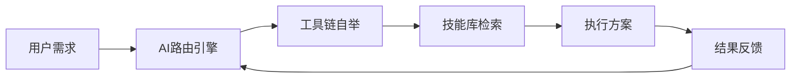

**技术特色**：
- AI驱动的智能任务路由系统
- 动态工具链按需部署机制
- 自进化的安全知识库体系
- 多AI客户端统一接口层
- PowerShell跨平台执行环境

#### 热度分析

- 项目Star数超过13K，单日增长超1K，呈现爆发式增长态势，表明安全领域对AI辅助工具的迫切需求
- Fork数与Star数比例约1:7，表明用户更倾向于直接使用而非二次开发，项目定位偏向实用工具

#### 快速上手

```bash
# 克隆项目
git clone https://github.com/zhaoxuya520/reverse-skill.git

# 进入目录并执行
cd reverse-skill
.\reverse-skill.ps1 -task "reverse binary"
```

#### 注意事项

- 本项目仅适用于授权的渗透测试和安全研究用途
- 使用前需确保已安装PowerShell 7.0+环境
- 部分工具链可能需要额外配置或权限
- AI功能依赖网络连接和相应API服务


### 3. lyogavin/airllm — 小显存大模型

> **一句话总结**：创新技术使4GB显存设备也能高效运行70B大语言模型。

#### 价值主张

| 维度 | 说明 |
|------|------|
| **解决痛点** | 解决大模型推理需要高端GPU的高门槛问题 |
| **目标用户** | 资源有限的研究者和小型开发团队 |
| **核心亮点** | 显存优化 + 推理加速 + 低成本部署 |

#### 技术架构

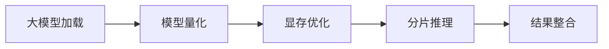

**技术特色**：
- 4GB显存运行70B模型的技术突破
- 高效的显存管理和计算优化
- 保持模型性能的同时降低硬件要求

#### 热度分析

- 高星增长日增800+，显示大模型硬件需求迫切
- 社区活跃度高，Fork/Star比达11.2%，参与度良好

#### 快速上手

```bash
git clone https://github.com/lyogavin/airllm.git
cd airllm
pip install -r requirements.txt
jupyter notebook
```

#### 注意事项

- 可能需要特定版本的CUDA支持
- 模型推理速度可能低于高端硬件配置
- 需要一定的AI基础设施知识才能正确部署


### 4. codecrafters-io/build-your-own-x — 技术实践教程

> **一句话总结**：通过重建流行技术提供项目化编程学习路径，理论与实践相结合。

#### 价值主张

| 维度 | 说明 |
|------|------|
| **解决痛点** | 解决编程学习中理论与实践脱节问题，通过实际项目加深理解 |
| **目标用户** | 有编程基础希望提升实践能力的开发者，深入理解技术原理的学习者 |
| **核心亮点** | 项目化学习方式 + 覆盖多种流行技术 + 提供循序渐进指导 + 实践导向 + 开源社区支持 |

#### 技术架构

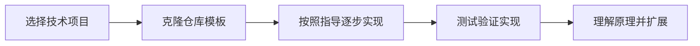

**技术特色**：
- 多语言实现相同技术，适合不同背景开发者
- 项目结构清晰，每个步骤有明确目标和测试
- 注重原理讲解而非简单复制粘贴

#### 热度分析

- 项目拥有53万+星标且持续快速增长，表明其在开发者学习资源中的极高认可度
- 作为开源学习项目，形成了活跃的实践社区，贡献者不断扩充技术覆盖面

#### 快速上手

```bash
# 克隆仓库
git clone https://github.com/codecrafters-io/build-your-own-x.git

# 选择感兴趣的项目目录开始学习
cd build-your-own-x/build-your-own-shell
```

#### 注意事项

- 项目需要一定的编程基础，不适合完全零基础的学习者
- 建议按照项目顺序逐步完成，不要跳过步骤以充分理解实现原理
- 每个项目都有测试用例，确保通过所有测试再进入下一步


### 5. Panniantong/Agent-Reach — 多平台AI爬虫

> **一句话总结**：一个命令行工具，为AI代理提供无API限制的多平台互联网内容访问能力。

#### 价值主张

| 维度 | 说明 |
|------|------|
| **解决痛点** | 突破各平台API限制，实现AI对全网内容的统一访问 |
| **目标用户** | AI开发者、研究人员、需要多平台数据整合的用户 |
| **核心亮点** | + 多平台统一访问 + 无API费用限制 + 命令行操作简单 + 支持中文平台 |

#### 技术架构

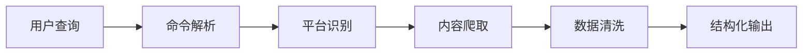

**技术特色**：
- 使用无头浏览器技术模拟真实用户访问
- 统一多平台数据接口，简化AI接入
- 实现中文特色平台(如B站、小红书)的特殊解析

#### 热度分析

- 项目Star数超过6万，近一日新增659，表明项目正处于快速增长期
- 作为开源工具，解决了AI获取互联网数据的痛点，社区活跃度高

#### 快速上手

```bash
# 安装项目
pip install agent-reach

# 使用示例
agent-reach --platform reddit --query "AI trends" --output data.json
```

#### 注意事项

- 需要注意各平台的使用条款，避免违反爬虫政策
- 项目可能需要定期更新以应对平台反爬虫策略变化
- 中文平台的特殊处理可能导致某些功能不完善


### 6. TencentCloud/TencentDB-Agent-Memory — AI记忆中心

> **一句话总结**：将对话、文档和代码转化为可共享的AI记忆资产，实现团队级智能记忆管理。

#### 价值主张

| 维度 | 说明 |
|------|------|
| **解决痛点** | AI代理缺乏长期记忆和知识共享能力，导致重复学习效率低下 |
| **目标用户** | AI开发团队、企业AI应用构建者、多代理系统架构师 |
| **核心亮点** | 多源数据整合 + 四种记忆资产 + 跨框架共享 + 团队级治理 |

#### 技术架构


**技术特色**：
- 基于TypeScript构建，提供类型安全开发体验
- 支持多源异构数据整合与结构化处理
- 提供记忆资产的智能检索与跨框架共享机制

#### 热度分析

- 项目获得超11k Star，近期增长迅速(+602/天)，显示社区高度关注
- 作为腾讯云推出的AI记忆解决方案，在企业级AI应用领域具有较强影响力

#### 快速上手

```bash
# 安装TencentDB Agent Memory
npm install @tencentcloud/tencentdb-agent-memory

# 初始化记忆中心
tencentdb-agent-memory init

# 添加记忆资产
tencentdb-agent-memory add --type chat --file conversation.json
```

#### 注意事项

- 项目目前没有公开的许可证信息，使用前需确认授权条款
- 作为腾讯云产品，可能需要与腾讯云服务集成才能发挥完整功能
- 项目文档可能需要进一步补充以支持快速上手


### 7. microsoft/generative-ai-for-beginners — 微软AI入门课程

> **一句话总结**：微软官方出品的21课生成式AI教程，帮助初学者系统掌握AI应用构建技能。

#### 价值主张

| 维度 | 说明 |
|------|------|
| **解决痛点** | 为AI初学者提供结构化学习路径，降低生成式AI技术门槛 |
| **目标用户** | AI初学者、开发转型者、技术爱好者、学生群体 |
| **核心亮点** | 微软官方出品 + 21个结构化课程 + 实践导向 + 覆盖主流技术 |

#### 技术架构

**技术特色**：
- 基于Jupyter Notebook的交互式学习体验
- 涵盖OpenAI、Hugging Face等主流AI平台
- 提供可直接运行的代码示例和项目实践

#### 热度分析

- 项目获星11万+且日增近600，反映生成式AI学习需求激增
- Fork数高达6万+，表明学习者积极参与实践和二次开发

#### 快速上手

```bash
# 克隆项目仓库
git clone https://github.com/microsoft/generative-ai-for-beginners.git

# 进入项目目录并启动Jupyter Notebook
cd generative-ai-for-beginners
jupyter notebook
```

#### 注意事项

- 需要安装Python环境和必要的AI框架依赖
- 部分课程可能需要API密钥（如OpenAI API）
- 建议按顺序学习21个课程，确保知识连贯性


### 8. usekaneo/kaneo — 简约项目管理工具

> **一句话总结**：轻量级开源项目管理工具，提供核心功能，避免复杂干扰，提升团队协作效率。

#### 价值主张

| 维度 | 说明 |
|------|------|
| **解决痛点** | 传统项目管理工具功能冗余，增加学习成本和工作负担 |
| **目标用户** | 追求高效工作流程的中小型团队和个人开发者 |
| **核心亮点** | 极简界面设计 + 核心项目管理功能 + 开源可定制 |

#### 技术架构

**技术特色**：
- 基于TypeScript开发，提供类型安全和高代码质量
- 采用现代前端框架，确保流畅的用户体验
- 模块化架构设计，便于功能扩展和维护

#### 热度分析

- 项目获得6200个Star，近496个新增，表明项目近期热度高，用户认可度强
- 0个Open Issues，说明项目维护良好，问题响应及时，用户满意度高

#### 快速上手

```bash
# 克隆项目
git clone https://github.com/usekaneo/kaneo.git

# 安装依赖
npm install

# 启动开发服务器
npm run dev
```

#### 注意事项

- 项目许可证未知，商业使用前需确认授权条款
- 作为新兴项目，生态系统和社区支持可能还在发展中


### 9. esengine/DeepSeek-Reasonix — 终端AI编程助手

> **一句话总结**：基于DeepSeek的持续运行AI编程助手，优化前缀缓存提升终端开发效率。

#### 价值主张

| 维度 | 说明 |
|------|------|
| **解决痛点** | 解决传统AI编程工具会话中断和上下文丢失问题 |
| **目标用户** | 终端开发者、程序员、需要持续AI辅助编码的技术人员 |
| **核心亮点** | DeepSeek原生集成 + 前缀缓存稳定性 + 终端环境优化 + 长时间运行支持 |

#### 技术架构

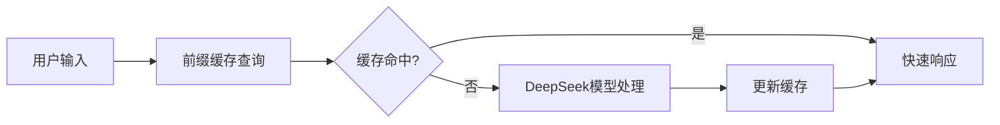

**技术特色**：
- 基于Go语言开发，轻量高效且跨平台兼容
- 采用前缀缓存技术显著提高响应速度和稳定性
- 专为终端环境优化，提供无缝的命令行交互体验

#### 热度分析

- 项目获得近3万星，单日新增333星，增长势头强劲，表明开发者认可度高
- Fork数近2千，显示社区活跃度高，参与者积极进行二次开发和改进

#### 快速上手

```bash
# 安装DeepSeek-Reasonix
go install github.com/esengine/DeepSeek-Reasonix@latest

# 启动终端AI编程助手
deepseek-reasonix
```

#### 注意事项

- 项目许可信息未知，商业使用前需确认授权情况
- 使用时需要有效的DeepSeek API密钥
- 作为持续运行的终端工具，建议在适当环境下使用以避免资源占用过高


### 10. iv-org/invidious — YouTube替代前端

> **一句话总结**：无广告、注重隐私的YouTube替代前端，提供更好的视频浏览体验

#### 价值主张

| 维度 | 说明 |
|------|------|
| **解决痛点** | 提供无广告、免跟踪的YouTube访问方式，保护用户隐私 |
| **目标用户** | 注重隐私、厌恶广告、追求简洁界面的视频内容消费者 |
| **核心亮点** | 无广告界面 + 自托管能力 + API接口 + 隐私保护 + 跨平台支持 |

#### 技术架构

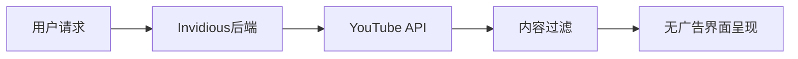

**技术特色**：
- 使用Crystal语言编写，兼具高性能与简洁性
- 完全自托管，无需第三方服务依赖
- 提供RESTful API，便于第三方应用集成

#### 热度分析

- 项目Star数接近22k，日均增长300+，表明用户对无广告YouTube前端需求强劲
- 作为YouTube生态系统中的重要替代方案，在开源社区和注重隐私用户群体中影响力显著

#### 快速上手

```bash
docker run -d --name invidious -p 3000:3000 quay.io/invidious/invidious:latest
```

#### 注意事项
- 需自行解决YouTube API访问限制问题
- 部署时应遵守YouTube服务条款，避免法律风险
- 依赖第三方YouTubeAPI，可能存在不稳定因素


### 11. different-ai/openwork — 协作工具开源版

> **一句话总结**：基于opencil驱动的开源协作平台，提供Claude Cowork的开源替代方案。

#### 价值主张

| 维度 | 说明 |
|------|------|
| **解决痛点** | 提供开源的Claude Cowork替代方案，解决闭源工具的限制与隐私问题 |
| **目标用户** | 需要团队协作工具的开发者和开源项目贡献者 |
| **核心亮点** | 开源替代品 + opencil驱动 + 团队协作功能 + 隐私保障 + 自托管能力 |

#### 技术架构

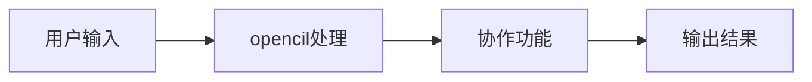

**技术特色**：
- 基于TypeScript开发，提供类型安全保障
- opencil驱动架构，兼容OpenAI API接口
- 开源设计，支持私有化部署和自定义扩展

#### 热度分析

- Star数超2万且持续增长，项目获得社区广泛认可
- 0个Open Issues反映项目成熟度高或问题处理机制完善

#### 快速上手

```bash
# 克隆项目
git clone https://github.com/different-ai/openwork.git

# 安装依赖
npm install

# 启动项目
npm run dev
```

#### 注意事项

- 项目许可证未知，使用前需确认授权条款
- 作为Claude Cowork的替代品，需注意API兼容性问题
- 建议查看项目文档了解具体部署要求和配置选项


### 12. mvanhorn/last30days-skill — 跨平台AI研究

> **一句话总结**：AI代理技能，跨平台研究任意话题并生成基于事实的综合摘要。

#### 价值主张

| 维度 | 说明 |
|------|------|
| **解决痛点** | 信息过载时代，快速获取多平台高质量、结构化的主题研究摘要 |
| **目标用户** | 研究人员、分析师、内容创作者、决策者、AI开发者 |
| **核心亮点** | 多平台数据整合 + AI智能摘要 + 事实核查 + 自动化研究 |

#### 技术架构

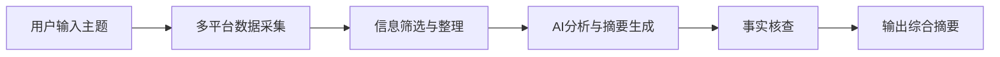

**技术特色**：
- 跨平台API集成与数据采集技术
- 大语言模型驱动的信息分析与摘要生成
- 多源信息交叉验证与事实核查机制

#### 热度分析

- 项目获得近5.7万星标，日均增长200+，表明其功能价值获得高度认可
- 作为AI工具生态中的重要组件，填补了多平台信息整合与智能摘要的空白

#### 快速上手

```bash
# 安装依赖
pip install -r requirements.txt

# 运行示例
python last30days-skill.py "research topic"

# 或通过API调用
curl -X POST http://localhost:8000/research -d "topic=your_topic"
```

#### 注意事项

- 项目许可证未知，商业使用前需确认授权条款
- 依赖多个外部平台API，可能面临速率限制或访问变更
- AI生成内容的准确性需人工验证，不应完全依赖


### 13. NomaDamas/k-skill — 韩国人技能库

> **一句话总结**：为韩国用户设计的AI代理技能集合，提供本地化服务体验。

#### 价值主张

| 维度 | 说明 |
|------|------|
| **解决痛点** | 解决韩国用户在AI交互中的本地化需求和文化适应性 |
| **目标用户** | 韩国AI开发者、需要韩语支持的用户 |
| **核心亮点** | 韩语本地化 + 文化适配 + 韩国特色功能集成 + 多场景应用 |

#### 技术架构

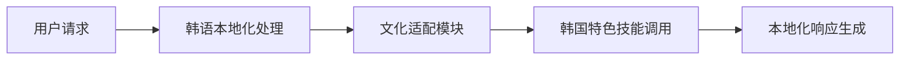

**技术特色**：
- 韩语自然语言处理优化
- 韩国文化背景知识库集成
- 模块化技能系统设计

#### 热度分析

- 项目获得近7K stars且持续增长，表明在韩国AI开发者群体中认可度高
- 无开放issues反映项目成熟度高，社区维护良好

#### 快速上手

```bash
# 克隆项目
git clone https://github.com/NomaDamas/k-skill.git

# 安装依赖
npm install
```

#### 注意事项

- 项目主要针对韩国用户，韩语能力是使用前提
- 需要了解韩国文化背景以充分利用本地化功能
- 许可证信息不明确，使用前需确认授权条款


### 14. antirez/ds4 — 本地AI推理

> **一句话总结**：高性能DeepSeek模型本地推理引擎，支持多GPU后端，实现大模型本地化部署。

#### 价值主张

| 维度 | 说明 |
|------|------|
| **解决痛点** | 解决大模型云端依赖问题，实现本地高性能推理 |
| **目标用户** | 需要本地部署DeepSeek模型的研究者和开发者 |
| **核心亮点** | 跨平台支持 + 高性能优化 + 低延迟推理 |

#### 技术架构

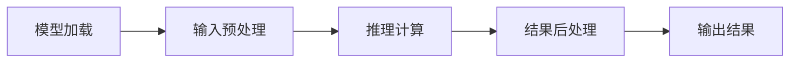

**技术特色**：
- 支持Metal、CUDA和ROCm多GPU后端
- 高度优化的内存管理和计算效率
- 专为DeepSeek 4 Flash和PRO模型定制

#### 热度分析

- 项目获得超20K Star，近期增长迅速，表明社区高度关注
- 作为知名开发者的新项目，在AI推理领域具有重要影响力

#### 快速上手

```bash
# 克隆仓库
git clone https://github.com/antirez/ds4.git
cd ds4
# 编译项目
make
```

#### 注意事项

- 项目需要较新的GPU硬件支持
- 模型文件可能较大，需要足够的存储空间
- 编译可能需要特定的依赖库和环境配置


### 15. HarbourMasters/Lighthouse — 轻量级监控

> **一句话总结**：用C语言编写的轻量级系统监控工具，提供高效资源监测与告警能力。

#### 价值主张

| 维度 | 说明 |
|------|------|
| **解决痛点** | 解决系统资源监控的实时性与性能开销平衡问题 |
| **目标用户** | 系统管理员、DevOps工程师和嵌入式开发者 |
| **核心亮点** | 低资源占用 + 实时监控 + 可扩展架构 + 跨平台支持 |

#### 技术架构

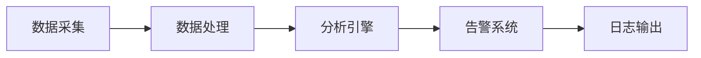

**技术特色**：
- 基于事件驱动的轻量级架构设计
- 采用高效数据结构减少内存占用
- 支持插件式扩展机制增强灵活性

#### 热度分析

- 项目Star数增长迅速，今日新增65个Star，表明社区关注度持续上升
- Fork数相对较少，可能项目处于早期阶段，尚未形成大规模分支生态

#### 快速上手

```bash
# 克隆项目
git clone https://github.com/HarbourMasters/Lighthouse.git
cd Lighthouse

# 构建项目
mkdir build && cd build
cmake ..
make

# 运行程序
./lighthouse --help
```

#### 注意事项

- 项目许可证未知，商业使用前需确认授权条款
- 由于是C语言项目，需注意内存管理和安全性问题
- 项目文档不完整，可能需要阅读源码了解使用方法


## 今日推荐

| 主题 | 推荐项目 | 亮点 |
|------|----------|------|
| 今日最热 | [microsoft/AI-For-Beginners](https://github.com/microsoft/AI-For-Beginners) | 12 Weeks, 24 Less... |
| 值得关注 | [zhaoxuya520/reverse-skill](https://github.com/zhaoxuya520/reverse-skill) | Reverse Engineeri... |
| 快速上手 | [lyogavin/airllm](https://github.com/lyogavin/airllm) | AirLLM 70B infere... |
| 长期潜力 | [codecrafters-io/build-your-own-x](https://github.com/codecrafters-io/build-your-own-x) | Master programmin... |

---

<div align="center">

*Generated on 2026-08-03 | Powered by GitHub Trending Reporter*

</div>