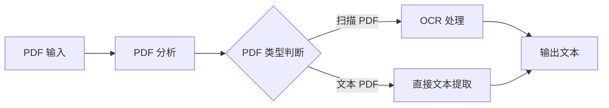
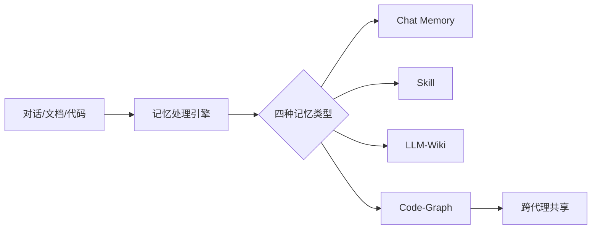
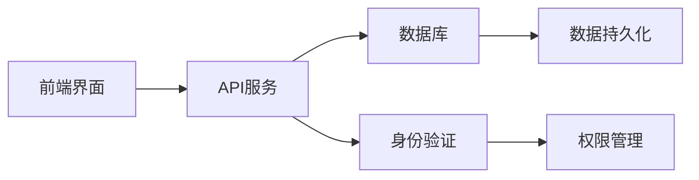
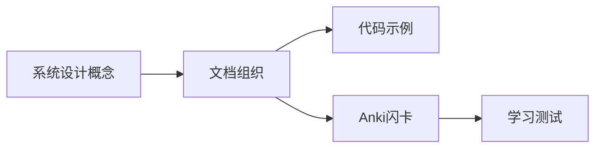

## 今日热点

AI模型优化与边缘部署成为焦点，同时AI代理生态持续扩展，从通用工具到垂直领域应用全面开花，显示技术正在从理论研究向实用落地转变。

---

## 热门项目一览

| 排名 | 项目 | 语言 | 今日 | 总计 | 简介 |
|:---:|------|:----:|------:|-----:|------|
| 1 | [zhaoxuya520/reverse-skill](https://github.com/zhaoxuya520/reverse-skill) | PowerShell | +2,446 | 15,876 | Reverse Engineering / Autho... |
| 2 | [microsoft/AI-For-Beginners](https://github.com/microsoft/AI-For-Beginners) | Jupyter Notebook | +1,902 | 60,791 | 12 Weeks, 24 Lessons, AI fo... |
| 3 | [firecrawl/pdf-inspector](https://github.com/firecrawl/pdf-inspector) | Rust | +1,699 | 8,336 | Fast Rust library for PDF i... |
| 4 | [TencentCloud/TencentDB-Agent-Memory](https://github.com/TencentCloud/TencentDB-Agent-Memory) | TypeScript | +1,090 | 12,154 | TencentDB Agent Memory is a... |
| 5 | [lyogavin/airllm](https://github.com/lyogavin/airllm) | Jupyter Notebook | +1,085 | 27,180 | AirLLM 70B inference with s... |
| 6 | [Panniantong/Agent-Reach](https://github.com/Panniantong/Agent-Reach) | Python | +1,057 | 65,752 | Give your AI agent eyes to ... |
| 7 | [esengine/DeepSeek-Reasonix](https://github.com/esengine/DeepSeek-Reasonix) | Go | +883 | 29,971 | DeepSeek-native AI coding a... |
| 8 | [microsoft/generative-ai-for-beginners](https://github.com/microsoft/generative-ai-for-beginners) | Jupyter Notebook | +775 | 115,585 | 21 Lessons, Get Started Bui... |
| 9 | [usekaneo/kaneo](https://github.com/usekaneo/kaneo) | TypeScript | +665 | 6,885 | 🎯 All you need. Nothing you... |
| 10 | [jamiepine/voicebox](https://github.com/jamiepine/voicebox) | TypeScript | +412 | 48,700 | The open-source AI voice st... |
| 11 | [iv-org/invidious](https://github.com/iv-org/invidious) | Crystal | +402 | 22,279 | Invidious is an alternative... |
| 12 | [antirez/ds4](https://github.com/antirez/ds4) | C | +384 | 20,373 | DeepSeek 4 Flash and PRO lo... |

---

## 趋势洞察

```
┌─────────────────────────────────────────────────────────────────┐
│  AI/ML 工具         ████████████████████████  11 个项目        │
│  其他               ████████                  4 个项目        │
│  智能家居             ██                        1 个项目        │
└─────────────────────────────────────────────────────────────────┘
```

---

## 项目深度解读

### 1. zhaoxuya520/reverse-skill — AI安全路由

> **一句话总结**：AI驱动的逆向工程与渗透测试技能路由系统，智能匹配安全工具链与任务需求。

#### 价值主张

| 维度 | 说明 |
|------|------|
| **解决痛点** | 解决安全研究人员在逆向和渗透测试中工具选择和知识获取的效率问题 |
| **目标用户** | 逆向工程师、渗透测试人员、安全研究人员 |
| **核心亮点** | AI智能路由 + 按需工具链自举 + 自动进化知识库 + 多AI客户端支持 |

#### 技术架构


**技术特色**：
- 基于AI的智能任务路由系统，自动匹配最合适的逆向和分析工具
- 按需加载工具链，避免资源浪费，提高执行效率
- 知识库自动进化机制，持续优化安全分析流程
- 多AI客户端兼容架构，扩展性强

#### 热度分析

- 项目近期热度飙升，单日增长2,446个Star，表明安全社区高度关注
- 高Fork数显示社区积极进行二次开发，形成活跃的衍生生态

#### 快速上手

```bash
# 克隆项目
git clone https://github.com/zhaoxuya520/reverse-skill.git

# 进入目录并执行
cd reverse-skill
powershell -ExecutionPolicy Bypass -File ./reverse-skill.ps1
```

#### 注意事项

- 使用前需确保理解相关法律法规，仅限授权测试环境
- 依赖多个AI客户端，需确保网络连接稳定
- 工具链可能包含受控软件，需遵守相关许可证要求


### 2. microsoft/AI-For-Beginners — AI入门课程

> **一句话总结**：微软推出的面向初学者的12周AI学习计划，24节课程，让AI学习变得平易近人。

#### 价值主张

| 维度 | 说明 |
|------|------|
| **解决痛点** | 降低AI学习门槛，提供系统化学习路径，解决初学者入门困难问题 |
| **目标用户** | AI初学者、学生、希望转行AI领域的技术人员 |
| **核心亮点** | 微软官方出品 + 系统化课程设计 + 实践导向 + 多语言支持 + 社区活跃 |

#### 技术架构


**技术特色**：
- 基于Jupyter Notebook的交互式学习体验
- 结构化的12周学习计划，循序渐进
- 结合理论与实践，提供丰富的代码示例
- 支持多种编程语言和工具
- 社区驱动的学习资源更新

#### 热度分析

- 项目获得超过6万星，近期增长迅速，表明AI入门教育需求旺盛
- 作为微软官方教育项目，在AI学习领域具有显著影响力和权威性

#### 快速上手

```bash
# 克隆项目仓库
git clone https://github.com/microsoft/AI-For-Beginners.git

# 进入项目目录
cd AI-For-Beginners

# 使用Jupyter Notebook打开课程
jupyter notebook
```

#### 注意事项

- 需要基本的编程知识，建议至少了解Python基础
- 部分课程可能需要GPU资源支持，特别是涉及深度学习的部分
- 课程内容会随着AI技术发展而更新，建议关注项目最新动态


### 3. firecrawl/pdf-inspector — 高性能 PDF 解析器

> **一句话总结**：Rust 高性能 PDF 检查库，智能分类扫描与文本 PDF，实现智能路由决策。

#### 价值主张

| 维度 | 说明 |
|------|------|
| **解决痛点** | PDF 处理效率低，无法区分扫描与文本 PDF 导致处理策略不当 |
| **目标用户** | 需要处理大量 PDF 的开发者、数据分析师和文档管理系统 |
| **核心亮点** | 高性能 Rust 实现 + 智能 PDF 分类 + 快速文本提取 + 轻量级依赖 |

#### 技术架构



**技术特色**：
- 基于 Rust 的高性能实现，内存效率高
- 智能检测算法区分扫描与原生文本 PDF
- 轻量级设计，减少依赖，适合集成到各种系统

#### 热度分析

- 项目获得 8,336 个 Star，今日新增 1,699，显示强劲增长趋势
- 作为 Firecrawl 生态组件，受益于母项目热度，处于文档处理工具前沿位置

#### 快速上手

```bash
# 添加依赖到 Cargo.toml
firecrawl-pdf-inspector = "0.1.0"

# 基本使用示例
use firecrawl_pdf_inspector::PdfInspector;
let inspector = PdfInspector::new();
let result = inspector.inspect("example.pdf");
```

#### 注意事项

- 需要注意 OCR 功能可能需要额外依赖，会增加二进制大小
- 对于加密或特殊格式的 PDF 可能支持有限
- 需要确保 Rust 环境正确配置以获得最佳性能


### 4. TencentCloud/TencentDB-Agent-Memory — AI记忆管理平台

> **一句话总结**：团队级AI代理记忆中心，将对话、文档和代码转化为可共享的四种记忆资产。

#### 价值主张

| 维度 | 说明 |
|------|------|
| **解决痛点** | AI代理间知识孤岛，缺乏共享记忆与协作能力 |
| **目标用户** | 需要团队级AI代理协作的开发团队与企业 |
| **核心亮点** | 多源记忆转化 + 四种记忆类型 + 跨代理共享 + 团队级记忆管理 |

#### 技术架构



**技术特色**：
- 多源异构数据统一处理与结构化
- 四种记忆资产的智能提取与关联
- 跨代理和框架的记忆共享机制

#### 热度分析

- 项目获12,154个Star，单日增长1,090，热度快速攀升
- Fork数1,147，社区活跃度高，开发者参与积极

#### 快速上手

```bash
# 克隆项目
git clone https://github.com/TencentCloud/TencentDB-Agent-Memory.git

# 安装依赖
npm install

# 启动服务
npm run start
```

#### 注意事项

- 项目License信息未知，使用前需确认授权条款
- 可能需要额外配置AI服务API密钥或相关依赖服务
- 建议查阅项目文档以获取完整的使用指南和部署方案


### 5. lyogavin/airllm — 大模型推理优化

> **一句话总结**：AirLLM实现70B大模型在4GB GPU上的高效推理，突破硬件限制。

#### 价值主张

| 维度 | 说明 |
|------|------|
| **解决痛点** | 解决大模型在低显存GPU上无法运行的资源限制问题 |
| **目标用户** | 拥有低配置GPU但想体验大语言模型的开发者和研究人员 |
| **核心亮点** | 高效量化技术 + 低显存占用 + 保持模型性能 |

#### 技术架构


**技术特色**：
- 采用量化技术减少模型显存占用
- 实现智能分批处理机制
- 优化计算图提升推理效率

#### 热度分析

- 项目Star数高达2.7万，日增超1千，表明近期技术突破引发社区高度关注
- 作为大模型优化领域的创新项目，在资源受限场景中具有独特价值

#### 快速上手

```bash
# 安装依赖
pip install torch transformers

# 运行示例
git clone https://github.com/lyogavin/airllm.git
cd airllm && jupyter notebook airllm.ipynb
```

#### 注意事项

- 项目需要PyTorch环境支持
- 量化可能导致模型性能轻微下降
- 4GB GPU仅支持基础功能，复杂任务可能需要更多资源


### 6. Panniantong/Agent-Reach — AI互联网访问工具

> **一句话总结**：一个零API费用的CLI工具，让AI代理能够访问并分析多个互联网平台内容。

#### 价值主张

| 维度 | 说明 |
|------|------|
| **解决痛点** | AI代理无法直接访问互联网内容，需依赖API或爬虫获取信息 |
| **目标用户** | AI开发者、研究人员、数据分析师和大规模网络内容处理者 |
| **核心亮点** | 多平台整合 + 零API费用 + CLI命令行界面 + 实时内容获取 |

#### 技术架构


**技术特色**：
- 统一API接口适配多个社交媒体和内容平台
- 无需API密钥的直连方式降低使用门槛
- 命令行界面简化操作流程提高效率

#### 热度分析

- 项目Star数超65k且单日增长1000+，显示社区高度关注和快速采用
- Fork数适中表明项目已被广泛二次开发，形成活跃生态

#### 快速上手

```bash
# 安装
pip install agent-reach

# 使用
agent-reach --platform twitter --query "AI趋势"
agent-reach --platform bilibili --search "人工智能"
```

#### 注意事项
- 使用时需注意各平台的服务条款，可能存在使用限制
- 大量请求可能触发平台的反爬机制，需合理控制访问频率
- 项目许可信息不明确，商业使用前需确认授权方式
- 中文平台可能需要额外配置才能正常工作


### 7. esengine/DeepSeek-Reasonix — AI编程助手

> **一句话总结**：基于DeepSeek的终端AI编程助手，具有稳定的前缀缓存机制，可长时间运行。

#### 价值主张

| 维度 | 说明 |
|------|------|
| **解决痛点** | 为开发者提供终端内持续运行的AI编程辅助，提高编码效率 |
| **目标用户** | 终端开发者、需要AI编程辅助的Go语言开发者 |
| **核心亮点** | 前缀缓存稳定性 + 终端原生集成 + 持续运行能力 + DeepSeek模型优化 |

#### 技术特色**：
- 基于Go语言开发，高性能低资源消耗
- 采用前缀缓存技术优化AI推理性能和稳定性
- 针对终端环境深度优化，提供无缝开发体验
- 集成DeepSeek模型，提供专业编程辅助

#### 热度分析

- 项目Star数近3万，单日增长883，显示开发者高度认可
- Fork数接近2000，表明社区积极参与二次开发
- Zero Open Issues，反映项目成熟度高

#### 快速上手

```bash
# 安装DeepSeek-Reasonix
go install github.com/esengine/deepseek-reasonix@latest

# 启动服务
deepseek-reasonix
```

#### 注意事项

- 需要确保DeepSeek API密钥配置正确
- 长时间运行需合理配置系统资源，特别是内存
- 建议使用前了解支持的编程语言和框架范围


### 8. microsoft/generative-ai-for-beginners — 生成式AI入门教程

> **一句话总结**：微软官方出品的21节生成式AI系统课程，理论与实践结合，助初学者快速入门。

#### 价值主张

| 维度 | 说明 |
|------|------|
| **解决痛点** | 解决初学者对生成式AI无从下手、缺乏系统学习路径的问题 |
| **目标用户** | AI初学者、开发者、学生以及对生成式AI感兴趣的普通用户 |
| **核心亮点** | 微软官方出品 + 21节结构化课程 + 实践导向 + 免费开放 + 多语言支持 |

#### 技术架构


**技术特色**：
- 基于Jupyter Notebook的交互式学习体验
- 融合微软Azure AI服务实践
- 涵盖多种生成式AI模型应用

#### 热度分析

- 项目Star数超11.5万，日均增长约775，显示出极高的学习需求和社区认可度
- 作为微软官方出品的免费教育资源，已成为生成式AI学习领域的标杆项目

#### 快速上手

```bash
# 克隆项目到本地
git clone https://github.com/microsoft/generative-ai-for-beginners.git

# 使用Jupyter Notebook打开教程
cd generative-ai-for-beginners
jupyter notebook
```

#### 注意事项

- 需要基本的Python编程知识
- 部分章节可能需要Azure账号和API密钥
- 建议按顺序学习21个课程以获得最佳学习效果


### 9. usekaneo/kaneo — 轻量项目管理

> **一句话总结**：极简开源项目管理工具，专注核心功能，不增加用户工作负担。

#### 价值主张

| 维度 | 说明 |
|------|------|
| **解决痛点** | 传统项目管理工具功能冗余，学习曲线陡峭，增加而非减轻负担 |
| **目标用户** | 中小型团队、敏捷开发小组、追求效率的个人项目管理者 |
| **核心亮点** | 极简设计 + 必要功能集合 + 开源可定制 + 高效协作 + 低学习成本 |

#### 技术架构



**技术特色**：
- 基于 TypeScript 开发，提供类型安全保证
- 采用轻量级架构，避免过度设计与复杂性
- 支持模块化扩展，满足不同团队需求

#### 热度分析

- 项目近期增长迅猛，单日新增665个Star，社区认可度极高
- 零Open Issues反映项目成熟度高，但可能提示社区参与机制有待完善

#### 快速上手

```bash
# 克隆项目
git clone https://github.com/usekaneo/kaneo.git

# 安装依赖
npm install

# 启动开发服务器
npm run dev
```

#### 注意事项

- 项目许可证未知，商业使用前需确认授权条款
- 作为项目管理工具，数据安全和隐私保护是重要考量因素
- 项目极简设计理念可能不适用于需要复杂功能的大型企业


### 10. jamiepine/voicebox — AI声音工作室

> **一句话总结**：开源AI声音创作工具，支持声音克隆、语音听写和内容生成。

#### 价值主张

| 维度 | 说明 |
|------|------|
| **解决痛点** | 简化高质量声音创作流程，降低专业音频技术门槛 |
| **目标用户** | 内容创作者、语音开发者和多媒体制作人员 |
| **核心亮点** | 高质量声音克隆 + 智能语音听写 + 多样化内容生成 |

#### 技术架构


**技术特色**：
- 基于TypeScript开发，确保跨平台兼容性
- 利用先进的AI技术实现高质量声音克隆
- 提供直观的用户界面简化声音创作流程

#### 热度分析

- 项目Star数达48,700且日增412，表明近期热度迅速攀升
- 0个Open Issues反映项目成熟度高，社区问题解决机制高效

#### 快速上手

```bash
# 克隆仓库
git clone https://github.com/jamiepine/voicebox.git
# 安装依赖
npm install
# 启动应用
npm start
```

#### 注意事项

- 注意遵守声音克隆相关的法律和道德规范
- 使用时需确保获得相关人物的授权，避免侵权问题


### 11. iv-org/invidious — YouTube 前端替代方案

> **一句话总结**：隐私保护的 YouTube 替代前端，无需访问 Google 服务即可观看视频。

#### 价值主张

| 维度 | 说明 |
|------|------|
| **解决痛点** | 解决 YouTube 依赖 Google 服务的隐私问题，提供无广告无跟踪体验 |
| **目标用户** | 注重隐私保护的互联网用户，希望规避 Google 生态的用户 |
| **核心亮点** | + 无广告体验 + 隐私保护 + 开源可自托管 + API 支持 |

#### 技术架构


**技术特色**：
- 使用 Crystal 语言编写，性能高效且内存占用低
- 支持自托管，用户可控制自己的数据和隐私
- 提供完整的 REST API，便于与其他应用集成

#### 热度分析

- 项目 Star 数超过 22k，近期增长迅速，社区认可度高
- 作为隐私保护工具，在数据隐私意识增强背景下具有独特生态价值

#### 快速上手

```bash
# 克隆仓库
git clone https://github.com/iv-org/invidious.git
cd invidious

# 安装依赖并运行
shards install && crystal build src/invidious.cr
```

#### 注意事项

- 需要自行配置服务器环境，包括数据库和反向代理
- 使用时需遵守当地法律法规，特别是版权相关内容
- 可能需要处理 YouTube API 的限制和变化，影响功能稳定性


### 12. antirez/ds4 — 本地推理引擎

> **一句话总结**：轻量级本地大模型推理引擎，支持多种硬件加速平台，实现高效AI模型部署。

#### 价值主张

| 维度 | 说明 |
|------|------|
| **解决痛点** | 解决大模型本地部署的硬件兼容性和性能优化问题 |
| **目标用户** | 需要在本地运行大模型的开发者和研究人员 |
| **核心亮点** | 跨平台支持 + 高效推理 + 轻量级实现 |

#### 技术架构


**技术特色**：
- 多硬件平台统一接口，支持Metal/CUDA/ROCm
- 轻量级实现，减少资源占用
- 高效推理优化算法，提升本地运行效率

#### 热度分析

- 项目Star数超过2万，近期增长明显，显示社区高度关注
- Fork数适中，表明项目处于稳定发展阶段

#### 快速上手

```bash
# 克隆项目
git clone https://github.com/antirez/ds4.git
# 构建项目
make
# 运行推理
./ds4 --model /path/to/model --input "prompt"
```

#### 注意事项

- 需要相应硬件支持（NVIDIA GPU/AMD GPU/Apple Silicon）
- 模型文件需要单独获取
- 项目可能需要较新版本的编译工具链


### 13. Alishahryar1/free-claude-code — AI代码助手工具

> **一句话总结**：免费使用Claude、Codex和Pi等AI代码助手，支持多平台及语音交互的开源工具。

#### 价值主张

| 维度 | 说明 |
|------|------|
| **解决痛点** | 突破官方付费限制，免费使用高级AI代码助手服务 |
| **目标用户** | 开发者、程序员、需要AI辅助编码的技术人员 |
| **核心亮点** | 多平台支持 + 语音交互功能 + 免费访问AI服务 + 终端/IDE无缝集成 |

#### 技术架构


**技术特色**：
- Python实现的API统一调用层，整合多个AI代码助手服务
- 跨平台适配架构，支持终端、IDE和移动设备交互
- 语音识别与合成模块，实现自然语言交互功能

#### 热度分析

- 项目获44,057个Star且单日新增278，呈高速增长态势
- 零Open Issues暗示项目维护良好，社区问题通过其他渠道高效解决

#### 快速上手

```bash
# 克隆项目
git clone https://github.com/Alishahryar1/free-claude-code.git

# 安装依赖
cd free-claude-code && pip install -r requirements.txt

# 基本使用
python claude-code.py "解释这段Python代码的功能"
```

#### 注意事项

- 使用该项目可能违反Claude等服务的使用条款，需谨慎评估风险
- 免费使用通常有频率限制，过度使用可能导致账号受限
- 语音功能可能需要额外的硬件支持或特定配置


### 14. donnemartin/system-design-primer — 系统设计指南

> **一句话总结**：系统设计与面试准备的综合指南，提供理论知识与实践案例。

#### 价值主张

| 维度 | 说明 |
|------|------|
| **解决痛点** | 解决系统设计学习缺乏结构化资源的问题 |
| **目标用户** | 准备系统设计面试的开发者、架构师 |
| **核心亮点** | 涵盖全面系统设计概念 + 包含Anki闪卡学习工具 + 提供实际案例分析 |

#### 技术架构



**技术特色**：
- 采用Markdown结构化组织系统设计知识
- 集成Anki闪卡辅助记忆关键概念
- 提供多语言示例代码展示设计模式

#### 热度分析

- 超过36万Star，是系统设计领域最受欢迎的项目之一，持续稳定增长
- 在技术面试准备和系统设计学习领域具有权威地位，社区贡献活跃

#### 快速上手

```bash
# 克隆项目
git clone https://github.com/donnemartin/system-design-primer.git

# 浏览文档目录
cd system-design-primer && ls -la
```

#### 注意事项

- 项目主要提供理论知识和设计原则，实际系统设计需要结合具体场景
- Anki闪卡需要安装Anki软件才能使用
- 部分内容可能需要根据最新技术趋势进行更新


### 15. shiyu-coder/Kronos — 金融语言基础模型

> **一句话总结**：Kronos是专为金融市场语言设计的基础模型，提供金融文本理解和市场预测能力。

#### 价值主张

| 维度 | 说明 |
|------|------|
| **解决痛点** | 解决金融文本理解和分析的专业化需求，提升市场预测准确性 |
| **目标用户** | 金融分析师、量化交易员、投资机构研究人员 |
| **核心亮点** | 金融领域专用 + 基础模型架构 + 市场语言理解 |

#### 技术架构


**技术特色**：
- 专用于金融语言理解的基础模型架构
- 整合市场数据与文本信息的多模态处理
- 针对金融术语和表达方式的优化训练

#### 热度分析

- 项目获得35,831个星标，单日增长200个，显示金融AI领域的高关注度
- 5,963个Fork表明社区积极参与模型定制和应用开发
- 0个Open Issues可能表明项目管理严格或问题处理高效

#### 快速上手

```bash
# 安装依赖
pip install kronos

# 基本使用
from kronos import KronosModel
model = KronosModel()
result = model.analyze("金融文本或市场数据")
```

#### 注意事项

- 项目许可证未知，使用前需确认授权条款
- 作为基础模型，可能需要针对特定金融场景进行微调
- 模型可能需要大量金融领域数据进行训练才能发挥最佳性能


### 16. livekit/agents — 语音AI框架

> **一句话总结**：LiveKit Agents是一个用于构建实时语音AI代理的Python框架，支持语音识别、合成和视频处理。

#### 价值主张

| 维度 | 说明 |
|------|------|
| **解决痛点** | 简化实时语音AI代理开发流程，降低技术门槛 |
| **目标用户** | 语音AI应用开发者、智能助手构建者 |
| **核心亮点** | 实时语音处理 + AI模型集成 + 多模态交互 + 可扩展架构 + 低延迟通信 |

#### 技术架构


**技术特色**：
- 基于WebRTC的低延迟音频/视频传输
- 支持多种语音识别和合成引擎
- 提供灵活的AI代理开发接口
- 支持实时视频流处理
- 可扩展的组件化架构

#### 热度分析

- 项目增长迅速，近期日均新增Stars约150，表明社区关注度持续上升
- 作为LiveKit生态系统的一部分，拥有活跃的开发者社区和丰富的插件生态

#### 快速上手

```bash
# 安装
pip install livekit-agents

# 基本示例
python -m livekit.agents example
```

#### 注意事项

- 需要一定的AI和语音处理基础知识
- 部署可能需要配置LiveKit服务器
- 部分高级功能可能需要额外订阅服务


## 今日推荐

| 主题 | 推荐项目 | 亮点 |
|------|----------|------|
| 今日最热 | [zhaoxuya520/reverse-skill](https://github.com/zhaoxuya520/reverse-skill) | Reverse Engineeri... |
| 值得关注 | [microsoft/AI-For-Beginners](https://github.com/microsoft/AI-For-Beginners) | 12 Weeks, 24 Less... |
| 快速上手 | [firecrawl/pdf-inspector](https://github.com/firecrawl/pdf-inspector) | Fast Rust library... |
| 长期潜力 | [TencentCloud/TencentDB-Agent-Memory](https://github.com/TencentCloud/TencentDB-Agent-Memory) | TencentDB Agent M... |

---

<div align="center">

*Generated on 2026-08-04 | Powered by GitHub Trending Reporter*

</div>