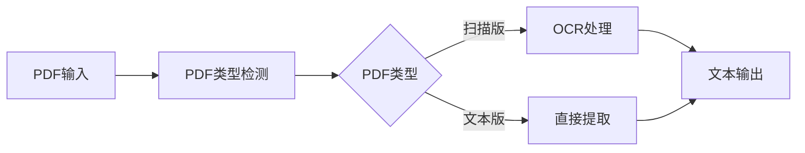
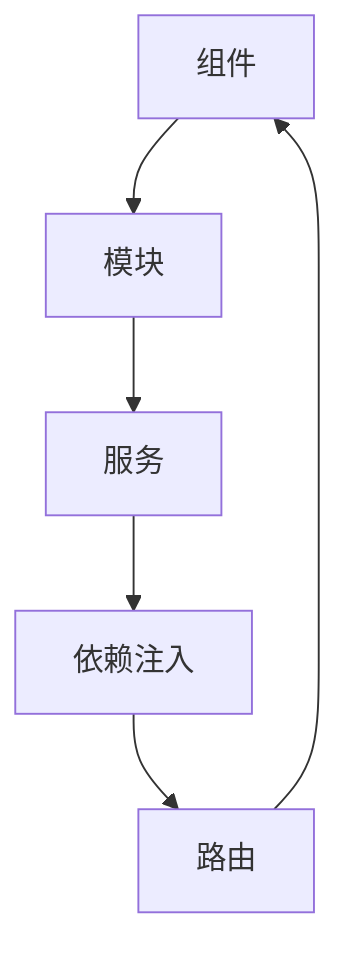
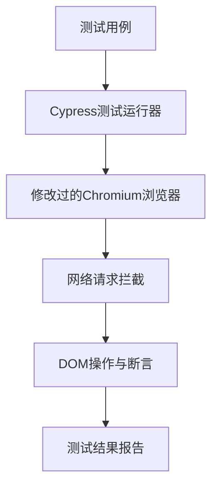

## 今日热点

今日GitHub热榜显示AI代理与智能系统持续引领技术前沿，同时AI辅助开发工具和特定领域应用呈现爆发式增长，反映出AI技术正加速向实用化和垂直化方向发展。

---

## 热门项目一览

| 排名 | 项目 | 语言 | 今日 | 总计 | 简介 |
|:---:|------|:----:|------:|-----:|------|
| 1 | [firecrawl/pdf-inspector](https://github.com/firecrawl/pdf-inspector) | Rust | +2,540 | 10,087 | Fast Rust library for PDF i... |
| 2 | [zhaoxuya520/reverse-skill](https://github.com/zhaoxuya520/reverse-skill) | PowerShell | +2,297 | 17,955 | Reverse Engineering / Autho... |
| 3 | [lyogavin/airllm](https://github.com/lyogavin/airllm) | Jupyter Notebook | +1,711 | 28,413 | AirLLM 70B inference with s... |
| 4 | [TencentCloud/TencentDB-Agent-Memory](https://github.com/TencentCloud/TencentDB-Agent-Memory) | TypeScript | +1,111 | 13,694 | TencentDB Agent Memory is a... |
| 5 | [esengine/DeepSeek-Reasonix](https://github.com/esengine/DeepSeek-Reasonix) | Go | +922 | 30,814 | DeepSeek-native AI coding a... |
| 6 | [microsoft/generative-ai-for-beginners](https://github.com/microsoft/generative-ai-for-beginners) | Jupyter Notebook | +783 | 116,289 | 21 Lessons, Get Started Bui... |
| 7 | [obra/superpowers](https://github.com/obra/superpowers) | Shell | +653 | 266,509 | An agentic skills framework... |
| 8 | [usekaneo/kaneo](https://github.com/usekaneo/kaneo) | TypeScript | +559 | 7,310 | 🎯 All you need. Nothing you... |
| 9 | [livekit/agents](https://github.com/livekit/agents) | Python | +432 | 12,424 | A framework for building re... |
| 10 | [browser-use/video-use](https://github.com/browser-use/video-use) | Python | +320 | 19,353 | Edit videos with coding agents |
| 11 | [uber/ADR](https://github.com/uber/ADR) | Python | +148 | 696 | ADR secures enterprise AI a... |
| 12 | [tailwindlabs/tailwindcss](https://github.com/tailwindlabs/tailwindcss) | TypeScript | +52 | 96,493 | A utility-first CSS framewo... |

---

## 趋势洞察

```
┌─────────────────────────────────────────────────────────────────┐
│  AI/ML 工具         ████████████████████████  12 个项目        │
│  其他               ██████                    3 个项目        │
│  开发框架             ██                        1 个项目        │
│  多媒体应用            ██                        1 个项目        │
│  智能家居             ██                        1 个项目        │
└─────────────────────────────────────────────────────────────────┘
```

---

## 项目深度解读

### 1. firecrawl/pdf-inspector — 智能PDF分析器

> **一句话总结**：快速Rust库，智能识别扫描与文本PDF，实现高效文档处理与路由决策。

#### 价值主张

| 维度 | 说明 |
|------|------|
| **解决痛点** | 解决PDF类型智能识别与高效文本提取难题 |
| **目标用户** | 需要处理大量PDF文档的开发者与数据科学家 |
| **核心亮点** | 高性能Rust实现 + 扫描/文本PDF智能识别 + 多功能一体处理 |

#### 技术架构



**技术特色**：
- 基于Rust的高性能PDF解析引擎
- 智能区分扫描版与原生文本PDF
- 集成OCR技术处理扫描文档

#### 热度分析

- 项目近期增长迅猛，单日新增star超过2500，显示出社区对该技术的高度关注
- 作为firecrawl生态系统的一部分，处于文档智能处理前沿位置

#### 快速上手

```bash
# 添加到Cargo.toml
[dependencies]
pdf-inspector = "0.1"

# 基本使用示例
use pdf_inspector::{PdfInspector, InspectorResult};

let inspector = PdfInspector::new();
let result = inspector.inspect("document.pdf");
match result.pdf_type {
    PdfType::Scanned => println!("扫描PDF，需要OCR处理"),
    PdfType::Text => println!("文本PDF，可直接提取内容"),
}
```

#### 注意事项

- 项目许可证未知，商业使用前需确认授权情况
- 虽然star数高，但Open Issues为0，可能表明项目处于早期阶段或问题通过其他渠道处理


### 2. zhaoxuya520/reverse-skill — [AI安全路由]

> **一句话总结**：逆向工程与渗透测试的AI智能路由工具链，支持多种AI编程客户端自动进化安全技能库。

#### 价值主张

| 维度 | 说明 |
|------|------|
| **解决痛点** | 安全研究人员缺乏智能工具链整合与AI辅助的逆向工程环境 |
| **目标用户** | 逆向工程师、渗透测试人员、安全研究人员 |
| **核心亮点** | AI智能路由 + 按需工具链自举 + 多客户端兼容 + 自动进化知识库 |

#### 技术架构


**技术特色**：
- 基于PowerShell的跨平台兼容性设计
- AI驱动的智能任务路由与工具选择机制
- 动态工具链加载与依赖管理
- 自动进化的安全知识库系统
- 多AI客户端统一接口适配

#### 热度分析

- 项目近期热度激增，单日增长超过2000星，显示安全社区高度关注
- 作为AI辅助安全工具的先行者，在安全研究领域占据创新生态位置

#### 快速上手

```bash
# 安装项目依赖
Install-Module reverse-skill

# 初始化安全环境
Initialize-SecurityEnvironment -Client ClaudeCode

# 启动逆向任务路由
Invoke-ReverseTask -Target sample.exe
```

#### 注意事项

- 本项目仅限授权渗透测试和安全研究使用，禁止非法用途
- 使用前需确保已获得相关系统的测试授权
- 工具链可能需要根据目标环境进行定制配置
- AI客户端需单独配置API密钥才能使用完整功能


### 3. lyogavin/airllm — 大模型低显存

> **一句话总结**：AirLLM实现单4GB GPU运行70B大模型，突破硬件限制降低大模型使用门槛。

#### 价值主张

| 维度 | 说明 |
|------|------|
| **解决痛点** | 解决大模型推理对高显存硬件的依赖，降低大模型使用门槛 |
| **目标用户** | 拥有低显存GPU的研究者、开发者和爱好者 |
| **核心亮点** | + 单4GB GPU运行70B模型 + 高效内存管理 + 无需模型量化 |

#### 技术架构


**技术特色**：
- 创新的内存优化技术，允许在极小显存上运行超大模型
- 采用模型并行与计算流水线结合的方法
- 动态激活值缓存减少内存占用

#### 热度分析

- 项目获得28k+星标且近期大幅增长(+1.7k/天)，显示大模型低资源运行需求强烈
- 无公开issue表明项目可能已成熟稳定，用户反馈主要通过其他渠道

#### 快速上手

```bash
git clone https://github.com/lyogavin/airllm.git
cd airllm
pip install -r requirements.txt
jupyter notebook
```

#### 注意事项

- 项目许可证未知，商用前需确认授权条款
- 4GB GPU运行70B模型可能牺牲一定推理速度
- 实际效果可能因具体硬件和模型而异


### 4. TencentCloud/TencentDB-Agent-Memory — AI记忆中心

> **一句话总结**：将对话、文档和代码转化为四种可重用记忆资产，实现AI Agent间的知识共享与复用。

#### 价值主张

| 维度 | 说明 |
|------|------|
| **解决痛点** | 解决AI Agent间知识孤岛，实现跨团队信息共享与复用 |
| **目标用户** | AI开发团队、企业AI应用开发者 |
| **核心亮点** | 四种记忆资产类型 + 跨Agent知识共享 + 团队级记忆治理 + 多模态数据处理 + 框架无关集成 |

#### 技术架构


**技术特色**：
- 智能多模态数据处理技术
- 分布式记忆资产存储机制
- 跨框架兼容的API设计
- 团队级记忆治理系统
- 动态知识图谱构建

#### 热度分析

- 项目近期单日新增1111星，在AI Agent记忆管理领域增长迅猛
- 作为腾讯云开源项目，在AI Agent生态中处于领先地位，有望成为行业标准

#### 快速上手

```bash
# 克隆项目
git clone https://github.com/TencentCloud/TencentDB-Agent-Memory.git
# 安装依赖
npm install
# 启动服务
npm run start
```

#### 注意事项

- 项目需要一定的AI和知识管理背景经验
- 作为腾讯云项目，可能与腾讯云服务有深度集成
- 需关注项目的许可证信息，目前显示为Unknown
- 使用前建议先了解四种记忆资产的具体应用场景


### 5. esengine/DeepSeek-Reasonix — AI终端编码助手

> **一句话总结**：DeepSeek原生化AI终端编码助手，以前缀缓存稳定为核心，可长时间持续运行。

#### 价值主张

| 维度 | 说明 |
|------|------|
| **解决痛点** | 终端环境下的智能编程辅助，解决开发者日常编码效率问题 |
| **目标用户** | 终端开发者、命令行爱好者、效率追求者 |
| **核心亮点** | DeepSeek原生化支持 + 前缀缓存优化 + 长时间稳定运行 + 终端集成度高 |

#### 技术架构


**技术特色**：
- 基于Go语言开发，性能高效
- 前缀缓存优化机制，减少重复计算
- 终端原生集成，无需额外环境配置
- 持续运行稳定性设计

#### 热度分析

- 项目Star数增长迅速，单日新增922个Star，表明社区认可度高
- Fork数量接近2000，显示开发者二次开发意愿强烈，社区活跃度高

#### 快速上手

```bash
# 安装
go install github.com/esengine/DeepSeek-Reasonix@latest

# 启动
deepseek-reasonix

# 使用
在终端中直接输入编程指令即可获得AI辅助
```

#### 注意事项

- 项目许可证未知，商业使用前需确认授权方式
- 作为AI编码工具，需注意代码安全性和隐私保护
- 依赖DeepSeek模型，可能需要网络连接或本地部署


### 6. microsoft/generative-ai-for-beginners — AI入门教程

> **一句话总结**：微软官方推出的21节生成式AI入门课程，帮助初学者系统学习AI应用开发。

#### 价值主张

| 维度 | 说明 |
|------|------|
| **解决痛点** | 降低生成式AI学习门槛，提供系统化入门路径 |
| **目标用户** | AI初学者、开发者、技术爱好者 |
| **核心亮点** | 微软官方出品 + 21节系统课程 + 实践导向 + Jupyter Notebook形式 |

#### 技术架构


**技术特色**：
- 基于微软Azure AI服务构建实践案例
- 采用交互式Jupyter Notebook提供沉浸式学习体验
- 涵盖从理论到应用的完整学习路径

#### 热度分析

- 高关注度项目，单日新增近800星，表明生成式AI学习需求旺盛
- Fork数接近Star数一半，显示用户积极参与学习和二次开发

#### 快速上手

```bash
# 克隆项目到本地
git clone https://github.com/microsoft/generative-ai-for-beginners.git

# 使用Jupyter Notebook打开课程
cd generative-ai-for-beginners
jupyter notebook
```

#### 注意事项

- 本项目需要Python环境和相关AI库支持，建议先配置好开发环境
- 部分课程可能需要Azure账户或API密钥才能完整体验
- 项目内容持续更新，建议关注最新版本以获取最新课程内容


### 7. obra/superpowers — 智能开发框架

> **一句话总结**：提供代理技能框架和实用软件开发方法论，提升开发效率和质量。

#### 价值主张

| 维度 | 说明 |
|------|------|
| **解决痛点** | 解决传统软件开发方法低效、技能碎片化问题 |
| **目标用户** | 软件开发者、技术团队、项目管理者 |
| **核心亮点** | 代理技能框架 + 实用方法论 + 强调实际效果 |

#### 技术架构


**技术特色**：
- 基于Shell脚本实现的轻量级框架
- 强调实用性和可操作性
- 包含自动化工具集和最佳实践

#### 热度分析

- 项目获26万+星标，近期稳定增长，社区认可度高
- Fork/Star比例约9%，显示用户不仅关注还有实际使用行为

#### 快速上手

```bash
# 克隆项目
git clone https://github.com/obra/superpowers.git
# 进入目录
cd superpowers
# 查看帮助文档
./superpowers --help
```

#### 注意事项

- License未知，使用时需注意授权问题
- 作为Shell项目，主要适用于类Unix系统
- 需要一定的Shell脚本知识才能充分利用项目价值


### 8. usekaneo/kaneo — 精简项目管理

> **一句话总结**：轻量级开源项目管理工具，专注核心功能，简洁高效。

#### 价值主张

| 维度 | 说明 |
|------|------|
| **解决痛点** | 传统项目管理工具臃肿复杂，提供过多不必要功能 |
| **目标用户** | 中小型团队、个人开发者、追求效率的项目经理 |
| **核心亮点** | 极简界面 + 核心项目管理功能 + 开源免费 + 自托管部署 + TypeScript开发 |

#### 技术架构


**技术特色**：
- 基于TypeScript开发，提供类型安全
- 前后端分离架构，便于扩展和维护
- 轻量级设计，资源占用少

#### 热度分析

- 项目获得7310颗星，近期增长迅速，单日新增559星，表明社区认可度高
- Fork数579，说明有一定比例的用户积极参与项目贡献和二次开发

#### 快速上手

```bash
# 克隆仓库
git clone https://github.com/usekaneo/kaneo.git

# 安装依赖
npm install

# 启动开发服务器
npm run dev
```

#### 注意事项

- 项目许可证信息未知，商业使用前需确认授权方式
- Open Issues为0，可能表明项目处于早期阶段或问题处理机制高效
- 作为项目管理工具，数据安全性至关重要，需关注其安全更新


### 9. livekit/agents — 实时语音AI框架

> **一句话总结**：LiveKit Agents是一个强大的框架，使开发者能够轻松构建实时语音AI代理，支持语音和视频交互。

#### 价值主张

| 维度 | 说明 |
|------|------|
| **解决痛点** | 简化实时语音AI代理开发，解决语音交互复杂性和实时性挑战 |
| **目标用户** | 语音AI开发者、实时通信应用构建者 |
| **核心亮点** | 实时语音处理+多模态交互+低延迟通信+易于扩展 |

#### 技术架构


**技术特色**：
- 基于WebRTC的实时通信技术
- 支持语音和视频的双向交互
- 提供灵活的插件架构
- 优化的低延迟音频处理

#### 热度分析

- 高增长率，近期新增432 stars，表明项目受到广泛关注
- Open Issues为0，表明项目维护良好，社区问题处理高效

#### 快速上手

```bash
# 安装LiveKit Agents
pip install livekit-agents

# 创建基本语音AI代理
python -m livekit.agents --create my_agent
```

#### 注意事项

- 需要确保有良好的网络环境，因为实时通信对网络质量要求较高
- 使用前需要了解基本的WebRTC和音频处理概念
- 项目依赖较新的Python版本，建议使用Python 3.8+


### 10. browser-use/video-use — 代码驱动视频

> **一句话总结**：通过编程代理实现自动化视频编辑，颠覆传统手动操作模式

#### 价值主张

| 维度 | 说明 |
|------|------|
| **解决痛点** | 传统视频编辑工具操作繁琐，效率低下且学习曲线陡峭 |
| **目标用户** | 开发者、内容创作者、视频编辑技术人员 |
| **核心亮点** | 代码驱动编辑 + 自动化处理流程 + 精确控制能力 + 无需图形界面 |

#### 技术架构


**技术特色**：
- 基于大语言模型的智能视频编辑代理
- 通过代码指令而非传统UI控制视频处理流程
- 支持复杂编辑逻辑的自动化实现

#### 热度分析

- 项目近两万星且持续快速增长，表明市场需求强烈
- 零开放问题反映社区高效协作或问题快速解决机制

#### 快速上手

```bash
# 安装项目
pip install -e git+https://github.com/browser-use/video-use.git

# 基本使用示例
python -m videouse --input video.mp4 --edit-script edit.py --output result.mp4
```

#### 注意事项

- 需要Python编程基础才能有效使用
- 视频处理可能需要较高计算资源，建议在性能良好的机器上运行
- 项目依赖可能随版本更新变化，建议查看最新文档


### 11. uber/ADR — AI安全卫士

> **一句话总结**：ADR通过可观测性和威胁检测保障企业AI代理安全，已在Uber大规模部署。

#### 价值主张

| 维度 | 说明 |
|------|------|
| **解决痛点** | 企业AI代理面临的安全威胁和风险缺乏有效监控与防护 |
| **目标用户** | 部署AI系统的大型企业和组织 |
| **核心亮点** | 可观测性 + 安全基准测试 + 实时威胁检测 + 企业级部署 |

#### 技术架构


**技术特色**：
- 全面的AI系统可观测性监控
- 基于基准的安全性能评估
- 实时威胁检测与响应机制

#### 热度分析

- 项目近期增长迅速，单日新增Star数达148，显示社区高度关注
- 作为Uber内部部署的安全工具，具有企业级应用背书，技术可靠性高

#### 快速上手

```bash
pip install adr-cli
adr init
adr monitor
```

#### 注意事项

- 项目许可证信息未知，使用前需确认合规性
- 作为企业级安全工具，可能需要一定的专业知识配置和部署
- 项目Open Issues为0，可能表示项目维护策略或社区参与方式不同


### 12. tailwindlabs/tailwindcss — 实用优先框架

> **一句话总结**：原子类CSS框架，通过实用工具类实现快速UI开发，减少自定义CSS编写。

#### 价值主张

| 维度 | 说明 |
|------|------|
| **解决痛点** | 解决传统CSS框架限制大、自定义难、冗余代码多的问题 |
| **目标用户** | 前端开发者、UI设计师、全栈工程师 |
| **核心亮点** | 原子类设计 + 高度可定制 + 响应式设计 + 实用优先理念 + JIT编译 |

#### 技术架构


**技术特色**：
- 基于JIT(Just-In-Time)编译模式，按需生成CSS类
- 采用PostCSS处理，可无缝集成到现有构建流程
- 提供完整的响应式设计系统，支持断点控制

#### 热度分析

- 作为CSS框架，Star数持续稳定增长，表明开发者认可度高
- 在前端生态中占据重要位置，成为现代Web开发的必备工具之一

#### 快速上手

```bash
# 安装Tailwind CSS
npm install -D tailwindcss postcss autoprefixer

# 初始化配置
npx tailwindcss init -p

# 在CSS文件中引入
@tailwind base;
@tailwind components;
@tailwind utilities;
```

#### 注意事项

- 需要理解原子类思维，与传统CSS框架使用方式不同
- 随着项目规模增长，需要合理配置JIT模式以避免构建性能问题
- 建议配合VSCode插件使用，提高开发效率


### 13. EveryInc/compound-engineering-plugin — DeFi开发增强工具

> **一句话总结**：Compound官方开发插件，为Claude Code等IDE提供DeFi智能合约开发支持。

#### 价值主张

| 维度 | 说明 |
|------|------|
| **解决痛点** | 为DeFi开发者提供Compound协议专用开发支持，简化智能合约交互 |
| **目标用户** | 开发Compound协议应用的区块链开发者、智能合约工程师 |
| **核心亮点** | 官方支持 + 多IDE兼容 + DeFi专用工具链 + 智能合约辅助 |

#### 技术架构

**技术特色**：
- 基于TypeScript开发，提供类型安全
- 支持多个主流代码编辑器，扩展性强
- 集成Compound协议特定功能，提高开发效率

#### 热度分析

- 项目获得近2.4万星，近期持续增长，表明DeFi开发工具需求旺盛
- 零未解决问题，维护状态良好，在DeFi开发工具生态中占据重要位置

#### 快速上手

```bash
# 通过npm安装
npm install -g compound-engineering-plugin
# 或在VS Code扩展商店搜索"Compound Engineering"
```

#### 注意事项

- 插件需要区块链开发基础知识
- 使用前需要配置正确的网络和钱包连接
- 确保使用的IDE版本与插件兼容


### 14. denoland/deno — 现代JS运行时

> **一句话总结**：安全、现代的 JavaScript/TypeScript 运行时，内置 TypeScript 支持，无需配置即可直接运行。

#### 价值主张

| 维度 | 说明 |
|------|------|
| **解决痛点** | 解决 Node.js 安全模型缺陷，提供开箱即用的 TypeScript 支持 |
| **目标用户** | JavaScript/TypeScript 开发者，寻求安全运行环境的全栈开发者 |
| **核心亮点** | 内置 TypeScript 支持 + 安全默认模型 + 标准库集成 + ES 模块优先 |

#### 技术架构


**技术特色**：
- 基于 Rust 和 V8 构建，提供高性能和安全性
- 采用权限模型，默认限制文件、网络等系统访问
- 内置丰富的标准库，减少依赖需求

#### 热度分析

- Star 数超 10 万且持续增长，表明项目在开发者社区中广泛认可
- 作为 Node.js 替代方案，在现代化 JS 运行时领域占据重要地位

#### 快速上手

```bash
# 安装 Deno
curl -fsSL https://deno.land/install.sh | sh

# 运行 TypeScript 文件
deno run https://deno.land/std@0.150.0/examples/welcome.ts
```

#### 注意事项

- Deno 的模块系统与 Node.js 不同，主要使用 ES 模块和 URL 导入
- 某些 Node.js 特有的全局变量在 Deno 中不可用，需要适配
- Deno 的权限模型需要显式授权才能访问文件系统、网络等资源


### 15. angular/angular — 前端框架

> **一句话总结**：Google维护的全功能前端框架，通过组件化和依赖注入构建大型单页应用。

#### 价值主张

| 维度 | 说明 |
|------|------|
| **解决痛点** | 解决大型Web应用开发中的复杂性和可维护性问题 |
| **目标用户** | 企业级应用开发者和需要构建复杂SPA的开发团队 |
| **核心亮点** | 完整的MVC框架 + 依赖注入系统 + 双向数据绑定 + 模块化架构 + 丰富的CLI工具 |

#### 技术架构



**技术特色**：
- 基于TypeScript开发，提供静态类型检查
- 采用组件化架构，实现UI和逻辑的分离
- 强大的CLI工具链，简化项目创建和开发流程
- 完整的生态系统，包括路由、表单处理、HTTP客户端等
- 支持服务端渲染和静态站点生成

#### 热度分析

- Angular作为主流前端框架之一，拥有超过10万stars，企业采用率高，生态成熟
- 社区活跃度稳定，定期发布版本更新，拥有丰富的第三方库和工具支持

#### 快速上手

```bash
# 安装Angular CLI
npm install -g @angular/cli

# 创建新项目
ng new my-app

# 启动开发服务器
cd my-app
ng serve
```

#### 注意事项

- Angular的学习曲线相对陡峭，需要理解TypeScript和框架核心概念
- 项目结构相对固定，可能不如其他框架灵活
- 对于小型项目，Angular可能显得过于复杂


### 16. cypress-io/cypress — 前端测试框架

> **一句话总结**：快速、可靠的端到端测试解决方案，专为现代Web应用设计，提供直观的调试体验。

#### 价值主张

| 维度 | 说明 |
|------|------|
| **解决痛点** | 解决前端测试速度慢、调试困难、异步处理复杂等核心测试难题 |
| **目标用户** | 前端开发团队、QA工程师、需要高质量端到端测试的Web应用开发者 |
| **核心亮点** | 实时重新加载 + 自动等待机制 + 时间旅行调试 + 强大网络拦截 + 跨浏览器支持 |

#### 技术架构



**技术特色**：
- 基于修改过的Chromium浏览器，提供直接DOM访问能力
- 实现智能自动等待机制，消除异步测试的时序问题
- 提供时间旅行调试功能，可回溯测试执行每一步

#### 热度分析

- 拥有5万+星标且持续增长，证明在前端测试领域获得广泛认可
- 作为前端测试工具生态中的佼佼者，与主流框架深度集成

#### 快速上手

```bash
# 安装Cypress
npm install cypress --save-dev

# 打开测试运行器
npx cypress open

# 运行所有测试
npx cypress run
```

#### 注意事项

- 测试运行基于修改过的Chromium，与生产环境可能存在差异
- 大型应用测试执行时间可能较长，需合理规划测试用例
- 部分第三方库可能与Cypress沙箱环境不兼容，需额外配置


### 17. webpack/webpack — 前端模块打包器

> **一句话总结**：功能强大的模块打包工具，支持多种资源类型和代码分割，优化前端资源加载。

#### 价值主张

| 维度 | 说明 |
|------|------|
| **解决痛点** | 解决前端模块依赖管理和资源优化问题，提高应用性能和开发效率 |
| **目标用户** | 前端开发人员、构建工具使用者、需要模块化开发的团队 |
| **核心亮点** | 模块打包 + 代码分割 + 资源处理 + 插件系统 + 生态系统丰富 |

#### 技术架构


**技术特色**：
- 基于配置的构建流程，高度可定制
- 支持多种模块类型和加载器(Loader)
- 插件系统提供强大的扩展能力

#### 热度分析

- 拥有超过6.5万个Star，是前端构建工具的领导者，持续稳定增长
- 作为前端开发的核心工具之一，拥有庞大活跃的社区和丰富的插件生态

#### 快速上手

```bash
# 安装webpack
npm install webpack webpack-cli --save-dev

# 基本打包命令
npx webpack --mode production
```

#### 注意事项

- webpack 配置相对复杂，学习曲线较陡
- 对于小型项目可能过于重型
- 需要合理配置才能获得最佳性能
- 版本升级可能需要调整配置


### 18. gabime/spdlog — 高性能日志库

> **一句话总结**：极速、类型安全且易于使用的 C++ 日志记录解决方案，支持多种日志目标和格式。

#### 价值主张

| 维度 | 说明 |
|------|------|
| **解决痛点** | 解决 C++ 应用中高性能日志记录需求，避免传统日志库的性能瓶颈 |
| **目标用户** | 需要高效日志的 C++ 开发者，特别是游戏开发和高性能系统应用 |
| **核心亮点** | 高性能异步日志 + 多种日志格式支持 + 跨平台兼容 + 轻量级设计 + 易于集成 |

#### 技术架构


**技术特色**：
- 基于 fmtlib 的高性能格式化引擎
- 异步日志记录避免阻塞主线程
- 无模板实现的轻量级设计，减少编译时间
- 支持多种日志目标和格式扩展
- 可自定义的日志级别和模式

#### 热度分析

- 近 3 万星持续稳定增长，表明在 C++ 社区获得广泛认可
- 作为高性能日志库，在游戏开发和系统编程领域具有不可替代的地位

#### 快速上手

```bash
# 安装
git clone https://github.com/gabime/spdlog.git
cd spdlog && mkdir build && cd build
cmake .. && make

# 基本使用
#include "spdlog/spdlog.h"
int main() {
    auto logger = spdlog::basic_logger_mt("basic_logger", "logs/basic-log.txt");
    logger->info("Welcome to spdlog!");
    return 0;
}
```

#### 注意事项

- spdlog 是一个单头文件库，但建议使用预编译库以获得最佳性能
- 在多线程环境中使用时，需要确保日志器正确初始化
- 异步日志器需要显式调用 flush 或析构函数以确保日志写入完成


## 今日推荐

| 主题 | 推荐项目 | 亮点 |
|------|----------|------|
| 今日最热 | [firecrawl/pdf-inspector](https://github.com/firecrawl/pdf-inspector) | Fast Rust library... |
| 值得关注 | [zhaoxuya520/reverse-skill](https://github.com/zhaoxuya520/reverse-skill) | Reverse Engineeri... |
| 快速上手 | [lyogavin/airllm](https://github.com/lyogavin/airllm) | AirLLM 70B infere... |
| 长期潜力 | [TencentCloud/TencentDB-Agent-Memory](https://github.com/TencentCloud/TencentDB-Agent-Memory) | TencentDB Agent M... |

---

<div align="center">

*Generated on 2026-08-05 | Powered by GitHub Trending Reporter*

</div>