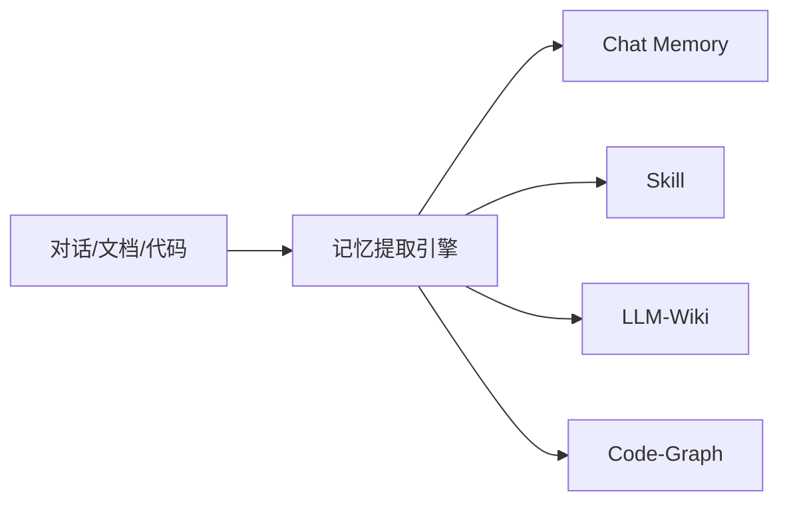
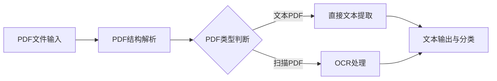
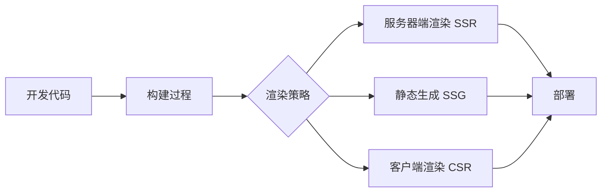

## 今日热点

AI代理技术持续火热，从记忆管理、技能框架到安全控制，企业级应用逐渐成熟，同时大模型资源优化技术也备受关注。

---

## 热门项目一览

| 排名 | 项目 | 语言 | 今日 | 总计 | 简介 |
|:---:|------|:----:|------:|-----:|------|
| 1 | [TencentCloud/TencentDB-Agent-Memory](https://github.com/TencentCloud/TencentDB-Agent-Memory) | TypeScript | +1,892 | 15,105 | TencentDB Agent Memory is a... |
| 2 | [firecrawl/pdf-inspector](https://github.com/firecrawl/pdf-inspector) | Rust | +1,582 | 11,502 | Fast Rust library for PDF i... |
| 3 | [obra/superpowers](https://github.com/obra/superpowers) | Shell | +931 | 267,326 | An agentic skills framework... |
| 4 | [cloudflare/computer](https://github.com/cloudflare/computer) | TypeScript | +891 | 3,065 | Give your agent a computer 👾 |
| 5 | [lyogavin/airllm](https://github.com/lyogavin/airllm) | Jupyter Notebook | +833 | 29,113 | AirLLM 70B inference with s... |
| 6 | [esengine/DeepSeek-Reasonix](https://github.com/esengine/DeepSeek-Reasonix) | Go | +747 | 31,666 | DeepSeek-native AI coding a... |
| 7 | [tailwindlabs/tailwindcss](https://github.com/tailwindlabs/tailwindcss) | TypeScript | +408 | 96,870 | A utility-first CSS framewo... |
| 8 | [uber/ADR](https://github.com/uber/ADR) | Python | +354 | 1,059 | ADR secures enterprise AI a... |
| 9 | [huangruiteng/loopx](https://github.com/huangruiteng/loopx) | Python | +326 | 2,166 | Lightweight loop engineerin... |
| 10 | [donnemartin/system-design-primer](https://github.com/donnemartin/system-design-primer) | Python | +303 | 361,568 | Learn how to design large-s... |
| 11 | [addyosmani/agent-skills](https://github.com/addyosmani/agent-skills) | JavaScript | +226 | 82,006 | Production-grade engineerin... |
| 12 | [roboflow/supervision](https://github.com/roboflow/supervision) | Python | +146 | 48,935 | We write your reusable comp... |

---

## 趋势洞察

```
┌─────────────────────────────────────────────────────────────────┐
│  AI/ML 工具         ████████████████████████  9 个项目        │
│  开发框架             ██                        1 个项目        │
│  智能家居             ██                        1 个项目        │
│  开发工具             ██                        1 个项目        │
│  其他               ██                        1 个项目        │
└─────────────────────────────────────────────────────────────────┘
```

---

## 项目深度解读

### 1. TencentCloud/TencentDB-Agent-Memory — AI记忆中枢

> **一句话总结**：团队级AI记忆中枢，将对话、文档和代码转化为四种可重用记忆资产，赋能跨框架智能体协作。

#### 价值主张

| 维度 | 说明 |
|------|------|
| **解决痛点** | AI Agent间知识共享困难，团队记忆碎片化，缺乏统一的知识管理机制 |
| **目标用户** | AI开发团队、多智能体系统构建者、企业级AI应用开发者 |
| **核心亮点** | 四维记忆资产架构 + 跨框架知识共享 + 团队级记忆治理 + 智能体技能复用 |

#### 技术架构



**技术特色**：
- 多源异构信息统一处理机制
- 四维记忆资产智能提取技术
- 跨框架知识共享与治理体系

#### 热度分析

- 项目Star数达15,105，单日增长1,892，表明AI记忆领域热度快速上升
- Fork数1,374显示社区积极参与，在企业级AI工具中生态位置重要

#### 快速上手

```bash
# 克隆项目
git clone https://github.com/TencentCloud/TencentDB-Agent-Memory.git

# 安装依赖
npm install

# 启动服务
npm run start
```

#### 注意事项

- 需要确保对处理的数据有适当的访问权限
- 注意记忆资产的安全性和隐私保护
- 根据实际需求调整记忆提取和共享策略


### 2. firecrawl/pdf-inspector — PDF智能分析库

> **一句话总结**：高性能Rust库，智能识别扫描与文本PDF，实现高效文本提取与分类处理。

#### 价值主张

| 维度 | 说明 |
|------|------|
| **解决痛点** | 解决PDF类型自动识别难题，避免无效处理扫描文档导致的资源浪费 |
| **目标用户** | 需要批量处理PDF的开发者、文档管理系统和OCR服务提供商 |
| **核心亮点** | 高性能处理 + 智能PDF类型检测 + 精准文本提取 + Rust安全保证 + 无依赖轻量级 |

#### 技术架构



**技术特色**：
- 基于Rust实现，提供内存安全和高性能处理
- 智能算法区分扫描与文本PDF，优化处理流程
- 轻量级设计，最小化外部依赖，提高部署效率
- 支持批量处理，适合大规模文档分析场景

#### 热度分析

- 项目Star数达11,502且单日激增1,582，表明近期关注度大幅提升
- Fork数770，社区参与度高，有望成为PDF处理领域的重要工具

#### 快速上手

```bash
# 添加依赖到Cargo.toml
firecrawl-pdf-inspector = "0.1"

# 基本使用示例
let inspector = PdfInspector::new();
let pdf_type = inspector.inspect("document.pdf");
let text = inspector.extract_text("document.pdf");
```

#### 注意事项

- 项目许可证未知，商业使用前需确认授权条款
- 对于加密或特殊格式的PDF，支持功能可能有限
- 处理扫描PDF可能需要额外OCR依赖，影响轻量化特性


### 4. cloudflare/computer — AI代理计算平台

> **一句话总结**：为AI代理提供计算机交互能力，实现复杂任务执行与系统操作

#### 价值主张

| 维度 | 说明 |
|------|------|
| **解决痛点** | AI代理缺乏直接与计算机系统交互的能力，限制其实际应用场景 |
| **目标用户** | AI开发者、研究人员及需要增强AI系统实用性的技术团队 |
| **核心亮点** | 提供代理-计算机接口 + 支持复杂任务执行 + 安全的交互机制 |

#### 技术架构


**技术特色**：
- 基于TypeScript构建，提供类型安全的代理-计算机交互
- 利用Cloudflare边缘计算网络实现低延迟任务执行
- 可能提供沙箱环境确保系统操作的安全性

#### 热度分析

- 项目近期呈爆发式增长，单日增长891个star，显示AI代理计算领域热度高涨
- 作为Cloudflare官方项目，有望成为AI与物理计算交互的重要基础设施

#### 快速上手

```bash
# 克隆项目
git clone https://github.com/cloudflare/computer.git

# 安装依赖
npm install

# 启动开发环境
npm run dev
```

#### 注意事项

- 项目可能需要Cloudflare账户及特定配置才能正常使用
- 作为新兴项目，API和功能可能仍在快速迭代中
- 使用时需注意安全边界，确保代理操作不会威胁系统安全


### 5. lyogavin/airllm — 显存优化LLM

> **一句话总结**：突破显存限制，在单块4GB GPU上实现70B大模型的高效推理，大幅降低AI应用门槛。

#### 价值主张

| 维度 | 说明 |
|------|------|
| **解决痛点** | 解决大模型推理对高显存GPU的依赖，降低AI应用门槛 |
| **目标用户** | 研究人员、开发者、拥有有限计算资源的AI爱好者 |
| **核心亮点** | 显存优化技术 + 70B模型支持 + 单GPU运行 + 开源可访问 |

#### 技术架构


**技术特色**：
- 显存优化算法，将70B模型显存需求降至4GB
- 模型分块加载技术，实现大模型在小设备上运行
- 激活值重计算策略，平衡计算和内存使用

#### 热度分析

- Star数增长迅速(日增800+)，表明项目受广泛关注，解决业界痛点
- Fork数较高(3100+)，说明开发者积极参与项目改进和应用

#### 快速上手

```bash
# 克隆项目
git clone https://github.com/lyogavin/airllm.git
cd airllm

# 安装依赖
pip install -r requirements.txt

# 运行示例
jupyter notebook examples/demo.ipynb
```

#### 注意事项

- 项目可能需要特定的GPU硬件支持
- 推理速度可能比标准实现慢，是显存优化的代价
- 模型性能可能因优化而有轻微下降


### 6. esengine/DeepSeek-Reasonix — AI 编程助手

> **一句话总结**：基于 DeepSeek 的终端 AI 编程代理，具有前缀缓存稳定性，可长时间运行。

#### 价值主张

| 维度 | 说明 |
|------|------|
| **解决痛点** | 提供智能编程辅助，提高开发效率，减少手动编码工作量 |
| **目标用户** | 开发者、程序员、需要高效编码辅助的技术人员 |
| **核心亮点** | 终端集成 + 前缀缓存优化 + 持久化运行 + DeepSeek 原生支持 |

#### 技术架构


**技术特色**：
- 基于 Go 语言开发，性能高效
- 前缀缓存稳定性设计，适合长时间运行
- 深度集成 DeepSeek AI 模型，提供精准代码建议

#### 热度分析

- 项目 Star 数量超过 3 万，近期增长迅速，单日新增近 750 个 Star
- Fork 数量适中，表明项目已被广泛采用和二次开发，社区活跃度高

#### 快速上手

```bash
# 克隆仓库
git clone https://github.com/esengine/DeepSeek-Reasonix.git

# 安装并运行
cd DeepSeek-Reasonix
go run main.go
```

#### 注意事项

- 需要确保系统已安装 Go 环境
- 可能需要配置 DeepSeek API 密钥
- 长时间运行可能需要系统资源支持
- 项目许可证未知，商业使用前需确认授权方式


### 7. tailwindlabs/tailwindcss — 实用优先CSS框架

> **一句话总结**：Tailwind CSS是原子化CSS框架，通过实用类名实现快速UI开发，无需编写自定义CSS。

#### 价值主张

| 维度 | 说明 |
|------|------|
| **解决痛点** | 消除传统CSS开发中的决策疲劳和样式冲突问题 |
| **目标用户** | 前端开发者、UI设计师、全栈工程师 |
| **核心亮点** | 实用优先设计 + 原子化类名 + JIT编译 + 高度可定制 + 响应式设计 |

#### 技术架构


**技术特色**：
- 基于JIT的编译模式，按需生成CSS，大幅减少最终CSS体积
- 使用PostCSS插件架构，提供高度可扩展性
- 支持响应式设计、状态变体和自定义主题的配置系统

#### 热度分析

- 高Star数(96,870)和持续增长(+408 today)表明项目在开发者社区中广受欢迎
- 作为现代前端开发的重要工具，已形成完整的生态系统和丰富的插件生态

#### 快速上手

```bash
# 安装Tailwind CSS
npm install -D tailwindcss postcss autoprefixer

# 初始化配置文件
npx tailwindcss init -p

# 在CSS文件中添加Tailwind指令
@tailwind base;
@tailwind components;
@tailwind utilities;
```

#### 注意事项

- 需要理解Tailwind的实用优先理念，与传统CSS开发方式不同
- 大型项目需要合理配置JIT模式以获得最佳性能
- 需要学习Tailwind的响应式设计语法和状态变体


### 8. uber/ADR — 企业AI安全防护

> **一句话总结**：通过可观察性、安全基准测试和威胁检测，全方位保护企业AI系统安全。

#### 价值主张

| 维度 | 说明 |
|------|------|
| **解决痛点** | 企业AI系统面临的安全威胁缺乏有效监控和防护机制 |
| **目标用户** | 企业AI开发团队、安全运维人员及AI系统管理员 |
| **核心亮点** | 多维度监控 + 安全基准测试 + 实时威胁检测 + 企业级部署 |

#### 技术架构


**技术特色**：
- 多维度AI系统运行状态监控
- 基于行业标准的安全基准评估
- 智能威胁检测与响应机制

#### 热度分析

- 项目近期热度激增，单日增长354个Star，反映企业AI安全需求迫切
- 作为Uber内部部署工具，在AI安全领域具有专业背书，社区关注度持续攀升

#### 快速上手

```bash
# 假设的安装和运行命令
pip install adr-cli
adr init
adr run --target <AI系统>
```

#### 注意事项

- 项目许可证信息不明确，商业使用前需确认授权方式
- 作为企业级工具，可能需要特定的AI环境和配置支持
- 建议关注项目文档更新，以获取最佳实践和配置指南


### 9. huangruiteng/loopx — AI代理状态内核

> **一句话总结**：轻量级AI代理团队状态内核，支持多代理持久目标与可验证交接。

#### 价值主张

| 维度 | 说明 |
|------|------|
| **解决痛点** | 解决AI代理团队长期运行时的状态管理和目标持续性问题 |
| **目标用户** | 需要构建长期运行AI代理团队的开发者和研究人员 |
| **核心亮点** | 跨代理兼容性 + 持久目标管理 + 配额感知自动唤醒 + 可执行待办事项 + 可验证交接 |

#### 技术架构


**技术特色**：
- 轻量级状态内核设计，适合长时间运行的AI代理团队
- 支持多种AI代理的无缝集成，包括Codex、Claude Code等
- 实现配额感知和自动唤醒机制，优化资源使用

#### 热度分析

- 项目近期热度显著增长，单日新增326个Star，显示出强劲的社区兴趣
- 虽然Open Issues为0，但Fork数与Star数比例表明项目处于早期探索阶段

#### 快速上手

```bash
# 安装loopx
pip install loopx

# 初始化AI代理团队
loopx init --team "development_team" --agents "codex,claude"

# 设置目标并启动
loopx goal --add "develop new feature"
loopx start
```

#### 注意事项

- 项目许可证未知，商业使用前需确认授权情况
- 目前Open Issues为0，可能表明项目处于早期阶段，稳定性有待验证
- 项目文档可能不够完善，新用户可能需要自行探索API


### 10. donnemartin/system-design-primer — 系统设计指南

> **一句话总结**：大型系统设计学习资源与面试准备指南，包含实践案例与记忆卡片。

#### 价值主张

| 维度 | 说明 |
|------|------|
| **解决痛点** | 提供系统设计知识体系，解决面试准备与实战能力不足问题 |
| **目标用户** | 软件工程师、系统架构师、技术面试候选人 |
| **核心亮点** | 系统设计知识体系 + 实战案例 + Anki记忆卡片 + 面试准备指南 |

#### 技术架构


**技术特色**：
- 基于Markdown的知识组织结构
- Anki卡片集成，强化记忆效果
- 实践案例与理论结合的学习方式

#### 热度分析

- 超过36万Star，持续稳定增长，表明系统设计领域的高关注度
- Fork数达5.7万，显示社区高度参与和知识贡献意愿

#### 快速上手

```bash
# 克隆项目
git clone https://github.com/donnemartin/system-design-primer.git

# 进入目录
cd system-design-primer

# 查看文档
cat README.md
```

#### 注意事项

- 项目内容以英文为主，需要一定的英文阅读能力
- 知识点需要结合实际项目经验深入理解，不能仅靠记忆
- 部分内容可能需要根据最新技术发展进行更新


### 11. addyosmani/agent-skills — AI编程代理工程

> **一句话总结**：为AI编程代理提供生产级工程技能与最佳实践，提升代码质量与系统可靠性。

#### 价值主张

| 维度 | 说明 |
|------|------|
| **解决痛点** | AI编程代理在生产环境中的工程化与质量问题 |
| **目标用户** | AI开发者、系统架构师与集成AI代理的工程团队 |
| **核心亮点** | 生产级代码标准 + 工程最佳实践 + 性能优化方案 + 安全性考量 + 部署指南 |

#### 技术架构


**技术特色**：
- 基于JavaScript的AI代理工程化框架
- 提供完整的代码质量评估标准
- 包含生产环境部署的完整指南

#### 热度分析

- 项目获8.2万Star，日增226，表明在AI编程代理领域具有极高关注度
- 零Open Issues反映项目维护良好，社区问题解决效率高

#### 快速上手

```bash
# 克隆项目
git clone https://github.com/addyosmani/agent-skills.git

# 安装依赖
npm install
```

#### 注意事项

- 需要具备JavaScript和AI编程基础知识
- 建议结合具体AI代理框架使用以获得最佳效果
- 定期关注项目更新，以获取最新的工程实践指南


### 12. roboflow/supervision — 计算机视觉工具集

> **一句话总结**：提供可重用的计算机视觉工具，简化视觉任务开发流程。

#### 价值主张

| 维度 | 说明 |
|------|------|
| **解决痛点** | 简化复杂计算机视觉任务实现，降低开发门槛 |
| **目标用户** | 计算机视觉开发者、研究人员与应用工程师 |
| **核心亮点** | 模块化设计 + 多任务支持 + 高性能处理 + 易于集成 |

#### 技术架构


**技术特色**：
- 提供统一的视觉任务API接口
- 支持传统与深度学习方法结合
- 与主流深度学习框架无缝集成

#### 热度分析

- 项目近5万星且持续增长，日均新增约146星，社区活跃度高
- 作为Roboflow生态核心组件，在计算机视觉领域具有重要影响力

#### 快速上手

```bash
# 安装supervision
pip install supervision

# 基本使用示例
import supervision as sv
detector = sv.YOLOv8Detector('yolov8n.pt')
image = cv2.imread('image.jpg')
detections = detector(image)
```

#### 注意事项

- 需要掌握计算机视觉基础知识才能充分利用
- 某些高级功能可能需要额外依赖库
- API可能随版本更新而变化，需关注变更日志


### 13. vercel/next.js — React全栈框架

> **一句话总结**：一个提供SSR/SSG/CSR多种渲染策略的React全栈框架，优化性能与SEO体验。

#### 价值主张

| 维度 | 说明 |
|------|------|
| **解决痛点** | 解决React应用性能、SEO和开发体验问题，提供一站式解决方案 |
| **目标用户** | 需要构建高性能网站的现代Web开发团队和企业 |
| **核心亮点** | 服务器端渲染 + 静态站点生成 + API路由 + 增量静态再生成 + 零配置开发 |

#### 技术架构



**技术特色**：
- 基于React的零配置全栈框架，简化开发流程
- 内置路由系统和API路由，无需额外配置
- 支持多种渲染策略，灵活适应不同场景
- 优化的性能和SEO支持，提升搜索引擎排名
- 热模块替换(HMR)和开发体验优化

#### 热度分析

- Next.js作为React生态中最流行的框架之一，持续保持高增长，表明其在Web开发领域的领先地位和开发者认可度。
- 作为Vercel公司的旗舰产品，Next.js拥有活跃的社区贡献和丰富的第三方插件生态。

#### 快速上手

```bash
# 创建Next.js项目
npx create-next-app@latest my-app

# 进入项目目录
cd my-app

# 启动开发服务器
npm run dev
```

#### 注意事项

- Next.js的版本更新较快，需要注意兼容性问题
- 大型项目需要合理规划路由和代码分割策略以获得最佳性能
- 使用SSR/SSG时需要注意数据获取和服务器端渲染的一致性


## 今日推荐

| 主题 | 推荐项目 | 亮点 |
|------|----------|------|
| 今日最热 | [TencentCloud/TencentDB-Agent-Memory](https://github.com/TencentCloud/TencentDB-Agent-Memory) | TencentDB Agent M... |
| 值得关注 | [firecrawl/pdf-inspector](https://github.com/firecrawl/pdf-inspector) | Fast Rust library... |
| 快速上手 | [obra/superpowers](https://github.com/obra/superpowers) | An agentic skills... |
| 长期潜力 | [cloudflare/computer](https://github.com/cloudflare/computer) | Give your agent a... |

---

<div align="center">

*Generated on 2026-08-06 | Powered by GitHub Trending Reporter*

</div>