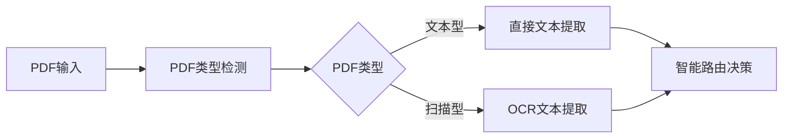
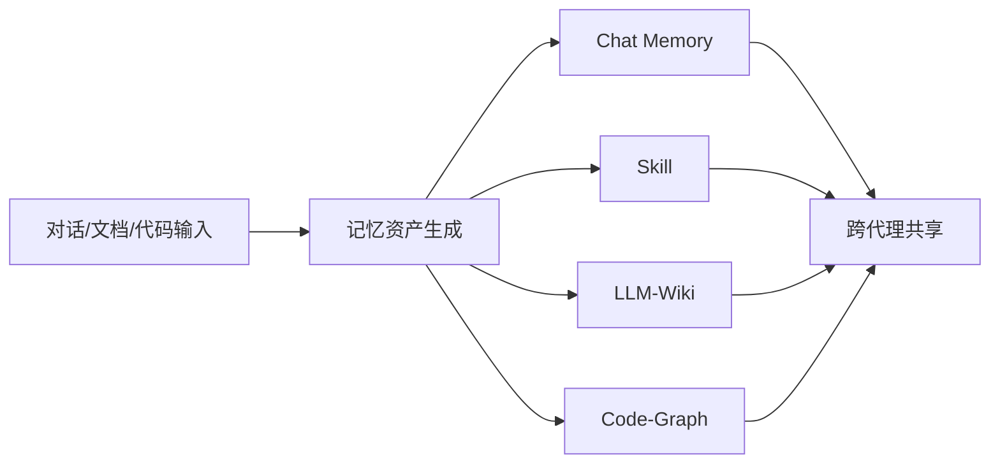
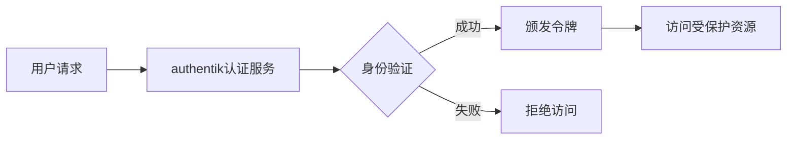

## 今日热点

今日GitHub热榜主要聚焦AI代理技能框架与代码智能工具，开发者积极构建更强大的AI辅助编程系统，同时本地优先和高效处理特定任务的工具也备受关注。

---

## 热门项目一览

| 排名 | 项目 | 语言 | 今日 | 总计 | 简介 |
|:---:|------|:----:|------:|-----:|------|
| 1 | [cloudflare/computer](https://github.com/cloudflare/computer) | TypeScript | +2,802 | 4,853 | Give your agent a computer 👾 |
| 2 | [mattpocock/skills](https://github.com/mattpocock/skills) | Shell | +1,873 | 207,173 | Skills for Real Engineers. ... |
| 3 | [firecrawl/pdf-inspector](https://github.com/firecrawl/pdf-inspector) | Rust | +1,190 | 12,500 | Fast Rust library for PDF i... |
| 4 | [TencentCloud/TencentDB-Agent-Memory](https://github.com/TencentCloud/TencentDB-Agent-Memory) | TypeScript | +1,057 | 16,476 | TencentDB Agent Memory is a... |
| 5 | [esengine/DeepSeek-Reasonix](https://github.com/esengine/DeepSeek-Reasonix) | Go | +888 | 32,471 | DeepSeek-native AI coding a... |
| 6 | [obra/superpowers](https://github.com/obra/superpowers) | Shell | +858 | 268,126 | An agentic skills framework... |
| 7 | [huangruiteng/loopx](https://github.com/huangruiteng/loopx) | Python | +847 | 2,904 | Lightweight loop engineerin... |
| 8 | [addyosmani/agent-skills](https://github.com/addyosmani/agent-skills) | JavaScript | +593 | 82,985 | Production-grade engineerin... |
| 9 | [tirth8205/code-review-graph](https://github.com/tirth8205/code-review-graph) | Python | +237 | 29,054 | Local-first code intelligen... |
| 10 | [goauthentik/authentik](https://github.com/goauthentik/authentik) | Python | +138 | 23,144 | The authentication glue you... |
| 11 | [TapXWorld/ChinaTextbook](https://github.com/TapXWorld/ChinaTextbook) | Roff | +134 | 77,153 | 所有小初高、大学PDF教材。 |
| 12 | [Significant-Gravitas/AutoGPT](https://github.com/Significant-Gravitas/AutoGPT) | Python | +37 | 186,033 | AutoGPT is the vision of ac... |

---

## 趋势洞察

```
┌─────────────────────────────────────────────────────────────────┐
│  AI/ML 工具         ████████████████████████  9 个项目        │
│  其他               █████                     2 个项目        │
│  智能家居             ██                        1 个项目        │
│  安全工具             ██                        1 个项目        │
└─────────────────────────────────────────────────────────────────┘
```

---

## 项目深度解读

### 1. cloudflare/computer — AI代理计算平台

> **一句话总结**：为AI代理提供安全计算环境的开源工具，实现代理与真实计算系统的交互能力。

#### 价值主张

| 维度 | 说明 |
|------|------|
| **解决痛点** | 解决AI代理无法直接访问和操作计算环境的限制 |
| **目标用户** | AI开发者、研究人员、构建自主代理的团队 |
| **核心亮点** | 安全沙箱 + API接口 + 资源隔离 + 云原生存储 |

#### 技术架构


**技术特色**：
- 基于TypeScript构建，提供强类型安全保障
- 实现资源隔离和访问控制机制
- 支持文件系统操作和环境变量管理

#### 热度分析

- 单日增长2800+ Star，反映社区对AI代理计算能力的强烈需求
- Cloudflare品牌背书，具备企业级应用潜力

#### 快速上手

```bash
# 克隆仓库
git clone https://github.com/cloudflare/computer.git

# 安装依赖并启动
npm install && npm run dev
```

#### 注意事项

- 项目处于早期阶段，API可能存在变更
- 使用前需评估安全风险和数据隐私保护
- 需要Cloudflare账号和相关服务配置


### 2. mattpocock/skills — 工程师工具集

> **一句话总结**：为真实工程师设计的实用Shell脚本集合，直接来自实战经验的效率工具。

#### 价值主张

| 维度 | 说明 |
|------|------|
| **解决痛点** | 提供工程师日常工作中可复用的脚本工具，减少重复性工作 |
| **目标用户** | 开发人员、系统管理员、DevOps工程师 |
| **核心亮点** | 实用性强 + 直接来自实战经验 + 高度可定制 |

#### 技术架构


**技术特色**：
- 基于Shell脚本，跨平台兼容性好
- 脚本模块化设计，便于组合使用
- 直接来源于实际工程经验，实用性强

#### 热度分析

- 项目Star数量超过20万且持续快速增长，表明工程师群体对此类实用工具有强烈需求
- Fork数量相对较低，说明项目更多作为参考使用而非二次开发，符合工具类项目特性

#### 快速上手

```bash
# 克隆项目
git clone https://github.com/mattpocock/skills.git
# 进入目录
cd skills
# 查看可用脚本
ls -la
# 执行需要的脚本
./<script-name>
```

#### 注意事项

- 由于项目包含多个Shell脚本，使用前需要确保系统环境兼容
- Shell脚本可能需要适当的权限设置才能执行
- 建议在使用前检查脚本内容，确保安全性


### 3. firecrawl/pdf-inspector — PDF智能检测

> **一句话总结**：高性能Rust库，智能识别扫描与文本型PDF，提供分类与文本提取功能，实现智能路由决策。

#### 价值主张

| 维度 | 说明 |
|------|------|
| **解决痛点** | 解决PDF类型识别与高效文本提取的核心问题 |
| **目标用户** | 需要处理大量PDF文档的开发者与数据分析团队 |
| **核心亮点** | 高性能Rust实现 + 智能类型检测 + 高效文本提取 |

#### 技术架构



**技术特色**：
- 基于Rust语言实现，提供高性能处理能力
- 智能区分扫描与文本型PDF，优化处理路径
- 高效的文本提取算法，支持多种输出格式

#### 热度分析

- 项目Star数已达12,500，单日新增1,190，显示快速增长趋势
- 作为Firecrawl生态组件，在文档处理领域具有重要影响力

#### 快速上手

```bash
# 添加依赖到Cargo.toml
firecrawl-pdf = "0.1.0"

# 基本使用示例
use firecrawl_pdf::Inspector;

let inspector = Inspector::new();
let result = inspector.inspect("example.pdf");
println!("PDF类型: {:?}", result.pdf_type);
```

#### 注意事项

- 需要确保系统安装了必要的OCR依赖，用于处理扫描型PDF
- 对于大型PDF文件，可能需要配置内存使用限制
- 项目License信息不明确，商业使用前需确认授权条款


### 4. TencentCloud/TencentDB-Agent-Memory — AI记忆中心

> **一句话总结**：将对话、文档和代码转化为可重用的记忆资产，赋能AI团队协作与知识共享。

#### 价值主张

| 维度 | 说明 |
|------|------|
| **解决痛点** | AI Agent间知识孤岛问题，团队协作效率低下 |
| **目标用户** | AI开发团队、企业AI应用开发者 |
| **核心亮点** | 四类记忆资产 + 跨框架共享 + 治理机制 |

#### 技术架构



**技术特色**：
- 多源异构数据统一处理机制
- 记忆资产智能分类与提取算法
- 跨框架兼容的API设计
- 团队级知识治理机制
- 记忆资产的可扩展性设计

#### 热度分析

- 项目获得超过1.6万星，单日增长超千星，表明在AI Agent领域有极高的关注度
- 作为腾讯云出品的项目，在AI Agent基础设施领域占据重要生态位置

#### 快速上手

```bash
# 安装
npm install @tencentcloud/tencentdb-agent-memory

# 初始化
tencentdb-agent-memory init

# 启动服务
tencentdb-agent-memory start
```

#### 注意事项

- 需要明确数据隐私和安全保护措施
- 项目许可协议尚不明确，建议在使用前确认
- 与其他AI框架的集成可能需要额外配置


### 5. esengine/DeepSeek-Reasonix — 终端编程助手

> **一句话总结**：DeepSeek原生终端AI编程助手，基于前缀缓存稳定性设计，可长时间运行提升开发效率。

#### 价值主张

| 维度 | 说明 |
|------|------|
| **解决痛点** | AI编程工具在长时间使用时性能不稳定的问题 |
| **目标用户** | 需要在终端环境中进行高效编程的开发者 |
| **核心亮点** | 前缀缓存稳定性 + DeepSeek原生集成 + 终端优化 + 长时间运行支持 + Go语言高性能实现 |

#### 技术架构


**技术特色**：
- 基于Go语言实现的高性能AI编程代理
- 前缀缓存稳定性设计确保长时间运行
- DeepSeek原生集成提供高质量代码生成
- 终端环境优化，适合开发工作流

#### 热度分析

- 项目Star数已达3.2万，近一日增长888，显示强劲发展势头
- 作为AI编程工具领域的创新项目，在开发者社区引起广泛关注

#### 快速上手

```bash
# 安装DeepSeek-Reasonix
go install github.com/esengine/DeepSeek-Reasonix@latest

# 启动服务
deepseek-reasonix
```

#### 注意事项

- 项目许可证未知，商业使用前需确认授权情况
- 作为AI编程工具，生成的代码需要开发者进行审查和测试
- 可能需要API密钥才能使用DeepSeek服务


### 6. obra/superpowers — 智能开发框架

> **一句话总结**：提供智能化的技能框架和软件开发方法论，提升开发效率和质量。

#### 价值主张

| 维度 | 说明 |
|------|------|
| **解决痛点** | 解决软件开发中技能整合和方法论缺失的问题 |
| **目标用户** | 软件开发者和工程团队 |
| **核心亮点** | 智能化代理框架 + 实用方法论 + 高效工作流 |

#### 技术架构


**技术特色**：
- 基于Shell的轻量级实现
- 模块化技能框架设计
- 实用主义开发方法论

#### 热度分析

- 项目获得26万+星标，日增近千，表明其在开发者社区中高度认可
- Fork数与Star数比例接近1:11，说明项目有较高粘性和实际应用价值

#### 快速上手

```bash
# 克隆仓库
git clone https://github.com/obra/superpowers.git
# 进入目录并执行
cd superpowers && ./superpowers
```

#### 注意事项

- 项目许可证未知，使用前需确认授权条款
- 作为方法论框架，可能需要根据具体项目进行调整
- Shell脚本实现，可能在非Unix系统上兼容性有限


### 7. huangruiteng/loopx — AI代理循环内核

> **一句话总结**：轻量级AI代理团队循环工程内核，支持多代理协同与长期任务管理。

#### 价值主张

| 维度 | 说明 |
|------|------|
| **解决痛点** | 解决AI代理团队长期运行时的状态管理和任务交接问题 |
| **目标用户** | AI开发者、多智能体系统研究者、长期运行AI应用构建者 |
| **核心亮点** | 轻量级内核 + 多代理兼容性 + 持久目标管理 + 配额感知 + 可验证交接 |

#### 技术架构


**技术特色**：
- 轻量级状态管理内核设计
- 多AI代理兼容性架构
- 配额感知资源调度机制

#### 热度分析

- 项目Star数近3000，单日激增847，显示近期获得高度关注
- Fork数较少，表明项目处于早期阶段，用户主要处于试用评估阶段

#### 快速上手

```bash
pip install loopx
git clone https://github.com/huangruiteng/loopx.git
cd loopx
python setup.py install
```

#### 注意事项

- 项目许可证未知，商业使用前需确认许可条款
- 项目处于早期阶段，API可能不稳定
- 需要理解AI代理协同概念才能有效利用


### 8. addyosmani/agent-skills — AI工程技能库

> **一句话总结**：为AI编码代理提供生产级工程技能库，提升AI编程助手的专业能力。

#### 价值主张

| 维度 | 说明 |
|------|------|
| **解决痛点** | AI编码代理缺乏工程级实践技能和最佳指导 |
| **目标用户** | AI编码助手开发者、软件工程团队、AI模型训练者 |
| **核心亮点** | 工程技能库 + 最佳实践指导 + 代码质量提升 + 可扩展性 + 生产级适配 |

#### 技术架构


**技术特色**：
- 模块化技能体系，便于AI代理学习和应用
- 工程最佳实践标准化，确保代码质量
- 可扩展框架，支持自定义技能添加

#### 热度分析

- 项目获得8万+星标，近单日增长近600，显示AI工程技能需求旺盛
- 在AI辅助开发领域具有重要影响力，社区活跃度高

#### 快速上手

```bash
# 克隆项目
git clone https://github.com/addyosmani/agent-skills.git

# 探索技能库
cd agent-skills && ls skills/
```

#### 注意事项

- 项目许可证信息未知，使用前需确认许可条款
- 建议关注项目更新日志，及时获取最新工程实践
- 集成到AI系统时需考虑与现有开发流程的兼容性


### 9. tirth8205/code-review-graph — 代码图谱工具

> **一句话总结**：构建代码库持久化图谱，为AI工具提供精准上下文，提升代码审查效率。

#### 价值主张

| 维度 | 说明 |
|------|------|
| **解决痛点** | 解决AI编程工具在大型代码库中上下文过载问题 |
| **目标用户** | AI辅助开发者、代码审查员、大型项目维护者 |
| **核心亮点** | 持久化代码图谱 + 上下文智能过滤 + MCP与CLI集成 + 性能优化 + 大型仓库支持 |

#### 技术架构


**技术特色**：
- 基于图的代码智能分析，提供精确的上下文理解
- 持久化存储代码结构，减少重复分析开销
- 与MCP和CLI工具无缝集成，提升开发效率

#### 热度分析

- 近3万星数，单日增长237，表明项目备受开发者关注
- Fork数2700+，社区活跃度高，表明项目具有实际应用价值

#### 快速上手

```bash
# 安装
pip install code-review-graph

# 初始化代码库图谱
code-review-graph init

# 运行代码分析
code-review-graph analyze
```

#### 注意事项

- 需要Python环境支持，建议使用虚拟环境
- 对于特别大的代码库，首次构建可能需要较长时间
- 与AI工具集成可能需要额外配置
- 许可证信息不明确，使用前需确认授权条款


### 10. goauthentik/authentik — 身份认证平台

> **一句话总结**：统一身份认证与访问管理解决方案，提供灵活的认证粘合能力。

#### 价值主张

| 维度 | 说明 |
|------|------|
| **解决痛点** | 解决企业多系统身份认证碎片化问题，提供统一认证入口 |
| **目标用户** | 需要统一身份认证的企业IT管理员和开发团队 |
| **核心亮点** | 开源身份认证 + SSO支持 + 多协议适配 + 灵活扩展性 |

#### 技术架构



**技术特色**：
- 基于Python构建，支持多种身份认证协议
- 提供REST API和Web界面，便于集成和管理
- 支持多种身份提供商(IdP)和身份验证方法

#### 热度分析

- 项目Star数超过2.3万，近期增长稳定，表明项目活跃度高
- 在身份认证领域具有重要影响力，是开源IAM领域的重要项目

#### 快速上手

```bash
# 克隆仓库
git clone https://github.com/goauthentik/authentik.git

# 安装依赖
pip install -r requirements.txt

# 启动服务
python manage.py runserver
```

#### 注意事项

- 项目依赖较多，首次部署需要仔细检查环境兼容性
- 配置较为复杂，建议参考官方文档进行初始部署
- 安全性要求高，需要定期更新以修复潜在漏洞


### 11. TapXWorld/ChinaTextbook — [教育教材库]

> **一句话总结**：整合中国各学段教材资源的开源项目，为学习者提供便捷获取途径。

#### 价值主张

| 维度 | 说明 |
|------|------|
| **解决痛点** | 解决中国学生获取教材困难问题，提供一站式教材资源 |
| **目标用户** | 中国学生、教师、自学者及教育研究者 |
| **核心亮点** | 资源全面性 + 开源共享 + 持续更新 + 分类清晰 + 使用便捷 |

#### 技术架构


**技术特色**：
- 使用Roff格式化文档，确保兼容性和可读性
- 采用开源协作模式，社区共同维护资源更新
- 简洁的目录结构，便于快速查找所需教材

#### 热度分析

- 项目获得超7.7万星，月均增长约134星，表明持续受到教育群体关注
- Fork数与Star数比例健康，表明用户积极参与资源贡献和二次分发
- 零未解决问题，显示项目维护状态良好

#### 快速上手

```bash
# 克隆项目到本地
git clone https://github.com/TapXWorld/ChinaTextbook.git

# 进入项目目录
cd ChinaTextbook

# 浏览教材目录
ls -R
```

#### 注意事项

- 请注意遵守相关版权法律法规，仅用于个人学习目的
- 资源收集来自公开渠道，不保证所有教材的合法性和完整性
- 建议通过官方渠道获取最新教材，本项目可能存在更新延迟


### 12. Significant-Gravitas/AutoGPT — 自主AI助手

> **一句话总结**：让AI能够自主思考、规划和执行任务的实验性系统，无需人类干预即可完成复杂任务。

#### 价值主张

| 维度 | 说明 |
|------|------|
| **解决痛点** | 解决AI需要持续人类指导的问题，实现真正的自主任务执行 |
| **目标用户** | AI研究人员、开发者和探索自主AI能力的技术爱好者 |
| **核心亮点** | 自主任务执行 + 长期记忆管理 + 多模态交互 + 自我反思能力 + 工具集成 |

#### 技术架构


**技术特色**：
- 基于GPT的自主决策系统
- 反思机制实现持续改进
- 长短期记忆结合架构
- 多工具集成框架
- 自我纠错和任务重规划能力

#### 热度分析

- 项目获得超过18万stars，持续增长表明在自主AI领域处于领先地位
- 作为自主AI领域的标志性项目，对AI社区影响深远，催生多个分支项目

#### 快速上手

```bash
# 克隆仓库
git clone https://github.com/Significant-Gravitas/Auto-GPT.git
cd Auto-GPT

# 安装依赖
pip install -r requirements.txt

# 运行项目
python -m autogpt
```

#### 注意事项

- 需要OpenAI API密钥，使用会产生费用
- 项目仍处于实验阶段，可能不稳定
- 执行复杂任务需要大量计算资源和时间
- 可能会产生不可预测的输出，需要人工监督
- 部分功能可能需要额外配置和调试


### 13. google/guava — [Java核心库集]

> **一句话总结**：Google核心Java库集合，提供丰富的工具类和实用功能，简化Java开发流程。

#### 价值主张

| 维度 | 说明 |
|------|------|
| **解决痛点** | 解决Java标准库功能不足，提供常用工具和最佳实践实现 |
| **目标用户** | Java开发者和企业级Java应用开发团队 |
| **核心亮点** | 集合工具 + 并发支持 + 缓存实现 + IO工具 + 函数式支持 |

#### 技术架构


**技术特色**：
- 提供比Java标准库更丰富的集合操作和实现
- 简化并发编程，提供线程安全的数据结构
- 实现高效的缓存机制，支持多种缓存策略
- 提供函数式编程支持，弥补Java早期版本不足
- 包含大量实用工具类，减少重复开发

#### 热度分析

- 作为Google官方维护的项目，长期保持稳定的高星增长，是Java生态系统中不可或缺的基础库
- 拥有活跃的贡献者社区和广泛的用户基础，被大量知名Java项目依赖使用

#### 快速上手

```bash
# 添加Maven依赖
<dependency>
    <groupId>com.google.guava</groupId>
    <artifactId>guava</artifactId>
    <version>32.1.2-jre</version>
</dependency>

# 基本使用示例
List<String> names = Lists.newArrayList("Alice", "Bob", "Charlie");
String joined = Joiner.on(", ").join(names);
```

#### 注意事项

- 版本更新频繁，需要注意兼容性问题，尤其是重大版本变更
- 某些功能可能与Java标准库重叠，需注意选择使用
- 大型项目中引入会增加依赖复杂度，需谨慎评估


## 今日推荐

| 主题 | 推荐项目 | 亮点 |
|------|----------|------|
| 今日最热 | [cloudflare/computer](https://github.com/cloudflare/computer) | Give your agent a... |
| 值得关注 | [mattpocock/skills](https://github.com/mattpocock/skills) | Skills for Real E... |
| 快速上手 | [firecrawl/pdf-inspector](https://github.com/firecrawl/pdf-inspector) | Fast Rust library... |
| 长期潜力 | [TencentCloud/TencentDB-Agent-Memory](https://github.com/TencentCloud/TencentDB-Agent-Memory) | TencentDB Agent M... |

---

<div align="center">

*Generated on 2026-08-07 | Powered by GitHub Trending Reporter*

</div>