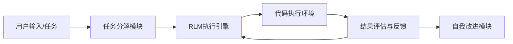
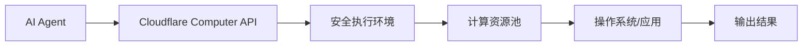
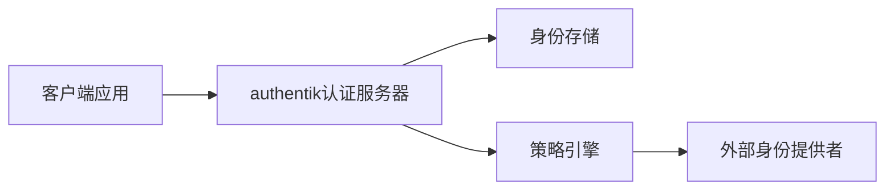
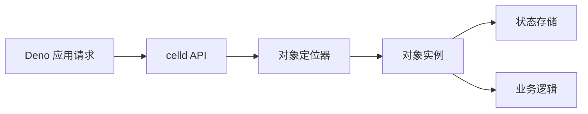
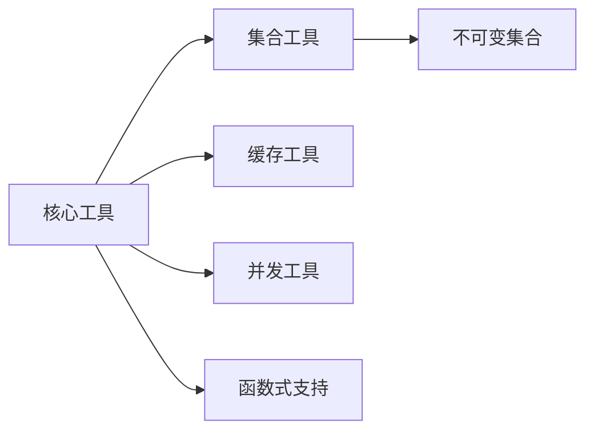
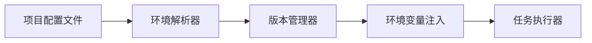
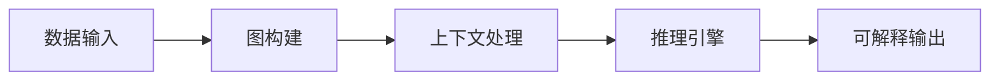

## 今日热点

AI智能体技能框架与自主协作成为今日热点，开发者积极构建能执行复杂任务的AI生态系统，同时实用开发工具持续受到关注。

---

## 热门项目一览

| 排名 | 项目 | 语言 | 今日 | 总计 | 简介 |
|:---:|------|:----:|------:|-----:|------|
| 1 | [PrimeIntellect-ai/prime-agent](https://github.com/PrimeIntellect-ai/prime-agent) | TypeScript | +2,293 | 6,535 | A self-improving RLM agent ... |
| 2 | [mattpocock/skills](https://github.com/mattpocock/skills) | Shell | +2,152 | 208,820 | Skills for Real Engineers. ... |
| 3 | [addyosmani/agent-skills](https://github.com/addyosmani/agent-skills) | JavaScript | +1,131 | 83,903 | Production-grade engineerin... |
| 4 | [cloudflare/computer](https://github.com/cloudflare/computer) | TypeScript | +872 | 5,718 | Give your agent a computer 👾 |
| 5 | [obra/superpowers](https://github.com/obra/superpowers) | Shell | +782 | 268,747 | An agentic skills framework... |
| 6 | [goauthentik/authentik](https://github.com/goauthentik/authentik) | Python | +530 | 23,598 | The authentication glue you... |
| 7 | [denoland/celld](https://github.com/denoland/celld) | Rust | +516 | 2,207 | self-hosted, distributed Du... |
| 8 | [Significant-Gravitas/AutoGPT](https://github.com/Significant-Gravitas/AutoGPT) | Python | +355 | 186,322 | AutoGPT is the vision of ac... |
| 9 | [google/skills](https://github.com/google/skills) | Python | +327 | 16,252 | Agent Skills for Google pro... |
| 10 | [pranshuparmar/witr](https://github.com/pranshuparmar/witr) | Go | +234 | 19,749 | Why is this running? Trace ... |
| 11 | [google/guava](https://github.com/google/guava) | Java | +152 | 51,763 | Google core libraries for Java |
| 12 | [666ghj/MiroFish](https://github.com/666ghj/MiroFish) | Python | +141 | 70,508 | A Simple and Universal Swar... |

---

## 趋势洞察

```
┌─────────────────────────────────────────────────────────────────┐
│  AI/ML 工具         ████████████████████████  11 个项目        │
│  其他               ████████                  4 个项目        │
│  项目管理             ██                        1 个项目        │
│  安全工具             ██                        1 个项目        │
└─────────────────────────────────────────────────────────────────┘
```

---

## 项目深度解读

### 1. PrimeIntellect-ai/prime-agent — 智能编程助手

> **一句话总结**：自我改进的RLM智能体，专为复杂编程任务和长期自主工作流设计。

#### 价值主张

| 维度 | 说明 |
|------|------|
| **解决痛点** | 解决复杂编程任务中需要长时间自主执行和持续优化的需求 |
| **目标用户** | 需要处理复杂编程任务的开发者、自动化工作流设计者 |
| **核心亮点** | 自我学习能力 + 长期任务自主执行 + 编程工作流优化 + 自主改进机制 |

#### 技术架构



**技术特色**：
- 强化学习模型支持持续自我改进
- 长期任务分解与执行能力
- 代码执行与评估闭环系统
- TypeScript实现确保类型安全与可维护性

#### 热度分析

- 项目Star数短期内大幅增长(单日增加2,293)，表明其技术方案或功能受到社区高度关注
- 零OpenIssues可能反映项目通过其他渠道处理问题，或处于早期阶段尚未遇到复杂问题

#### 快速上手

```bash
# 克隆项目
git clone https://github.com/PrimeIntellect-ai/prime-agent.git

# 安装依赖
cd prime-agent
npm install

# 启动服务
npm start
```

#### 注意事项

- 项目许可证未知，使用前需确认授权条款
- 作为AI智能体项目，可能需要计算资源支持
- 项目处于早期阶段，API和功能可能不稳定
- 自我改进机制可能导致行为变化，需要适当监控


### 2. mattpocock/skills — AI工程技能库

> **一句话总结**：为AI助手提供高质量工程技能提示词，提升开发效率和代码质量。

#### 价值主张

| 维度 | 说明 |
|------|------|
| **解决痛点** | 解决AI助手输出质量不稳定、专业性不足的问题 |
| **目标用户** | 使用AI助手进行开发的软件工程师和技术团队 |
| **核心亮点** | 精心设计的提示词 + 覆盖多领域技能 + 实战验证 + 持续更新 + 开源社区贡献 |

#### 技术架构


**技术特色**：
- 简洁的Shell脚本组织，易于集成
- 模块化提示词设计，支持组合使用
- 跨语言、跨领域的技能覆盖

#### 热度分析

- 项目获得20万+ Star，日均增长超2000，表明工程师对AI辅助开发工具的强烈需求
- Fork数与Star数比例约1:11，显示用户更倾向于直接使用而非二次开发，工具实用性极高

#### 快速上手

```bash
# 克隆仓库
git clone https://github.com/mattpocock/skills.git
# 进入目录
cd skills
# 查看可用技能
ls -la
```

#### 注意事项
- 提示词需要根据具体开发环境进行调整
- 不同AI平台对提示词的响应可能有差异
- 建议理解提示词背后的逻辑，而非直接复制使用


### 4. cloudflare/computer — AI代理计算平台

> **一句话总结**：为AI代理提供安全隔离的计算环境，实现AI与真实计算机的交互能力。

#### 价值主张

| 维度 | 说明 |
|------|------|
| **解决痛点** | AI代理无法直接操作计算机，限制其实用性和能力边界 |
| **目标用户** | AI开发者、研究人员、需要自动化计算任务的用户 |
| **核心亮点** + 安全隔离环境 + 云端计算能力 + API接口统一 + 资源动态分配 |

#### 技术架构



**技术特色**：
- 基于Cloudflare边缘网络提供低延迟计算
- 容器化技术确保安全隔离
- 资源动态分配与按需使用
- 提供统一API简化集成

#### 热度分析

- 项目短期内star激增，表明功能创新性强，受到AI开发者高度关注
- 作为Cloudflare生态新组件，有望成为AI代理与真实世界交互的重要桥梁

#### 快速上手

```bash
# 安装依赖
npm install @cloudflare/computer

# 初始化配置
npx @cloudflare/computer init

# 启动代理计算环境
npx @cloudflare/computer start
```

#### 注意事项

- 项目目前处于早期阶段，API可能不稳定
- 需要Cloudflare账户和适当的API密钥
- 计算资源使用可能产生费用，建议先在开发环境测试
- 安全隔离虽强，但仍需谨慎处理敏感数据和操作


### 5. obra/superpowers — 智能开发框架

> **一句话总结**：基于代理技能的高效软件开发方法论，提升团队协作与代码质量。

#### 价值主张

| 维度 | 说明 |
|------|------|
| **解决痛点** | 传统软件开发效率低下，缺乏系统化方法论 |
| **目标用户** | 软件开发团队与个人开发者 |
| **核心亮点** | 代理技能框架+高效协作方法+自动化工具+最佳实践+持续改进 |

#### 技术架构


**技术特色**：
- 基于Shell脚本实现轻量级工具集
- 跨平台兼容性高，无需复杂依赖
- 模块化设计，易于扩展与定制

#### 热度分析

- 项目Star数超过26万，日增近800，表明开发者社区高度认可
- Fork数与Star数比例健康，显示项目被广泛采用与二次开发

#### 快速上手

```bash
# 克隆仓库
git clone https://github.com/obra/superpowers.git
# 进入目录
cd superpowers
# 运行安装脚本
./install.sh
```

#### 注意事项

- 需要基本的Shell脚本知识以充分利用项目功能
- 根据项目环境可能需要调整配置文件
- 建议先在小规模项目中尝试后再全面采用


### 6. goauthentik/authentik — 身份认证网关

> **一句话总结**：一个统一身份认证和授权平台，提供SSO、MFA和灵活的身份管理解决方案。

#### 价值主张

| 维度 | 说明 |
|------|------|
| **解决痛点** | 解决企业多系统身份认证分散、管理复杂的问题 |
| **目标用户** | 企业IT管理员、DevOps团队、SaaS服务提供商 |
| **核心亮点** | 统一身份认证 + 多因素认证 + 灵活身份管理 + 丰富的集成能力 + 可扩展架构 |

#### 技术架构



**技术特色**：
- 基于Python构建，易于扩展和定制
- 提供REST API进行深度集成
- 支持多种身份验证协议和标准
- 采用模块化设计，灵活配置
- 支持容器化部署，便于DevOps实践

#### 热度分析

- 项目Star数超过23k，近期增长迅速(+530 today)，表明项目热度高且处于活跃增长期
- 作为身份认证解决方案，在多云、混合云环境下需求旺盛，社区活跃度高

#### 快速上手

```bash
# 使用docker-compose快速启动authentik
docker-compose up -d

# 访问web界面进行初始配置
http://localhost:9000
```

#### 注意事项

- 需要配置数据库和外部身份提供者才能完整使用
- 部署时需注意安全配置，尤其是管理员账户和API密钥
- 对于生产环境，建议使用反向代理和SSL/TLS加密


### 7. denoland/celld — 分布式持久对象

> **一句话总结**：Deno 生态系统的自托管分布式持久对象服务，提供全局唯一状态和强一致性保证。

#### 价值主张

| 维度 | 说明 |
|------|------|
| **解决痛点** | 解决 Deno 生态系统中分布式状态管理和持久性问题 |
| **目标用户** | Deno 开发者，需要分布式状态管理的 Web 应用和微服务 |
| **核心亮点** | Deno 原生支持 + 自托管部署 + 分布式持久对象 + 强一致性保证 |

#### 技术架构



**技术特色**：
- 针对 Deno 运行时优化的分布式持久对象系统
- 使用 Rust 实现，提供高性能和内存安全
- 实现类似 Cloudflare Durable Objects 的对象模型
- 提供自托管选项，避免云厂商锁定

#### 热度分析

- 项目近期增长迅速，单日新增516星，表明 Deno 社区对分布式状态管理解决方案需求强烈
- Fork 数相对较少(62)，说明项目可能处于早期阶段，尚未形成大规模的二次开发社区

#### 快速上手

```bash
# 安装 celld
deno install -A --unstable https://deno.land/x/celld/install.ts

# 启动服务
celld start
```

#### 注意事项

- 项目可能处于早期阶段，API 和功能可能会发生变化
- 文档可能不够完善，需要阅读源码了解详细使用方法
- 需要一定的分布式系统知识才能正确部署和运维
- 作为自托管系统，


### 8. Significant-Gravitas/AutoGPT — 自主AI代理

> **一句话总结**：AutoGPT是一个能自主规划、执行任务的AI系统，无需人类干预即可完成复杂目标。

#### 价值主张

| 维度 | 说明 |
|------|------|
| **解决痛点** | 解决AI工具需持续人工干预的问题，实现任务完全自主执行 |
| **目标用户** | 开发者、研究人员和企业用户，希望AI自动化工作流程 |
| **核心亮点** | 自主任务规划 + GPT模型集成 + 记忆系统 + 互联网访问 + 文件操作 |

#### 技术架构


**技术特色**：
- 基于GPT-4的自主决策系统
- 长期记忆和上下文管理机制
- 多工具集成与自动调用能力

#### 热度分析

- 项目Star数超18万，日均增长355，显示极高社区关注度和采用率
- Fork数近5万，表明开发者社区积极参与二次开发和贡献

#### 快速上手

```bash
# 克隆仓库
git clone https://github.com/Significant-Gravitas/AutoGPT.git

# 安装依赖
pip install -r requirements.txt

# 运行AutoGPT
python -m autogpt
```

#### 注意事项

- 需要OpenAI API密钥才能运行
- 资源消耗较大，建议在性能较好的机器上运行
- 项目仍在快速发展中，API可能会有变化


### 9. google/skills — Google技能库

> **一句话总结**：为Google产品提供标准化智能代理技能的Python组件库

#### 价值主张

| 维度 | 说明 |
|------|------|
| **解决痛点** | 简化AI代理与Google产品集成的复杂度 |
| **目标用户** | Google生态开发者与AI应用构建者 |
| **核心亮点** | 模块化设计+统一API+自动认证+跨服务协同+易于扩展 |

#### 技术架构


**技术特色**：
- 基于Python的轻量级技能注册与发现机制
- 统一的Google API认证与错误处理中间件
- 技能间状态共享与协作框架

#### 热度分析

- 项目Star数超1.6万且持续增长，表明Google开发者生态需求旺盛
- 零未解决问题显示项目维护质量高，社区反馈处理及时

#### 快速上手

```bash
# 安装核心库
pip install google-skills

# 初始化技能环境
python -m google_skills init --credentials path/to/creds.json

# 运行示例技能
python -m google_skills run search --query "Python教程"
```

#### 注意事项

- 需要有效的Google Cloud凭据才能使用大部分技能
- 部分高级功能可能需要启用相应的API服务和付费订阅
- 建议查看每个技能模块的文档了解具体使用限制和最佳实践


### 10. pranshuparmar/witr — 进程追溯工具

> **一句话总结**：通过CLI和TUI界面追踪任何进程、端口、容器或文件的启动源头，帮助用户理解系统运行状态。

#### 价值主张

| 维度 | 说明 |
|------|------|
| **解决痛点** | 解决用户无法快速定位进程来源、排查资源占用问题的痛点 |
| **目标用户** | 系统管理员、DevOps工程师、开发人员 |
| **核心亮点** | 深度追溯进程树 + 直观可视化界面 + 支持多种资源类型追踪 |

#### 技术架构


**技术特色**：
- 利用Go语言的高效性能实现快速系统信息采集
- 通过cgo调用系统底层API获取进程树信息
- 实现了TUI界面提供直观的交互体验

#### 热度分析

- 项目获得近2万stars，增长迅速，说明工具解决了实际需求
- 作为系统工具，生态位置明确，在系统管理领域有一定影响力

#### 快速上手

```bash
# 安装
go install github.com/pranshuparmar/witr@latest

# 基本使用
witr  # 追踪当前系统所有进程
witr -p <PID>  # 追踪特定进程
witr -port <端口号>  # 追踪使用特定端口的进程
```

#### 注意事项

- 需要root权限才能获取完整的系统进程信息
- 在大型系统上可能需要较长时间完成全系统扫描
- 对于容器化环境，可能需要额外配置才能正确追踪容器内进程


### 11. google/guava — Java核心工具库

> **一句话总结**：Google开发的Java核心库集合，提供丰富工具类和实用程序，简化开发流程并提升代码质量。

#### 价值主张

| 维度 | 说明 |
|------|------|
| **解决痛点** | 填补标准Java库功能空白，简化复杂操作，减少重复代码 |
| **目标用户** | Java开发者，尤其是构建大型应用和需要高质量工具库的场景 |
| **核心亮点** | 高效集合工具 + 不可变集合 + 缓存实现 + 函数式支持 + 并发工具 |

#### 技术架构



**技术特色**：
- 提供高性能、经过充分测试的集合和实用工具类
- 实现不可变集合模式，提高代码安全性和并发性能
- 集成强大的缓存实现，支持多种驱逐策略和加载机制
- 提供对Java函数式编程的增强支持，简化代码表达
- 包含丰富的I/O、数学和字符串处理工具

#### 热度分析

- 拥有5万+星，持续稳定增长，是Java生态中最受欢迎的工具库之一
- 作为Google官方维护的项目，在企业级应用中广泛采用，社区信任度高

#### 快速上手

```bash
# 添加 Maven 依赖
<dependency>
    <groupId>com.google.guava</groupId>
    <artifactId>guava</artifactId>
    <version>32.1.2-jre</version>
</dependency>

# 基本使用示例
List<String> names = Lists.newArrayList("Alice", "Bob", "Charlie");
ImmutableSet.copyOf(names);
Cache<String, String> cache = CacheBuilder.newBuilder()
    .maximumSize(1000).expireAfterWrite(10, TimeUnit.MINUTES)
    .build();
```

#### 注意事项

- Guava库较大，建议按需引入特定模块而非整个库，以减少应用体积
- 某些功能在Java 8+中已被标准库支持，需注意与新版本Java的功能重叠
- 部分高级功能如缓存实现需要合理配置参数，否则可能导致内存问题


### 12. 666ghj/MiroFish — 群体智能引擎

> **一句话总结**：简洁通用的群体智能引擎，无需复杂算法即可实现各种预测任务

#### 价值主张

| 维度 | 说明 |
|------|------|
| **解决痛点** | 降低群体智能应用门槛，无需复杂算法知识即可实现预测 |
| **目标用户** | 开发者、研究人员、数据分析师及需要预测功能的业务人员 |
| **核心亮点** | 简单易用 + 通用性强 + 高效预测 + 开源免费 + 无算法基础 |

#### 技术架构


**技术特色**：
- 基于群体智能的分布式计算架构
- 简洁的Python实现，易于集成
- 支持多种预测场景的自适应调整

#### 热度分析

- 超过7万个Star，日均增长约140个，表明项目活跃度高且受社区认可
- 近万次Fork，显示项目被广泛采用和二次开发

#### 快速上手

```bash
# 安装依赖
pip install miropredict

# 基本使用示例
from miropredict import MiroFish
model = MiroFish()
result = model.predict([1, 2, 3, 4, 5])
print(result)
```

#### 注意事项

- 项目许可证信息不明确，使用前需确认授权条款
- 建议查看源码文档了解具体API和使用方法
- 群体智能算法可能需要大量数据才能获得最佳预测效果


### 13. jdx/mise — 多语言环境管理器

> **一句话总结**：mise 是一个通用的开发环境管理工具，统一管理多语言版本和环境变量配置。

#### 价值主张

| 维度 | 说明 |
|------|------|
| **解决痛点** | 统一管理多语言开发环境，避免版本冲突和环境配置混乱 |
| **目标用户** | 使用多种编程语言的全栈开发者和DevOps工程师 |
| **核心亮点** | 多语言支持 + 环境变量管理 + 任务自动化 + 插件扩展 |

#### 技术架构



**技术特色**：
- 使用 Rust 编写，提供高性能和跨平台支持
- 统一的接口管理多种编程语言环境
- 支持项目级和全局级的环境配置
- 插件系统允许扩展对新语言的支持

#### 热度分析

- 项目 Star 数超过 32k，且每日新增 135+，表明开发者社区高度认可
- Fork 数量适中，说明项目主要作为工具被使用而非大量定制化修改
- Issues 数为 0，可能表明项目维护良好或问题通过其他渠道解决

#### 快速上手

```bash
# 安装 mise
curl https://mise.run | sh

# 添加到 PATH (根据 shell 可能需要不同命令)
echo 'eval "$(~/.local/bin/mise init bash)"' >> ~/.bashrc

# 安装特定语言版本
mise install node@18
mise install python@3.10
```

#### 注意事项

- 需要理解不同语言版本的兼容性，避免引入不兼容的依赖
- 项目级配置可能会覆盖全局设置，需注意配置优先级
- 插件生态仍在发展中，某些小众语言支持可能有限


### 14. semantica-agi/semantica — 图原生AI基建

> **一句话总结**：基于图结构构建可解释、有上下文感知能力的AI系统基础框架。

#### 价值主张

| 维度 | 说明 |
|------|------|
| **解决痛点** | 解决AI系统缺乏上下文理解和决策可解释性的核心问题 |
| **目标用户** | AI研究人员、需要可解释AI系统的开发者、合规要求高的组织 |
| **核心亮点** | 图原生架构 + 上下文建模 + 责任追踪 + 可解释输出 + 知识融合 |

#### 技术架构



**技术特色**：
- 基于图数据结构的原生设计，便于表示复杂关系和上下文
- 提供可解释AI的底层支持，增强模型决策透明度
- 支持责任追踪机制，确保AI决策的可审计性
- 模块化架构设计，便于集成不同AI组件和算法

#### 热度分析

- 项目Star数持续快速增长（今日+122），表明社区关注度迅速提升
- Fork数相对较少（305），可能表明项目偏向研究性质或处于早期阶段

#### 快速上手

```bash
# 克隆项目
git clone https://github.com/semantica-agi/semantica.git
cd semantica

# 安装依赖
pip install -r requirements.txt

# 运行示例
python examples/basic_context.py
```

#### 注意事项

- 项目许可证信息不明确，使用前需确认开源协议
- 作为较新项目，生态系统和文档可能还在完善中
- 可能需要一定的图计算和知识图谱基础知识才能充分利用项目功能


### 15. K2SOsint/Legendary_OSINT — [OSINT资源库]

> **一句话总结**：为调查人员、威胁情报分析师和合规专家整理的开源情报工具与资源集合。

#### 价值主张

| 维度 | 说明 |
|------|------|
| **解决痛点** | 散落各处的OSINT工具资源缺乏系统整理，影响工作效率 |
| **目标用户** | 欺诈调查员、CTI分析师、KYC/AML合规专家 |
| **核心亮点** | 资源全面性 + 分类清晰 + 持续更新 |

#### 技术架构


**技术特色**：
- 轻量级资源聚合，无需复杂技术栈
- 结构化Markdown文档组织
- 社区驱动的持续更新机制

#### 热度分析

- 项目获得1428颗星，近期单日增长109颗，显示社区高度认可
- Fork数189，表明项目被广泛采用和二次分发
- 零开放问题，反映项目维护良好，用户反馈渠道完善

#### 快速上手

```bash
# 克隆仓库查看所有OSINT资源
git clone https://github.com/K2SOsint/Legendary_OSINT.git
cd Legendary_OSINT
# 浏览README.md和其他分类文档
```

#### 注意事项

- 工具使用需遵守相关法律法规和道德规范
- 部分工具可能需要特定权限或付费订阅
- 定期检查工具更新，确保信息获取的准确性和时效性


### 16. unclebob/swarm-forge — AI协调工具

> **一句话总结**：轻量级多AI代理协调工具，通过Clojure实现智能体协同工作流。

#### 价值主张

| 维度 | 说明 |
|------|------|
| **解决痛点** | 多个AI代理协同工作时缺乏统一协调机制 |
| **目标用户** | AI系统开发者、多智能体研究者、自动化流程设计师 |
| **核心亮点** | 简单易用 + Clojure函数式特性 + 可扩展架构 + 轻量级设计 |

#### 技术架构


**技术特色**：
- 基于Clojure的函数式编程范式，提升系统可靠性
- 轻量级设计，减少资源消耗
- 模块化架构，支持不同类型AI代理的灵活集成

#### 热度分析

- 项目Star数持续增长，近一天增加81个，表明项目近期有重要更新或获得社区关注
- Fork数相对Star数较低(201/1831)，说明项目可能更偏向于使用而非二次开发

#### 快速上手

```bash
# 克隆项目
git clone https://github.com/unclebob/swarm-forge.git
# 运行示例
lein run example.swarm
```

#### 注意事项

- 项目许可证未知，商用前需确认授权方式
- 项目Open Issues为0，可能表示问题通过其他渠道(如Discord、论坛)处理
- 由于是AI协调工具，使用时需考虑不同AI模型间的兼容性和数据安全


### 17. chenyme/grok2api — Grok API网关

> **一句话总结**：为 Grok 系列服务提供多账户 API 网关的 Go 实现，支持 Build、Web 和 Console 服务

#### 价值主张

| 维度 | 说明 |
|------|------|
| **解决痛点** | 解决 Grok 系列服务多账户管理及 API 访问控制问题 |
| **目标用户** | Grok 服务开发者及需要多账户管理的用户 |
| **核心亮点** | 多账户支持 + API 网关功能 + Go 高性能实现 |

#### 技术架构


**技术特色**：
- 基于 Go 语言实现，高性能并发处理
- 多账户隔离的 API 访问控制
- 支持 Grok Build、Web 和 Console 多种服务

#### 热度分析

- 项目 Star 数达7,141，近期日增55，显示出快速增长的热度
- Fork 数2,170，表明社区活跃度高，有较多二次开发或定制需求

#### 快速上手

```bash
# 克隆项目
git clone https://github.com/chenyme/grok2api.git

# 安装依赖
go mod tidy

# 运行项目
go run main.go
```

#### 注意事项

- 项目许可证未知，商业使用前需确认授权
- 由于 Open Issues 为0，可能社区反馈渠道不够完善
- 项目依赖可能随版本更新而变化，需关注兼容性问题


## 今日推荐

| 主题 | 推荐项目 | 亮点 |
|------|----------|------|
| 今日最热 | [PrimeIntellect-ai/prime-agent](https://github.com/PrimeIntellect-ai/prime-agent) | A self-improving ... |
| 值得关注 | [mattpocock/skills](https://github.com/mattpocock/skills) | Skills for Real E... |
| 快速上手 | [addyosmani/agent-skills](https://github.com/addyosmani/agent-skills) | Production-grade ... |
| 长期潜力 | [cloudflare/computer](https://github.com/cloudflare/computer) | Give your agent a... |

---

<div align="center">

*Generated on 2026-08-08 | Powered by GitHub Trending Reporter*

</div>