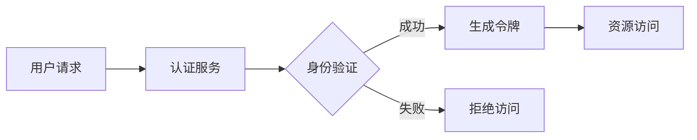
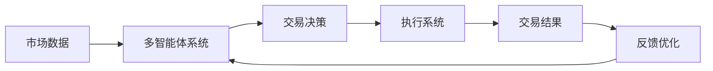
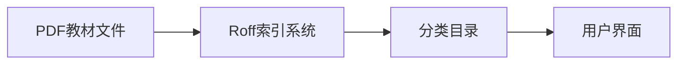
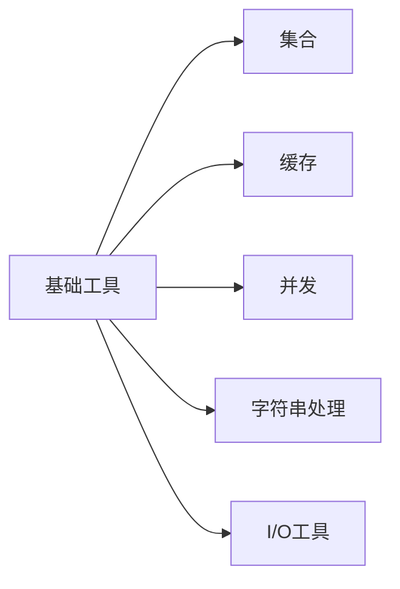
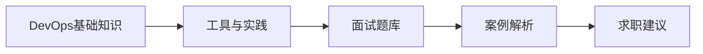

## 今日热点

今日GitHub热榜项目精彩纷呈。

---

## 热门项目一览

| 排名 | 项目 | 语言 | 今日 | 总计 | 简介 |
|:---:|------|:----:|------:|-----:|------|
| 1 | [PrimeIntellect-ai/prime-agent](https://github.com/PrimeIntellect-ai/prime-agent) | TypeScript | +2,483 | 8,956 | A self-improving RLM agent ... |
| 2 | [mattpocock/skills](https://github.com/mattpocock/skills) | Shell | +1,359 | 210,020 | Skills for Real Engineers. ... |
| 3 | [addyosmani/agent-skills](https://github.com/addyosmani/agent-skills) | JavaScript | +779 | 84,569 | Production-grade engineerin... |
| 4 | [google/skills](https://github.com/google/skills) | Python | +481 | 16,737 | Agent Skills for Google pro... |
| 5 | [goauthentik/authentik](https://github.com/goauthentik/authentik) | Python | +467 | 23,976 | The authentication glue you... |
| 6 | [denoland/celld](https://github.com/denoland/celld) | Rust | +432 | 2,572 | self-hosted, distributed Du... |
| 7 | [TauricResearch/TradingAgents](https://github.com/TauricResearch/TradingAgents) | Python | +153 | 96,477 | TradingAgents: Multi-Agents... |
| 8 | [TapXWorld/ChinaTextbook](https://github.com/TapXWorld/ChinaTextbook) | Roff | +118 | 77,934 | 所有小初高、大学PDF教材。 |
| 9 | [bannedbook/fanqiang](https://github.com/bannedbook/fanqiang) | Kotlin | +101 | 49,882 | 翻墙-科学上网 |
| 10 | [google/guava](https://github.com/google/guava) | Java | +93 | 51,851 | Google core libraries for Java |
| 11 | [litu54/DevOps-Interview-Guide](https://github.com/litu54/DevOps-Interview-Guide) | Unknown | +68 | 706 | DevOps Interview Guide |
| 12 | [LadybirdBrowser/ladybird](https://github.com/LadybirdBrowser/ladybird) | C++ | +48 | 64,988 | Truly independent web browser |

---

## 趋势洞察

```
┌─────────────────────────────────────────────────────────────────┐
│  其他               ████████████████████████  6 个项目        │
│  AI/ML 工具         ████████████████████      5 个项目        │
│  安全工具             ████                      1 个项目        │
└─────────────────────────────────────────────────────────────────┘
```

---

## 项目深度解读

### 1. PrimeIntellect-ai/prime-agent — [智能编程助手]

> **一句话总结**：一个能够自我改进的AI代理，专为复杂编程任务和长期自主工作流设计。

#### 价值主张

| 维度 | 说明 |
|------|------|
| **解决痛点** | 解决复杂编程任务中持续优化和自主执行的需求 |
| **目标用户** | 软件开发者、自动化任务需求者和AI研究人员 |
| **核心亮点** | 自我改进能力 + 长期任务管理 + 编程工作流优化 + 自主决策能力 + RLM技术 |

#### 技术架构


**技术特色**：
- 基于强化学习的自我改进机制
- 长期任务管理与执行能力
- 编程工作流优化与自主决策

#### 热度分析

- 项目在短时间内获得近9K星标，单日增长超2.4K，显示极高的社区关注度
- 零开放问题表明项目维护良好，社区可能通过其他渠道解决遇到的问题

#### 快速上手

```bash
# 克隆仓库
git clone https://github.com/PrimeIntellect-ai/prime-agent.git

# 安装依赖
npm install

# 启动代理
npm start
```

#### 注意事项

- 项目许可证未知，使用前需确认授权条款
- 作为AI代理，可能需要较强的计算资源支持
- 长期任务执行需要稳定的运行环境
- 自我改进机制可能需要一定的初始训练数据


### 2. mattpocock/skills — 工程师技能库

> **一句话总结**：工程师实用Shell脚本集合，提供高效工作流程和自动化工具。

#### 价值主张

| 维度 | 说明 |
|------|------|
| **解决痛点** | 提供工程师日常工作中可复用的脚本和工具，减少重复劳动 |
| **目标用户** | 开发者、DevOps工程师、系统管理员 |
| **核心亮点** | 实用性强 + 可定制性高 + 即插即用 + 精简高效 |

#### 技术架构


**技术特色**：
- 基于Shell原生语法，兼容性强
- 模块化设计，便于扩展
- 轻量级实现，资源占用少

#### 热度分析

- 超过21万星，单日新增1300+，表明项目获得广泛认可且持续增长
- 高Fork/Star比例，表明用户积极参与项目贡献和定制

#### 快速上手

```bash
# 克隆项目
git clone https://github.com/mattpocock/skills.git
# 进入目录
cd skills
# 查看可用脚本
ls -la
```

#### 注意事项
- 需要基本的Shell脚本知识才能理解和定制
- 使用前建议检查脚本内容以确保安全性
- 可能需要根据个人环境进行配置调整


### 3. addyosmani/agent-skills — AI编码工程

> **一句话总结**：为AI编码代理提供生产级工程技能，提升代码质量与开发效率。

#### 价值主张

| 维度 | 说明 |
|------|------|
| **解决痛点** | AI编码代理缺乏工程化能力，代码质量不稳定 |
| **目标用户** | AI开发团队、智能编码系统构建者 |
| **核心亮点** | 生产级代码规范 + 工程最佳实践 + 代码优化策略 |

#### 技术架构


**技术特色**：
- 基于JavaScript的AI编码工程化框架
- 集成生产级代码规范与最佳实践
- 提供代码质量评估与优化机制

#### 热度分析

- 项目热度持续攀升，近期增长迅速，表明AI工程化需求旺盛
- 在AI编码工具领域处于领先地位，拥有庞大开发者社区

#### 快速上手

```bash
# 克隆项目
git clone https://github.com/addyosmani/agent-skills.git

# 安装依赖
npm install

# 运行示例
npm run example
```

#### 注意事项

- 需要了解JavaScript开发基础
- 项目可能需要Node.js环境
- 建议在使用前仔细阅读项目文档
- 可能需要配置API密钥或访问权限


### 4. google/skills — Google产品技能库

> **一句话总结**：为Google产品和技术提供模块化AI代理技能，增强与Google生态系统的交互能力。

#### 价值主张

| 维度 | 说明 |
|------|------|
| **解决痛点** | 简化开发者构建与Google产品交互的AI代理能力 |
| **目标用户** | 开发Google集成应用的开发者和AI研究人员 |
| **核心亮点** | 模块化技能设计 + 易于扩展 + 支持多种Google产品 + 代码结构清晰 + 文档完善 |

#### 技术架构


**技术特色**：
- 技能模块化设计便于扩展
- 统一的技能接口规范
- 与Google产品深度集成

#### 热度分析

- 项目Star数超过16,000，近期增长迅速(+481 today)，表明社区关注度持续上升
- 作为Google官方项目，在AI代理生态中占据重要位置，有助于推动Google产品在AI领域的应用

#### 快速上手

```bash
# 克隆项目仓库
git clone https://github.com/google/skills.git
# 安装依赖
pip install -r requirements.txt
# 运行示例
python examples/basic_example.py
```

#### 注意事项

- 项目可能需要Google API密钥才能正常运行
- 由于是Google官方项目，使用时需注意API使用限制和条款
- 项目可能随Google产品更新而需要定期维护


### 5. goauthentik/authentik — 身份认证网关

> **一句话总结**：企业级统一身份认证平台，提供SSO和精细权限控制解决方案。

#### 价值主张

| 维度 | 说明 |
|------|------|
| **解决痛点** | 解决企业多系统认证分散、管理复杂问题 |
| **目标用户** | 企业IT管理员、开发团队、需要统一认证的组织 |
| **核心亮点** | 多因素认证 + SSO支持 + 可扩展架构 + 社交登录集成 |

#### 技术架构



**技术特色**：
- 基于Python构建，易于扩展和定制
- 支持OAuth2、OpenID Connect等现代认证协议
- 提供REST API便于与其他系统集成

#### 热度分析

- 项目星数近2.4万，日增长400+，表明受到广泛关注和采用
- 作为身份认证领域的开源项目，已成为企业级解决方案的重要选择

#### 快速上手

```bash
# 克隆仓库
git clone https://github.com/goauthentik/authentik.git
# 安装依赖
pip install -r requirements.txt
# 启动服务
python manage.py runserver
```

#### 注意事项
- 部署前建议熟悉Docker容器化部署方式
- 需要配置数据库和邮件服务以确保完整功能
- 生产环境部署应考虑安全加固和性能优化


### 6. denoland/celld — 分布式持久对象

> **一句话总结**：自托管实现 Cloudflare Durable Objects 模型，提供强一致性分布式状态管理。

#### 价值主张

| 维度 | 说明 |
|------|------|
| **解决痛点** | 为自托管环境提供类似 Cloudflare Durable Objects 的强一致分布式状态管理 |
| **目标用户** | 需要分布式状态管理但不依赖云服务器的开发者和企业 |
| **核心亮点** | 自托管部署 + 强一致性保证 + 简化API接口 + 分布式架构 |

#### 技术架构


**技术特色**：
- 基于 Rust 实现高性能分布式系统
- 采用类似 Cloudflare Durable Objects 的有状态对象模型
- 提供强一致性保证，适合需要可靠状态的应用

#### 热度分析

- 单日新增432个Star，增长迅猛，社区关注度极高
- 处于早期阶段，Fork数相对较少，但高关注度预示着良好发展前景

#### 快速上手

```bash
# 克隆仓库
git clone https://github.com/denoland/celld.git
cd celld

# 构建并运行
cargo build --release
./target/release/celld
```

#### 注意事项

- 项目处于早期阶段，API和功能可能会有较大变化
- 需要一定的分布式系统知识才能有效使用
- 作为自托管系统，用户需负责基础设施的维护和扩展


### 7. TauricResearch/TradingAgents — 智能交易框架

> **一句话总结**：基于多智能体与大语言模型的金融交易框架，实现自动化策略执行与优化。

#### 价值主张

| 维度 | 说明 |
|------|------|
| **解决痛点** | 将LLM与多智能体系统结合，实现复杂金融交易策略自动化 |
| **目标用户** | 量化交易开发者、金融分析师、算法交易研究人员 |
| **核心亮点** | 多智能体协作 + LLM驱动决策 + 模块化架构 + 开源生态 + 易扩展性 |

#### 技术架构



**技术特色**：
- 基于LLM的智能体协作架构，实现复杂决策
- 模块化设计支持多种交易策略灵活组合
- 实时数据处理与风险控制机制
- 开源社区驱动持续创新与优化

#### 热度分析

- 项目Star数近10万，日增150+，在AI金融交易领域处于领先地位
- 社区活跃度高，Fork数近2万，表明实际应用广泛

#### 快速上手

```bash
git clone https://github.com/TauricResearch/TradingAgents.git
cd TradingAgents
pip install -r requirements.txt
```

#### 注意事项

- 需要具备Python编程和基础AI/ML知识
- 实盘交易前应在模拟环境充分测试策略
- 需配置适当的API密钥和数据源连接
- 建议使用高性能计算资源以支持复杂模型运算


### 8. TapXWorld/ChinaTextbook — 教育资源库

> **一句话总结**：中国各学段教材PDF集合，一站式获取教育学习资源。

#### 价值主张

| 维度 | 说明 |
|------|------|
| **解决痛点** | 解决教材获取困难问题，提供完整教育阶段资源 |
| **目标用户** | 学生、教师、家长及自学者 |
| **核心亮点** | 覆盖全学段 + 免费 + 高质量 + 分类清晰 + 持续更新 |

#### 技术架构



**技术特色**：
- 使用Roff格式高效组织大量教材资源
- 轻量级文档系统，无需复杂依赖
- 简单易用的目录结构，便于导航

#### 热度分析

- 高Star数(77,934)显示项目有广泛需求，日均增长118表明持续受欢迎
- Fork数(17,654)约为Stars的22.6%，表明用户不仅收藏还积极参与贡献

#### 快速上手

```bash
# 克隆项目到本地
git clone https://github.com/TapXWorld/ChinaTextbook.git

# 进入项目目录
cd ChinaTextbook
```

#### 注意事项

- 项目收集的教材可能涉及版权问题，请仅用于个人学习目的
- 资源文件较大，下载时注意网络连接和存储空间
- 定期检查项目更新以获取最新教材版本


### 9. bannedbook/fanqiang

> **项目简介**：翻墙-科学上网

#### 🎯 基本信息

| 维度 | 说明 |
|------|------|
| **语言** | Kotlin |
| **今日Star** | +101 |
| **总Star** | 49,882 |

#### 🔗 链接

- GitHub: [bannedbook/fanqiang](https://github.com/bannedbook/fanqiang)

---

---

### 10. google/guava — Java核心工具库

> **一句话总结**：Google核心Java库，提供丰富工具类简化开发，提升代码质量与效率。

#### 价值主张

| 维度 | 说明 |
|------|------|
| **解决痛点** | 解决Java标准库功能不足，提供企业级开发最佳实践 |
| **目标用户** | Java开发者，尤其是构建大型企业应用的开发团队 |
| **核心亮点** | 不可变集合 + 高效缓存 + 并发工具 + 函数式支持 + 字符串处理 |

#### 技术架构



**技术特色**：
- 提供不可变集合和增强版集合实现
- 实现高效的本地缓存策略
- 严格遵循Google Java代码规范
- 对Java 8+新特性提供兼容和扩展
- 模块化设计，可按需引入功能

#### 热度分析

- 作为Google维护的开源项目，拥有超过5万星，是Java生态中最受欢迎的工具库之一
- 社区活跃度高，长期稳定维护，被广泛应用于大型Java项目和企业级应用

#### 快速上手

```bash
# 添加Maven依赖
<dependency>
    <groupId>com.google.guava</groupId>
    <artifactId>guava</artifactId>
    <version>32.1.2-jre</version>
</dependency>

# 使用示例
import com.google.common.collect.Lists;

List<String> list = Lists.newArrayList("a", "b", "c");
```

#### 注意事项

- Guava版本更新可能包含破坏性变更，升级时需注意兼容性
- 某些功能可能已被Java标准库后续版本取代，使用前需评估必要性
- 体积较大，建议按需引入相关模块，避免不必要的依赖


### 11. litu54/DevOps-Interview-Guide — DevOps面试宝典

> **一句话总结**：全面的DevOps面试资源集合，涵盖面试题、答案和最佳实践。

#### 价值主张

| 维度 | 说明 |
|------|------|
| **解决痛点** | DevOps岗位面试缺乏系统化准备资源，求职者难以全面覆盖知识点 |
| **目标用户** | 准备DevOps岗位面试的技术人员、DevOps工程师、运维工程师 |
| **核心亮点** | 内容全面覆盖DevOps核心知识点 + 包含常见面试题及答案 + 提供实践案例解析 |

#### 技术架构



**技术特色**：
- 结构化组织DevOps知识点体系
- 分类整理面试题与答案对应关系
- 提供实际案例与解决方案参考

#### 热度分析
- 项目Star数持续增长，显示DevOps面试资源需求旺盛
- Fork数高于Star数，表明用户更倾向于复制内容进行个性化修改

#### 快速上手

```bash
# 克隆项目到本地
git clone https://github.com/litu54/DevOps-Interview-Guide.git

# 浏览项目文档
cd DevOps-Interview-Guide && ls
```

#### 注意事项
- 项目内容需要定期更新以跟上DevOps领域的发展
- 建议结合自身经验理解面试题，不要死记硬背答案
- 不同公司对DevOps的理解和实践可能不同，需针对性准备


### 12. LadybirdBrowser/ladybird — 独立浏览器引擎

> **一句话总结**：从零构建的开源独立浏览器，提供真正自主的网页浏览体验。

#### 价值主张

| 维度 | 说明 |
|------|------|
| **解决痛点** | 打破浏览器引擎垄断，提供真正独立、可控的浏览体验 |
| **目标用户** | 开发者、隐私保护倡导者、开源技术爱好者 |
| **核心亮点** | 自主渲染引擎 + 高性能C++实现 + 跨平台支持 + 开源透明 |

#### 技术架构


**技术特色**：
- 从零构建的独立渲染引擎，不基于现有浏览器技术
- 采用C++编写，追求高性能和低资源占用
- 模块化设计，便于维护和扩展

#### 热度分析

- 项目获得近65,000颗星，显示社区对独立浏览器的强烈兴趣，近期增长稳定
- 作为新兴浏览器项目，在开源社区中具有较高关注度，但与主流浏览器相比生态尚在建设

#### 快速上手

```bash
# 克隆仓库
git clone https://github.com/LadybirdBrowser/ladybird.git
# 构建项目
cd ladybird
# 根据文档执行构建命令（可能是cmake或其他构建系统）
```

#### 注意事项

- 项目尚处于早期开发阶段，功能可能不完善
- 作为独立浏览器项目，网站兼容性可能不如主流浏览器
- 需要一定的C++开发经验才能参与贡献


## 今日推荐

| 主题 | 推荐项目 | 亮点 |
|------|----------|------|
| 今日最热 | [PrimeIntellect-ai/prime-agent](https://github.com/PrimeIntellect-ai/prime-agent) | A self-improving ... |
| 值得关注 | [mattpocock/skills](https://github.com/mattpocock/skills) | Skills for Real E... |
| 快速上手 | [addyosmani/agent-skills](https://github.com/addyosmani/agent-skills) | Production-grade ... |
| 长期潜力 | [google/skills](https://github.com/google/skills) | Agent Skills for ... |

---

<div align="center">

*Generated on 2026-08-09 | Powered by GitHub Trending Reporter*

</div>