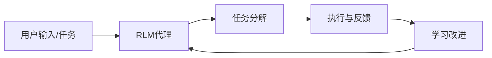

## 今日热点

AI代理技术爆发式增长，专业领域应用加速渗透，同时代码智能分析工具成为开发者关注焦点，大公司持续参与开源AI生态建设。

---

## 热门项目一览

| 排名 | 项目 | 语言 | 今日 | 总计 | 简介 |
|:---:|------|:----:|------:|-----:|------|
| 1 | [PrimeIntellect-ai/prime-agent](https://github.com/PrimeIntellect-ai/prime-agent) | TypeScript | +2,356 | 11,107 | A self-improving RLM agent ... |
| 2 | [msitarzewski/agency-agents](https://github.com/msitarzewski/agency-agents) | Shell | +858 | 140,687 | A complete AI agency at you... |
| 3 | [addyosmani/agent-skills](https://github.com/addyosmani/agent-skills) | JavaScript | +680 | 85,141 | Production-grade engineerin... |
| 4 | [google/skills](https://github.com/google/skills) | Python | +528 | 17,231 | Agent Skills for Google pro... |
| 5 | [Comfy-Org/ComfyUI](https://github.com/Comfy-Org/ComfyUI) | Python | +365 | 125,526 | The most powerful and modul... |
| 6 | [goauthentik/authentik](https://github.com/goauthentik/authentik) | Python | +310 | 24,276 | The authentication glue you... |
| 7 | [ZhuLinsen/daily_stock_analysis](https://github.com/ZhuLinsen/daily_stock_analysis) | Python | +306 | 61,194 | LLM 驱动的多市场股票智能分析系统：多源行情、实时新... |
| 8 | [pranshuparmar/witr](https://github.com/pranshuparmar/witr) | Go | +210 | 20,667 | Why is this running? Trace ... |
| 9 | [pingdotgg/t3code](https://github.com/pingdotgg/t3code) | TypeScript | +163 | 17,660 | No description |
| 10 | [vitali87/code-graph-rag](https://github.com/vitali87/code-graph-rag) | Python | +96 | 2,987 | The ultimate RAG for your m... |
| 11 | [google-deepmind/weathernext](https://github.com/google-deepmind/weathernext) | Python | +86 | 7,090 | No description |
| 12 | [harveyai/harvey-labs](https://github.com/harveyai/harvey-labs) | Python | +47 | 827 | A benchmark built to evalua... |

---

## 趋势洞察

```
┌─────────────────────────────────────────────────────────────────┐
│  AI/ML 工具         ████████████████████████  8 个项目        │
│  其他               ██████                    2 个项目        │
│  多媒体应用            ███                       1 个项目        │
│  安全工具             ███                       1 个项目        │
└─────────────────────────────────────────────────────────────────┘
```

---

## 项目深度解读

### 1. PrimeIntellect-ai/prime-agent — 智能编程助手

> **一句话总结**：自我改进的AI代理，专注于自动化编程任务和长期自主工作流。

#### 价值主张

| 维度 | 说明 |
|------|------|
| **解决痛点** | 解决AI编程助手无法持续学习和处理复杂长期任务的问题 |
| **目标用户** | 软件开发者、自动化工程师、AI研究人员 |
| **核心亮点** | 自我学习能力 + 编程任务优化 + 长期任务执行 + 自主决策 + 持续改进 |

#### 技术架构



**技术特色**：
- 基于强化学习的自我改进机制
- 长期任务规划与执行能力
- 编程工作流优化系统

#### 热度分析

- 单日增长2356 stars，显示极高的关注度与认可度
- 零Open Issues表明项目维护状态良好，问题解决效率高

#### 快速上手

```bash
# 克隆项目
git clone https://github.com/PrimeIntellect-ai/prime-agent.git
cd prime-agent
# 安装依赖
npm install
# 运行示例
npm run example
```

#### 注意事项

- 项目许可证未知，使用前需确认开源协议
- 项目可能需要较高的计算资源，特别是涉及长期任务时
- 作为AI代理，可能需要适当的提示工程才能发挥最佳性能


### 2. msitarzewski/agency-agents — AI代理工具集

> **一句话总结**：提供一系列专业领域的AI代理，从前端开发到社区管理，满足多样化任务需求。

#### 价值主张

| 维度 | 说明 |
|------|------|
| **解决痛点** | 用户无需寻找多个专业AI工具，一站式获取各类专家代理 |
| **目标用户** | 开发者、内容创作者、社区管理员、多领域专业人士 |
| **核心亮点** | 多专业代理集合 + 即插即用设计 + 个性化交互体验 |

#### 技术架构


**技术特色**：
- Shell脚本实现，轻量级跨平台部署
- 模块化代理架构，易于扩展新专家
- 命令行交互界面，简洁高效操作

#### 热度分析

- 项目获得14万+星标，近期增长迅猛，表明在AI代理领域具有高认可度
- 作为AI工具集合项目，在AI技术爆发期占据生态优势位置

#### 快速上手

```bash
# 克隆项目
git clone https://github.com/msitarzewski/agency-agents.git
cd agency-agents
# 列出可用代理
./list-agents.sh
```

#### 注意事项

- 项目使用Unknown许可证，使用前需确认具体开源协议条款
- 基于Shell脚本实现，推荐在Unix-like系统运行
- 不同代理可能有特定依赖，使用前需检查配置要求


### 3. addyosmani/agent-skills — AI代理技能库

> **一句话总结**：为AI编程代理提供生产级工程技能，提升代码质量与开发效率。

#### 价值主张

| 维度 | 说明 |
|------|------|
| **解决痛点** | 解决AI编程代理在实际生产环境中的工程能力不足问题 |
| **目标用户** | AI开发者、编程代理工具构建者、自动化测试工程师 |
| **核心亮点** | 生产级工程规范 + 多语言支持 + 最佳实践集成 + 可扩展架构 |

#### 技术架构


**技术特色**：
- 基于JavaScript的轻量级技能库架构
- 支持多种编程语言和开发框架
- 内置代码质量评估与优化机制

#### 热度分析

- 项目Star数超8.5万，日均增长680+，处于快速增长期
- 社区活跃度高，Fork占比近11%，用户参与度强

#### 快速上手

```bash
# 安装依赖
npm install agent-skills

# 初始化技能库
npx agent-skills init

# 应用技能到AI代理
agent-skills apply --skill production-quality
```

#### 注意事项

- 项目许可证未知，商业使用前需确认授权条款
- Open Issues为0，建议通过其他渠道反馈问题
- 依赖Node.js环境，需确保兼容性


### 4. google/skills — Google智能技能库

> **一句话总结**：为Google产品提供可复用的AI代理技能集合，简化与Google服务的智能交互。

#### 价值主张

| 维度 | 说明 |
|------|------|
| **解决痛点** | 简化与Google产品集成复杂性，提供开箱即用的AI交互能力 |
| **目标用户** | Google服务开发者、AI应用构建者、智能代理系统设计师 |
| **核心亮点** | 模块化技能设计 + 跨Google产品支持 + 易于扩展的技能框架 |

#### 技术架构


**技术特色**：
- 采用模块化设计，每个技能可独立开发和部署
- 提供统一的Google产品API访问接口
- 支持异步处理，提高响应效率

#### 热度分析

- 项目获得17K+星标且近期增长迅速，表明开发者社区对Google产品智能集成需求强烈
- 无开放问题反映项目维护良好，社区可能通过其他渠道交流支持

#### 快速上手

```bash
# 安装项目
pip install google-skills

# 初始化技能库
google-skills init

# 添加Google产品技能
google-skills add gmail calendar drive

# 运行示例代理
google-skills run --agent demo
```

#### 注意事项

- 项目依赖Google API密钥，需要确保API访问权限配置正确
- 部分Google服务可能有使用限制，需注意配额和速率限制
- 技能库更新频繁，建议定期检查最新版本和文档


### 5. Comfy-Org/ComfyUI — 节点式AI绘图

> **一句话总结**：基于节点图界面的强大扩散模型GUI与API，实现模块化AI图像生成工作流。

#### 价值主张

| 维度 | 说明 |
|------|------|
| **解决痛点** | 提供直观可视化界面，简化复杂AI图像生成流程 |
| **目标用户** | AI艺术家、研究人员和开发者 |
| **核心亮点** | 节点式工作流 + 高度模块化 + API支持 + 多模型集成 |

#### 技术架构


**技术特色**：
- 基于节点图的可视化编程环境，降低AI模型使用门槛
- 模块化设计支持多种扩散模型无缝集成
- 提供完整API接口，便于与其他系统集成

#### 热度分析

- 项目Star数超12.5万且持续快速增长，表明其在AI绘图领域具有显著影响力
- 高活跃度社区，成为AI创意工作流的重要基础设施

#### 快速上手

```bash
# 克隆项目
git clone https://github.com/comfy-org/ComfyUI.git
# 安装依赖
pip install -r requirements.txt
# 启动服务
python main.py
```

#### 注意事项

- 需要较强的GPU支持，推荐使用NVIDIA显卡
- 初次使用可能需要学习节点图系统的基本概念
- 模型文件需要单独下载并放置到指定目录


### 6. goauthentik/authentik — 统一身份认证平台

> **一句话总结**：开源身份认证与访问管理平台，提供统一身份认证解决方案。

#### 价值主张

| 维度 | 说明 |
|------|------|
| **解决痛点** | 解决企业应用身份认证碎片化问题 |
| **目标用户** | 企业IT部门及DevOps团队 |
| **核心亮点** | 多协议支持 + 统一身份管理 + 可扩展架构 + 开源免费 |

#### 技术架构


**技术特色**：
- 基于Go语言构建的高性能认证服务
- 支持多种身份验证协议和标准
- 提供灵活的API接口和集成能力

#### 热度分析

- Star数24,276且单日增长310，显示项目人气迅速上升，需求旺盛
- 作为身份认证解决方案，在DevOps和云原生领域占据重要生态位置

#### 快速上手

```bash
# 安装authentik
pip install authentik

# 初始化配置
authentik migrate
```

#### 注意事项

- 需要确保与现有系统的兼容性
- 注意身份认证数据的备份和安全
- 生产环境部署需考虑高可用性和性能优化


### 7. ZhuLinsen/daily_stock_analysis — AI股票分析系统

> **一句话总结**：基于大语言模型的多市场股票智能分析系统，整合多源数据与实时新闻，提供自动化决策支持。

#### 价值主张

| 维度 | 说明 |
|------|------|
| **解决痛点** | 传统股票分析工具数据单一、分析不够智能，难以应对复杂多变的市场 |
| **目标用户** | 个人投资者、量化交易者、金融分析师和投资机构 |
| **核心亮点** | LLM驱动智能分析 + 多源市场数据整合 + 实时新闻分析 + 自动化决策看板 + 零成本运行 |

#### 技术架构


**技术特色**：
- 基于大语言模型进行智能分析解读
- 多源数据整合与实时更新机制
- 零成本运行的轻量化设计

#### 热度分析

- 项目获得6万+ stars且持续增长，显示市场对AI股票分析工具的高度认可
- Fork数量接近5.2万，表明项目有很强的实用价值和二次开发潜力

#### 快速上手

```bash
# 克隆项目
git clone https://github.com/ZhuLinsen/daily_stock_analysis.git

# 安装依赖
pip install -r requirements.txt

# 运行分析
python run_analysis.py
```

#### 注意事项

- 需要配置API密钥获取市场数据
- 注意遵守数据使用政策，避免违规获取数据
- 建议在测试环境验证后再投入实际使用


### 8. pranshuparmar/witr — 系统溯源工具

> **一句话总结**：一个强大的Go工具，可追溯进程、端口、容器或文件的启动源头，提供CLI和TUI两种交互方式。

#### 价值主张

| 维度 | 说明 |
|------|------|
| **解决痛点** | 解决系统资源来源不明的痛点，帮助用户理解系统运行状态 |
| **目标用户** | 系统管理员、开发者、DevOps工程师 |
| **核心亮点** | 深度溯源 + 多资源类型支持 + TUI交互体验 |

#### 技术架构


**技术特色**：
- 基于Go语言实现，性能高效
- 支持多种系统资源类型的追踪
- 提供直观的TUI界面，简化系统分析

#### 热度分析

- 项目获得超过2万星且持续增长，表明其解决了系统管理的普遍痛点
- Fork数相对较少，可能反映项目使用门槛较高或处于早期阶段

#### 快速上手

```bash
# 安装
go install github.com/pranshuparmar/witr@latest

# 运行
witr
```

#### 注意事项

- 需要系统权限才能获取进程和系统信息
- 可能仅支持特定操作系统（如Linux/macOS）
- 项目许可证未知，商业使用需谨慎


### 9. pingdotgg/t3code — T3代码生成器

> **一句话总结**：T3 Stack的官方代码生成工具，加速全栈应用开发流程。

#### 价值主张

| 维度 | 说明 |
|------|------|
| **解决痛点** | 消除重复样板代码，标准化项目初始化流程 |
| **目标用户** | T3 Stack框架开发者和全栈应用构建者 |
| **核心亮点** | 类型安全 + 项目脚手架 + 组件集成 + 自定义模板 |

#### 技术架构


**技术特色**：
- 基于TypeScript的强类型代码生成系统
- 无缝集成Next.js、tRPC和Tailwind CSS
- 支持Monorepo和多项目模板

#### 热度分析

- 项目Star持续增长，日均增量约160，社区活跃度高
- Fork与Star比例健康，表明项目被广泛采用和二次开发

#### 快速上手

```bash
# 全局安装t3code
npm install -g t3code

# 创建新项目
t3code create my-app

# 进入项目目录
cd my-app

# 启动开发服务器
npm run dev
```

#### 注意事项
- 需要Node.js 16+环境
- 建议先了解T3 Stack核心概念
- 自定义模板需要TypeScript和项目架构知识


### 10. vitali87/code-graph-rag — 代码知识图谱

> **一句话总结**：基于知识图谱的AI代码助手，支持多语言代码库的智能查询与编辑。

#### 价值主张

| 维度 | 说明 |
|------|------|
| **解决痛点** | 解决大型多语言代码库难以理解和智能编辑的挑战 |
| **目标用户** | 复杂代码库的开发团队和技术负责人 |
| **核心亮点** | 知识图谱构建+AI查询+多语言支持+代码智能编辑+仓库级理解 |

#### 技术架构


**技术特色**：
- 知识图谱增强代码理解能力
- 多语言代码库统一处理框架
- AI驱动的代码智能编辑建议

#### 热度分析

- 项目获得近3K星，日增96星，520次Fork，显示强劲增长势头
- 0个Open Issues表明项目可能处于稳定状态或问题处理机制高效

#### 快速上手

```bash
# 克隆项目
git clone https://github.com/vitali87/code-graph-rag.git
cd code-graph-rag

# 安装依赖
pip install -r requirements.txt

# 初始化代码库
python init.py --path /path/to/your/codebase
```

#### 注意事项

- 由于项目没有明确的许可证信息，使用前需确认授权条款
- 项目可能需要大量计算资源处理大型代码库
- AI功能可能依赖于特定的API服务，需配置相应密钥


### 11. google-deepmind/weathernext — AI气象预测系统

> **一句话总结**：基于深度学习的全球高精度气象预测模型，提供未来14天天气预测。

#### 价值主张

| 维度 | 说明 |
|------|------|
| **解决痛点** | 传统气象模型计算资源需求高，预测精度有限 |
| **目标用户** | 气象机构、科研人员、气候相关行业决策者 |
| **核心亮点** | 深度学习模型 + 高精度预测 + 低计算资源需求 |

#### 技术架构


**技术特色**：
- 采用深度神经网络替代传统数值天气预报方法
- 结合物理规律和数据驱动的混合建模方法
- 提供概率性预测而非确定性预测

#### 热度分析

- 项目Star数持续增长，近期每日新增约86个Star，显示学术界和工业界高度关注
- 作为DeepMind在AI for Science领域的重要成果，在气象AI领域具有标杆意义

#### 快速上手

```bash
# 安装依赖
pip install weathernext

# 基本预测示例
weathernext --input data.nc --output forecast.nc --days 14
```

#### 注意事项

- 模型可能需要较强的计算资源才能运行
- 预测结果应与传统气象模型结合使用，作为补充而非替代
- 需要专业的气象学知识才能正确解释模型输出


### 12. harveyai/harvey-labs — 法律AI基准

> **一句话总结**：构建用于评估和提升法律工作支持能力的AI代理基准测试平台

#### 价值主张

| 维度 | 说明 |
|------|------|
| **解决痛点** | 缺乏标准化的法律AI代理能力评估基准体系 |
| **目标用户** | 法律AI开发者、法律科技研究团队 |
| **核心亮点** | 专业法律场景覆盖 + 多维度评估指标 + 可扩展测试框架 |

#### 技术架构


**技术特色**：
- 专业化法律领域测试场景设计
- 多维度能力评估指标体系
- 开放可扩展的测试架构

#### 热度分析

- Star增长迅速，近47个新Star，显示法律AI领域关注度高
- Fork数量适中，表明项目处于早期阶段，社区正在逐步形成

#### 快速上手

```bash
# 克隆项目
git clone https://github.com/harveyai/harvey-labs.git

# 安装依赖
pip install -r requirements.txt
```

#### 注意事项

- 项目许可证信息不明确，商业使用前需确认授权条款
- 作为基准测试项目，使用者需具备一定的法律领域专业知识以正确解读测试结果


## 今日推荐

| 主题 | 推荐项目 | 亮点 |
|------|----------|------|
| 今日最热 | [PrimeIntellect-ai/prime-agent](https://github.com/PrimeIntellect-ai/prime-agent) | A self-improving ... |
| 值得关注 | [msitarzewski/agency-agents](https://github.com/msitarzewski/agency-agents) | A complete AI age... |
| 快速上手 | [addyosmani/agent-skills](https://github.com/addyosmani/agent-skills) | Production-grade ... |
| 长期潜力 | [google/skills](https://github.com/google/skills) | Agent Skills for ... |

---

<div align="center">

*Generated on 2026-08-10 | Powered by GitHub Trending Reporter*

</div>