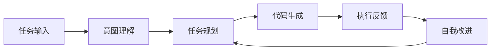
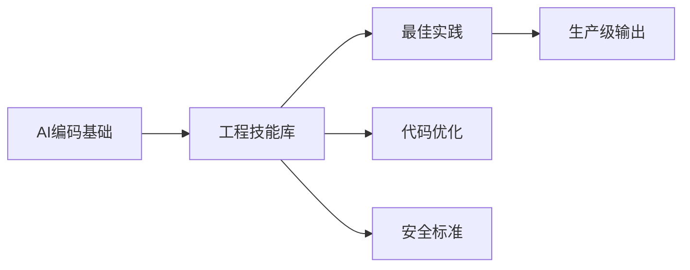
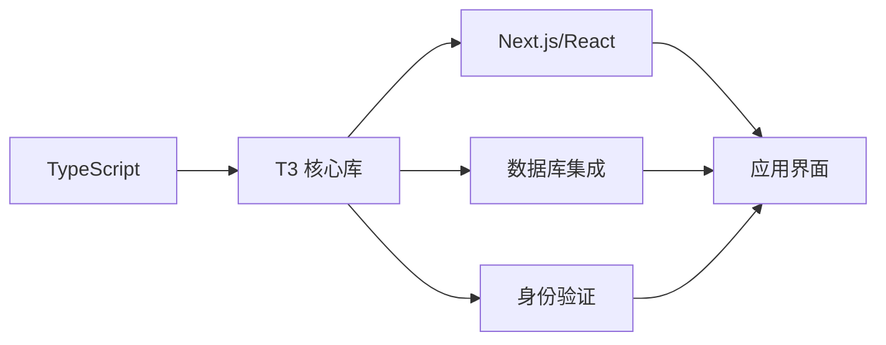
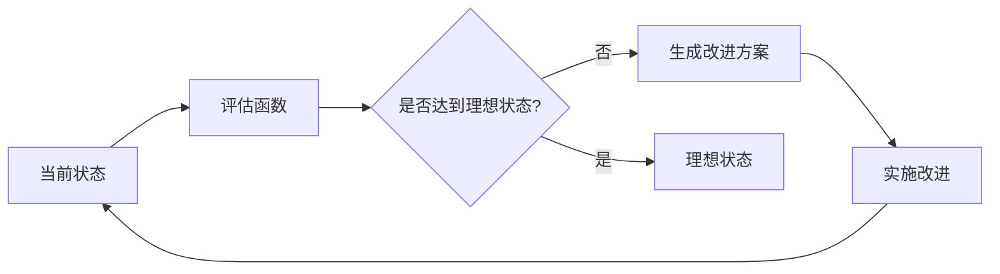
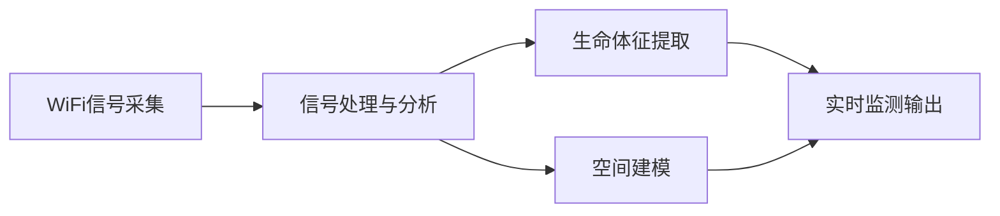
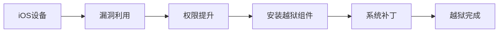
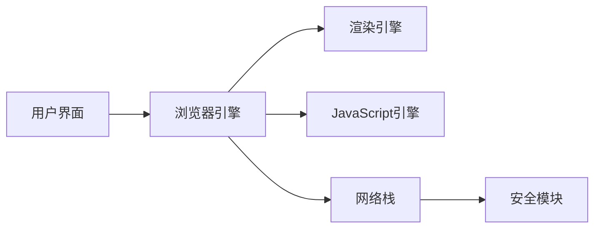

## 今日热点

AI代理系统与网页数据处理工具成为今日GitHub热点，特别是多智能体协作框架和大规模网页内容提取技术受到开发者高度关注。

---

## 热门项目一览

| 排名 | 项目 | 语言 | 今日 | 总计 | 简介 |
|:---:|------|:----:|------:|-----:|------|
| 1 | [PrimeIntellect-ai/prime-agent](https://github.com/PrimeIntellect-ai/prime-agent) | TypeScript | +2,642 | 13,074 | A self-improving RLM agent ... |
| 2 | [msitarzewski/agency-agents](https://github.com/msitarzewski/agency-agents) | Shell | +1,349 | 141,832 | A complete AI agency at you... |
| 3 | [semantica-agi/semantica](https://github.com/semantica-agi/semantica) | Python | +970 | 4,103 | Graph-Native Infrastructure... |
| 4 | [Comfy-Org/ComfyUI](https://github.com/Comfy-Org/ComfyUI) | Python | +922 | 126,323 | The most powerful and modul... |
| 5 | [firecrawl/firecrawl](https://github.com/firecrawl/firecrawl) | TypeScript | +835 | 165,076 | The context API to search, ... |
| 6 | [vitali87/code-graph-rag](https://github.com/vitali87/code-graph-rag) | Python | +682 | 3,533 | The ultimate RAG for your m... |
| 7 | [addyosmani/agent-skills](https://github.com/addyosmani/agent-skills) | JavaScript | +659 | 85,743 | Production-grade engineerin... |
| 8 | [pingdotgg/t3code](https://github.com/pingdotgg/t3code) | TypeScript | +389 | 18,030 | No description |
| 9 | [google-deepmind/weathernext](https://github.com/google-deepmind/weathernext) | Python | +325 | 7,354 | No description |
| 10 | [danielmiessler/LifeOS](https://github.com/danielmiessler/LifeOS) | TypeScript | +315 | 17,913 | ⛰️A General Hill-climbing A... |
| 11 | [NanmiCoder/MediaCrawler](https://github.com/NanmiCoder/MediaCrawler) | Python | +259 | 61,022 | 小红书笔记 | 评论爬虫、抖音视频 | 评论爬虫、快手... |
| 12 | [paperclipai/paperclip](https://github.com/paperclipai/paperclip) | TypeScript | +198 | 76,488 | The open-source app everyon... |

---

## 趋势洞察

```
┌─────────────────────────────────────────────────────────────────┐
│  AI/ML 工具         ████████████████████████  9 个项目        │
│  其他               ██████████                4 个项目        │
│  多媒体应用            ████████                  3 个项目        │
└─────────────────────────────────────────────────────────────────┘
```

---

## 项目深度解读

### 1. PrimeIntellect-ai/prime-agent — 自主编程助手

> **一句话总结**：一个自我进化的AI智能体，专为复杂编程任务和长期自主工作流设计。

#### 价值主张

| 维度 | 说明 |
|------|------|
| **解决痛点** | 简化复杂编程任务自动化，减少人工干预需求 |
| **目标用户** | 开发者、自动化工程师、AI应用研究者 |
| **核心亮点** | 自我学习能力 + 长期任务执行 + 编程专业化 + 持续优化 + 自主决策 |

#### 技术架构



**技术特色**：
- 基于强化学习的持续自我优化机制
- TypeScript实现确保类型安全和开发效率
- 支持长时间运行的任务状态保持和恢复

#### 热度分析

- 项目Star数13,074且单日激增2,642，显示极强的应用价值和社区关注度
- Fork数1,326表明开发者积极参与二次开发和功能扩展

#### 快速上手

```bash
# 克隆项目
git clone https://github.com/PrimeIntellect-ai/prime-agent.git

# 安装依赖
npm install

# 启动示例
npm run dev
```

#### 注意事项

- 项目许可证未知，商业使用前需确认授权条款
- Open Issues为0可能表明问题通过其他渠道管理，建议关注社区讨论
- 作为AI代理项目，可能需要较高的计算资源支持


### 2. msitarzewski/agency-agents — AI代理集合

> **一句话总结**：提供多种专业AI代理脚本，覆盖前端开发、社区管理等多个领域，每个代理都有独特个性和专长。

#### 价值主张

| 维度 | 说明 |
|------|------|
| **解决痛点** | 提供即用型专业AI代理，无需从零构建AI解决方案 |
| **目标用户** | 开发者、内容创作者、社区管理者、自动化需求者 |
| **核心亮点** | 多样化专业代理 + 即插即用架构 + 个性化设定 + 完整工作流程 + 可扩展设计 |

#### 技术架构


**技术特色**：
- 模块化设计，每个代理独立封装为Shell脚本
- 轻量级实现，无需复杂依赖
- 灵活的配置系统，可适应不同场景需求
- 与各种AI服务API的集成接口

#### 热度分析

- 项目获得超过14万星，单日增长1300+，表明用户需求旺盛
- 高Fork数显示社区积极参与和定制化应用，生态活跃

#### 快速上手

```bash
# 克隆项目
git clone https://github.com/msitarzewski/agency-agents.git

# 进入目录并查看可用代理
cd agency-agents
ls agents/

# 运行特定代理（示例）
./agents/frontend-wizard.sh "创建一个响应式网页"
```

#### 注意事项

- 需要确保系统已安装必要的依赖（如curl, jq等）
- 某些代理可能需要配置API密钥才能正常工作
- Shell脚本在Windows上可能需要额外配置才能运行
- 使用前建议阅读每个代理的文档以了解其具体功能和使用限制


### 3. semantica-agi/semantica — 图原生AI基础设施

> **一句话总结**：构建图原生基础设施，支持上下文感知和可解释的AI系统。

#### 价值主张

| 维度 | 说明 |
|------|------|
| **解决痛点** | 解决AI系统缺乏上下文理解和可解释性的问题 |
| **目标用户** | AI研究人员、开发者及需要可解释AI的组织 |
| **核心亮点** | 图原生架构 + 上下文建模 + 可解释性 + 责任追踪 |

#### 技术架构


**技术特色**：
- 图原生架构，适合处理复杂关系数据
- 上下文感知能力，增强AI理解能力
- 可解释性机制，提高AI决策透明度

#### 热度分析

- 项目近期获得大量关注，单日增长970 stars，表明社区高度认可
- Fork数量相对较少，可能项目处于早期阶段，社区贡献正在形成

#### 快速上手

```bash
# 安装项目
pip install semantica

# 基本使用示例
from semantica import SemanticGraph
graph = SemanticGraph()
graph.add_context(...)
result = graph.process(input_data)
```

#### 注意事项

- 项目文档可能不够完善，需要参考源码
- 许可证信息不明确，使用前需确认商业使用条款
- 项目处于活跃开发阶段，API可能会有变化


### 4. Comfy-Org/ComfyUI — 节点式AI创作

> **一句话总结**：基于节点式界面的强大扩散模型工作流工具，可视化操作实现复杂AI艺术创作。

#### 价值主张

| 维度 | 说明 |
|------|------|
| **解决痛点** | 传统AI绘画工具操作不灵活，难以构建复杂工作流和高级定制 |
| **目标用户** | AI艺术家、研究人员和需要高度自定义扩散模型应用的开发者 |
| **核心亮点** | 节点式可视化界面 + 高度模块化设计 + 强大的API支持 + 无缝工作流连接 |

#### 技术架构


**技术特色**：
- 基于节点的模块化架构，各功能组件可独立开发和扩展
- 支持多种扩散模型和自定义节点，实现灵活的功能组合
- 采用事件驱动设计，高效处理复杂并行计算任务
- 提供完整API接口，便于自动化集成和二次开发

#### 热度分析
- 项目Star数超12.6万，单日增长900+，处于快速增长期，受AI创作领域高度关注
- Fork数与Star比例合理，表明用户不仅关注项目，还积极参与二次开发，社区活跃度高

#### 快速上手

```bash
# 克隆仓库
git clone https://github.com/comfy-org/ComfyUI.git
# 安装依赖
pip install -r requirements.txt
# 运行服务
python main.py
```

#### 注意事项
- 需要较强大的GPU支持，特别是处理高分辨率图像或复杂工作流时
- 节点系统学习曲线较陡，初次使用可能需要适应时间
- 某些高级功能可能需要编程知识或自定义开发节点的能力


### 5. firecrawl/firecrawl — 大规模网络爬取API

> **一句话总结**：提供高效可扩展的网络搜索、抓取与交互API，助力大规模数据获取。

#### 价值主张

| 维度 | 说明 |
|------|------|
| **解决痛点** | 解决传统爬虫在规模、速度和准确性方面的限制 |
| **目标用户** | 需要大规模网络数据的企业、开发者和研究人员 |
| **核心亮点** | 高效爬取+智能内容提取+可扩展API设计+多格式输出+抗反爬机制 |

#### 技术架构


**技术特色**：
- 采用TypeScript构建，提供类型安全和开发体验
- 智能识别和过滤网页内容，提高数据质量
- 支持分布式爬取，适应大规模数据获取需求

#### 热度分析

- 项目Star数超16万，日增800+，处于高速增长阶段
- 作为网络数据获取领域的领先工具，社区活跃度和贡献度极高

#### 快速上手

```bash
# 安装
npm install firecrawl

# 基本使用
import { Firecrawl } from 'firecrawl';
const firecrawl = new Firecrawl();
const result = await firecrawl.scrapeUrl('https://example.com');
```

#### 注意事项

- 遵守目标网站的robots.txt和使用条款，避免过度请求
- 注意处理反爬机制，设置合理的请求间隔和代理
- 考虑数据存储和处理方案，特别是大规模数据场景


### 6. vitali87/code-graph-rag — 代码智能分析系统

> **一句话总结**：基于知识图谱的代码库智能查询与编辑系统，支持多语言monorepo的AI辅助理解与修改。

#### 价值主张

| 维度 | 说明 |
|------|------|
| **解决痛点** | 大型多语言代码库难以理解和维护，缺乏智能化的代码分析与编辑工具 |
| **目标用户** | 多语言monorepo的开发团队、技术负责人和代码维护者 |
| **核心亮点** | 知识图谱构建 + AI增强 + 多语言支持 + 代码智能查询 + 代码编辑辅助 |

#### 技术架构


**技术特色**：
- 基于知识图谱的代码语义理解与关系建模
- RAG技术增强代码检索与生成能力
- 多语言代码库统一分析与理解框架

#### 热度分析

- 项目近期热度快速上升，单日Star增长682，表明AI代码工具需求旺盛
- Fork数547，社区参与度较高，但主要关注项目进展而非二次开发

#### 快速上手

```bash
# 安装项目依赖
pip install -e code-graph-rag

# 初始化知识图谱
code-graph-rag init --path /path/to/monorepo

# 启动查询服务
code-graph-rag serve
```

#### 注意事项

- 项目需要较强的计算资源支持，特别是AI模型推理部分
- 对于大型代码库，知识图谱构建可能需要较长时间
- 许可证信息不明确，使用前需确认开源许可条款
- 项目仍处于早期阶段，API和功能可能会有较大变化


### 7. addyosmani/agent-skills — AI工程技能

> **一句话总结**：为AI编码助手提供生产级工程技能和实践指导，提升代码质量与效率。

#### 价值主张

| 维度 | 说明 |
|------|------|
| **解决痛点** | AI生成代码质量参差不齐，缺乏工程化标准与最佳实践 |
| **目标用户** | AI模型开发者、高级工程师、技术团队负责人 |
| **核心亮点** | 工程最佳实践 + 代码质量标准 + 性能优化 + 安全性考量 + 可维护性设计 |

#### 技术架构



**技术特色**：
- 提供结构化的AI编码指导框架
- 融入现代前端和工程最佳实践
- 注重代码质量和性能优化

#### 热度分析

- 项目Star数超过8.5万且持续快速增长，表明AI工程领域需求旺盛
- 作为AI编码助手工程化的重要参考，在开发者社区中具有显著影响力

#### 快速上手

```bash
# 克隆项目
git clone https://github.com/addyosmani/agent-skills.git
# 进入目录
cd agent-skills
# 查看文档
cat README.md
```

#### 注意事项

- 本项目主要关注AI编码助手的工程化实践，而非AI模型本身
- 需要结合具体AI工具和框架进行应用，不是独立运行的软件
- 持续关注项目更新，因为AI编码领域发展迅速


### 8. pingdotgg/t3code — TypeScript 全栈框架

> **一句话总结**：一个现代化的 TypeScript 全栈开发框架，提供类型安全和高性能的开发体验。

#### 价值主张

| 维度 | 说明 |
|------|------|
| **解决痛点** | 简化全栈应用开发，提供统一的类型安全解决方案 |
| **目标用户** | TypeScript 开发者和全栈应用构建者 |
| **核心亮点** | 类型安全 + 开箱即用 + 高性能 + 优化开发体验 + 统一架构 |

#### 技术架构



**技术特色**：
- 采用 TypeScript 作为核心开发语言，提供端到端类型安全
- 集成现代前端框架与后端解决方案，支持全栈开发
- 内置身份验证、数据库连接等常见功能模块
- 提供优化的项目结构和开发工具链

#### 热度分析

- 项目 Star 数超过 18,000，近期增长稳定，表明社区认可度高
- Fork 数达 4,000+，显示开发者积极参与项目定制和扩展

#### 快速上手

```bash
# 创建新项目
npx create-t3-app@latest my-app
cd my-app
npm install
npm run dev
```

#### 注意事项

- 需要安装 Node.js 16.0 或更高版本
- 根据项目文档配置数据库连接和环境变量
- 建议先阅读官方文档了解项目结构和最佳实践


### 9. google-deepmind/weathernext — AI气象预测

> **一句话总结**：基于深度学习的下一代高精度气象预测系统，提升预报准确率与时效性。

#### 价值主张

| 维度 | 说明 |
|------|------|
| **解决痛点** | 突破传统数值天气预报局限，提高极端天气预警能力 |
| **目标用户** | 气象研究机构、能源行业、农业部门、政府应急部门 |
| **核心亮点** | 深度学习模型 + 高分辨率预测 + 多尺度气象特征融合 |

#### 技术架构


**技术特色**：
- 基于Transformer架构的时空序列预测模型
- 多尺度气象特征融合技术
- 分布式计算框架支持大规模气象数据处理

#### 热度分析

- 项目获得7.3k+ star，显示AI在气象领域应用受到高度关注
- 作为Deepmind项目，代表了前沿科技与传统气象学的创新结合

#### 快速上手

```bash
# 安装依赖
pip install -r requirements.txt

# 运行示例预测
python predict.py --input data/sample.nc --output forecast.nc
```

#### 注意事项
- 项目需要高性能计算资源支持
- 气象数据预处理是关键步骤，需确保数据质量
- 模型训练需要大量历史气象数据


### 10. danielmiessler/LifeOS — 生活AI框架

> **一句话总结**：基于爬山算法的AI框架，帮助用户系统化实现从当前状态到理想状态的转变。

#### 价值主张

| 维度 | 说明 |
|------|------|
| **解决痛点** | 解决个人发展和目标实现过程中缺乏系统化方法论的问题 |
| **目标用户** | 寻求自我提升、希望系统化实现个人和职业目标的个人 |
| **核心亮点** | AI驱动 + 系统化方法 + 可持续改进 + 跨领域应用 |

#### 技术架构



**技术特色**：
- 基于爬山算法的优化框架
- TypeScript实现，确保类型安全
- AI辅助的决策支持系统
- 可扩展的模块化架构

#### 热度分析

- 项目获得近18k星，单日新增315星，表明社区对其概念和实用性高度认可
- 高Fork数(2365)显示用户积极参与二次开发和个性化定制，生态活跃

#### 快速上手

```bash
# 克隆仓库
git clone https://github.com/danielmiessler/LifeOS.git

# 安装依赖
npm install

# 运行示例
npm run example
```

#### 注意事项

- 项目许可证信息未知，使用前需确认授权条款
- 作为生活和工作优化框架，实际效果取决于用户持续投入和实践
- 项目可能需要结合个人实际情况进行定制化调整


### 11. NanmiCoder/MediaCrawler — 全平台爬虫

> **一句话总结**：一个支持多平台内容采集的Python爬虫项目，可批量获取小红书、抖音、B站等主流平台数据。

#### 价值主张

| 维度 | 说明 |
|------|------|
| **解决痛点** | 统一爬取多平台数据，解决分散爬取效率低、维护成本高的问题 |
| **目标用户** | 数据分析师、内容创作者、市场研究人员、学术研究者 |
| **核心亮点** | 多平台支持 + 高并发处理 + 自动化数据存储 + 反爬机制规避 |

#### 技术架构


**技术特色**：
- 模块化设计，每个平台独立实现，便于扩展和维护
- 采用异步IO提高爬取效率，支持大规模并发请求
- 内置多种反爬策略，模拟真实用户行为降低被封风险

#### 热度分析

- 项目Star数超6万，近期增长稳定，日均新增约260个Star，显示项目在数据采集领域有较高认可度
- Fork数与Star数比例接近1:5，表明项目不仅被关注，也被大量用户实际使用和二次开发

#### 快速上手

```bash
# 克隆项目
git clone https://github.com/NanmiCoder/MediaCrawler.git
cd MediaCrawler

# 安装依赖
pip install -r requirements.txt

# 配置运行参数并启动
python run.py platform_name
```

#### 注意事项

- 使用前请确认目标平台的服务条款，避免违反规定
- 项目可能需要定期更新以适应平台反爬策略的变化
- 建议合理设置爬取频率，避免对平台服务器造成过大压力
- 不同平台的爬取功能可能需要不同的API密钥或认证信息


### 12. paperclipai/paperclip — 智能代理管理

> **一句话总结**：开源团队协作平台，提供智能代理管理功能，简化工作流程自动化。

#### 价值主张

| 维度 | 说明 |
|------|------|
| **解决痛点** | 简化工作场景中多代理协作与管理流程 |
| **目标用户** | 团队协作需求高的企业用户和开发团队 |
| **核心亮点** | 智能代理编排 + 工作流自动化 + 开源可定制 + 易于集成 |

#### 技术架构


**技术特色**：
- TypeScript全栈开发，保证类型安全
- 模块化代理设计，支持灵活扩展
- 开源架构，社区驱动迭代

#### 热度分析

- 高关注度项目，日均增长约200星，Fork比接近1:5，表明社区参与度高
- 在AI代理管理工具领域占据领先地位，形成了一定的生态影响力

#### 快速上手

```bash
# 克隆项目
git clone https://github.com/paperclipai/paperclip.git
# 安装依赖
npm install
# 启动开发服务器
npm run dev
```

#### 注意事项

- 项目需要一定的TypeScript和Node.js基础才能完全理解和定制
- 作为开源项目，使用前需自行部署和维护，可能需要额外的配置工作


### 13. TauricResearch/TradingAgents — 智能交易框架

> **一句话总结**：基于多智能体大语言模型的金融交易框架，实现自动化交易决策与执行。

#### 价值主张

| 维度 | 说明 |
|------|------|
| **解决痛点** | 传统交易系统缺乏智能决策能力，难以应对复杂市场变化 |
| **目标用户** | 金融量化交易者、投资机构、算法交易开发者 |
| **核心亮点** | 多智能体协同 + 大语言模型决策 + 自动化交易执行 + 实时市场分析 + 回测框架 |

#### 技术架构


**技术特色**：
- 多智能体协同决策机制，提高交易策略的全面性
- 大语言模型集成，增强对市场动态的理解和预测能力
- 灵活的回测框架，支持策略验证与优化

#### 热度分析

- 高关注度项目，近10万星标显示其在量化交易领域的重要地位
- 社区活跃度高，大量fork表明被广泛研究和二次开发

#### 快速上手

```bash
# 克隆项目
git clone https://github.com/TauricResearch/TradingAgents.git
cd TradingAgents

# 安装依赖
pip install -r requirements.txt

# 运行示例
python examples/basic_trading_agent.py
```

#### 注意事项

- 需要具备一定的金融知识和Python编程基础
- 使用前应充分理解交易风险，建议先在模拟环境中测试
- 项目依赖大语言模型API，可能需要额外配置相关服务
- 实盘交易前需进行充分回测和风险评估


### 14. ruvnet/RuView — 无视觉感知系统

> **一句话总结**：利用WiFi信号实现无摄像头实时空间感知、生命体征监测和存在检测的技术

#### 价值主张

| 维度 | 说明 |
|------|------|
| **解决痛点** | 解决隐私保护下的非视觉空间感知需求 |
| **目标用户** | 注重隐私的家庭用户、医疗机构、安防系统开发者 |
| **核心亮点** | 无摄像头隐私保护 + 实时监测 + 低成本实现 + 高精度感知 |

#### 技术架构



**技术特色**：
- 利用WiFi信号反射和衰减变化进行非视觉感知
- 通过Rust实现高性能信号处理系统
- 实时分析人体对WiFi信号的干扰和反射特征
- 无需专用硬件，利用现有WiFi设备即可部署

#### 热度分析

- 项目获得近9万星，日增154星，表明在非视觉感知领域有高度关注度
- Fork数量超过1.1万，说明社区活跃度高，有大量开发者尝试二次开发

#### 快速上手

```bash
# 克隆项目
git clone https://github.com/ruvnet/RuView.git

# 构建项目
cd RuView
cargo build --release

# 运行示例
./target/release/ruview --scan
```

#### 注意事项
- 需要支持特定WiFi硬件才能获得最佳效果
- 精度可能受环境因素和WiFi信号强度影响
- 项目代码可能需要根据实际环境进行调整优化


### 15. opa334/Dopamine — iOS越狱工具

> **一句话总结**：Dopamine是一款针对iOS 15-16.0.1的半越狱工具，提供系统级自定义能力。

#### 价值主张

| 维度 | 说明 |
|------|------|
| **解决痛点** | iOS系统限制用户自定义和安装第三方应用，越狱可解除这些限制 |
| **目标用户** | 希望突破iOS系统限制，安装第三方应用和系统高级用户 |
| **核心亮点** | 支持多iOS版本 + 半越狱模式 + 基于FurySB漏洞 + 系统级权限 + 最新版本兼容 |

#### 技术架构



**技术特色**：
- 基于FurySB漏洞实现系统级访问
- 采用半越狱模式，兼顾稳定性和功能
- 使用C语言编写，高效且低资源占用
- 支持iOS 15到16.0.1多个版本
- 提供完整的越狱后环境配置

#### 热度分析

- 项目Star数超过6000，近期增长稳定，表明iOS越狱社区对该工具高度认可
- Fork数高于Star数，说明开发者积极参与二次开发和定制化改进

#### 快速上手

```bash
# 克隆项目
git clone https://github.com/opa334/Dopamine.git

# 进入目录
cd Dopamine

# 运行越狱脚本（具体命令可能因版本而异）
./dopamine.sh
```

#### 注意事项

- 越狱过程可能导致设备不稳定，建议提前备份数据
- 不同iOS版本可能有不同的越狱方法和限制
- 越狱可能导致设备失去保修资格
- 确保使用最新版本以获得最佳兼容性和安全性


### 16. LadybirdBrowser/ladybird — 独立浏览器引擎

> **一句话总结**：Ladybird是一款完全自主开发的网页浏览器，致力于打造不依赖现有浏览器引擎的独立解决方案。

#### 价值主张

| 维度 | 说明 |
|------|------|
| **解决痛点** | 解决浏览器引擎垄断问题，提供真正自主可控的浏览体验 |
| **目标用户** | 注重隐私安全、技术透明度和开源理念的普通用户与开发者 |
| **核心亮点** | 完全自研浏览器引擎 + 高性能渲染 + 极简设计 + 强调隐私保护 |

#### 技术架构



**技术特色**：
- 基于C++构建，追求高性能与内存效率
- 采用模块化设计，各组件职责清晰独立
- 支持现代Web标准，确保跨平台兼容性

#### 热度分析

- 项目Star数超6.5万且持续稳定增长，显示开发者社区对独立浏览器引擎的强烈兴趣
- 作为新兴浏览器项目，在开源浏览器领域具有独特生态位，吸引技术透明度高要求的用户

#### 快速上手

```bash
# 克隆仓库
git clone https://github.com/LadybirdBrowser/ladybird.git

# 构建项目
cd ladybird
./build.sh

# 运行浏览器
./bin/ladybird
```

#### 注意事项

- 项目目前处于早期开发阶段，功能可能不够完善
- 与主流网站的兼容性可能有待提高
- 构建过程可能需要较长时间和强大硬件支持
- License信息不明确，使用前需确认授权条款


## 今日推荐

| 主题 | 推荐项目 | 亮点 |
|------|----------|------|
| 今日最热 | [PrimeIntellect-ai/prime-agent](https://github.com/PrimeIntellect-ai/prime-agent) | A self-improving ... |
| 值得关注 | [msitarzewski/agency-agents](https://github.com/msitarzewski/agency-agents) | A complete AI age... |
| 快速上手 | [semantica-agi/semantica](https://github.com/semantica-agi/semantica) | Graph-Native Infr... |
| 长期潜力 | [Comfy-Org/ComfyUI](https://github.com/Comfy-Org/ComfyUI) | The most powerful... |

---

<div align="center">

*Generated on 2026-08-11 | Powered by GitHub Trending Reporter*

</div>